# Cellular communicator G16

  <figure style="margin: 0;">
    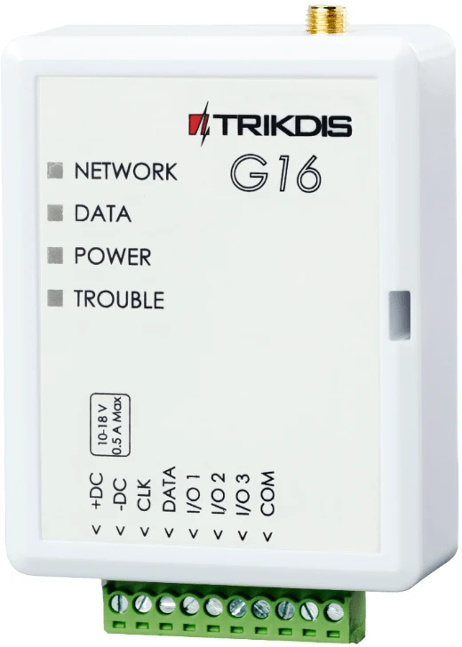
    <figcaption style="font-size: 0.9em; text-align: center; margin-top: 0.5rem;">2G</figcaption>
  </figure>
  <figure style="margin: 0;">
    
    <figcaption style="font-size: 0.9em; text-align: center; margin-top: 0.5rem;">3G, 4G</figcaption>
  </figure>

## Description 

Cellular communicator G16 directly connects to supported DSC, Paradox, UTC Interlogix (CADDX), Innerrange, Texecom, Honeywell, Crow and Pyronix alarm panels.

Communicator transmits full event information to the Central Monitoring Station.

Communicator also works with Protegus2 application. With Protegus2 users can control their alarm system remotely and get notifications about security system events. Protegus2 app is compatible with all security alarm panels from various manufacturers that are supported by the G16 communicator. Communicator can transmit event notifications to the Central Monitoring Station and work with Protegus2 simultaneously.

Communicator G16 can connect directly to DSC®, Paradox®, UTC Interlogix® (CADDX), Innerrange®, Texecom®, Honeywell®, Crow® and Pyronix® control panels. For panels from other manufacturers use the G16T communicator.

### Features

Sends events to monitoring station receiver:

- Sends events to TRIKDIS software or hardware receivers that work with any monitoring software.

- Can send event messages to SIA DC-09 receivers.

- Can send event messages to SUR-GARD receivers. The annex has a table for converting Contact ID codes to SIA codes.

- Connection supervision by polling to IP receiver every 30 seconds (or by user defined period).

- Backup channel, that will be used if connection with the primary channel is lost.

- Events can be reported to CMS with SMS messages. SMS will be sent even if data connection stops working in the mobile operator network.

- With parallel communication channels events can be sent to two receivers at same time.

- When *Protegus* service is enabled, events are first delivered to CMS, and only then are sent to app users.

**Works with Protegus2 app:**

- “*Push*” and special sound notifications informing about events.

- Remote system Arm/Disarm.

- Remote control of connected devices (lights, gates, ventilation systems, heating, sprinklers, etc.).

- Different user rights for administrator, installer and user.

- Users can also be informed about events with SMS messages and phone calls.

**Notifies users:**

- Users can be notified about events not only with Protegus2 app, but also with SMS messages and a call.

**Controllable outputs and inputs:**

- 3 double I/O terminals that can be set either as input (IN) or controllable output (OUT) terminals.

- Outputs controlled by the Protegus2 app and SMS.

- Add additional inputs and controllable outputs with iO-8 expanders. **(only for 3G/4G communicators)**.

**Quick setup:**

- Settings can be saved to file and quickly written to other communicators.

- Two access levels for configuring the device for CMS administrator and for installer.

- Remote configuration and firmware updates.

### List of compatible control panels

| Manufacturer | Model |
|--------------|-------|
| DSC® | <u>PC585</u>, <u>PC1404</u>, <u>PC1565</u>, <u>PC1616</u>, <u>PC1832</u>, <u>PC1864</u>, PC5015, PC5020 |
| PARADOX® | <u>SPECTRA SP4000</u>, <u>SP5500</u>, <u>SP6000</u>, <u>SP7000</u>, <u>SP65</u>, <u>SP5500+</u>, <u>SP6000+</u>, <u>SP7000+</u> |
| PARADOX® | <u>MAGELLAN MG5000</u>, <u>MG5050</u>, MG5050E, <u>MG5050+</u> |
| PARADOX® | <u>DIGIPLEX EVO192</u>, <u>EVOHD</u>, NE96, EVO48, EVO96 |
| PARADOX® | SPECTRA 1727, 1728, 1738 |
| PARADOX® | ESPRIT E55, 728ULT, 738ULT |
| UTC Interlogix® | <u>NetworX (Caddx) NX-4v2</u>, <u>NX-6v2</u>, <u>NX-8v2</u>, <u>NX-8e</u> |
| Texecom® | Premier 412, 816, 832, 832+ /​ <u>Premier 24</u>, <u>48</u>, <u>88</u>, <u>168</u> /​ <u>Premier Elite 12</u>, <u>24</u>, <u>48</u>, <u>64</u>, <u>88</u>, <u>168</u> |
| Pyronix® | MATRIX 424, MATRIX 832, MATRIX 832+, MATRIX 6, MATRIX 816 |
| Innerrange® | Inception, Integriti |
| Honeywell® | <u>Ademco Vista-15</u>, <u>Ademco Vista-20</u>, <u>Ademco Vista-48</u> |
| Crow® | Runner 4/​8, Runner 8/​16 |

**<u>Underlined</u>** - Control panels directly controlled by G16. Firmware PARADOX security panels, which are directly controlled, must be V.4 or higher.

\*Connect control panels from other manufacturers to the G16T communicator.

### Communicator model types 

This manual is for 2G/3G/4G communicators.

### Specifications

| Parameter | Description |
|-----------|-------------|
| Dual purpose terminals [IN/​OUT] | 3, can be set as either NC;​ NO;​ NC/​EOL;​ NO/​EOL;​ NC/​DEOL;​ NO/​DEOL (2,2 kΩ) type inputs or open collector (OC) type outputs with current up to 0,15 A, 30 VDC max. Expandable with iO-8 expanders. (only for 3G/​4G communicators) |
| LTE FDD | B1/​B2/​B3/​B4/​B5/​B7/​B8/​B12/​B13/​B18/​B19/​B20/​B25/​B26/​B28 |
| LTE TDD | B38/​B39/​B40/​B41 |
| UMTS | B1/​B2/​B4/​B5/​B6/​B8/​B19 |
| GSM | 850/​900/​1800/​1900 MHz |
| Power supply voltage | 10-18 V DC |
| Current consumption | 60-100 mA (on standby) /​ Up to 500 mA (while sending data) |
| Transmission protocols | TRK, DC-09_2007, DC-09_2012, TL150 |
| Message encryption | AES 128 |
| Changing settings | With TrikdisConfig computer program remotely or locally via USB Mini-B port /​ Remotely with SMS messages |
| Operating environment | Temperature from -10 °C to 50 °C, relative humidity - up to 80% at +20 °C |
| Communicator dimensions | 92 x 62 x 26 mm |
| Weight | 80 g |

### Communicator elements 

**Cellular communicator G16 (2G)**

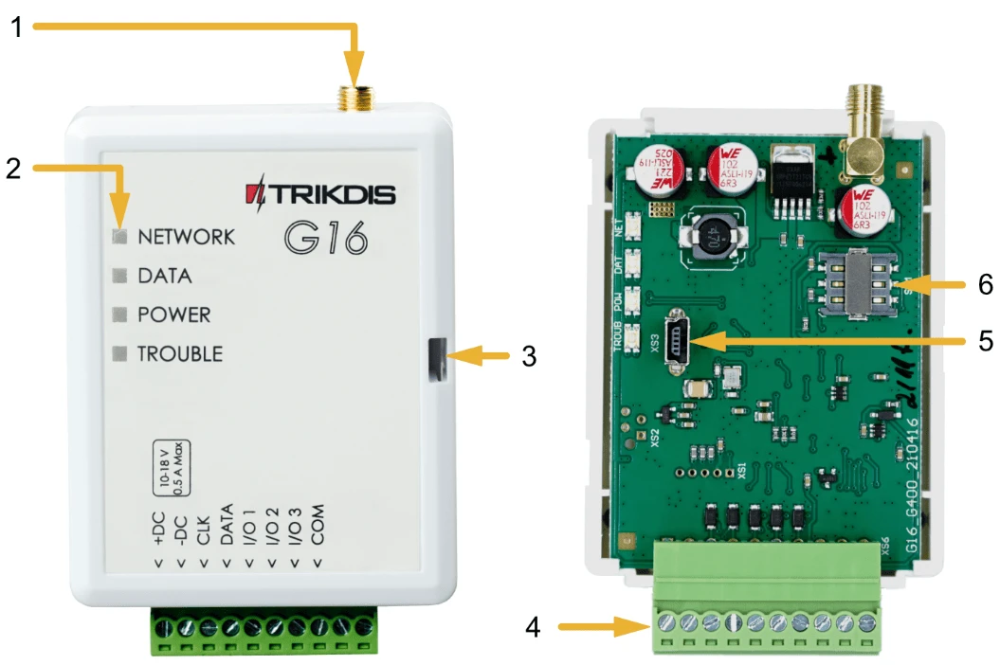

**Cellular communicator G16 (3G/4G)**

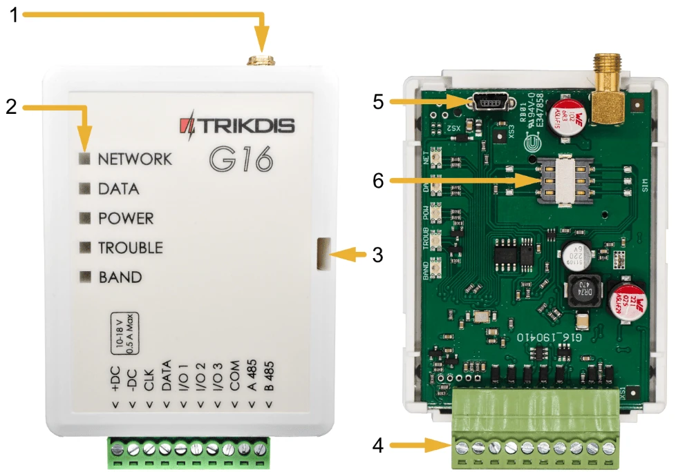

1.  Cellular antenna SMA connector

2.  Light indicators

3.  Frontal case opening slot

4.  Terminal for external connections

5.  USB Mini-B port for communicator programming

6.  SIM card slot

### Purpose of terminals

| Terminal | Description |
|----------|-------------|
| +DC | +10 V/​+18 V power supply |
| -DC | +10 V/​+18 V power supply |
| CLK | Serial bus terminals for direct connection to control panel |
| I/​O 1 | 1st input/​output terminal (default setting – OFF) |
| I/​O 2 | 2nd input/​output terminal (default setting – IN, NO circuit) |
| I/​O 3 | 3rd input/​output terminal (default setting – OUT) |
| COM | Common (negative) terminal |
| A 485 | RS485 bus A contact (only for 3G/​4G communicators) |
| B 485 | RS485 bus B contact (only for 3G/​4G communicators) |

### LED indication of operation 

| Indicator | Light status | Description |
|-----------|--------------|-------------|
| NETWORK | Off | No connection to cellular network |
| NETWORK | Yellow blinking | Connecting to cellular network |
| NETWORK | Green solid with yellow blinking | Communicator is connected to cellular network. / Sufficient cellular signal strength for 2G is level 5 (five yellow flashes) and for 3G/4G level 3 (three yellow flashes) |
| DATA | Off | No unsent events |
| DATA | Green solid | Unsent events are stored in buffer |
| DATA | Green blinking | (Configuration mode) Data is being transferred to/from communicator |
| POWER | Off | Power supply is off or disconnected |
| POWER | Green solid | Power supply is on with sufficient voltage |
| POWER | Yellow solid | Power supply voltage is insufficient (≤11.5V) |
| POWER | Green solid and yellow blinking | (Configuration mode) Communicator is ready for configuration |
| POWER | Yellow solid | (Configuration mode) No connection with computer |
| TROUBLE | OFF | No operation problems |
| TROUBLE | 1 red blink | SIM card not found |
| TROUBLE | 2 red blinks | SIM card PIN code problem (incorrect PIN code) |
| TROUBLE | 3 red blinks | Programming problem (No APN) |
| TROUBLE | 4 red blinks | Registration to Cellular network problem |
| TROUBLE | 5 red blinks | Registration to GPRS/UMTS network problem |
| TROUBLE | 6 red blinks | No connection with the receiver |
| TROUBLE | 7 red blinks | Lost connection with control panel |
| TROUBLE | Red blinking | (Configuration mode) Memory fault |
| TROUBLE | Red solid | (Configuration mode) Firmware is corrupted |
| BAND / (only for 3G/4G communicators) | 1 green blink | None |
| BAND / (only for 3G/4G communicators) | 2 green blinks | GSM |
| BAND / (only for 3G/4G communicators) | 3 green blinks | GPRS |
| BAND / (only for 3G/4G communicators) | 4 green blinks | EDGE |
| BAND / (only for 3G/4G communicators) | 5 green blinks | HSDPA, HSUPA, HSPA+, WCDMA |
| BAND / (only for 3G/4G communicators) | 6 green blinks | LTE TDD, LTE FDD |

### Structural schematic with *G16* usage 

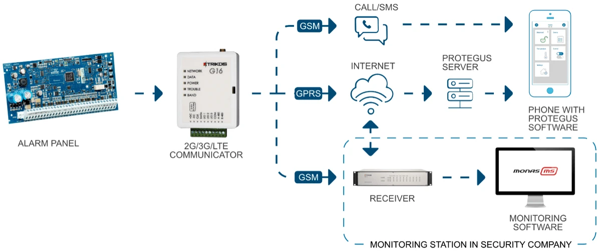

!!! note
    Before you begin, make sure that you have the necessary:
    
    1.  USB cable (Mini-B type) for configuration.
    
    2.  At least 4-wire cable for connecting communicator to control panel.
    
    3.  CRP2 cable for connecting to Paradox panel's serial port.
    
    4.  Flat-head 2,5 mm screwdriver.
    
    5.  Sufficient gain cellular antenna if network coverage in the area is
        poor.
    
    6.  Activated SIM card (PIN code request can be turned off).
    
    7.  Particular security control panel's installation manual.
    
    Order the necessary components separately from your local distributor.
## Quick configuration with *TrikdisConfig* software 

1.  Download **TrikdisConfig** configuration software from [www.trikdis.com](http://www.trikdis.com) (type “TrikdisConfig” in the search field) and install it.

2.  Open the casing of the G16 with a flat-head screwdriver as shown below:

    

3.  Using a USB Mini-B cable connect the G16 to the computer.

4.  Run TrikdisConfig. The software will automatically recognize the connected communicator and will open a window for configuration.

5.  Click **Read [F4]** to read the communicator’s settings. If requested, enter the Administrator or Installer 6-digit code in the pop-up window.

Below we describe what settings need to be set for the communicator to begin sending events to the Alarm Receiving Center and to allow the security system to be controlled with the Protegus2 app.

### Settings for connection with Protegus2 app 

**In “System settings” window:**

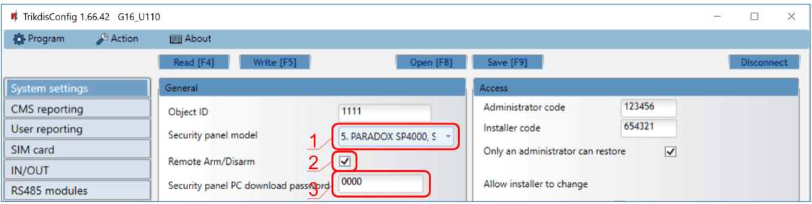

1.  Select **Panel type** that will be connected to the communicator.

2.  Select **Remote Arm/Disarm** if you want users to be able to control the panel in Protegus2 app with their keypad code. This setting is only shown for directly controlled panels.

3.  For the direct control of Paradox and Texecom panels enter **Security panel PC download password**. It must match the password that is entered in the control panel.

!!! note
    For the direct panel control to work, you will need to change the panel
    settings. How to do this is described in chapter 4 "Programming the
    control panel". In this section you will find information on how to
    change the PC download/UDL password.
**In “User reporting” window, “PROTEGUS Cloud” tab:**

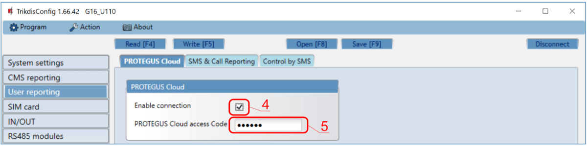

4.  Tick the checkbox **Enable connection** to the Protegus Cloud.

5.  Change the **PROTEGUS Cloud access Code** for logging in to Protegus2 if you want users to be asked to enter it when adding the system to Protegus2 app (default password – 123456).

**In “SIM card” window:**

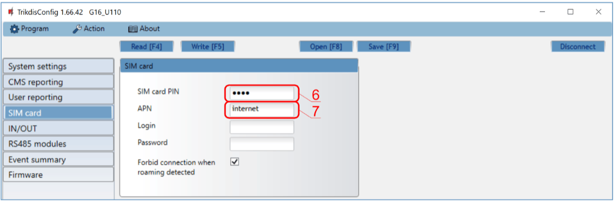

6.  Enter **SIM card PIN** code.

7.  Change **APN** name. **APN** can be found on the website of the SIM card operator (“internet” is universal and works in many operator networks).

After finishing configuration, click the button **Write [F5]** and disconnect the USB cable.

!!! note
    For more information about other G16 settings in
    TrikdisConfig, see chapter
    **[6](#trikdisconfig-window-description) "[TrikdisConfig window
    description](#trikdisconfig-window-description)"**.
### Settings for connection with Central Monitoring Station 

**In “System settings” window:**

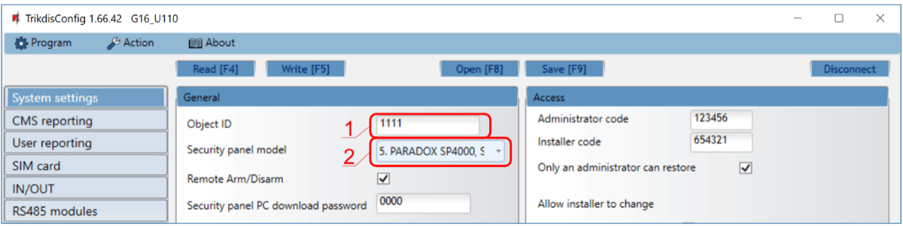

1.  Enter **Object ID** (account) number provided by the Central Monitoring Station (4 characters, 0-9, A-F. **Do not use FFFE, FFFF Object ID**).

2.  Select **Security panel model** that will be connected to the communicator.

**In “CMS reporting” window settings for “Primary channel”:**

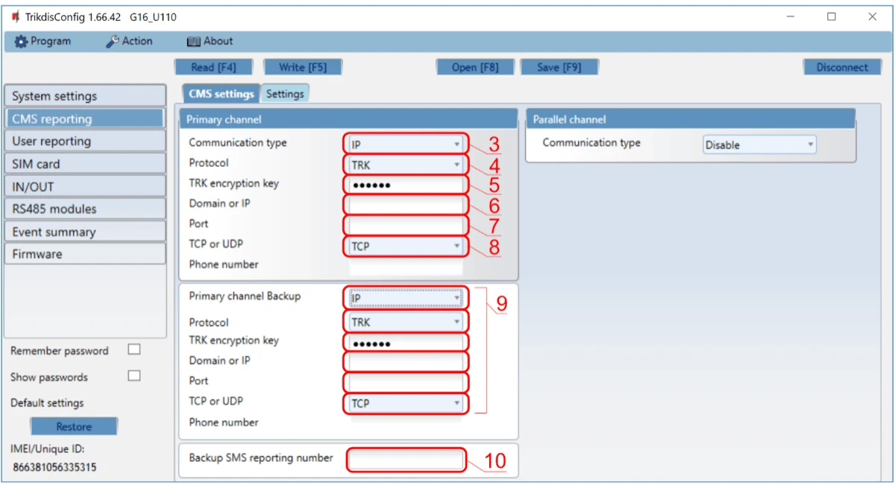

3.  **Communication type** - select the **IP** connection method (We do not recommend SMS as the primary channel).

4.  **Protocol** - select the protocol type for event messages: **TRK** (to TRIKDIS receivers), **DC-09_2007** or **DC-09_2012** (to universal receivers), **TL150** (to SUR-GUARD receivers).

5.  **TRK encryption key** - enter the encryption key that is set in the receiver.

6.  **Domain or IP** - enter the receiver’s Domain or IP address.

7.  **Port** - enter receiver’s network port number.

8.  **TCP or UDP** - choose event transmission protocol (**TCP** or **UDP**) in which events should be sent.

!!! note
    If you want to set communication with CMS via **SMS** messages, you only
    need to set **Encryption key** and **Phone number**. SMS messages can be
    received only by TRIKDIS receivers: IP/SMS receiver RL14, multichannel
    receiver RM14 and SMS receiver GM14. / If you selected the **DC-09**
    protocol, additionally enter object, line and receiver numbers in the
    **Settings** tab of the **CMS reporting** window.
9.  (Recommended) Configure **Primary channel Backup** settings.

10. (Recommended) Enter **Backup SMS reporting number**.

**In “SIM card” window:**

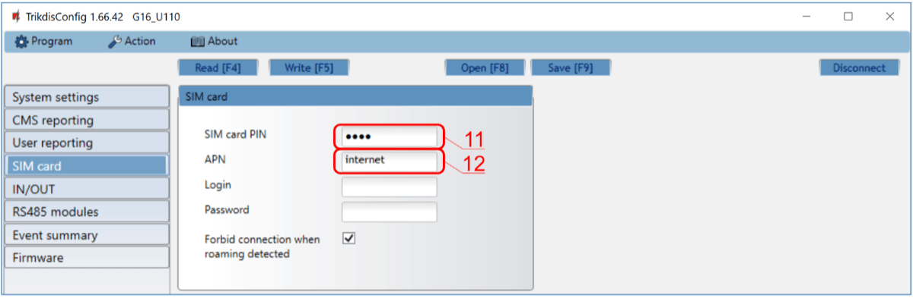

11. Enter **SIM card PIN** code.

12. Change the **APN** name. **APN** can be found on the website of the SIM card operator (“internet” is universal and works in many operator networks).

After finishing configuration, click **Write [F5]** and disconnect the USB cable.

!!! note
    For more information about other G16 settings in
    TrikdisConfig, see chapter
    **[6](#trikdisconfig-window-description) "[TrikdisConfig window
    description](#trikdisconfig-window-description)"**.
## Installation and wiring 

### Installation process 

1.  Remove the top cover and pull out the contact terminal.

2.  Insert SIM card into the holder.

3.  Remove the PCB board from the bottom part of the case.

4.  Fix the bottom part to a suitable place with screws.

5.  Place the PCB board back into case, insert contact terminal.

6.  Screw cellular antenna on.

7.  Close the top cover.

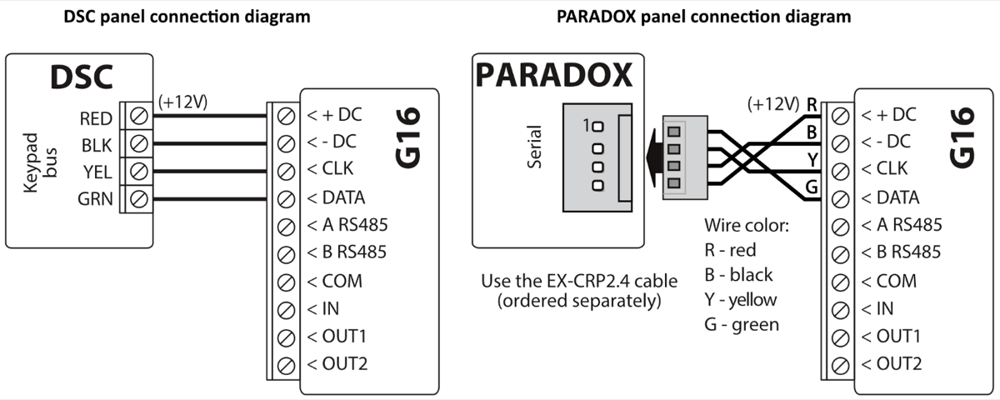

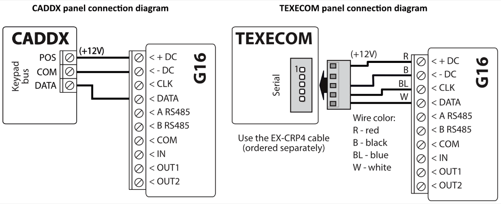

!!! note
    Ensure that the SIM card is activated. / Ensure that mobile internet
    service (mobile data) is enabled if connected via IP channel. / To avoid
    entering the PIN code in TrikdisConfig, insert the SIM card into
    your mobile phone and turn off the PIN request function.
### Schematics for wiring the communicator to a security control panel 

Following one of the schematics provided below, connect communicator to the control panel.

1.  **Schemes for connecting to the security control panels:**

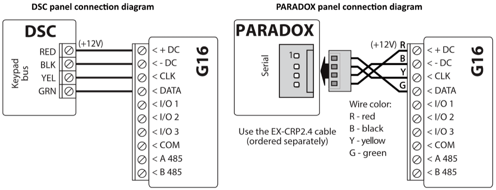

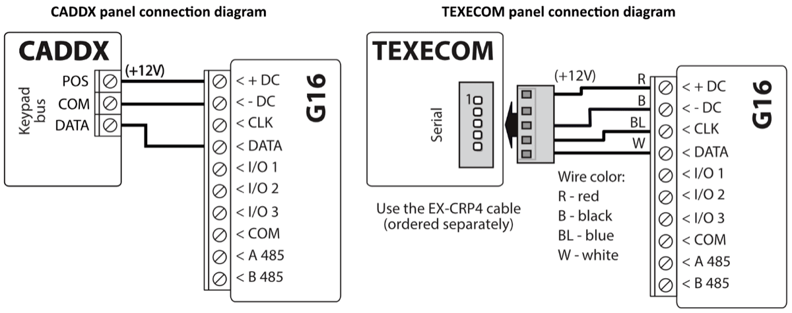

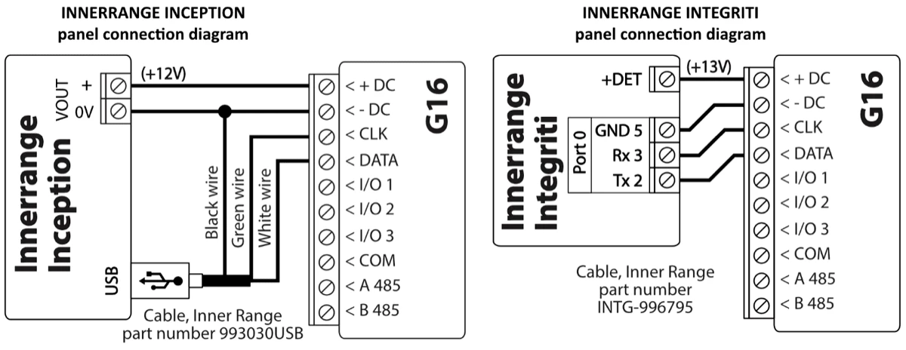

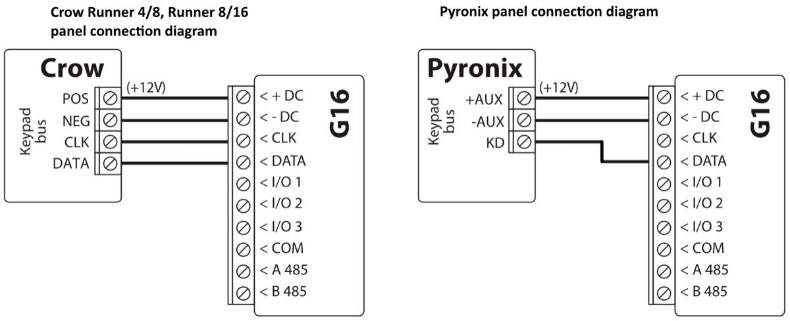

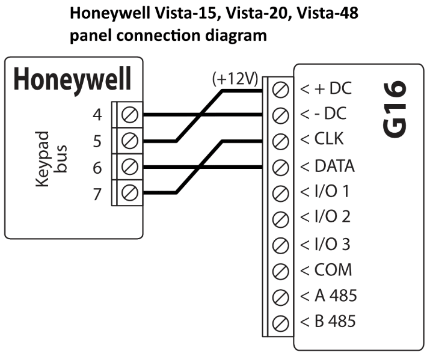

### Schematic for connecting to panel keyswitch zone 

Follow this schematic if the control panel will be armed/disarmed with a G16 PGM output turning on/off the panel’s keyswitch zone.

!!! note
    G16 communicator has 3 universal input / output terminals that can
    be set to the OUT (PGM) operating mode. The outputs (OUT) can control
    three areas of the security system. If you want to control the system in
    this way, in TrikdisConfig, in the "**System settings**" window,
    uncheck **Remote Arm/Disarm**. The Protegus2 apps must be
    configured with the settings described in chapter 5.2 "Additional
    settings to arm/disarm the system using the control panel's keyswitch
    zone".
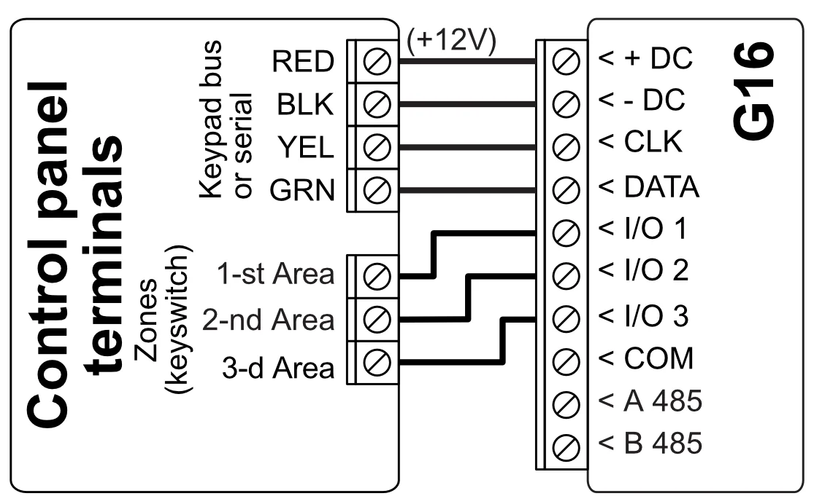

### Schematics for input connection 

The communicator has 3 universal input / output terminals that can be set to input IN mode. NC, NO, NO / EOL, NC / EOL, NO / DEOL, NC / DEOL circuits can be connected to the input terminal. Default **I/O 2** input setting – NO. The input type can be changed in the TrikdisConfig window **IN/OUT -> Type.**

Connect the input according to the selected input type (NO, NC, NC/EOL, NO/EOL, NO/DEOL, NC/DEOL), as shown in the schemes below:

!!! note
    If more inputs or outputs need to be connected to the communicator,
    connect the TRIKDIS iO-8 expander. Connection method is described
    in the iO-8 manual and chapter 3.6 "Schematics for connecting iO-8
    expansion modules". **(only for 3G/4G communicators)**
### Schematics for wiring a relay 

With relay contacts you can control (turn on/off) various electronic appliances. The I/O terminal of the communicator must be set to an output (OUT) mode.

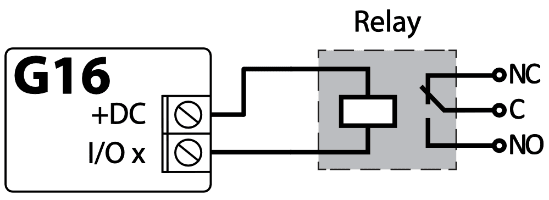

### Schematics for connecting iO-8 expansion modules (only for 3G/4G communicators) 

If more inputs or outputs need to be connected to the communicator connect the TRIKDIS *iO-8* expander. Configuration of expander modules connected to the *G16* is described in chapter 6.7. ““RS485 modules” window”.

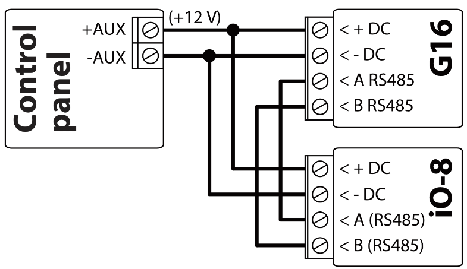

### Schematic for connecting the *W485* WiFi module (only for 3G/4G communicators)

The *W485* module sends messages to the CMS (Central Monitoring Station) and to *Protegus2* using a WiFi internet router. When WiFi connectivity is available, the *G16* sends event messages via the *W485* module. When WiFi connectivity is disrupted, the *G16* sends messages via GPRS. When WiFi connectivity is re-established, the *G16* returns to sending messages via *W485*. / Configuration of the *W485* WiFi module to work with the *G16* is described in chapter 6.7. „„RS485 modules” window”. / Insert SIM card into the communicator *G16* for *W485* to work.

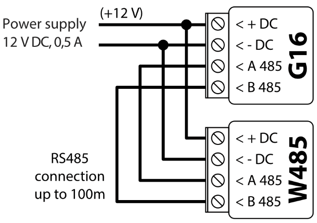

### Schematic for connecting the E485 „Ethernet“ module (only for 3G/4G communicators)

The *E485* sends messages to the CMS (Central Monitoring Station) and to *Protegus2* using a wired internet connection. Using the *E485* with *G16*, CSP and *Protegus2* messages are sent over wired Internet and mobile Internet is not used. If a wired internet connectivity is disrupted, the *G16* sends messages via the mobile Internet. When the wired Internet connectivity is re-established, *G16* starts sending messages via *E485*. / Configuration of the *E485* WiFi module to work with the *G16* is described in chapter 6.7. „„RS485 modules” window”. / Insert SIM card into the communicator *G16* for *E485* to work.

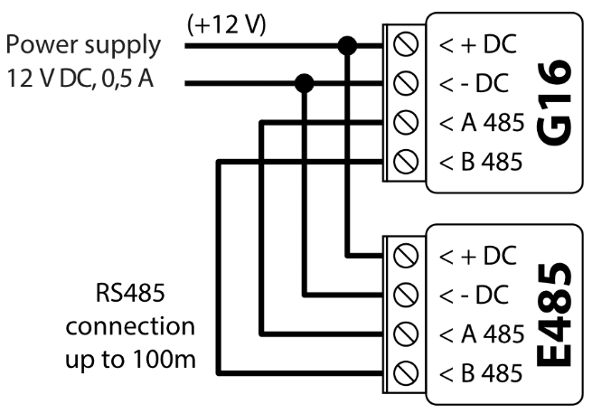

### Turn on the communicator 

To start the communicator, turn on the security control panel’s power supply. This LED indication on the G16 communicator must show:

- “POWER” LED illuminates green when the power is on;

- “NETWORK” LED illuminates green and blinks yellow when the communicator is registered to the network.

!!! note
    Sufficient strength of 2G signal is level five (five "NETWORK" indicator
    flashes in yellow color). Sufficient strength of 3G, 4G signal is level
    three (three "NETWORK" indicator flashes in yellow color). / If you
    count less yellow "NETWORK" LED flashes, the network signal strength is
    insufficient. We recommend to select a different place to install the
    communicator, or to use a more sensitive cellular antenna. / If you see
    a different LED indication, it indicates a certain malfunction. Diagnose
    it by following the LED indication table in chapter
    [1.6](#led-indication-of-operation) "[LED indication of
    operation](#led-indication-of-operation)". / If the G16 indication
    does not illuminate at all, check the power supply and connections.
## Programming the control panel 

Below it is described how to program the security control panel so that the G16 communicator could read events from the panel and control it remotely.

To enable remote control of the security panel, make sure that the checkbox **Remote Arm/Disarm** is selected in the TrikdisConfig window **“System settings”.**

### DSC

DSC panels do not need to be programmed.

### PARADOX

Paradox control panels need to be programmed only for direct control with Protegus. You do not need to program Paradox panels for reading events.

For remote control of Paradox panels, you need to set up a PC download password. This password must match the password which was set in the TrikdisConfig window **“System settings”**, when the checkbox next to **Remote Arm/Disarm** was selected.

To set this password, with the keyboard connected to the security control panel:

- For MAGELLAN, SPECTRA series: go to cell 911 and enter 4-digit PC download password.

- For DIGIPLEX EVO series: go to cell 3012 and enter 4-digit PC download password.

### TEXECOM

Texecom control panels need to be programmed for both reading events and remote control.

You need to set the Texecom panel’s **UDL** **passcode**. This password must match the password which was set in the TrikdisConfig window **“System settings”,** when the box next to **Remote Arm/Disarm** was selected.

The security control panel can be programmed with Texecom software - Wintex. Enter **UDL passcode** (4-digit code) in the **Communication Options** window, **Options** tab.

Also, you can program with a keypad connected to the security control panel:

1.  Enter the 4-digit installer’s code and press the [Menu] button to enter the programming menu.

2.  Press the [9] key immediately afterwards.

3.  Press [7][6], and then [2]. Enter the 4-digit **UDL** **passcode** (**UDL passcode** must match the G16 communicator’s **PC login password).**

4.  Press [Yes] and leave the programming mode by pressing [Menu].

### UTC INTERLOGIX (CADDX)

With the keyboard connected to the security control panel:

1.  Press [\*][8] and enter the installer’s code (default - 9713).

2.  Enter the device number assigned to the connected communicator (default - 0).

3.  Set the settings below for each row. In sequence, enter the position, segment number and the required setting. Clicking [\*] (asterisk) will return you to the local input field.

| Position | Segment | Setting |
|----------|---------|---------|
| 23 | 3 | 12345678 |
| 37 (not necessary) | 3 | 12345678 |
| 37 (not necessary) | 4 | 1234567* |
| 90 | 3 | 12345678 |
| 93 | 3 | 12345678 |
| 96 | 3 | 12345678 |
| 99 | 3 | 12345678 |
| 102 | 3 | 12345678 |
| 105 | 3 | 12345678 |
| 108 | 3 | 12345678 |

After having programmed all the fields listed, press [Exit] twice to exit the programming mode.

### INNERRANGE

**Innerrange Inception** security control panel version must be **2.3.0.3507-r0** or higher.

The control panel must be connected to the internet. Connect to **Innerrange Inception** by entering: <https://skytunnel.com.au/inception/SERIALNUMBER>, where SERIALNUMBER is the number of the controller that you can find on the panel’s enclosure.

Open **Configuration > General > Alarm Reporting**. In the **3rd Party Device Configuration** settings group you need to enter:

1.  **Enable 3rd Party Device Reporting** - select this checkbox.

2.  **3rd Party Device Type** - set “Trikdis”.

3.  **Serial port** - set “Serial Port 1 (Plugged In, In Use By 3rd Party Device)”.

4.  Save settings and exit the application.

### Honeywell Ademco Vista

Follow these steps for **Honeywell Ademco Vista-20** and **Honeywell Ademco Vista-48** panels. **The panel’s firmware version must be V5.3 or higher.** With a keypad that is connected to the panel:

1.  Enter the programming mode. Enter the installer code 4][1][1][2] and after that [8][0][0] . Alternatively, turn on the panel‘s power supply. In 50 seconds after the power supply is turned on, press the buttons [\*] and [#] at the same time (this method can be used when programming mode was exited by pressing in keypad [\*][9][8] ).

2.  Turn on the sending of Contact ID events via LRR. Press [\*][2][9][1][#] in keypad.

3.  When using the „Remote Arm/Disarm“ function, allow to use the 2nd AUI address. In keypad press [\*][1][8][9][1][1][#] .

Exit the programming mode. In keypad press [\*][9][9]

**Crow**

There is no need to program Crow Runner 4/8 and Runner 8/16 panels.

## Remote control 

### Adding the security system to Protegus2 app 

With Protegus2 users will be able to control their alarm system remotely. They will see the status of the system and receive notifications about system events.

1.  Download and launch the Protegus2 application or use the browser version: [www.protegus.app](https://www.protegus.app).

    

      
      
      
    

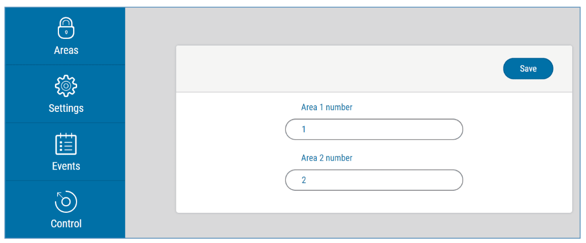

2.  Log in with your user name and password or register and create new account.

!!! warning "Important"
    When adding the G16 to Protegus2 check if:

    1.  The inserted SIM card is activated and the PIN code is either
        entered or disabled;

    2.  Protegus cloud is enabled. See chapter
        **[6.4](#user-reporting-window) ["User reporting"
        window](#user-reporting-window)**;

    3.  Power supply is connected ("POWER" LED illuminates green);

    4.  Registered to the network ("NETWORK" LED illuminates green and
        blinks yellow).
3.  Click “Add new system” and enter the *G16* “*IMEI/Unique ID*” number. This number can be found on the device and the packaging sticker. Click “Next”.

4.  Enter the system „Name”. Click "Next".

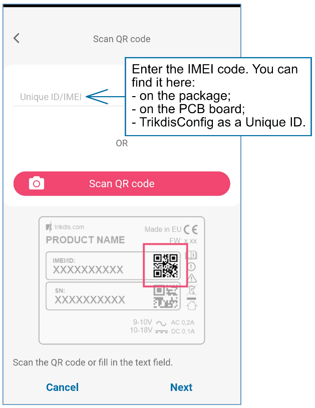

### Additional settings to arm/disarm the system using the control panel’s keyswitch zone 

!!! warning "Important"
    The control panel zone to which the G16 output OUT is connected to
    has to be set to keyswitch mode.
Follow the instructions below if the security control panel will be controlled with a G16 PGM output, turning on/off the control panel keyswitch zone.

1.  Click „**Continue**“.

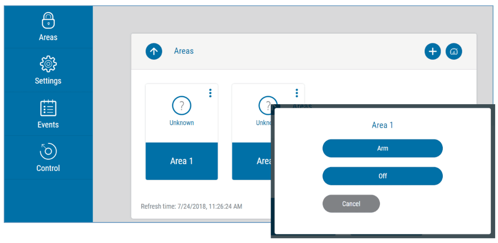

2.  Enter “**Area name**”. Enable PGM output control using the Protegus2 application.
3.  Select “**Pulse**” or “**Level**”, depending on how the keyswitch zone type is configured. If necessary, you can change the "**Pulse**" interval.

4.  Click „**Save**“.

5.  If there is another Area for the security system, then you need to click “**Click to add an area**”. Setting up the PGM output is similar to that described above.

6.  After completing the settings, click the “**Skip**” button.

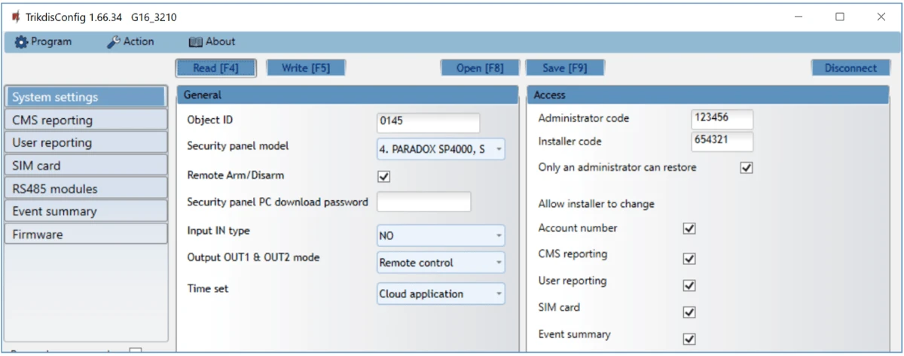

### Arming/disarming the alarm system with Protegus2 

1.  In the “System Home Screen” window, click on the “Disarm” status icon.

2.  *Protegus2* will receive a message about a change in the status of the security system and the status icon will change its state.

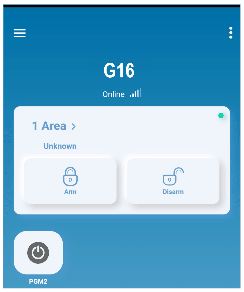

### Configuration and control with SMS messages 

You can remotely configure and control the communicator with SMS messages.

Message structure is: Password `[space]` Command `[space]` Data

For password use the **Administrator code** for *INFO, RESET, OUTPUTx, CONNECT* commands, and **Installer code** for *INFO, RESET, OUTPUTx* commands.

#### SMS command list

| Command | Data | Description |
|---------|------|-------------|
| INFO |  | Request information about the device. Response will be: communicator type, IMEI number, serial number and firmware version. E.g.: 123456 INFO |
| RESET |  | Restart the device. E.g.: 123456 RESET |
| OUTPUTx | ON | Turn on an output. x is the output number (1, 2 or 3). E.g.: 123456 OUTPUT1 ON |
| OUTPUTx | OFF | Turn off an output. x is the output number (1, 2 or 3). E.g.: 123456 OUTPUT1 OFF |
| OUTPUTx | PULSE=tttt | Turn on the output in impulse mode, for the specified time interval (sec). / “tttt” is the time duration of impulse in seconds, described in four digits. / E.g.: 123456 OUTPUT2 PULSE=0002 |
| CONNECT | Protegus=ON | Enable access to Protegus service. E.g.: 123456 CONNECT PROTEGUS=ON |
| CONNECT | Protegus=OFF | Disable access to Protegus service E.g.: 123456 CONNECT PROTEGUS=OFF |
| CONNECT | IP=0.0.0.0:8000 | Set primary channel IP address and Port number. / E.g.: 123456 CONNECT IP=192.120.120.255:8000 |
| CONNECT | ENC=123456 | Set TRK encryption key. E.g.: 123456 CONNECT ENC=123456 |
| CONNECT | APN=Internet | Set APN name. E.g.: 123456 CONNECT APN=INTERNET |
| CONNECT | USER=user | Set APN user. E.g.: 123456 CONNECT USER=User |
| CONNECT | PASS=password | Set APN password. E.g.: 123456 CONNECT PASS=Password |
| CONNECT | CP= | Select security control panel from a list. |
| CONNECT | DIR= | E.g. (assign control panel Paradox SP6000 that is number 4 on the list to the G16): 123456 CONNECT CP=4 |
| CONNECT |  | Direct control 4-digit password or OFF to disable it. / E.g. (enter the direct control 4-digit password 1122): 123456 CONNECT DIR=1122 |

You can restrict the phone numbers from which the communicator will accept the commands. See chapter 6.4 “User reporting” window, “Control by SMS” tab.

## TrikdisConfig window description 

### *TrikdisConfig* status bar description 

After connecting the G16 and clicking **Read [F4], *TrikdisConfig*** will provide information about the connected device in the status bar:

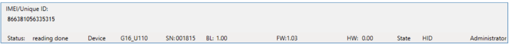

| Object         | Description                                        |
|----------------|----------------------------------------------------|
| IMEI/​Unique ID | Device IMEI number                                 |
| Status         | Operating condition                                |
| Device         | Device type (G16 should be shown)            |
| SN             | Device serial number                               |
| BL             | Browser version                                    |
| FW             | Device firmware version                            |
| HW             | Device hardware version                            |
| State          | Connection to program type (via USB or remote)     |
| Administrator  | Access level (shown after access code is approved) |

After pressing **Read [F4]**, the program will read and show the settings which are set in the ***G16*.** Set the necessary settings according to the TrikdisConfig window descriptions given below.

### “System settings” window 

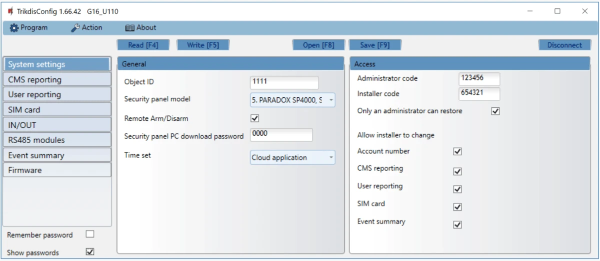

**“General” settings group**

- **Object ID** – if the events will be sent to the CMS (Central Monitoring Station), enter the account number provided by the CMS (4 characters hexadecimal number, 0-9, A-F. **Do not use FFFE, FFFF Object ID**).

- Select the **Security panel type** that will be connected to the communicator.

- **Remote Arm/Disarm** - when the checkbox is selected, the G16 will directly control the control panel remotely. This setting will be visible only for directly controlled panels. For direct control of the control panels you need to change the panel settings, as described in section 4 “Programming the control panel”.

  - **Security panel PC download password** - for the direct control of Paradox and Texecom control panels you need to enter the PC/UDL password. It must match the password that was entered in the control panel. How to change this password is described in section 4 “Programming the control panel”*.*

- **Time set -** select which server to use for time synchronization.

“Access” settings group

When setting up the communicator G16 there are two levels of access for, the administrator and the installer:

- **Administrator code -** allows you to access all configuration fields (default code - 123456).

- **Installer code** - limited access for configuring the communicator (default code - 654321).

- **Only an administrator can restore** - if the box is checked, factory settings can be restored only by entering the administrator code.

- **Allow installer to change** – the administrator can specify which settings can be changed by the installer.

### “CMS reporting” window 

**“CMS settings” tab**

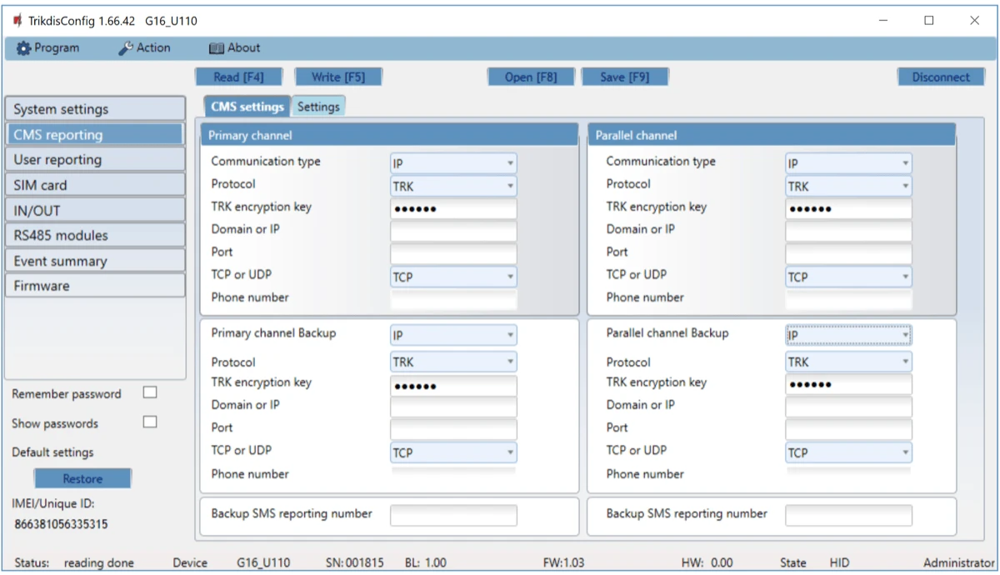

The communicator sends events to the monitoring station via cellular internet (IP) or with SMS messages.

Events can be sent over several channels of communication. The primary and parallel communication channels can operate simultaneously, this way the communicator can send events to two receivers at the same time. Backup channels can be assigned for both primary and parallel channels, which will be used when the connection via the primary or parallel channel is interrupted.

Communication is encoded and password protected. A TRIKDIS receiver is required for receiving and sending event information to the monitoring programs:

- For connection over IP - software receiver IPcom Windows/Linux, hardware IP/SMS receiver RL14 or multichannel receiver RM14.

- To receive SMS messages - hardware IP/SMS receiver RL14, multichannel receiver RM14 or SMS receiver GM14.

SMS communication is particularly useful as a backup channel, because it works even when there is no mobile internet connection. We do not recommend SMS as a primary channel.

**“Primary channel” settings group**

- **Communication type** - select which method for connecting to the monitoring station receiver will be used: **IP** or **SMS**.

- **Protocol** - select in which coding the events should be sent: **TRK** (to TRIKDIS receivers), **DC-09_2007** or **DC-09_2012** (to universal receivers) , **TL150** (to SUR-GUARD receivers).

- **TRK encryption key** - 6-digit message encryption key. The key written to the communicator must match the receiver’s key.

- **Domain or IP** - enter the domain or IP address of the receiver.

- **Port** - enter the network port number of the receiver.

- **TCP or UDP** - select in which protocol (TCP or UDP) the events should be sent.

- **Phone number** (only for SMS messages) - enter the telephone number of a TRIKDIS SMS receiver. The phone number must begin with the country code (e.g., 370xxxxxxxx).

“Primary channel Backup” settings group

Enable the backup channel mode to send events via backup channel if connection via primary channel is lost. Backup channel settings are same as described above.

“Parallel channel” settings group

Events are transmitted in parallel with the first channel through this channel. When the second channel is enabled, events can be sent simultaneously to two receivers (e.g., local and centralized monitoring stations). Parallel channel settings are the same as described above.

Backup SMS reporting number

Backup SMS messages are sent when they cannot be transmitted via the primary, parallel and backup channels. It is especially useful because it works even when there is no IP connection in the mobile operator network.

This channel is operational only when IP mode is set for the first channel and its backup channel.

SMS notifications will be sent to the Central Monitoring Station SMS receiver: 1) immediately after the first time when communicator starts operating; and 2) if the TCP / IP or UDP / IP connection is interrupted in the first channel and its backup channel.

- **Backup SMS reporting number** - enter the phone number for TRIKDIS CMS (Central Monitoring Station) SMS receiver. Phone number must begin with the country code (e.g., 370xxxxxxxx).

**“Settings” tab**

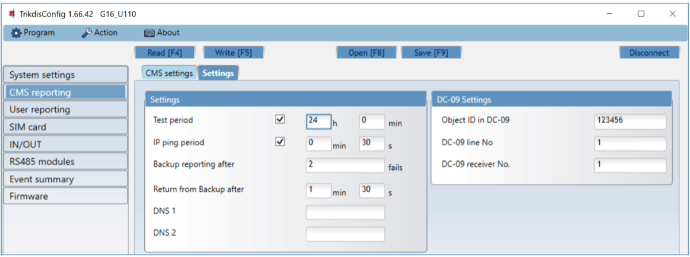

**“Settings” settings group**

- **Test period** - TEST event period for testing the connection. Test events are sent as Contact ID messages and forwarded to the monitoring software.

- **IP ping period** – period for sending internal PING heartbeats. These messages are only sent via IP channel. The receiver will not forward PING messages to the monitoring software to avoid overloading it. Notifications will only be sent to the monitoring software if the receiver fails to receive PING messages from the device within the set time.

  By default, the “*Connection lost”* notification will be transmitted to the monitoring software if the PING message is not received by the receiver over a time period three times longer than set in the device. E.g. if the PING period is set for 3 minutes, the receiver will transfer the *“Connection lost”* notification if a PING message is not received within 9 minutes.

  PING heartbeats keep the active communication session between the device and the receiver. An active session is required for remote connection, control and configuration of the device. We recommend setting the PING period for no more than 5 minutes.

- **Backup reporting after** - indicates the number of unsuccessful attempts to send the message via Primary channel. If device fails to transmit specified number of times, the device will connect to transmit the messages via Backup channel.

- **Return from backup after** - time after which the G16 will attempt to reconnect and transmit messages via the Primary channel.

- DNS1, DNS2 - (Domain Name System) identifies the server that specifies the IP address of the domain. Used when domain is set in the communication channel Domain or IP field (not IP address). Google DNS server is set by default.

“DC-09 settings” settings group

The settings are displayed when the **DC-09_2007** or **DC-09_2012** protocol is set in the communication channel **Protocol** field for sending events to universal receivers.

- **Object ID in DC-09** - enter the object number. <u>The object number entered in this field will be used if DC-09 encoding is selected</u>. A hexadecimal number from 3 to 16 characters can be entered. This Number is provided by the CMS (Central Monitoring Station).

- **DC-09-line No**. - enter line number of the receiver.

- **DC-09 receiver No.** - enter the receiver number.

### “User reporting” window 

**“PROTEGUS cloud” tab**

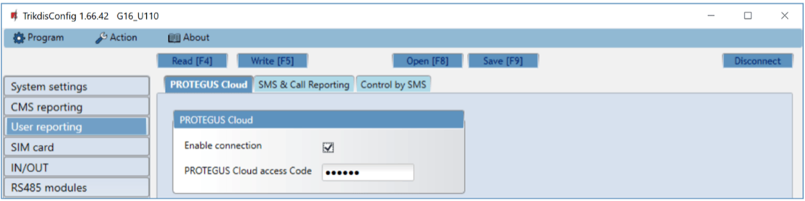

Protegus service allows users to remotely monitor and control the communicator. For more information about Protegus service, visit [www.protegus.app](https://www.protegus.app).

**“Protegus Cloud” settings group**

- **Enable connection** – enable the Protegus service, the G16 will be able to exchange data with Protegus2 app and to be remotely configured via ***TrikdisConfig*.**

- **Protegus Cloud access Code -** 6-digit code for connecting to the Protegus2 app (default - 123456).

**“SMS & Call Reporting“ tab**

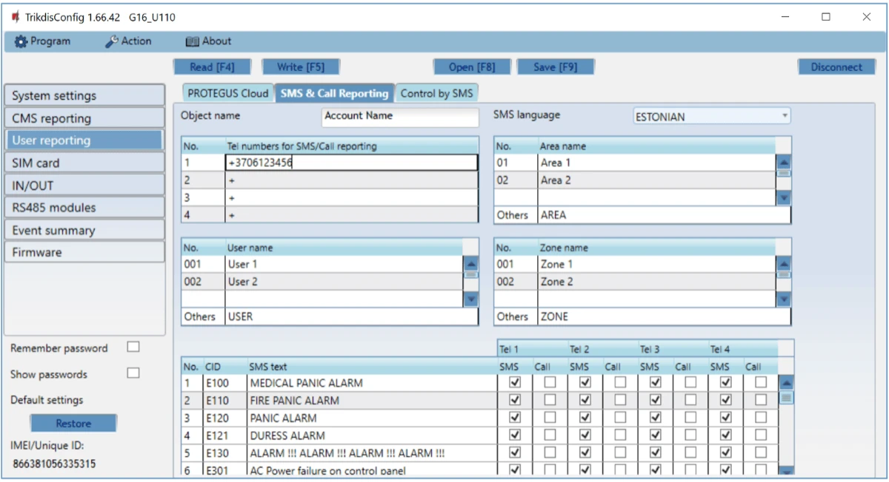

Notifications about system events can be transmitted to users’ mobile phones via SMS messages or phone calls.

- **Object name** - name the system to which the communicator is connected. Every SMS notification will include the name of the object.

- **SMS language** - choose the language for SMS messages (SMS messages can be sent with language-specific characters).

- **Tel numbers for SMS/Call reporting** - enter up to 4 user phone numbers that will receive event SMS messages or calls. Phone numbers must begin with the country code, for example +370xxxxxxxx, 00370xxxxxxxx or 370xxxxxxxx.

- **Area name, User name, Zone name tables** - each area, user and zone may have a name that will be used in SMS event messages. Enter the area, user or zone number in the appropriate table and enter the name next to the number.

- **CID event table** - you can change which phone numbers receive SMS messages or phone calls notifying about the events on the list.

  You can change the texts for SMS messages of default events, change the contact ID (CID) codes and enter new events with descriptions.

**“Control by SMS” tab**

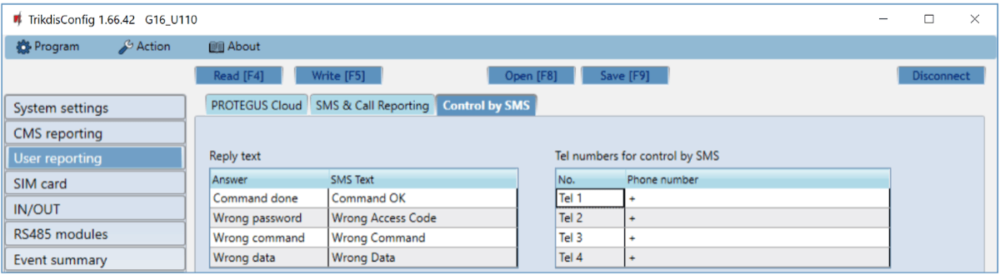

You can send SMS commands to the communicator that will control the basic functions of the device. Find the control commands in chapter [5.4](#configuration-and-control-with-sms-messages) „[Configuration and control with SMS messages](#configuration-and-control-with-sms-messages)”.

- **Reply text** - SMS text that the user receives after sending an SMS command. SMS text can be edited.

- **Tel numbers for control by SMS** - you can enter phone numbers from which the communicator will accept commands.

!!! note
    If no phone number is entered, the device will accept commands from any
    phone number. In any case, security is guaranteed by the requirement to
    enter administrator or installer password in the SMS command.
### “SIM card” window 

!!! warning "Important"
    1\. Ensure that the SIM card is activated and working before using
    it. / 2. If mobile internet connection will be used for sending events
    via IP channel or to Protegus2, ensure that mobile data service is
    enabled.
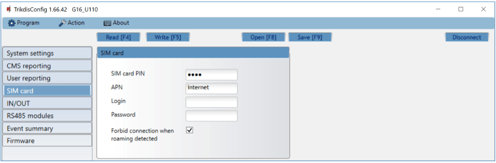

**“SIM card” settings group**

- **SIM card PIN** - enter the SIM card PIN code. This code can be disabled by inserting the SIM card into a mobile phone and disabling the request. If you disabled the SIM card PIN request, leave the default value in this field.

- **APN** - enter APN (Access Point Name). It is required for connecting the communicator to the internet. APN can be found on the website of the SIM card operator (“internet” is universal and works in the networks of many operators).

- **Login, Password** - if required, enter the user name (login) and password for connection to the internet.
- **Forbid connection when roaming detected** - you can use this function when the security system is installed near the country border. This function prevents the communicator from operating in the other country’s mobile network.

### “IN/OUT” windows 

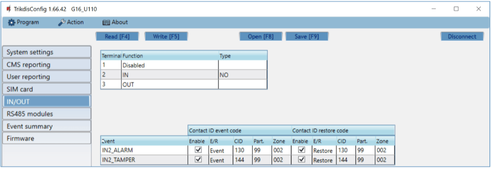

The communicator has 3 universal (input / output) terminals. The table can set the terminal operating mode (Off, IN, OUT). The input must specify the type of circuit to be connected NC, NO, NO / EOL, NC / EOL, NO / DEOL, NC / DEOL.

Additional sensors can be connected to the communicator inputs. When the sensor is triggered, the communicator will send an event message. The input is assigned a Contact ID code, which will be sent to CSP and Protegus2.

- **Enable** – checked event fields where messages will be sent to CMS and Protegus2.

- **E/R** – choose what type of event will be sent when input is triggered – **Event** or **Restore**.

- **CID** – enter the event code or leave the default value. Upon entering the event, the event code will be sent to Protegus2 and CMS.

- **Part**. – enter the partition (area) number that will be sent when an internal event occurs and the system is restored.

- **Zone** - enter the zone number that will be sent when an internal event occurs and the system is restored.

### “RS485 modules” window (only for 3G/4G communicators) 

**“Modules list” tab**

iO-8 expanders can be connected to the communicator to add additional inputs, outputs. Connected expanders must be added to the **Modules list** table.

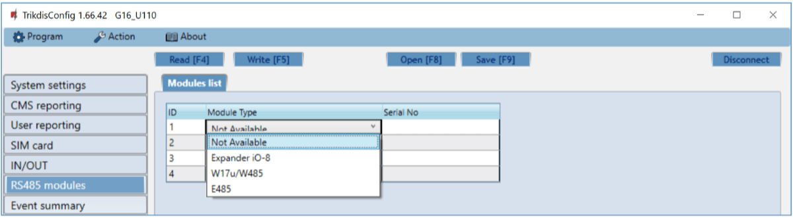

- **Module type** – select the module that is connected to the communicator via RS485 from the list.

- **Serial No –** enter the module serial number (6 digits), which is indicated on stickers on the module’s case and packaging.

After selecting the connected module and entering its serial number, go to **RS485 modules** → **Module.**

**“Module” tabs**

After adding the expander to the communicator as described above, in the **RS485 modules** window a new tab will appear with this module’s settings. The tab will be given a number. Bellow we describe the settings for iO-8 expanders, for the WiFi module W485, for the „Ethernet“ module E485.

**iO-8 expander settings window (only for 3G/4G communicators)**

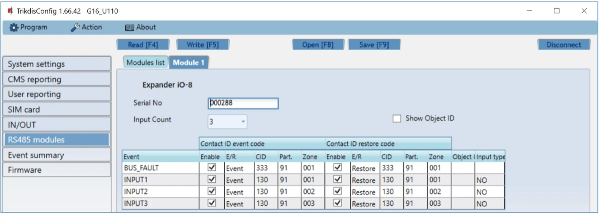

Expander iO-8 has 8 universal (input/output) terminal contacts. Up to four iO-8 expanders can be connected.

- **Input count** – select what number of terminal contacts should be set to input (IN) mode. The rest of the terminal contacts will become outputs (OUT).

Settings for controllable outputs are set directly in Protegus2 app. There you can assign an output for arming/disarming the alarm system or for remote control of devices.

In the table inputs can be assigned Contact ID event and restore codes. After input is triggered, the communicator will send an event with set event code to monitoring station receiver, Protegus2 app and SMS (to user telephone number).

**Contact ID event code:**

- **Enable** – allow message transmission, when the input is triggered.

- **E/R** – choose what type of event will be sent when input is triggered – **Event** or **Restore**.

- **CID** – assign a Contact ID event code to the input.

- **Part.** – assign the partition (area) to the input. It is set automatically: if the module no. is 1, then the area is 91; if the module no. is 4, then the area is 94.

- **Zone** – set the zone number for the input.

****Contact ID restore code**:**

- **Enable** – allow message transmission when the input is restored.

- **E/R** – choose what type of event will be sent when input is restored – **Restore** or **Event**.

- **CID** – assign the Contact ID restore code to the input.

- **Part.** – assign the partition (area) to the input. It is set automatically: if the module no. is 1, then the area is 91; if the module no. is 4, then the area is 94.

- **Zone** – set the zone number for the input.

- **Object ID** - the input (IN) can be assigned an Object ID, which will differ from the Object ID of the communicator G16.

- **Input type** – select the type of the input (NO or NC).

For customers to receive SMS messages or calls about input triggers, enter the Contact ID event code that is assigned to the input to the table in **“SMS & Call Reporting”** tab.

#### WiFi module W485 settings window (only for 3G/4G communicators)

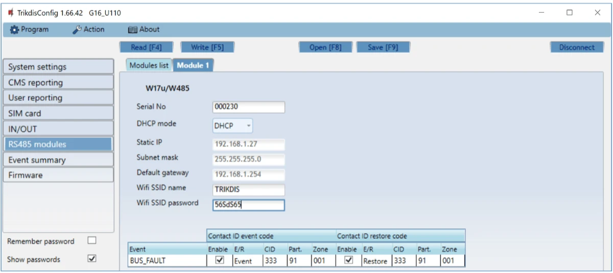

- **DHCP mode** – WiFi module’s mode for registering to network (DHCP or Static).

- **Static IP** – static IP address for when manual registering mode is set.

- **Subnet mask** – subnet mask for when manual registering mode is set.

- **Default gateway** – gateway address for when manual registering mode is set.

- **Wifi SSID name** – name of the WiFi network that the W485 will connect to.

- **Wifi SSID password** - WiFi network password.

In the table, you can assign Contact ID event and restore codes to the RS485 data bus fault event. When connection between the W485 and G16 is disrupted or re-established, the G16 will send a message with the assigned CID code to the CMS and Protegus2 app.

!!! note
    You must configure the G16 to send messages to CMS and
    Protegus2, see chapters 2.2 "Settings for connection with Central
    Monitoring Station" and 2.1 "Settings for connection with Protegus2
    app". / **Insert SIM card into the communicator *G16* for *W485* to
    work.**
#### “Ethernet” module E485 settings window (only for 3G/4G communicators)

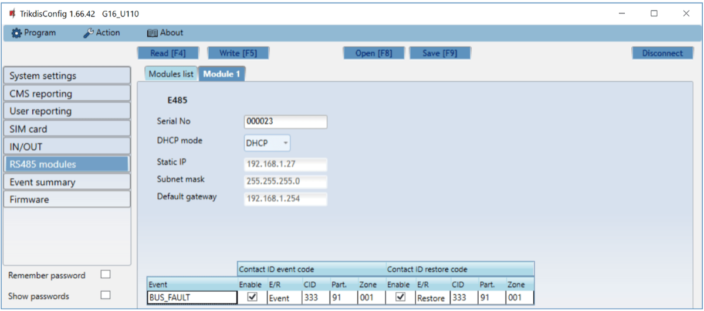

- **DHCP mode** – ethernet module’s mode for registering to network (DHCP or Static).

- **Static IP** – static IP address for when manual registering mode is set.

- **Subnet mask** – subnet mask for when manual registering mode is set.

- **Default gateway** – gateway address for when manual registering mode is set.

In the table, you can assign Contact ID event and restore codes to the RS485 data bus fault event. When connection between the E485 and G16 is disrupted or re-established, the G16 will send a message with the assigned CID code to the CMS and Protegus2 app.

!!! note
    You must configure the G16 to send messages to CMS and
    Protegus2, see chapters 2.2 "Settings for connection with Central
    Monitoring Station" and 2.1 "Settings for connection with Protegus2
    app". / **Insert SIM card into the communicator *G16* for E*485* to
    work.**
### “Event summary” window 

This window allows you to turn on, off, and modify internal messages sent by your device. Disabling an internal message in this window will prevent it from being sent regardless of other settings.

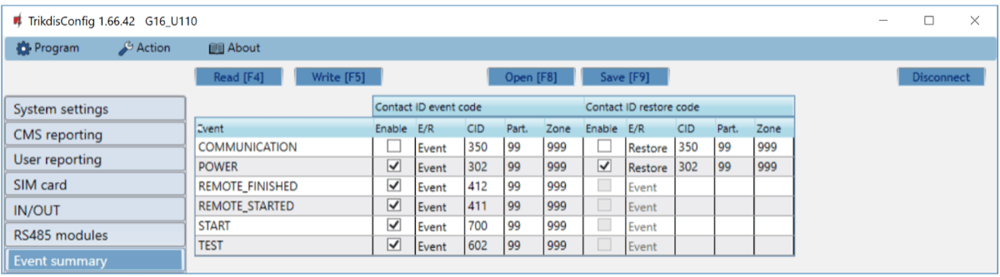

In this window, you can turn on, turn off or change the internal event messages sent by the device. After turning off the internal event in this window, it will not be sent irrespective of other settings.

- **COMMUNICATION** – message about connection error between the control panel and G16.

- **POWER** – message about low power supply voltage.

- **REMOTE_FINISHED** – message about disconnection from remote configuration with TrikdisConfig.

- **REMOTE_STARTED** – message about remote connection to configure G16 with TrikdisConfig.

- **START** – message about G16 connecting to the network.

- **TEST** – periodic test message.

!!! note
    To enable periodic TEST messages and set their period, go to **CMS
    reporting -> Settings -> Test period**.
- **Enable** – when selected, the sending of messages is enabled.

You can change the Contact ID code for each event, and also the zone and partition number.

### Restoring factory settings 

To restore the communicator's factory settings, you need to click the **Restore** button in the TrikdisConfig window.

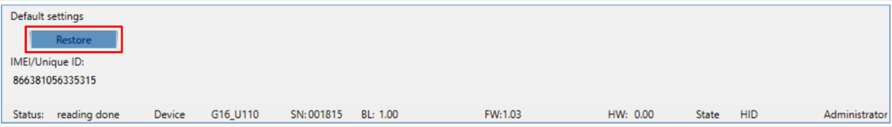

## Remote configuration 

!!! warning "Important"
    Remote configuration will work only if:

    1.  The inserted SIM card is activated and the PIN code is either
        entered or disabled;

    2.  Protegus cloud is enabled. How to enable cloud is
        described in section [6.4](#user-reporting-window) ["User reporting"
        window](#user-reporting-window);

    3.  Power supply is connected ("POWER" LED illuminates green);

    4.  Registered to the network ("NETWORK" LED illuminates green and
        blinks yellow).
1.  Start the configuration program TrikdisConfig.

2.  In the **Remote access** section enter the communicator’s **IMEI/Unique ID** number. This number can be found on the device and the packaging sticker.

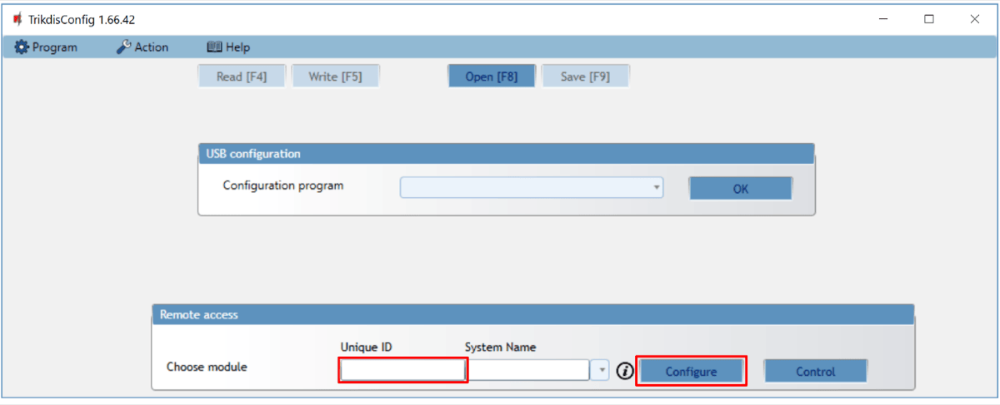

3.  (Optional) in the **System name** field, enter the desired name for the G16 with this Unique ID.

4.  Press **Configure**.

5.  In the newly opened window click **Read [F4]**. If required, enter the administrator or installer code*.* To save the password, select **“Remember password”**.

6.  Set the necessary settings and when finished, click **Write [F5]**.

## Test communicator performance

When the configuration and installation is complete, perform a system check:

1.  Generate an event:

- by arming/disarming the system with the control panel’s keypad;

- by triggering a zone alarm when the security system is armed.

2.  Make sure that the event arrives to the CMS (Central Monitoring Station) and/or is received in the Protegus2 application.

3.  To test communicator input, trigger it and make sure to receive the correct event.

4.  To test the communicator outputs, activate them remotely and check their operation.

5.  If the security control panel will be controlled remotely, arm/disarm the security system remotely by using the Protegus2 app.

## Firmware update 

!!! note
    When the communicator is connected to TrikdisConfig, the program
    will automatically offer to update the device's firmware if updates are
    present. Updates require an internet connection. Antivirus software,
    firewall or strict access to internet settings can block the automatic
    firmware updates. In this case, you will need to reconfigure your
    antivirus program.
The communicator’s firmware can also be updated or changed manually. After an update, all previously set settings will remain unchanged. When writing firmware manually, it can be changed to a newer or older version. To update:

1.  Run ***TrikdisConfig**.*

2.  Connect the communicator via USB cable to the computer or connect to the communicator remotely.

    - If a newer firmware version exists, the software will offer to download the newer firmware version file.

3.  Select the menu branch **Firmware**.

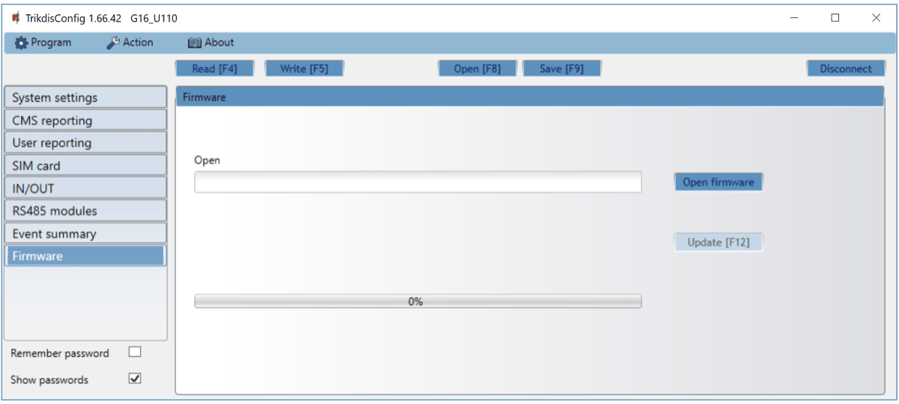

4.  Press **Open firmware** and select the required firmware file. If you do not have the file, the newest firmware file can be downloaded by <u>registered users</u> from [www.trikdis.com](http://www.trikdis.com) , under the download section of the G16 communicator.

5.  Press **Update [F12]**.

6.  Wait for the update to complete.

## Safety requirements

The communicator should be installed and maintained by qualified personnel.

Prior to installation, please read this manual carefully in order to avoid mistakes that can lead to malfunction or even damage to the equipment.

Disconnect the power supply before making any electrical connections.

Changes, modifications or repairs not authorized by the manufacturer shall void your rights under the warranty.

Please act according to your local rules and do not dispose of your unusable alarm system or its components with other household waste.

## Annex

The communicator can work with a SUR-GARD receiver. The communicator converts Contact ID codes received from the alarm control panel into SIA codes.

**Contact ID to SIA code conversion table**

| **System Event** | **CID Report Code** | **SIA Report Code** |
|----|:--:|:--:|
| Medical alarm | E100 | "MA" |
| Personal emergency | E101 | "QA" |
| Fire in zone: <z> | E110 | "FA" |
| Water flow detected in zone: <z> | E113 | "SA" |
| Pull station alarm in zone: <z> | E115 | "FA" |
| Panic in zone: <z> | E120 | "PA" |
| Panic alarm by user: <v> | E121 | "HA" |
| Panic alarm in zone: <z> | E122 | "PA" |
| Panic alarm in zone: <z> | E123 | "PA" |
| Panic alarm in zone: <z> | E124 | "HA" |
| Panic alarm in zone: <z> | E125 | "HA" |
| Alarm active in zone: <z> | E130 | "BA" |
| Alarm active in zone: <z> | E131 | "BA" |
| Alarm active in zone: <z> | E132 | "BA" |
| Alarm active in zone: <z> | E133 | "BA" |
| Alarm active in zone: <z> | E134 | "BA" |
| Alarm active in zone: <z> | E135 | "BA" |
| Tamper active in zone: <z> | E137 | "TA" |
| Intrusion verified in zone: <z> | E139 | "BV" |
| Alarm active in zone: <z> | E140 | "UA" |
| System failure (143) | E143 | "ET" |
| Tamper active in zone: <z> | E144 | "TA" |
| Tamper active in zone: <z> | E145 | "TA" |
| Alarm active in zone: <z> | E146 | "BA" |
| Alarm active in zone: <z> | E150 | "UA" |
| Gas detected in zone: <z> | E151 | "GA" |
| Water leakage detected in zone: <z> | E154 | "WA" |
| Foil break detected in zone: <z> | E155 | "BA" |
| High temperature at sensor: <n> | E158 | "KA" |
| Low temperature at sensor: <n> | E159 | "ZA" |
| CO detected in zone: <z> | E162 | "GA" |
| Fire failure in zone: <z> | E200 | "FS" |
| Monitored alarm | E220 | "BA" |
| System failure (300) | E300 | "YP" |
| AC power supply loss | E301 | "AT" |
| Low battery | E302 | "YT" |
| System failure (304) | E304 | "YF" |
| System reset in zone: <z> | E305 | "RR" |
| Panel programming changed | E306 | "YG" |
| System shutdown | E308 | "RR" |
| Battery failure (309) | E309 | "YT" |
| Ground fault | E310 | "US" |
| Battery failure (311) | E311 | "YM" |
| Power supply overcurrent (312) | E312 | "YP" |
| Engineer reset by user: <v> (313) | E313 | "RR" |
| Sounder/Relay failure | E320 | "RC" |
| System failure (321) | E321 | "YA" |
| System failure (330) | E330 | "ET" |
| System failure (332) | E332 | "ET" |
| System failure (333) | E333 | "ET" |
| System failure (336) | E336 | "VT" |
| System failure (338) | E338 | "ET" |
| System failure (341) | E341 | "ET" |
| System failure (342) | E342 | "ET" |
| System failure (343) | E343 | "ET" |
| System failure (344) | E344 | "XQ" |
| System communication failure (350) | E350 | "YC" |
| System communication failure (351) | E351 | "LT" |
| System communication failure (352) | E352 | "LT" |
| System failure (353) | E353 | "YC" |
| System communication failure (354) | E354 | "YC" |
| System failure (355) | E355 | "UT" |
| Fire trouble in zone: <z> | E373 | "FT" |
| Trouble in zone: <z> | E374 | "EE" |
| Trouble in zone: <z> | E378 | "BG" |
| Trouble in zone: <z> | E380 | "UT" |
| Wireless zone fault: <z> | E381 | "US" |
| Wireless module failure (382) | E382 | "UY" |
| Tamper active in zone: <z> | E383 | "TA" |
| Low battery in wireless zone: <z> | E384 | "XT" |
| Trouble in zone: <z> (389) | E389 | "ET" |
| Trouble in zone: <z> (391) | E391 | "NA" |
| Trouble in zone: <z> (393) | E393 | "NC" |
| User <v> disarmed the system | E400 | "OP" |
| User <v> disarmed the system | E401 | "OP" |
| Automatic disarm | E403 | "OA" |
| Deferred disarm <v> user | E405 | "OR" |
| Alarm cancelled by user: <v> | E406 | "BC" |
| User <v> disarmed remotely | E407 | "OP" |
| Quick disarm | E408 | "OP" |
| Remote disarm | E409 | "OS" |
| Callback request made by CMS | E411 | "RB" |
| Successful data download | E412 | "RS" |
| Entry access denied for user <v> | E421 | "JA" |
| Entry by user <v> | E422 | "DG" |
| Forced Access <z> zone | E423 | "DF" |
| Exit access denied for user <v> | E424 | "DD" |
| Exit by user <v> | E425 | "DR" |
| User <v> disarmed too early | E451 | "OK" |
| User <v> armed too late | E452 | "OJ" |
| User <v> Failed to Disarm | E453 | "CT" |
| User <v> Failed to Arm | E454 | "CI" |
| Auto arm failed | E455 | "CI" |
| Partial arm by user: <v> | E456 | "CG" |
| Exit violation by user: <v> | E457 | "EE" |
| System disarmed after alarm by user: <v> | E458 | "OR" |
| Recent arm <v> user | E459 | "CR" |
| Wrong code entered | E461 | "JA" |
| Auto-arm time extended by user: <v> | E464 | "CE" |
| Device disabled (501) | E501 | "RL" |
| Device disabled (520) | E520 | "RO" |
| Wireless sensor disabled in zone:<z> (552) | E552 | "YS" |
| Zone <z> bypassed | E570 | "UB" |
| Zone <z> bypassed | E571 | "FB" |
| Zone <z> bypassed | E572 | "MB" |
| Zone <z> bypassed | E573 | "BB" |
| Group bypass by user: <v> | E574 | "CG" |
| Zone <z> bypassed | E576 | "UB" |
| Zone <z> bypass cancelled | E577 | "UB" |
| Vent zone bypass | E579 | "UB" |
| Walk test activated by user:<v> | E607 | "TS" |
| Manual test report | E601 | "RX" |
| Periodic test report | E602 | "RP" |
| System event (605) | E605 | "JL" |
| System event (606) | E606 | "LF" |
| Periodic test report with trouble | E608 | "RY" |
| System event (622) | E622 | "JL" |
| System event (623) | E623 | "JL" |
| Time/Date was reset by user <v> | E625 | "JT" |
| Inaccurate Time/Date | E626 | "JT" |
| System programming started | E627 | "LB" |
| System programming finished | E628 | "LS" |
| System event (631) | E631 | "JS" |
| System event (632) | E632 | "JS" |
| System not active (654) | E654 | "CD" |
| Medical alarm restored | R100 | "MH" |
| Personal emergency restored | R101 | "QH" |
| No more fire alarm in zone :<z> | R110 | "FH" |
| No more water flow alarm in zone:<z> | R113 | "SH" |
| Panic alarm restored in zone:<z> | R120 | "PH" |
| Panic alarm cancelled by user: <v> | R121 | "HH" |
| Panic alarm restored in zone:<z> | R122 | "PH" |
| Panic alarm restored in zone: <z> | R123 | "PH" |
| Panic alarm restored in zone: <z> | R124 | "HH" |
| Panic alarm restored in zone: <z> | R125 | "HH" |
| No more alarm in zone: <z> | R130 | "BH" |
| No more alarm in zone: <z> | R131 | "BH" |
| No more alarm in zone: <z> | R132 | "BH" |
| No more alarm in zone: <z> | R133 | "BH" |
| No more alarm in zone: <z> | R134 | "BH" |
| No more alarm in zone: <z> | R135 | "BH" |
| No more tamper in zone: <z> | R137 | "TA" |
| No more alarm in zone:<z> | R140 | "UH" |
| No more system failure (143) | R143 | "UR" |
| No more tamper in zone: <z> | R144 | "TR" |
| No more tamper in zone: <z> | R145 | "TR" |
| No more alarm in zone: <z> | R146 | "BH" |
| No more alarm in zone: <z> | R150 | "UH" |
| No more gas alarm in zone:<z> | R151 | "GH" |
| No more water leakage alarm in zone: <z> | R154 | "WH" |
| Foil break restored in zone: <z> | R155 | "BH" |
| Temperature has normalized at sensor: <n> | R158 | "KH" |
| Temperature has normalized at sensor: <n> | R159 | "ZH" |
| No more CO alarm in zone: <z> | R162 | "GH" |
| No more fire failure in zone: <z> | R200 | "FV" |
| Monitored restore alarm | R220 | "BH" |
| No more system failure (300) | R300 | "YA" |
| AC power supply OK | R301 | "AR" |
| Battery OK | R302 | "YR" |
| No more system failure (304) | R304 | "YG" |
| System reset restored in zone: <z> | R305 | "RR" |
| No more battery failure (309) | R309 | "YR" |
| Restore ground fault | R310 | "UR" |
| No more battery failure (311) | R311 | "YR" |
| Restore power supply overcurrent (312) | R312 | "YQ" |
| No more sounder/Relay failure | R320 | "RO" |
| No more system failure (321) | R321 | "YH" |
| No more system failure (330) | R330 | "ER" |
| No more system failure (332) | R332 | "ER" |
| No more system failure (333) | R333 | "ER" |
| No more system failure (336) | R336 | "VR" |
| No more system failure (338) | R338 | "ER" |
| No more system failure (341) | R341 | "ER" |
| No more system failure (342) | R342 | "ER" |
| No more system failure (344) | R344 | "XH" |
| No more system communication failure (350) | R350 | "YK" |
| No more system communication failure (351) | R351 | "LR" |
| No more system communication failure (352) | R352 | "LR" |
| No more system failure (353) | R353 | "YK" |
| No more system communication failure (354) | R354 | "YK" |
| No more system failure (355) | R355 | "UJ" |
| Fire trouble restored in zone: <z> | R373 | "FJ" |
| No more trouble in zone: <z> | R374 | "EA" |
| No more trouble in zone: <z> | R380 | "UJ" |
| No more wireless zone fault: <z> | R381 | "UR" |
| No more wireless module failure (382) | R382 | "BR" |
| No more tamper in zone: <z> | R383 | "TR" |
| Battery OK in wireless zone: <z> | R384 | "XR" |
| No more trouble in zone: <z> (391) | R391 | "NS" |
| No more trouble in zone: <z> (393) | R393 | "NS" |
| User <v> armed the system | R400 | "CL" |
| User <v> armed the system | R401 | "CL" |
| Automatic arm | R403 | "CA" |
| User <v> armed remotely | R407 | "CL" |
| Quick arm | R408 | "CL" |
| Remote arm | R409 | “CS” |
| User <v> armed to Stay mode | R441 | "CG" |
| User <v> armed too early | R451 | “CK” |
| User <v> disarmed too late | R452 | “CJ” |
| User <v> Failed to Disarm | R454 | “CI” |
| Partial Arm by user: <v> | R456 | "CG" |
| Recent disarm <v> user | R459 | “CR” |
| Device enabled (501) | R501 | "RG" |
| Device enabled (520) | R520 | "RC" |
| Wireless sensor enabled in zone: <z> (552) | R552 | "YK" |
| Zone <z> bypass cancelled | R570 | "UU" |
| Zone <z> bypass cancelled | R571 | "FU" |
| Zone <z> bypass cancelled | R572 | "MU" |
| Zone <z> bypass cancelled | R573 | "BU" |
| Group bypass by user: <v> cancelled | R574 | "CF" |
| Zone <z> bypass cancelled | R576 | "UU" |
| Zone <z> bypass cancelled | R577 | "UU" |
| Vent zone bypass cancelled | R579 | "UU" |
| Walk test deactivated by user <v> | R607 | "TE" |
| Time/Date was reset by user <v> | R625 | "JT" |
| System active (654) | R654 | "CD" |
