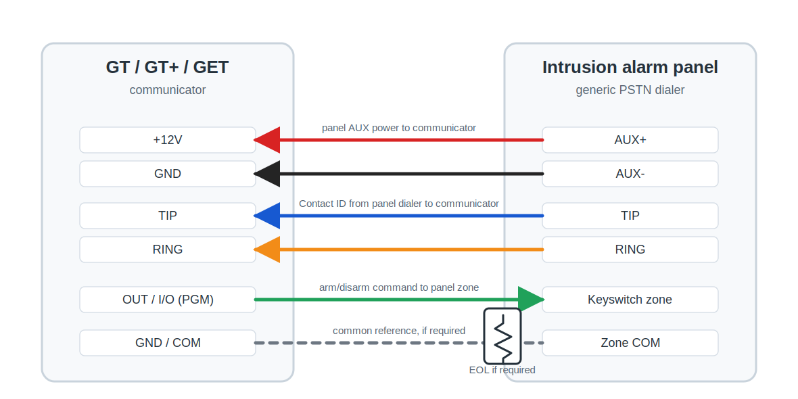

# GT/GT+/GET universal TIP/RING connection to an intrusion alarm panel

Use this guide when an intrusion alarm panel reports events through its PSTN landline dialer. The GT/GT+/GET communicator connects to the panel `TIP` / `RING` terminals, automatically captures Contact ID events, and can optionally arm/disarm the system from Protegus2 through a panel keyswitch zone. Use this alongside the full communicator manual and the alarm panel programming manual.

!!! caution
    Install and service only by qualified personnel. Disconnect power before wiring. Unauthorized changes void warranty.

## Prerequisites

- GT/GT+/GET firmware 1.21, SIM inserted, PIN disabled, data plan active.
- Intrusion alarm panel with a PSTN landline dialer that supports Contact ID over DTMF tones.
- Protegus2 company/installer account and communicator IMEI.
- Panel installer code and the panel programming manual only if the panel is not already dialing through the landline dialer, if dialer settings must be changed, or if remote arm/disarm via a keyswitch zone will be added.
- Spare panel zone that can be programmed as a keyswitch zone only if remote arm/disarm is required.

!!! note
    If the panel previously reported through a landline dialer, keep the panel dialer enabled and connect the communicator to the panel `TIP` / `RING` terminals. The communicator answers the panel call and automatically captures the Contact ID events with any account ID sent by the panel. Change panel programming only when the panel is not already dialing, the dialer settings are not correct, the account ID must match an ARC/CMS requirement, or a keyswitch zone must be added for remote arm/disarm.

## Wiring

Disconnect panel and communicator power before wiring. Connect the communicator to panel power, `TIP` / `RING`, and the keyswitch zone as shown below.

| GT/GT+/GET terminal | Alarm panel terminal | Purpose |
| --- | --- | --- |
| `+12V` / `GND` | `AUX+` / `AUX-` | Power the communicator from the panel auxiliary output. |
| `TIP` / `RING` | `TIP` / `RING` | Capture Contact ID events from the panel telephone dialer. |
| `OUT` / `I/O` configured as PGM | Keyswitch zone input | Send arm/disarm commands from Protegus2. |
| `GND` / `COM` | Zone common, if required | Common reference for the keyswitch zone wiring. |

!!! warning
    Wire the keyswitch zone exactly as required by the panel manual. Some panels use a normally open input, normally closed input, EOL resistor, double EOL resistor, or a dedicated common terminal.

## Panel programming

Skip this section if the panel is already dialing through the landline dialer and remote arm/disarm is not needed. Panel programming codes are different for each manufacturer and model. Use the alarm panel programming manual only for the items that must be changed.

1. Enable the panel PSTN landline dialer.
2. Select tone / DTMF dialing.
3. Select the Contact ID reporting format.
4. Set the receiver telephone number. If the panel already reported to a monitoring station through a landline, the existing number can usually stay unchanged. For a new dial-capture setup, enter any receiver number longer than 4 digits unless the panel manual requires a different format.
5. If reporting to ARC/CMS is required, set the panel account ID to the value supplied by the monitoring station. The communicator can transmit the account ID sent by the panel, so no separate communicator Object ID is required for basic dial capture.
6. Enable the events that must be reported, including alarms, restores, troubles, tampers, and opening/closing events where required.
7. Program the zone connected to the communicator output as a keyswitch zone only when remote arm/disarm from Protegus2 is required.
8. Select the keyswitch type that matches the communicator output mode: momentary / pulse or maintained / level.
9. Assign the keyswitch zone to the correct partition or area, then save and exit programming.

!!! important
    Remote arm/disarm from Protegus2 works only when the wired panel zone is programmed as a keyswitch zone. The app status also depends on the panel sending opening and closing events through the dialer.

## Add system to Protegus2

  

    <strong>Step 1.</strong> Tap <strong>Add new system</strong>.
    
  

  

    <strong>Step 2.</strong> Enter the communicator <strong>IMEI</strong>, tap <strong>Next</strong>.
    
  

  

    <strong>Step 3.</strong> Select security company.
    
  

  

    <strong>Step 4.</strong> Choose <strong>TIP RING</strong>.
    
  

  

    <strong>Step 5.</strong> Choose <strong>Mode</strong>.
    
  

  

    <strong>Step 6.</strong> Choose <strong>AUTO</strong>.
    
  

  

    <strong>Step 7.</strong> Enter <strong>Object ID</strong> if required by the wizard or monitoring setup, enter <strong>Module ID</strong>, then tap <strong>Next</strong>.
    
  

  

    <strong>Step 8.</strong> Wait while data is written.
    
  

  

    <strong>Step 9.</strong> Tap <strong>Add to Protegus2</strong>.
    
  

  

    <strong>Step 10.</strong> Enter system <strong>Name</strong>, tap <strong>Next</strong>.
    
  

  

    <strong>Step 11.</strong> Enter <strong>Area name</strong>. Enable <strong>Control with Protegus2</strong>.
    
  

  

    <strong>Step 12.</strong> Choose the wired PGM output. Select <strong>Pulse</strong> or <strong>Level</strong> to match the panel keyswitch zone, then tap <strong>Save</strong>.
    
  

!!! tip
    If only event reporting is needed, skip the keyswitch output wiring and leave remote arm/disarm disabled in Protegus2.

## System check

- [ ] Arm and disarm the panel from the keypad.
- [ ] Trigger a test alarm while the system is armed.
- [ ] Confirm that events arrive to Protegus2. If ARC/CMS reporting is used, confirm that the monitoring station receives events with the expected account ID.
- [ ] Arm and disarm the system from Protegus2, if the keyswitch zone is wired.
- [ ] Confirm that the panel follows the app command and then reports the opening/closing event back to Protegus2.
- [ ] If events are not received, check panel dialer enablement, DTMF dialing, Contact ID format, telephone number, `TIP` / `RING` wiring, and the account ID only when ARC/CMS reporting is expected.
