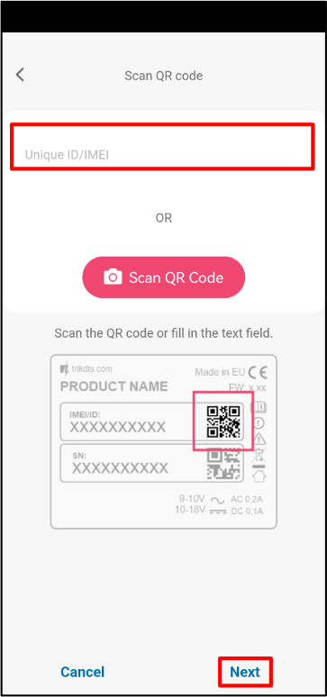
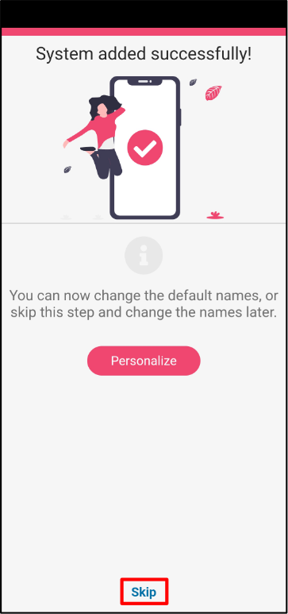

# GT/GT+/GET with Paradox SP(+)/MG(+), quick setup

Short wiring and programming steps to connect the GT/GT+/GET communicator to Paradox SP/SP+/MG/MG+ panels using TIP/RING and KeyBus, then enroll the system in Protegus2. Use this alongside the full manuals for all other settings. (Terminal labels differ slightly between GT/GT+/GET, but the connections are the same.)

!!! caution
    Install and service only by qualified personnel. Disconnect power before wiring. Unauthorized changes void warranty.

## Prerequisites

- GT/GT+/GET firmware 1.21, SIM inserted, PIN disabled, data plan active.
- Paradox SP/SP+/MG/MG+ panel with keypad access (installer code available).
- CMS account number if reporting to CMS.
- Protegus2 company/installer account and communicator IMEI.

## Wiring

Follow the schematic below to connect the communicator to the panel:

| GT/GT+/GET terminal | Paradox panel | Notes |
| --- | --- | --- |
| TIP / RING | TIP / RING | For PSTN line emulation (Contact ID). |
| CLK / DATA (KeyBus) | YEL / GRN (KeyBus) | For serial bus control. |
| +12V / GND | AUX + / GND | Power the communicator. |

## Program Paradox panel (LCD keypad)

Use the panel keypad to enable Contact ID and set account numbers:

1. Enter installer programming: `[ENTER] 0000` (or your installer code).
2. Section 801: general dialer options → leave defaults unless required.
3. Section 811: enter Partition 1 account number (placeholder example: `1111`; use your CMS-provided value).
4. Section 812: enter Partition 2 account number (placeholder example: `2222`; use your CMS-provided value).
5. Section 815: enter phone number for reporting (placeholder example: `123456`; use your CMS-provided value).
6. Section 911: set PC password (placeholder example: `1234`; set per your policy).
7. Press `[CLEAR]` to exit programming.

Refer to the full Paradox manual if your keypad codes differ.

## Add system to Protegus2 (mobile or web)

  

    <strong>Step 1.</strong> Tap <strong>Add new system</strong>.
    
  

  

    <strong>Step 2.</strong> Enter the communicator <strong>IMEI</strong>, tap <strong>Next</strong>.
    
  

  

    <strong>Step 3.</strong> Select <strong>TIP RING</strong>, tap <strong>Next</strong>.
    
  

  

    <strong>Step 4.</strong> Tap <strong>Back</strong>.
    
  

  

    <strong>Step 5.</strong> Select <strong>Serial BUS</strong>, tap <strong>Next</strong>.
    
  

  

    <strong>Step 6.</strong> Choose <strong>PARADOX</strong>.
    
  

  

    <strong>Step 7.</strong> Choose <strong>PARADOX SP+/MG+ series KeyBus</strong>.
    
  

  

    <strong>Step 8.</strong> Enter <strong>Primary Object ID</strong>, tap <strong>Next</strong>.
    
  

  

    <strong>Step 9.</strong> Wait while data is written.
    
  

  

    <strong>Step 10.</strong> Tap <strong>Next</strong>.
    
  

  

    <strong>Step 11.</strong> Enter system <strong>Name</strong>, tap <strong>Next</strong>.
    
  

  

    <strong>Step 12.</strong> Tap <strong>Skip</strong> (if you do not add users now).
    
  

  

    <strong>Step 13.</strong> Wait ~1 minute for completion.
    
  

  

    <strong>Step 14.</strong> Setup finished.
    
  

!!! tip
    If Protegus2 cannot finish writing data, verify the KeyBus wiring (YEl/GRN), IMEI entry, and that CMS/Contact ID settings are saved on the panel.
