# Ethernet communicator E16T

  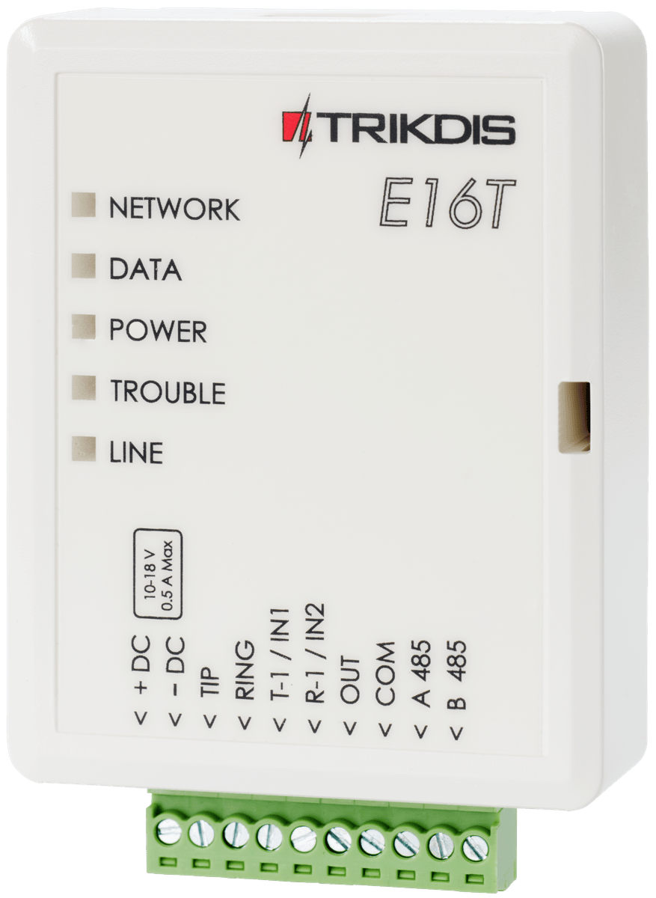

##  Description 

Communicator E16T improves security control panels with telephone communicator for sending and managing events using a wired internet connection.

The communicator can transmit full event information to the receiver of the central monitoring station (CMS).

The communicator works with Protegus apps. With Protegus, users can control their alarms remotely and receive event notifications. The Protegus app works with all the security systems of other manufacturers to, which the E16T is connected. The communicator can send messages to the CMS and work with Protegus simultaneously.

The E16T is connected to the control panel telephone communicator by 2 wires to receive event messages transmitted by DTMF tones using Contact ID protocol.

### Features

**Connects to panel’s landline dialer:**

- Communicator can be connected to control panel’s landline dialer with 2 or 4 wires.

- When connected with 4 wires, the landline between the panel and communicator will be monitored.

Sends events to monitoring station receiver:

- Sends events to TRIKDIS software or hardware receivers that work with any monitoring software.

- Can send event messages to SIA DC-09 receivers.

- Connection supervision by polling to IP receiver every 30 seconds (or by user defined period).

- Backup channel, that will be used if connection with the primary channel is lost.

- When Protegus service is enabled, events are first delivered to CMS, and only then are sent to app users.

**Works with Protegus app:**

- “*Push*” and special sound notifications informing about events.

- Remote system Arm/Disarm.

- Remote control of connected devices (lights, gates, ventilation systems, heating, sprinklers, etc.).

- Different user rights for administrator, installer and user.

**Notifies users:**

- Users can be notified about events with Protegus app.

**Controllable outputs and inputs:**

- 1 output, controlled via:

  - Protegus app.

- 2 inputs, selectable type: NC; NO; EOL.

**Quick setup:**

- Settings can be saved to file and quickly written to other communicators.

- Two access levels for configuring the device for CMS administrator and for installer.

- Remote configuration and firmware updates.

### Specifications 

| Parameter | Description |
|:---|----|
| Power supply voltage | 10-18 V DC |
| Current consumption | Up to 0,5 A |
| Ethernet connection | IEEE802.3, 10 Base-T, RJ45 socket |
| Data pack content | Contact ID format codes |
| Memory | Up to 100 messages |
| Inputs | 2, NC/​NO/​EOL 2,2 kΩ type |
| Output | 1 OC type, commutating voltage up to 30 V and current up to 0,15 A |
| Operating environment | Temperature from -10 °C to 50 °C, relative humidity - up to 80% at +20 °C |
| Dimensions | 88 x 62 x 25 mm |
| Weight | 80 g |

### Communicator elements 

1.  Light indicators.

2.  Frontal case opening slot.

3.  Terminal for external connections.

4.  USB Mini-B port for communicator programming.

5.  Ethernet connection RJ45 socket.

### Purpose of terminals 

| Terminal | Description |
|----|----|
| +DC | Power supply terminal (10-18 V DC positive terminal) |
| -DC | Power supply terminal (10-18 V DC negative terminal) |
| TIP | Terminal to connect with security control panel TIP terminal |
| RING | Terminal to connect with security control panel RING terminal |
| T-1 /​ IN1 | Terminal for monitoring the telephone line or an input terminal, selectable type: NC;​ NO;​ EOL |
| R-1 /​ IN2 | Terminal for monitoring the telephone line or an input terminal, selectable type: NC;​ NO;​ EOL |
| OUT | Output terminal (OC type), current up to 0,15 A |
| COM | Common terminal (negative) |
| A 485 | *RS485* bus A contact |
| B 485 | *RS485* bus B contact |

### LED indication of operation 

| Indicator | Light status | Description |
|-----------|--------------|-------------|
| NETWORK | Green solid | Communicator is connected to the Internet |
| NETWORK | Off | Not connected to the LAN |
| DATA | Yellow solid | There are unsent events in the buffer memory |
| DATA | Green blinkings | Messages are sent from the security control panel |
| POWER | Green blinkings | Power supply is on with sufficient voltage |
| POWER | Yellow blinkings | Power supply is not sufficient (≤11,5 V) |
| TROUBLE | Red solid | LAN connection problem |
| TROUBLE | Off | Works without problems |
| LINE | Green solid | The control panel “raised” the handset |

### Structural schematic with E16T usage 

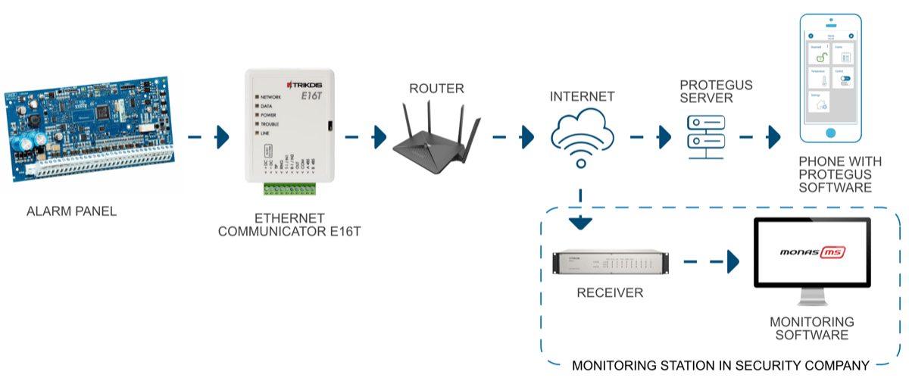

!!! note
    Before configuration, make sure you have all the necessary components:
    
    1.  USB Mini-B cable is required for configuration.
    
    2.  „CAT-5 Ethernet" cable (maximum 100 m in length).
    
    3.  At least 4 wired cable to connect communicator to the security alarm
        system.
    
    4.  Flat screwdriver.
    
    5.  User Manual for control panel to which Trikdis communicator will be
        connected.
    
    Missing components order separately from your local distributor.
## Quick configuration with *TrikdisConfig* software 

1.  Download configuration software TrikdisConfig from [www.trikdis.com](http://www.trikdis.com) (type “TrikdisConfig” in the search field) and install it.

2.  Open the casing of the E16T with a flat-head screwdriver as shown below:

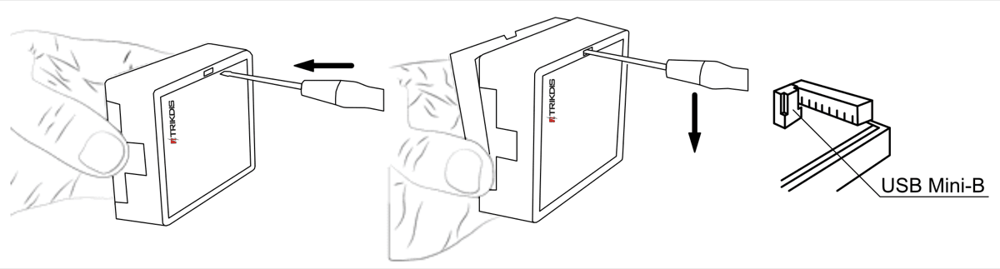

1.  Using a USB Mini-B cable connect the E16T to the computer.

2.  Run TrikdisConfig. The software will automatically recognize the connected communicator and will open a window for configuration. /

3.  Click **Read [F4]** to read the communicator’s settings. If requested, enter the Administrator or Installer 6-digit code in the pop-up window.

Below we describe what settings need to be set for the communicator to begin sending events to the Central Monitoring Station and to allow the security control to be controlled with the Protegus app.

### Settings for connection with Protegus app 

**In the *“System Settings*” window:**

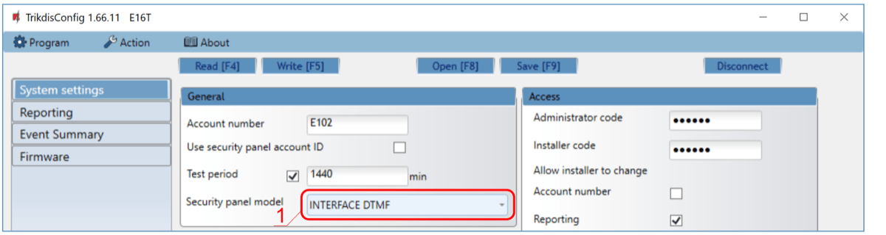

1.  Select **Security panel model** that will be connected to the communicator.

**In “Reporting” window “Protegus Service” tab:**

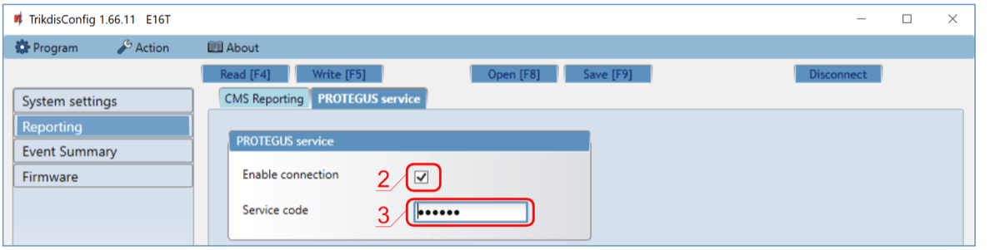

2. Check **Enable connection** in Protegus service checkbox.

2.  Change the **Service code** for logging in to Protegus, if you want to ask users to add it by adding the Protegus system in the application (factory default - 123456).

After finishing configuration, click the button **Write [F5]** and disconnect the USB cable.

!!! note
    For more information about other E16T settings in
    TrikdisConfig, see chapter 7 "TrikdisConfig windows description".
### Settings for connection with Central Monitoring Station 

**In “System settings” window:**

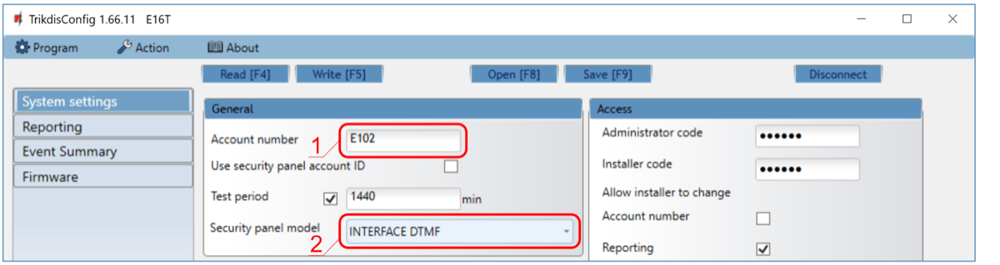

1.  Enter **Account number** provided by the Central Monitoring Station (4 characters, 0-9, A-F. **Do not use FFFE, FFFF Object ID.**).

2.  Select **Security panel model** that will be connected to the communicator.

**In “Reporting” window settings for „Primary“ channel:**

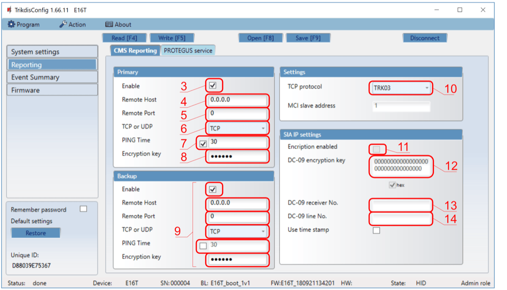

3.  **Enable** – enable primary communication channel.

4.  **Remote Host** – enter the receiver’s IP address.

5.  **Remote Port** – enter receiver’s network port number.

6.  **TCP or UDP** – choose event transmission protocol (**TCP** or **UDP**) in which events should be sent.

7.  **PING Time** – PING signal transmission period.

8.  **Encryption key** – enter the encryption key that is set in the receiver.

9.  (Recommended) Configure the **Backup** Channel Settings.

10. **TCP protocol** – select which encoding protocol will be use: TRK (for TRIKDIS receivers), DC-09_2007 or DC-09_2012 (for universal receivers).

11. **Encription enabled** - if TCP protocol SIA DC09_2012 is selected, encryption can be enabled.

12. **DC-09 encryption key** – enter encryption key that is set in the receiver.

13. **DC-09 receiver No.** - enter receiver number.

14. **DC-09 line No**. – enter receiver line number.

!!! note
    If you have selected DC-09 message transmission encoding, in addition to
    the "Reporting" window, on the "Settings" tab, enter the object, line
    and receiver numbers.
**In “Reporting” window “Protegus Service” tab:**

15. Select checkbox **Enable connection** to the PROTEGUS Cloud.

16. You can change the **Service code** for logging into Protegus if you want users to be asked to enter it when adding the system to Protegus app (default password - 123456).

After finishing configuration, click the button **Write [F5]** and disconnect the USB cable.

!!! note
    For more information about other E16T settings in
    TrikdisConfig, see chapter 7 "TrikdisConfig windows description".
## Installation and wiring 

### Schematics for wiring the communicator to the security control panel 

Following the provided schematics connect the communicator to the control panel.

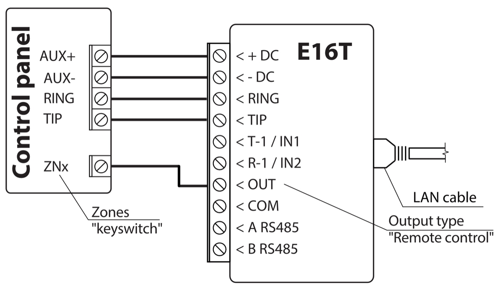

### Schematics for wiring inputs 

The communicator has two input terminals (IN1, IN2) for connecting NO, NC, EOL type circuits. Default input setting - NO. The input type can be changed in the TrikdisConfig window **Event summary**.

Connect the input according to the selected input type (NO, NC, EOL), as shown in the schemes below:

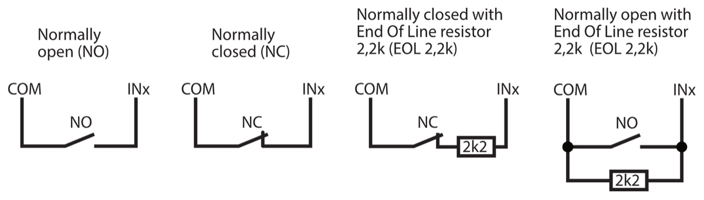

### Connect LAN cable 

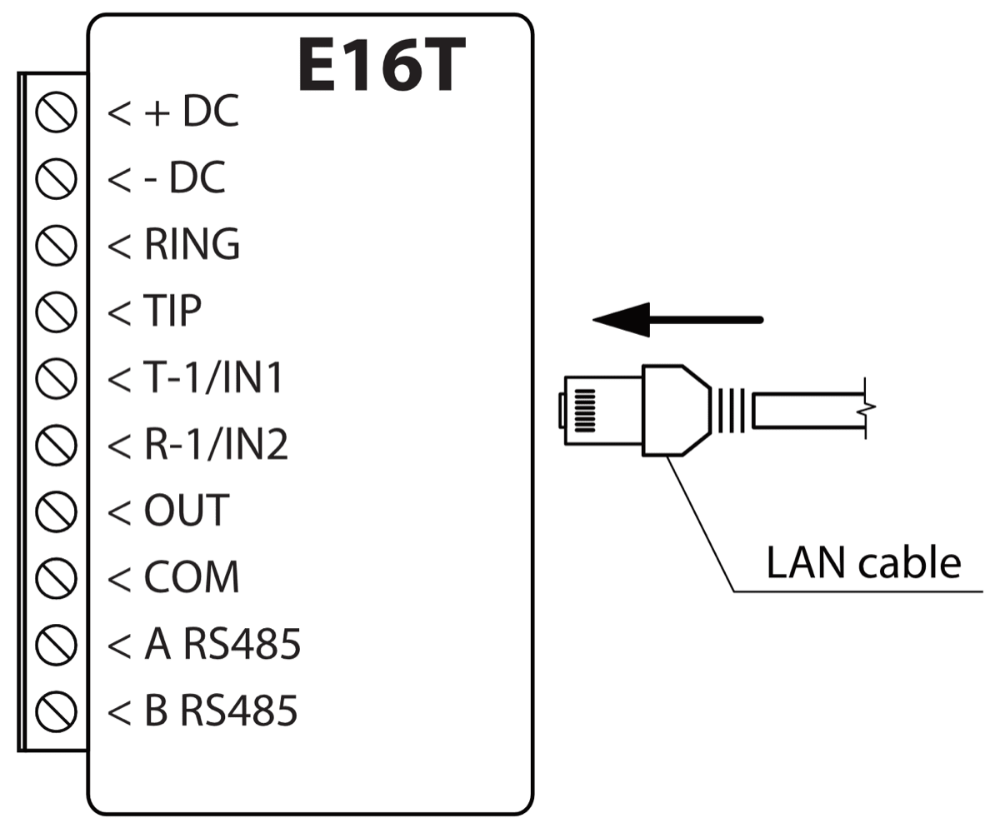

### Schematic for wiring a relay and LED 

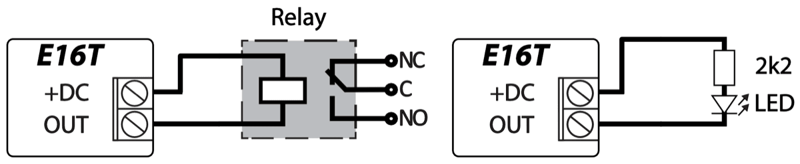

## Programming the control panel 

In order for the security panel to send events via the telephone communicator, it must be enabled and properly configured. Set the control panel telephone communicator according to the programming guide of security panel:

1.  Turn on the panel’s PSTN landline dialer.

2.  If the communicator is connected to the telephone line, enter the phone number - 1234. If the communicator is connected to the control panel RING / TIP terminal, enter any number of at least 2 digits.

3.  Choose DTMF mode.

4.  Select Contact ID communication protocol.

5.  Enter the panel’s 4 digit account number.

### Programming Honeywell Vista landline dialer 

Using the control panel’s keypad enter these sections and set them as described:

- \*41 – enter monitoring station receiver telephone number;

- \*43 – enter control panel’s account number;

- \*47 – set the Tone dial to [1] and enter the number of dial attempts;

- \*48 – use default setting, \*48 must be set to 7;

- \*49 – Split/Dual message. \*49 must be set to 5;

- \*50 – delay for sending burglary alarm events (optional). Default value is [2,0]. With it the event message transmission will be delayed for 30 seconds. If you want the message to be sent immediately, set [0,0].

**Exit programming mode**

When all required settings are set, it is necessary to exit programming mode. Enter \*99 in keypad.

#### Special settings for Honeywell Vista 48 panel 

If you want to use E16T communicator with Honeywell Vista 48 panel, set the following sections as described:

| Section | Data                             | Section | Data | Section | Data |
|:-------:|:---------------------------------|:-------:|:----:|:-------:|:----:|
|  \*41   | 1111 (receiver telephone number) |  \*60   |  1   |  \*69   |  1   |
|  \*42   | 1111                             |  \*61   |  1   |  \*70   |  1   |
|  \*43   | 1234 (panel account number)      |  \*62   |  1   |  \*71   |  1   |
|  \*44   | 1234                             |  \*63   |  1   |  \*72   |  1   |
|  \*45   | 1111                             |  \*64   |  1   |  \*73   |  1   |
|  \*47   | 1                                |  \*65   |  1   |  \*74   |  1   |
|  \*48   | 7                                |  \*66   |  1   |  \*75   |  1   |
|  \*50   | 1                                |  \*67   |  1   |  \*76   |  1   |
|  \*59   | 0                                |  \*68   |  1   |         |      |

When all required settings are set, it is necessary to exit programming mode. Enter \*99 in keypad.

## Remote control 

### Adding the security system to Protegus app 

With Protegus users will be able to control their alarm system remotely. They will see the status of the system and receive notifications about system events.

1.  Download and launch the Protegus application or use the browser version: [www.protegus.app](https://www.protegus.app)

    

      
      
      
    

2.  Log in with your user name and password or register and create a new account.

!!! note
    When adding the E16T to Protegus check if :
    
    1.  Protegus cloud is enabled. See chapter **6.3 "Reporting"
        window**;
    
    2.  Power supply is connected ("POWER" LED illuminates green);
    
    3.  E16T connected to the Internet (LAN cable connected). The
        "NETWORK" indicator lights up green when there is a connection.
3. Click **Add new system** and enter the E16T’s „*MAC*” number. This number can be found on the device and the packaging sticker. After entering press **Next**.

    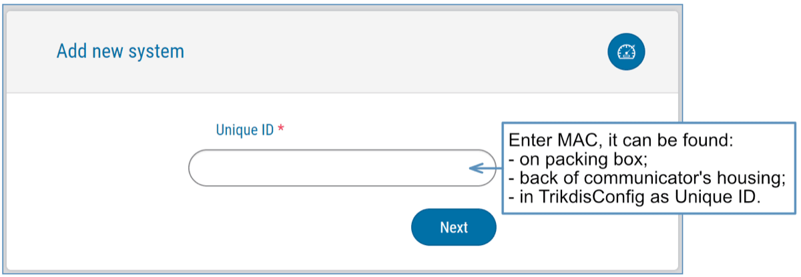

### Additional settings to arm/disarm the alarm system using control panel’s keyswitch zone 

!!! warning "Important"
    The control panel zone to which the E16T output OUT is connected
    to has to be set to keyswitch mode.
Follow the instructions below if the security control panel will be controlled with the E16T output OUT, turning on/off the control panel keyswitch zone.

1.  In the new window, click "Areas" in the side menu. In the window that opens, specify the area of the alarm system 1 (communicator has one OUT output) and press "Next.

    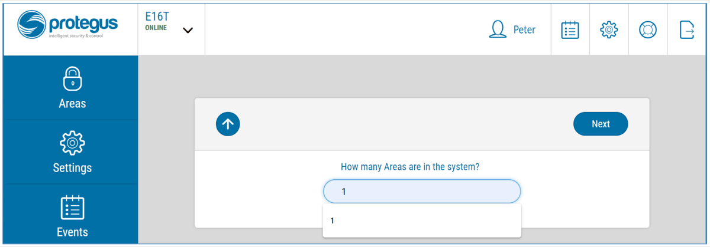

2.  In the new window, identify what is the number for each of the specified areas in the security system and press **Save**.

    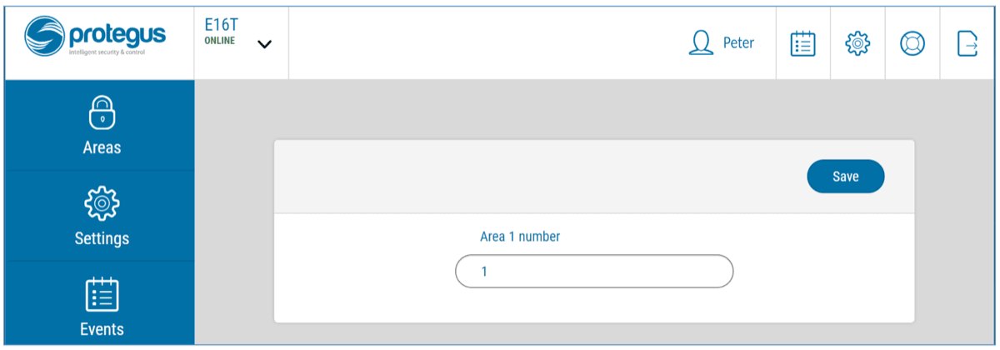

3.  In the side menu press **Settings** and in the newly opened window press **Settings**. Select the box **Arm/Disarm** **with** **PGM** and specify which area the output will control. One output OUT can control only one area.

4.  Select **Level** or **Pulse**, depending on the type of control panel keyswitch zone. You can also change the duration of the pulse interval if it is required for the connected control panel.

5.  For additional security, you can select **Use Application password for ARM/DISARM**. Then after pressing the button to arm/disarm the alarm system, a window for entering the app password will open.

    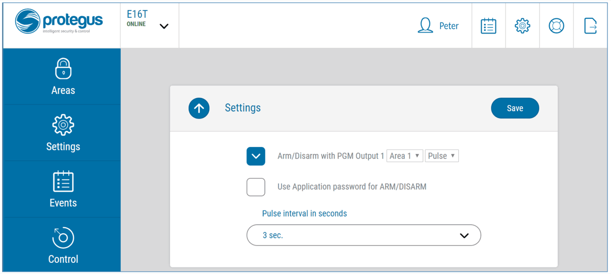

### Arming/disarming the alarm system with Protegus 

1.  To arm/disarm the alarm system, open the Protegus window **Areas**.

2.  In the **Areas** window press the Area button. In the opened window select the action (to arm or to disarm the alarm system).

3.  If asked, enter the user code or Protegus password.

    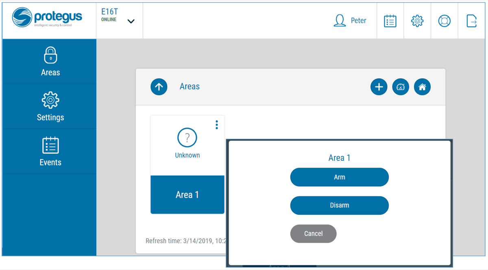

## Remote configuration 

!!! warning "Important"
    Remote configuration will work only when **E16T**:

    1.  Protegus **service** is enabled. The service activation is
        described in chapter 7.3 "Reporting" window;

    2.  Power supply is connected (POWER LED flashes green);

    3.  E16T connected to the Internet (LAN cable connected). The
        "NETWORK" indicator lights up green when there is a connection.
1.  Download TrikdisConfig from [www.trikdis.lt](http://www.trikdis.lt).

2.  Make sure the E16T communicator is connected to the Internet and is enabled to Protegus service.

3.  Start the configuration program TrikdisConfig and the section **Remote Access** in the **Unique ID** field, enter the existing E16T MAC address (the MAC address is indicated on the stickers affixed to the underside of the communicator and the package).

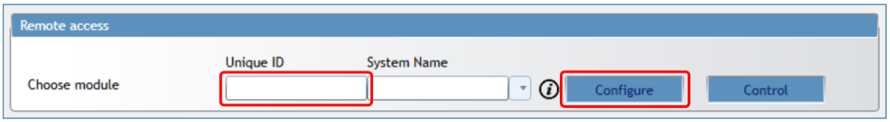

4. (Optional) In the **System name** field, enter the desired name for the E16T with this Unique ID. Press **Configure.**

2.  The communicator configuration window will open. Click the **Read [F4]** button to read the program for the E16T set parameters. If the *Administrator Code* Input window opens, enter the six-digit administrator code value. In order for the program to remember the code, check the box next to **Remember Password**.

3.  Set the necessary settings and when finished, click **Write [F5].**

## TrikdisConfig window description 

### *TrikdisConfig* status bar description 

After connecting the E16T and clicking **Read [F4], *TrikdisConfig*** will provide information about the connected device in the status bar:

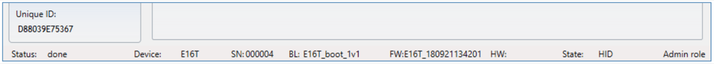

| Object    | Description                                        |
|-----------|----------------------------------------------------|
| Unique ID | Device IMEI number                                 |
| Status    | Operating condition                                |
| Device    | Device type (E16T should be shown)           |
| SN        | Device serial number                               |
| BL        | Browser version                                    |
| FW        | Device firmware version                            |
| HW        | Device hardware version                            |
| Status    | Connection to program type (via USB or remote)     |
| Admin     | Access level (shown after access code is approved) |

After pressing **Read [F4]**, the program will read and show the settings which are set in the ***E16T*.** Set the necessary settings according to the TrikdisConfig window descriptions given below.

### “System settings” window 

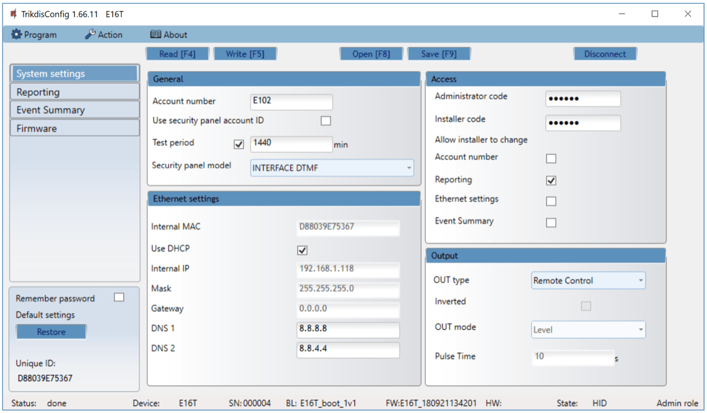

**“General” settings group**

- **Account number** – if the events will be sent to the CMS (Central Monitoring Station), enter the account number provided by the CMS (4 characters hexadecimal number, 0-9, A-F. **Do not use FFFE, FFFF Object ID.**).

- **Use security panel account ID** – if the checkbox is selected, the communicator will send events with the account ID entered in the panel instead of the value set in the **Account number** field.

- **Test period -** periodic test messages will be sent according to a time interval set in this section.

- **Security panel model** – enable/disable DTMF landline interface on the communicator.

**„Ethernet settings” settings group**

- **Internal MAC -** unique communicator identifier code.

- Select **Use DHCP** checkbox for communicator to register automatically to the network.

  - If automatic registration is unsuccessful, enter **Internal IP address**, subnet **Mask**, **Gateway** address and **DNS** service manually.

**„Access“ settings group**

There are two access levels (administrator and installer) when configuring the E16T communicator:

- **Administrator code** - allows full access to the configuration (default code – 123456).

- **Installer code** - allows limited access for installer to the configuration (default code - 654321).

- **Allow installer to change** – the administrator can specify which settings the installer can change.

  - Account number;

  - Reporting;

  - Ethernet settings;

  - Event summary.

!!! note
    Administrator and installer codes must be in six-digit or Latin
    characters.
**„Output“ settings group**

- **OUT type** - choose output operation type from list (Disabled, LAN OK, Communication Trouble, Remote Control)**.**

- **Inverted** - select checkbox if output function should be inverted.

- **OUT mode:**

  - **Pulse -** a status will take time as indicated in **Pulse Time** (pulse period in seconds) field.

  - **Level -** a status will change and remain the same until the next command.
- **Pulse time** – enter time the duration of the pulse, s.. OUT output will be triggered for the set time when the output mode is Pulse.

### „Reporting“ windows 

**„CMS Reporting“ tab**

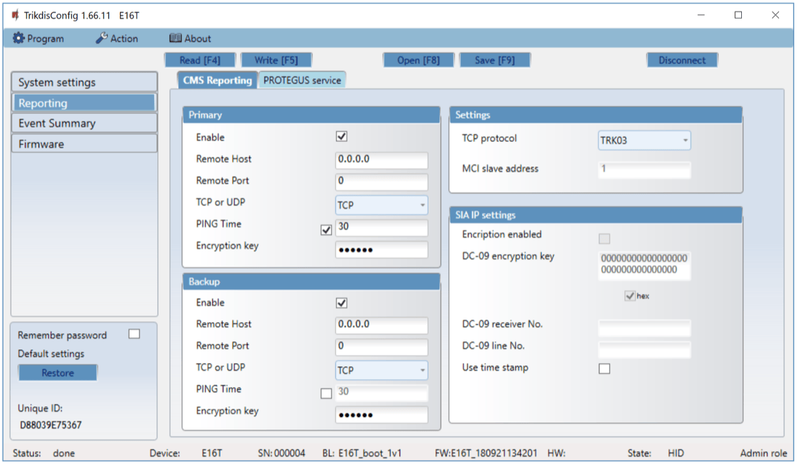

The communicator sends messages to the monitoring station via a wired internet (IP) connection.

Messages can be sent via the primary or backup channel. The backup communication channel will be used when the primary communication channel is interrupted.

Messages to the monitoring station are transmitted with encryption and password protection. To receive and transmit messages to the monitoring program, a TRIKDIS receiver is required:

- For connection over IP – software receiver IPcom Windows/Linux, hardware IP/SMS receiver RL14 or multichannel receiver RM14.

**„Primary“ settings group**

- **Enable** – if the checkbox is selected, the main channel for sending event messages to the CMS (central monitoring station) is activated.

- **Remote Host** – enter the domain or IP address of the receiver.

- **Remote Port** – enter the network port number of the receiver.

- **TCP or UDP** – select in which protocol (TCP or UDP) the events should be sent.

- **PING Time** – enable and set time between signals in minutes (required for communication control).

- **Encryption key** – 6-digit message encryption key. The key written to the communicator must match the receiver’s key.

**„Backup“ settings group**

Enable the backup channel mode to send events via backup channel if connection via primary channel is lost. Backup channel settings are same as described above.

**„Settings“ settings group**

- **TCP protocol** – select in which protocol the events should be sent.

  **„SIA IP parameter“ settings group**

Settings can be changed, when the DC-09_2007 or DC-09_2012 encoding for universal receivers is selected in the TCP protocol field.

- **Encryption enabled** – if the DC09_2012 TCP protocol is selected, then encryption can be enabled.

- **DC09-2012 encryption key** – indicates the encryption key.

- **DC09-2012 receiver No**. – receiver’s number is indicated.

- **DC-09 line No.** – specify the receiver line number.

- **Use time stamp –** the time will be included in the message if the field is checked.

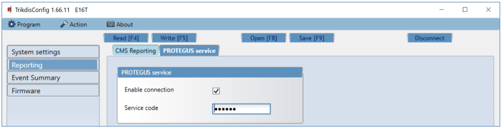

**„Protegus service“ tab** **“Protegus service” settings group**

- **Enable connection** - enable Protegus service, E16T will be able to exchange data with Protegus app and to be remotely configured via ***TrikdisConfig*.**

- **Service code -** 6-digit code for connecting to the Protegus app (default - 123456). If the Service code is changed, you will need to enter it, when adding the communicator to Protegus.

### „Event Summary“ windows 

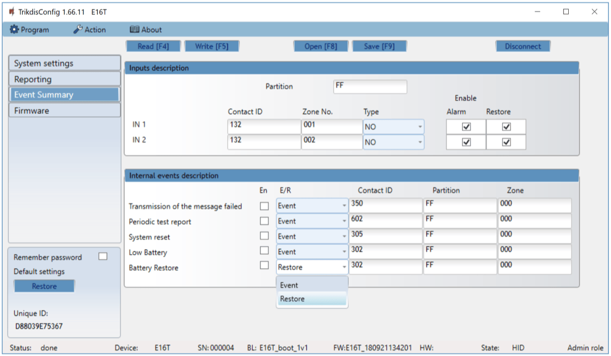

This window allows you to enable, disable, and change internal messages and input messages from the device. Turning off the internal message in this window will not send it regardless of other settings.

Additional sensors can be connected to the communicator inputs. When the sensor is triggered, the communicator sends an event notification. The login is assigned a Contact ID code, which will be sent to the CMS and Protegus.

The event Contact ID codes that will be sent to the CMS and to the Protegus, when the event occurs will be indicated by ticking the checkbox.

**„Input description“ settings group**

- **Partition** – enter the partition number.

- **Contact ID** – enter the event code or leave the default value. Upon entering the event, the event code will be sent to Protegus and CMS.

- **Zone No. –** enter the zone number and it will be sent in messages.

- **Type** – select input types (NO, NC, EOL).

- **Enable / Alarm** – select **Alarm** to receive report when event occurs.

- **Enable / Restore** – select **Restore** to receive report when input line will restore.

**„Internal event description“ settings group**

- **En** – checked event fields where messages will be sent to CMS and Protegus.

- **E/R** – choose what type of event will be sent when input is triggered – **Event** or **Restore**.

- **Contact ID** - enter the event code or leave the default value. Upon entering the event, the event code will be sent to Protegus and CMS.

- **Partition** – enter the partition (area) number that will be sent when an internal event occurs and the system is restored.

- **Zone** – enter the zone number that will be sent when an internal event occurs and the system is restored.

### Reset factory settings 

To restore the communicator’s factory defaults, you need to click the **Restore** button in the TrikgisConfig window.

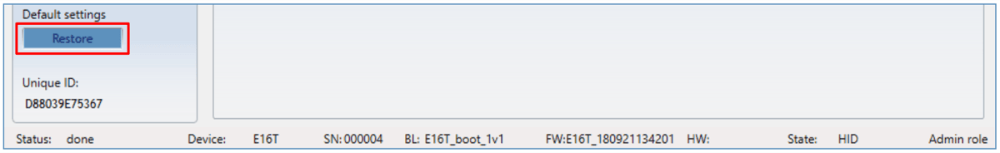

## Test communicator performance 

When configuration and installation is complete, perform a system check:

1.  Check that the power is on.

2.  Check the network connection (the NETWORK indicator lights up in green).

3.  Generate an event:

- by arming/disarming the system with the control panel keypad;

- triggering a zone alarm when the security system is armed.

1.  Make sure that the event arrives to the Central Monitoring Station and/or is received in the Protegus application.

2.  To test communicator inputs, trigger them and make sure you receive the correct event.

3.  To test the communicator outputs, activate them remotely and check their operation.

4.  If the security control panel will be controlled remotely, arm/disarm the security system remotely by using the Protegus app.

## Manual firmware update 

!!! note
    When the communicator E16T is connected to TrikdisConfig,
    the program will automatically offer to update the device's firmware if
    updates are present. Updates require an internet connection. Antivirus
    software, firewall or strict access to internet settings can block the
    automatic firmware updates.
E16T firmware can also be updated or changed manually. After an update, all previously set settings will remain unchanged. When writing firmware manually, it can be changed to a newer or older version. To update:

1.  Run ***TrikdisConfig**.*

2.  Connect the E16T via USB Mini-B cable to the computer or connect to the E16T communicator remotely.

- If a newer firmware version exists, the software will offer to download the newer firmware version file.

1.  Select the menu branch **Firmware**.

2.  Press **Open firmware** and select the required firmware file. If you do not have the file, the newest firmware file can be downloaded by <u>registered users</u> from [www.trikdis.com](http://www.trikdis.com) , under the download section of the E16T communicator.

    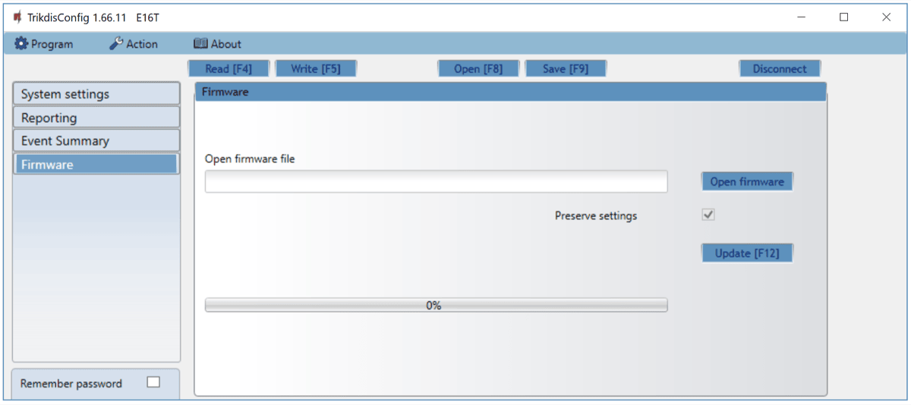

3.  Press **Update [F12]**.

4.  Wait for the update to complete.

## „Ethernet“ communicator E16T

## Safety requirements 

The Ethernet communicator should be installed and maintained by qualified personnel.

Prior to installation, please read this manual carefully in order to avoid mistakes that can lead to malfunction or even damage to the equipment.

Disconnect the power supply before making any electrical connections.

Changes, modifications or repairs not authorized by the manufacturer shall void your rights under the warranty.

Please act according to your local rules and do not dispose of your unusable alarm system or its components with other household waste.
