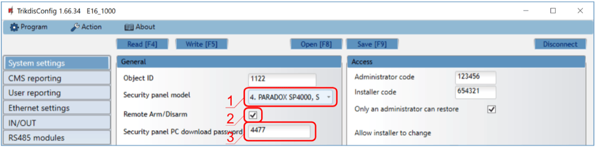
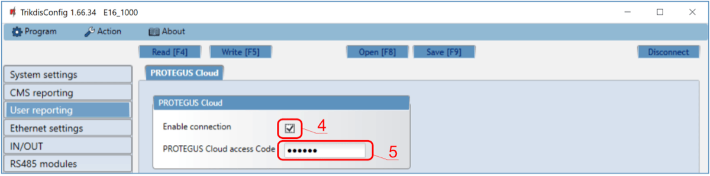
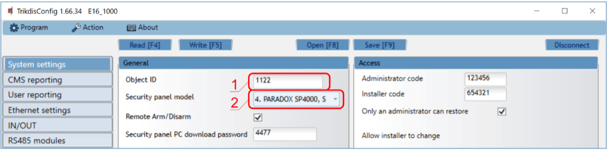
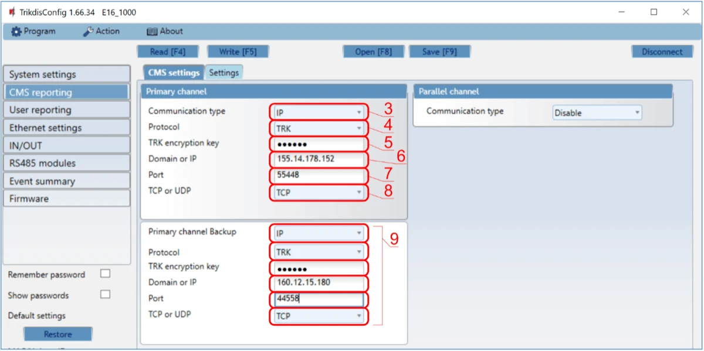
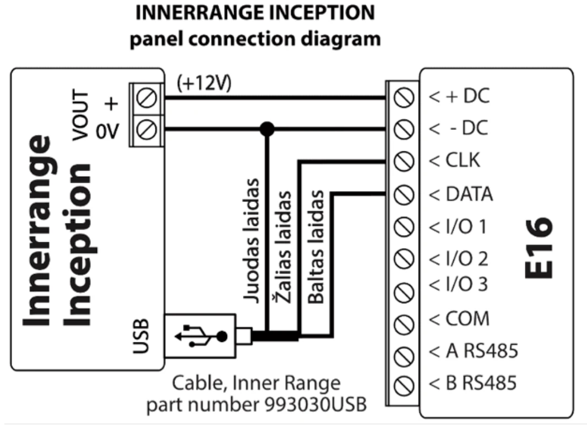
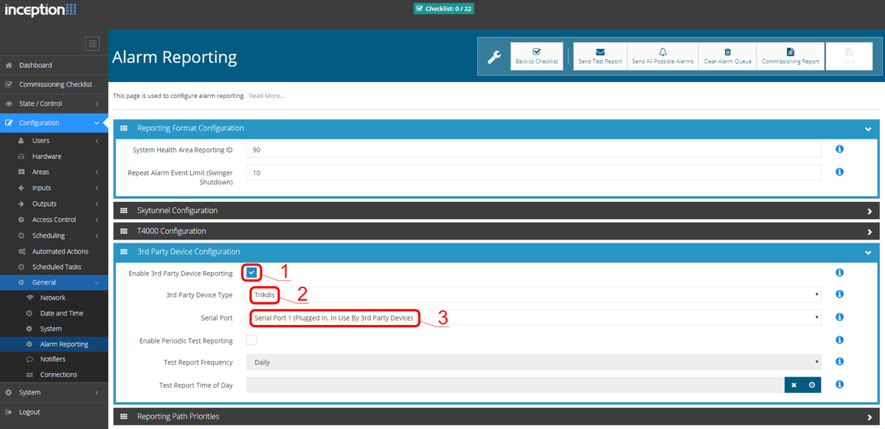

# Innerrange Inception with E16 quick setup

Short steps to connect the E16 communicator to an Innerrange Inception panel, configure E16 for IP reporting, and add the system to Protegus2. Use this together with the full E16 manual for all other settings.

!!! caution
    Install and service only by qualified personnel. Disconnect power before wiring. Unauthorized changes void warranty.

## Prerequisites

- E16 communicator with LAN connected and a USB Mini-B cable available for configuration.
- Innerrange Inception panel with internet access and firmware version **2.3.0.3507-r0** or higher.
- Inner Range USB cable, part number `993030USB`.
- CMS object ID / account number if reporting to CMS.
- Protegus2 account and communicator MAC / Unique ID.

## Quick configuration with *TrikdisConfig* software

1. Download **TrikdisConfig** from [www.trikdis.com](http://www.trikdis.com) and install it.
2. Open the E16 casing with a flat-head screwdriver.

3. Connect E16 to the computer with a USB Mini-B cable.
4. Run **TrikdisConfig**. The software will recognize the communicator and open the configuration window.
5. Click **Read [F4]** to load the current settings. If requested, enter the Administrator or Installer 6-digit code.

Complete the subsection that matches the installation:

- **Protegus2 app** if the system will be controlled remotely by users.
- **Central Monitoring Station** if the communicator will report to CMS.
- Complete both subsections if the communicator must support both CMS and Protegus2.

### Settings for connection with Protegus2 app

**In "System settings" window:**

1. Select the **Security panel model** that will be connected to the communicator.
2. Select **Remote Arm/Disarm** if users must control the panel in Protegus2 with their keypad code.
3. For direct control of Paradox and Texecom panels, enter the **Security panel PC download password**. It must match the password set in the control panel.

!!! note
    For direct control to work, the control panel must also be programmed as described in the panel-specific section below.

**In "User reporting" window, "PROTEGUS Cloud" tab:**

4. Tick **Enable connection** to the Protegus Cloud.
5. Change the **Protegus Cloud access Code** if users should be asked to enter it when adding the system to Protegus2.

After finishing configuration, click **Write [F5]** and disconnect the USB cable.

### Settings for connection with Central Monitoring Station

**In "System settings" window:**

1. Enter the **Object ID** provided by the Central Monitoring Station.
2. Select the **Security panel model** that will be connected to the communicator.

**In "CMS reporting" window settings for "Primary channel":**

3. Set **Communication type** to **IP**.
4. Select the protocol required by the receiver: **TRK**, **DC-09_2007**, **DC-09_2012**, or **TL150**.
5. Enter the receiver encryption key if the selected protocol requires it.
6. Enter the receiver **Domain or IP** and **Port**.
7. Select **TCP** or **UDP**.
8. Configure backup and parallel channels if the installation requires redundancy.

!!! note
    If you select a **DC-09** protocol, also enter the object, line, and receiver numbers in the **Settings** tab of the **CMS reporting** window.

After finishing configuration, click **Write [F5]** and disconnect the USB cable.

## Wiring

Connect the panel to E16 as shown below:

| E16 terminal | Innerrange Inception panel / cable | Notes |
| --- | --- | --- |
| `+DC` | `VOUT +` | Panel power |
| `-DC` | `0V` and black wire from cable `993030USB` | Panel ground |
| `CLK` | Green wire from cable `993030USB` | Serial connection |
| `DATA` | White wire from cable `993030USB` | Serial connection |

## Panel programming

1. Make sure the Innerrange Inception panel has firmware version **2.3.0.3507-r0** or higher and is connected to the internet.
2. In a browser, connect to `https://skytunnel.com.au/inception/SERIALNUMBER`, where `SERIALNUMBER` is the serial number printed on the panel enclosure.
3. Open **Configuration > General > Alarm Reporting**.
4. In the **3rd Party Device Configuration** section, set the panel as shown below.

5. Tick **Enable 3rd Party Device Reporting**.
6. Set **3rd Party Device Type** to **Trikdis**.
7. Set **Serial port** to **Serial Port 1 (Plugged In, In Use By 3rd Party Device)**.
8. Save settings and exit the application.

## Add system to Protegus2

1. Open [Protegus2](https://www.protegus.app) and click **Add new system**.
2. Enter the E16 **MAC / Unique ID**.
3. Enter the system name and finish the wizard.
4. If you use keyswitch control instead of direct control, connect `I/O 1` to the panel keyswitch zone and configure the area in Protegus2 with `PGM1` in **Pulse** or **Level** mode.
5. Wait until the system shows as online.

## System check

1. Arm and disarm the system from the keypad or user interface.
2. Trigger a test alarm.
3. Confirm that events reach the CMS and Protegus2.
