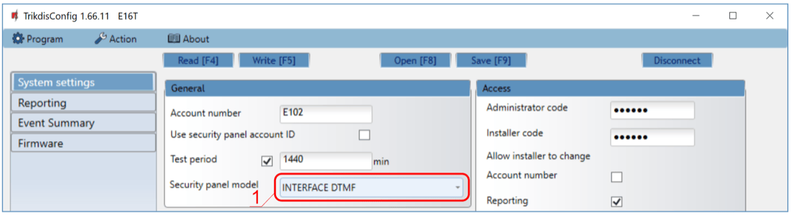
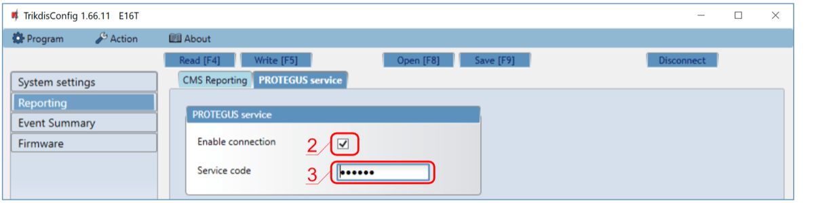
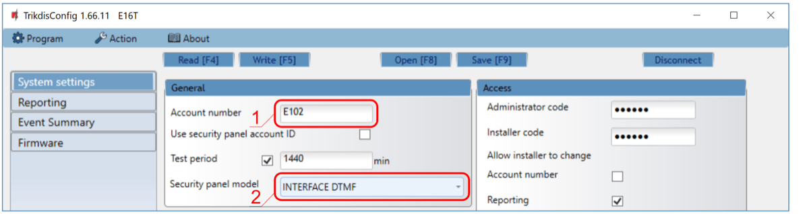
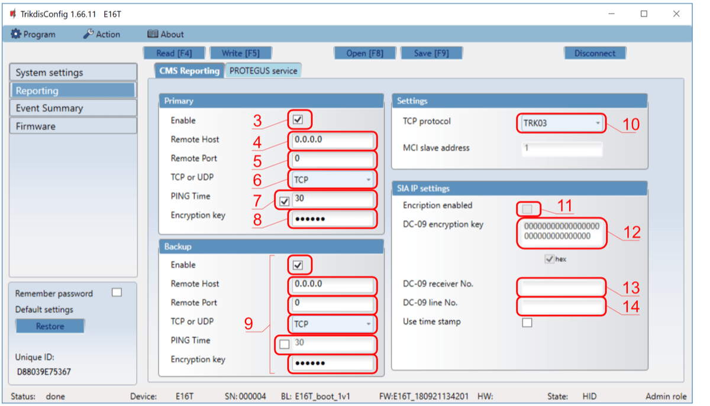
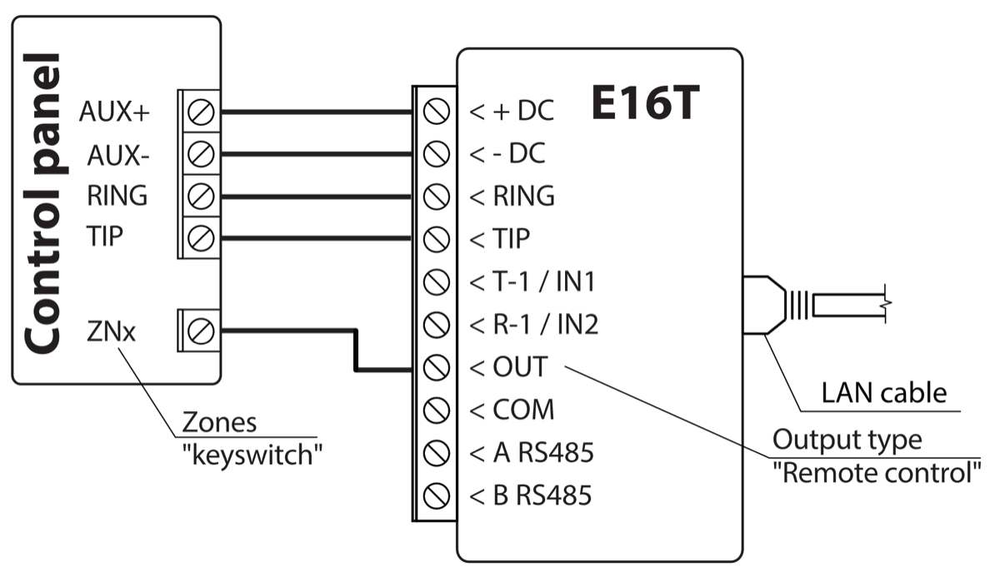

# E16T quick setup

Short steps to connect the E16T communicator to a control panel telephone dialer, configure IP reporting, and add the system to Protegus. Use this together with the full E16T manual for all other settings.

!!! caution
    Install and service only by qualified personnel. Disconnect power before wiring. Unauthorized changes void warranty.

## Prerequisites

- E16T communicator with LAN connected and a USB Mini-B cable available for configuration.
- Control panel with a telephone communicator that supports Contact ID over DTMF tones.
- Panel installer / keypad access.
- CMS account number if reporting to CMS.
- Protegus account and communicator MAC / Unique ID.

## Quick configuration with *TrikdisConfig* software

1. Download **TrikdisConfig** from [www.trikdis.com](http://www.trikdis.com) and install it.
2. Open the E16T casing with a flat-head screwdriver.

3. Connect E16T to the computer with a USB Mini-B cable.
4. Run **TrikdisConfig**. The software will recognize the communicator and open the configuration window.
5. Click **Read [F4]** to load the current settings. If requested, enter the Administrator or Installer 6-digit code.

Complete the subsection that matches the installation:

- **Protegus app** if users will control the system remotely.
- **Central Monitoring Station** if the communicator will report to CMS.
- Complete both subsections if the communicator must support both CMS and Protegus.

### Settings for connection with Protegus app

**In "System settings" window:**

1. Select the **Security panel model** that will be connected to the communicator.

**In "Reporting" window, "Protegus Service" tab:**

2. Tick **Enable connection** in the Protegus service settings.
3. Change the **Service code** if users should be asked to enter it when adding the system to Protegus.

After finishing configuration, click **Write [F5]** and disconnect the USB cable.

### Settings for connection with Central Monitoring Station

**In "System settings" window:**

1. Enter the **Account number** provided by the Central Monitoring Station.
2. Select the **Security panel model** that will be connected to the communicator.

**In "Reporting" window settings for "Primary" channel:**

3. Enable the primary communication channel.
4. Enter the receiver **Remote Host** and **Remote Port**.
5. Select **TCP** or **UDP**.
6. Set **PING Time** and the encryption key required by the receiver.
7. Configure **Backup** settings if the installation requires redundancy.
8. Select the TCP protocol required by the receiver: **TRK**, **DC-09_2007**, or **DC-09_2012**.
9. If **DC-09_2012** is used, configure encryption and the receiver and line numbers.

**In "Reporting" window, "Protegus Service" tab:**

10. Tick **Enable connection** to Protegus if users will use the app.
11. Change the **Service code** if users should be asked to enter it when adding the system to Protegus.

!!! note
    If you select a **DC-09** protocol, also enter the object, line, and receiver numbers in the **Settings** tab of the **Reporting** window.

After finishing configuration, click **Write [F5]** and disconnect the USB cable.

## Wiring

Connect E16T to panel power, `TIP` / `RING`, and LAN as shown below:

If the panel will be armed or disarmed by keyswitch output control, wire the panel keyswitch zone to `OUT` as shown in the same diagram.

## Panel programming

Program the control panel telephone communicator as follows:

1. Enable the panel telephone communicator.
2. If E16T is connected directly to `TIP` / `RING`, enter any telephone number with at least 2 digits.
3. Select `DTMF` dialing mode.
4. Select the `Contact ID` communication protocol.
5. Enter the panel 4-digit account number.

## Special settings for Honeywell Vista 48

If the connected panel is Honeywell Vista 48, set these values:

| Section | Data | Section | Data | Section | Data |
| --- | --- | --- | --- | --- | --- |
| `*41` | `1111` | `*60` | `1` | `*69` | `1` |
| `*42` | `1111` | `*61` | `1` | `*70` | `1` |
| `*43` | `1234` | `*62` | `1` | `*71` | `1` |
| `*44` | `1234` | `*63` | `1` | `*72` | `1` |
| `*45` | `1111` | `*64` | `1` | `*73` | `1` |
| `*47` | `1` | `*65` | `1` | `*74` | `1` |
| `*48` | `7` | `*66` | `1` | `*75` | `1` |
| `*50` | `1` | `*67` | `1` | `*76` | `1` |
| `*59` | `0` | `*68` | `1` |  |  |

Exit programming mode with `*99`.

## Add system to Protegus

1. Open [Protegus](https://www.protegus.app) and click **Add new system**.
2. Enter the E16T **MAC / Unique ID**.
3. Enter the system name and finish the wizard.
4. If you wired `OUT` to a keyswitch zone, open **Settings** in Protegus and enable **Arm/Disarm with PGM Output 1**.
5. Select **Pulse** or **Level** mode to match the panel keyswitch zone type.

## System check

1. Arm and disarm the system from the keypad.
2. Trigger a test alarm while the system is armed.
3. Confirm that events reach the CMS and Protegus.
