# Communicator FIRECOM for fire alarm control panel

## Description

Communicator FIRECOM meets the requirements of standard EN 54-21:2006; EN 54-4:1997/AC:1999/A1:2002/A2:2006.

The product complies with the performance requirements of EN54-21 standard Annex A for type 1 transmission system type.

Communicator FIRECOM Certificate No: 1922-CPR-2083. Fire detection and fire alarm systems. Alarm transmission and fault warning routing equipment. Power supply equipment.

The product is certified by notified product certification body: No.1922 “Dedal”, Nesebar Mladost str. 50, Bulgaria, 8230

Trikdis technical support contacts: support@trikdis.lt, +37067422877.

The FIRECOM is used for transmitting fire alarm control panel messages via LAN and/or cellular networks to the Central Monitoring Station’s receiver.

Principle of operation. When an input (zone) of the communicator is violated, the FIRECOM will transmit an event message to the Central Monitoring Station’s receiver or to the Protegus2 app using mobile internet and/or LAN network. It can also send SMS messages and make phone calls. The communicator is available with 4G modem.

### Features

**Messages to the security company**

- Sends events via the built-in LAN module or cellular 4G modem.

- Events are sent via available communication channels with the selected priority.

- Any CMS can receive reports, as long as they have TRIKDIS software/IP receiver or any other manufacturer’s IP receiver supporting SIA DC-09 IP protocol.

- Prioritizing the transmission of events to the CMS: messages are first transmitted to the CMS and only then to *Protegus2*.

- Possibility to send event reports to CMS of two different security companies.

- Event messages are sent in Contact ID or SIA codes.

**Messages to users**

- Calls selected phone numbers (up to 8 users).

- Sends SMS messages about events.

- “Push” and special sound event notifications using the Protegus2 application.

- Remote temperature monitoring.

**Remote control of outputs**

- Via Protegus2 app.

- By calling the device‘s phone number.

- Via SMS messages.

**Settings and installation**

- Quick and easy installation.

- Device configuration either using an USB cable or remotely using TrikdisConfig software.

- Remote updating of firmware.

- Two access levels (types of accounts) for setting parameters: for the installer and for the administrator.

**Inputs and outputs**

- 3 relay outputs (1 A, 30V DC).

- Input “FLOOP” is intended for connection of two-wire fire detectors.

- 10 I/O terminals, each of which can be set as an input (IN) or output (OUT) terminal. Selectable Input (IN) types: NC, NO, EOL, EOL-T, ATZ, ATZ-T. Resistors of different ratings can be used in EOL and ATZ circuits.

- With iO expander modules, the number of IN inputs can be expanded up to 32 units, and the number of OUT outputs can be expanded up to 16 units.

- RS485 bus is used to connect iO series expander modules.

- RS485 2 bus is used to connect fire alarm control panels.

### Specifications

| Parameter | Description |
|----|----|
| LTE modem frequencies: /​ EU (Europe) /​ LA (Latin America) | LTE-FDD: B1/​B3/​B5/​B7/​B8/​B20/​B28 /​ LTE-FDD: B2/​B3/​B4/​B5/​B7/​B8/​B28/​B66 |
| Power supply voltage | 15-32 V DC, 2.5A |
| Current consumption | Up to 50 mA (stand-by). /​ Up to 300 mA (transmitting). /​ Up to 2.5 A (after connecting the maximum possible load with external devices). |
| Backup power source \[BAT\] | 12 V lead – acid battery, 4 Ah/​7 Ah |
| Battery charge current | Up to 500 mA |
| Power voltage and current for external devices \[AUX\] | 12 V DC, up to 1 A |
| Transmission protocol | TRK, SIA DC-09_2007, SIA DC-09_2012, SIA DC-09_IPcom, TL150 |
| Encryption key | 6 symbol encryption key. |
| Connection to CMS | TCP/​IP or UDP/​IP |
| Event codes | Contact ID, SIA codes. |
| LAN module | Yes, built-in |
| LAN network configuration type | DHCP or manual |
| SIM card | 1, NANO size |
| Report transmission directions | To main and backup receivers of 2 different security companies;​ To Protegus2 cloud, to iOS/​Android Protegus2 mobile apps;​ To 8 mobile phones via SMS messages. Calls 8 mobile phones. |
| Event reporting transmission channels | 4G, Ethernet (LAN), SMS, call |
| Message encryption | Yes |
| Internal clock | Yes |
| User | 40 |
| Dual purpose terminals \[I/​O\] | 10;​ IN or OUT function selected during programming. When IN is selected, available types: NC, NO, EOL, EOL_T, ATZ, ATZ_T. When OUT is selected, the terminal becomes open collector (OC) type with up to 100 mA current |
| No. of groups | 8 |
| No. of zones | 10 (20 zones if using ATZ), (can be expanded to 32 zones using expanders) |
| No. of PGM outputs | 3 relay (1 A, 30V DC). (can be 13 if IO terminals are set as outputs. Can be expanded to 16 outputs with expanders) |
| Buffer memory capacity | 60 events |
| Events log memory | Up to 1000 events. Oldest entries deleted automatically. |
| Configuration | Remotely using TrikdisConfig software or locally using USB Type-C. |
| 1-Wire data bus length \[1 WIRE\] | Up to 30 m |
| Compatible temperature sensors | Maxim®/​Dallas® DS18S20, DS18B20;​ AM2301 series |
| Max. number of temperature sensors connected to 1-Wire data bus | 8 (Dallas) or 1 (if an AM2301 series sensor is used) |
| RS485 bus | 2 |
| RS485 bus length | Up to 100 m |
| Supported modules | iO-8 – expander module;​ /​ iO-MO – iO-WL radio wave transceiver;​ /​ iO-LORA – expander module;​ /​ iO8-LORA – expander module;​ /​ PB-LORA – panic button;​ /​ REL-LORA – expander module;​ /​ Fire alarm control panel with ESPA 4.4.4 protocol;​ /​ NSC Solution – fire alarm control panel;​ /​ INIM Smartline - fire alarm control panel;​ /​ C-TEC Cast ZFP – fire alarm control panel. |
| Operating environment | Temperature from -10 °C to +50 °C, relative air humidity – up to 80% at +20°C. |
| Dimensions | 235 x 205 x 92 mm |
| Weight | 1.35 kg |

### Elements of the *FIRECOM* communicator

|  |
|----|
| Connectivity and operation indicator lights. Button. Not used. Backup power supply terminal block. Main power supply terminal block. RESET button. External terminal block. |

### Purpose of terminals

| Terminal           | Description                                            |
|--------------------|--------------------------------------------------------|
| Power terminal „+“ | Power supply terminal (15 – 32 V DC positive terminal) |
| Power terminal „-“ | Power supply terminal (15 – 32 V DC negative terminal) |
| BAT+               | Backup power supply positive terminal 12 V             |
| BAT-               | Backup power supply negative terminal 12 V             |
| AUX+               | Positive 12 V power terminal for external devices      |
| AUX-               | Common negative terminal                               |
| A1 RS485           | RS485 bus is for connecting iO expansion devices       |
| A2 RS485           | RS485 bus for connecting fire alarm control panel      |
| IO1 – IO10         | Input/​output terminals (default setting – input)       |
| C                  | Common negative terminal                               |
| AUX+               | Positive 12 V power terminal for external devices      |
| FLOOP              | Terminal for connecting a 2-wire fire detector         |
| +5 V               | Positive 5 V, 0.2 A power terminal for 1-Wire devices  |
| 1 WIRE             | “1-Wire” data bus terminal                             |
| C                  | Common negative terminal                               |
| NO1/​C1/​NC1         | 1st PGM relay output terminals                         |
| NO2/​C2/​NC2         | 2nd PGM relay output terminals                         |
| NO3/​C3/​NC3         | 3rd PGM relay output terminals                         |

### LED indication of operation

| Indicator | Light status | Description |
|----|----|----|
| SIM | Off | Not connected to Cellular network |
| SIM | Green blinking | SIM card is registering on Cellular network. |
| SIM | Green solid | SIM card registered on Cellular network. |
| SIM | Green solid and yellow blinking | The communicator is connected to Cellular network. Sufficient Cellular signal strength level for 4G is 3 (three yellow flashes). |
| ETH | Green blinking | LAN cable disconnected or DHCP problem. |
| ETH | Green solid | Connected to LAN network. |
| DAT / DATA | Off | All event messages sent |
| DAT / DATA | Green solid | Message is being sent |
| DAT / DATA | Yellow solid (DAT) | There are unsent event messages in buffer memory |
| STA / TROUBLE | Green blinking (STA) | No operational problems |
| STA / TROUBLE | Off (TROUBLE) | No operational problems |
| STA / TROUBLE | 1 red flash | No SIM card inserted |
| STA / TROUBLE | 2 red flashes | The PIN code of the SIM card is incorrect |
| STA / TROUBLE | 3 red flashes | Unable to connect to Cellular network |
| STA / TROUBLE | 4 red flashes | Unable to connect to the IP receiver using the primary channel |
| STA / TROUBLE | 5 red flashes | Unable to connect to the IP receiver using the secondary channel |
| STA / TROUBLE | 6 red flashes | No DC power |
| STA / TROUBLE | 7 red flashes | AUX output fault (overcurrent or overvoltage0 |
| STA / TROUBLE | 8 red flashes | Battery failure |
| STA / TROUBLE | 9 red flashes | The LAN cable is disconnected |
| STA / TROUBLE | 10 red flashes | LAN DHCP problem |
| FPS / POWER | Off | Power supply is not connected |
| FPS / POWER | Green solid | No problems with power supplies |
| FPS / POWER | 1 green flash | No AC power |
| FPS / POWER | 2 green flashes | Insufficient backup power supply voltage |

### Components necessary for installation

Before beginning installation, make sure that you have:

1.  A USB Type-C type cable for configuration.

2.  At least 4-wire cable for connecting the communicator to the fire alarm control panel.

3.  A flat-head 2,5 mm screwdriver.

4.  An external Cellular antenna if network coverage in the area is poor.

5.  An activated nano-SIM card (PIN code requests can be turned off).

6.  The manual of the fire alarm control panel that the communicator will be connected to.

Order the necessary components separately from your local distributor.

## Powering the communicator

### Main power supply

The communicator must be powered by a DC source. A backup power supply – a 12 V battery – must be connected to the system to ensure the supply of power is uninterrupted.

### Backup power supply

If there are problems with powering the system from the main power supply, an “*DC Fault”* event report will be generated and the panel will automatically switch to the backup 12 V battery. If the battery’s voltage falls to 11,5 V, a “*Low* *Battery”* event report will be generated. The battery will be disconnected if the voltage falls bellow 9,5 V. If DC voltage is restored, an “*DC Restore”* report will be generated and the battery charging process will begin automatically. When the battery’s voltage rises to 12,6 V, a “*Battery Restore”* event report will be generated.

### Communicator kit

| Name | Quantity |
|----|:--:|
| FIRECOM communicator board with antenna, built into a metal housing | 1 pc. |
| Metal housing with Mean Well impulse power supply | 1 pc. |
| Resistor 10 kΩ | 20 pcs. |
| Wire for connecting battery | 1 pc. |
| Tamper sensor | 1 pc. |
| Terminal block with 3,15 A fuse | 1 pc. |
| Fastening elements (screws - 4 pcs., nylon plugs - 4 pcs.). | 1 |

!!! note
    USB cable (Type-C type) for programming the communicator sold separately.

## Installation of the system

The communicator board is installed into a mounting housing that already has a DC power supply with a 3,15 A fuse installed and also has space intended for a backup battery.

**Dimensions of the FIRECOM board**

The picture below shows the dimensions of the board and its mounting holes (in millimeters), and also the locations of the holes.

### Order of connecting devices

1.  If you are using a SIM card, insert the activated SIM card into the SIM card holder.

2.  If you are using LAN, connect the LAN cable.

3.  Using the given connection schematics and the connection schematics for every device to be connected, connect fire sensors, signalers and controlled devices.

4.  Connect the AC power supply wires to the terminals.

5.  Insert a backup battery into the mounting housing. Connect the battery’s terminals to the BAT+ / BAT– terminals on the communicator.

!!! note
    When choosing a battery, it must be charged to 80% capacity within 24 hours, and the remaining capacity is reached within the next 48 hours to meet the requirements of the EN54 standard.

### Connecting sensors

There are 10 terminals IO1–IO10 (inputs) on the communicator board for connecting sensor circuits. The number of inputs can be expanded to 32 using input expanders (***iO-8, iO-MO, iO-LORA, iO8-LORA**)*. Any terminal can be set as an input and assigned zone attributes: circuit type (NO, NC, EOL, EOL_T, ATZ, ATZ_T); sensitivity to temporary circuit events; see chapter 6.6 ““Zones” window”.

#### Schematics for connecting sensors.

<figure style="margin: 0;">

</figure>

<figure style="margin: 0;">

</figure>

<figure style="margin: 0;">

</figure>

<figure style="margin: 0;">

</figure>

<figure style="margin: 0;">

</figure>

<figure style="margin: 0;">

</figure>

<figure style="margin: 0;">

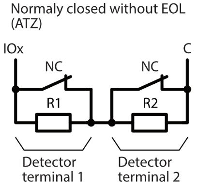
</figure>

<figure style="margin: 0;">

</figure>

### Connecting smoke detectors

Schematic for connecting two-wire smoke detectors.

Schematic for connecting two-wire smoke detectors to “FLOOP” output. When this circuit diagram is used, the “Input” type “FC Fire sensor (FLOOP input)” must be specified in the “Zones” window. The alarm current of the fire detector must be more than 10mA. Up to 8 fire detectors can be connected to the “FLOOP” output.

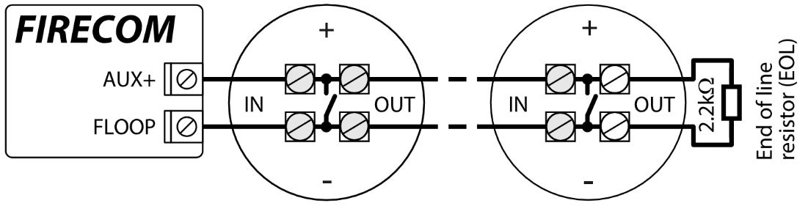

Wiring diagrams for two-wire smoke detectors with relay module SM1. In order to connect the smoke detector circuit to the selected input, it is necessary to activate the input (IOx) and set the circuit type (NO, NC, EOL, EOL_T, ATZ, ATZ_T) (see 6.6 “”Zones” window”). To connect a smoke detector power circuit to the PGM output (IO10), the **“Fire Sensor Reset”** function must be assigned to the output (see chapter 6.7 ““PGM” window”).

\* The relay is used to detect a broken cable and removal of a fire detector. If you do not use a relay (K1), then contact K1 must be short-circuited.

Or

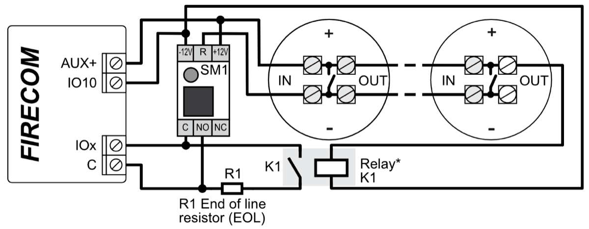

Schematic for connecting four-wire smoke detectors.

In order to connect the smoke detector circuit to the selected input, it is necessary to activate the input (IOx) and set the circuit type (NO, NC, EOL, EOL_T, ATZ, ATZ_T) (see 6.6 “”Zones“ window “). To connect a four-wire smoke detector power circuit to the PGM output (IO10), the “**Fire Sensor Reset”** function must be assigned to the output (see chapter 6.7 ““PGM” window”).

\* The relay is used to detect a broken cable and removal of a fire detector. If you do not use a relay (K1), then contact K1 must be short-circuited.

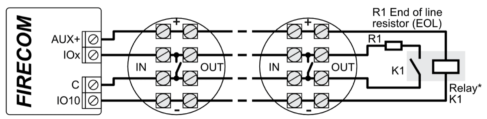

### Schematic for connecting the communicator to a fire alarm control panel

<figure style="margin: 0;">

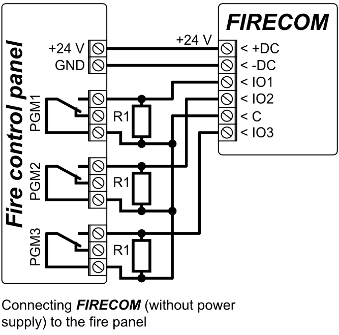
</figure>

<figure style="margin: 0;">

</figure>

If you want to monitor the status of the fire alarm panel, connect its corresponding outputs to the FIRECOM inputs. The outputs (PGM1, PGM2, PGM3) of the fire panel must be configured as panel status outputs (Alarm, Trouble, etc.).

### Schematic for connecting the fire panel with the ESPA4.4.4 protocol

<figure style="margin: 0;">

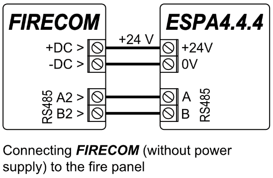
</figure>

<figure style="margin: 0;">

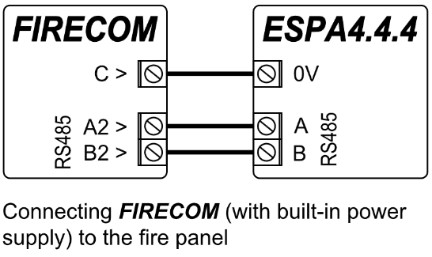
</figure>

FIRECOM communicator settings with TrikdisConfig when connecting the fire alarm control panel.

1.  Choose the **ESPA4.4.4**.

2.  Select connection type.

3.  The FIRECOM communicator and the fire panel must have the same data transmission settings.

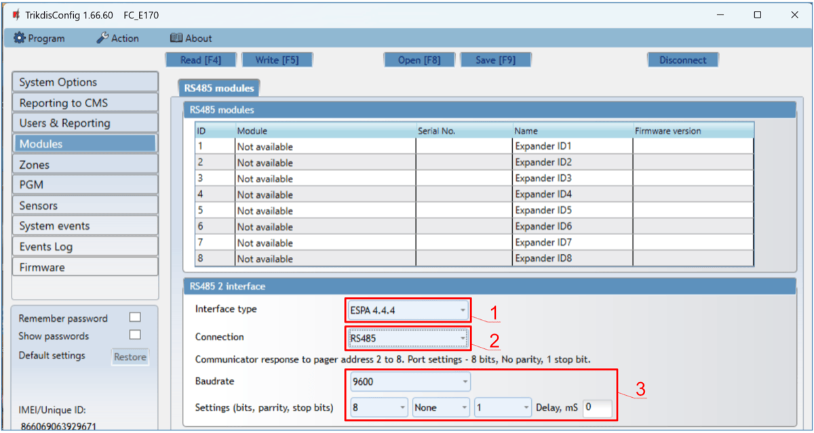

4.  Enter phone numbers, e-mail of users who should get messages from the FIRECOM.

5.  If you want the user to receive messages (or calls) about events, tick the **SMS** (or **Call**) box.

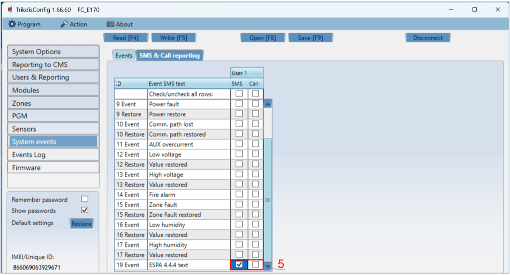

6.  Configure the communication channel if messages should be sent to the CMS receiver. Event messages are transmitted using the SIA DC-09 protocol.

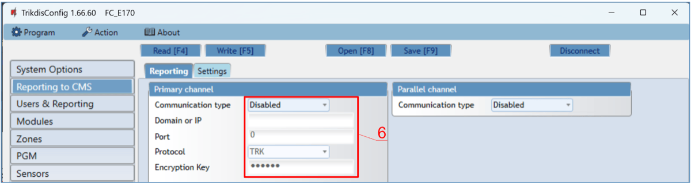

Test the system. Activate the fire alarm and check that FIRECOM messages are sent to the CMS (central monitoring station) and to Protegus2.

### Schematic for connecting the fire panel NSC Solution

<figure style="margin: 0;">

</figure>

<figure style="margin: 0;">

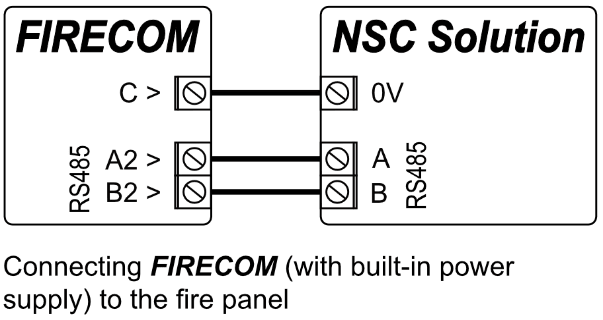
</figure>

FIRECOM communicator settings with TrikdisConfig when connecting the **NSC Solution** fire alarm control panel.

1.  Choose the **NSC solution** fire alarm control panel.

2.  The “**NSC slavе address**” must not match the address of the connected fire panel modules.

3.  Enter phone numbers, e-mail of users who should get messages from the FIRECOM.

4.  Users will get SMS messages and phone calls about events that are ticked. You can add additional CID event codes in the **CID** column. You must enter **SMS text** messages next to new codes. If you want the user to receive messages (or calls) about events, tick the **SMS** (or **Call**) box.

5.  Configure the communication channel if messages should be sent to the CMS receiver.

After setting up the FIRECOM communicator, turn on power supply the fire control panel. Wait for the fire control panel software to load. It is necessary to scan the modules connected to the RS485 bus on the fire control panel. On the fire control panel, press: **PROG.\>INSTALLER\>(Enter the installer code) 00000 OK\>(Select) SETTINGS\>ENTER\>(Select) SCAN RS485\>ENTER**. Wait for the scan to complete. Return to the main screen by pressing “**CANCEL**“ twice.

Test the system. Activate the fire alarm and check that FIRECOM messages are sent to the CMS (central monitoring station) and to Protegus2.

### Schematic for connecting the fire panel INIM SMARTLINE

<figure style="margin: 0;">

</figure>

<figure style="margin: 0;">

</figure>

**Slave** mode must be set for the **INIM Smartline** panel when it is connected to the FIRECOM communicator via RS485 bus.

!!! note
    You cannot connect the FIRECOM using the RS485 bus if repeaters are connected to the **INIM Smartline** panel. / **iO** expansion modules are not supported when the FIRECOM is connected to the **INIM Smartline** panel via RS485 bus. FIRECOM communicator settings with TrikdisConfig when connecting the **INIM SMARTLINE** fire alarm control panel.

1.  Choose the **Inim Smartline** fire alarm control panel.

2.  Enter phone numbers, e-mail of users who should get messages from the FIRECOM.

3.  Users will get SMS messages and phone calls about events that are ticked. You can add additional CID event codes in the **CID** column. You must enter **SMS text** messages next to new codes. If you want the user to receive messages (or calls) about events, tick the **SMS** (or **Call**) box.

4.  Configure the communication channel if messages should be sent to the CMS receiver.

Test the system. Activate the fire alarm and check that FIRECOM messages are sent to the CMS (central monitoring station) and to Protegus2.

### Schematic for connecting the fire panel C-TEC Cast ZFP

<figure style="margin: 0;">

</figure>

<figure style="margin: 0;">

</figure>

FIRECOM communicator settings with TrikdisConfig when connecting the **C-TEC Cast ZFP** fire alarm control panel.

1.  Choose the **C-TEC Cast ZFP** fire alarm control panel.

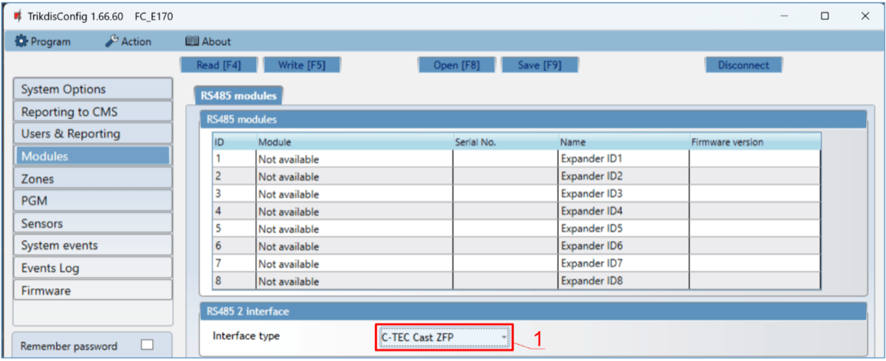

2.  Enter phone numbers, e-mail of users who should get messages from the FIRECOM.

3.  Users will get SMS messages and phone calls about events that are ticked. You can add additional CID event codes in the **CID** column. You must enter **SMS text** messages next to new codes. If you want the user to receive messages (or calls) about events, tick the **SMS** (or **Call**) box.

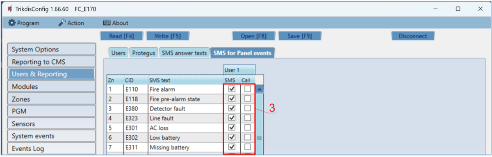

4.  Configure the communication channel if messages should be sent to the CMS receiver.

Install the **ZFPtools** program on your computer. Run the **ZFPtools** program. Turn on the power supply of the fire control panel. Wait until the fire panel software is loaded. Connect the fire panel to the computer using a USB2.0 A-B cable.

5.  Open the “**Node View**” tab.

6.  Download the fire panel settings to your computer.

7.  Enter the code (default code – 4444).

8.  Click „OK“.

3.  Select „**BMS Interface**“.

4.  Click on the free icon.

11. Click „**Edit Devices**“.

12. In the “**Device**” tab, enter the system name.

13. In the “**Properties**” tab, enter the system name.

14. Specify the “**ABUS RS485**” bus to which the FIRECOM communicator is connected.

15. Configure messages.

16. Write the settings to the fire panel.

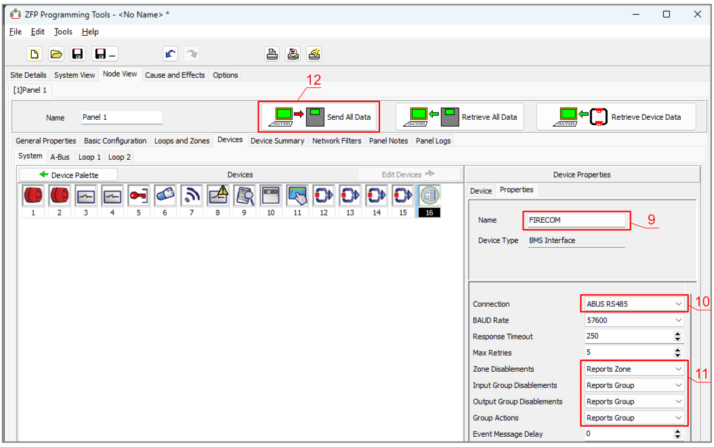

17. Enter the code (default code – 4444).

18. Click „OK“.

The fire panel is programmed. Disconnect the cable from USB2.0 A-B of the fire panel.

Test the system. Activate the fire alarm and check that FIRECOM messages are sent to the CMS (central monitoring station) and to Protegus2.

### Schematic for connecting a temperature sensor

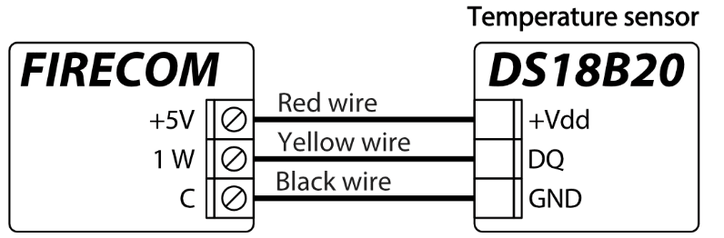 / 

### Schematics for connecting a relay and an LED indicator

 / 

### Schematics of connecting the inputs of the fire panel to the communicator

According to the EN54 standard, the fire panel from the communicator must receive information about the failure of communication with the monitoring station, as well as about the successful received of messages to the monitoring station. It is necessary to connect the PGM outputs (for example: “Relay1” and “Relay2”) of the communicator to the special inputs of the fire panel. The PGM output of “Relay1” must be set to “CMS fail”. The PGM output of “Relay2” must be set to “ACK received”. “Relay1” output is activated in case of violation of the communication channel with the CMS. “Relay2” output is activated for 5 sec. upon successful sending of a message to the CMS.

### Schematics for connecting iO series expander modules

If the communicator FIRECOM needs to have more inputs IN or outputs OUT, connect a wired or wireless TRIKDIS iO series input and output expander. The FIRECOM’s configuration for expander modules is described in chapter 6.5 ““Modules” window”.

<figure style="margin: 0;">

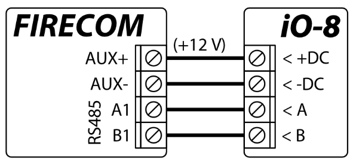
</figure>

<figure style="margin: 0;">

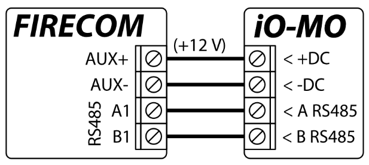
</figure>

Schematics for connecting LORA modules.

### Turning on the communicator

To turn on the communicator, first you need to turn on its power supply. The communicator’s LED indicators must operate in the following way:

- The “**STA**” diode must blink in green – this indicates that the power supply voltage is sufficient;

- The “**SIM**” diode must be green solid and periodically blink in yellow no less than 3 times – the green color indicates that the SIM card is successfully registered on the mobile network, while the number of yellow flashes indicate the mobile signal strength. The “**ETH**” indicator lights up green when the communicator is connected to the LAN network.

!!! note
    Sufficient 4G mobile network strength is 3 (three yellow flashes of the “**SIM**” indicator). / If you see fewer yellow flashes of the “**SIM**” diode, the strength of the mobile network is insufficient. We recommend choosing a different place for installing the communicator, changing the location of the antenna or using a more sensitive mobile antenna. / If the light indication is different, see chapter 1.4 “LED indication of operation” to find out the reason. / If all of the FIRECOM indicator lights are off, check the power supply and connections.

## Quick configuration using *TrikdisConfig* software

1.  Download the configuration software TrikdisConfig from [www.trikdis.com](http://www.trikdis.com) (type “TrikdisConfig” in the search field) and install it*.*

2.  Connect the FIRECOM to the computer using a USB Type-C cable.

3.  Launch TrikdisConfig. The program will automatically recognize the connected device and will automatically open the FIRECOM configuration window.

4.  Click the **Read \[F4\]** button to see the current parameters of the FIRECOM. If a window requesting the administrator or installer code opens, enter the 6-digit code.

Below we describe the settings you need to edit to make the controller send events to the Protegus2 app or to the Central Monitoring Station.

### Settings for connecting to Protegus2 app

**In the “System options” window, “SIM” settings group:**

1.  Enter the “**SIM card PIN”** code.

2.  Change the “**APN”**. You will find the “**APN”** on the SIM operator’s website. “Internet” is universal and works in the networks of most operators.

**In the “Users & Reporting” window, “Cloud application” settings group:**

3.  Tick the box “**Enable cloud service”**.

4.  Change the ***Protegus2* “Cloud access Code”** if you want users to be asked to enter it when they add the system in the Protegus2 app (default password – 123456).

**In the “Reporting to CMS” window, “Settings” tab:**

3.  If a LAN cable is connected to the communicator, check the box „**DHCP**“ (automatic registration mode) so that the FIRECOM communicator will automatically read the network settings (subnet mask, gateway) and an IP address will be assigned to it.

4.  The parameters for how the communicator will send messages to Protegus2 are set. Connection types are set in sequence. If the connection with the primary connection type fails, it switches to the next one and so on. If the fallback connection type succeeded in passing the message to Protegus2, then the “Return to Primary” connection type will be attempted after a set time interval.

**In the “Zones” window, “Zones settings” tab:**

3.  Tick the boxes if you want users to receive notifications to Protegus2 about changes in zone states.

**In the “PGM” window, “Outputs” tab:**

4.  Tick the boxes if you want users to receive notifications to Protegus2 about changes in PGM output states.

**In the “System events” window, “Events” tab:**

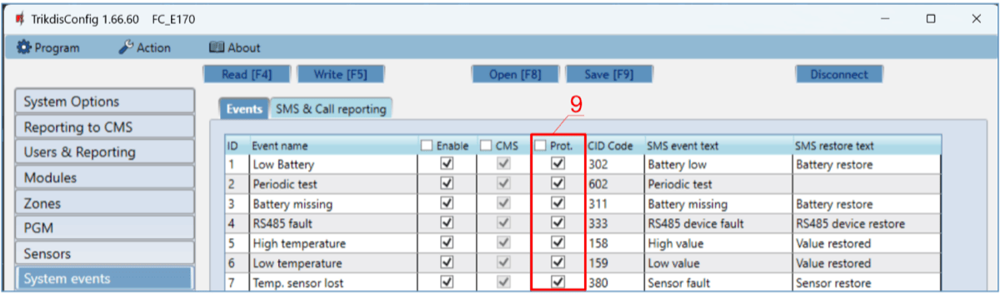

5.  Tick the boxes if you want users to receive notifications to Protegus2 about changes in the communicator’s internal event states.

After finishing configuration, click the **Write \[F5\]** button and disconnect the USB cable.

!!! note
    See chapter 6** “Description of TrikdisConfig windows”** to find more about other FIRECOM settings in ***TrikdisConfig*.**

### Settings for connecting to Central Monitoring Station

**In the “System Options” window, “System general” tab:**

1.  Enter the “**Object ID”** (account) number provided by the Central Monitoring Station (4 characters, 0-9, A-F. **Do not use FFFE, FFFF Object ID**).

2.  Enter the “**SIM card PIN”** number.

3.  Change the “**APN”**. You will find the “**APN”** on the SIM operator’s website. “Internet” is universal and works in the networks of most operators.

**In the “Reporting to CMS” window, “Settings” tab:**

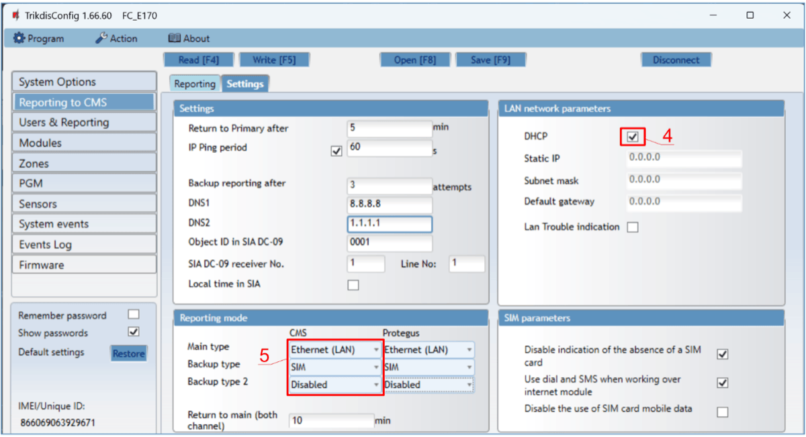

4.  If a LAN cable is connected to the communicator, check the box “DHCP” (automatic registration mode) so that the FIRECOM communicator will automatically read the network settings (subnet mask, gateway) and an IP address will be assigned to it.

5.  The parameters for how the communicator will send messages to CMS are set. Connection types are set in sequence. If the connection with the primary connection type fails, it switches to the next one and so on. If the fallback connection type succeeded in passing the message to CMS, then the “Return to Primary” connection type will be attempted after a set time interval.

**In the “Reporting to CMS” window, “Reporting” tab:**

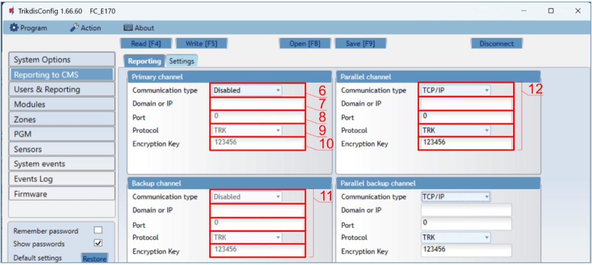

3.  **Communication type** – choose a communication type (TCP or UDP).

4.  **Domain or IP** – enter the receiver’s domain or IP address.

5.  **Port** – enter the receiver’s network port number.

6.  **Protocol** – choose which transmission protocol should be used for sending messages: **TRK** (to TRIKDIS receivers), **DC- 09_2007** or **DC-09_2012** (to universal receivers), **TL150** (to SUR-GARD receivers).

7.  **Encryption Key** – enter the receiver’s encryption key.

!!! note
    If you chose **DC-09** as the transmission protocol, additionally enter the object, line and receiver numbers in the “**Settings”** setting group of the **“Reporting to CMS”** window. 11. (Recommended) Configure the “**Backup channel”** settings.

12. Configure „**Parallel channel**” if messages will be sent to the second receiver of the CMS.

After finishing configuration, click the **Write \[F5\]** button and disconnect the USB cable.

!!! note
    See chapter **6 “Description of TrikdisConfig windows”** to find more about other FIRECOM settings in ***TrikdisConfig*.**

## Remote control

### Adding the communicator to Protegus2 app

Using Protegus2, users can see the system’s state and receive notifications about system events.

1.  Download and launch the Protegus2 app or use the browser version [www.protegus.app](https://www.protegus.app):

    

      

    

2.  Create a new account or log in with your user name and password.

!!! warning
    “Important” When adding the system to Protegus2 the FIRECOM communicator must:

    1.  Have an inserted and activated SIM card with the PIN code entered or
        disabled;

    2.  Have Protegus2 service enabled. See 6.4 "Users & Reporting"
        window;

    3.  Have the power switched on ("**STA**" LED must be blink green);

    4.  Be connected to a network (the "**SIM**" LED must be green solid and
        blink yellow; or/and "**ETH**" LED is green when connected to LAN
        network).

3.  Click “Add new system” and enter the *FIRECOM*’s “*Unique ID*” number. It can be found on the device and packaging sticker. After entering the “*Unique ID”*, click the “Next” button.

### Configuration and control via SMS messages

1.  **Change the administrator password**

To ensure safety, change the default administrator SMS password. Send an SMS message of the following format:

#### PSW 123456 xxxxxx

| **123456** | Default administrator password      |
|------------|-------------------------------------|
| **xxxxxx** | New 6-symbol administrator password |

1.  **Allow other users to control**

Only phone numbers on the user list can control the system using SMS messages or phone calls. From an administrator phone, send SMS messages with other people’s phone numbers and names to allow them to control the system:

#### SETN xxxxxx PHONEx=+PHONENR#NAME#EMAIL

| **xxxxxx** | 6-symbol administrator password |
|----|----|
| **x** | User’s number on the list. (If you write 1 as the user number, you will transfer your administrator’s rights to the other user.) |
| **PHONENR** | User’s phone number |
| **NAME** | User’s name |
| **EMAIL** | User’s e-mail |

#### SMS command list

| Command | Data | Description |
|----|----|----|
| INFO |  | Request information about the communicator. Object name, partition state, IMEI number, Cellular signal strength, firmware version and serial number will be included in the reply. E. g.: INFO 123456 |
| RESET |  | Reset the device. E.g.: RESET 123456 |
| OUTPUTx | ON | Turn on an output, “x” is the output number. E.g.: OUTPUT1 123456 ON |
| OUTPUTx | OFF | Turn off an output, “x” is the output number. E.g.: OUTPUT1 123456 OFF |
| OUTPUTx | PULSE=ttt | Turn on an output for a few seconds - “x” is the OUT output number, and “ttt” is a three-digit number that specifies pulse time in seconds. / E.g.: OUTPUT1 123456 PULSE=002 |
| PSW | New password | Change password. E.g.: PSW 123456 654123 |
| TIME | YYYY/MM/DD,12:00:00 | Set date and time. E.g.: TIME 123456 2023/05/09,12:23:00 |
| TXTA | Object name | Specify an object name. E.g.: TXTA 123456 House |
| RDR | PhoneNR#SMStext | Forward SMS messages to the specified number. The phone number must start with a “+” sign and the international country code. |
| RDR | PhoneNR#SMStext | E.g.: RDR 123456 +37061234567#forwarded text |
| ASKI |  | Request SMS message about statuses of inputs IN. E.g.: ASKI 123456 |
| ASKO |  | Request SMS message about statuses of outputs OUT. E.g.: ASKO 123456 |
| ASKT |  | Send SMS message with values of all temperature sensors. / E.g.: ASKT 123456 |
| FRS |  | Resets the fire sensor’s output, if the output OUT is assigned the function “Fire sensor reset”. E.g.: FRS 123456 |
| SETN | PhoneX=PhoneNR#Name#email | Add a phone number, username, e-mail and assign it to user “x”. “x” is the phone number’s line on the list. The phone number must start with a “+” symbol and international country code. The phone number and username must be separated by a “#” symbol. / E.g.: SETN 123456 PHONE5=+37061234567#JOHN#jonas@trikdis.lt |
| SETN | PhoneX=DEL | Delete user’s phone number and name from the system. / E.g.: SETN 123456 PHONE5=DEL |
| UUSD | \*Uusd code# | Send a UUSD code to the operator. E.g.: UUSD 123456 \*245# |
| CONNECT | Protegus=ON | Connect to Protegus cloud service. E.g.: CONNECT 123456 PROTEGUS=ON |
| CONNECT | Protegus=OFF | Disconnect from Protegus cloud service. / E.g.: CONNECT 123456 PROTEGUS=OFF |
| CONNECT | Code=123456 | Protegus cloud service code. E.g.: CONNECT 123456 CODE=123456 |
| CONNECT | IP=0.0.0.0:8000 | Specify the main server’s connection channel’s TCP IP and Port. / E.g.: CONNECT 123456 IP=0.0.0.0:8000 |
| CONNECT | IP=0 | For turning off the main channel. E.g.: CONNECT 123456 IP=0 |
| CONNECT | ENC=123456 | TRK encryption key. E.g.: CONNECT 123456 ENC=123456 |
| CONNECT | APN=Internet | APN name. E.g.: CONNECT 123456 APN=INTERNET |
| CONNECT | USER=user | APN user. E.g.: CONNECT 123456 USER=User |
| CONNECT | PSW=password | APN password. E.g.: CONNECT 123456 PSW=Password |

### Control PGM outputs using phone calls

Perform these actions if you want to control a PGM output remotely:

- The user must be allowed to control outputs OUT and the output OUT must have type “Remote control” assigned (using TrikdisConfig).

- Call the number of the FIRECOM’s SIM card. The FIRECOM will answer the call and you can dial commands using the phone’s keypad (see the table).

#### Mobile phone keyboard command list

| Keyboard buttons | Function | Description |
|----|----|----|
| \[output no\]\*\[state no\]# | Control selected output OUT | Controls the specified PGM output. State: \[0\] – output turned off; \[1\] – output turned on; \[2\] – turned off for pulse time; \[3\] – turned on for pulse time; (pulse time is specified in the TrikdisConfig software, “PGM” table) \[\*\] – this symbol shows the end of the command. E.g. (turn on output 1): 1*1# E.g. (turn off output 1): 1*0# E.g. (turn on output 2 for “Pulse time” specified in the TrikdisConfig “PGM” table): 2\*3# |
| \# | Retry entering the command | If you made a mistake while entering the command, press “#” on the phone’s keyboard and enter the command again. |

## Description of *TrikdisConfig* windows

### Description of TrikdisConfig status bar

Once the FIRECOM is connected, TrikdisConfig will display information about the connected device in its status bar.

| Name           | Description                                         |
|----------------|-----------------------------------------------------|
| IMEI/​Unique ID | Device’s IMEI number                                |
| Status         | Operational state                                   |
| Device         | Device type (must show FC_xxxx)                     |
| SN             | Device’s serial number                              |
| BL             | Bootloader version                                  |
| FW             | Device’s firmware version                           |
| HW             | Device’s hardware version                           |
| State          | Type of connection with the program (USB or remote) |
| Role           | Access level (shown after access code is approved)  |

When the **Read \[F4\]** button is clicked, the program will read and show settings currently saved on the FIRECOM. With TrikdisConfig, set the required parameters using the following program window descriptions.

### “System Options” window

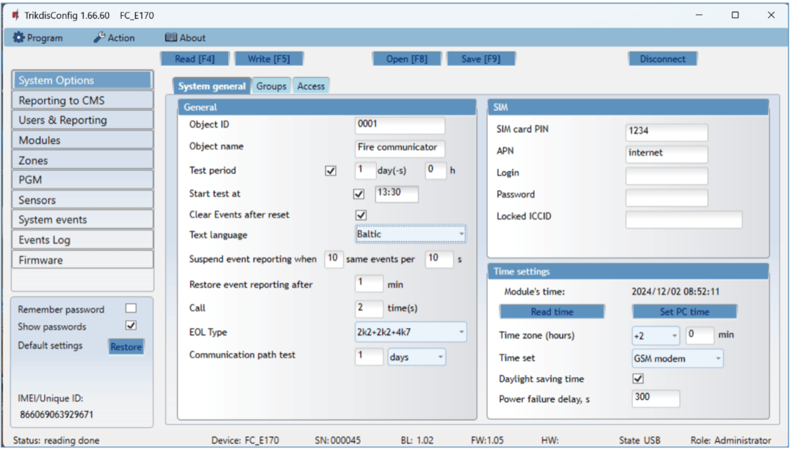

**“System general” tab** **“General” settings group**

- **Object ID** – if events are going to be sent to the CMS, enter the Object ID (4-symbol hexadecimal number, 0-9, A-F. **Do not use FFFE, FFFF Object ID**) given by the CMS.

- **Object name** – the name given to the object that will be used in SMS messages sent to the user.

- **Test period** - when the box is ticked, “Test” messages will be sent every set period.

- **Start test at** - tick the box and specify a time when test reports should be sent.

- **Clear Events after reset** – all unsent event messages will be deleted upon reset.

- **Text language** – set the preferred language and the specific symbols of that language will be used in SMS messages.

- You can **Suspend event reporting when …** a number of **same events per … s** happen.

- **Restore event reporting after …** – set the time after which suspending of event reporting will be cancelled. The time can be anywhere from 0 to 999 minutes.

- **Call –** when an event occurs, the FIRECOM will call user(-s) as many times as is set. If the call is declined or answered, the FIRECOM will stop calling. Duration of a call is 20 seconds.

- **EOL Type** - specify the nominals of the resistors connected to the sensors (EOL – End Of Line. RT + R1 + R2. Resistor RT - tamper; resistor R1 - sensor No 1; resistor R2 - sensor No 2).

- **Communication path test** - specify the time interval after which the communicator will check the Backup communication channels by sending messages to the CMS. After sending the messages on the Backup communication channels, the communicator will return to the Primary communication channel.

**“SIM” settings group**

- Enter the “**SIM card PIN”** code**.**

  - **APN** – network service provider’s mobile internet access point name. You must enter the **APN** if event messages will have to be sent to Protegus2 app or to the CMS via GPRS.

- If required by the GPRS network service provider, enter the **APN** user name and password in the fields **Login** and **Password**.

- **Locked ICCID** - enter the ICCID number of the SIM card if you want the communicator to work only with this SIM card.

**“Time settings” settings group**

You can set the time by clicking the “**Set PC time”** button. If “**Disabled”** is chosen in the “**Time synchronization”** field, the computer’s time will be set for the communicator. If a modem or a server is chosen in the “**Time synchronization”** field, the communicator will synchronize its time according to that modem or server.

- **Time zone (hours)** – specify your country’s time zone. For example, if the communicator will be installed in Lithuania, enter **+3**.

- **Time set** – specify a server to synchronize the ***FIRECOM**’s* internal clock with. Synchronization occurs after the communicator is powered on.

- **Daylight saving time** – if you check the box, the communicator’s internal clock will be automatically switched to summer or winter time.

- **Power failure delay** - in the event of a power failure in the main power supply, a power failure notification will be sent after the specified time delay. When the supply voltage is restored, a notification of the supply voltage recovery will be sent after the specified time delay.

**“Groups” tab**

Zones can be assigned to groups. The name of each group can be changed. Group names will be visible in Protegus2.

**“Access” tab**

**Settings group “Access codes”**

- **Administrator Code** – gives full access to configuration functions (default code – 123456).

- **SMS password** – password for remote control and programming via SMS messages (default code – 123456).

- **Installer Code** – gives limited access to changing the communicator’s configuration (default code – 654321).

!!! note
    If the default *administrator code* is set (123456), after pressing **Read \[F4\]** the program will immediately show the current operational parameters of the device without asking for the code. **Settings group “Installer permissions”**

The administrator can set which parameters can be changed by the installer.

### “Reporting to CMS” window

**“Reporting” tab**

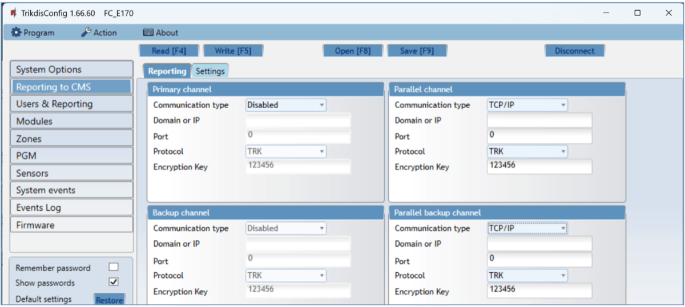

The communicator sends messages to the Central Monitoring Station using internet (IP).

You can assign a backup channel to the primary channel. It will be used when connection via the primary channel is lost.

Messages sent to the Central Monitoring Station are encoded and password protected. To receive messages and forward them to monitoring software, a TRIKDIS receiver is required:

- For IP messages – receiving program IPcom Windows/Linux, hardware IP/SMS receiver RL14 or multi-channel receiver RM14.

**Settings group “Primary channel” (“Parallel channel”)**

- **Communication type** – choose a method for connecting to the Central Monitoring Station’s receiver.

- **Domain or IP** – enter the receiver’s domain or IP address.

- **Port** – enter the receiver’s network port number.

- **Protocol** – select in which coding the events should be sent: **TRK** (to TRIKDIS receivers), **DC-09_2007** or **DC-09_2012** (to universal receivers. By selecting the SIA DC protocol, you can select the SIA-DCS messaging format.), **TL150** (to SUR-GUARD receivers).

- **Encryption Key** – 6-digit message encryption key. The communicator’s encryption key must match the receiver’s encryption key.

If parameters are set for the parallel channel, reports will be sent using both channels simultaneously. Both channels cannot be configured for the same receiver.

**Settings group “Backup channel” (“Parallel backup channel”)**

Enable backup channel mode to allow messages to be sent using the backup channel if the connectivity is disrupted. Configure the backup channel using the same settings as described above.

**“Settings” tab**

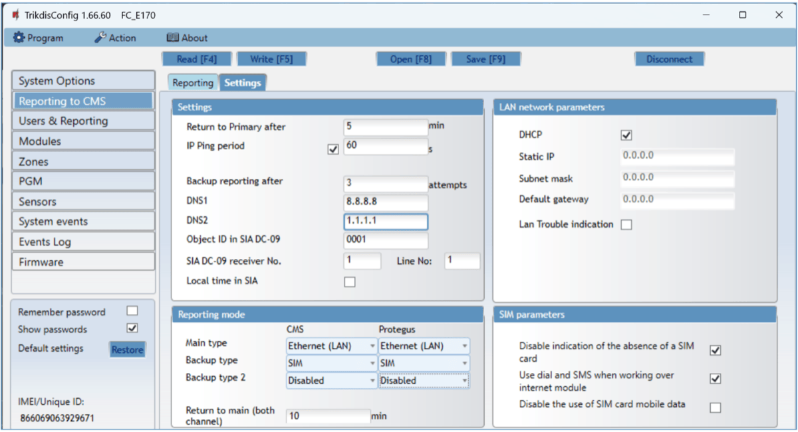

**Settings group “Settings”**

- **Return to Primary after** – time period after which the FIRECOM will attempt to regain connection with the “Primary channel”.
- **IP PING period** – sending period of internal PING signals for checking connectivity. These messages are sent only via IP channel. The receiver does not forward these signals to the monitoring software and thus does not overload the software. The monitoring software is only notified when the receiver does not receive a PING message from the device for a preset period of time.

By default, the receiver will send a “*Connection lost*” message to the monitoring software after a time period that is three times longer than the communicator’s PING sending period. E.g. if the IP PING period is 3 minutes, the receiver will send a lost connection message if it does not receive a PING for 9 minutes.

PING messages also keep an active connection session between the device and the receiver. An active session is required to configure and control the communicator remotely. We recommend setting the PING period to be no longer than 5 minutes.

- **Backup reporting after** – specify the number of unsuccessful attempts to send a message using the “**Primary channel”**. If the message fails to send after the specified number of attempts, the device will transmit using the “**Backup channel”**.

- **DNS1, DNS2** – (Domain Name System) server that specifies the domain IP address. It is used when a domain is specified in the connectivity channel’s “**Domain or IP”** field (instead of an IP address). Default setting - Google DNS server addresses.

The following settings are only shown when **DC-09_2007** or **DC-09_2012** protocol is chosen in the connectivity channel’s **Protocol** field.

- **Object ID in SIA DC-09** – <u>enter the object number. If you chose the DC-09 protocol, the object number entered in this field will be used</u>. You can enter the 3-16 symbol hexadecimal number given by the central monitoring station.

- **SIA DC-09 receiver No.** – enter the receiver’s number.

- **SIA DC-09 line No.** – enter the line number in the receiver.

- **Local time in SIA -** check the box so that the messages sent to the CMS indicate the time set in the module.

**Settings group “Reporting mode”**

For setting parameters on how the communicator will communicate with the CMS channels and with Protegus2. The connection types are specified in order. If the communicator fails to connect using the “**Main type”** connection , it switches to the “**Backup type”**, and so on. If the backup connection type was successful in transmitting the message to the CMS, then the “**Return to main”** connection type will be attempted after the specified time interval.

- **Main type** – select a connection type (SIM, Ethernet (LAN)) with the CMS receiver and Protegus2.

- **Backup type** – select a connection type (SIM, Ethernet (LAN)) with the CMS receiver and Protegus2.

- **Backup type 2** – select a connection type (SIM, Ethernet (LAN)) with the CMS receiver and Protegus2.

- **Return to main (both channel)** – time period after which the FIRECOM will attempt to regain connection using the *primary* channel, if it was running a backup channel, min.

**Settings group “LAN network parameters”**

- **DHCP mode** – mode for registering on the LAN network (manual or automatic). Tick the box and the FIRECOM communicator will automatically read the network settings (subnet mask, gateway) and will automatically be assigned an IP address (automatic registration mode).

- **Static IP** – static IP address for manual registration mode.

- **Subnet mask** – subnet mask for manual registration mode.

- **Default gateway** – gateway for manual registration mode.

- **LAN Trouble indication** – check the box so that the LED on the communicator lights up when the LAN communication link fails.

**Settings group “SIM parameters”**

- **Disable indication of the absence of a SIM card** – when the box is ticked, the FIRECOM communicator will not display an indication that there is no SIM card inserted.

- **Use dial and SMS when working over internet module** – ticking this box will enable controlling the communicator using phone calls and SMS messages. If the box is not ticked and there is a LAN network available, then SMS and phone calls are not used. If the box is not ticked and there is no LAN network, the FIRECOM can still be controlled using phone calls and SMS messages. The FIRECOM will send SMS messages to the user.

- **Disable the use of SIM card mobile data** – ticking the box will disable the usage of the SIM card’s mobile data. Data will only be sent using LAN. If a LAN network is temporarily unavailable, the FIRECOM will store data in memory. When the LAN network is restored, the FIRECOM will send data using LAN.

### “Users & Reporting” window

**“Users” tab**

**Settings group “Users & Reporting to User”**

- **ID** – user’s number on the list.

- **Name** – user’s name. These names will be used in event SMS messages and application.

- **Tel number** – the user’s phone number that will receive SMS messages. The numbers must start with the international country code. The first 8 telephone numbers will receive reports using messages and phone calls.

- **E-mail** - enter the user’s email, so that the user would be invited to Protegus2 to control the system.

- **PGM** – if the box is ticked, the user can remotely control outputs (calls, SMS).

- **ACK** – if the box is ticked, the FIRECOM will send SMS messages with “**SMS answer text”** to the user after every received SMS command.

- **FWD** – if the box is ticked, SMS messages received from non-system users will be forwarded to the user (e.g. SIM card account balance, random promotional messages, etc.).

**“Protegus” tab**

**Settings group “Cloud application”**

- **Enable cloud service** – enable Protegus 2 service to allow the FIRECOM to exchange data with the Protegus2 app and remotely configure the device using TrikdisConfig.

- **Parallel reporting** – enable parallel message sending via the “**Primary channel”** and to Protegus2.

- **Cloud access code** – 6-digit code for logging in to Protegus2 (default code - 123456).

**“SMS answer texts” tab**

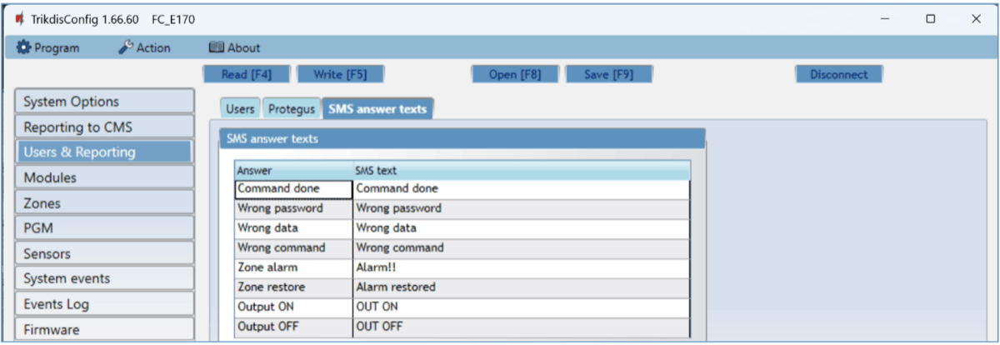

**Settings group “SMS answer texts”**

The text for answers to commands sent using SMS messages can be customized in the column “**SMS text”**. Also here are the texts of SMS messages that are used when activating inputs or outputs.

### “Modules” window

**“RS485 modules” tab**

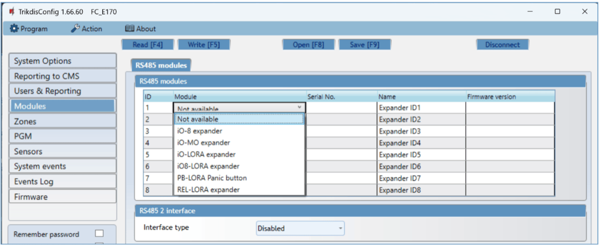

**Settings group “RS485 modules”**

- **ID** – module’s number on the list.

- **Module** – choose the module being used (modules iO-8, iO-MO, iO-LORA, iO8-LORA, PB-LORA, REL-LORA) from the module list.

- **Serial No**. – mandatory 6-digit number that can be found on the module’s casing and its packaging.

- **Name** – you can give the module a name.

- **Firmware version** – the firmware version will be shown when the FIRECOM finds the connected module.

**Settings group “RS485 2 modules”**

Fire panels (with **ESPA4.4.4** protocol, **NSC solution**, **INIM smartline**, **C-TEC Cast ZFP**) can be connected to the RS485 2 bus of the FIRECOM communicator. The connection diagram of the fire panel and settings is shown in paragraphs 3.5-3.8.

### “Zones” window

**“Zones settings” tab**

- **Zone No** – zone’s number on the list.

- **Name** - the zone can be given a name that will be used in SMS messages and application.

- **Input** – choose which FIRECOM or expansion module input IN to assign to a zone.

- **Group** - assigning a zone to a group.

- **Type** – choose the type of circuit connected to the zone input IN from a list: NC – normally closed; NO – normally open; EOL – with an end of line resistor; EOL_T – with an end of line resistor and tamper monitoring; ATZ – two zone normally closed circuit with end of line resistors, without tamper monitoring function (to use this type, choose the second ATZ zone in the input list); ATZ_T – two zone normally closed circuit with end of line resistors, with tamper monitoring function (to use this type, choose the second ATZ zone in the input list).

- **CMS** – if the box is ticked, messages about zone events will be sent to the CMS (central monitoring station).

- **Prot**. – if the box is ticked, notifications about zone events will be sent to Protegus2 app.

- **Delay** – IN input zone reaction time in milliseconds.

**“SMS & Call reporting” tab**

This window will only be displayed if at least one user phone number has been added to the „Users & Reporting“ window.

- **Zn** – zone number with an event identification word. Can be “*Event*” or “*Restore*”.

- **User SMS/Call** – choose how to inform users about every zone event – via SMS message and/or call.

**“Zone’s codes” tab**

When the zone is triggered, the communicator will send an event message. The input is assigned a Contact ID (SIA) code, which will be sent to CMS and Protegus2.

- **Enable** – checked event fields where messages will be sent to CMS and Protegus2.

- **E/R** – choose what type of event will be sent when input is triggered – “**Event”** (E) or “**Restore”** (R).

- **CID** – enter the event code or leave the default value.

- **SIA** - event SIA codes.

- **Group** – enter the group number that will be sent when an event occurs.

- **Zone** - enter the zone number that will be sent when an event occurs.

### “PGM” window

**“Outputs” tab**

- **PGM No** – PGM output’s number on the list.

- **Name** - enter the name of the PGM output.

- **PGM output** – assign outputs OUT of the FIRECOM or of an external device to a PGM.

- **Output definition** – select operational mode of an output OUT.

- **Pulse time, s** – assign a desired OUT turn on duration from 0 to 9999 seconds.

- **CMS** – if the box is ticked, messages about chosen events will be sent to CMS.

- **Prot**. – if the box is ticked, output event notifications will be sent to Protegus2 app.

**“Set Action” tab**

- **ID** – output’s number on the list.

- **Enable** – enables the PGM operation algorithm.

- **PGM No.** – select the desired PGM output OUT that will be controlled after the event described in columns “**Factor”**, “**Factor No.”**, “**Start when”**, “**Set value”** occurs.

- **Action**:

- **PGM OFF** – state of output OUT – “Off”.

- **PGM ON** – state of output OUT – “On”.

- **Pulse OFF** – initial state of output OUT – “On”. After the command the OUT state will become “Off” for the duration of the “**Pulse time”**, and later it will automatically return to the initial “On” state**.**

- **Pulse ON** – initial state of output OUT – “Off”. After the command the OUT state will become “On” for the duration of the “**Pulse time”**, and later it will automatically return to the initial “Off” state**.**

- **Pulse time, s** – you can set the pulse time anywhere from 0 to 9999 seconds.

- **Factor/Factor No.** – choose what event (Z*one, SMS received, Zone tamper*) will turn on the output OUT.

- **Start when** – you can set an additional condition when to turn on the output OUT depending on the “**Factor”** event.

- **Set value** – depending on the condition chosen in the “**Factor”** column a value (text of received SMS message) can be specified. If this value is identified, the action (chosen in the “**Action”** column) will be performed. The text of the SMS message can be separated by using % symbols. % symbols are used for separating the keyword that will change the state of a PGM output from the entire received SMS message.

**%…..%** - part of the received SMS message text must match with the text entered between % symbols (e.g. **%hoUSe%**. The text in an SMS message must include the text “**hoUSe**”. Example of an SMS message: **VacationhoUSe25864**).

**…..%** - the beginning of the received SMS message must match the text entered until the % symbol (e.g. **hoUSe%**. The SMS message must start with the text **“hoUSe”**. Example of an SMS message: **hoUSeddss**).

**%…..** – the ending of the received SMS message must match with the text entered after the % symbol. (e.g. **%hoUSe**. The SMS message must end with the text **“hoUSe”**. Example of an SMS message: **1144hoUSe**).

The SMS message text is case-sensitive.

**“Scheduler” tab**

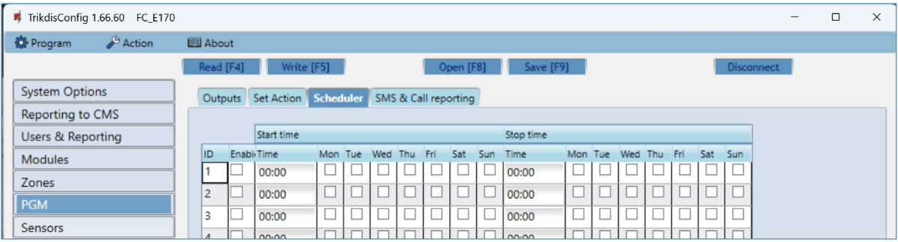

- **ID** – schedule’s number on the list.

- **Enable** – enable the schedule.

- **Start time** – set the time when OUT will be turned on (schedule start time).

- **Stop time** – set the time when OUT will be turned off (schedule end time).

- **Mon – Sun** – you can mark the days of the week when OUT will have to be turned on/off.

**“SMS & Call reporting” tab**

This tab will only be displayed if there is at least one user phone number in the “Users & Reporting” window. These settings can only be made for the first 8 users.

- **PGM** – the number of output OUT and turn on/off event type (“Event” – output OUT turn on event and “Restore” – OUT turn off event).

- **User SMS/Call** – choose which users to inform via SMS message and/or call when an output OUT is turned on/off.

### “Sensors” windows

- **ID** – temperature sensor’s number on the list.

- **Module type** – choose a temperature sensor to assign to the ID.

- **Serial No.** - serial number of the temperature sensor read by the communicator.

- **Sensor name** – give the temperature sensor a name.

- **Max** – when the temperature is higher than this setting, an event report will be generated. For an event message to be generated, the “**High”** box must be ticked.

- **Min** – when the temperature is lower than this setting, an event report will be generated. For an event message to be generated, the “**Low”** box must be ticked.

- **Sensor type** – choose the type of the connected temperature sensor (Dallas 1Wire – up to 8 temperature sensors of this type can be connected. If Dallas sensors are chosen, they will be linked automatically; Humidity & Temperature – one AM2301 temperature and humidity sensor can be connected. If the Humidity & Temperature sensor will be used, it must be manually assigned in the “**Module type”** column).

### “System events” window

**“Events” tab**

- **ID** – event’s number on the list.

- **Event name** – event name.

- **Enable** – enable event recognition.

- **CMS** – messages about chosen events will be sent to CMS.

- **Prot**. – notifications about chosen events will be sent to Protegus 2 app.

- **CID Code** – event’s Contact ID code.

- **SMS event text** – text of the event’s SMS message.

- **SMS restore text** - text of the event’s restore SMS message.

**“SMS & Call reporting” tab**

This tab will only be displayed if there is at least one user phone number in the “Users & Reporting” window

- **ID** – number and identification word (*Event*, *Restore*) of the event.

- **Event SMS text** – text that will be used in event SMS messages.

- **User SMS/Call** – choose the ways users will be informed about each event – SMS message and/or phone call.

### “Events Log” window

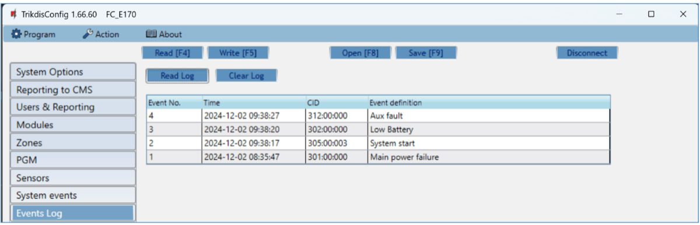

- **Read Log** button – for reading the event log from the device’s memory.

- **Clear Log** button – for clearing the event log entries from the device’s memory.

- In the table, you can find the **“Event No.”**, **“Time”**, **“CID”** code, “**Event definition”**. The events log can show up to 1000 events stored in the FIRECOM’s memory.

### Restore default settings

To restore the communicator’s default settings, click the TrikdisConfig button “**Restore”.**

## Setting parameters remotely

!!! warning
    “Important” Remote configuration will only work when the FIRECOM:

    1.  Has an inserted and activated SIM card with the PIN code entered or
        disabled.

    2.  Has Protegus service enabled. See **6.4 "Users & Reporting"
        window**.

    3.  Has the power switched on ("**STA**" LED must be blink green);

    4.  Is connected to a network (the "**SIM**" LED must be green solid and
        blink yellow; or/and "**ETH**" LED is green when connected to LAN
        network).

    If "**SIM**" is yellow solid or "**DAT**" is yellow solid, the device
    cannot connect to GSM and/or Protegus2.

1.  On your computer, launch the configuration software TrikdisConfig.

2.  In the “**Remote access”** window, enter the communicator’s “Unique ID” number. You can find this number on the back of the device and on the device’s packaging.

3.  (Optional) Enter a desired name for the communicator in the “**System Name”** field.

4.  Click “**Configure”**.

5.  In the window that opens, click **Read \[F4\]**. If prompted, enter the administrator or installer code.

6.  When you are finished setting the desired parameters, click **Write \[F5\]**. If you are done working with ***TrikdisConfig**,* click “**Disconnect”.**

## Communicator testing

When configuration and installation are complete, perform a system check:

1.  To test an input of the communicator, enable it. Check if the events were received by the Central Monitoring Station (CMS) and/or Protegus2 application.

2.  To test the communicator’s outputs, turn them on remotely and check their operation. Ensure that the events were received by the Central Monitoring Station (CMS) and/or Protegus2 application.

3.  Perform a fire alarm test to see if the CMS receives events correctly.

## Updating firmware

!!! note
    After connecting the communicator to TrikdisConfig, the program will automatically offer to update the firmware if any updates are available. Internet connection is needed for this feature. Antivirus software, firewall or strict internet access settings can block the automatic update feature. In this case, you will have to reconfigure your antivirus software. The communicator’s firmware can also be updated or changed manually. All prior settings of the communicator remain after an update. If the firmware is installed manually, it can be changed to a newer or an older version. Perform these steps:

1.  Launch ***TrikdisConfig**.*

2.  Connect the communicator to the computer using a USB Type-C cable or connect to the communicator remotely.

3.  If a newer version of firmware is available, the program will automatically offer to install it.

4.  Open the TrikdisConfig window “**Firmware”**.

5.  Click the button “**Open firmware”** and choose the required firmware file.

6.  Click the **Update \[F12\]** button.

7.  Wait for the update to finish.

## Safety precautions

The communicator should be installed and maintained only by qualified personnel.

Please read this manual carefully prior to installation in order to avoid mistakes that can lead to malfunction or even damage to the equipment.

Always disconnect the power supply before making any electrical connections.

Any modifications, modernization or repairs not authorized by the manufacturer shall render the warranty void.

Please adhere to your local waste sorting regulations and do not dispose of this equipment or its components with household waste.
