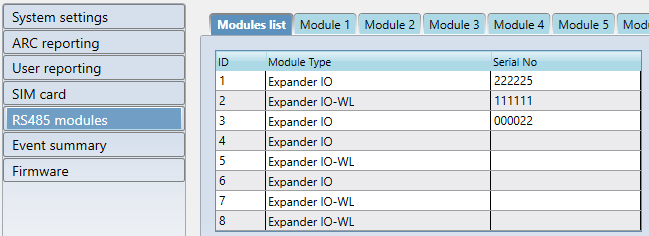
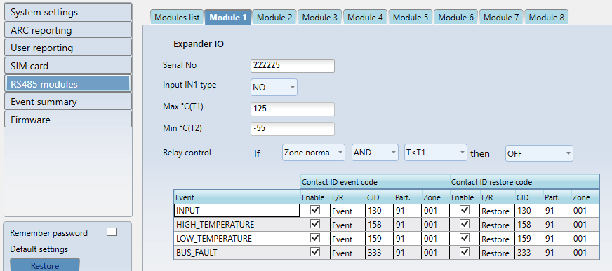
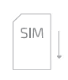
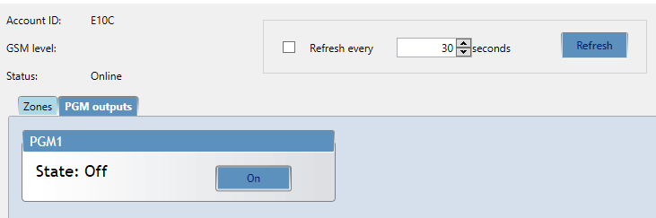

# Cellular communicator G16T

## Description

Communicator G16T is intended to upgrade any intruder alarm panel with telephone line communicator (TLC) for event signalling via cellular network.

Communicator transmits full event information to Alarm Receiving Centre.

**Configuration**

- Quick and easy installation

- Remote configuration and firmware updates

- Two access levels for setting of operating parameters

**Communications**

- Communication modes:

  - GPRS or 3G

  - SMS

- Two main communication channels working simultaneously

- Each channel has a separate back-up channel

- Connection control with ARC

- Simultaneous event reporting to Protegus Mobile/Web application, allowing user to remotely monitor and control its alarm system

- Event messages are transmitted in Contact ID codes

- Event reporting via SMS messages to four different users in user friendly SMS messages

**Connection**

- Connection to control panels via:

  - TLC terminal connection

#### Inputs and outputs

- 2 Outputs controlled via:

  - Mobile/Web application, or

  - SMS

- 1 Input, type: NC, NO, NC with EOL, NO with EOL, NC with DEOL, NO with DEOL.

### Specifications

| Parameter | Description |
|----|----|
| Cellular modem frequencies | 850 /​ 900 /​ 1800 /​ 1900 MHz |
| UTMS modem frequencies\* | 800 /​ 850 /​ 900 /​ 1900 /​ 2100 MHz |
| Power supply | 10-18VDC |
| Current consumption | 60-100 mA (on standby) /​ Up to 250 mA (while sending data) |
| Transmission protocols | TRK, DC-09_2007, DC-09_2012 |
| Message encryption | AES 128 |
| Memory | Up to 60 messages |
| Inputs | 1 selectable, type:NC, NO, NC with EOL, NO with EOL, NC with DEOL, NO with DEOL. |
| Output | 2 x OC type, commutating up to 1A DC, 30 V max |
| Operating environment | Temperature from -10 °C to 50 °C, relative humidity – up to 80% at +20 °C |
| Communicator dimensions | 65 x 77 x 25 mm |

\*G16T 3G version only

### Communicator board

1.  Cellular antenna SMA connector

2.  Light indicators

3.  Frontal case opening slot

4.  USB Mini-B port for communicator programming

5.  SIM card slot

6.  Terminal for external connections

5

6

1

2

3

5

4

6

### Purpose of terminals

| Terminal | Description |
|----|----|
| +DC | 10 -18 VDC power supply |
| -DC | Common (negative) |
| TIP | For connecting to the TIP clamp of security control panel |
| RING | For connecting to the RING clamp of security control panel |
| A 485 | RS-485 connection positive contact (enables connect iO and iO-WL expanders) |
| B 485 | RS-485 connection negative contact (enables connect iO and iO-WL expanders) |
| COM | Common (negative) |
| IN | Input |
| OUT1 | 1st open-collector output |
| OUT2 | 2nd open-collector output |

### Light Indication of operation

| Indicator | Light Status | Description |
|-----------|--------------|-------------|
| Network | Off | No connection to Cellular network |
| Network | Yellow blinking | Connecting to Cellular network |
| Network | Green solid with yellow blinking | Communicator is connected to Cellular network. Sufficient Cellular signal strength is level 5 (five yellow flashes) |
| Data | Off | No messages in buffer |
| Data | Green solid | Unsent messages in communicator's memory |
| Data | Green blinking | (Configuration mode) Data is transferred to/from communicator |
| Power | Off | No power supply |
| Power | Green solid | Power supply is sufficient and microcontroller is functioning |
| Power | Yellow solid | Power supply is insufficient (≤11.5V), microcontroller is functioning |
| Power | Green solid and yellow blinking | (Configuration mode) Communicator is ready for configuration |
| Power | Yellow solid | (Configuration mode) No connection with computer |
| Trouble | OFF | No operation problems |
| Trouble | 1 red blink | No SIM card |
| Trouble | 2 red blinks | SIM card PIN code problem (incorrect PIN code) |
|  | 3 red blinks | Programming problem (No APN) |
|  | 4 red blinks | Registration to Cellular network problem |
|  | 5 red blinks | Registration to GPRS/UMTS network problem |
|  | 6 red blinks | No connection with the receiver |
|  | 7 red blinks | Lost connection with control panel |
|  | Red blinking | (Configuration mode) Memory fault |
|  | Red solid | (Configuration mode) Firmware is corrupted |

### Before you begin

Before you begin, make sure that you have the necessary:

1)  USB cable (Mini-B type) for configuration.

2)  At least 4 wires cable for connecting communicator to control panel.

3)  Flat-head screwdriver.

4)  Sufficient gain Cellular antenna.

5)  SIM card.

Order them separately from your local distributor.

## Connect G16T to TrikdisConfig

Communicator can be configured using **TrikdisConfig** software for MS Window OS via USB cable or remotely.

**IMPORTANT**: To use remote configuration function, Protegus service must be enabled.

To configure the communicator remotely, insert registered SIM card with the PIN code request function disabled.

1)  Download **TrikdisConfig** from [www.trikdis.com](http://www.trikdis.com) (in search field type *TrikdisConfig*), and install it.

2)  Connect the communicator to **TrikdisConfig**:

- **Using USB cable**:

1)  **Insert screwdriver to the slot (arrow).** (it is unnecessary to put in screwdriver's head to the bottom of the casing).

2)  **Hold the casing's bottom part with one hand** and gently push screwdriver to the left side.

3)  **Plug in USB cable.** Run the configuration software **TrikdisConfig**. The software will automatically recognise connected communicator and will open a window for communicator configuration;

- **Remotely:**

1)  Run configuration program **TrikdisConfig.**

2)  In section - *Remote access* - field **Unique ID** enter IMEI of communicator (IMEI is provided on the product package). (Optional) in the field **System Name** enter the desired name to the communicator.

3)  Press **Configure**.

    

**Note:** When a new communicator firmware is released, TrikdisConfig will offer to upgrade it.

1)  *Click **Read [F4]** to read the communicators parameters and enter the Administrator or Installer code in pop-up window. For the program to remember the code, check the box next to **Remember password**.*

**Note:** If administrator code is set as default (123456), it is not required to enter it and the request window will not appear.

To set up the communicator from a saved configuration file, click **Open [F8]** and browse your computer to find the configuration file.

### Status bar description 

Once the communicator parameters are read, the status bar will display information about the communicator.

**Status bar**

| Name           | Description                                            |
|----------------|--------------------------------------------------------|
| IMEI/​Unique ID | IMEI number of the communicator                        |
| Status         | Action status                                          |
| Device         | Communicator type (shows G16T or G16T_3G)              |
| SN             | Serial number                                          |
| BL             | Bootloader version                                     |
| FW             | Firmware version                                       |
| HW             | Hardware version                                       |
| State          | Connection status                                      |
| Admin          | Access level (shows up after access code is confirmed) |

## Set operation parameters

### System settings window

**General**

- Write an appropriate **Object number** (4 symbols hexadecimal number).
- **Use security panel account ID** - Account ID is set in control panel, if enabled it will be transmitted to a G16T.
- **Wait acknowledgement from ARC** - after a successful reception of a message at the ARC, the communicator sends a kissoff signal to the control panel. If the control panel does not receive the kissoff tone in time, it retransmits the message.

- Select **Panel type** - option INTERFACE DTMF means that the communicator is applied to receive information coded in Contact ID format from the telephone communicator of the control panel in DTMF tones.
- Enable and write in **Dial tone frequency** to indicate if communication is working and if it is ready to initiate the call.
- Choose an input operation type from list **IN1.**

- Choose an output operation type from list **OUT1-OUT2.**

- Specify time synchronization (Communicator will use time according to selected server) and output/input parameters.

  **Access**

The communicator G16T have two access levels for configuring the communicator:

- **Administrator code** - allows full access to the configuration.

- **Installer code** - allows limited access for installer to the configuration.

**Note**: Administrator and Installer codes must be six symbols in length, and contain digits or Latin characters only.

### ARC reporting window→ ARC settings tab

**First and Second channels (and Backup channels)**

First and second channels can work in parallel, by allowing the communicator to simultaneously transmit data via both channels.

- Select **communication type** and **Protocol**.

  - If SMS reporting will be used – enter **TRK encryption key** and receivers phone number.

- Enter receiver's **Domain** or **IP** address and **Port**.

- Choose event transmission protocol **TCP or UDP**.

- Enter **Phone number** which will receive messages (phone numbers must contain country code, for example +370xxxxxxxx, 00370xxxxxxxx, or 370xxxxxxxx).

- **Backup SMS reporting number –** when GPRS mode is set in first and backup channels, this channel 1) will send message to the ARC when communicator will start working and 2) will serve as third backup channel.

### ARC reporting window→ Settings tab

**Settings**

- **Test period-** periodic test messages will be sent according to a time interval set in this section.
- **IP ping period** - and set time between signals in seconds (required for communication control).

- After a number of attempts to reconnect fails, as set in **Backup reporting after** field.

- It will attempt to return to the primary channel after a time, as set in **Return to primary after** field.

- Enter required **DNS** addresses.

### User reporting window → Protegus cloud tab

Protegus cloud allows users to remotely monitor and control the communicator.

Protegus cloud allows simultaneous transmission of data to the Protegus server for Mobile/Web application. For more information about PROTEGUS cloud visit [www.protegus.app](https://www.protegus.app).

**IMPORTANT:** When Protegus cloud is used – SMS & Call reporting tab will be disabled automatically.

**Protegus cloud**

- Enable cloud service at **User reporting** > **PROTEGUS service** tab.

- Enter **Cloud access code** (default code – 123456), for more safety change it to six symbol code.

### User reporting window → SMS & Call Reporting tab

Received event messages and internal communicator events can be reported to the users mobile phones via SMS messaging and calls.

- Each message come with an object name: enter the **Object name** of your choice to the text field.

- From **SMS language** drop-down list select required language (SMS messages can be sent in various character sets).

- Message can be send up to 4 different phone numbers. List them in **Phone number** table (Phone numbers must contain country code, for example +370xxxxxxxx, 00370xxxxxxxx, or 370xxxxxxxx).
- Information about the received events as **Areas**, **Users** and **Zones** are coded in digits. Each of them can be named and the given names will be used in SMS messages sent to the users. Write your chosen names into their appropriate tables.

- To receive event messages, specify which CID events will be reported. Also, it can be selected which phone numbers receives (SMS/Call) notifications about the events.

### User reporting window → Remote control tab

**Note:** SMS commands can be sent from any phone numbers if there is no described numbers in list.

**Remote control**

- Answers to the SMS commands can be customised in **Replay text** field.

- List a phone number for remote control to a table **Tel. numbers for control by SMS.** SMS text, that user receives after sending a command (to receive an SMS answer message, the user **access code** must be correct).

#### SMS commands list

SMS Commands are used to remotely control the communicator**.**

**As access code use “Administrator code” or “Installer code”,** “\_” represents a space.

SMS command structure: AccessCode_Command_Data.

| Command | Data | Description |
|---------|------|-------------|
| INFO |  | Information about the communicator request. The response will include: communicator type, IMEI number, serial number and firmware version. |
| RESET |  | Restart the communicator. |
| OUTPUTx | ON | Turn on the output, where “x” represents output number 1 or 2. |
| OUTPUTx | OFF | Turn off the output, where “x” represents output number 1 or 2. |
| OUTPUTx | PULSE=tttt | Turn on the output for a number of seconds, where “x” represents output number (1) and “tttt” a four-digit number representing pulse duration in seconds. |
| CONNECT | PROTEGUS=ON | Turn on Protegus cloud service (when Protegus Cloud is on, other channels automatically is turn off) |
| CONNECT | PROTEGUS=OFF | Turn off Protegus cloud service |
| CONNECT | APN=internet | APN name |
| CONNECT | USER=user | APN user |
| CONNECT | IP=0.0.0.0:1000 | Main server IP and Port |
| CONNECT | ENC=123456 | TRK encryption key |
| CONNECT | CP= | Panel type from panel type list |
| CONNECT | DIR=ON | Turn on control panel's control from Protegus |
| CONNECT | DIR=OFF | Turn ooff control panel's control from Protegus |

**Examples**

For the example purposes access code is *123456*.

**To receive information about the communicator:**

“123456 INFO”

**To turn on the output OUT1:**

“123456 OUTPUT1 ON”

**To turn on the output OUT1 for 3 seconds:**

“123456 OUTPUT1 PULSE=0003”

**To turn on Protegus, set APN and turn on DSC PC1616 control panel:**

“123456 CONNECT PROTEGUS=ON,APN=internet,CP=2”

### SIM card window

Ensure that the SIM card is working, before using it.

If GPRS or 3G communication is required, ensure mobile data service is enabled.

<u>For information, how to enable this service please contact your GSM service provider.</u>

**SIM card**

- Enter **SIM card PIN, APN.**

- If it is required enter Cellular network name and password in fields **Login, Password.**
- **Forbid connection when roaming detected** (use it when security system is installed near country border, this will ensure that communicator would not connect wrong Cellular network).

### RS485 modules window → Modules list

- Select module (module iO) from modules list.

  - Enter the serial six digit number (this number is mandatory for communication, it can be found on the device casing or packing box).

**Note:** if more than one module are used in the system, select them in the list and set their parameters.

- New tab (Module x) for each module will appear.

### RS485 modules window → Module x

In the tab Module x, configure parameters of the iO module. Here, set input mode, temperature range for digital temperature sensor and output control settings.

- **Serial** – mandatory serial six-digit number (set previous step).

- **Input mode** – choose an input operation type (NC or NO) from the list.

- **Output control** – set output reaction when selected conditions occur.

- **Event table** – if required enable/disable events, change type from Event to Restore, enter CID, Partition (Part.) and Zone codes.

- **If digital temperature sensor will be used, set parameters:**

  - **Max °C (T1)** – maximum allowed temperature value, above which an event will be reported. For such purpose event named **HIGH_TEMPERATURE** must be enabled.

  - **Min °C (T2)** – minimum allowed temperature value, below which an event will be reported. For such purpose event named **LOW_TEMPERATURE** must be enabled.

### Event summary window

The communicator can generate periodical test messages.

To enable periodical test messages and set the period time, navigate to **System settings → General → Test period**. Time is set in day(s) and hours (Maximum 7 days).

Local changes of periodical test messages can be done in **Event summary window:**

- **Test and other internal events** can be enabled/disabled and their Contact-ID number can be customised. To enable the events generation and set Contact-ID number, navigate to **Event Summary** table.

### To write new parameters to the communicator, click Write [F5].

**Note:**

To restore default settings of the communicator, press the **Restore** button under the **Default settings** in the bottom left corner of the configuration window.

To create a configuration file which contains current parameters, click **Save [F9]**.

### Disconnect communicator:

- Click **Disconnect** to disconnect from roles (installer or admin) while communicator is connected via USB cable to computer.

- If a configuration is done via USB cable, unplug the USB cable, click **Disconnect** to go back to first window.

## Physical installation process

###  Insert SIM card into the holder 

4\)

1)  SIM card must be already registered to the Cellular network, if GPRS communication will be used, ensure to enable mobile data service.

2)  To configure the communicator remotely, insert a SIM card with the PIN code request function disabled.

a\. Install the communicator into a mounting case. If the screw mounting will be used:

- Then fix the bottom part to its place with screws and place the PCB board back into case
- Remove the PCB board from the case bottom part;

**b. Close the communicator’s case**.

**c. Connect Cellular antenna.**

**Note:** Sufficient Cellular signal strength is level 5 (five yellow flashes of indicator Network).

Sufficient 3G signal strength is level 3 (three yellow flashes of indicator Network).

### Wiring diagrams

Following provided schematics connect the control panel, sensors and output connections.

- Control panel's TLC terminal and outputs:

- System with iO series modules and temperature sensor:

  <figure style="margin: 0;">
    
  </figure>
  <figure style="margin: 0;">
    
  </figure>

### Input connection

The communicator contains one input terminal (IN) for connection of sensors. For setting the input connection type see [**3.1 General system settings**](#General_setup).

| NC, Normally Open Short – Alarm;​ Open - Restore |
|--------------------------------------------------|
| INx COM COM |
| NC, Normally Closed Short – Restore;​ Open - Alarm |
| INx COM |
| Normally open circuit with end of line resistor (EOL, End of Line). /​ Short – Alarm;​ Open – Alarm;​ /​ 2,2k – Restore |
| INx COM COM |

**a. Turn on the power supply.**

## Program security control panel (in general)

Use Programming manual of particular security control panel and set operation parameters of telephone communicator as following:

######## Enable the PSTN dialler of the panel.

######## Select DTMF mode.

######## Select Contact ID communication format.

######## Enter a telephone number for dialling (you can use any number not shorter than 2-digits).

######## Enter a 4-digit account number in the panel. 

### Program Honeywell Vista panel landline dialer

**Communications Setup**

Using keypad go to the following sections, and program them as indicated:

- \*41 - Enter receiver's phone number

- \*43 - Enter control panel's account number

- \*47 – Select Tone dialing to 1 and enter desired dialer attempts

- \*48 - Contact ID. Use the default, Contact ID 4 by setting \*48 to 77

- \*49 - Split/Dual report. \*49, should be set to 5

- \*50 - Burglar Dialer Delay (optional). The default is [2,0] which causes a 30 second delay until an alarm event is sent out. If you want the event to be sent out with no delay then set this to [0,0].

**Exit Programming**

Once all the sections are programmed, leave installers mode by entering \*99 on the keypad.

#### Special settings for Honeywell Vista 48 panel

To use G16T with Honeywell Vista 48 control panel, program following sections as indicated:

| Honeywell Vista 48 communication setup: |
|-----------------------------------------|
| *41 |
| *42 |
| *43 |
| *44 |
| *45 |
| *47 |
| *48 |
| *50 |
| *59 |
| *60 |

**Exit Programming**

Once all the sections are programmed, leave installers mode by entering \*99 on the keypad.

## Add communicator in Protegus

1)  Log in or sign in to [www.protegus.app](https://www.protegus.app).

2)  Add the system to the Protegus: press **“Select system*”***; next **“Add new system +”**, and enter the required data as shown below (you can skip fields “Name”, “Address” and fill it later).

Enter IMEI (it can be found: on packing box;

back of communicator's housing;

in TrikdisConfig as Unique ID).

### (Optional) If you will use remote arm/disarm feature, in Protegus main window, choose Settings from side bar and again Settings. In new Settings window tick the checkbox: Arm/Disarm with PGM

**IMPORTANT!** In Protegus app one PGM output can be assigned to control one Area (1 PGM - 1 Area; 2 PGM - 2 Areas) regardless of how many areas are controlled by same keyswitch zone in panel.

Set which Area will be controlled by Protegus in system **Settings.** There select the checkbox **Arm/Disarm with PGM,** and the number of Area, which you want to control.

In Protegus **Areas** window, you will see all areas available in the system, with controllable areas highlighted.

**IMPORTANT!** To use keyswitch control feature with the **Honeywell/Ademco Vista 48** security system, Pulse period time must be set:

- If Pulse period is set less than 2 seconds - system will operate in Normal Arm mode.

- If Pulse period will be set more than 2 seconds - system will operate in Stay Arm mode.

Not all Vista control panels will have this functionally. For detailed information about this functionality, please refer to Honeywell Vista panel installation manual.

## Test communicator performance 

1)  After configuration and installation is complete, perform a system test. Activate an event in the control panel, and make sure that the event arrives to the alarm receiving centre or is received in the mobile application.

2)  To test communicator input, activate it and make sure that the correct messages arrives to recipients.

3)  To test the communicator outputs, please activate them remotely.

4)  Carry out alarm signalling tests to make sure that the alarm receiving centre receives the signals correctly.

## Remote control 

Communicator G16T can be controlled remotely using TrikdisConfig. To do so follow steps below:

1)  Open TrikdisConfig.

2)  At the field **Remote access**, in the field **Unique ID** enter the IMEI address. IMEI address is provided on the product package.

    

3)  (Optional) In the field **System Name** enter the desired name to the communicator, press **Control.**

4)  Enter **Self-service code** – it is the same code that is used for Protegus Service code.

5)  In new window, **Zones tab**, zones can be controlled. Also, (in all tabs) refresh time can be selected.

6)  In **PGM outputs** tab, PGM outputs can be controlled – turned off/on.

## Manual firmware update

The communicator firmware can be updated or changed manually. After an update, all the previous communicator parameters will remain the same.

When writing firmware manually, it can be changed to a newer or older version. To update:

1)  Run TrikdisConfig.

2)  Connect the communicator via USB cable to the computer or connect to the communicator remotely.

    - If newer firmware version exists, the software will offer to download the newer firmware version file.

3)  Select the menu branch **Firmware**.

**Note**: If there is an installed antivirus software on your computer, it might block automatic firmware update option. In this case you must reconfigure your antivirus software.

1)  Press **Open firmware** and select the required firmware file.

    - If you do not have the file, the newest firmware file can be downloaded by <u>registered user</u> from [www.trikdis.com](http://www.trikdis.com) , under the download section of the G16T communicator.

2)  Press **Update [F12]**.

3)  Wait for the prompt of update to complete.

4)  Click **OK** in the prompted window.

## Safety requirements

The security alarm system should be installed and maintained by qualified personnel.

Prior to installation, please read carefully this manual in order to avoid mistakes that can lead to malfunction or even damage to the equipment.

Disconnect power supply before making any electrical connections.

Changes, modifications or repairs not authorized by the manufacturer shall void your rights under the warranty.

Please act according to your local rules and do not dispose of your unusable alarm system or its components with other household waste.
