# Cellular communicator G16T

  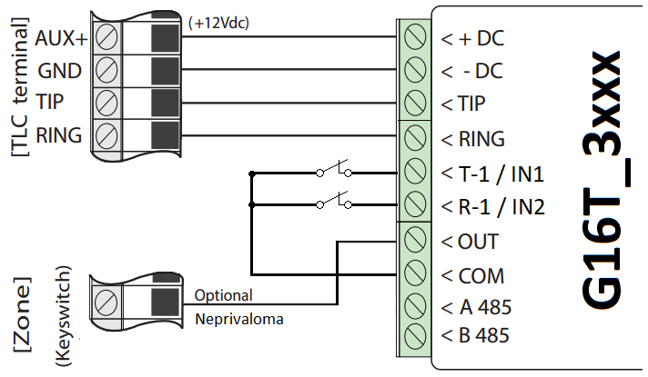

## Description 

Cellular communicator G16T can be connected to any alarm panel that has a landline dialer and supports dialing in Contact ID protocol with DTMF tones.

The communicator can transmit full event information to the security company’s monitoring station receiver.

The communicator works with the *Protegus* app. Users can control their alarm system remotely and receive notifications about events. *Protegus* app works with all security alarm panels to which the communicator is connected to, regardless of manufacturer. Communicator can transmit event notifications to the Central Monitoring Station and work with Protegus simultaneously.

Cellular communicators G16T are certified to the highest EN50131 Grade 4 security rating.

### Features

**Connects to panel’s landline dialer:**

- Communicator can be connected to control panel’s landline dialer with 2 or 4 wires.

- When connected with 4 wires, the landline between the panel and communicator will be monitored.

Sends events to monitoring station receiver:

- Sends events to TRIKDIS software or hardware receivers that work with any monitoring software.

- Can send event messages to SIA DC-09 receivers.

- Can send event messages to SUR-GARD receivers. The annex has a table for converting Contact ID codes to SIA codes.

- Connection supervision by polling to IP receiver every 30 seconds (or by user defined period).

- Backup channel, that will be used if connection with the primary channel is lost.

- Events can be reported to CMS with SMS messages. SMS will be sent even if data connection stops working in the mobile operator network.

- With parallel communication channels events can be sent to two receivers at same time.

- When *Protegus* service is enabled, events are first delivered to CMS, and only then are sent to app users.

**Works with Protegus app:**

- “*Push*” and special sound notifications informing about events.

- Remote system Arm/Disarm.

- Remote control of connected devices (lights, gates, ventilation systems, heating, sprinklers, etc.).

- Remote temperature monitoring (with iO or iO-WL expanders).

- Different user rights for administrator, installer and user.

- Users can also be informed about events with SMS messages and phone calls.

**Notifies users:**

- Users can be notified about events not only with Protegus app, but also with SMS messages and a call.

**Controllable outputs and inputs:**

- 1 output, controlled via:

  - Protegus app.

  - SMS message.

    - 2 inputs, selectable type: NC; NO; NC/EOL; NO/EOL; NC/DEOL; NO/DEOL.

    - Add additional inputs and controllable outputs with wired and wireless iO expanders.

**Quick setup:**

- Settings can be saved to file and quickly written to other communicators.

- Two access levels for configuring the device for CMS administrator and for installer.

- Remote configuration and firmware updates.

### Communicator model types 

This manual applies to these G16T models:

- G16T_321x – version 3, 2G modem, 1 SIM.

- G16T_331x – version 3, 3G modem, 1 SIM.

- G16T_341x – version 3, 4G modem, 1 SIM.

- G16_3M10 – 3 version, 1 SIM, LTE CatM1 & EGPRS modem.

### Specifications 

| Parameter | Description |
|----|----|
| Connects to panel | Landline dialer (TIP RING contacts) |
| Inputs | 2 selectable type inputs, NC;​NO;​ NC/​EOL;​ NO/​EOL;​ NC/​DEOL;​ NO/​DEOL /​ Expandable with iO series expanders |
| Output | 1, OC type, up to 0,15 A, 30 V max /​ Expandable with iO series expanders |
| 2G modem frequencies | 850 /​ 900 /​ 1800 /​ 1900 MHz |
| 3G modem frequencies | 800 /​ 850 /​ 900 /​ 1900 /​ 2100 MHz |
| 4G modem frequencies | Depends on region |
| Power supply voltage | 10-18 V DC |
| Current consumption | 60-100 mA (on standby) /​ Up to 250 mA (while sending data) |
| Transmission protocols | TRK, DC-09_2007, DC-09_2012, TL150 |
| Message encryption | AES 128 |
| Changing settings | With TrikdisConfig computer program remotely or locally via USB Mini-B port /​ Remotely with SMS messages |
| Operating environment | Temperature from -10 °C to 50 °C, relative humidity - up to 80% at +20 °C |
| Communicator dimensions | 92 x 62 x 26 mm |
| Weight | 80 g |

### Communicator elements 

1.  Cellular antenna SMA connector

2.  Light indicators

3.  Frontal case opening slot

4.  Terminal for external connections

5.  USB Mini-B port for communicator programming

6.  SIM card slot

### Purpose of terminals 

| Terminal | Description |
|----|----|
| +DC | +10 V/​+18 V power supply |
| -DC | +10 V/​+18 V power supply |
| TIP | Terminal to connect with security control panel TIP terminal |
| RING | Terminal to connect with security control panel RING terminal |
| T-1 /​ IN1 | Terminal for monitoring the telephone line or an input terminal, selectable type: NC;​ NO;​ NC/​EOL;​ NO/​EOL;​ NC/​DEOL;​ NO/​DEOL |
| R-1 /​ IN2 | Terminal for monitoring the telephone line or an input terminal, selectable type: NC;​ NO;​ NC/​EOL;​ NO/​EOL;​ NC/​DEOL;​ NO/​DEOL |
| OUT | Output terminal (OC type), current up to 0,15 A |
| COM | Common terminal (negative) |
| A 485 | *RS485* bus A contact |
| B 485 | *RS485* bus B contact |

### LED indication of operation 

| Indicator | Light status | Description | NETWORK | Off Yellow blinking Green solid with yellow blinking | No connection to cellular network. Connecting to cellular network. Communicator is connected to cellular network. / Sufficient cellular signal strength for 2G is level 5 (five yellow flashes) and for 3G, 4G network - level 3 (three yellow flashes). | DATA | Off Green solid Green blinking | No unseen events. Unsent event events are stored in buffer. (Configuration mode) Data is transferred to/from communicator. | POWER | Off Green solid Yellow solid Green solid and yellow blinking Yellow solid | Power supply is off or disconnected. Power supply is on with sufficient voltage. Power supply voltage is not sufficient (≤11.5V). (Configuration mode) Communicator is ready for configuration. (Configuration mode) No connection with computer. | TROUBLE | OFF 1 red blink 2 red blinks 3 red blinks 4 red blinks 5 red blinks 6 red blinks 7 red blinks Red blinking Red solid | No operation problems. SIM card not found. SIM card PIN code problem (incorrect PIN code). Programming problem (No APN). Registration to Cellular network problem. Registration to mobile data network problem. No connection with the receiver. Lost connection with control panel. (Configuration mode) Memory fault. (Configuration mode) Firmware is corrupted. |
|-----------|--------------|-------------|---------|------------------------------------------------------------|----------------------------------------------------------------------------------------------------------------------------------------------------------------------------------------------------------------------------------------------------------------|------|--------------------------------------|----------------------------------------------------------------------------------------------------------------------------------|-------|---------------------------------------------------------------------------------------|---------------------------------------------------------------------------------------------------------------------------------------------------------------------------------------------------------------------------------------------------------------|---------|-------------------------------------------------------------------------------------------------------------------------------------------------|-------------------------------------------------------------------------------------------------------------------------------------------------------------------------------------------------------------------------------------------------------------------------------------------------------------------------------------------------------------------------------------------|

### Structural schematic with G16T usage 

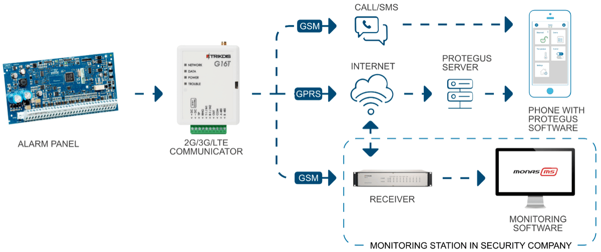

!!! note
    Before you begin, make sure that you have the necessary:
    
    1.  USB cable (Mini-B type) for configuration.
    
    2.  At least 4-wire cable for connecting communicator to control panel.
    
    3.  Flat-head 2.5mm screwdriver.
    
    4.  Sufficient gain cellular antenna if network coverage in the area is
        poor.
    
    5.  Activated Nano-SIM card (PIN code request can be turned off).
    
    6.  Particular security control panel\`s installation manual.
    
    Order the necessary components separately from your local distributor.
## Quick configuration with *TrikdisConfig* software 

1.  Download configuration software TrikdisConfig from [www.trikdis.com](http://www.trikdis.com) (type “TrikdisConfig” in the search field) and install it.

2.  Open the casing of the G16T with a flat-head screwdriver as shown below:

1.  Using a USB Mini-B cable connect the G16T to the computer.

2.  Run TrikdisConfig. The software will automatically recognize the connected communicator and will open a window for configuration.

3.  Click **Read [F4]** to read the communicator’s settings. If requested, enter the Administrator or Installer 6-digit code in the pop-up window.

Below we describe what settings need to be set for the communicator to begin sending events to the Central Monitoring Station and to allow the security control to be controlled with the Protegus app.

### Settings for connection with Protegus app 

**In “User reporting window” “PROTEGUS Cloud” tab:**

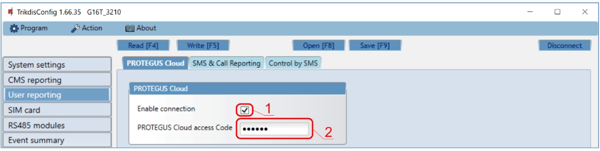

1.  Select checkbox **Enable connection** to the Protegus Cloud.

2.  You can change the **Protegus Cloud access Code** for logging into Protegus if you want users to be asked to enter it when adding the system to Protegus app (default password - 123456).

**In “SIM card” window:**

3. Enter **SIM** **card** **PIN** code.

2.  Change **APN** name. **APN** can be found on the website of the SIM card operator (“internet” is universal and works in many operator networks).

After finishing configuration, click the button **Write [F5]** and disconnect the USB cable.

!!! note
    For more information about other G16T settings in
    TrikdisConfig, see chapter **6 TrikdisConfig window description**.
!!! warning "Important"
    Do not forget to turn on the landline dialer of the alarm panel and set
    it up correctly, so that the panel would send the events. Alarm panel
    setup is described in chapter **4 Programming the control panel**.
### Settings for connection with Central Monitoring Station 

**In “System settings” window:**

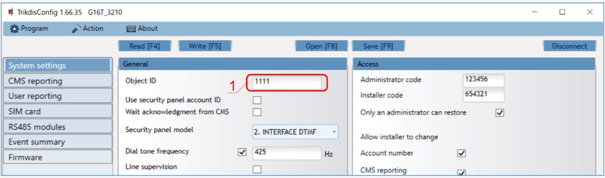

1.  Enter **Object ID** (account) number provided by the Central Monitoring Station (4 characters, 0-9, A-F. **Do not use FFFE, FFFF Object ID**).

**In “CMS reporting” window settings for “Primary channel”:**

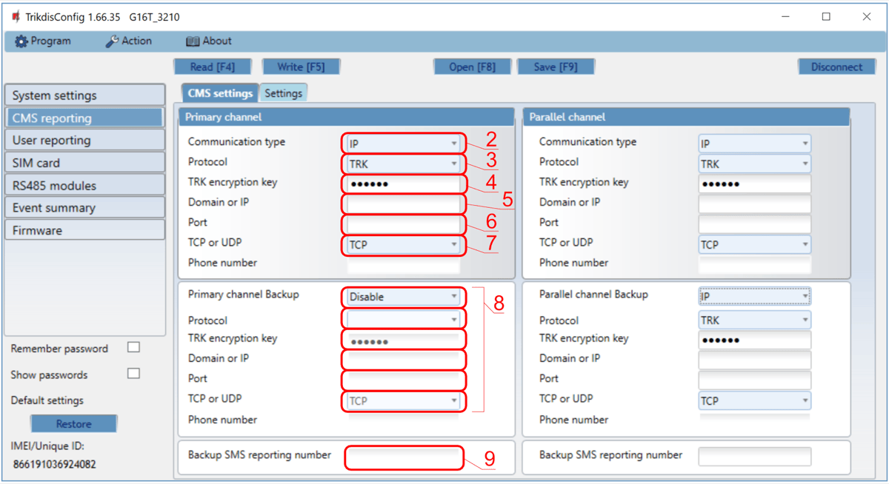

2. **Communication type** - select the **IP** connection method (we do not recommend SMS as the primary channel).

2.  **Protocol -** select the protocol type for your event messages: **TRK** (to TRIKDIS receivers), **DC-09_2007** or **DC-09_2012** (to universal receivers), **TL150** (to SUR-GARD receivers).

3.  **TRK encryption key** - enter the encryption key that is set in the receiver.

4.  **Domain or IP -** enter the receiver’s Domain or IP address.

5.  **Port -** enter receiver’s network port number.

6.  **TCP or UDP** - choose event transmission protocol (**TCP** or **UDP**) in which events should be sent.

!!! note
    If you want to set communication with CMS via **SMS** messages, you only
    need to set **Encryption key** and **Phone number.** SMS messages can be
    received only by TRIKDIS receivers: IP/SMS receiver RL14, multichannel
    receiver RM14 and SMS receiver GM14. / If you selected the **DC-09**
    protocol, additionally enter object, line and receiver numbers in the
    **Settings** tab of the **CMS reporting** window.
7. (Recommended) Configure **Primary channel Backup** settings.

2.  (Recommended) Enter **Backup SMS reporting number.**

**In “SIM card” window:**

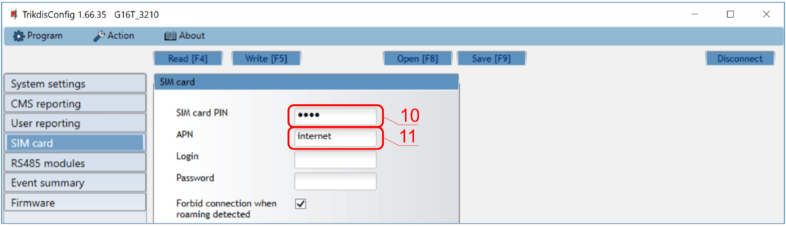

10. Enter **SIM card PIN** code.

11. Change the **APN** name. **APN** can be found on the website of the SIM card operator (“internet” is universal and works in many operator networks).

After finishing configuration, click **Write [F5]** and disconnect the USB cable.

!!! note
    For more information about other G16T settings in
    TrikdisConfig see chapter **6 TrikdisConfig window description**.
!!! warning "Important"
    Do not forget to turn on the landline dialer of the alarm panel and set
    it up correctly, so that the panel would send the events. Alarm panel
    setup is described in chapter **4 Programming the control panel**.
## Installation and wiring 

### Installation process 

1.  Remove the top cover and pull out the contact terminal.

2.  Remove the PCB board.

3.  Fix the bottom part to the suitable place with screws.

4.  Place the PCB board back into the case, insert contact terminal.

5.  Screw cellular antenna on.

6.  Insert nano-SIM card.

7.  Close the top cover.

!!! note
    Ensure that the SIM card is activated. / Ensure that mobile internet
    service (mobile data) is enabled if Protegus app or IP connection with
    CMS will be used. / To avoid entering the PIN code in
    TrikdisConfig, insert the SIM card into your mobile phone and turn
    off the PIN request function.
### Schematics for wiring the communicator to the security control panel 

Following one of the schematics provided below, wire the communicator to the control panel.

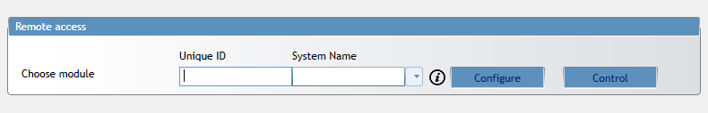

### Schematics for connecting to panel keyswitch zone 

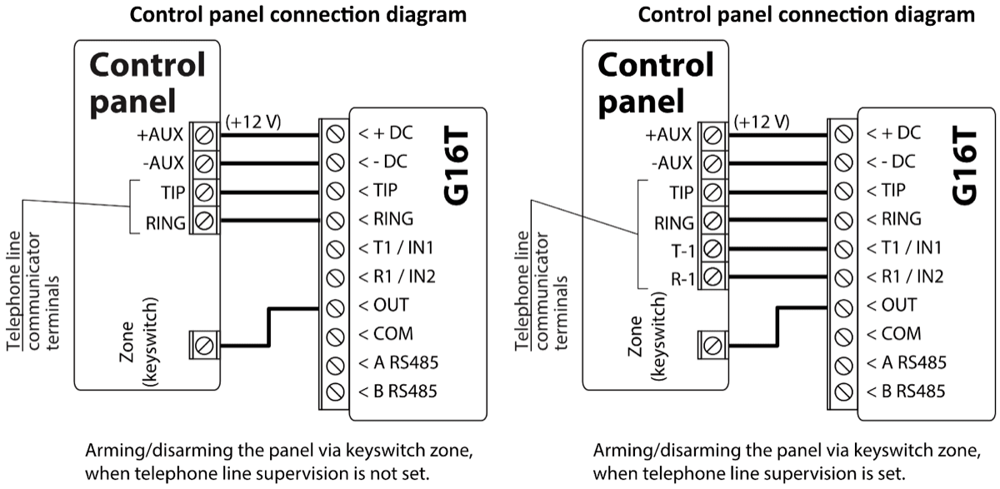

Follow these schematics if the control panel will be armed/disarmed with the G16T PGM output turning on/off the panel’s keyswitch zone.

!!! note
    The G16T communicator has one programmable output OUT, which can
    control one alarm system partition. In the TrikdisConfig window
    "System settings" output OUT1 mode needs to be set to **Remote control**
    (default setting).
### Schematics for wiring inputs 

The communicator has two input terminals (IN1, IN2) for connecting NO, NC, NO/EOL, NC/EOL, NO/DEOL, NC/DEOL type circuits. Default input setting - NO. The input type can be changed in the TrikdisConfig window **System settings -> Input IN1-IN2 type**.

Connect the input according to the selected input type (NO, NC, NO/EOL, NC/EOL, NO/DEOL, NC/DEOL), as shown in the schemes below:

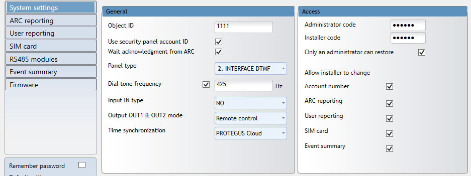

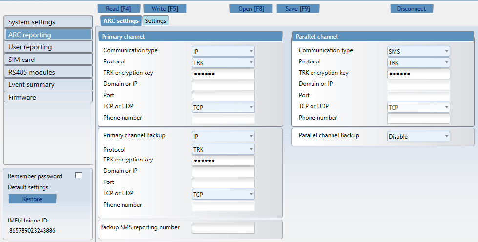

!!! note
    If more inputs or outputs need to be connected to the communicator, or
    if you want to connect a temperature sensor, connect the TRIKDIS
    iO series wired or wireless output expander.
### Schematics for wiring a relay 

With relay contacts you can control (turn on/off) various electronic appliances.

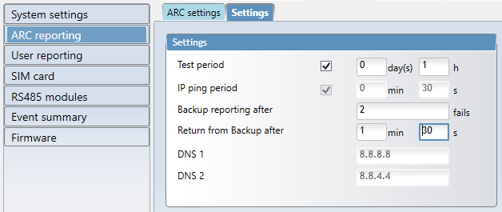

### Schematics for connecting iO series expansion modules 

If more inputs or outputs need to be connected to the communicator, or if you want to connect a temperature sensor, connect the TRIKDIS iO series wired or wireless output expander.

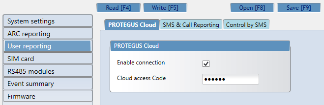

### Schematic for connecting the *W485* WiFi module 

The *W485* module sends messages to the CMS (Central Monitoring Station) and to Protegus using a WiFi internet router. When WiFi connectivity is available, the *G16T* sends event messages via the *W485* module. When WiFi connectivity is disrupted, the *G16T* sends messages via GPRS. When WiFi connectivity is re-established, the *G16T* returns to sending messages via *W485*. / Configuration of the *W485* WiFi module to work with the *G16T* is described in chapter 6.6. „„RS485 modules” window”. / Insert SIM card into the communicator *G16T* for *W485* to work.

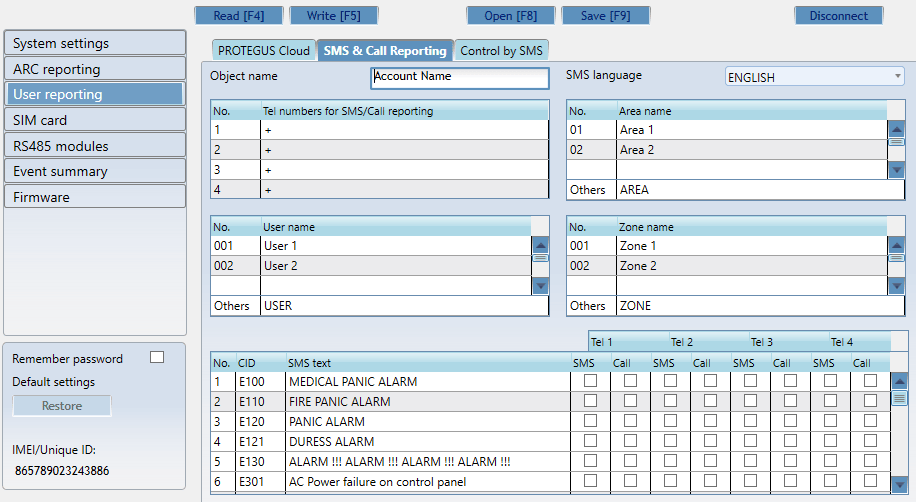

### Schematic for connecting the E485 „Ethernet“ module 

The *E485* module sends messages to the CMS (Central Monitoring Station) and to Protegus using a wired internet connection. Using the *E485* with *G16T*, CSP and *Protegus* messages are sent over wired Internet and mobile Internet is not used. If a wired internet connectivity is disrupted, the *G16T* sends messages via the mobile Internet. When the wired Internet connectivity is re-established, *G16T* starts sending messages via *E485*. / Configuration of the *E485* WiFi module to work with the *G16T* is described in chapter 6.6. „„RS485 modules” window”. / Insert SIM card into the communicator *G16T* for *E485* to work.

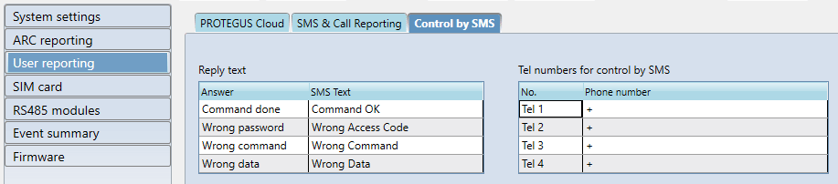

### Turn on the communicator 

To start the communicator, turn on the security control panel’s power supply. This LED indication on the G16T communicator must show:

- “POWER” LED illuminates green when the power is on;

- “NETWORK” LED illuminates green and blinks yellow when the communicator is registered to the network.

!!! note
    Sufficient strength of 2G cellular signal is level five (five "NETWORK"
    indicator flashes in yellow color). Sufficient strength of 3G/4G signal
    is level three (three "NETWORK" indicator flashes in yellow color). / If
    you count less yellow "NETWORK" LED flashes, the network signal strength
    is insufficient. We recommend to select a different place to install the
    communicator, or to use a more sensitive cellular antenna. / If you see
    a different LED indication, it indicates a certain malfunction. Diagnose
    it following the LED indication table in chapter **1.5 „LED indication
    of operation".** / If the G16T indication does not illuminate at
    all, check the power supply and connections.
## Programming the control panel 

For the control panel to send events via the landline dialer, it must be turned on and properly set up. Following the panel’s programming manual, configure the control panel’s landline dialer:

1.  Turn on the panel’s PSTN landline dialer.

2.  Enter the monitoring station receiver’s telephone number (you can use any number longer than 2 digits. The G16T will pick up and answer when the panel calls to any phone number).

3.  Choose DTMF mode.

4.  Select Contact ID communication protocol.

5.  Enter the panel’s 4 digit account number.

The control panel zone to which the G16T output OUT is connected should be set to keyswitch zone for arming/disarming the control panel remotely.

!!! note
    Keyswitch zone can be momentary (pulse) or level. By default, the
    G16T controllable output OUT is set to 3 second pulse mode. You
    can change the impulse duration or change to level mode in
    Protegus settings. See chapter **5.2 Additional settings to
    arm/disarm the alarm system using control panel's keyswitch zone**.
### Programming Honeywell Vista landline dialer 

Using the control panel’s keypad enter these sections and set them as described:

- \*41 – enter monitoring station receiver telephone number;

- \*43 – enter control panel’s account number;

- \*47 – set the Tone dial to [1] and enter the number of dial attempts;

- \*48 – use default setting, \*48 must be set to 7;

- \*49 – Split/Dual message. \*49 must be set to 5;

- \*50 – delay for sending burglary alarm events (optional). Default value is [2,0]. With it the event message transmission will be delayed for 30 seconds. If you want the message to be sent immediately, set [0,0].

### Special settings for Honeywell Vista 48 panel 

If you want to use G16T communicator with Honeywell Vista 48 panel, set the following sections as described:

| Section | Data                             | Section | Data | Section | Data |
|:-------:|----------------------------------|:-------:|:----:|:-------:|:----:|
|  \*41   | 1111 (receiver telephone number) |  \*60   |  1   |  \*69   |  1   |
|  \*42   | 1111                             |  \*61   |  1   |  \*70   |  1   |
|  \*43   | 1234 (panel account number)      |  \*62   |  1   |  \*71   |  1   |
|  \*44   | 1234                             |  \*63   |  1   |  \*72   |  1   |
|  \*45   | 1111                             |  \*64   |  1   |  \*73   |  1   |
|  \*47   | 1                                |  \*65   |  1   |  \*74   |  1   |
|  \*48   | 7                                |  \*66   |  1   |  \*75   |  1   |
|  \*50   | 1                                |  \*67   |  1   |  \*76   |  1   |
|  \*59   | 0                                |  \*68   |  1   |         |      |

When all required settings are set, it is necessary to exit programming mode. Enter \*99 in keypad.

## Remote control 

### Adding the security system to Protegus app 

With Protegus users will be able to control their alarm system remotely. They will see the status of the system and receive notifications about system events.

1.  Download and launch the Protegus application or use the browser version: [www.protegus.app](https://www.protegus.app)<u>.</u>

    

      
      
      
    

2.  Log in with your user name and password or register and create a new account.

!!! note
    When adding the G16T to Protegus check if:
    
    1.  The inserted SIM card is activated and the PIN code is either
        entered or disabled;
    
    2.  Protegus cloud is enabled. See chapter **6.4 "User
        reporting" window**;
    
    3.  Power supply is connected ("POWER" LED illuminates green);
    
    4.  Registered to the network ("NETWORK" LED illuminates green and
        flashes yellow).
3. Click **Add new system** and enter the G16T’s “*IMEI/Unique ID*” number. This number can be found on the device and the packaging sticker. After entering press **Next**.

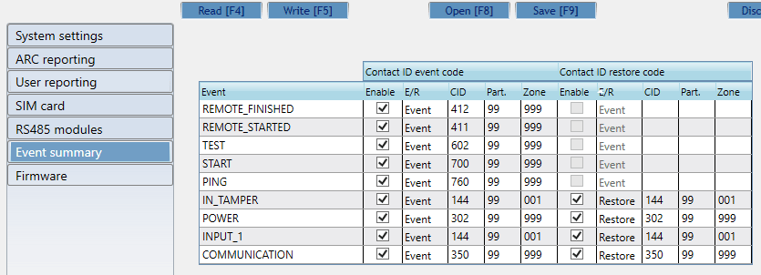

4. In the new window, click **Areas** in the side menu. In the next window specify how many alarm system areas are in the system and press **Next**.

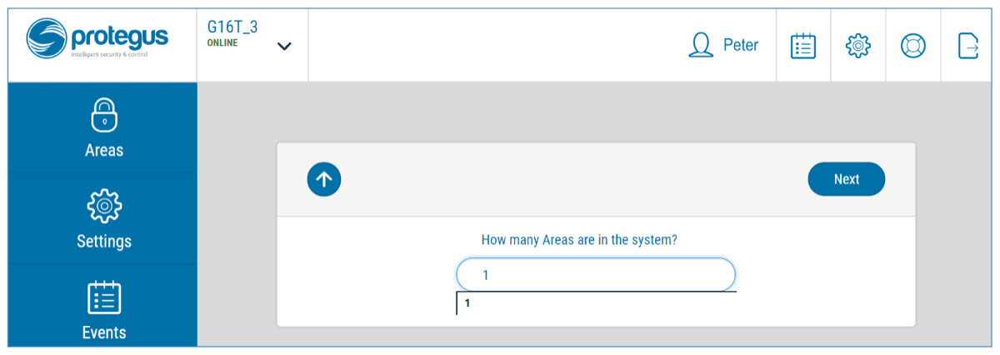

5. In the new window, identify what is the number for each of the specified areas in the security system and press **Save**.

### Additional settings to arm/disarm the alarm system using control panel’s keyswitch zone 

!!! warning "Important"
    The control panel zone to which the G16T output OUT is connected
    to has to be set to keyswitch mode.
Follow the instructions below if the security control panel will be controlled with the G16T output OUT, turning on/off the control panel keyswitch zone.

1.  In the side menu press **Settings** and in the newly opened window press **Settings**. Select the box **Arm/Disarm** **with** **PGM** and specify which area the output will control. One output OUT can control only one area.

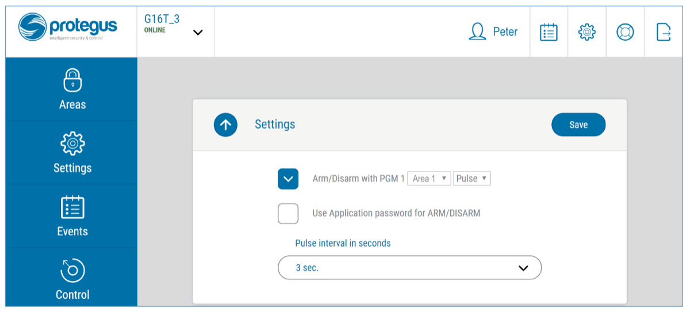

2. Select **Level** or **Pulse**, depending on the type of control panel keyswitch zone. You can also change the duration of the pulse interval if it is required for the connected control panel.

2.  For additional security, you can select **Use Application password for ARM/DISARM**. Then after pressing the button to arm/disarm the alarm system, a window for entering the app password will open.

### Arming/disarming the alarm system with Protegus 

1.  To arm/disarm the alarm system, open the Protegus window **Areas**.

2.  In the **Areas** window press the Area button. In the opened window select the action (to arm or to disarm the alarm system).

3.  If asked, enter the user code or Protegus password.

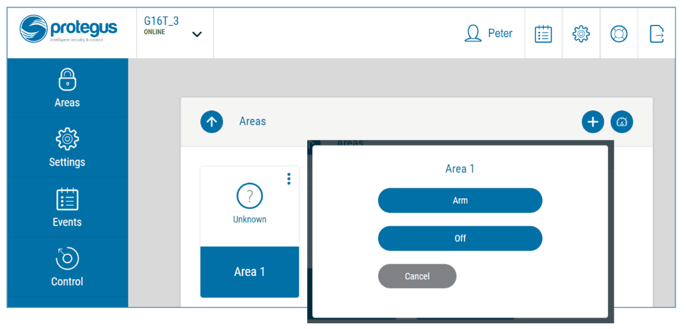

### Configuration and control with SMS messages 

You can remotely configure and control the communicator with SMS messages.

Message structure is: Password `[space]` Command `[space]` Data

For password use the **Administrator code** for *INFO, RESET, OUTPUT1, CONNECT* commands, and **Installer code** for *INFO, RESET, OUTPUT1* commands.

#### SMS command list

| Command | Data | Description |
|---------|------|-------------|
| INFO |  | Request information about the device. Response will be: communicator type, IMEI number, serial number and firmware version. E.g.: 123456 INFO |
| RESET |  | Restart the device. E.g.: 123456 RESET |
| OUTPUT1 | ON | Turn on the OUTPUT1. E.g.: 123456 OUTPUT1 ON |
| OUTPUT1 | OFF | Turn off the OUTPUT1. E.g.: 123456 OUTPUT1 OFF |
| OUTPUT1 | PULSE=tttt | Turn on the output in impulse mode, for the specified time interval (sec). / “tttt” is the time duration of impulse in seconds, described in four digits. / E.g.: 123456 OUTPUT2 PULSE=0002 |
| CONNECT | Protegus=ON | Enable access to Protegus service. E.g.: 123456 CONNECT PROTEGUS=ON |
| CONNECT | Protegus=OFF | Disable access to Protegus service E.g.: 123456 CONNECT PROTEGUS=OFF |
| CONNECT | IP=0.0.0.0:8000 | Set primary channel IP address and Port number. / E.g.: 123456 CONNECT IP=192.120.120.255:8000 |
| CONNECT | ENC=123456 | Set TRK encryption key. E.g.: 123456 CONNECT ENC=123456 |
| CONNECT | APN=Internet | Set APN name. E.g.: 123456 CONNECT APN=INTERNET |
| CONNECT | USER=user | Set APN user. E.g.: 123456 CONNECT USER=User |
| CONNECT | PASS=password | Set APN password. E.g.: 123456 CONNECT PASS=Password |
| CONNECT | CP= | Disable the landline interface (1 - Disabled; 2 - Enabled). / E.g.: 123456 CONNECT CP=2 |

You can restrict the phone numbers from which the communicator will accept the commands. See chapter **6.4 “User reporting” window**, **“Control by SMS” tab**.

## TrikdisConfig window description 

### *TrikdisConfig* status bar description 

After connecting the G16T and clicking **Read [F4], *TrikdisConfig*** will provide information about the connected device in the status bar:

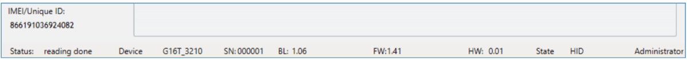

| Object         | Description                                        |
|----------------|----------------------------------------------------|
| IMEI/​Unique ID | Device IMEI number                                 |
| Status         | Operating condition                                |
| Device         | Device type (G16T should be shown)           |
| SN             | Device serial number                               |
| BL             | Browser version                                    |
| FW             | Device firmware version                            |
| HW             | Device hardware version                            |
| Status         | Connection to program type (via USB or remote)     |
| Administrator  | Access level (shown after access code is approved) |

After pressing **Read [F4]**, the program will read and show the settings which are set in the ***G16T*.** Set the necessary settings according to the TrikdisConfig window descriptions given below.

###  “System settings” window 

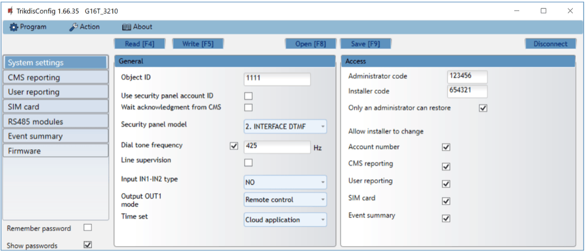

**“General” settings group**

- **Object ID** – if the events will be sent to the CMS (Central Monitoring Station), enter the account number provided by the CMS (4 characters hexadecimal number, 0-9, A-F. **Do not use FFFE, FFFF Object ID**).

- **Use security panel account ID** – if the checkbox is selected, the communicator will send events with the account ID entered in the panel instead of the value set in the **Object ID** field.

- **Wait acknowledgment from CMS** – if the checkbox is selected, after sending each event the communicator will wait for acknowledgment from the IP receiver indicating that it has successfully received the event message. If the communicator will not receive the acknowledgement signal, it will not form the end-of-communication (kiss-off) signal. After not receiving the kiss-off, the control panel landline dialer will repeatedly transmit the event message.

- **Security panel model** – enable/disable DTMF landline interface on the communicator.

- **Dial tone frequency** – frequency in which the G16T communicates with the control panel landline dialer.

- **Line supervision** – if this checkbox is selected, landline connection between the communicator and control panel will be monitored. For the supervision to work, the control panel’s landline dialer needs to be connected with the G16T with 4 wires (see chapter **3.2 Schematics for wiring the communicator to the security control panel**).

- **Input IN1-IN2 type** – select the input type from the list (NO, NC, NO/EOL, NC/EOL, NO/DEOL, NC/DEOL).

- **Output OUT1 mode** – select the output operation mode from the list.

- **Time set** – select which server to use for time synchronization.

**“Access” settings group**

- **Administrator code** – allows you to access all configuration fields (default code - 123456).

- **Installer code** – allows to change only those fields that are allowed by the administrator (default code - 654321).

- **Only an administrator can restore** – if this box is selected, factory settings can be restored only by entering the administrator code.

- **Allow installer to change** – the administrator can specify which settings the installer can change.

###  “CMS reporting” window 

**“CMS settings” tab**

The communicator sends events to the monitoring station via cellular internet (IP) or with SMS messages.

Events can be sent through several communication channels. The primary and parallel communication channels can operate simultaneously, this way the communicator can send events to two receivers at the same time. Backup channels can be assigned for both primary and parallel channels, which will be used when the connection via the primary or parallel channel is interrupted.

Communication is encoded and password protected. A TRIKDIS receiver is required for receiving and sending event information to the monitoring software:

- For connection over IP – software receiver IPcom Windows/Linux, hardware IP/SMS receiver RL14 or multichannel receiver RM14.

- To receive SMS messages – hardware IP/SMS receiver RL14, multichannel receiver RM14 or SMS receiver GM14.

SMS communication is particularly useful as a backup channel, because it works even when there is no mobile internet connection. We do not recommend SMS as a primary channel.

**“Primary channel” settings group**

- **Communication type** – select which connection method to monitoring station receiver will be used (IP or SMS).

- **Protocol** – select in which coding the events should be sent: **TRK** (to TRIKDIS receivers), **SIA DC-09** (to receivers, which receive events encoded in SIA DC-09 format) , **TL150** (to SUR-GARD receivers).
- **TRK encryption key** – 6-digit message encryption key. The key written to the communicator must match the receiver’s key.
- **Domain or IP** – enter the domain or IP address of the receiver.

- **Port** – enter the network port number of the receiver.
- **TCP or UDP** – select in which protocol (TCP or UDP) the events should be sent.
- **Phone number** (only for SMS messages) – enter the telephone number of a TRIKDIS SMS receiver. The telephone number must begin with the country code (e.g., 370xxxxxxxx).

**“Primary channel Backup” settings group**

Enable the backup channel mode to send events via backup channel if connection via primary channel is lost. Backup channel settings are same as described above.

**“Parallel channel” settings group**

Through this channel events are transmitted in parallel with the primary channel. When the second channel is enabled, events can be sent simultaneously to two receivers (e.g., local and centralized monitoring stations). Parallel channel settings are the same as described above.

**Backup SMS reporting number**

Backup SMS messages are sent when events cannot be transmitted via the primary, parallel and backup channels. It is especially useful because it works even when there is no IP connection in the mobile operator network.

This channel is operational only when IP mode is set in primary channel and its backup channel.

SMS notifications will be sent to the Central Monitoring Station SMS receiver: 1) immediately after the first time when communicator starts operating; and 2) if the TCP / IP or UDP / IP connection is interrupted in the first channel and its backup channel.

- **Backup SMS reporting number** - enter the phone number for TRIKDIS SMS receiver. Phone number must begin with the country code (e.g., 370xxxxxxxx).

**“Settings” tab**

**“Settings” settings group**

- **Test period** - TEST event period for testing the connection. Test events are sent as Contact ID messages and forwarded to the monitoring software.

- **IP ping period** – period for sending internal PING heartbeats. These messages are only sent via IP channel. The receiver will not forward PING messages to the monitoring software to avoid overloading it. Notifications will only be sent to the monitoring software if the receiver fails to receive PING messages from the device within the set time.

By default, the receiver will send a “*Connection lost”* notification to the monitoring software if the PING message is not received over a time period three times longer than set in the communicator. E.g. if the PING period is set for 3 minutes, the receiver will send the *“Connection lost”* notification if PING message is not received within 9 minutes.

PING heartbeats keep the active communication session between the device and the receiver. An active session is required to be able to remotely configure and control the communicator. We recommend setting the PING period for no more than 5 minutes.

- **Backup reporting after** - indicates the number of unsuccessful attempts to send the message via Primary channel. If device fails to transmit specified number of times, it will connect to transmit the messages via Backup channel.

- **Return from backup after** - time after which G16T will attempt to reconnect and transmit messages via Primary channel.

- **DNS1, DNS2** - (Domain Name System) server that specifies the IP address of the domain. Used when domain is set in the communication channel **Domain or IP** field (not IP address). Google DNS server is set by default.

**“DC-09 settings” settings group**

The settings are displayed when the **DC-09_2007** or **DC-09_2012** protocol is set in the communication channel **Protocol** field for sending events.

- **DC-09** **obj. No.** - enter the object number. <u>The object number entered in this field will be used if DC-09 encoding is selected</u>. Hexadecimal number from 3 to 16 characters can be entered. This number is provided by the Central Monitoring Station.

- **DC-09-line No**. - enter line number of the receiver.

- **DC-09 receiver No.** - enter the receiver number.

###  “User reporting” window 

**“PROTEGUS Cloud” tab**

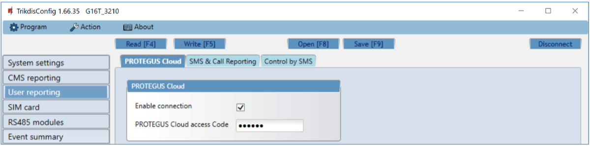

Protegus service allows users to remotely monitor and control the communicator. For more information about Protegus service, visit [www.protegus.app](https://www.protegus.app).

**“Protegus Cloud” settings group**

- **Enable connection** - enable Protegus service, G16T will be able to exchange data with Protegus app and to be remotely configured via ***TrikdisConfig*.**

- **Protegus Cloud access Code -** 6-digit code for connecting to the Protegus app (default - 123456).

**“SMS & Call Reporting” tab**

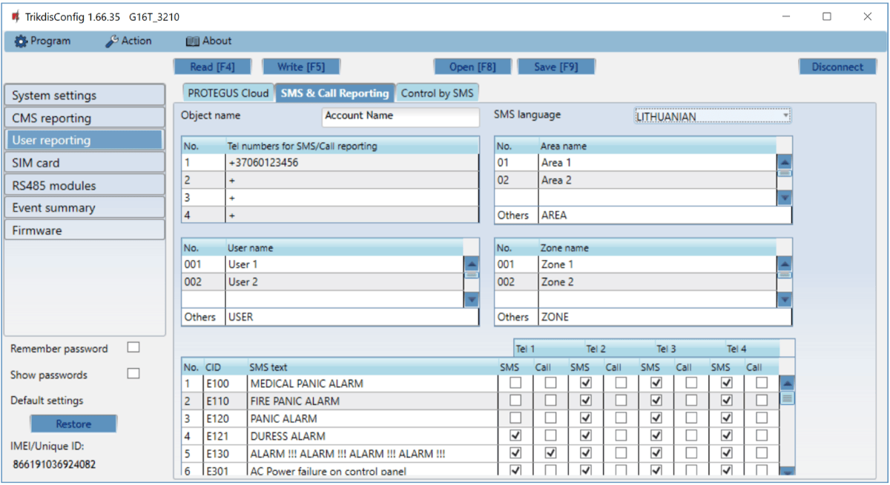

Notifications about system events can be transmitted to users’ mobile phones via SMS messages or phone calls.

- **Object name** – name the system to which the communicator is connected. Every SMS notification will include the name of the object.

- **SMS language** – choose the language for SMS messages (SMS messages can be sent with language-specific characters).

- **Tel numbers for SMS/Call reporting table** – enter up to 4 user phone numbers that will receive event SMS messages or calls. Phone numbers must begin with the country code, for example +370xxxxxxxx, 00370xxxxxxxx or 370xxxxxxxx.

- **Area name, User name, Zone name tables** – each area, user and zone may have a name that will be used in SMS event messages. Enter the area, user or zone number in the appropriate table and enter the name next to the number.

- **CID event table** – you can change which phone numbers receive SMS messages or phone calls notifying about the events on the list.

You can change the texts for SMS messages of default events, change the contact ID (CID) codes and enter new events with descriptions.

**“Control by SMS” tab**

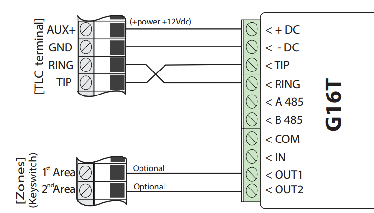

You can send SMS commands to the communicator that will control the output or change settings. Find the control commands in chapter **5.4 Configuration and control with SMS messages**.

- **Reply text** – SMS text that the user receives after sending an SMS command. SMS text can be edited.

- **Tel numbers for remote control by SMS –** you can enter phone numbers from which the communicator will accept commands.

!!! note
    If no phone number is entered, the device will accept commands from any
    phone number. In any case, security is guaranteed by the requirement to
    enter administrator or installer password in the SMS command.
### “SIM card” window 

!!! warning "Important"
    1\. Ensure that the SIM card is activated and working before using
    it. / 2. If mobile internet connection will be used for sending events
    via IP channel to the monitoring station receiver or to Protegus,
    ensure that mobile data service is enabled.
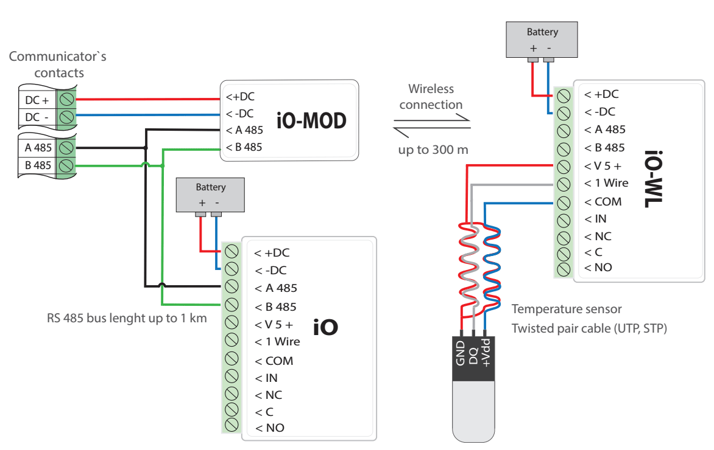

**“SIM card” settings group**

- **SIM card PIN** - enter the SIM card PIN code. This code can be disabled by inserting the SIM card into a mobile phone and disabling the request. If you disabled the SIM card PIN request, leave the default value in this field.

- **APN** - enter APN (Access Point Name). It is required for connecting the communicator to the internet. APN can be found on the website of SIM card operator (“internet” is universal and works in the networks of many operators).

- **Login, Password** - if required, enter the user name (login) and password for connection to the internet.

- **Forbid connection when roaming detected** - you can use this function when the security system is installed near the country border. This function prevents the communicator from operating in the other country’s mobile network.

### “RS485 modules” window 

**“Modules list” tab**

**iO** series expanders can be connected to the communicator to add additional inputs, outputs and serial buses for temperature sensors. Connected expanders must be added to the **Modules list** table.

- **Module type** – select the module that is connected to the communicator via RS485 from the list.

- **Serial No –** enter the module serial number (6 digits), which is indicated on stickers on the module’s case and packaging.

After selecting the connected module and entering its serial number, press the **Write [F5]** button. When the change is written, disconnect the USB Mini-B cable from the communicator. Wait one minute (the communicator has to register the connected module). Connect the USB Mini-B cable to the communicator. Click the **Read [F4]** button. Go to **RS485 modules** → **Module.**

**“Module” tabs**

After adding the expander to the communicator as described above, in the **RS485 modules** window a new tab will appear with this module’s settings. The tab will be given a number. Below we describe the settings for **iO-8** and **iO** series expanders, for the WiFi module W485, for „Ethernet” module E485.

**iO-8 expander settings window**

Expander iO-8 has 8 universal (input/output) terminal contacts. Up to four iO-8 expanders can be connected.

- **Input Count** – select what number of terminal contacts should be set to input (IN) mode. The rest of the terminal contacts will become outputs (OUT).

Outputs are configured directly in Protegus app.

In the table inputs can be assigned Contact ID event and restore codes. After an input is triggered, the communicator will send an event with the set event code to the monitoring station receiver and to Protegus app.

**Contact ID event code:**

- **Enable** – allow message transmission, when the input is triggered.

- **E/R** – choose what type of event will be sent when input is triggered – **Event** or **Restore**.

- **CID** – assign a Contact ID event code to the input.

- **Part.** – assign a partition (area) to the input. It is set automatically: if the module no. is 1, then the area is 91; if the module no. is 4, then the area is 94.

- **Zone** – set the zone number for the input.

****Contact ID restore code**:**

- **Enable** – allow message transmission when the input is restored.

- **E/R** – choose what type of event will be sent when input is restored – **Restore** or **Event**.

- **CID** – assign a Contact ID restore code to the input.

- **Part.** – assign a partition (area) to the input. It is set automatically: if the module no. is 1, then the area is 91; if the module no. is 4, then the area is 94.

- **Zone** – set the zone number for the input.

- **Object ID** - the input (IN) can be assigned an Object ID, which will differ from the Object ID of the communicator G16T.

- **Input type** – select the type of the input (NO or NC).

For customers to receive SMS messages or calls about input triggers, enter the Contact ID event code that is assigned to input to the table in **“SMS & Call Reporting”** tab.

**iO expander settings window**

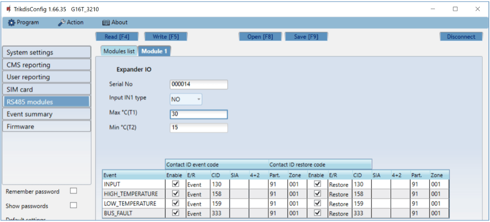

Expander iO has: terminals for 1 input, 1 output (relay contacts) and 1-Wire serial bus for connecting temperature sensors.

Relay output can be controlled according to logical (IF, THEN) conditions.

- **Input IN1 type** – set the input type (NO or NC).

- **Max ◦C(T1)** – when the temperature is higher than this setting, an event message will be generated. For an event message to be generated, it must be enabled in the table.

- **Min ◦C(T2)** – when the temperature is lower than this setting, an event message will be generated. For an event message to be generated, it must be enabled in the table.

In the table inputs can be assigned Contact ID event and restore codes. After an input is triggered, the communicator will send an event with the set event code to the monitoring station receiver and to Protegus app. Set as described in the previous page about **iO-8 expander settings window**.

**WiFi module W485 settings window**

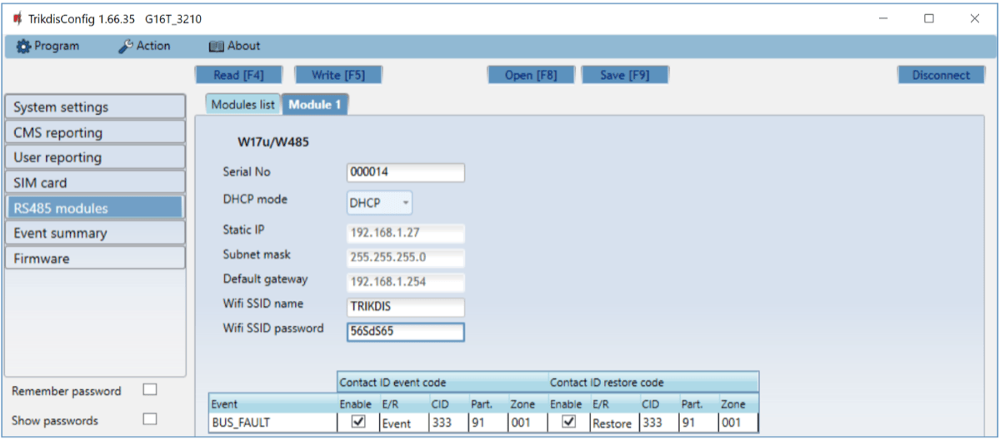

- **DHCP mode** – WiFi module’s mode for registering to network (manual or automatic).

- **Static IP** – static IP address for when manual registering mode is set.

- **Subnet mask** – subnet mask for when manual registering mode is set.

- **Default gateway** – gateway address for when manual registering mode is set.

- **Wifi SSID name** – name of the WiFi network to which the W485 will connect.

- **Wifi SSID password** - WiFi network password.

In the table, you can assign Contact ID event and restore codes to the RS485 data bus fault event. When connection between the W485 and G16T is disrupted or re-established, the G16T will send a message with the assigned CID code to the CMS and Protegus app.

!!! note
    You must configure the G16T to send messages to CMS and
    Protegus, see chapters 2.2 "Settings for connection with Central
    Monitoring Station" and 2.1 "Settings for connection with Protegus
    app". / **Insert SIM card into the communicator *G16T* for *W485* to
    work.**
**“Ethernet” module E485 settings window**

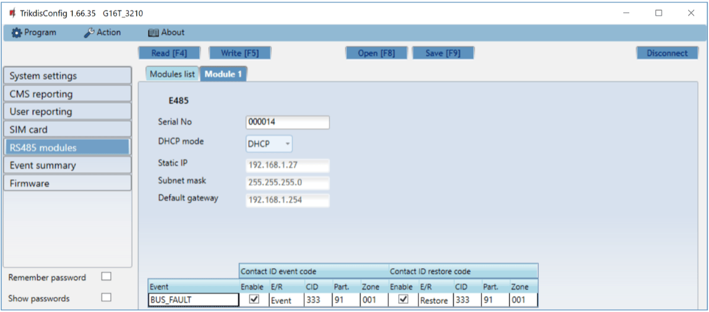

- **DHCP mode** – ethernet module’s mode for registering to network (manual or automatic).

- **Static IP** – static IP address for when manual registering mode is set.

- **Subnet mask** – subnet mask for when manual registering mode is set.

- **Default gateway** – gateway address for when manual registering mode is set.

In the table, you can assign Contact ID event and restore codes to the RS485 data bus fault event. When connection between the E485 and G16T is disrupted or re-established, the G16T will send a message with the assigned CID code to the CMS and Protegus app.

!!! note
    You must configure the G16T to send messages to CMS and
    Protegus, see chapters 2.2 "Settings for connection with Central
    Monitoring Station" and 2.1 "Settings for connection with Protegus
    app". / **Insert SIM card into the communicator *G16T* for *W485* to
    work.**
### “Event summary” window 

In this window, you can turn on, turn off or change the internal event messages sent by the device. After turning off an internal event in this window, it will not be sent irrespective of other settings.

- **COMMUNICATION** – message about connection error between the control panel and G16T, when line supervision is turned on.

- **IN_ALARM** – message about input (IN) circuit trigger.

- **IN_TAMPER** – message about input (IN) circuit tamper trigger.

- **PING** – PING heartbeat signal.

- **POWER** – message about low power supply voltage.

- **REMOTE_STARTED** – message about remote connection to configure G16T with TrikdisConfig.

- **REMOTE_FINISHED** – message about disconnection from remote configuration with TrikdisConfig.

- **START** – message about G16T connecting to the network.

- **TEST** – periodic test message.

!!! note
    To enable periodic TEST messages and set their period, go to **CMS
    reporting -> Settings -> Test period**.
- **Enable** – when selected, the sending of messages is enabled.

You can change the Contact ID code for each event, and also the zone and partition number.

### Restoring factory settings 

To restore the communicator's factory settings, you need to click the **Restore** button in the TrikdisConfig window.

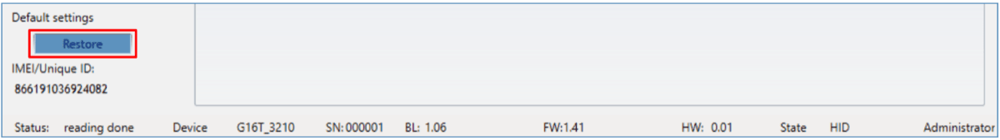

## Remote configuration 

1.  Start the configuration program TrikdisConfig.

!!! note
    Remote configuration will work only if:
    
    1.  The inserted SIM card is activated and the PIN code is either
        entered or disabled;
    
    2.  Protegus cloud is enabled. How to enable cloud is
        described in chapter **6.4 "User reporting" window**;
    
    3.  Power supply is connected ("POWER" LED illuminates green);
    
    4.  Registered to the network ("NETWORK" LED illuminates green and
        flashes yellow).
2. In the **Remote access** field, enter the communicator’s **IMEI/Unique ID** number. This number can be found on the device and the packaging sticker.

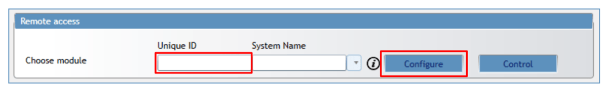

3. (Optional) In the **System name** field, enter the desired name for the G16T with this Unique ID.

2.  Press **Configure**.

3.  In the newly opened window click **Read [F4]**. If required, enter the administrator or installer code*.*

4.  Set the necessary settings and when finished, click **Write [F5].**

## Test communicator performance 

When configuration and installation is complete, perform a system check:

1.  Generate an event:

- by arming/disarming the system with the control panel keypad;

- triggering a zone alarm when the security system is armed.

1.  Make sure that the event arrives to the Central Monitoring Station and/or is received in the Protegus application.

2.  To test communicator inputs, trigger them and make sure you receive the correct event.

3.  To test the communicator outputs, activate them remotely and check their operation.

4.  If the security control panel will be controlled remotely, arm/disarm the security system remotely by using the Protegus app.

## Manual firmware update 

!!! note
    When the communicator is connected to TrikdisConfig, the program
    will automatically offer to update the device's firmware if updates are
    present. Updates require an internet connection. Antivirus software,
    firewall or strict access to internet settings can block the automatic
    firmware updates.
G16T firmware can also be updated or changed manually. After an update, all previously set settings will remain unchanged. When writing firmware manually, it can be changed to a newer or older version. To update:

1.  Run ***TrikdisConfig**.*

2.  Connect the G16T via USB Mini-B cable to the computer or connect to the G16T communicator remotely.

- If a newer firmware version exists, the software will offer to download the newer firmware version file.

1.  Select the menu branch **Firmware**.

2.  Press **Open firmware** and select the required firmware file. If you do not have the file, the newest firmware file can be downloaded by <u>registered users</u> from [www.trikdis.com](http://www.trikdis.com) , under the download section of the G16T communicator.

3.  Press **Update [F12].**

    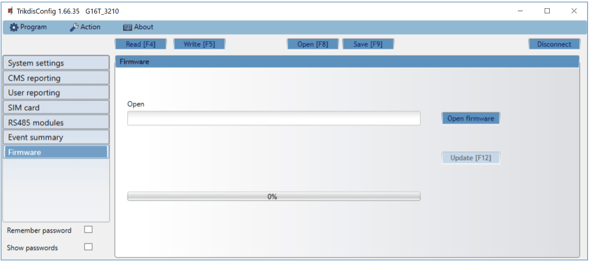

4.  Wait for the update to complete.

5.  Click **OK** in the prompted window.

## Safety requirements

The communicator should be installed and maintained by qualified personnel.

Prior to installation, please read this manual carefully in order to avoid mistakes that can lead to malfunction or even damage to the equipment.

Disconnect the power supply before making any electrical connections.

Changes, modifications or repairs not authorized by the manufacturer shall void your rights under the warranty.

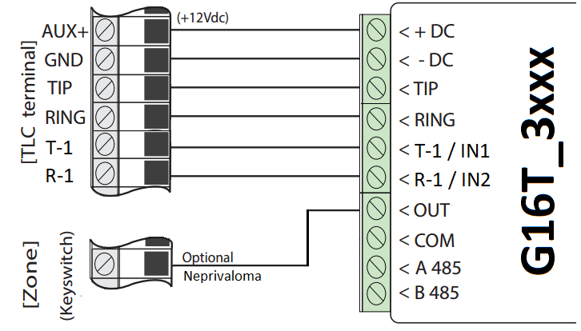Please act according to your local rules and do not dispose of your unusable alarm system or its components with other household waste.

## Annex 

The communicator can work with a SUR-GARD receiver. The communicator converts Contact ID codes received from the alarm control panel into SIA codes.

**Contact ID to SIA code conversion table**

| **System Event** | **CID Report Code** | **SIA Report Code** |
|----|:--:|:--:|
| Medical alarm | E100 | "MA" |
| Personal emergency | E101 | "QA" |
| Fire in zone: <z> | E110 | "FA" |
| Water flow detected in zone: <z> | E113 | "SA" |
| Pull station alarm in zone: <z> | E115 | "FA" |
| Panic in zone: <z> | E120 | "PA" |
| Panic alarm by user: <v> | E121 | "HA" |
| Panic alarm in zone: <z> | E122 | "PA" |
| Panic alarm in zone: <z> | E123 | "PA" |
| Panic alarm in zone: <z> | E124 | "HA" |
| Panic alarm in zone: <z> | E125 | "HA" |
| Alarm active in zone: <z> | E130 | "BA" |
| Alarm active in zone: <z> | E131 | "BA" |
| Alarm active in zone: <z> | E132 | "BA" |
| Alarm active in zone: <z> | E133 | "BA" |
| Alarm active in zone: <z> | E134 | "BA" |
| Alarm active in zone: <z> | E135 | "BA" |
| Tamper active in zone: <z> | E137 | "TA" |
| Intrusion verified in zone: <z> | E139 | "BV" |
| Alarm active in zone: <z> | E140 | "UA" |
| System failure (143) | E143 | "ET" |
| Tamper active in zone: <z> | E144 | "TA" |
| Tamper active in zone: <z> | E145 | "TA" |
| Alarm active in zone: <z> | E146 | "BA" |
| Alarm active in zone: <z> | E150 | "UA" |
| Gas detected in zone: <z> | E151 | "GA" |
| Water leakage detected in zone: <z> | E154 | "WA" |
| Foil break detected in zone: <z> | E155 | "BA" |
| High temperature at sensor: <n> | E158 | "KA" |
| Low temperature at sensor: <n> | E159 | "ZA" |
| CO detected in zone: <z> | E162 | "GA" |
| Fire failure in zone: <z> | E200 | "FS" |
| Monitored alarm | E220 | "BA" |
| System failure (300) | E300 | "YP" |
| AC power supply loss | E301 | "AT" |
| Low battery | E302 | "YT" |
| System failure (304) | E304 | "YF" |
| System reset in zone: <z> | E305 | "RR" |
| Panel programming changed | E306 | "YG" |
| System shutdown | E308 | "RR" |
| Battery failure (309) | E309 | "YT" |
| Ground fault | E310 | "US" |
| Battery failure (311) | E311 | "YM" |
| Power supply overcurrent (312) | E312 | "YP" |
| Engineer reset by user: <v> (313) | E313 | "RR" |
| Sounder/Relay failure | E320 | "RC" |
| System failure (321) | E321 | "YA" |
| System failure (330) | E330 | "ET" |
| System failure (332) | E332 | "ET" |
| System failure (333) | E333 | "ET" |
| System failure (336) | E336 | "VT" |
| System failure (338) | E338 | "ET" |
| System failure (341) | E341 | "ET" |
| System failure (342) | E342 | "ET" |
| System failure (343) | E343 | "ET" |
| System failure (344) | E344 | "XQ" |
| System communication failure (350) | E350 | "YC" |
| System communication failure (351) | E351 | "LT" |
| System communication failure (352) | E352 | "LT" |
| System failure (353) | E353 | "YC" |
| System communication failure (354) | E354 | "YC" |
| System failure (355) | E355 | "UT" |
| Fire trouble in zone: <z> | E373 | "FT" |
| Trouble in zone: <z> | E374 | "EE" |
| Trouble in zone: <z> | E378 | "BG" |
| Trouble in zone: <z> | E380 | "UT" |
| Wireless zone fault: <z> | E381 | "US" |
| Wireless module failure (382) | E382 | "UY" |
| Tamper active in zone: <z> | E383 | "TA" |
| Low battery in wireless zone: <z> | E384 | "XT" |
| Trouble in zone: <z> (389) | E389 | "ET" |
| Trouble in zone: <z> (391) | E391 | "NA" |
| Trouble in zone: <z> (393) | E393 | "NC" |
| User <v> disarmed the system | E400 | "OP" |
| User <v> disarmed the system | E401 | "OP" |
| Automatic disarm | E403 | "OA" |
| Deferred disarm <v> user | E405 | "OR" |
| Alarm cancelled by user: <v> | E406 | "BC" |
| User <v> disarmed remotely | E407 | "OP" |
| Quick disarm | E408 | "OP" |
| Remote disarm | E409 | "OS" |
| Callback request made by CMS | E411 | "RB" |
| Successful data download | E412 | "RS" |
| Entry access denied for user <v> | E421 | "JA" |
| Entry by user <v> | E422 | "DG" |
| Forced Access <z> zone | E423 | "DF" |
| Exit access denied for user <v> | E424 | "DD" |
| Exit by user <v> | E425 | "DR" |
| User <v> disarmed too early | E451 | "OK" |
| User <v> armed too late | E452 | "OJ" |
| User <v> Failed to Disarm | E453 | "CT" |
| User <v> Failed to Arm | E454 | "CI" |
| Auto arm failed | E455 | "CI" |
| Partial arm by user: <v> | E456 | "CG" |
| Exit violation by user: <v> | E457 | "EE" |
| System disarmed after alarm by user: <v> | E458 | "OR" |
| Recent arm <v> user | E459 | "CR" |
| Wrong code entered | E461 | "JA" |
| Auto-arm time extended by user: <v> | E464 | "CE" |
| Device disabled (501) | E501 | "RL" |
| Device disabled (520) | E520 | "RO" |
| Wireless sensor disabled in zone:<z> (552) | E552 | "YS" |
| Zone <z> bypassed | E570 | "UB" |
| Zone <z> bypassed | E571 | "FB" |
| Zone <z> bypassed | E572 | "MB" |
| Zone <z> bypassed | E573 | "BB" |
| Group bypass by user: <v> | E574 | "CG" |
| Zone <z> bypassed | E576 | "UB" |
| Zone <z> bypass cancelled | E577 | "UB" |
| Vent zone bypass | E579 | "UB" |
| Walk test activated by user:<v> | E607 | "TS" |
| Manual test report | E601 | "RX" |
| Periodic test report | E602 | "RP" |
| System event (605) | E605 | "JL" |
| System event (606) | E606 | "LF" |
| Periodic test report with trouble | E608 | "RY" |
| System event (622) | E622 | "JL" |
| System event (623) | E623 | "JL" |
| Time/Date was reset by user <v> | E625 | "JT" |
| Inaccurate Time/Date | E626 | "JT" |
| System programming started | E627 | "LB" |
| System programming finished | E628 | "LS" |
| System event (631) | E631 | "JS" |
| System event (632) | E632 | "JS" |
| System not active (654) | E654 | "CD" |
| Medical alarm restored | R100 | "MH" |
| Personal emergency restored | R101 | "QH" |
| No more fire alarm in zone :<z> | R110 | "FH" |
| No more water flow alarm in zone:<z> | R113 | "SH" |
| Panic alarm restored in zone:<z> | R120 | "PH" |
| Panic alarm cancelled by user: <v> | R121 | "HH" |
| Panic alarm restored in zone:<z> | R122 | "PH" |
| Panic alarm restored in zone: <z> | R123 | "PH" |
| Panic alarm restored in zone: <z> | R124 | "HH" |
| Panic alarm restored in zone: <z> | R125 | "HH" |
| No more alarm in zone: <z> | R130 | "BH" |
| No more alarm in zone: <z> | R131 | "BH" |
| No more alarm in zone: <z> | R132 | "BH" |
| No more alarm in zone: <z> | R133 | "BH" |
| No more alarm in zone: <z> | R134 | "BH" |
| No more alarm in zone: <z> | R135 | "BH" |
| No more tamper in zone: <z> | R137 | "TA" |
| No more alarm in zone:<z> | R140 | "UH" |
| No more system failure (143) | R143 | "UR" |
| No more tamper in zone: <z> | R144 | "TR" |
| No more tamper in zone: <z> | R145 | "TR" |
| No more alarm in zone: <z> | R146 | "BH" |
| No more alarm in zone: <z> | R150 | "UH" |
| No more gas alarm in zone:<z> | R151 | "GH" |
| No more water leakage alarm in zone: <z> | R154 | "WH" |
| Foil break restored in zone: <z> | R155 | "BH" |
| Temperature has normalized at sensor: <n> | R158 | "KH" |
| Temperature has normalized at sensor: <n> | R159 | "ZH" |
| No more CO alarm in zone: <z> | R162 | "GH" |
| No more fire failure in zone: <z> | R200 | "FV" |
| Monitored restore alarm | R220 | "BH" |
| No more system failure (300) | R300 | "YA" |
| AC power supply OK | R301 | "AR" |
| Battery OK | R302 | "YR" |
| No more system failure (304) | R304 | "YG" |
| System reset restored in zone: <z> | R305 | "RR" |
| No more battery failure (309) | R309 | "YR" |
| Restore ground fault | R310 | "UR" |
| No more battery failure (311) | R311 | "YR" |
| Restore power supply overcurrent (312) | R312 | "YQ" |
| No more sounder/Relay failure | R320 | "RO" |
| No more system failure (321) | R321 | "YH" |
| No more system failure (330) | R330 | "ER" |
| No more system failure (332) | R332 | "ER" |
| No more system failure (333) | R333 | "ER" |
| No more system failure (336) | R336 | "VR" |
| No more system failure (338) | R338 | "ER" |
| No more system failure (341) | R341 | "ER" |
| No more system failure (342) | R342 | "ER" |
| No more system failure (344) | R344 | "XH" |
| No more system communication failure (350) | R350 | "YK" |
| No more system communication failure (351) | R351 | "LR" |
| No more system communication failure (352) | R352 | "LR" |
| No more system failure (353) | R353 | "YK" |
| No more system communication failure (354) | R354 | "YK" |
| No more system failure (355) | R355 | "UJ" |
| Fire trouble restored in zone: <z> | R373 | "FJ" |
| No more trouble in zone: <z> | R374 | "EA" |
| No more trouble in zone: <z> | R380 | "UJ" |
| No more wireless zone fault: <z> | R381 | "UR" |
| No more wireless module failure (382) | R382 | "BR" |
| No more tamper in zone: <z> | R383 | "TR" |
| Battery OK in wireless zone: <z> | R384 | "XR" |
| No more trouble in zone: <z> (391) | R391 | "NS" |
| No more trouble in zone: <z> (393) | R393 | "NS" |
| User <v> armed the system | R400 | "CL" |
| User <v> armed the system | R401 | "CL" |
| Automatic arm | R403 | "CA" |
| User <v> armed remotely | R407 | "CL" |
| Quick arm | R408 | "CL" |
| Remote arm | R409 | “CS” |
| User <v> armed to Stay mode | R441 | "CG" |
| User <v> armed too early | R451 | “CK” |
| User <v> disarmed too late | R452 | “CJ” |
| User <v> Failed to Disarm | R454 | “CI” |
| Partial Arm by user: <v> | R456 | "CG" |
| Recent disarm <v> user | R459 | “CR” |
| Device enabled (501) | R501 | "RG" |
| Device enabled (520) | R520 | "RC" |
| Wireless sensor enabled in zone: <z> (552) | R552 | "YK" |
| Zone <z> bypass cancelled | R570 | "UU" |
| Zone <z> bypass cancelled | R571 | "FU" |
| Zone <z> bypass cancelled | R572 | "MU" |
| Zone <z> bypass cancelled | R573 | "BU" |
| Group bypass by user: <v> cancelled | R574 | "CF" |
| Zone <z> bypass cancelled | R576 | "UU" |
| Zone <z> bypass cancelled | R577 | "UU" |
| Vent zone bypass cancelled | R579 | "UU" |
| Walk test deactivated by user <v> | R607 | "TE" |
| Time/Date was reset by user <v> | R625 | "JT" |
| System active (654) | R654 | "CD" |
