# GSM communicator for fire alarm control panel G17F

  

## Description 

Communicator G17F meets the requirements of standard EN 54-21:2006.

The product complies with the performance requirements of EN54-21 standard Annex A for type 1 transmission system type.

Communicator G17F Certificate No: 1922-CPR-1974. Fire detection and fire alarm systems. Alarm transmission and fault warning routing equipment.

The product is certified by notified product certification body: No.1922 "Dedal", Nesebar Mladost str. 50, Bulgaria, 8230

Trikdis technical support contacts: support@trikdis.lt, +37067422877

The G17F is used for transmitting fire alarm control panel messages via cellular network.

Principle of operation. When an input (zone) of the communicator is violated, the G17F will transmit an event message to the Central Monitoring Station’s receiver or to the Protegus2 app using mobile internet. It can also send SMS messages and make phone calls. The communicator is available with 2G or 4G modems.

### Features

**Messages to the security company**

- Sends event information to TRIKDIS software and hardware receivers, which work with any monitoring software.

- Can send events to SIA DC-09 receivers.

- If connection via the main channel is lost, the messages are automatically sent to a backup receiver.

- Can report events to the Central Monitoring Station using SMS messages. Extremely useful because it works even when IP connectivity is disrupted in the mobile operator’s network.

- Cellular network jamming recognition.

- Can simultaneously report events to the Central Monitoring Station and work with the *Protegus2* app. It is possible to set priority for sending events to the Central Monitoring Station.

- Event messages are sent in Contact ID codes.

**Messages to users**

- Calls selected phone numbers (up to 8 users).

- Sends SMS messages about events.

- “Push” and special sound event notifications using the Protegus2 application.

**Remote control of outputs**

- Via Protegus2 app.

- By calling the device‘s phone number.

- Via SMS messages.

**Settings and installation**

- Quick and easy installation.

- Device configuration either using an USB cable or remotely using TrikdisConfig software.

- Remote updating of firmware.

- Two access levels (types of accounts) for setting parameters: for the installer and for the administrator.

**Inputs and outputs**

- 3 inputs, selectable type: NO, NC, EOL (4,7 kΩ, 10kΩ).

- 3 double purpose I/O terminals that can be set as input (IN) or output (OUT) terminals. Selectable input types: NO, NC, EOL (4,7 kΩ, 10kΩ).

- RS485 bus for connecting iO series expander modules.

- Using iO series expanders, the number of inputs (IN) or outputs (OUT) can be increased to 12.

### Specifications 

| **Parameter** | **Description** |
|:---|----|
| GSM/​GPRS modem frequencies | 850 /​ 900 /​ 1800 /​ 1900 MHz |
| LTE modem frequencies | 700 /​ 800 /​ 900 /​ 1800 /​ 2100 /​ 2600 MHz |
| Power supply voltage | 9-32 V DC |
| Current consumption | 100 mA |
| Transmission protocol | TRK, SIA DC-09_2007, SIA DC-09_2012 |
| Encryption key | 6 symbol encryption key. |
| Connection to CMS | TCP/​IP or UDP/​IP, SMS |
| Event codes | Contact ID codes. |
| Memory | Up to 60 messages. |
| Inputs and outputs | 3 inputs, can be set as NO, NC, EOL (4,7 kΩ, 10kΩ) type. /​ 3 double purpose terminals (IN/​OUT), can be set as NO, NC, EOL (4,7 kΩ, 10kΩ) type inputs or open collector (OC) type outputs with current up to 100 mA. |
| Event memory | Up to 1000 events. |
| Configuration | Remotely using TrikdisConfig software or locally using USB Mini-B. Remotely using SMS messages. |
| RS485 bus length | Up to 100 m |
| Supported modules | iO – expander module;​ /​ iO-WL - iO-MO – iO-WL radio wave transceiver;​ /​ iO-8 - expander module;​ /​ E485 – „Ethernet“ module;​ /​ W485(W17u) – WiFi module;​ /​ iO-LORA – expander module;​ /​ iO8-LORA – expander module;​ /​ **PB-LORA** – panic button;​ /​ **REL-LORA** – expander module;​ /​ **INIM Smartline** - fire alarm control panel;​ /​ **NSC Solution** – fire alarm control panel;​ /​ **C-TEC Cast ZFP** – fire alarm control panel. /​ Fire alarm control panel with **ESPA 4.4.4** protocol. |
| Operating environment | Temperature from -10 °C to +50 °C, relative air humidity – up to 80% at +20°C. |
| Dimensions | 92 x 62 x 25 mm |
| Weight | 80 g |

### Elements of the G17F communicator 

1.  SMA connector for Cellular antenna.

2.  Indicator lights.

3.  Slot for removing top cover.

4.  Terminals for connecting wires.

5.  USB Mini-B connector for programming the communicator.

6.  SIM card holder.

### Purpose of terminals 

| Terminal | Description |
|----------|-------------|
| +DC | Power supply terminal (9 - 32 V DC positive terminal) |
| -DC | Power supply terminal (9 - 32 V DC negative terminal) |
| 1 IN | 1st input terminal, selectable type: NO, NC, EOL (10 kΩ default setting) |
| 2 IN | 2nd input terminal, selectable type: NO, NC, EOL (10 kΩ default setting) |
| COM | Common (negative) terminal |
| 3 I/​O | 3rd double purpose terminal (IN/​OUT), can be set as input of selectable type NO, NC, EOL (10 kΩ default setting) or open collector (OC) type output with current up to 100 mA |
| 4 I/​O | 4th double purpose terminal (IN/​OUT), can be set as input of selectable type NO, NC, EOL (10 kΩ default setting) or open collector (OC) type output with current up to 100 mA |
| COM | Common (negative) terminal |
| 5 I/​O | 5th double purpose terminal (IN/​OUT), can be set as input of selectable type NO, NC, EOL (10 kΩ default setting) or open collector (OC) type output with current up to 100 mA |
| 6 IN | 6th input terminal, selectable type: NO, NC, EOL (10 kΩ default setting) |
| A RS485 | RS485 bus for connecting iO expanders, INIM Smartline fire control panels, NSC Solution fire control panels, C-TEC Cast ZFP fire control panels, fire control panels with ESPA4.4.4 protocol, and E485 and W485 modules. |

### LED indication of operation 

| Indicator | Light status | Description |
|-----------|--------------|-------------|
| Network | Off | Not connected to Cellular network |
| Network | Green solid and yellow blinking | The communicator is connected to Cellular network. Sufficient Cellular signal strength level for GPRS is 5 (five yellow flashes) and 3 for 4G (three yellow flashes). |
| Data | Green solid | Message is being sent |
| Data | Yellow solid | There are unsent events in the data buffer |
| Power | Green blinking | The power supply voltage is sufficient |
| Power | Yellow blinking | The power supply voltage is insufficient |
| Power | Green and yellow blinking | Configuration mode is on |
| Trouble | Off | No operational problems |
| Trouble | 1 blink | No SIM card inserted |
| Trouble | 2 blinks | The PIN code of the SIM card is incorrect |
| Trouble | 3 blinks | Unable to connect to Cellular network |
| Trouble | 4 blinks | Unable to connect to the IP receiver using the primary channel |
| Trouble | 5 blinks | Unable to connect to the IP receiver using the backup channel |
| Trouble | 6 blinks | Internal clock of the G17F is not set |
| Trouble | 8 blinks | Insufficient power supply voltage |
| Trouble | 9 blinks | Problems with the connection to the RS485 module |

### Components necessary for installation

Before beginning installation, make sure that you have:

1.  A USB Mini-B type cable for configuration.

2.  At least 4-wire cable for connecting the communicator to the fire control panel.

3.  A flat-head 2,5 mm screwdriver.

4.  An external Cellular antenna if network coverage in the area is poor.

5.  An activated nano-SIM card (PIN code requests can be turned off).

6.  The manual of the fire control panel that the communicator will be connected to.

Order the necessary components separately from your local distributor.

## Quick configuration using *TrikdisConfig* software 

1.  Download the configuration software TrikdisConfig from [www.trikdis.com](http://www.trikdis.com) (type “TrikdisConfig” in the search field) and install it*.*

2.  Remove the lid of the G17F using a flat-head screwdriver as shown below:

1.  Connect the G17F to the computer using a USB Mini-B cable.

2.  Launch TrikdisConfig. The program will automatically recognize the connected device and will automatically open the G17F configuration window.

3.  Click the **Read [F4]** button to see the current parameters of the G17F. If a window requesting the administrator or installer code opens, enter the 6-digit code.

Below we describe the settings you need to edit to make the controller send events to the Protegus2 app or to the Central Monitoring Station (CMS).

### Settings for connecting to *Protegus2* app 

**In the “Users & Reporting” window, “Cloud application” settings group:**

1.  Tick the box **Enable cloud service**.

2.  Change the ***Protegus* Cloud access Code** if you want users to be asked to enter it when they add the system in the Protegus2 app (default password – 123456).

**In the “System options” window, “SIM” settings group:**

3. Enter the **SIM card PIN** code.

2.  Change the **APN**. You will find the **APN** on the SIM operator’s website. “Internet” is universal and works in the networks of most operators.

**In the “Zones” window:**

3. Tick the boxes if you want users to receive notifications to Protegus2 about changes in zone states.

**In the “PGM” window:**

4. Tick the boxes if you want users to receive notifications to Protegus2 about changes in PGM output states.

**In the “System events” window:**

5. Tick the boxes if you want users to receive notifications to Protegus2 about changes in the communicator’s internal event states.

After finishing configuration, click the **Write [F5]** button and disconnect the USB cable.

!!! note
    See chapter **5 "Description of TrikdisConfig windows"** to find more
    about other G17F settings in ***TrikdisConfig*.**
### Settings for connecting to Central Monitoring Station 

**In the “System Options” window:**

1.  Enter the **Object ID** (account) number provided by the Central Monitoring Station (4 characters, 0-9, A-F. **Do not use FFFE, FFFF Object ID**).

2.  Enter the **SIM card PIN** number.

3.  Change the **APN**. You will find the **APN** on the SIM operator’s website. “Internet” is universal and works in the networks of most operators.

**In the “Reporting to CMS” window:**

4. **Communication type** – choose a communication type (we do not recommend using SMS for the primary channel).

2.  **Domain or IP** – enter the receiver’s domain or IP address.

3.  **Port** – enter the receiver’s network port number.

4.  **Protocol** – choose which transmission protocol should be used for sending messages: **TRK** (to TRIKDIS receivers), **DC-09_2007** or **DC-09_2012** (to universal receivers).

5.  **Encryption Key** – enter the receiver’s encryption key.

!!! note
    If you want to set connection to the Central Monitoring Station via
    **SMS** messages, you only need to set the **Encryption key** and
    **Phone number**. SMS messages can be received by TRIKDIS central
    monitoring station IP/SMS receiver RL14, multi-channel receiver RM14 and
    SMS receiver GM14. / If you chose **DC-09** as the transmission
    protocol, additionally enter the object, line and receiver numbers in
    the **Settings** setting group of the **"Reporting to CMS"** window.
1.  (Recommended) Configure the **Backup channel** settings.

2.  (Recommended) Enter the **Backup channel 2** phone number.

After finishing configuration, click the **Write [F5]** button and disconnect the USB cable.

!!! note
    See chapter **5 "Description of TrikdisConfig windows"** to find more
    about other G17F settings in ***TrikdisConfig*.**
## Wiring schematics, installation and turning on the system 

### Fastening 

1.  Before installing the system, make sure that Cellular signal strength is sufficient in the place where the *G17F* will be mounted.

2.  Remove the top cover, pull out the contact terminal blocks.

3.  Remove the board.

4.  Fasten the base of the casing in the desired place using screws.

5.  Reinsert the board and the contact terminal blocks.

6.  Screw on the Cellular antenna.

7.  Insert a nano-SIM card. The SIM card must be registered to a Cellular network and services must be enabled and functional, i.e. the card must be able to call, send and receive SMS messages, have enabled mobile data. <u>Ask your SIM card’s mobile network operator how to enable desired services.</u>

!!! note
    Ensure that the SIM card is activated. / Ensure that mobile data is
    enabled if you are going to use connection via IP channel or
    Protegus2 app. / If you want to avoid entering the PIN code in
    TrikdisConfig, insert the SIM card into a phone and disable the
    PIN code request function.
8. To configure the G17F remotely, insert a SIM card with disabled PIN code requests. Turn on the communicator’s power supply. If the G17F was not configured using TrikdisConfig and Protegus service was not enabled, send the SMS message: **CONNECT  123456  PROTEGUS=ON,APN=INTERNET**

2.  Changing parameters remotely is detailed in chapter **6 “Setting parameters remotely”**.

3.  Reattach the top cover.

### Schematic for connecting the communicator to a fire control panel 

If you want to monitor the status of the fire alarm panel, connect its corresponding outputs to the *G17F* inputs. The outputs (PGM1, PGM2, PGM3) of the fire panel must be configured as panel status outputs (Alarm, Trouble, etc.).

### Connection diagram of the ESPA4.4.4 fire control panel and the G17F communicator 

G17F communicator settings using TrikdisConfig when connected to the **ESPA4.4.4** fire panel.

1.  Choose the **ESPA4.4.4**.

2.  Select the interface baud rate.

3.  The data transmission parameters of the G17F communicator and the fire panel must be the same.

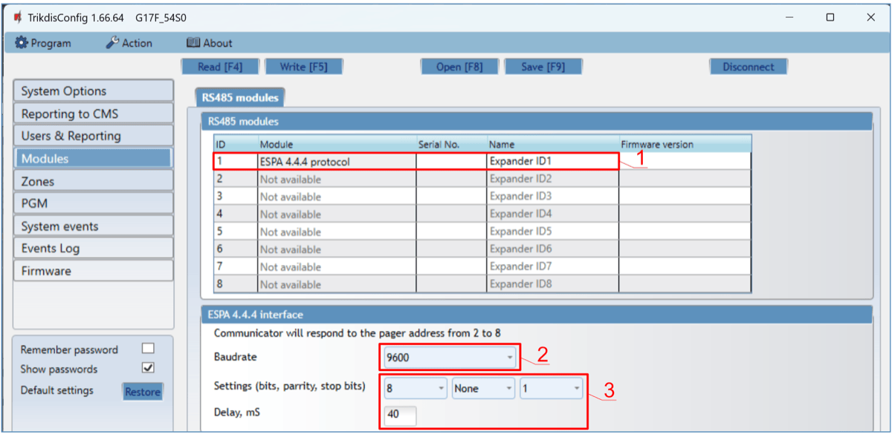

4. Enter phone numbers of users who should get messages from the G17F.

5. If you want the user to receive messages (or calls) about events, tick the SMS (or Call) box

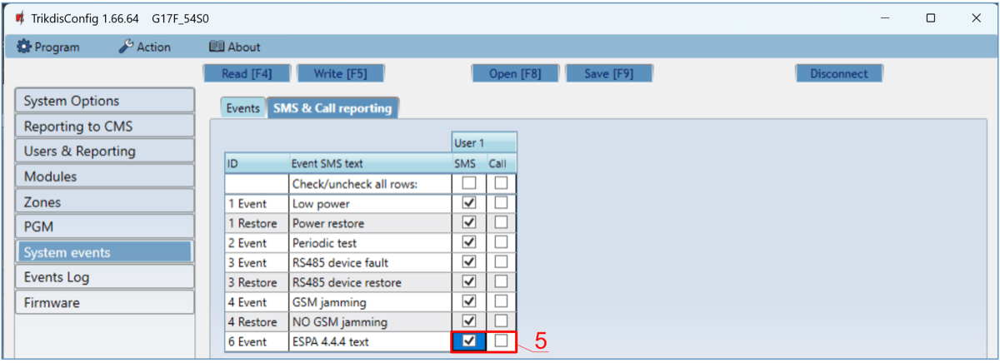

6. Configure the communication channel if messages should be sent to the CMS receiver. Event messages are transmitted using the SIA DC-09 protocol.

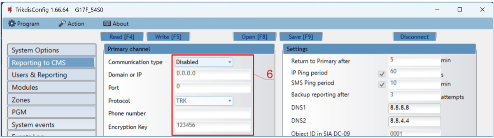

Test the system. Activate the fire alarm and check that G17F messages are sent to the CMS (central monitoring station) and to Protegus2.

### Connection diagram of the NSC Solution fire control panel and the G17F communicator 

G17F communicator settings using TrikdisConfig when connected to the **NSC Solution** fire panel.

1.  Choose the „**NSC Solution“**.

2.  The “NSC slave address” must not match the addresses of the connected fire panel modules.

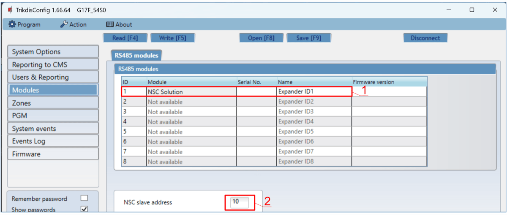

3. Enter phone numbers of users who should get messages from the G17F.

4. Users will get SMS messages and phone calls about events that are ticked. You can add additional CID event codes in the **CID** column. You must enter **SMS text** messages next to new codes. If you want the user to receive messages (or calls) about events, tick the **SMS** (or **Call**) box.

5. Configure the communication channel if messages should be sent to the CMS receiver.

After setting up the G17Fcommunicator, turn on power supply the fire control panel. Wait for the fire control panel software to load. It is necessary to scan the modules connected to the RS485 bus on the fire control panel. On the fire control panel, press: **PROG.>INSTALLER>(Enter the installer code) 00000 OK>(Select) SETTINGS>ENTER>(Select) SCAN RS485>ENTER**. Wait for the scan to complete. Return to the main screen by pressing “**CANCEL**“ twice.

Test the system. Activate the fire alarm and ensure that the G17F sends messages to the central monitoring station and Protegus2.

### Connection diagram of the INIM Smartline fire control panel and the G17F communicator 

Slave mode must be set for the **INIM Smartline** panel when it is connected to the G17F communicator via RS485 bus.

!!! note
    You cannot connect the G17F using the RS485 bus if repeaters are
    connected to the **INIM Smartline** panel. / If the G17F
    communicator is connected to the RS485 bus of the **INIM Smartline**
    fire alarm panel, the communicator's iO expansion modules are not
    supported.
Setting up communicator parameters for operation with the **INIM Smartline** fire control panel.

**In the “Modules” window:**

1.  Choose the **Inim Smartline** module.

**In the “Users & Reporting” window:**

2. Enter phone numbers of users who should get messages from the G17F communicator.

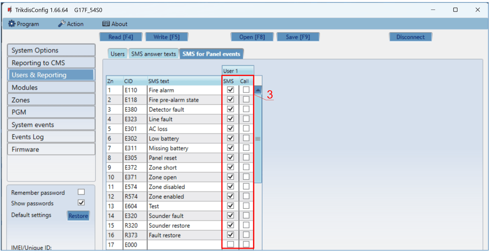

3. Users will get SMS messages and phone calls about events that are ticked. You can add additional CID event codes in the **CID** column. You must enter **SMS text** messages next to new codes. If you want the user to receive messages (or calls) about events, tick the **SMS** (or **Call**) box.

2.  Configure the communication channel if messages should be sent to the CMS receiver.

Test the system. Activate the fire alarm and ensure that the G17F sends messages to the central monitoring station (CMS) and Protegus2.

### Connection diagram of the C-TEC Cast ZFP fire control panel and the G17F communicator 

G17F communicator settings using TrikdisConfig when connected to the **C-TEC Cast ZFP** fire panel.

1.  Choose the **C-TEC Cast ZFP** fire control panel.

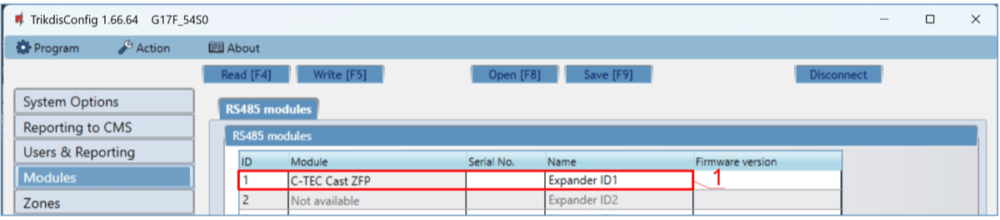

1.  Enter phone numbers of users who should get messages from the G17F communicator.

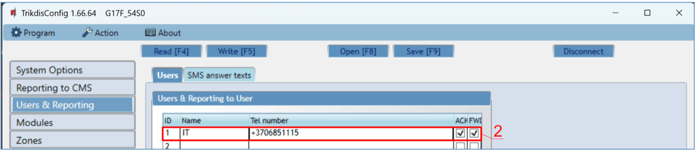

2. Users will get SMS messages and phone calls about events that are ticked. You can add additional CID event codes in the **CID** column. You must enter **SMS text** messages next to new codes. If you want the user to receive messages (or calls) about events, tick the **SMS** (or **Call**) box.

3. Configure the communication channel if messages should be sent to the CMS receiver.

Install the **ZFPtools** program on your computer. Run the **ZFPtools** program. Turn on the power supply of the fire control panel. Wait until the fire panel software is loaded. Connect the fire panel to the computer using a USB2.0 A-B cable.

4. Open the "**Node View**" tab.

5. Download the fire panel settings to your computer.

6. Enter the code (default code – 4444).

2.  Click „OK“.

3. Select „**BMS Interface**“.

2.  Click on the free icon.

11. Click „**Edit Devices**“.

12. In the “**Device**” tab, enter the system name.

13. In the “**Properties**” tab, enter the system name.

14. Specify the “**ABUS RS485**” bus to which the G17F communicator is connected.

15. Configure messages.

16. Write the settings to the fire panel.

17. Enter the code (default code – 4444).

18. Click „OK“.

The fire panel is programmed. Disconnect the cable from USB2.0 A-B of the fire panel.

Test the system. Activate the fire alarm and check that G17F messages are sent to the CMS (central monitoring station) and to Protegus2.

### Schematics for connecting inputs 

The communicator has six (1IN – 6IN) input terminals (three terminals are dual purpose IN/OUT) for connecting NO, NC, EOL (4,7kΩ, 10 kΩ) type circuits. Default input setting – monitor an EOL type circuit. You can set a different input type in the TrikdisConfig window **Zones**.

Schematics of NO, NC, EOL type circuits:

### Schematic for connecting iO series expander modules 

If the communicator needs more inputs IN or outputs OUT, connect a wired or wireless TRIKDIS iO series input and output expander.

### Schematic for connecting an iO-8 expander module 

If you need the communicator to have more IN inputs or OUT outputs, connect the *iO-8* wired expander.

### Schematics for connecting LORA series expander modules

Schematics for connecting LORA modules.

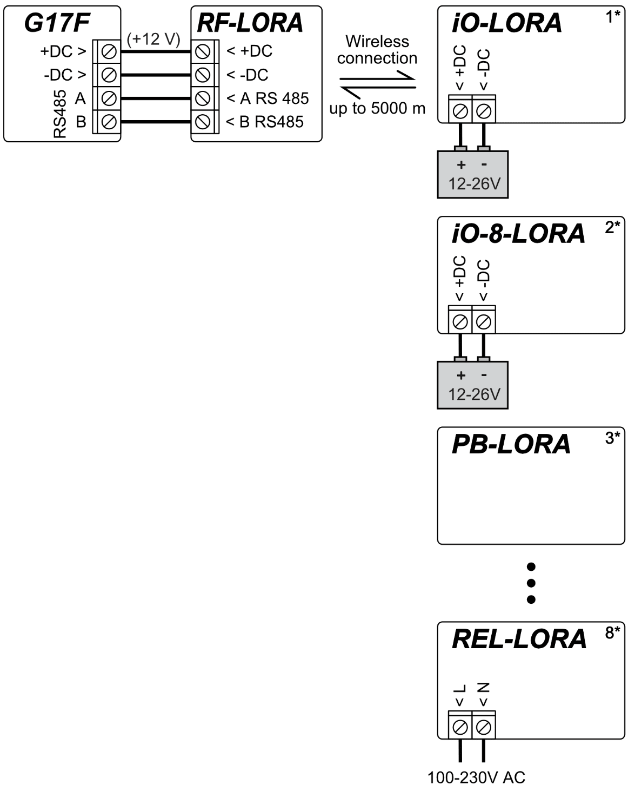

### Schematic for connecting the W485 WiFi module 

*G17F* firmware version from 1.08. / The *W485* module sends messages to the CMS (Central Monitoring Station) and to *Protegus2* using a WiFi internet router. When WiFi connectivity is available, the *G17F* sends event messages via the *W485* module. When WiFi connectivity is disrupted, the *G17F* sends messages via GPRS. When WiFi connectivity is re-established, the *G17F* returns to sending messages via *W485*. / Configuration of the *W485* WiFi module to work with the *G17F* is described in chapter 5.5. „„Modules” window”. / You do not need a SIM card, when using the *W485* with the *G17F.*

### Schematic for connecting the E485 “Ethernet” module 

*G17F* firmware version from 1.08. / The *E485* sends messages to the CMS (Central Monitoring Station) and to *Protegus2* using a wired internet connection. Using the *E485* with *G17F*, CMS and *Protegus2* messages are sent over wired Internet and mobile Internet is not used. If a wired internet connectivity is disrupted, the *G17F* sends messages via the mobile Internet. When the wired Internet connectivity is re-established, *G17F* starts sending messages via *E485*. / Configuration of the *E485* module to work with the *G17F* is described in chapter 5.5. „„Modules” window”. / You do not need a SIM card, when using the *E485* with the *G17F.*

### Turning on the communicator 

To turn on the communicator, you must first provide a power source for the fire control panel. If the communicator is working properly, the following G17F indicator lights should turn on:

- The “POWER” diode must be green solid (sufficient power supply voltage);

- The “NETWORK” diode must be green solid and blink yellow when the communicator is connected to a network.

!!! note
    Sufficient Cellular signal level - 5 (five yellow flashes of the "NETWORK"
    indicator). Sufficient 4G signal level - 3 (three yellow flashes of the
    "NETWORK" indicator). / If you count less than 3 yellow flashes of the
    "NETWORK" diode, the Cellular signal level is insufficient. We recommend
    choosing a different place for installing the communicator or using a
    more sensitive Cellular antenna. / If the indication is different, search for
    the explanation in chapter 1.4 "LED indication of operation". / If the
    G17F's indicator lights are completely inactive, check the power
    supply and connections.
## Remote control 

### Adding the communicator to Protegus2 app 

Using Protegus2, users can see the system’s state and receive notifications about system events.

1.  Download and launch the Protegus2 app or use the browser version [www.protegus.app](https://www.protegus.app):

    

      
      
      
    

2.  Create a new account or log in with your user name and password.

!!! warning "Important"
    When adding the system to Protegus2 the G17F communicator
    must:

    1.  Have an inserted and activated SIM card with the PIN code entered or
        disabled;

    2.  Have Protegus service enabled. See 5.4 "Users &
        Reporting" window;

    3.  Have the power switched on ("POWER" LED must be green solid);

    4.  Be connected to a network (the "NETWORK" LED must be green solid and
        blink yellow).
3. Click „Add new system” and enter the *G17F*’s “*Unique ID*” number. It can be found on the device and packaging sticker. After entering the *unique ID*, click the “Next” button.

### Configuration and control via SMS messages 

**1. Change the administrator password**

To ensure safety, change the default administrator SMS password. Send an SMS message of the following format:

#### PSW 123456 xxxxxx

| **123456** | Default administrator password      |
|------------|-------------------------------------|
| **xxxxxx** | New 6-symbol administrator password |

1.  **Allow other users to control**

Only phone numbers on the user list can control the system using SMS messages or phone calls. From an administrator phone, send SMS messages with other people’s phone numbers and names to allow them to control the system:

#### SETN xxxxxx PHONEx=+PHONENR#NAME

| **xxxxxx** | 6-symbol administrator password |
|----|----|
| **x** | User’s number on the list. (If you write 1 as the user number, you will transfer your administrator’s rights to the other user.) |
| **PHONENR** | User’s phone number |
| **NAME** | User’s name |

**SMS command list**

| Command | Data | Description |
|---------|------|-------------|
| INFO |  | Request information about the communicator. Communicator type, IMEI number, serial number and firmware version will be included in the answer. / E.g.: INFO 123456 |
| RESET |  | Reset the device. E.g.: RESET 123456 |
| OUTPUTx | ON | Turn on an output, “x” is the output number. E.g.: OUTPUT1 123456 ON |
| OUTPUTx | OFF | Turn off an output, “x” is the output number. E.g.: OUTPUT1 123456 OFF |
| OUTPUTx | PULSE=ttt | Turn on an output for a few seconds - “x” is the OUT output number, and “ttt” is a three-digit number that specifies pulse time in seconds. / E.g.: OUTPUT1 123456 PULSE=002 |
| PSW | New password | Change password. E.g.: PSW 123456 654123 |
| TIME | YYYY/MM/DD,12:00:00 | Set date and time. E.g.: TIME 123456 2025/05/09,10:23:00 |
| TXTA | Object name | Specify an object name. E.g.: TXTA 123456 House |
| TXTE | Z1= / ........ / Z12= | Customize zone alarm SMS message text: Z1...Z12 – input zone number. / E.g.: TXTE 123456 Z1=ALARM in Zone1 |
| TXTR | Z1= / ........ / Z12= | Customize zone restore SMS message text: Z1...Z12 – input zone number. / E.g.: TXTR 123456 Z1=Restore Zone1 |
| RDR | PhoneNR#SMStext | Forward SMS messages to the specified number. The phone number must start with a "+" sign and the international country code. |
| RDR | PhoneNR#SMStext | E.g.: RDR 123456 +37061234567#forwarded text |
| ASKI |  | Request SMS message about statuses of inputs IN. E.g.: ASKI 123456 |
| ASKO |  | Request SMS message about statuses of outputs OUT. E.g.: ASKO 123456 |
| SETN | PhoneX=PhoneNR#Name | Add a phone number, username and assign it to user “x”. “x” is the phone number’s line on the list. The phone number must start with a "+" symbol and international country code. The phone number and username must be separated by a # symbol. E.g.: SETN 123456 PHONE5=+37061234567#JOHN |
|  | PhoneX=DEL | Delete user’s phone number and name from the system. / E.g.: SETN 123456 PHONE5=DEL |
| UUSD | *Uusd code# | Send a UUSD code to the operator. E.g.: UUSD 123456 *245# |
| CONNECT | Protegus=ON | Connect to Protegus cloud service. E.g.: CONNECT 123456 PROTEGUS=ON |
| CONNECT | Protegus=OFF | Disconnect from Protegus cloud service. E.g.: CONNECT 123456 PROTEGUS=OFF |
| CONNECT | Code=123456 | Protegus cloud service code. E.g.: CONNECT 123456 CODE=123456 |
| CONNECT | IP=0.0.0.0:8000 | Specify the main server’s connection channel’s TCP IP and Port. / E.g.: CONNECT 123456 IP=0.0.0.0:8000 |
| CONNECT | IP=0 | For turning off the main channel. E.g.: CONNECT 123456 IP=0 |
| CONNECT | ENC=123456 | TRK encryption key. E.g.: CONNECT 123456 ENC=123456 |
| CONNECT | APN=Internet | APN name. E.g.: CONNECT 123456 APN=INTERNET |
| CONNECT | USER=user | APN user. E.g.: CONNECT 123456 USER=User |
| CONNECT | PSW=password | APN password. E.g.: CONNECT 123456 PSW=Password |

### Control PGM outputs using phone calls 

!!! note
    If no users have been added to the system, the first one to call the
    G17F will become the system administrator and will be the only one
    who can control the G17F using phone calls and SMS commands. / If
    you want to allow additional users to control the system using phone
    calls, add them with TrikdisConfig or give them the rights using
    SMS commands.
Perform these actions if you want to control a PGM output remotely:

- The user must be allowed to control outputs OUT and the output OUT must have type “Remote control” assigned (using TrikdisConfig).

- Call the number of the G17F’s SIM card. The G17F will answer the call and you can dial commands using the phone’s keypad (see the table).

**Mobile phone keyboard command list**

| Keyboard buttons | Function | Description |
|------------------|----------|-------------|
| [output no]*[state no]# | Control selected output OUT | Controls the specified PGM output. State: [0] – output turned off; [1] – output turned on; [2] – turned off for pulse time; [3] – turned on for pulse time; (pulse time is specified in the TrikdisConfig software, “PGM” table) [*] – this symbol shows the end of the command. E.g. (turn on output 1): 1*1# E.g. (turn off output 1): 1*0# E.g. (turn on output 2 for Pulse time specified in the TrikdisConfig “PGM” table): 2*3# |
| # | Retry entering the command | If you made a mistake while entering the command, press # on the phone’s keyboard and enter the command again. |

## Description of *TrikdisConfig* windows 

### Description of TrikdisConfig status bar 

Once the G17F is connected, TrikdisConfig will display information about the connected device in its status bar.

| **Name**       | **Description**                                     |
|----------------|-----------------------------------------------------|
| IMEI/​Unique ID | Device’s IMEI number                                |
| Status         | Operational state                                   |
| Device         | Device type (must show G17F)                  |
| SN             | Device’s serial number                              |
| BL             | Bootloader version                                  |
| FW             | Device’s firmware version                           |
| HW             | Device’s hardware version                           |
| State          | Type of connection with the program (USB or remote) |
| Role           | Access level (shown after access code is approved)  |

When the **Read [F4]** button is clicked, the program will read and show settings currently saved on the G17F. With TrikdisConfig, set the required parameters using the following program window descriptions.

### “System Options” window 

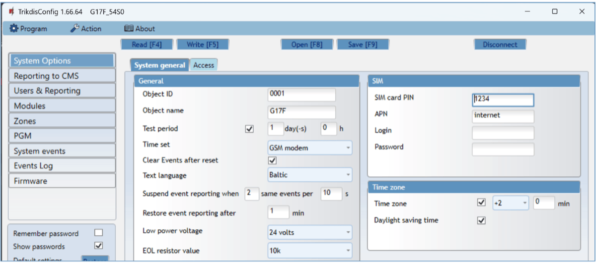

**“System general” tab** **“General” settings group**

- **Object ID** – if events are going to be sent to the CMS, enter the Object ID (4-symbol hexadecimal number, 0-9, A-F. **Do not use FFFE, FFFF Object ID**) given by the CMS.

- **Object name** – the name given to the object that will be used in SMS messages sent to the user.

- **Test period** - when the box is ticked, “Test” messages will be sent every set period.

- **Time set** – choose a server to synchronize time with. If you choose “*IP server*”, time will be synchronized with the IP receiver’s time, if you choose “*Cellular modem*”, time will be synchronized with the GSM service provider’s server time.

- **Clear Events after reset** – all unsent event messages will be deleted upon reset.

- **Text language** – set the preferred language and the specific symbols of that language will be used in SMS messages.

- You can **Suspend event reporting when ...** a number of **same events per ... s** happen.

- **Restore event reporting after ...** – set the time after which suspending of event reporting will be cancelled. The time can be anywhere from 0 to 999 minutes.

- **Low power voltage** – specify the power supply voltage (12 V or 24 V) that will be used for forming messages about insufficient power supply voltage.

**“SIM” settings group**

- Enter the **SIM card PIN** code**.**

  - **APN** – network service provider’s mobile internet access point name. You must enter the APN if event messages will have to be sent to Protegus2 app or to the CMS via GPRS.
- If required by the GPRS network service provider, enter the APN user name and password in the fields **Login** and **Password**.

**“Time zone” settings group**

- **Time zone** – specify your country’s time zone. For example, if the communicator will be installed in Lithuania, enter **+3.**

- **Daylight saving time** – if you check the box, the communicator's internal clock will be automatically switched to summer or winter time.

**“Access” tab**

**Settings group “Access codes”**

- **Administrator Code** – gives full access to configuration functions (default code – 123456).

- **SMS password** – password for remote control and programming via SMS messages (default code – 123456).

- **Installer Code** – gives limited access to changing the communicator’s configuration (default code – 654321).

**Settings group “Installer permissions”**

The administrator can set which parameters can be changed by the installer.

### “Reporting to CMS” window 

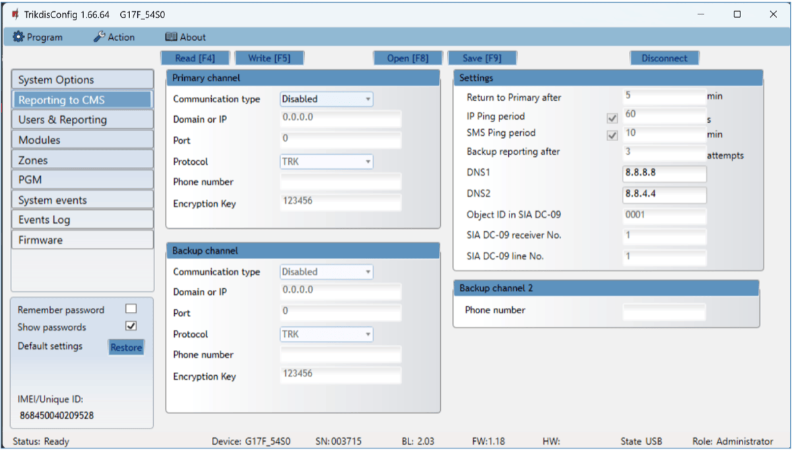

The communicator sends messages to the Central Monitoring Station using internet (IP) or SMS messages.

You can assign a backup channel to the primary channel. It will be used when connection via the primary channel is lost.

Messages sent to the Central Monitoring Station are encoded and password protected. To receive messages and forward them to monitoring software, a TRIKDIS receiver is required:

- For IP messages – receiving program IPcom Windows/Linux, hardware IP/SMS receiver RL14 or multi-channel receiver RM14.

- For SMS messages – hardware IP/SMS receiver RL14, multi-channel receiver RM14 or SMS receiver GM14.

Connection via SMS messages is extremely useful for the backup channel, because it works even when internet connectivity in the operator’s network is disrupted. Using SMS as the primary channel is not recommended.

**Settings group “Primary channel”**

- **Communication type** – choose a method for connecting to the Central Monitoring Station’s receiver.

- **Domain or IP** – enter the receiver’s domain or IP address.

- **Port** – enter the receiver’s network port number.

- **Protocol** – TRIKDIS IP receivers can receive messages sent in the **TRK** protocol, and **SIA DC-09** protocols are used for IP receivers capable of receiving event messages sent in SIA DC-09 protocols.

- **Phone number** – (only for SMS messages) enter the phone number of a TRIKDIS SMS receiver. The phone number must start with the country code (e.g.: 370xxxxxxxx).

- **Encryption Key** – 6-digit message encryption key. The communicator’s encryption key must match the receiver’s encryption key.

**Settings group “Backup channel”**

Enable backup channel mode to allow messages to be sent using the backup channel if the connectivity is disrupted. Configure the backup channel using the same settings as described above.

**Settings group “Settings”**

- **Return to Primary after** – time period after which the G17F will attempt to regain connection with the Primary channel.
- **IP PING period** – sending period of internal PING signals for checking connectivity. These messages are sent only via IP channel. The receiver does not forward these signals to the monitoring software and thus does not overload the software. The monitoring software is only notified when the receiver does not receive a PING message from the device for a preset period of time.

By default, the receiver will send a “*Connection lost*” message to the monitoring software after a time period that is three times longer than the communicator’s PING sending period. E.g. if the IP PING period is 3 minutes, the receiver will send a lost connection message if it does not receive a PING for 9 minutes.

PING messages also keep an active connection session between the device and the receiver. An active session is required to configure and control the communicator remotely. We recommend setting the PING period to be no longer than 5 minutes.

- **SMS Ping reporting** - period of sending a PING signal over the channel for sending SMS messages, min.. Check the box to enable communication channel and specify the time interval.

- **Backup reporting after** – specify the number of unsuccessful attempts to send a message using the **Primary channel**. If the message fails to send after the specified number of attempts, the device will transmit using the **Backup channel**.

- **DNS1, DNS2** – (Domain Name System) server that specifies the domain IP address. It is used when a domain is specified in the connectivity channel’s **Domain or IP** field (instead of an IP address). Default setting - Google DNS server addresses.

The following settings are only shown when **DC-09_2007** or **DC-09_2012** protocol is chosen in the connectivity channel’s **Protocol** field.

- **Object ID in SIA DC-09** – <u>enter the object number. If you chose the DC-09 protocol, the object number entered in this field will be used</u>. You can enter the 3-16 symbol hexadecimal number given by the central monitoring station.

- **SIA DC-09 receiver No.** – enter the receiver’s number.

- **SIA DC-09 line No.** – enter the line number in the receiver.

**Settings group “Backup channel 2”**

- **Phone number** - (only for SMS messages) enter the phone number of a TRIKDIS SMS receiver. The phone number must start with the country code (e.g.: 370xxxxxxxx).

### “Users & Reporting” window

**“Users” tab**

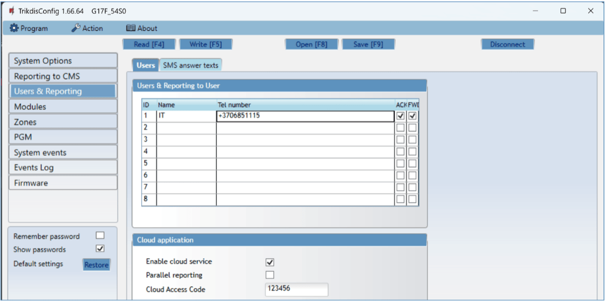

**Settings group “Users & Reporting to User”**

- **ID** – user’s number on the list.

- **Name** – user’s name. These names will be used in event SMS messages.

- **Tel number** – the user’s phone number that will receive SMS messages. Numbers must be entered with the international code.

- **PGM** – if the box is ticked, the user can remotely control outputs.

- **ACK** – if the box is ticked, the G17F will send SMS messages with **SMS answer text** to the user after every received SMS command.

- **FWD** – if the box is ticked, SMS messages received from non-system users will be forwarded to the user (e.g. SIM card account balance, random promotional messages, etc.).

**Settings group “Cloud application”**

- **Enable cloud service** – enable Protegus service to allow the G17F to exchange data with the Protegus2 app and remotely configure the device using TrikdisConfig.

- **Parallel reporting** – enable parallel message sending via the **Primary channel** and to Protegus2.

- **Cloud access code** – 6-digit code for logging in to Protegus2 (default code - 123456).

**“SMS answer texts” tab**

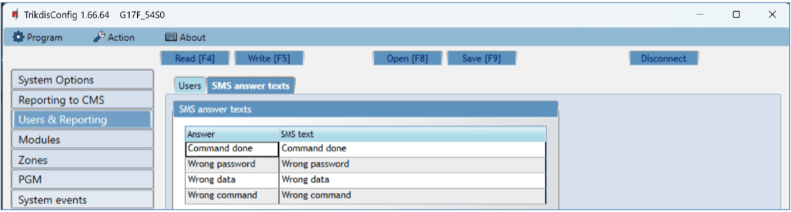

**Settings group “SMS answer texts”**

- Edit the answer texts to control commands sent via SMS messages in the column **SMS text**.

**“SMS for Panel events” tab**

This window will only be displayed if at least one user phone number has been added to the „Users & Reporting“ window*.*

- **Zn** – event’s number on the list.

- **CID** – event’s Contact ID code.

- **SMS text** – event’s SMS message text.

- **User SMS/Call**– choose how to inform users about every event – SMS message and/or call.

### “Modules” window 

**Settings group “RS485 modules”**

- **ID** – module’s number on the list.

- **Module** – choose the module being used (modules iO, iO-WL, iO-8, Inim Smartline, E485, W485, iO-LORA, iO8-LORA, PB-LORA, REL-LORA, NSC Solution, C-TEC Cast ZFP, ESPA 4.4.4) from the module list.

- **Serial No**. – mandatory 6-digit number that can be found on the module’s casing and its packaging.

- **Name** – you can give the module a name.

- **Firmware version** – the firmware version will be shown when the G17F finds the connected module.

**„W485 settings“ tab**

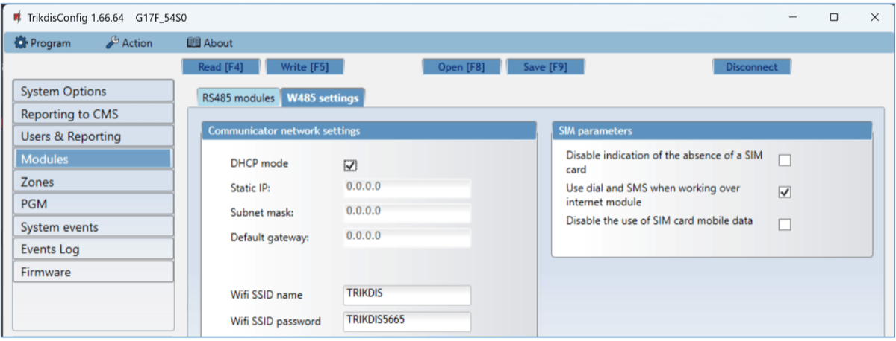

WiFi module W485 (W17u) settings window „Communicator network settings“ settings group

- **DHCP mode** – WiFi module’s mode for registering to network (manual or automatic). Check the box (automatic registration mode) and the WiFi module will automatically scan the network settings (subnet mask, gateway) and will be assigned an IP address.

  - **Static IP** – static IP address for when manual registering mode is set.

  - **Subnet mask** – subnet mask for when manual registering mode is set.

  - **Default gateway** – gateway address for when manual registering mode is set.

  - **Wifi SSID name** – name of the WiFi network that the W485 (W17u) will connect to.

- **Wifi SSID password** - WiFi network password.

**„SIM parameters“ settings group**

- **Disable indication of the absence of a SIM card** – checking the box will disable the indication of the absence of the SIM card in the G17F controller.

- **Use dial and SMS when working over internet module** – checking the box will enable control of the communicator via call and SMS. If the field is not checked and there is a Wi-Fi network, then the call and SMS messages are not used. If the field is unchecked and there is no Wi-Fi network, then G17F can manage call and SMS messages. G17F will send SMS messages to the user.

- **Disable the use of SIM card mobile data** – checking the box will disable the use of mobile data from the SIM card. Data will only be sent via module W485. If the Wi-Fi network is disconnected, G17F will store data in memory. After restoring the Wi-Fi network, the G17F will send the saved data via the Wi-Fi W485 module***.***

**„E485 settings“ tab**

„Ethernet“ module E485 settings windows „Communicator network settings“ settings group

- **DHCP mode** – „Ethernet“ module’s mode for registering to network (manual or automatic).

- **Static IP** – static IP address for when manual registering mode is set.

- **Subnet mask** – subnet mask for when manual registering mode is set.

- **Default gateway** – gateway address for when manual registering mode is set.

**„SIM parameters“ settings group**

- **Disable indication of the absence of a SIM card** – checking the box will disable the indication of the absence of the SIM card in the G17F controller.

- **Use dial and SMS when working over internet module** – checking the box will enable control of the communicator via call and SMS. If the field is unchecked and there is internet, then SMS and calls are not used. If the field is unchecked and there is no Internet, then G17F can manage call and SMS messages. G17F will send SMS messages to the user.

- **Disable the use of SIM card mobile data** – checking the box will disable the use of mobile data from the SIM card. Data will only be sent via module E485. If the internet disappears, G17F will store data in memory. When the Internet is restored, the G17F will send the saved data via the “Ethernet” E485 module***.***

### “Zones” window 

**“Zones settings” tab**

- **Zone No** – zone’s number on the list.

- **Name** - the zone can be given a name that will be used in SMS messages.

- **Input** – choose which G17F or expansion module input IN to assign to a zone.

- **Definition** – all zones are assigned the **24 hours** definition. If this zone is violated, a message about the event is sent immediately.

- **Type** – choose the type of circuit connected to the zone input IN from a list: NC – normally closed contact, NO – normally open contact, EOL – with a (4,7kΩ or 10 kΩ) resistor at the end of the circuit.

- **CMS** – if the box is ticked, messages about zone events will be sent to the CMS (central monitoring station).

- **Prot**. – if the box is ticked, notifications about zone events will be sent to Protegus2 app.

- **Delay** – IN input zone reaction time in milliseconds.

- **CID Code** – event’s Contact ID code.

- **SIA E** – SIA Event code.

- **SIA R** – SIA Restore code.

- **LOOP** - the loop number is indicated in the SMS message.

**“SMS & Call reporting” tab**

This window will only be displayed if at least one user phone number has been added to the „Users & Reporting“ window*.*

- **Zn** – zone number with an event identification word. Can be “*Event*” or “*Restore*”.

- **SMS text** – description of the zone event that will be included in SMS event messages sent to users.

- **User SMS/Call** – choose how to inform users about every zone event – via SMS message and/or call.

### “PGM” window

**“Outputs” tab**

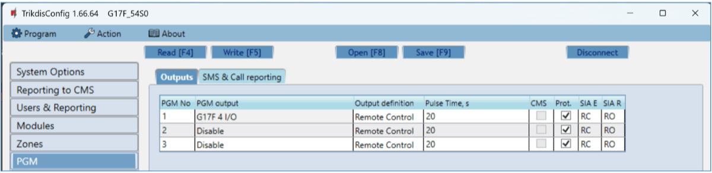

- **PGM No** – PGM output’s number on the list.

- **PGM output** – assign outputs OUT of the G17F or of an external device to a PGM.

- **Output definition** – select operational mode of an output OUT.

- **Pulse time, s** – assign a desired OUT turn on duration from 0 to 9999 seconds.

- **CMS** – if the box is ticked, messages about chosen events will be sent to CMS.

- **Prot**. – if the box is ticked, output event notifications will be sent to Protegus2 app.
- **SIA E** – SIA Event code.
- **SIA R** – SIA Restore code.

**“SMS & Call reporting” tab**

This window will only be displayed if at least one user phone number has been added to the „Users & Reporting“ window

- **PGM** – the number of output OUT and turn on/off event type (“Event” – output OUT turn on event and “Restore” – OUT turn off event).

- **SMS text** – output OUT turn on/off event name that will be included in the event’s SMS message.

- **User SMS/Call** – choose which users to inform via SMS message and/or call when an output OUT is turned on/off.

### “System events” window 

**“Events” tab**

- **ID** – event’s number on the list.

- **Event name** – event name.

- **Enable** – enable event recognition.

- **CMS** – messages about chosen events will be sent to CMS.

- **Prot**. – notifications about chosen events will be sent to Protegus2 app.

- **CID Code** – event’s Contact ID code.
- **SAI E** – SIA Event code.

- **SIA R** – SIA Restore code.
- **LOOP** - the loop number is indicated in the SMS message.

- **SMS event text** – text of the event’s SMS message.

- **SMS restore text** - text of the event’s restore SMS message.

**“SMS & Call reporting” tab**

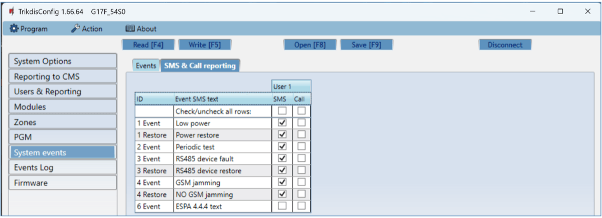

This window will only be displayed if at least one user phone number has been added to the „Users & Reporting“ window

- **ID** – event’s number on the list and identification word (*Event*, *Restore*).

- **Event SMS text** – text that will be included in SMS messages about events.

- **User SMS/Call** – choose how to inform users about every event – via SMS message and/or call.

### “Events Log” window

- **Read Log** button – for reading the event log from the device’s memory.

- **Clear Log** button – for clearing the event log entries from the device’s memory.

- In the table, you can find the **Event No.**, **Time**, **CID** code, **Event definition**. The events log can show up to 1000 events stored in the G17F’s memory.

### Restore default settings 

To restore the communicator’s default settings, click the TrikdisConfig button **Restore.**

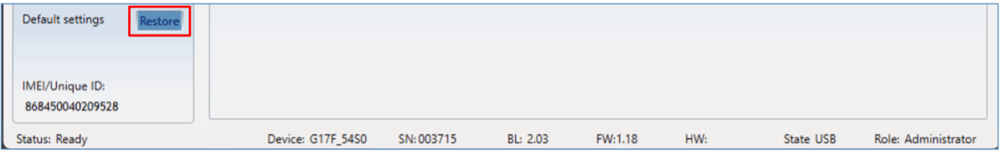

## Setting parameters remotely 

!!! warning "Important"
    Remote configuration will only work when the G17F:

    1.  Has an inserted and activated SIM card with the PIN code entered or
        disabled.

    2.  Has Protegus service enabled. See **5.4 "Users &
        Reporting" window**.

    3.  Has the power switched on ("POWER" LED must be green solid);

    4.  Is connected to a network (the "NETWORK" LED must be green solid and
        blink yellow).

    If "NETWORK" is yellow solid or "DATA" is yellow solid, the device
    cannot connect to GSM and/or Protegus2.
1.  On your computer, launch the configuration software TrikdisConfig.

2.  In the **Remote access** window, enter the communicator’s Unique ID number. You can find this number on the back of the device and on the device’s packaging.

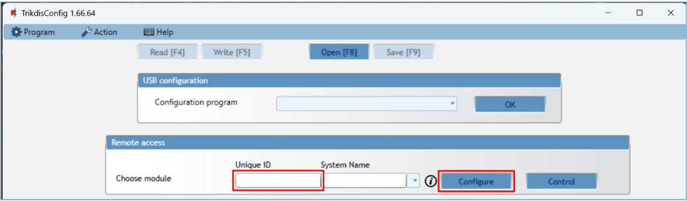

3. (Optional) Enter a desired name for the communicator in the **System Name** field.

2.  Click **Configure**.

3.  In the window that opens, click **Read [F4]**. If prompted, enter the administrator or installer code.

4.  When you are finished setting the desired parameters, click **Write [F5]**. If you are done working with ***TrikdisConfig**,* click **Disconnect.**

## Testing the G17F GSM communicator 

When configuration and installation are complete, perform a system check:

1.  To test an input of the communicator, enable it. Check if the events were received by the Central Monitoring Station (CMS) and/or Protegus2 application.

2.  To test the communicator’s outputs, turn them on remotely and check their operation. Ensure that the events were received by the Central Monitoring Station (CMS) and/or Protegus2 application.

3.  Perform a fire alarm test to see if the CMS receives events correctly.

## Updating firmware 

!!! note
    After connecting the communicator to TrikdisConfig, the program
    will automatically offer to update the firmware if any updates are
    available. Internet connection is needed for this feature. Antivirus
    software, firewall or strict internet access settings can block the
    automatic update feature.
The communicator’s firmware can also be updated or changed manually. All prior settings of the communicator remain after an update. If the firmware is installed manually, it can be changed to a newer or an older version. Perform these steps:

1.  Launch ***TrikdisConfig**.*

2.  Connect the communicator to the computer using a USB Mini-B cable or connect to the communicator remotely.

    - If a newer version of firmware is available, the program will automatically offer to install it.

3.  Open the TrikdisConfig window **Firmware**.

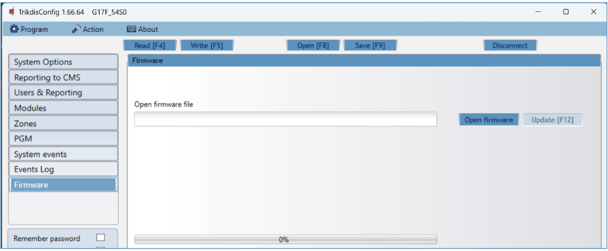

4. Click the button **Open firmware** and choose the required firmware file.

2.  Click the **Update [F12]** button.

3.  Wait for the update to finish.

## Safety precautions 

The communicator should be installed and maintained only by qualified personnel.

Please read this manual carefully prior to installation in order to avoid mistakes that can lead to malfunction or even damage to the equipment.

Always disconnect the power supply before making any electrical connections.

Any modifications, modernization or repairs not authorized by the manufacturer shall render the warranty void.

Please adhere to your local waste sorting regulations and do not dispose of this equipment or its components with household waste.
