# GET Cellular Communicator

  

## Description

The communicator is designed to transmit event messages from the control panel to the CMS (Central Monitoring Station) and the ***Protegus2*** application.

Cellular/Ethernet communicator ***GET*** can be directly connected to DSC, Paradox, UTC Interlogix (CADDX), Texecom, Innerrange, Honeywell control panels. The communicator can also be connected to the telephone communicators (which supports the Contact ID communication protocol transmitted by DTMF tones) of control panels.

Communicator transmits full event information to the Central Monitoring Station.

Communicator works with ***Protegus2*** application. With ***Protegus2*** users can control their alarm system remotely and get notifications about security system events. The ***Protegus2*** app works with all security alarm panels from various manufacturers to which the ***GET*** communicator is connected. Communicator can transmit event notifications to the Central Monitoring Station and work with ***Protegus2*** simultaneously.

### Features

**Connects to the control panel's serial or keyboard bus or telephone line (TIP/RING).**

Sends events to monitoring station receiver:

- Sends events to *TRIKDIS* software or hardware receivers that work with any monitoring software.

- Can send event messages to SIA DC-09 receivers.

- Can send event messages to SUR-GARD receivers. The annex has a table for converting Contact ID codes to SIA codes.

- Monitoring the connection by sending a PING request to the IP receiver every 30 seconds (or by user defined period).

- Backup channel, that will be used if connection with the primary channel is lost.

- With parallel communication channel events can be sent to two receivers at same time.

- When *Protegus2* service is enabled, events are first delivered to CMS, and only then are sent to app users.

**Works with Protegus2 app:**

- "*Push*" and special sound notifications informing about events.

- Remote system Arm/Disarm.

<!-- -->

- Remote control of connected devices (lights, gates, ventilation systems, heating, sprinklers, etc.).

- Different user rights for administrator, installer and user.

**Notifies users:**

- Users can be notified about events with ***Protegus2*** app.

**Controllable outputs and inputs:**

- 2 double I/O terminals that can be set either as input (IN) or controllable output (OUT) terminals.

- Outputs controlled by the ***Protegus2*** app.

**Quick setup:**

- Settings can be saved to file and quickly written to other communicators.

- Two access levels for configuring the device for CMS administrator and for installer.

- Remote configuration and firmware updates.

### List of compatible control panels

<table>
<colgroup>
<col style="width: 22%" />
<col style="width: 66%" />
</colgroup>
<thead>
<tr>
<th>Manufacturer</th>
<th>Model</th>
</tr>
</thead>
<tbody>
<tr>
<td>DSC®</td>
<td><u>PC585</u>, <u>PC1404</u>, | <u>PC1565</u>, <u>PC1616</u>, | <u>PC1832</u>, <u>PC1864</u>, | <u>PC5020</u> |</td>
</tr>
<tr>
<td rowspan="5">PARADOX®</td>
<td><u>SPECTRA SP4000</u>, | <u>SP5500</u>, <u>SP6000</u>, | <u>SP7000</u>, <u>SP65</u>, | <u>SP5500+</u>, <u>SP6000+</u>, | <u>SP7000+</u> |</td>
</tr>
<tr>
<td><u>MAGELLAN MG5000</u>, | <u>MG5050</u>, <u>MG5050E</u>, | <u>MG5050+</u>, <u>MG5075</u> |</td>
</tr>
<tr>
<td><u>DIGIPLEX</u> EVO48, | <u>EVO192</u>, <u>EVOHD</u>, | <u>EVOHD+</u> |</td>
</tr>
<tr>
<td>SPECTRA 1727, 1728, 1738</td>
</tr>
<tr>
<td>ESPRIT E55</td>
</tr>
<tr>
<td>UTC Interlogix®</td>
<td><u>NetworX (Caddx) NX-4v2</u>, | <u>NX-6v2</u>, <u>NX-8v2</u>, | <u>NX-8e</u> |</td>
</tr>
<tr>
<td>Texecom®</td>
<td>
<u>Premier 24</u>, <u>48</u>, | <u>88</u>, <u>168</u>, | <u>640</u> |

<u>Premier Elite 12</u>, <u>24</u>, | <u>48</u>, <u>64</u>, | <u>88</u>, <u>168</u>, | <u>640</u> |
</td>
</tr>
<tr>
<td>Innerrange®</td>
<td>Inception, Integriti</td>
</tr>
<tr>
<td>Honeywell®</td>
<td><u>Ademco Vista-15</u>, <u>Ademco | Vista-20</u>, <u>Ademco | Vista-48</u> |</td>
</tr>
</tbody>
</table>

**<u>Underlined</u>** - Control panels directly controlled by communicator***.*** Firmware PARADOX control panels, which are directly controlled, must be V.4 or higher.

\* Connect control panels from other manufacturers to the ***GET*** communicator using the TIP RING terminals of the control panel.

### Communicator model types

This manual is for LTE communicators.

### Specifications

<table>
<colgroup>
<col style="width: 22%" />
<col style="width: 77%" />
</colgroup>
<thead>
<tr>
<th><strong>Parameter</strong></th>
<th><strong>Description</strong></th>
</tr>
</thead>
<tbody>
<tr>
<td>
Network connectivity
</td>
<td>LTE /​ Ethernet</td>
</tr>

<tr>
<td>

Connection to control panel

</td>
<td>Serial bus, Keypad bus or TIP RING</td>
</tr>
<tr>
<td>

Dual purpose terminals [IN/​OUT]

</td>
<td>

2, can be set as either NC;​ NO;​ NC/​EOL;​ NO/​EOL;​ NC/​DEOL;​ NO/​DEOL (2,2 kΩ) type inputs or open collector (OC) type outputs with current up to 0,15 A, 30 VDC max.

</td>
</tr>
<tr>
<td rowspan="2">
Modem EG915U-EU

(Europe)
</td>
<td>LTE FDD: B1/​B3/​B5/​B7/​B8/​B20/​B28</td>
</tr>
<tr>
<td>GSM: B2/​B3/​B5/​B8</td>
</tr>
<tr>
<td rowspan="2">
Modem EG915U-LA

(Latin America)
</td>
<td>LTE FDD: B2/​B3/​B4/​B5/​B7/​B8/​B28/​B66</td>
</tr>
<tr>
<td>GSM: B2/​B3/​B5/​B8</td>
</tr>
<tr>
<td rowspan="2">Modem BG95-M5 (Cat M1)</td>
<td>LTE-FDD: B1/​B2/​B3/​B4/​B5/​B8/​B12/​B13/​B18/​B19/​B20/​B25/​B26/​B27/​B28/​B66/​B85</td>
</tr>
<tr>
<td>EGPRS: 850/​900/​1800/​1900 MHz</td>
</tr>
<tr>
<td>Power supply voltage</td>
<td>10-18 V DC</td>
</tr>
<tr>
<td>Current consumption</td>
<td>175 mA</td>
</tr>
<tr>
<td>Transmission protocols</td>
<td>TRK8, DC-09_2007, DC-09_2012, TL150</td>
</tr>
<tr>
<td>Message encryption</td>
<td>AES 128</td>
</tr>
<tr>
<td>Buffer memory capacity</td>
<td>60 events</td>
</tr>
<tr>
<td>Changing settings</td>
<td>With <strong><em>TrikdisConfig</em></strong> computer program remotely or locally via USB-C port</td>
</tr>
<tr>
<td>Operating environment</td>
<td>Temperature from -10 °C to 50 °C, relative humidity - up to 80% at +20 °C</td>
</tr>
<tr>
<td>Communicator dimensions</td>
<td>113 x 70 x 25 mm</td>
</tr>
<tr>
<td>Weight</td>
<td>110 g</td>
</tr>
</tbody>
</table>

### Communicator elements

1.  Cellular antenna SMA connector

2.  Light indicators

3.  Frontal case opening slot

4.  Terminal for external connections

5.  "RESET" button.

6.  SIM2 card slot

7.  SIM1 card slot

8.  USB-C port for communicator programming

9.  Ethernet connection RJ45 socket

### Purpose of terminals

<table>
<colgroup>
<col style="width: 15%" />
<col style="width: 73%" />
</colgroup>
<thead>
<tr>
<th><strong>Terminal</strong></th>
<th><strong>Description</strong></th>
</tr>
</thead>
<tbody>
<tr>
<td>+12 VDC</td>
<td>+10 V/​+18 V DC power supply</td>
</tr>

<tr>
<td>-12 VDC</td>
<td>0 V DC power supply</td>
</tr>
<tr>
<td>CLK</td>
<td rowspan="2">Serial bus terminals for direct connection to control panel</td>
</tr>
<tr>
<td>DATA</td>
</tr>
<tr>
<td>I/​O 1</td>
<td>1st input/​output terminal (default setting – OUT)</td>
</tr>
<tr>
<td>I/​O 2</td>
<td>2nd input/​output terminal (default setting – OUT)</td>
</tr>
<tr>
<td>COM</td>
<td>Common (negative) terminal</td>
</tr>
<tr>
<td>A 485</td>
<td rowspan="2">Not used</td>
</tr>
<tr>
<td>B 485</td>
</tr>
<tr>
<td>LAN</td>
<td>Ethernet connection RJ45 socket</td>
</tr>
<tr>
<td>TIP</td>
<td>Terminal to connect with control panel TIP terminal</td>
</tr>
<tr>
<td>RING</td>
<td>Terminal to connect with control panel RING terminal</td>
</tr>
</tbody>
</table>

### LED indication of operation

<table>
<colgroup>
<col style="width: 15%" />
<col style="width: 16%" />
<col style="width: 57%" />
</colgroup>
<thead>
<tr>
<th>Indicator</th>
<th>Light status</th>
<th>Description</th>
</tr>
</thead>
<tbody>
<tr>
<td rowspan="3">NETWORK LTE</td>
<td>

Off

</td>
<td>No connection to cellular network</td>
</tr>
<tr>
<td>

Yellow blinking

</td>
<td>Connecting to cellular network</td>
</tr>
<tr>
<td>

Green solid with yellow blinking

</td>
<td>
Communicator is connected to cellular network.

Sufficient cellular signal strength for 4G level 3 (three yellow flashes)
</td>
</tr>
<tr>
<td rowspan="2">NETWORK LAN</td>
<td>

Off

</td>
<td>No connection to a computer network</td>
</tr>
<tr>
<td>

Green solid

</td>
<td>Communicator is connected to a computer network</td>
</tr>
<tr>
<td rowspan="3">DATA</td>
<td>

Off

</td>
<td>No unsent events</td>
</tr>
<tr>
<td>

Green solid

</td>
<td>Unsent events are stored in buffer</td>
</tr>
<tr>
<td>

Green blinking

</td>
<td><strong><em>(Configuration mode)</em></strong> Data is being transferred to/from communicator</td>
</tr>
<tr>
<td rowspan="5">POWER</td>
<td>

Off

</td>
<td>Power supply is off or disconnected</td>
</tr>
<tr>
<td>

Green solid

</td>
<td>Power supply is on with sufficient voltage</td>
</tr>
<tr>
<td>

Yellow solid

</td>
<td>Power supply voltage is insufficient (≤11.5V)</td>
</tr>
<tr>
<td>

Green solid and yellow blinking

</td>
<td><strong><em>(Configuration mode)</em></strong> Communicator is ready for configuration</td>
</tr>
<tr>
<td>

Yellow solid

</td>
<td><strong><em>(Configuration mode)</em></strong> No connection with computer</td>
</tr>
<tr>
<td rowspan="5">TROUBLE</td>
<td>

OFF

</td>
<td>No operation problems</td>
</tr>
<tr>
<td>

1 red blink

</td>
<td>Connection error at the "physical" level (PHY Link status error), check LAN cable</td>
</tr>
<tr>
<td>

2 red blinks

</td>
<td>SIM1 card error</td>
</tr>
<tr>
<td>

3 red blinks

</td>
<td>SIM2 card error</td>
</tr>
<tr>
<td>

7 red blinks

</td>
<td>Lost connection with control panel (serial bus)</td>
</tr>
<tr>
<td>INTERFACE</td>
<td>

-

</td>
<td>Not used</td>
</tr>
</tbody>
</table>

### Structural schematic of using the GET communicator

!!! note
    Before you begin, make sure that you have the necessary:
    
    1.  USB-C cable for configuration.
    
    2.  At least 4-wire cable for connecting communicator to control panel.
    
    3.  CRP2 cable for connecting to Paradox panel's serial port.
    
    4.  Flat-head 2,5 mm screwdriver.
    
    5.  Sufficient gain cellular antenna if network coverage in the area is poor.
    
    6.  Activated SIM card (PIN code request can be turned off).
    
    7.  Particular security control panel's installation manual.
    
    Order the necessary components separately from your local distributor.
## Quick configuration with *TrikdisConfig* software

1.  Download **TrikdisConfig** configuration software from [www.trikdis.com](http://www.trikdis.com) (type "TrikdisConfig" in the search field) and install it.

2.  Open the casing of the communicator with a flat-head screwdriver as shown below:

    

3.  Using a USB-C cable connect the communicator to the computer.

4.  Run ***TrikdisConfig***. The software will automatically recognize the connected communicator and will open a window for configuration.

5.  Click **Read [F4]** to read the communicator's settings. If requested, enter the Administrator or Installer 6-digit code in the pop-up window.

Below we describe what settings need to be set for the communicator to begin sending events to the Central Monitoring Station (CMS) and to allow the security system to be controlled with the ***Protegus2*** app.

### Settings for connection with Protegus2 app

**In "Panel settings" window:**

1.  If the communicator is connected to the TIP/RING terminals of the control panel, then you need to make the "**AUTO**" setting.

The communicator is connected to the keypad bus or serial bus of the control panel.

2.  Select "**Security panel model"** that will be connected to the communicator.

3.  Select "**Remote Arm/Disarm"** if you want users to be able to control the panel in ***Protegus2*** app with their keypad code. This setting is only shown for directly controlled panels.

4.  For the direct control of Paradox and Texecom panels enter "**Security panel PC download password"**. It must match the password that is entered in the control panel.

!!! note
    For the direct panel control to work, you will need to change the panel settings. How to do this is described in chapter 4.1 "Programming of control panels when the communicator is connected to the keypad bus or serial bus". In this section you will find information on how to change the "**PC download/UDL password**".
**In "User reporting" window, "PROTEGUS Cloud" tab:**

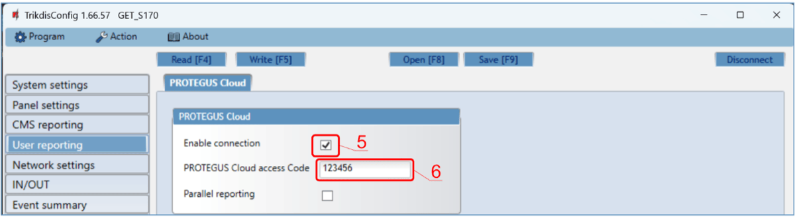

5.  Tick the checkbox "**Enable connection"** to the ***Protegus*** Cloud.

6.  Change the "**PROTEGUS Cloud access Code"** for logging in to ***Protegus2*** if you want users to be asked to enter it when adding the system to ***Protegus2*** app (default password -- 123456).

**In "Network settings" window:**

These settings must be made if the communicator is connected to a LAN network.

7.  Check "**Use DHCP"** the box so that the communicator automatically reads the computer network settings (subnet mask, gateway) and is assigned an IP address.

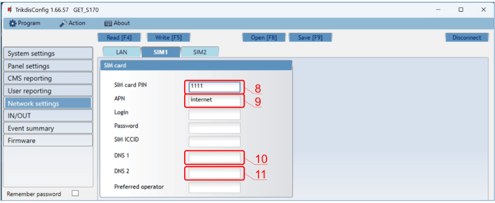

These settings must be made if the SIM (or two SIM cards) card is inserted into the communicator.

8.  Enter "**SIM card PIN"** code.

9.  Change "**APN"** name."**APN"** can be found on the website of the SIM card operator ("internet" is universal and works in many operator networks).

10. Google DNS server is set by default. **Regardless of IP settings, make sure the DNS addresses match those supported by your ISP**.

11. Google DNS server is set by default. **Regardless of IP settings, make sure the DNS addresses match those supported by your ISP**.

**In "CMS reporting" window:**

12. In the group of options "**Reporting mode**", the order of communication channels is set, how the communicator will send messages to CMS and to ***Protegus2***. The connection types are specified in order. If the communicator fails to connect using the "**Main type"** connection , it switches to the"**Backup type"**, and so on. If the backup connection type was successful in transmitting the message to the CMS, then the Return to main connection type will be attempted after the specified time interval.

After finishing configuration, click the button **Write [F5]** and disconnect the USB cable.

!!! note
    For more information about other ***GET*** settings in ***TrikdisConfig***, see chapter 6 „**TrikdisConfig window description**".
### Settings for connection with Central Monitoring Station

**In "System settings" window:**

1.  Enter "**Object ID"** (account) number provided by the Central Monitoring Station (characters, 0-9, A-F. **Do not use FFFE, FFFF Object ID**).

**In "Panel settings" window:**

2.  If the communicator is connected to the TIP/RING terminals of the control panel, then you need to make the "**AUTO**" setting.

3.  Select "**Security panel model"** that will be connected to the communicator.

**In "CMS reporting" window settings for "Primary channel":**

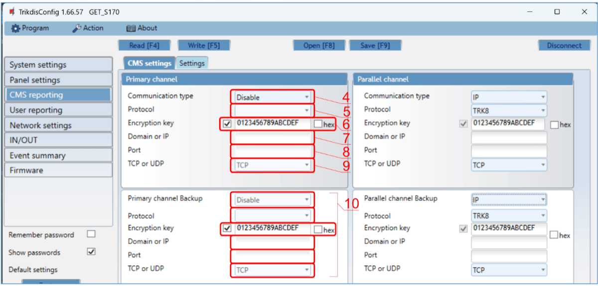

4.  **Communication type** - select the **IP** connection method.

5.  **Protocol** - select the protocol type for event messages: **TRK8** (to TRIKDIS receivers), **DC-09_2007** or **DC-09_2012** (to universal receivers), **TL150** (to SUR-GUARD receivers).

6.  **Encryption key** - enter the encryption key that is set in the receiver.

7.  **Domain or IP** - enter the receiver's Domain or IP address.

8.  **Port** - enter receiver's network port number.

9.  **TCP or UDP** - choose event transmission protocol (**TCP** or **UDP**) in which events should be sent.

10. (Recommended) Configure "**Primary channel Backup"** settings.

11. In the group of options "**Reporting mode**", the order of communication channels is set, how the communicator will send messages to CMS and to ***Protegus2***. The connection types are specified in order. If the communicator fails to connect using the "**Main type"** connection , it switches to the"**Backup type"**, and so on. If the backup connection type was successful in transmitting the message to the CMS, then the return to main connection type will be attempted after the specified time interval.

**In "Network settings" window:**

These settings must be made if the communicator is connected to a LAN network.

12. Check "**Use DHCP"** the box so that the communicator automatically reads the computer network settings (subnet mask, gateway) and is assigned an IP address.

If a SIM card (or two SIM cards) is inserted in the communicator, the following settings must be made.

13. Enter "**SIM card PIN"** code.

14. Change the "**APN"** name."**APN"** can be found on the website of the SIM card operator ("internet" is universal and works in many operator networks).

15. Google DNS server is set by default. **Regardless of IP settings, make sure the DNS addresses match those supported by your ISP**.

16. Google DNS server is set by default. **Regardless of IP settings, make sure the DNS addresses match those supported by your ISP**.

After finishing configuration, click **Write [F5]** and disconnect the USB cable.

!!! note
    For more information about other ***GET*** settings in ***TrikdisConfig***, see chapter 6 „**TrikdisConfig window description**".
## Installation and wiring

### Installation process

1.  Remove the top cover and pull out the contact terminal.

2.  Insert SIM card into the holder.

3.  Remove the PCB board from the bottom part of the case.

4.  Fix the bottom part to a suitable place with screws.

5.  Place the PCB board back into case, insert contact terminal.

6.  Screw cellular antenna on.

7.  Close the top cover.

8.  If the LAN network will be used to transmit events to the CMS, a LAN cable must be connected to the communicator.

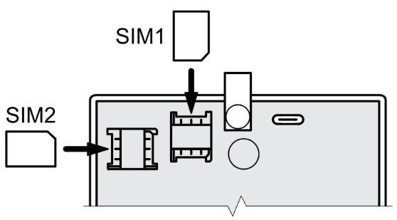

!!! note
    One or two SIM cards can be inserted into the communicator.
    
    Ensure that the SIM card is activated.
    
    Ensure that mobile internet service (mobile data) is enabled if connected via IP channel.
    
    To avoid entering the PIN code in ***TrikdisConfig***, insert the SIM card into your mobile phone and turn off the PIN request function.
### Installation in intrusion control panel enclosure panel

The ***GET*** communicator must be installed inside the intrusion control panel enclosure, which is protected by a lid tamper. It is mounted on the internal rear surface of the enclosure using the supplied industrial-grade double-sided acrylic foam mounting tape. The tape must be applied to a clean, dry surface with firm pressure to ensure reliable adhesion.

If the host enclosure does not allow secure installation as described above, the communicator may be installed in a separate tampered enclosure.

### Schematics for wiring the communicator to a security control panel

Following one of the schematics provided below, connect communicator to the control panel.

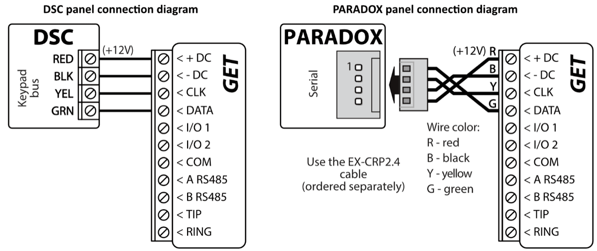

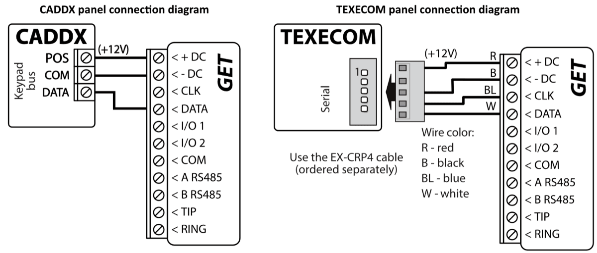

### Schematic for wiring of the communicator to the keypad bus and telephone communicator (TIP/RING terminals) of the PARADOX SP/SP+/MG/MG+ control panel

When connecting the communicator to the keypad bus and the TIP/RING terminals of the control panel, you must make the following settings for the ***GET*** communicator:

1.  Select "**AUTO**".

2.  Select the control panel model "**7. Paradox SP+/MG+ series KeyBus**".

3.  Select "**Remote Arm/Disarm**" if you want users to be able to control the panel using the ***Protegus2*** app using their own keypad code.

4.  To directly control the security panel, enter the "**Security panel PC download password**". It must match the password entered in the security panel.

The Paradox control panel must be programmed to transmit events to the CMS and for remote control from the ***Protegus2*** application.

| **Cell** |     **Data**     | **Cell** | **Data** |
|:--------:|:----------------:|:--------:|:--------:|
|   801    | \*\*\*\*\*\*\*\* |   815    |  123456  |
|   811    |       1111       |   911    |   1234   |
|   812    |       2222       |          |          |

### Schematic for wiring the communicator to the control panel keyswitch zone

Follow this schematic if the control panel will be armed/disarmed with a communicator PGM output turning on/off the panel's keyswitch zone.

!!! note
    ***GET*** communicator has 2 universal input / output terminals that can be set to the OUT (PGM) operating mode. The outputs (OUT) can control two areas of the security system. If you want to control the system in this way, in ***TrikdisConfig***, in the "**Panel settings**" window, uncheck "**Remote Arm/Disarm"**. The ***Protegus2*** apps must be configured with the settings described in chapter 5.2"Additional settings to arm/disarm the system using the control panel's keyswitch zone".
The communicator is connected to the keypad bus or serial bus of the control panel.

Arming/disarming the panel via keyswitch zone.

The communicator is connected to the telephone communicator (TIP/RING terminals) of the control panel.

Arming/disarming the panel via the keyswitch zone.

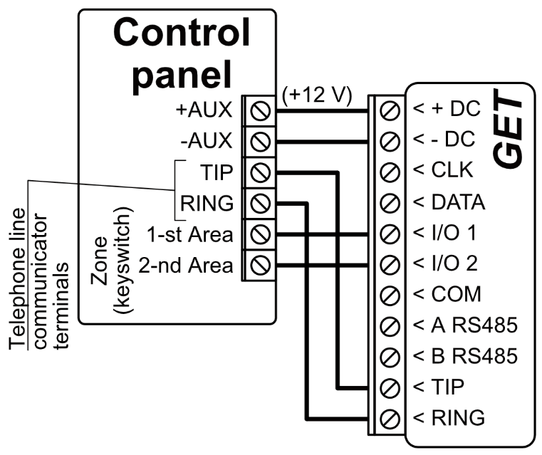

### Schematics for input connection

The communicator has 2 universal input / output terminals that can be set to input IN mode. NC, NO, NO / EOL, NC / EOL, NO / DEOL, NC / DEOL circuits can be connected to the input terminal. The input type can be changed in the ***TrikdisConfig*** window „**IN/OUT" -\> "Type".**

Connect the input according to the selected input type (NO, NC, NC/EOL, NO/EOL, NO/DEOL, NC/DEOL), as shown in the schemes below:

### Schematics for wiring a relay

With relay contacts you can control (turn on/off) various electric appliances. The I/O terminal of the communicator must be set to an output (OUT) mode.

### Turn on the communicator

To start the communicator, turn on the security control panel's power supply. This LED indication on the ***GET*** communicator must show:

- "POWER" LED illuminates green when the power is on;

- "NETWORK LTE" LED illuminates green and blinks yellow when the communicator is registered to the cellular network.

!!! note
    Sufficient strength of LTE signal is level three (three "NETWORK LTE" indicator flashes in yellow color).
    
    If you count less yellow "NETWORK LTE" LED flashes, the network signal strength is insufficient. We recommend to select a different place to install the communicator, or to use a more sensitive cellular antenna.
    
    If you see a different LED indication, it indicates a certain malfunction. Diagnose it by following the LED indication table in chapter 1.6 "LED indication of operation".
    
    If the ***GET*** indication does not illuminate at all, check the power supply and connections.
## Programming the control panel

### Programming of control panels when the communicator is connected to the keypad bus or serial bus

Below it is described how to program the security control panel so that the ***GET*** communicator could read events from the panel and control it remotely.

To enable remote control of the security panel, make sure that the checkbox "**Remote Arm/Disarm"** is selected in the ***TrikdisConfig*** window **"Panel settings".**

***DSC***

DSC panels do not need to be programmed.

***PARADOX***

Paradox control panels need to be programmed only for direct control with ***Protegus2***. You do not need to program Paradox panels for reading events.

For remote control of Paradox panels, you need to set up a PC download password. This password must match the password which was set in the ***TrikdisConfig*** window **"Panel settings"**, when the checkbox next to "**Remote Arm/Disarm"** was selected.

To set this password, with the keyboard connected to the security control panel:

- For MAGELLAN, SPECTRA series: go to cell 911 and enter 4-digit PC download password.

- For DIGIPLEX EVO series: go to cell 3012 and enter 4-digit PC download password.

***TEXECOM***

Texecom control panels need to be programmed for both reading events and remote control.

You need to set the Texecom panel's "**UDL** **passcode"**. This password must match the password which was set in the ***TrikdisConfig*** window **"Panel settings",** when the box next to"**Remote Arm/Disarm"** was selected.

The security control panel can be programmed with Texecom software - Wintex. Enter "**UDL passcode"** (4-digit code) in the"**Communication Options"** window, "**Options"** tab.

Also, you can program with a keypad connected to the security control panel:

1.  Enter the 4-digit installer's code and press the [Menu] button to enter the programming menu.

2.  Press the [9] key immediately afterwards.

3.  Press [7][6], and then [2]. Enter the 4-digit "**UDL** **passcode"** ("**UDL passcode"** must match the ***GET*** communicator's "**PC login password").**

4.  Press [Yes] and leave the programming mode by pressing [Menu].

***UTC INTERLOGIX (CADDX)***

With the keyboard connected to the security control panel:

5.  Press [\*][8] and enter the installer's code (default - 9713).

6.  Enter the device number assigned to the connected communicator (default - 0).

7.  Set the settings below for each row. In sequence, enter the position, segment number and the required setting. Clicking [\*] (asterisk) will return you to the local input field.

<table>
<colgroup>
<col style="width: 28%" />
<col style="width: 28%" />
<col style="width: 30%" />
</colgroup>
<thead>
<tr>
<th style="text-align: center;">Position</th>
<th style="text-align: center;">Segment</th>
<th style="text-align: center;"><em>Setting</em></th>
</tr>
</thead>
<tbody>
<tr>
<td style="text-align: center;">23</td>
<td style="text-align: center;">3</td>
<td style="text-align: center;">12345678</td>
</tr>
<tr>
<td rowspan="2" style="text-align: center;">37 (not necessary)</td>
<td style="text-align: center;">3</td>
<td style="text-align: center;">12345678</td>
</tr>
<tr>
<td style="text-align: center;">4</td>
<td style="text-align: center;">1234567*</td>
</tr>
<tr>
<td style="text-align: center;">90</td>
<td style="text-align: center;">3</td>
<td style="text-align: center;">12345678</td>
</tr>
<tr>
<td style="text-align: center;">93</td>
<td style="text-align: center;">3</td>
<td style="text-align: center;">12345678</td>
</tr>
<tr>
<td style="text-align: center;">96</td>
<td style="text-align: center;">3</td>
<td style="text-align: center;">12345678</td>
</tr>
<tr>
<td style="text-align: center;">99</td>
<td style="text-align: center;">3</td>
<td style="text-align: center;">12345678</td>
</tr>
<tr>
<td style="text-align: center;">102</td>
<td style="text-align: center;">3</td>
<td style="text-align: center;">12345678</td>
</tr>
<tr>
<td style="text-align: center;">105</td>
<td style="text-align: center;">3</td>
<td style="text-align: center;">12345678</td>
</tr>
<tr>
<td style="text-align: center;">108</td>
<td style="text-align: center;">3</td>
<td style="text-align: center;">12345678</td>
</tr>
</tbody>
</table>

After having programmed all the fields listed, press [Exit] twice to exit the programming mode.

***INNERRANGE***

**Innerrange Inception** security control panel version must be **2.3.0.3507-r0** or higher.

The control panel must be connected to the internet. Connect to **Innerrange Inception** by entering: <https://skytunnel.com.au/inception/SERIALNUMBER>, where SERIALNUMBER is the number of the controller that you can find on the panel's enclosure.

Open **Configuration \> General \> Alarm Reporting**. In the **3rd Party Device Configuration** settings group you need to enter:

1.  **Enable 3rd Party Device Reporting** - select this checkbox.

2.  **3rd Party Device Type** - set "Trikdis".

3.  **Serial port** - set "Serial Port 1 (Plugged In, In Use By 3rd Party Device)".

4.  Save settings and exit the application.

***HONEYWELL ADEMCO VISTA***

Follow these steps for **Honeywell Ademco Vista-20** and **Honeywell Ademco Vista-48** panels. **The panel's firmware version must be V5.3 or higher.** With a keypad that is connected to the panel:

1.  Enter the programming mode. Enter the installer code 4][1][1][2] and after that [8][0][0] . Alternatively, turn on the panel's power supply. In 50 seconds after the power supply is turned on, press the buttons [\*] and [#] at the same time (this method can be used when programming mode was exited by pressing in keypad [\*][9][8] ).

2.  Turn on the sending of Contact ID events via LRR. Press [\*][2][9][1][#] in keypad.

3.  When using the „Remote Arm/Disarm" function, allow to use the 2nd AUI address. In keypad press [\*][1][8][9][1][1][#] .

Exit the programming mode. In keypad press [\*][9][9].

### Programming of control panels when the communicator is connected to the TIP/RING terminals of the control panel

For the control panel to send events via the landline dialer, it must be turned on and properly set up. Following the panel's programming manual, configure the control panel's landline dialer:

1.  Turn on the panel's PSTN landline dialer.

2.  Enter the monitoring station receiver's telephone number (you can use any number longer than 4 digits. The ***GET*** communicator will pick up and answer when the panel calls to any phone number).

3.  Choose DTMF mode.

4.  Select Contact ID communication protocol.

5.  Enter the panel's 4 digit account number.

The control panel zone to which the ***GET*** output OUT is connected should be set to keyswitch zone for arming/disarming the control panel remotely.

!!! note
    Keyswitch zone can be momentary (pulse) or level. By default, the ***GET*** controllable output OUT is set to 3 second pulse mode. You can change the impulse duration or change to level mode in ***Protegus2*** settings. See chapter **5**.2 "Additional settings to arm/disarm the system using the control panel's keyswitch zone".
***PROGRAMMING HONEYWELL VISTA LANDLINE DIALER***

Using the control panel's keypad enter these sections and set them as described:

- \*41 -- enter monitoring station receiver telephone number;

- \*43 -- enter control panel's account number;

- \*47 -- set the Tone dial to [1] and enter the number of dial attempts;

- \*48 -- use default setting, \*48 must be set to 7;

- \*49 -- Split/Dual message. \*49 must be set to 5;

- \*50 -- delay for sending burglary alarm events (optional). Default value is [2,0]. With it the event message transmission will be delayed for 30 seconds. If you want the message to be sent immediately, set [0,0].

When all required settings are set, it is necessary to exit programming mode. Enter \*99 in keypad.

***SPECIAL SETTINGS FOR HONEYWELL VISTA 48 PANEL***

If you want to use ***GET*** communicator with Honeywell Vista 48 panel, set the following sections as described:

| Section | Data                             | Section | Data | Section | Data |
|:-------:|:---------------------------------|:-------:|:----:|:-------:|:----:|
|  \*41   | 1111 (receiver telephone number) |  \*60   |  1   |  \*69   |  1   |
|  \*42   | 1111                             |  \*61   |  1   |  \*70   |  1   |
|  \*43   | 1234 (panel account number)      |  \*62   |  1   |  \*71   |  1   |
|  \*44   | 1234                             |  \*63   |  1   |  \*72   |  1   |
|  \*45   | 1111                             |  \*64   |  1   |  \*73   |  1   |
|  \*47   | 1                                |  \*65   |  1   |  \*74   |  1   |
|  \*48   | 7                                |  \*66   |  1   |  \*75   |  1   |
|  \*50   | 1                                |  \*67   |  1   |  \*76   |  1   |
|  \*59   | 0                                |  \*68   |  1   |         |      |

When all required settings are set, it is necessary to exit programming mode. Enter \*99 in keypad.

***UTC INTERLOGIX(CADDX)***

Programming of the **Interlogix NX-4V2** (**NX-6V2, NX-8V2**) control panel when the communicator is connected to the TIP/RING terminals of the control panel.

<table>
<colgroup>
<col style="width: 13%" />
<col style="width: 20%" />
<col style="width: 58%" />
</colgroup>
<thead>
<tr>
<th></th>
<th>Keypad Entry</th>
<th>Description</th>
</tr>
</thead>
<tbody>
<tr>
<td></td>
<td>*89713</td>
<td>Enter programming mode</td>
</tr>
<tr>
<td></td>
<td>0#</td>
<td></td>
</tr>
<tr>
<td rowspan="2">Location 0</td>
<td>0#</td>
<td></td>
</tr>
<tr>
<td>1*2*3*4*#</td>
<td></td>
</tr>
<tr>
<td rowspan="2">Location 1</td>
<td>1#</td>
<td></td>
</tr>
<tr>
<td>1*2*3*4*#</td>
<td></td>
</tr>
<tr>
<td rowspan="2">Location 2</td>
<td>2#</td>
<td></td>
</tr>
<tr>
<td>1*#</td>
<td></td>
</tr>
<tr>
<td rowspan="3">Location 4</td>
<td>4#</td>
<td></td>
</tr>
<tr>
<td>12345678*</td>
<td>All zones LEDs are ON (segment 1)</td>
</tr>
<tr>
<td>12345678*#</td>
<td>All zones LEDs are ON (segment 2)</td>
</tr>
<tr>
<td rowspan="3">Location 23</td>
<td>23#</td>
<td></td>
</tr>
<tr>
<td>**</td>
<td></td>
</tr>
<tr>
<td>12345678*#</td>
<td>All zones LEDs are ON (segment 3)</td>
</tr>
<tr>
<td rowspan="4">Location 37</td>
<td>37#</td>
<td></td>
</tr>
<tr>
<td>**</td>
<td></td>
</tr>
<tr>
<td>12345678*</td>
<td>All zones LEDs are ON (segment 3)</td>
</tr>
<tr>
<td>12345678*#</td>
<td>All zones LEDs are ON (segment 4)</td>
</tr>
<tr>
<td></td>
<td>EXIT EXIT</td>
<td>Exit programming mode</td>
</tr>
</tbody>
</table>

## Remote control

### Adding the security system to Protegus2 app

With ***Protegus2*** users will be able to control their alarm system remotely. They will see the status of the system and receive notifications about system events.

1.  Download and launch the ***Protegus2*** application or use the browser version: <u>[web.protegus.app</u>](https://web.protegus.app/login).

2.  Log in with your user name and password or register and create new account.

!!! warning "Important"
    When adding the ***GET*** communicator to ***Protegus2*** check if:
    
    1.  The inserted SIM card is activated and the PIN code is either entered or disabled;
    
    2.  Or a LAN cable is connected.
    
    3.  \*\*\*"Protegus\*\*\* ***cloud"*** is enabled. See chapter 6.5 "User reporting" window;
    
    4.  Power supply is connected ("POWER" LED illuminates green);
    
    5.  Registered to the network ("NETWORK LTE" LED illuminates green and blinks yellow).
3.  Click "**Add new system"** and enter the ***GET***'s"*IMEI/Unique ID*" number. This number can be found on the device and the packaging sticker. Click "**Next"**.

4.  Enter the system „**Name**". Click "**Next**".

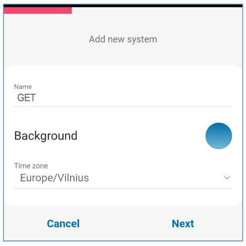

### Additional settings to arm/disarm the system using the control panel's keyswitch zone

!!! warning "Important"
    The control panel zone to which the ***GET*** output OUT is connected to has to be set to keyswitch mode.
Follow the instructions below if the security control panel will be controlled with a ***GET*** PGM output, turning on/off the control panel keyswitch zone.

1.  Click „**Continue**".

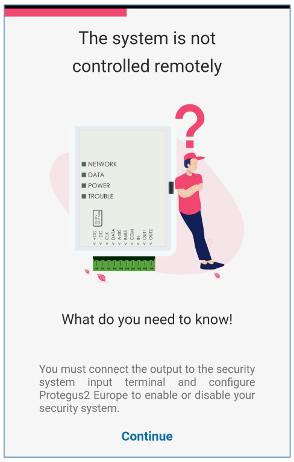

2.  Enter "**Area name**". Enable PGM output control using the ***Protegus2*** application.

<!-- -->

3.  Select "**Pulse**" or "**Level**", depending on how the keyswitch zone type is configured. If necessary, you can change the "**Pulse**" interval.

4.  Click „**Save**".

5.  If there is another Area for the security system, then you need to click "**Click to add an area**". Setting up the PGM output is similar to that described above.

6.  After completing the settings, click the "**Skip**" button.

### Arming/disarming the alarm system with Protegus2

1.  In the "System Home Screen" window, click on the "Disarm" status icon.

2.  *Protegus2* will receive a message about a change in the status of the security system and the status icon will change its state.

## TrikdisConfig window description

### *TrikdisConfig* status bar description

After connecting the ***GET*** communicator and clicking **Read [F4], *TrikdisConfig*** will provide information about the connected device in the status bar:

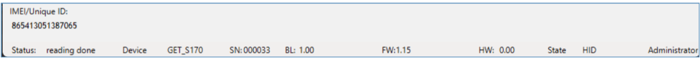

<table>
<colgroup>
<col style="width: 22%" />
<col style="width: 70%" />
</colgroup>
<thead>
<tr>
<th>

Object

</th>
<th>

Description

</th>
</tr>
</thead>
<tbody>
<tr>
<td>

IMEI/​Unique ID

</td>
<td>

Device IMEI number

</td>
</tr>
<tr>
<td>

Status

</td>
<td>

Operating condition

</td>
</tr>
<tr>
<td>

Device

</td>
<td>

Device type (<strong><em>GET</em></strong> should be shown)

</td>
</tr>
<tr>
<td>

SN

</td>
<td>

Device serial number

</td>
</tr>
<tr>
<td>

BL

</td>
<td>

Browser version

</td>
</tr>
<tr>
<td>

FW

</td>
<td>

Device firmware version

</td>
</tr>
<tr>
<td>

HW

</td>
<td>

Device hardware version

</td>
</tr>
<tr>
<td>

State

</td>
<td>

Connection to program type (via USB or remote)

</td>
</tr>
<tr>
<td>

Administrator

</td>
<td>

Access level (shown after access code is approved)

</td>
</tr>
</tbody>
</table>

After pressing **Read [F4]**, the program will read and show the settings which are set in the ***GET*.** Set the necessary settings according to the ***TrikdisConfig*** window descriptions given below.

### "System settings" window

**"General" settings group**

- **Object ID** -- if the events will be sent to the CMS (Central Monitoring Station), enter the account number provided by the CMS (6 characters hexadecimal number, 0-9, A-F. **Do not use FFFE, FFFF Object ID**).

- **Module ID** -- enter the identification number of the module.

- **Time set** - select which server to use for time synchronization.

**"Access" settings group**

When setting up the communicator ***GET*** there are two levels of access for, the administrator and the installer:

- **Administrator code -** allows you to access all configuration fields (default code - 123456).

- **Installer code** - limited access for configuring the communicator (default code - 654321).

- **Only an administrator can restore** - if the box is checked, factory settings can be restored only by entering the administrator code.

- **Allow installer to change** -- the administrator can specify which settings can be changed by the installer.

### "Panel settings" window

**"TLC" settings group**

The communicator is connected to the TIP RING terminals of the telephone communicator of the control panel.

- **Communication protocol** -- enable/disable DTMF landline interface on the communicator.

- **First HSK tone / Second HSK tone** -- handshake" tone of control panel.

- **Use security panel account ID** -- if the box is marked with a check mark, the communicator will not send the value set in the "**Object ID**" field, but the object number entered in the control panel.

- **Wait acknowledgment from CMS --** if the box is marked with a check mark, after sending each event message, the communicator will wait for confirmation from the IP receiver that it has successfully received the message. If the communicator does not receive a confirmation signal, it will not generate a "kiss-off" signal. If the communication end signal is not received, the control panel's telephone communicator will repeat the event message.

- **Dial tone frequency** - the frequency at which the communicator communicates with the control panel through the telephone communicator.

  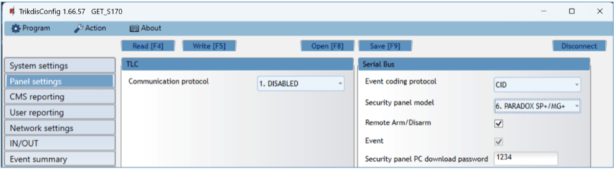

**"Serial bus" settings group**

The communicator is connected to the control panel via a Serial Bus.

- **Event coding protocol** -- select the event reporting protocol (CID or SIA).

- **Security panel model** -- select the control panel model that will be connected to the communicator.

- **Remote Arm/Disarm** -- when the checkbox is selected, the ***GET*** will directly control the control panel remotely. This setting will be visible only for directly controlled panels. For direct control of the control panels you need to change the panel settings, as described in section 4.1 "Programming of control panels when the communicator is connected to the keypad bus or serial bus".

- **Event** -- check the box so that the communicator sends events to the CMS and to ***Protegus2***.

- **Security panel PC download password** - for the direct control of Paradox and Texecom control panels you need to enter the PC/UDL password. It must match the password that was entered in the control panel. How to change this password is described in section 4.1 "Programming of control panels when the communicator is connected to the keypad bus or serial bus"*.*

### "CMS reporting" window

**"CMS settings" tab**

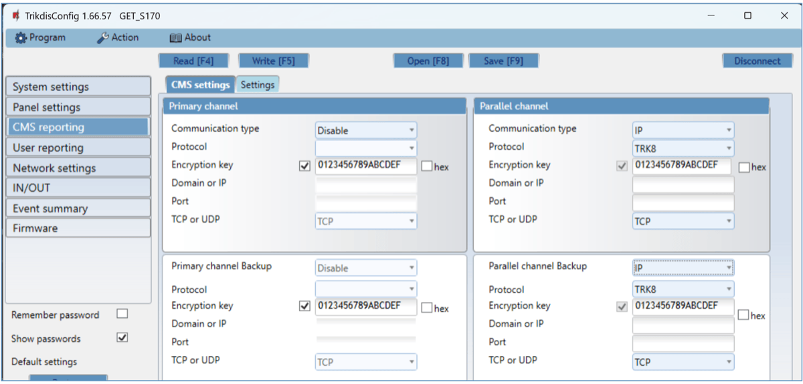

Events can be sent over several channels of communication. The primary and parallel communication channels can operate simultaneously, this way the communicator can send events to two receivers at the same time. Backup channels can be assigned for both primary and parallel channels, which will be used when the connection via the primary or parallel channel is interrupted.

Communication is encoded and password protected. A TRIKDIS receiver is required for receiving and sending event information to the monitoring programs:

- **For connection over IP** - software receiver IPcom Windows/Linux, hardware IP/SMS receiver RL14 or multichannel receiver RM14.

**"Primary channel" settings group**

- **Communication type** - select the method of communication with the monitoring station receiver (**IP).**

- **Protocol** - select in which coding the events should be sent: **TRK8** (to TRIKDIS receivers), **DC-09_2007** or **DC-09_2012** (to universal receivers), **TL150** (to SUR-GUARD receivers).

- **Encryption key** - 6-digit message encryption key. The key written to the communicator must match the receiver's key.

- **Domain or IP** - enter the domain or IP address of the receiver.

- **Port** - enter the network port number of the receiver.

- **TCP or UDP** - select in which protocol (TCP or UDP) the events should be sent.

**"Primary channel Backup" settings group**

Enable the backup channel mode to send events via backup channel if connection via primary channel is lost. Backup channel settings are same as described above.

"Parallel channel" settings group

Events are transmitted in parallel with the primary channel through this channel. When the second channel is enabled, events can be sent simultaneously to two receivers (e.g., local and centralized monitoring stations). Parallel channel settings are the same as described above.

**"Settings" tab**

**"Settings" settings group**

- **Test period** - TEST event period for testing the connection. Test events are sent as Contact ID messages and forwarded to the monitoring software.

- **IP ping period** -- period for sending internal PING heartbeats. These messages are only sent via IP channel. The receiver will not forward PING messages to the monitoring software to avoid overloading it. Notifications will only be sent to the monitoring software if the receiver fails to receive PING messages from the device within the set time.

  By default, the "*Connection lost"* notification will be transmitted to the monitoring software if the PING message is not received by the receiver over a time period three times longer than set in the device. E.g. if the PING period is set for 3 minutes, the receiver will transfer the *"Connection lost"* notification if a PING message is not received within 9 minutes.

  PING messages keep the active communication session between the device and the receiver. An active session is required for remote connection, control and configuration of the device. We recommend setting the PING period for no more than 5 minutes.

- **Backup reporting after** - indicates the number of unsuccessful attempts to send the message via "**Primary**" channel. If device fails to transmit specified number of times, the device will connect to transmit the messages via "**Backup**" channel.

- **Return from backup after** - time after which the communicator ***GET*** will attempt to reconnect and transmit messages via the Primary channel.

  - **Line No.** - enter line number of the receiver.

- **Receiver No.** - enter the receiver number.

**"Reporting mode" settings group**

For setting parameters on how the control panel will communicate with the CMS channels and with ***Protegus2***. The connection types are specified in order. If the control panel fails to connect using the "**Main type"** connection , it switches to the"**Backup type"**, and so on. If the backup connection type was successful in transmitting the message to the CMS, then the "**Return to main"** connection type will be attempted after the specified time interval.

- **Main type** -- select a connection type (LAN, SIM1, SIM2) with the CMS receiver and ***Protegus2***.

- **Backup type** -- select a connection type (LAN, SIM1, SIM2) with the CMS receiver and ***Protegus2***.

- **Backup type 2** -- select a connection type (LAN, SIM1, SIM2) with the CMS receiver and ***Protegus2***.

- **Communication path test** -- specify the time period for which the selected connection types should be tested (LAN, SIM1, SIM2).

[]{#_Ref526770803}

### "User reporting" window

**"PROTEGUS cloud" tab**

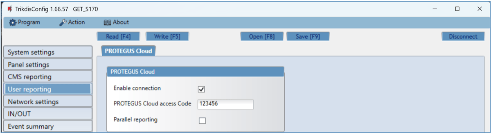

***Protegus2*** service allows users to remotely monitor and control the communicator. For more information about ***Protegus2*** service, visit [www.protegus.eu](http://www.protegus.eu).

**"Protegus Cloud" settings group**

- **Enable connection** -- enable the ***Protegus2*** service, the ***GET*** communicator will be able to exchange data with ***Protegus2*** app and to be remotely configured via ***TrikdisConfig*.**

- **Protegus Cloud access Code -** 6-digit code for connecting to the ***Protegus2*** app (default - 123456).

- **Parallel reporting** -- allow parallel report sending using the *primary channel* and to ***Protegus2***. Reports will only be sent to ***Protegus2*** and to users after they've been sent to the security company.

### "Network settings" window

**"LAN" tab**

**These settings must be made if the communicator is connected to a LAN network.**

**"Ethernet settings" settings group**

- **Use DHCP** - check the box to have the communicator automatically register to the network. If the auto-register fails, you will need to enter it manually:

<!-- -->

- **Static IP** -- static IP address for when manual registering mode is set.

- **Subnet mask** -- subnet mask for when manual registering mode is set.

- **Default gateway** -- gateway address for when manual registering mode is set.

<!-- -->

- **DNS1, DNS2** - (Domain Name System) identifies the server that specifies the IP address of the domain. Used when domain is set in the communication channel "**Domain or IP"** field (not IP address). Google DNS server is set by default. **Regardless of IP settings, make sure the DNS addresses match those supported by your ISP.**

**"SIM1" tab**

!!! warning "Important"
    1. Ensure that the SIM card is activated and working before using it.
    
    2\. Ensure that mobile data service is enabled.

**These settings must be made if the SIM card is inserted into the SIM1 slot of the communicator.**

**"SIM card" settings group**

- **SIM card PIN** - enter the SIM card PIN code. This code can be disabled by inserting the SIM card into a mobile phone and disabling the request. If you disabled the SIM card PIN request, leave the default value in this field.

- **APN** - enter APN (Access Point Name). It is required for connecting the communicator to the internet. APN can be found on the website of the SIM card operator ("internet" is universal and works in the networks of many operators).

- **Login, Password** - if required, enter the user name (login) and password for connection to the internet.

- **SIM ICCID** - enter the ICCID number of the SIM card if you want the communicator to work only with this SIM card.

- **DNS1, DNS2** - (Domain Name System) identifies the server that specifies the IP address of the domain. Used when domain is set in the communication channel Domain or IP field (not IP address). Google DNS server is set by default. **Regardless of IP settings, make sure the DNS addresses match those supported by your ISP.**

<!-- -->

- **Preferred operator** -- after entering the mobile network operator code, the communicator will connect only to the network of the selected operator. The mobile operator code consists of MCC and MNS codes.

**"SIM2" tab**

**These settings must be made if the SIM card is inserted into the SIM2 slot of the communicator.**

**"SIM card" settings group**

- **SIM card PIN** - enter the SIM card PIN code. This code can be disabled by inserting the SIM card into a mobile phone and disabling the request. If you disabled the SIM card PIN request, leave the default value in this field.

- **APN** - enter APN (Access Point Name). It is required for connecting the communicator to the internet. APN can be found on the website of the SIM card operator ("internet" is universal and works in the networks of many operators).

- **Login, Password** - if required, enter the user name (login) and password for connection to the internet.

- **SIM ICCID** - enter the ICCID number of the SIM card if you want the communicator to work only with this SIM card.

- **DNS1, DNS2** - (Domain Name System) identifies the server that specifies the IP address of the domain. Used when domain is set in the communication channel Domain or IP field (not IP address). Google DNS server is set by default. **Regardless of IP settings, make sure the DNS addresses match those supported by your ISP.**

<!-- -->

- **Preferred operator** -- after entering the mobile network operator code, the communicator will connect only to the network of the selected operator. The mobile operator code consists of MCC and MNS codes.

### "IN/OUT" windows

The communicator has 2 universal (input / output) terminals. The table can set the terminal operating mode (Disabled, IN, OUT). The input must specify the type of circuit to be connected NC, NO, NO / EOL, NC / EOL, NO / DEOL, NC / DEOL.

Additional sensors can be connected to the communicator inputs. When the sensor is triggered, the communicator will send an event message. The input is assigned a Contact ID (SIA) code, which will be sent to CMS and ***Protegus2***.

- **Enable** -- checked event fields where messages will be sent to CMS and ***Protegus2***.

- **E/R** -- choose what type of event will be sent when input is triggered -- "**Event"** or"**Restore"**.

- **CID** -- enter the event code or leave the default value. Upon entering the event, the event code will be sent to ***Protegus2*** and CMS.

- **SIA** - -- enter the event code or leave the default value. Upon entering the event, the event code will be sent to ***Protegus2*** and CMS.

- **Part**. -- enter the partition (area) number that will be sent when an internal event occurs and the system is restored.

- **Zone** - enter the zone number that will be sent when an internal event occurs and the system is restored.

### "Event summary" window

In this window, you can enable, disable and modify internal messages sent by your device. Disabling an internal message in this window will prevent it from being sent regardless of other settings.

- **COMMUNICATION** -- message about connection error between the control panel and communicator.

- **LAN_FAILURE** - LAN communication failure message.

- **POWER** -- message about low power supply voltage.

- **REMOTE_FINISHED** -- message about disconnection from remote configuration with ***TrikdisConfig***.

- **REMOTE_STARTED** -- message about remote connection to configure ***GET*** with ***TrikdisConfig***.

- **SIM1_FAILURE** - mobile communication failure message.

- **SIM2_FAILURE** - mobile communication failure message.

- **TEST** -- periodic test message.

!!! note
    To enable periodic TEST messages and set their period, go to "**CMS reporting" -\> "Settings" -\> "Test period"**.
- **Enable** -- when selected, the sending of messages is enabled.

You can change the Contact ID (SIA) code for each event, and also the zone and partition number.

### Restoring factory settings

To restore the communicator's factory settings, you need to click the "**Restore"** button in the ***TrikdisConfig*** window.

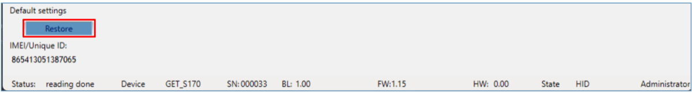

Another way to restore factory settings.

Power supply is connected to the communicator. Press and hold the "RESET" button on the communicator PCB board. Hold the "RESET" button pressed for 10 seconds until the LED indicators ("NETWORK", "POWER", "TROUBLE") turn off and the LED "POWER" indicator lights up. Release the "RESET" button. The communicator's factory settings have been restored.

## Remote configuration

!!! warning "Important"
    Remote configuration will work only if:
    
    1.  The inserted SIM card is activated and the PIN code is either entered or disabled;
    
    2.  Or a LAN cable is connected.
    
    3.  "***Protegus*** ***cloud***" is enabled. How to enable cloud is described in section 6.5 "User reporting" window;
    
    4.  Power supply is connected ("POWER" LED illuminates green);
    
    5.  Registered to the cellular network ("NETWORK LTE" LED illuminates green and blinks yellow).
1.  Start the configuration program ***TrikdisConfig***.

2.  In the "**Remote access"** section enter the communicator's"**IMEI/Unique ID"** number. This number can be found on the device and the packaging sticker.

3.  (Optional) in the "**System name"** field, enter the desired name for the communicator with this Unique ID.

4.  Press "**Configure"**.

5.  In the newly opened window click **Read [F4]**. If required, enter the administrator or installer code*.* To save the password, select **"Remember password"**.

6.  Set the necessary settings and when finished, click **Write [F5]**.

## Test communicator performance

When the configuration and installation is complete, perform a system check:

1.  Generate an event:

- by arming/disarming the system with the control panel's keypad;

- by triggering a zone alarm when the security system is armed.

2.  Make sure that the event arrives to the CMS (Central Monitoring Station) and/or is received in the ***Protegus2*** application.

3.  To test communicator input, trigger it and make sure to receive the correct event.

4.  To test the communicator outputs, activate them remotely and check their operation.

5.  If the security control panel will be controlled remotely, arm/disarm the security system remotely by using the ***Protegus2*** app.

## Firmware update

!!! note
    When the communicator is connected to ***TrikdisConfig***, the program will automatically offer to update the device's firmware if updates are present. Updates require an internet connection. Antivirus software, firewall or strict access to internet settings can block the automatic firmware updates. In this case, you will need to reconfigure your antivirus program.
The communicator's firmware can also be updated or changed manually. After an update, all previously set settings will remain unchanged. When writing firmware manually, it can be changed to a newer or older version. To update:

1.  Run ***TrikdisConfig**.*

2.  Connect the communicator via USB cable to the computer or connect to the communicator remotely.

    - If a newer firmware version exists, the software will offer to download the newer firmware version file.

3.  Select the menu branch "**Firmware"**.

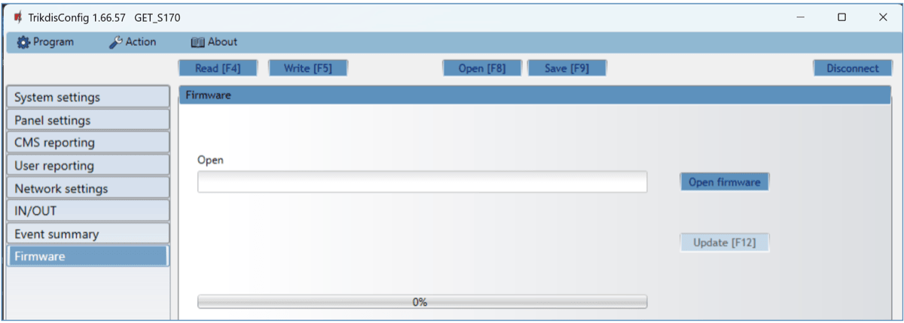

4.  Press "**Open firmware"** and select the required firmware file.

5.  Press **Update [F12]**.

6.  Wait for the update to complete.

## Annex

The communicator converts Contact ID codes received from the alarm control panel into SIA codes.

**Contact ID to SIA code conversion table**

| **System Event** | **CID Report Code** | **SIA Report Code** |
|:---|:--:|:--:|
| Medical alarm | E100 | "MA" |
| Personal emergency | E101 | "QA" |
| Fire in zone: \<z\> | E110 | "FA" |
| Water flow detected in zone: \<z\> | E113 | "SA" |
| Pull station alarm in zone: \<z\> | E115 | "FA" |
| Panic in zone: \<z\> | E120 | "PA" |
| Panic alarm by user: \<v\> | E121 | "HA" |
| Panic alarm in zone: \<z\> | E122 | "PA" |
| Panic alarm in zone: \<z\> | E123 | "PA" |
| Panic alarm in zone: \<z\> | E124 | "HA" |
| Panic alarm in zone: \<z\> | E125 | "HA" |
| Alarm active in zone: \<z\> | E130 | "BA" |
| Alarm active in zone: \<z\> | E131 | "BA" |
| Alarm active in zone: \<z\> | E132 | "BA" |
| Alarm active in zone: \<z\> | E133 | "BA" |
| Alarm active in zone: \<z\> | E134 | "BA" |
| Alarm active in zone: \<z\> | E135 | "BA" |
| Tamper active in zone: \<z\> | E137 | "TA" |
| Intrusion verified in zone: \<z\> | E139 | "BV" |
| Alarm active in zone: \<z\> | E140 | "UA" |
| System failure (143) | E143 | "ET" |
| Tamper active in zone: \<z\> | E144 | "TA" |
| Tamper active in zone: \<z\> | E145 | "TA" |
| Alarm active in zone: \<z\> | E146 | "BA" |
| Alarm active in zone: \<z\> | E150 | "UA" |
| Gas detected in zone: \<z\> | E151 | "GA" |
| Water leakage detected in zone: \<z\> | E154 | "WA" |
| Foil break detected in zone: \<z\> | E155 | "BA" |
| High temperature at sensor: \<n\> | E158 | "KA" |
| Low temperature at sensor: \<n\> | E159 | "ZA" |
| CO detected in zone: \<z\> | E162 | "GA" |
| Fire failure in zone: \<z\> | E200 | "FS" |
| Monitored alarm | E220 | "BA" |
| System failure (300) | E300 | "YP" |
| AC power supply loss | E301 | "AT" |
| Low battery | E302 | "YT" |
| System failure (304) | E304 | "YF" |
| System reset in zone: \<z\> | E305 | "RR" |
| Panel programming changed | E306 | "YG" |
| System shutdown | E308 | "RR" |
| Battery failure (309) | E309 | "YT" |
| Ground fault | E310 | "US" |
| Battery failure (311) | E311 | "YM" |
| Power supply overcurrent (312) | E312 | "YP" |
| Engineer reset by user: \<v\> (313) | E313 | "RR" |
| Sounder/Relay failure | E320 | "RC" |
| System failure (321) | E321 | "YA" |
| System failure (330) | E330 | "ET" |
| System failure (332) | E332 | "ET" |
| System failure (333) | E333 | "ET" |
| System failure (336) | E336 | "VT" |
| System failure (338) | E338 | "ET" |
| System failure (341) | E341 | "ET" |
| System failure (342) | E342 | "ET" |
| System failure (343) | E343 | "ET" |
| System failure (344) | E344 | "XQ" |
| System communication failure (350) | E350 | "YC" |
| System communication failure (351) | E351 | "LT" |
| System communication failure (352) | E352 | "LT" |
| System failure (353) | E353 | "YC" |
| System communication failure (354) | E354 | "YC" |
| System failure (355) | E355 | "UT" |
| Fire trouble in zone: \<z\> | E373 | "FT" |
| Trouble in zone: \<z\> | E374 | "EE" |
| Trouble in zone: \<z\> | E378 | "BG" |
| Trouble in zone: \<z\> | E380 | "UT" |
| Wireless zone fault: \<z\> | E381 | "US" |
| Wireless module failure (382) | E382 | "UY" |
| Tamper active in zone: \<z\> | E383 | "TA" |
| Low battery in wireless zone: \<z\> | E384 | "XT" |
| Trouble in zone: \<z\> (389) | E389 | "ET" |
| Trouble in zone: \<z\> (391) | E391 | "NA" |
| Trouble in zone: \<z\> (393) | E393 | "NC" |
| User \<v\> disarmed the system | E400 | "OP" |
| User \<v\> disarmed the system | E401 | "OP" |
| Automatic disarm | E403 | "OA" |
| Deferred disarm \<v\> user | E405 | "OR" |
| Alarm cancelled by user: \<v\> | E406 | "BC" |
| User \<v\> disarmed remotely | E407 | "OP" |
| Quick disarm | E408 | "OP" |
| Remote disarm | E409 | "OS" |
| Call back request made by CMS | E411 | "RB" |
| Successful data download | E412 | "RS" |
| Entry access denied for user \<v\> | E421 | "JA" |
| Entry by user \<v\> | E422 | "DG" |
| Forced Access \<z\> zone | E423 | "DF" |
| Exit access denied for user \<v\> | E424 | "DD" |
| Exit by user \<v\> | E425 | "DR" |
| User \<v\> disarmed too early | E451 | "OK" |
| User \<v\> armed too late | E452 | "OJ" |
| User \<v\> Failed to Disarm | E453 | "CT" |
| User \<v\> Failed to Arm | E454 | "CI" |
| Auto arm failed | E455 | "CI" |
| Partial arm by user: \<v\> | E456 | "CG" |
| Exit violation by user: \<v\> | E457 | "EE" |
| System disarmed after alarm by user: \<v\> | E458 | "OR" |
| Recent arm \<v\> user | E459 | "CR" |
| Wrong code entered | E461 | "JA" |
| Auto-arm time extended by user: \<v\> | E464 | "CE" |
| Device disabled (501) | E501 | "RL" |
| Device disabled (520) | E520 | "RO" |
| Wireless sensor disabled in zone:\<z\> (552) | E552 | "YS" |
| Zone \<z\> bypassed | E570 | "UB" |
| Zone \<z\> bypassed | E571 | "FB" |
| Zone \<z\> bypassed | E572 | "MB" |
| Zone \<z\> bypassed | E573 | "BB" |
| Group bypass by user: \<v\> | E574 | "CG" |
| Zone \<z\> bypassed | E576 | "UB" |
| Zone \<z\> bypass cancelled | E577 | "UB" |
| Vent zone bypass | E579 | "UB" |
| Walk test activated by user:\<v\> | E607 | "TS" |
| Manual test report | E601 | "RX" |
| Periodic test report | E602 | "RP" |
| System event (605) | E605 | "JL" |
| System event (606) | E606 | "LF" |
| Periodic test report with trouble | E608 | "RY" |
| System event (622) | E622 | "JL" |
| System event (623) | E623 | "JL" |
| Time/Date was reset by user \<v\> | E625 | "JT" |
| Inaccurate Time/Date | E626 | "JT" |
| System programming started | E627 | "LB" |
| System programming finished | E628 | "LS" |
| System event (631) | E631 | "JS" |
| System event (632) | E632 | "JS" |
| System not active (654) | E654 | "CD" |
| Medical alarm restored | R100 | "MH" |
| Personal emergency restored | R101 | "QH" |
| No more fire alarm in zone :\<z\> | R110 | "FH" |
| No more water flow alarm in zone:\<z\> | R113 | "SH" |
| Panic alarm restored in zone:\<z\> | R120 | "PH" |
| Panic alarm cancelled by user: \<v\> | R121 | "HH" |
| Panic alarm restored in zone:\<z\> | R122 | "PH" |
| Panic alarm restored in zone: \<z\> | R123 | "PH" |
| Panic alarm restored in zone: \<z\> | R124 | "HH" |
| Panic alarm restored in zone: \<z\> | R125 | "HH" |
| No more alarm in zone: \<z\> | R130 | "BH" |
| No more alarm in zone: \<z\> | R131 | "BH" |
| No more alarm in zone: \<z\> | R132 | "BH" |
| No more alarm in zone: \<z\> | R133 | "BH" |
| No more alarm in zone: \<z\> | R134 | "BH" |
| No more alarm in zone: \<z\> | R135 | "BH" |
| No more tamper in zone: \<z\> | R137 | "TA" |
| No more alarm in zone:\<z\> | R140 | "UH" |
| No more system failure (143) | R143 | "UR" |
| No more tamper in zone: \<z\> | R144 | "TR" |
| No more tamper in zone: \<z\> | R145 | "TR" |
| No more alarm in zone: \<z\> | R146 | "BH" |
| No more alarm in zone: \<z\> | R150 | "UH" |
| No more gas alarm in zone:\<z\> | R151 | "GH" |
| No more water leakage alarm in zone: \<z\> | R154 | "WH" |
| Foil break restored in zone: \<z\> | R155 | "BH" |
| Temperature has normalized at sensor: \<n\> | R158 | "KH" |
| Temperature has normalized at sensor: \<n\> | R159 | "ZH" |
| No more CO alarm in zone: \<z\> | R162 | "GH" |
| No more fire failure in zone: \<z\> | R200 | "FV" |
| Monitored restore alarm | R220 | "BH" |
| No more system failure (300) | R300 | "YA" |
| AC power supply OK | R301 | "AR" |
| Battery OK | R302 | "YR" |
| No more system failure (304) | R304 | "YG" |
| System reset restored in zone: \<z\> | R305 | "RR" |
| No more battery failure (309) | R309 | "YR" |
| Restore ground fault | R310 | "UR" |
| No more battery failure (311) | R311 | "YR" |
| Restore power supply overcurrent (312) | R312 | "YQ" |
| No more sounder/Relay failure | R320 | "RO" |
| No more system failure (321) | R321 | "YH" |
| No more system failure (330) | R330 | "ER" |
| No more system failure (332) | R332 | "ER" |
| No more system failure (333) | R333 | "ER" |
| No more system failure (336) | R336 | "VR" |
| No more system failure (338) | R338 | "ER" |
| No more system failure (341) | R341 | "ER" |
| No more system failure (342) | R342 | "ER" |
| No more system failure (344) | R344 | "XH" |
| No more system communication failure (350) | R350 | "YK" |
| No more system communication failure (351) | R351 | "LR" |
| No more system communication failure (352) | R352 | "LR" |
| No more system failure (353) | R353 | "YK" |
| No more system communication failure (354) | R354 | "YK" |
| No more system failure (355) | R355 | "UJ" |
| Fire trouble restored in zone: \<z\> | R373 | "FJ" |
| No more trouble in zone: \<z\> | R374 | "EA" |
| No more trouble in zone: \<z\> | R380 | "UJ" |
| No more wireless zone fault: \<z\> | R381 | "UR" |
| No more wireless module failure (382) | R382 | "BR" |
| No more tamper in zone: \<z\> | R383 | "TR" |
| Battery OK in wireless zone: \<z\> | R384 | "XR" |
| No more trouble in zone: \<z\> (391) | R391 | "NS" |
| No more trouble in zone: \<z\> (393) | R393 | "NS" |
| User \<v\> armed the system | R400 | "CL" |
| User \<v\> armed the system | R401 | "CL" |
| Automatic arm | R403 | "CA" |
| User \<v\> armed remotely | R407 | "CL" |
| Quick arm | R408 | "CL" |
| Remote arm | R409 | "CS" |
| User \<v\> armed to Stay mode | R441 | "CG" |
| User \<v\> armed too early | R451 | "CK" |
| User \<v\> disarmed too late | R452 | "CJ" |
| User \<v\> Failed to Disarm | R454 | "CI" |
| Partial Arm by user: \<v\> | R456 | "CG" |
| Recent disarm \<v\> user | R459 | "CR" |
| Device enabled (501) | R501 | "RG" |
| Device enabled (520) | R520 | "RC" |
| Wireless sensor enabled in zone: \<z\> (552) | R552 | "YK" |
| Zone \<z\> bypass cancelled | R570 | "UU" |
| Zone \<z\> bypass cancelled | R571 | "FU" |
| Zone \<z\> bypass cancelled | R572 | "MU" |
| Zone \<z\> bypass cancelled | R573 | "BU" |
| Group bypass by user: \<v\> cancelled | R574 | "CF" |
| Zone \<z\> bypass cancelled | R576 | "UU" |
| Zone \<z\> bypass cancelled | R577 | "UU" |
| Vent zone bypass cancelled | R579 | "UU" |
| Walk test deactivated by user \<v\> | R607 | "TE" |
| Time/Date was reset by user \<v\> | R625 | "JT" |
| System active (654) | R654 | "CD" |
