# Transmitter T16

## Description 

RF transmitter T16 is a multifunctional radio device used for transmitting security control panel event messages via TRIKDIS radio networks.

The transmitter can send its own event messages and event messages received from security control panels to the CMS (central monitoring station) with the possibility to forward to the end user.

#### Features

**Communication**

- Sends event messages to CMS.

- RAS3, RAS2M, LARS1, LARS radio network protocols.

- Output power from 1 W to 5 W.

- Possibility to use external IP transmitter as main communication channel.

- Transmission of event messages using Contact ID and 4+2 codes.

- Use of security control panel account ID for multi-area systems.

**Configuration**

- Quick and easy installation.

- Firmware updates.

- Two types of access levels (accounts), for the installer and for the administrator.

- Possibility to configure remotely when an IP transmitter is used.

**Serial port, inputs and outputs**

- Universal serial port for connecting various security control panels.

- TIP/RING landline interface can accept messages from the control panel in Contract ID and 4+2 codes.

- RS485 interface for IP transmitters and extension modules.

- 6 inputs, selectable types: NC, NO, EOL (2,2 kΩ). (*T16V*, *T16U*)

5 inputs, selectable types: NC, NO, EOL (2,2 kΩ). (*T16U5*)

- 1 output. (*T16V*, *T16U*)

2 output. (*T16U5*)

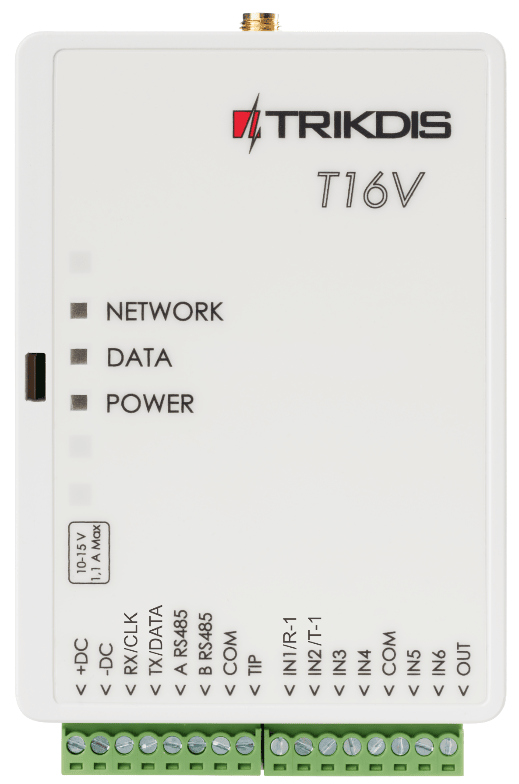

### Description of operation 

When connected to the terminals of a control panel, the transmitter reads the signals from the control panel and transforms them into messages that correspond with Contact ID protocol codes.

If the transmitter is configured to transmit in RAS-3 radio system encoding, the *Contact ID* message will be transmitted unchanged. If the transmitter is configured to transmit in other radio system encodings, the messages will be converted to codes of that system. The conversion table is saved in the transmitter’s memory and can be altered if needed. If *TRIKDIS* equipment is used for reception, messages transmitted in any encoding are forwarded to the monitoring program in their precise meanings. *NC, NO* or *EOL=2,2 kΩ* type eternal circuits can be connected to the transmitter’s *IN* terminals (inputs). If the circuit’s state is either altered or restored to the initial state, the transmitter will send an event message.

The transmitter sends the control panel’s messages using a pre-set radio frequency and encoding. The same message can be repeated 1-10 times. It is possible to set the transmitter to send messages in two different radio system encodings, two different radio frequencies and with different identification numbers of the protected object.

The transmitter sends periodic **Test** messages for evaluating connectivity. The reception of these messages is controlled by the receiving center’s message monitoring software. It is also possible to constantly send **PING** messages, the reception of which is controlled by the receiving center’s reception hardware.

The transmitter automatically checks the power supply voltage. If the voltage falls below 11,5 ±0,2 V, the transmitter will send a message about the power supply voltage being insufficient. If the voltage rises above 12,6 ±0,2 V, the transmitter will send a message about the power supply voltage being restored.

If the power supply voltage falls below 10 ±0,2 V, the transmitter will switch to sleep mode. Before switching, the transmitter will send a message about the voltage drop. While operating in sleep mode, the transmitter does not store or send any messages. The transmitter will switch from sleep mode to ordinary mode only when 12,6 V power supply voltage remains stable after switching on the transmitter’s power.

**DC power source.** The T16 must be connected directly to the power terminals (AUX) or 12 V battery terminals. The cross-sectional area of the transmitter’s power wire should be no less than 1 mm2. When transmitting data, the transmitter consumes 1,2 A of current, so stability of the power supply voltage is important for reliable operation of the transmitter.

**Antenna.** The antenna is very important to ensure a good quality connection. Use only an antenna specified for the correct frequency and power. If you are using a 1/4 λ antenna, it must be vertically oriented and mounted as high as possible. Avoid mounting the antenna in places where metal shields or concrete partitions would block the reception antenna. The quality of connectivity is best when the transmitter and receiver antennas are within line of sight of each other. Usually the quality of connectivity can be enhanced by mounting the antenna as high as possible. The antenna should be connected to the transmitter using coaxial 50 Ω cable. The longer the cable, the bigger the signal losses in it. It is recommended to use a cable no longer than 10 meters. When the cable length is less than 5 m, RG-58U or a better cable is recommended. Use a cable with lower attenuation for longer cables. When the transmitter is installed, check the quality of the connectivity. To do this, send a few messages and check the signal level in the receiver. A signal level not lower than 3 is sufficient.

**Data cable**. The data cable connecting the radio transmitter and the control panel should be no longer than 50 cm. If the data cable is longer, a shielded cable must be used. The data cable should be connected to the keypad bus, series port or landline dialer on the control panel. Avoid mounting the cable in parallel with AC power cables, the antenna cable or other sources of strong electromagnetic field.

**RS485 interface**. Modules W485 and TM17 can be connected to the transmitter’s RS485 interface. When the length of the RS485 bus is larger than 1 m, use a twisted-pair cable (STP 4x2x0,5). Avoid mounting the cable in parallel with AC power cables, the antenna cable or other sources of strong electromagnetic field.

### Specifications 

| Parameter | T16V | T16U | T16U5 |
|-----------|------|------|-------|
| Power supply voltage | 10-15 V DC |  |  |
| Current consumption | Up to 50 mA (stand-by mode) /​ Up to 1,2 A (sending mode) |  |  |
| Radio frequencies | 136 MHz – 174 MHz (VHF) | 430 MHz – 512 MHz (UHF) | 430 MHz – 470 MHz (UHF) |
| Radio channels | 2 |  |  |
| RF output resistance | 50 Ω |  |  |
| Secondary emissions | Meets the requirements of EN 300 113 |  |  |
| Broadcasting protocols | RAS3, RAS2M, LARS, LARS1, LARS_RAS2M, LARS1_RAS2M |  |  |
| Broadcasting time | 60-400 ms (depends on chosen radio protocol) |  |  |
| Memory | Up to 32 messages |  |  |
| Inputs | 6, selectable types: NC, NO, EOL (2,2 кΩ) | 6, selectable types: NC, NO, EOL (2,2 кΩ) | 5, selectable types: NC, NO, EOL (2,2 кΩ) |
| Output | 1, OC type, commutation voltage 15 V, 1 A | 1, OC type, commutation voltage 15 V, 1 A | 2, OC type, commutation voltage 15 V, 1 A |
| Event message format | Contact ID;​ 4+2 |  |  |
| Operating environment | Temperature from –20 °C to +50 °C, relative air humidity 80 % at +20 °C |  |  |
| Dimensions | 113 x 71 x 26 mm |  |  |
| Weight | 0,10 kg |  |  |

Receivers for messages sent in different radio system formats by *T16* series transmitters

|                     | RAS-002 | RAS-2M | LARS  | LARS1 | RAS-3_CID |
|---------------------|:-------:|:------:|:-----:|:-----:|:---------:|
| TRIKDIS R7          |  **+**  | **+**  | **+** | **+** |           |
| TRIKDIS RF7         |  **+**  | **+**  | **+** | **+** |           |
| TRIKDIS R11         |  **+**  | **+**  | **+** | **+** |   **+**   |
| TRIKDIS RF11        |  **+**  | **+**  | **+** | **+** |   **+**   |
| Other manufacturers |         |        | **+** | **+** |           |

### Transmitter elements 

|  |  | SMA connector for antenna. LED indicator lights. Slot for opening the top lid. Terminals for connecting wires. |
|--|--|----------------------------------------------------------------------------------------------------------------|
| T16V, T16U | T16U5 |  |

### Purpose of terminals 

| Terminal | Description |
|----------|-------------|
| +DC | Power supply terminal (10-15 V DC positive terminal) |
| -DC | Power supply terminal (10-15 V DC negative terminal) |
| Rx/​CLK | Security control panel’s serial port terminal CLK |
| Tx/​DATA | Security control panel’s serial port terminal DATA |
| A 485 | Terminal A of RS485 bus |
| B 485 | Terminal B of RS485 bus |
| COM/​RING | Common (negative) terminal or RING terminal of telephone communicator |
| TIP | TIP terminal of telephone communicator |
| IN1/​R-1 | 1st input terminal, selectable types: NC, NO, EOL (2,2 kΩ). (factory setting NO) or terminal for monitoring the landline |
| IN2/​T-1 | 2nd input terminal, selectable types: NC, NO, EOL (2,2 kΩ). (factory setting NO) or terminal for monitoring the landline |
| IN3 | 3rd input terminal, selectable types: NC, NO, EOL (2,2 kΩ). (factory setting NO) |
| IN4 | 4th input terminal, selectable types: NC, NO, EOL (2,2 kΩ). (factory setting NO) |
| COM | Common (negative) terminal |
| IN5 | 5th input terminal, selectable types: NC, NO, EOL (2,2 kΩ). (factory setting NO) |
| IN6 or | 6th input terminal, selectable types: NC, NO, EOL (2,2 kΩ). (factory setting NO). (T16V, T16U) |
| OUT1 | Output terminal, open collector type, current up to 1 A. (T16U5) |
| OUT1 or | Output terminal, open collector type, current up to 1 A. (T16V, T16U) |
| OUT2 | Output terminal, open collector type, current up to 1 A. (T16U5) |

### LED indication of operation 

| Indicator | Light status | Description |
|-----------|--------------|-------------|
| NETWORK | Green blinking | The radio transmitter is sending data |
| DATA | Green solid | There are unsent event messages in the memory buffer |
| DATA | Red solid | Memory buffer overflow |
| DATA | Red blinking (1/1) | Control panel connection problem |
| DATA | Red blinking (1/10) | RS-485 module connection problem |
| POWER | Green blinking | Power source voltage is present |
| POWER | Yellow blinking | Low level power source voltage |
| POWER | Green and yellow blinking | (Configuration mode) USB cable is connected |

### Components necessary for installation 

Before beginning installation, ensure that you have:

1.  A USB cable, needed for configuration (Mini-B type);

2.  At least 4-wire cable for connecting the transmitter to the control panel;

3.  The manual of the control panel to which the transmitter will be connected to;

4.  An antenna;

5.  A flat-head 2,5 mm screwdriver.

You can order the materials from your local distributor.

## Schematics and installation 

### Schematics for connecting control panels 

List of control panels to which the transmitters *T16V, T16U* and *T16U5* can be connected to:

| Manufacturer | Control panel model | T16V, T16U, T16U5 |
|--------------|---------------------|-------------------|
| DSC® | PC1616, PC1832, PC1864, PC1616, PC1832, PC1864 | + |
| PYRONIX® | MATRIX 424, MATRIX 832, MATRIX 832+, MATRIX 6, MATRIX 816 | + |
| GE® | CADDX NX-4, NX-6, NX-8, NX-8E | + |
| PARADOX® | SPECTRA SPxxxx, 1727, 1728, 1738 | + |
| PARADOX® | MAGELLAN MG5000, MG5050 | + |
| PARADOX® | DIGIPLEX EVO48, EVO192, EVOHD, NE96, EVO96 | + |
| PARADOX® | ESPRIT E55, E65, 728ULT, 738ULT | + |
| SECOlink | PAS832 | + |
| TEXECOM | PREMIER 412, 816, 816+, 832 / PREMIER ELITE 12, 24, 48, 88, 168, 640 | + |
| CROW | RUNNER | + |
| ARGUS-SPECTR | Strelec RROP | + |
| BOLID | C2000 | + |
| ROVALANT | A6-06 (LARS / MAYAK) | + |
| RISCO | LightSYS | + |
| Honeywell | Vista | + |
| INIM | Smartline | + |
| Telephone communicator | CID; 3/1, 4/1, 4/2 2300; 3/1, 4/1, 4/2 1400 | + |

The zones (inputs IN) of ***T16V,** **T16U, T16U5*** transmitters can be connected directly to various devices (e.g.: sensors, panic button, siren output) or to the control panel’s programmable outputs PGM. You must choose the correct zone (input *IN*) type depending on the operation of the device being connected.

**DC power source**. Use a wire with a cross-sectional area of no less than 1 mm² to connect the transmitter. Avoid using long cables (recommended length – up to 1m). Avoid mounting the cable in parallel with AC power cables, the antenna cable or other strong sources of electromagnetic field. The radio transmitter consumes 1,2 A of current while in sending mode, so a stable energy source is needed to power the transmitter (AUX terminals of the security control panel, or connect directly to the battery terminals).

**Data cable**. The data cable connecting the RF transmitter and the control panel must be no longer than 50 cm. If the data cable is longer, a shielded cable must be used. The data cable should be connected to the keypad bus, serial port or telephone communicator on the control panel. Avoid mounting the cable in parallel with AC power cables, the antenna cable or other strong sources of electromagnetic field.

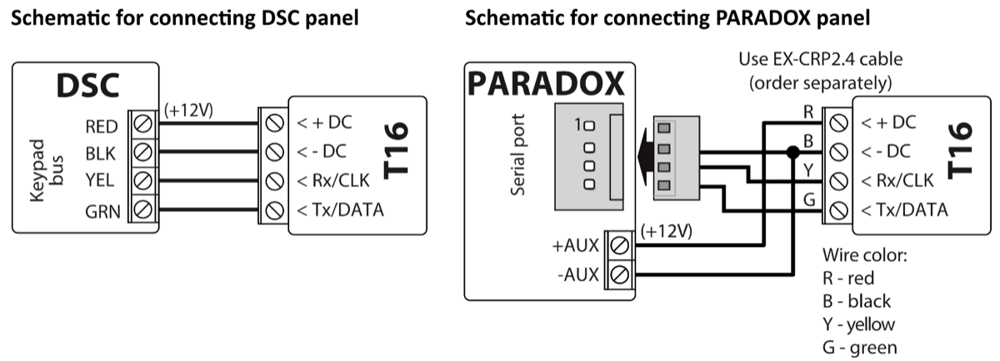

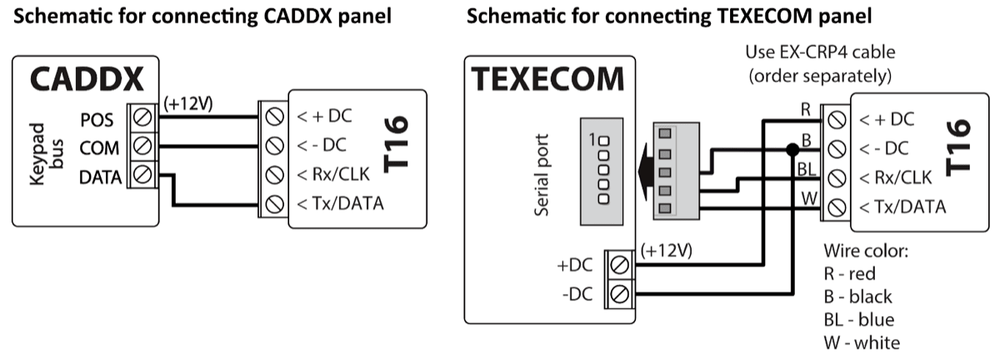

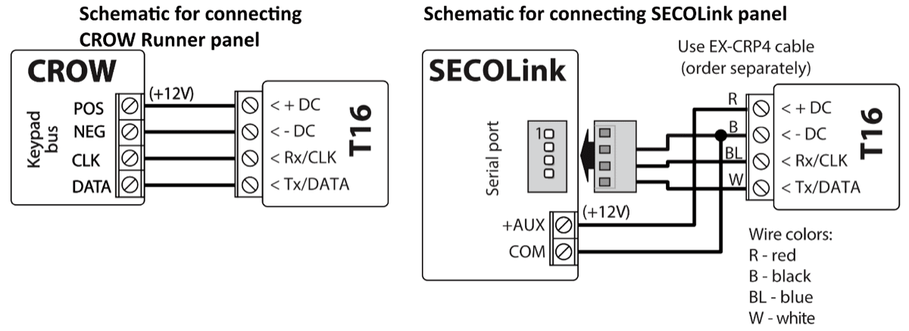

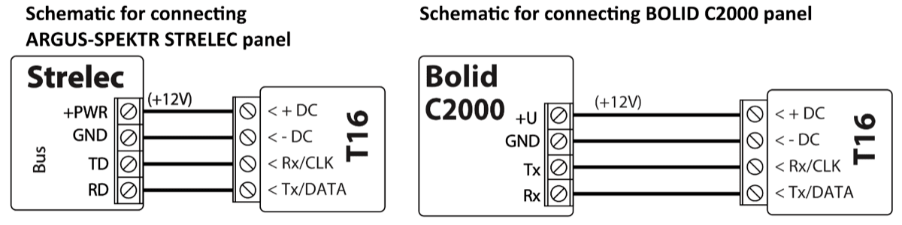

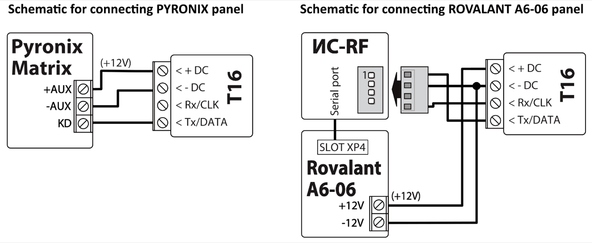

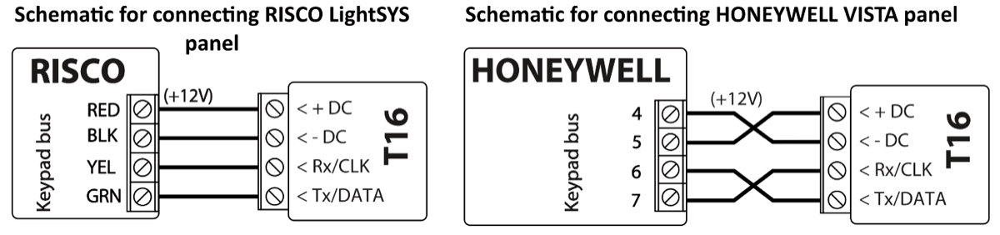

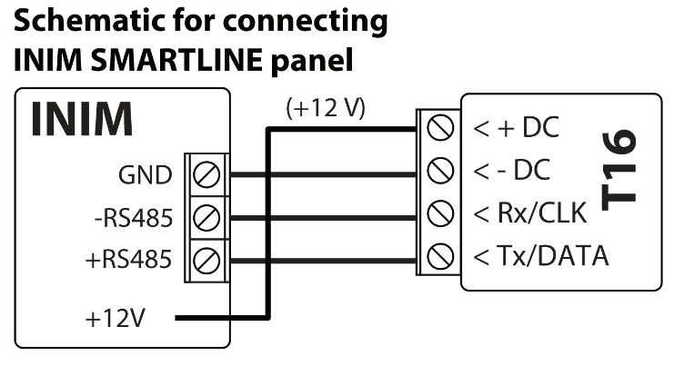

### Schematic for connecting control panel’s landline dialer 

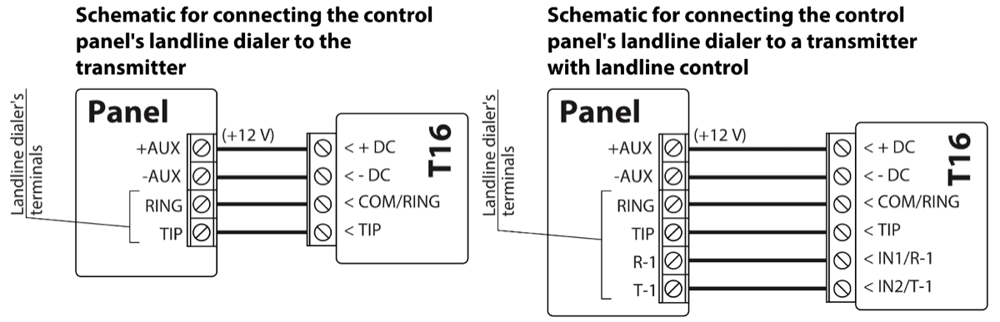

!!! warning "Important"
    T16 should not be connected to a working telecom landline.
Referring to the control panel’s programming instructions, set the following parameters for the control panel’s landline dialer:

- Enter the control panel’s 4-symbol identification number (account number, 0-9, A-F);

- Enter the 2-symbol telephone receiver number that the panel will call when an event occurs (e.g.: 12). If the panel’s TLC programming rule requires, enter a number end symbol at the end of the number;

- Set the method of relaying messages to DTMF tones;

- Set the automatic message transfer protocol Contact ID.

- If you want to transfer special messages or the panel does not have automatic Contact ID code formatting, manually enter the required event codes.

Form a panel message and check the operation of the interface. Blinking of the DATA indicator will show when the transmitter is reading the panel’s messages.

Check to make sure that the transmitter correctly sent all of the control panel’s messages formed during the test to the set recipient.

### Schematics for connecting inputs 

The transmitter has 6 (or 5) input terminals (IN1, IN2, IN3, IN4, IN5, IN6) for connecting NO, NC, EOL type circuits. The factory settings for all of the inputs is NO type. The input circuit type can be changed in the TrikdisConfig window **Reports → Inputs**.

Schematics for connecting NO, NC, EOL type circuits:

### Schematic for connecting control panel’s PGMs 

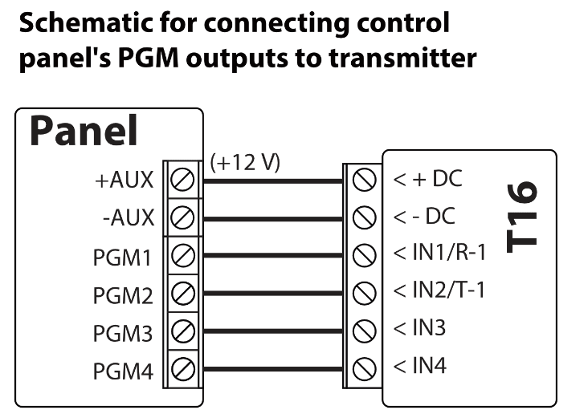

The transmitter’s inputs (IN) should be set to either NO or NC.

### Schematic for connecting a siren 

The siren should be connected when the *TM17* is connected to the transmitter. A siren that consumes up to 1 A of current can be connected to the *T16* transmitter’s output OUT1 (or OUT2). It is activated if one of the transmitter’s inputs (IN) is triggered in armed mode. The siren turns off after 3 minutes or after using a contact key.

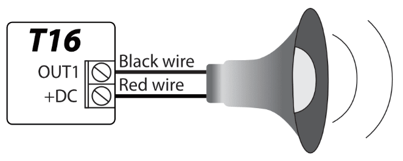

### Schematics for connecting RS485 modules 

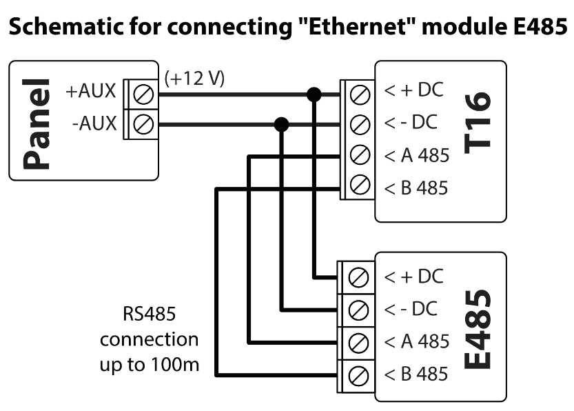

When the RS485 data bus is longer than 1 m, use a twisted-pair cable (STP 4x2x0,5). Avoid mounting the cable in parallel with AC power cables, the antenna cable or other strong sources of electromagnetic field.

The Wi-Fi module W485 is compatible with the radio transmitter T16. The W485 sends messages wirelessly via Wi-Fi internet router to the CMS (central monitoring station).

The E485 “Ethernet” module is compatible with T16 radio transmitters. The E485 sends messages from the T16 to the CMS via a wired computer network.

## Setting parameters with TrikdisConfig software 

1.  Download the configuration software TrikdisConfig from [www.trikdis.com](http://www.trikdis.com/lt) (you can find the program by typing “TrikdisConfig” into the search field) and install it.

2.  Remove the front cover of the T16 using a flat-head screwdriver as shown below:

1.  Connect the T16 to a computer using a USB Mini-B cable.

2.  Launch the configuration program TrikdisConfig. The program will automatically recognize the connected device. If required, enter the administrator or installer code in a pop-up window and TrikdisConfig will automatically open the T16 configuration window.

### Description of TrikdisConfig status bar 

Once the T16 is connected to the TrikdisConfig software, the program will display information about the connected device in the status bar:

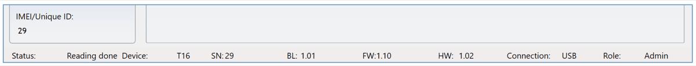

| Name          | Description                                             |
|---------------|---------------------------------------------------------|
| Unique ID     | Device’s serial number                                  |
| Status        | Operational state                                       |
| Device        | Type of device (must show T16)                    |
| SN            | Device’s serial number                                  |
| BL            | Bootloader version                                      |
| FW            | Device’s firmware version                               |
| HW            | Device’s hardware version                               |
| State         | Type of connection with the program (via USB or remote) |
| Administrator | Access level (shown after access code is approved)      |

!!! note
    Click **Read [F4]** to make the program read and display the settings
    that are currently saved on the device. / Click **Write [F5]** to save
    the settings made in the program to the device. / Click **Save [F9]**
    to save the settings to a configuration file. You can upload the saved
    settings to other devices later. This allows to quickly configure
    multiple devices with the same settings. / Click **Open [F8]** and
    choose a configuration file to view previously saved settings. / If you
    want to revert to the default settings, click the **Restore** button at
    the lower left of the screen.
After the Read [F4] button is clicked, the program will read and show settings currently saved on the T16. With TrikdisConfig, set the required parameters using the following program window descriptions.

### “Main Setting” window 

**“Settings” tab**

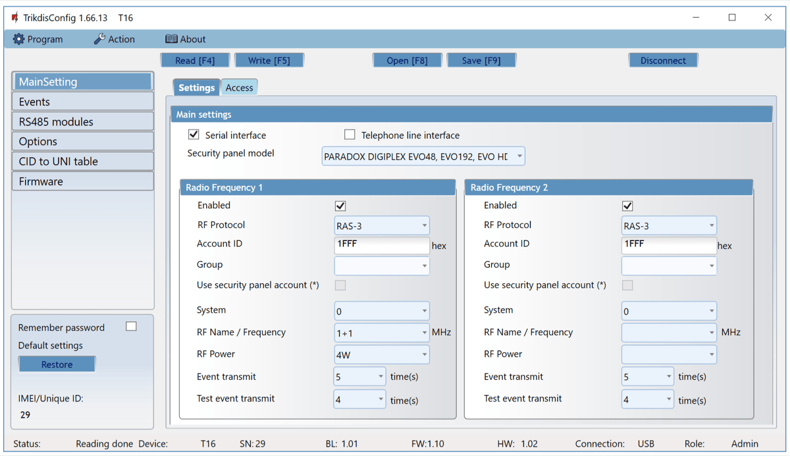

**Settings group “Main settings”**

- **Serial interface** – check the box, when T16 is connected to the serial interface.

- **Telephone line interface** - check the box, when the T16 is connected to the control panel telephone line communicator.

- **Security panel model** – specify the type of the control panel that the transmitter will be connected to.

**Settings group “Radio frequency 1”**

- **Enabled** – tick the box to turn on the transmitter’s radio channel.

- **RF protocol** – specify the radio protocol that will be used (RAS-2M, RAS-3, LARS, LARS1, LARS_RAS2M, LARS1_RAS2M).

- **Account ID** – enter the user’s identification number for the internal and panel events sent by the transmitter.

- **Group** – enter the partial user identification ID (used only with the LARS RF protocol).

- **Use security panel account** – tick the box and the control panel’s events will be sent with the security control panel’s ID. Not all panels allow to use the identification number.

- **System** – radio network system number. Used for assigning objects (users) to groups in a radio network.

- **RF name/frequency** – the name of the radio channel frequency, can be described in the window **Options > Available radio frequencies**.

- **RF power** – choose transmitter power (1-5 W).

- **Event transmit** – enter how many times to repeat event transmissions (1-10 times). (Recommended to leave default settings).

- **Test event transmit** – enter how many times to repeat test transmissions (1-10 times). (Recommended to leave default settings).

**Settings group “Radio frequency 2”**

Settings are identical to **Radio frequency 1**.

**“Access” tab**

**Settings group “Access”**

- **Administrator access code** – grants full access to the transmitter’s configuration. The code can be up to 6 symbols long and is made up of numbers or Latin characters. (Default code - 1234).

- **Installer access code** – grants limited access to the transmitter’s configuration (factory code - 1234).

**Settings group “Allow Installer to change”**

There are two access levels for configuring the radio transmitter T16 (administrator and installer). The administrator has access to all configuration functions. Installer access allows to make limited changes to the transmitter’s configuration. The administrator can specify which parameters the installer (user) can change.

### “Events” window 

**“Inputs” tab**

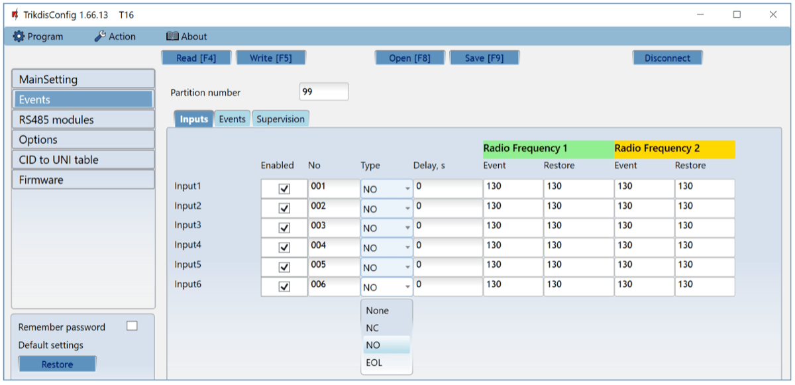

- **Enabled** – tick the box to send events when the input is triggered.

- **No** – assign a number to the input.

- **Type** – specify input type (NO, NC, EOL).

- **Delay** – specify input trigger delay time (s).

- **Event F1** – event code sent using the radio transmitter’s 1st channel (CID code is set automatically).

- **Restore F1** – event restore code sent using the radio transmitter’s 1st channel (CID code is set automatically).

- **Event F2** – event code sent using the radio transmitter’s 2nd channel (CID code is set automatically).

- **Restore F2** – event restore code sent using the radio transmitter’s 2nd channel (CID code is set automatically).

**“Events” tab**

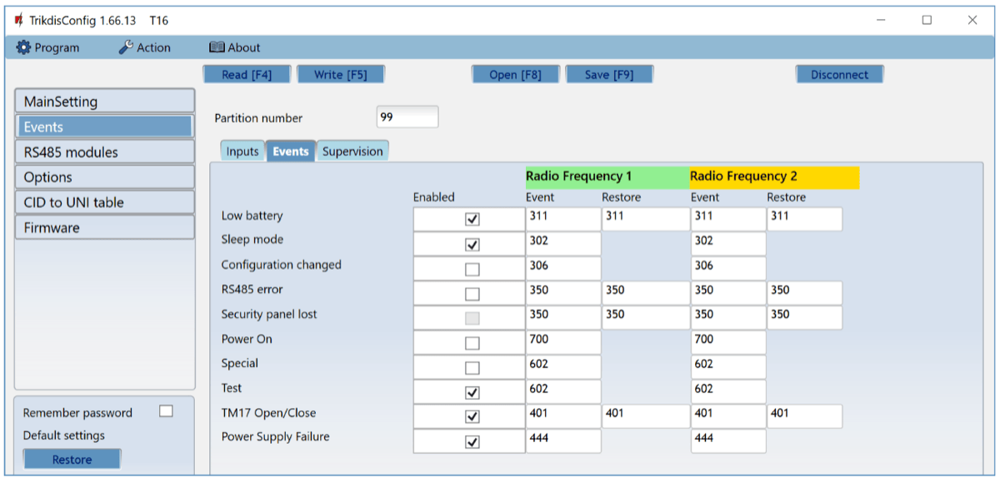

- **Enabled** – tick the box to turn on the sending of internal events:
- **Low battery** – power supply voltage less than 11,5 V.

- **Sleep mode** – power supply voltage less than 10 V.

- **Configuration change** – change in transmitter’s configuration.

- **RS485 error** – problem with devices connected to the RS485 bus.

- **Security panel lost** – lost connection between transmitter and security panel.

- **Power ON** – power turned on for the transmitter.

- **Special** – usage of special code in the radio network, when a radio signal repeater with “listen” and “cancel” modes is used.

- **Test** – periodic test message.

- **TM17 Open/Close** – for sending Open/Close messages when the TM17 reader is used.

- **Power Supply Failure** – power supply failure event is sent when the DC power source voltage is less than 11,5 V when sending messages.
- **Radio frequency 1** – internal event codes that will be sent using the first radio channel after event trigger and restore.
- **Radio frequency 2** – internal event codes that will be sent using the second radio channel after event trigger and restore.

**“Supervision” tab**

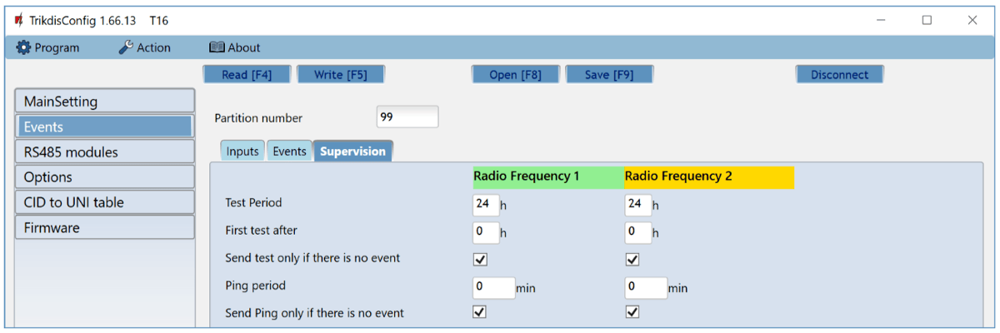

- **Test period** – specify the time interval between two test messages using the 1st and 2nd channels. The purpose of periodic tests is to periodically inspect the functionality of radio systems. A typical test period is 24h. It can be shortened down to 1 hour. CMS monitoring software automatically tracks the test message. A warning is generated if there are no test messages from the object.
- **First test delay** – specify the time for delaying the first message after powering on. The goal is to be able to spread out the sending of messages across the day (24 hours) to avoid network overloads. Specify times for 1st and 2nd channels.

- **Send test only if there is no event** – check the box to send test messages only when there are no event messages being sent.

- **PING period** – specify the time interval for sending PING signals**.** The main objective of PING messages is to monitor the operation of the protected object’s equipment. PING messages are generated in short intervals (every 5-10 minutes) and sent. PING messages are automatically monitored by the CMS receiver. It is important to understand that the radio network is meant to be used for transmitting messages about events, this means that PING messages can only be used for the most important protected objects in a network to avoid a network overload.

- **Send PING only if there is no event** – check the box to send PING signals only when there are no event messages being sent.

### “RS485 modules” window 

**“Modules list” tab**

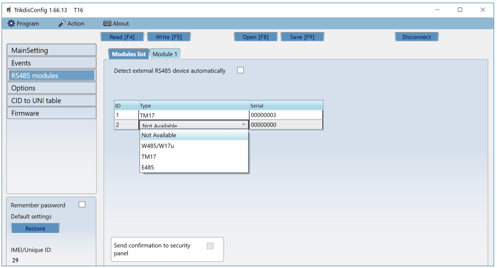

- **Detect external RS485 device automatically** – tick the box to enable automatic identification of modules connected to the RS485 bus.

- **Type** – select the module connected to the transmitter’s RS485 bus from the list.

- **Serial No** – specify the serial number of the connected module. You can find the number on a sticker on the connected module or its packaging.

- **Send confirmation to security panel** – if an IP transmitter (Wi-Fi, LAN) is connected to the T16’s RS485 bus as a main channel, when the box is ticked the control panel receives a confirmation that the sent message was received. This ensures that message transmission is more reliable. Not all panels have this option. If the chosen panel does not have this option, the box will be inactive.

!!! note
    You can only connect one of each of TM17 and W485 (or
    E485) modules to the T16 transmitter.
**“Module 1” tab**

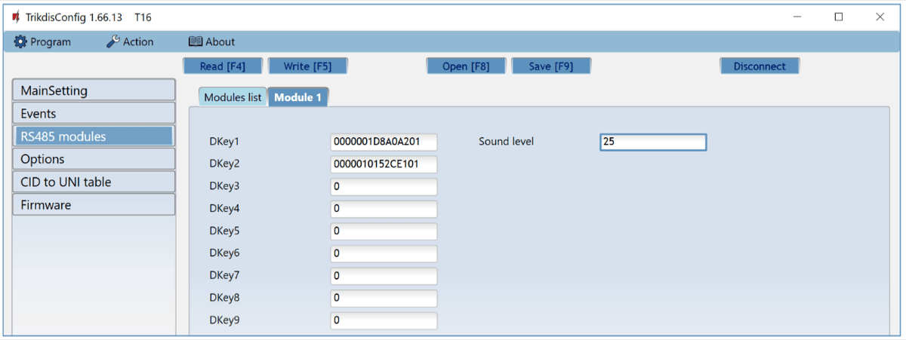

It is possible to connect a TM17 reader to the T16 transmitter. After connecting the TM17 reader, the transmitter can be used as a security control panel. Up to 9 contact (iButton) keys can be assigned to the reader (one of which is the “Master key”) for controlling the security system’s state (armed/disarmed).

- **Dkey 1 – Dkey 9** – enter identification numbers of contact (iButton) keys.

- **Sound level** – enter the reader’s audio signal strength level (from 0 to 100).

#### Adding contact (iButton) keys 

1.  If the list of contact keys is empty, the first key held against the reader is added, saved to the first line of the list and becomes the **Master key**.

2.  To turn on contact key registering mode, you need to hold the **Main key** against the key reader for at least 10 seconds. The “State” indicator will turn off. When registering mode is turned on, the LED indicator on the TM17 reader will begin blinking in green and an audio signal will be played.

3.  Hold the key you want to register against the reader. The reader’s audio signal will switch off. The key is now added to the list. Remove the key from the reader. The green indicator on the reader will stop blinking and will light up in solid green. After a few seconds the reader automatically exits key registering mode. The “State” indicator lights up in green and the green LED on the reader switches off.

4.  To add another key, enter key registering mode again.

5.  To delete all keys (including the main key), hold the **Main key** against the reader for no less than 20 s.

#### Using the transmitter as a control panel 

After connecting the TM17 reader, the transmitter can be used as a control panel. Contacts of security sensors can be connected to the transmitter’s inputs (IN1 – IN6). If the W485 (or E485) module is additionally connected to the RF transmitter, then the security system can be controlled remotely via a computer network.

#### Default settings of inputs (IN) and output (OUT)

| Terminal | Description |
|----------|-------------|
| IN1 | 1st input terminal, selectable types: NC, NO, EOL (2,2 kΩ). (default setting NO). Delay zone. Right after the alarm system is armed, the zone can be violated during the exit time. If the zone remains violated after the exit time, an output OUT1 signal will be formed and a message will be sent. If the zone is violated when the alarm system is armed, counting of entry time begins. If the alarm system is not disarmed during this time, an output OUT1 signal will be formed and a message will be sent. |
| IN2 (IN3, IN4, IN5, IN6) | 2 (3, 4, 5, 6) input terminal, selectable type: NC, NO, EOL (2,2 kΩ). (default setting NO). Instant zone. If the zone is violated when the alarm system is armed, an output OUT1 (or OUT2) signal will be formed and a message will be sent immediately. |
| OUT1 or | Output terminal, open collector type, current up to 1 A. For connecting a siren. (T16V, T16U) |
| OUT2 | Output terminal, open collector type, current up to 1 A. For connecting a siren. (T16U5) |

Blinking LED indicators on the TM17 inform about activated inputs during the time the system is armed. When the alarm is disarmed (by holding a key to the reader), the indicators do not stop blinking. To stop the indicators from blinking, hold the key to the reader again.

#### LED indication of operation of the *TM17* reader

| Indicator | State | Description |
|-----------|-------|-------------|
| 1 (2, 3, 4, 5, 6) | Off | Zone not triggered |
| 1 (2, 3, 4, 5, 6) | Red solid | Zone triggered |
| 1 (2, 3, 4, 5, 6) | Red blinking | Triggered zone caused security system to trigger |
| State | Green solid | Security alarm area is disarmed |
| State | Green blinking | Exit time is being counted down |
| State | Red solid | Security alarm area is armed |
| State | Red blinking | Entry time is being counted down |
| Trouble | Off | No operational problems |
| Trouble | 9 red blinks | Problem with the connection to RS485 module |

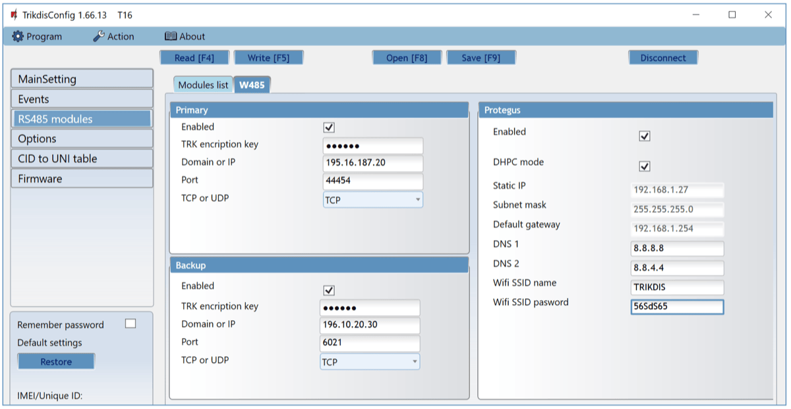

**“W485” tab** **“Primary” settings group**

- **Enabled** - selecting the checkbox will activate the Primary communication channel.

- **TRK encryption key** - 6-digit message encryption key. The key written to the communicator must match the receiver’s key.

- **Domain or IP** - enter the domain or IP address of the receiver.

- **Port** - enter the network port number of the receiver.

- **TCP or UDP** - select in which protocol (TCP or UDP) the events should be sent.

**“Backup” settings group**

Enable the backup channel mode to send events via backup channel if connection via primary channel is lost. Backup channel settings are same as described above.

**“Protegus” settins group**

- **Enabled** – enable the Protegus service, the T16 will be able to exchange data with Protegus app and to be remotely configured via TrikdisConfig.

  - **DHCP mode** – WiFi module’s mode for registering to network (manual or automatic).

  - **Static IP** – static IP address for when manual registering mode is set.

  - **Subnet mask** – subnet mask for when manual registering mode is set.

  - **Default gateway** – gateway address for when manual registering mode is set.

  - **DNS1, DNS2** - (Domain Name System) identifies the server that specifies the IP address of the domain. Used when domain is set in the communication channel **Domain or IP** field (not IP address). Google DNS server is set by default.

  - **Wifi SSID name** – name of the WiFi network that the W485 will connect to.

- **Wifi SSID password** - WiFi network password.

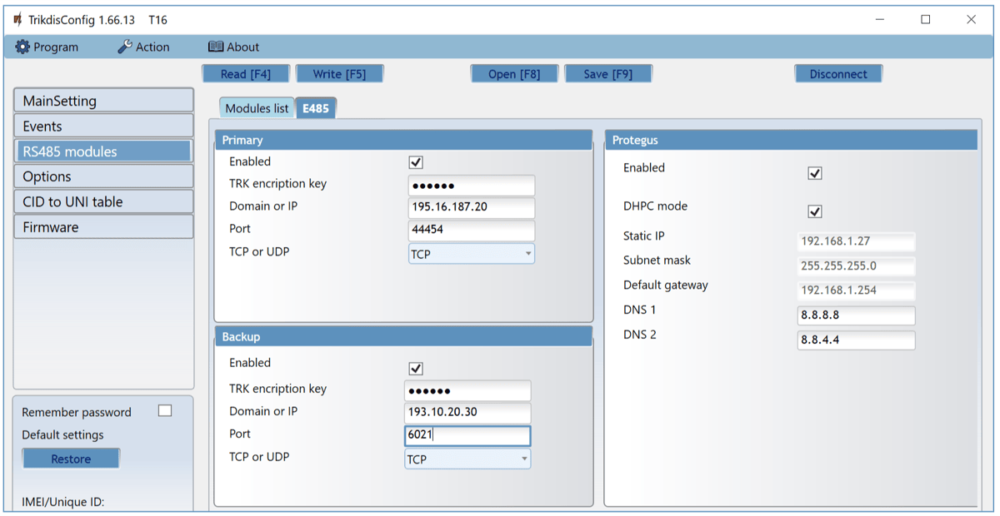

**“E485” tab** **“Primary” settings group**

- **Enabled** - selecting the checkbox will activate the Primary communication channel.

- **TRK encryption key** - 6-digit message encryption key. The key written to the communicator must match the receiver’s key.

- **Domain or IP** - enter the domain or IP address of the receiver.

- **Port** - enter the network port number of the receiver.

- **TCP or UDP** - select in which protocol (TCP or UDP) the events should be sent.

**“Backup” settings group**

Enable the backup channel mode to send events via backup channel if connection via primary channel is lost. Backup channel settings are same as described above.

**“Protegus” settins group**

- **Enabled** – enable the Protegus service, the T16 will be able to exchange data with Protegus app and to be remotely configured via TrikdisConfig.

  - **DHCP mode** – WiFi module’s mode for registering to network (manual or automatic).

  - **Static IP** – static IP address for when manual registering mode is set.

  - **Subnet mask** – subnet mask for when manual registering mode is set.

  - **Default gateway** – gateway address for when manual registering mode is set.

  - **DNS1, DNS2** - (Domain Name System) identifies the server that specifies the IP address of the domain. Used when domain is set in the communication channel **Domain or IP** field (not IP address). Google DNS server is set by default.

### “Options” window 

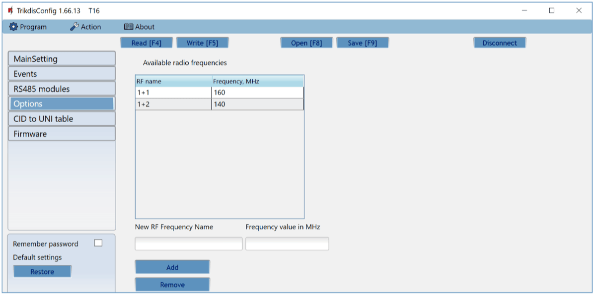

**Settings group “Available radio frequencies”**

You can add/delete radio frequencies that the T16 transmitter can use to/from the list. Radio frequencies are given “Names”.

### “CID to UNI table” window 

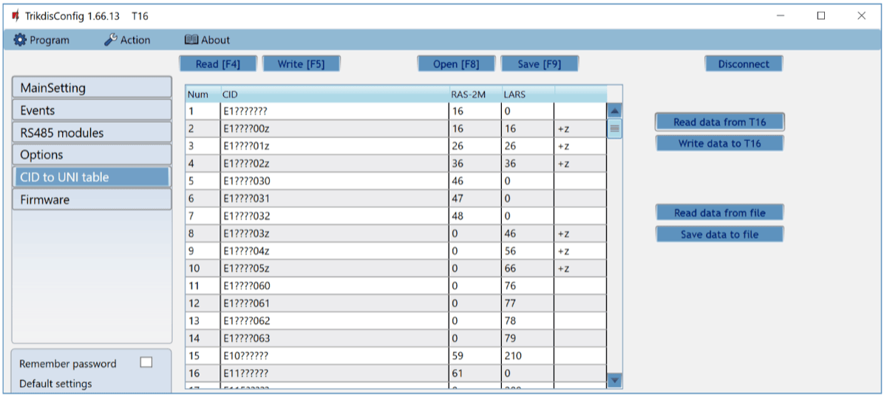

Contact ID codes received from the security system’s control panel are converted to the radio system’s (RAS2M, LARS) codes. Only Contact ID messages described in the table (CID column) are converted to the radio system’s codes and sent to the CMS. The "?" symbol indicates any number in this position. The "z" symbol means that the number in the position is added to the main radio system code. The table is editable, but please change it responsibly and only if it is mandatory to do so, because if there are errors in the table, the system might not work properly.

!!! note
    After finishing configuration, click **Write [F5]**, wait for the data
    to be saved and disconnect the USB cable.
### Restoring default settings 

To restore the **transmitter’s** factory settings, click the button **Restore** in the TrikdisConfig program**.**

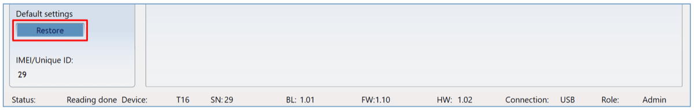

## Testing of the T16 RF transmitter 

When configuration and installation are finished, perform a system check:

1.  Check if the power is turned on;

2.  To test the T16’s inputs, enable them and make sure the correct messages reach the CMS receiver;

3.  Perform an alarm test to make sure that the alarm system events are correctly received by the CMS (central monitoring station).

## Updating firmware 

!!! note
    After connecting the T16 to TrikdisConfig, the program will
    automatically offer to update the device's firmware if updates are
    available. This function requires an internet connection. / If antivirus
    software is installed on your computer, it may block the automatic
    firmware update function. In this case you will have to reconfigure your
    antivirus software.
The T16’s firmware can be updated or changed manually. All prior settings of the T16 will remain after the update if the box **“Preserve settings”** is ticked. If the firmware is installed manually, it can be changed to a newer or an older version. Perform these steps:

1.  Launch TrikdisConfig.

2.  Using a USB Mini-B cable, connect the T16 to a computer. If a newer version of firmware is available, the program will automatically offer to install it.

3.  Choose **Firmware**.

    

4.  Click the button **Open firmware** and select the required firmware file. If you do not have the file, the newest firmware file can be downloaded <u>by registered users</u> from [www.trikdis.com](http://www.trikdis.com), in the T16 download section.

5.  Click the button **Update [F12]**.

6.  Wait for the updates to complete.

## Safety precautions 

The RF transmitter should be installed and maintained only by qualified personnel.

Please read this manual carefully prior to installation in order to avoid mistakes that can lead to malfunction or even damage to the equipment.

Always disconnect the power supply before making any electrical connections.

Any changes, modifications or repairs not authorized by the manufacturer shall render the warranty void.

