# Cellular security control panel CG17

  

## Description 

CG17 is a multifunctional security control panel with an integrated cellular communicator. The control panel allows grouping of 12 wired and wireless zones into an 8 partition system.

**With the CG17 you can:**

- Install a simple security system that can be monitored and controlled remotely.

- Control various equipment remotely (e.g. heating and ventilation systems, automatic gates).

- Monitor temperature, fuel level, DC voltage level.

- Notify users about events.

- Send event notifications to the receiver of a security company (CMS).

### Features

Sends events to monitoring station receiver:

- Sends events to TRIKDIS software or hardware receivers that work with any monitoring software.

- Can send event messages to SIA DC-09 receivers.

- Connection supervision by polling to IP receiver every 30 seconds (or by user defined period).

- Backup channel that will be used if connection with the primary channel is lost.

- Events can be reported to CMS with SMS messages. SMS will be sent even if data connection stops working in the mobile operator network.

- When *Protegus* service is enabled, events are first delivered to CMS, and only then are sent to app users.

**Works with Protegus2 app:**

- “Push” and special sound notifications informing about events.

- Remote system Arm/Disarm.

- Remote control of connected devices (lights, gates, ventilation systems, heating, sprinklers, etc.).

- Remote temperature monitoring (with iO, iO-WL or iO-LORA expanders).

- Different user rights for administrator, installer and user.

- Users can also be informed about events with SMS messages and phone calls.

**Notifies users about events:**

- Calls specified phone numbers (up to 8 users).

- Sends SMS messages about events.

- “Push” and special sound event notifications using the Protegus2 app.

**Remote system and output control:**

- Using Protegus2 app.

- Using contact (*iButton*) key reader.

- Using RFID reader with keypad (Wiegand 26/34).

- By calling the device’s phone number.

- Using SMS messages.

- Using an automatic “*if...then*” algorithm. E.g. when an input is enabled or the temperature exceeds a certain limit, an output will be turned on.

**Supports these expanders:**

- iO, LORA series wired or wireless expanders, which increase the number of inputs (IN) and outputs (OUT).

- GPS receiver (useful for protecting ATMs and vending machines).

- Fuel level sensor. For protecting fuel tanks or monitoring level.

- Backup power and charging of 12 V battery.

**Inputs and outputs**

- 1 input, 2 outputs and 3 I/O terminals that can be set either as input (IN) or controllable output (OUT) terminals.

- One wire data bus (*1-Wire*) for connecting temperature sensors (up to 8) and a contact (*iButton*) key reader.
- Number of inputs (IN) or outputs (OUT) can be increased to 12 using iO series wired or wireless expanders.

**Simple installation:**

- Default settings for use either as a control panel or as communicator.

- Settings can be saved to file and quickly written to other devices.

- Configuration either using an USB cable or remotely using TrikdisConfig software.

- Two types of access levels (accounts), for the installer and for the administrator.

### Device types 

This manual applies to these CG17 models:

- CG17_12, CG17 control panel with 2G modem.

- CG17_14, CG17_1E, CG17_1S, CG17 control panel with 4G modem.

### Specifications 

| Parameter | Description |
|-----------|-------------|
| GSM/​GPRS modem frequencies | 850 /​ 900 /​ 1800 /​ 1900 MHz |
| 4G modem frequencies : Europe Latin America | - LTE-FDD Bands: B1/​B3/​B5/​B7/​B8/​B20/​B28 /​ - GSM Bands: B2/​B3/​B5/​B8 /​ - LTE-FDD Bands: B2/​B3/​B4/​B5/​B7/​B8/​B28/​B66 /​ - GSM Bands: B2/​B3/​B5/​B8 |
| Power supply [AC /​ DC] | 16-24 V DC or 16-18 V AC |
| Current consumption | Up to 50 mA (stand-by), /​ Up to 200 mA (short-term, transmitting) |
| Backup power supply [BAT] | 12 V lead – acid battery |
| Battery charge current | Up to 500 mA |
| Power supply voltage and current for external devices [+12 V] | 12 V DC, up to 1 A |
| Dual purpose terminals [IN/​OUT] | 3, can be set as either NC, NO, EOL=10 kΩ, EOL_T type inputs or open collector (OC) type outputs with current up to 100 mA |
| Number of areas | 8 |
| No. of zones | 4, (can be expanded to 12 zones using expanders) |
| No. of PGM outputs | 2 (can be 5 if IO terminals are set as outputs. Can be expanded to 12 outputs with expanders) |
| “1-Wire” data bus length [1 WIRE] | Up to 30 m |
| Compatible temperature sensors | Maxim®/​Dallas® DS18S20, DS18B20 |
| Maximum number of temperature sensors connected to the “1-Wire” data bus | 8 |
| Compatible contact (iButton) keys [1 WIRE] | Maxim®/​Dallas® DS1990A |
| Maximum number of contact (iButton) keys | 12 |
| RS485 data bus length | Up to 100 m |
| Maximum number of devices connected to the RS485 data bus | 8 |
| Supported keypad | Crow CR-16, Crow LCD, Crow touch keypad |
| Supported modules | iO-8 – expander module;​ /​ iO – expander module;​ /​ iO-MOD – iO-WL radio wave transceiver;​ /​ iO-WL – wireless expander module;​ /​ RF-SH – radio wave receiver for wireless sensors;​ /​ E485 – module for connecting to Ethernet network;​ /​ W485 – module for connecting to WiFi network;​ /​ TM17 – iButton key reader;​ /​ CZ-Dallas – iButton key reader;​ /​ FLS - fuel level sensor Strela RS485;​ /​ iO-LORA - expander module;​ /​ iO8-LORA - expander module;​ /​ PB-LORA – panic button;​ /​ REL-LORA – expander module . |
| Buffer memory capacity | 60 events |
| Number of communication channels | 2 (1st channel: main, backup;​ 2nd channel: Protegus) |
| Internal clock | Yes |
| Event reporting channels | GPRS or 4G, SMS |
| Communication with CMS | TCP /​ IP or UDP /​ IP, or SMS |
| Communication protocols | TRK, encrypted SIA DC-09_2007, SIA DC-09_2012, SIA DC-09_IPcom |
| Operating environment | From -10 °C to + 50 °C, relative air humidity up to 70% at 0- +40 °C (no condensation) |
| Dimensions | 113x 70 x 25 mm |
| Weight | 0.10 kg |

### Elements of the control panel 

1.  SMA type connector for Cellular antenna.

2.  LED indicator lights.

3.  Slot for opening the top lid.

4.  Terminal blocks for external connections.

5.  USB Mini-B port for programming the *CG17.*

6.  Nano SIM card slot.

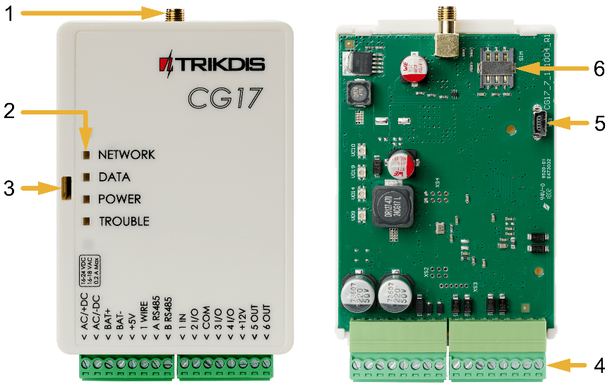

### Purpose of terminals 

| Terminal | Description |
|----|----|
| AC /​ +DC | Power supply terminal (16-18 V AC or positive 16-24 V DC) |
| AC /​ -DC | Power supply terminal (16-18 V AC or negative 16-24 V DC) |
| BAT+ | Positive terminal of the 12 V backup battery |
| BAT- | Negative terminal of the 12 V backup battery |
| +5 V | Positive 5 V power terminal for “*1-Wire”* devices |
| 1 WIRE | *“1-Wire”* data bus terminal |
| A 485 | Terminal A of *RS485* bus |
| B 485 | Terminal B of *RS485* bus |
| 1 IN | 1st input terminal (default setting “Delay”, zone type EOL) |
| 2 I/​O | Input /​ output terminal: 2nd input terminal or output terminal of OC type. (default setting “Interior”, zone type EOL) |
| COM | Common negative terminal |
| 3 I/​O | Input /​ output terminal: 3rd input terminal or output terminal of OC type. (default setting “Instant”, zone type EOL) |
| 4 I/​O | Input /​ output terminal: 4th input terminal or output terminal of OC type. (default setting “Fire”, zone type EOL) |
| +12 V | Positive 12 V power terminal for external devices |
| 5 OUT | Output terminal of OC type (default setting “Fire sensor reset”) |
| 6 OUT | Output terminals of OC type (default setting “Siren”) |

### LED indication of operation

| Indicator | Light status | Description |
|-----------|--------------|-------------|
| NETWORK | Green solid | Connected to Cellular network |
| NETWORK | Yellow blinking | Indication of Cellular signal strength from 0 to 5. Sufficient strength is 3. |
| DATA | Green solid | Message is being sent |
| DATA | Yellow solid | There are unsent events in the data buffer |
| POWER | Green blinking | The power supply voltage is sufficient |
| POWER | Yellow blinking | The power supply voltage is insufficient |
| POWER | Green and yellow blinking | Configuration mode is on |
| TROUBLE | Off | No operational problems |
| TROUBLE | 1 blink | No SIM card inserted |
| TROUBLE | 2 blinks | The PIN code of the SIM card is incorrect |
| TROUBLE | 3 blinks | Unable to connect to Cellular network |
| TROUBLE | 4 blinks | Unable to connect to the IP receiver using the primary channel |
| TROUBLE | 5 blinks | Unable to connect to the IP receiver using the backup channel |
| TROUBLE | 6 blinks | Internal clock of the CG17 is not set |
| TROUBLE | 7 blinks | Insufficient power supply voltage from the backup supply |
| TROUBLE | 8 blinks | No AC power |
| TROUBLE | 9 blinks | Problems with the connection to the RS485 module |

### Components necessary for installation

Before beginning installation, make sure you have the necessary components that you can order from your local retailer.

## Quick configuration with *TrikdisConfig* software 

1.  Download **TrikdisConfig** configuration software from [www.trikdis.com](http://www.trikdis.com) (type “TrikdisConfig” in the search field) and install it.

2.  Open the casing of the CG17 with a flat-head screwdriver as shown below:

1.  Using a USB Mini-B cable connect the CG17 to the computer.

2.  Run TrikdisConfig. The software will automatically recognize the connected CG17 and will open a window for configuration.

3.  Click **Read [F4]** to read the CG17’s settings. If requested, enter the Administrator or Installer 6-digit code in the pop-up window.

Below we describe what settings need to be set for the communicator to begin sending events to the Central Monitoring Station (CMS) and to allow the security system to be controlled with the Protegus2 app.

### Settings for connection with Protegus2 app 

**In “System option” window, “SIM” tab:**

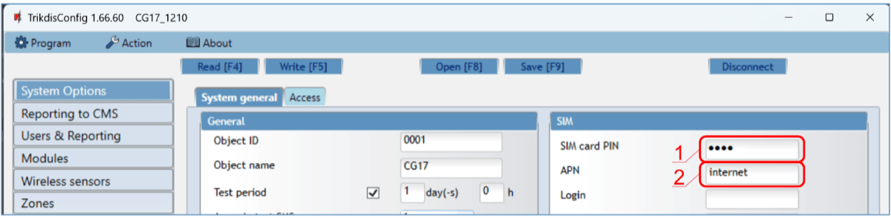

1.  Enter „**SIM card PIN**” code.

2.  Change “**APN**” name. “**APN**” can be found on the website of the SIM card operator (“internet” is universal and works in many operator networks).

**In “User reporting” window, “Cloud application” tab:**

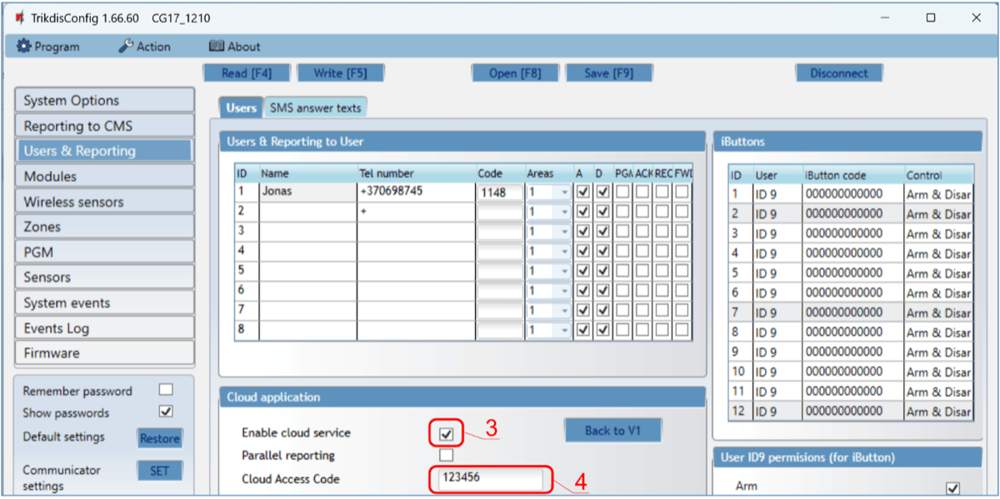

3. Tick the checkbox “**Enable cloud service**” to the Protegus Cloud.

2.  Change the “**Cloud Access Code**” for logging in to Protegus2 if you want users to be asked to enter it when adding the system to Protegus2 app (default password – 123456).

After finishing configuration, click the button **Write [F5]** and disconnect the USB cable.

!!! note
    For more information about other CG17 settings in
    TrikdisConfig, see chapter 4 "Setting parameters using
    TrikdisConfig software".
### Settings for connection with Central Monitoring Station 

**In “System options” window:**

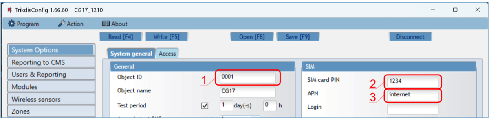

1.  Enter “**Object ID**” (account) number provided by the Central Monitoring Station (4 characters, 0-9, A-F. **Do not use FFFE, FFFF Object ID**).

2.  Enter “**SIM card PIN**” code.

3.  Change “**APN**” name. “**APN**” can be found on the website of the SIM card operator (“internet” is universal and works in many operator networks).

**In “Reporting to CMS” window settings for “Primary channel”:**

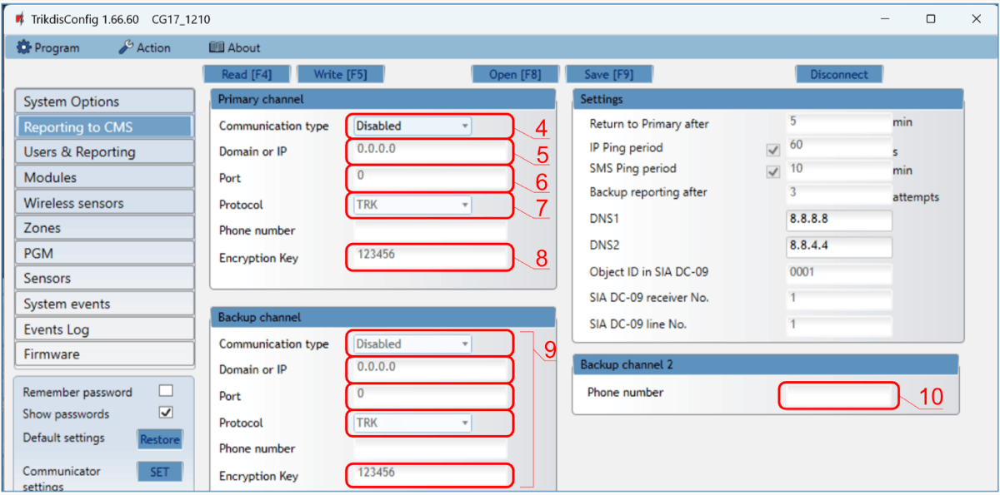

4. **Communication type** - select the **IP** connection method (We do not recommend SMS as the primary channel).

2.  **Domain or IP** - enter the receiver’s Domain or IP address.

3.  **Port** - enter receiver’s network port number.

4.  **Protocol** - select the protocol type for event messages: **TRK** (to TRIKDIS receivers), **DC-09_2007, DC-09_2012** or **DC-09_IPcom** (to universal receivers).

5.  **Encryption key** - enter the encryption key that is set in the receiver.

!!! note
    If you want to set communication with CMS via **SMS** messages, you only
    need to set "**Encryption key**" and "**Phone number**". SMS messages
    can be received only by TRIKDIS receivers: IP/SMS receiver RL14,
    multichannel receiver RM14 and SMS receiver GM14. / If you
    selected the **DC-09** protocol, additionally enter object, line and
    receiver numbers in the "**Settings**" tab of the "**Reporting to**
    **CMS**" window.
1.  (Recommended) Configure “**Backup channel**” settings.

2.  (Recommended) Enter “**Backup channel 2**” SMS reporting number.

After finishing configuration, click **Write [F5]** and disconnect the USB cable.

!!! note
    For more information about other CG17 settings in
    TrikdisConfig, see chapter 4 "Setting parameters using
    TrikdisConfig software".
## Schematics and installation process

### Mounting

1.  Before beginning, make sure that the Cellular signal level is sufficient in the place where the *CG17* will be mounted.

2.  Remove the top lid and pull out the contact terminals.

3.  Remove the PCB.

4.  Fasten the base of the casing in the desired place using screws.

5.  Reinsert the PCB and terminal blocks.

6.  Screw the Cellular antenna in.

7.  Insert a nano-SIM card. The SIM card must already be activated in the Cellular network and all required services must be enabled, i.e., the card must be able to call, send and receive SMS messages, use mobile internet. <u>Ask your SIM card’s mobile network operator how to enable the required services.</u>

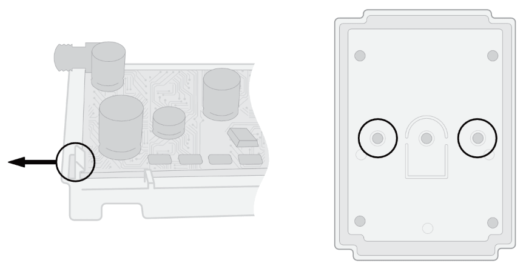

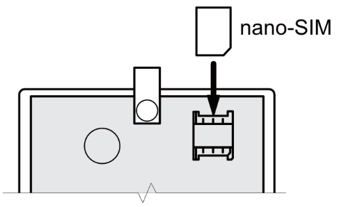

!!! note
    Make sure that the SIM card is activated. / Make sure that the mobile
    internet service is turned on if connection via the IP channel will be
    used. / If you do not want to enter the PIN code in TrikdisConfig,
    insert the SIM card into a mobile phone and disable PIN code requests.
8. If you want to be able configure the CG17 remotely, insert a SIM card with disabled PIN code requests. Send an SMS message: **CONNECT 123456 PROTEGUS=ON,APN=INTERNET**

2.  Remote configuration is described in chapter 5.5 “Setting parameters remotely”.

3.  Close the top lid.

### Schematics for connecting inputs

The CG17 has four inputs IN for connecting various alarm system sensors. Possible ways to connect a sensor: NO – normally open contact; NC- normally closed contact; EOL – normally closed circuit with a 10kΩ end of line resistor; EOL_T – normaly closed with End of line resistor (10kΩ), with tamper and wire fault recognition.

**Factory settings of zones (inputs)**

| Zone  | Description                                            |
|-------|--------------------------------------------------------|
| 1 IN  | Default setting “Delay”, zone type EOL, partition 1    |
| 2 I/​O | Default setting “Interior”, zone type EOL, partition 1 |
| 3 I/​O | Default setting “Instant”, zone type EOL, partition 1  |
| 4 I/​O | Default setting “Fire”, zone type EOL, partition 1     |

Changing zones settings, partition assignment are described in section 4.7 ““Zones” window”.

Possible connection schematics:

### Schematics for connecting a smoke detector 

Assign a PGM output the function “**Fire sensor reset**” (see TrikdisConfig window “PGM” [–> “Outputs”](#Output_tab) tab) so that the smoke detector can be restarted after an alarm.

- **Connecting a four-wire smoke detector**

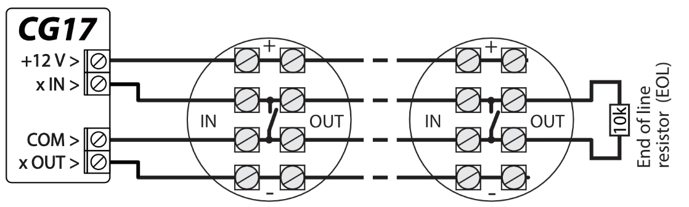

- **Connecting a two-wire smoke detector**

1)  using an EOL zone (or NC, no resistor).

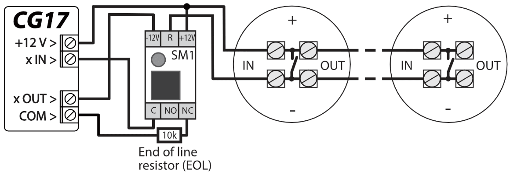

1)  using an EOL zone (or NO, no resistor).

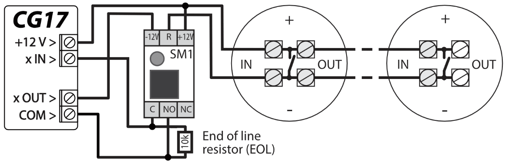

\*SM1 – a compatibility module made by Trikdis that allows to remotely restart a two-wire smoke detector after a triggered alarm.

### Schematics for connecting a temperature sensor

- Temperature sensors should be connected according to the given schematic. Maxim®/Dallas® DS18S20, DS18B20 temperature sensors (up to 8 units) can be connected to the *CG17*.

- If the wire connecting the temperature sensor is longer than 0,5 m, we recommend using a twisted pair cable (UTP4x2x0,5 or STP4x2x0,5).

Wire colors:

**Vdd** - red wire, connect it to the “+5 V” terminal;

**DQ** - yellow wire, connect it to the “1-Wire” terminal;

**GND** – black wire, connect it to the “COM” terminal.

### Schematics for connecting a relay and a LED

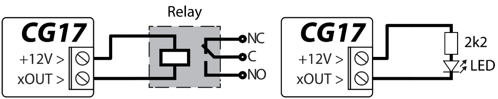

### Schematics for connecting contact key readers

The TM17 reader should be connected to the CG17 using an *RS485* data bus. The wire length of an *RS485* data bus can be up to 100 m. Up to eight TM17 readers can be connected to the CG17.

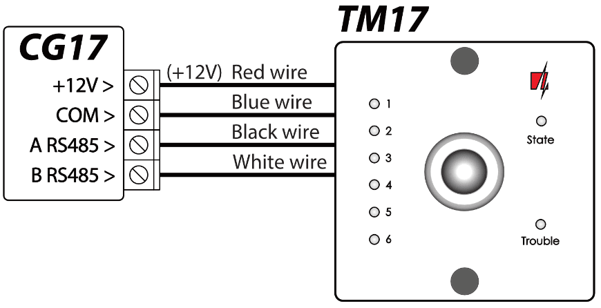

The iButton key reader should be connected to the CG17 using the “1 Wire” port. The wire length can be up to 30 m:

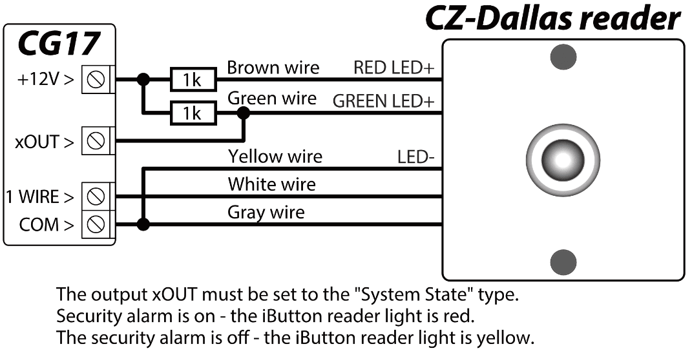

!!! note
    Linking keys to the CG17 is described in chapter 4.4.1
    „Registration of contact (iButton) keys".
### Schematic for connecting a wireless sensor RF-SH transceiver 

The wireless sensor *RF-SH* transceiver is meant for working with Crow brand wireless devices (movement sensors, magnetic contacts, siren, remote controllers etc.). One *RF-SH* transceiver can be connected to the *CG17*.

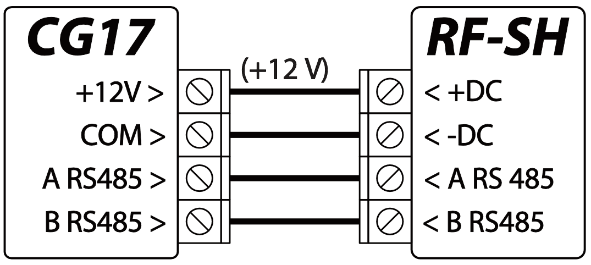

### Schematics for connecting iO series expander modules 

If the security control panel CG17 needs to have more inputs IN or outputs OUT, connect a wired or wireless TRIKDIS iO series input and output expander. The CG17 configuration for expander modules is described in chapter 4.5 ““Modules” window”. Up to eight iO-8 expansion modules can be connected to the CG17. The iO-8 module can use all or only a few zones. The total number of CG17 zones is 12 units.

  <figure style="margin: 0;">
    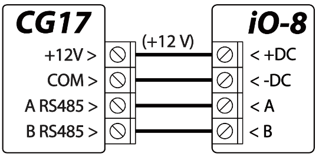
  </figure>
  <figure style="margin: 0;">
    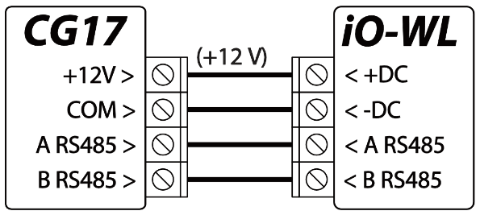
  </figure>

### Schematics for connecting keypad Crow CR-16 

Up to 8 keypads (Crow CR-16 Runner, Crow LCD Runner, Crow Touch Runner or Crow CR-16 PowerWave) can be connected to the *CG17*. In *TrikdisConfig*, it should be noted that the Crow keypad will be used (see chapter 4.2 „„System Options“ window“).

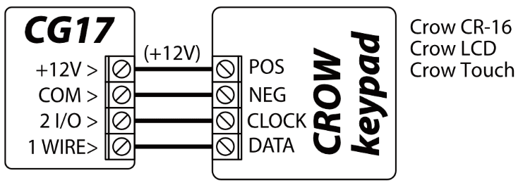

### Schematics for connecting a siren

- A siren that draws up to 1 A of current can be connected to the output 5 OUT or output 6 OUT.

- A siren that draws up to 100 mA of current can be connected to any output OUT.

- The output OUT must be assigned the function “Siren” and must have a security system area set.

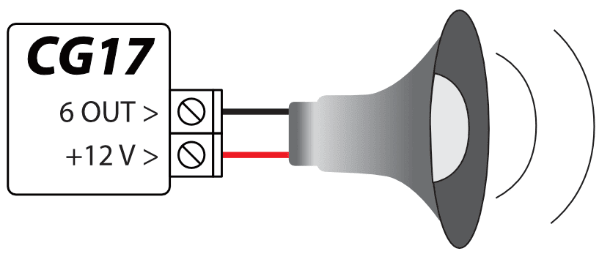

### Schematics for connecting iO series extension modules

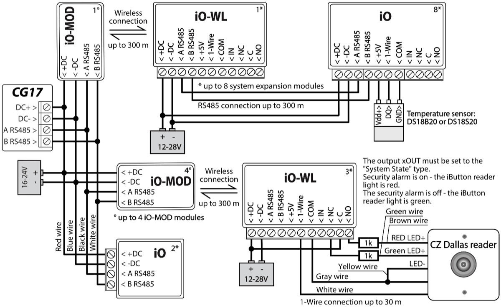

**Note:**

- If the wire connecting the temperature sensor is longer than 0,5 m, it is recommended to use a **twisted pair cable (UTP4x2x0,5 or STP4x2x0,5**).

- To one CG17 you can connect:

  - Up to four iO-MOD modules.

  - Up to eight iO or / and iO-WL modules.

- iButton key readers and temperature sensors should be connected to the „1-Wire” terminal.

### Schematics for connecting of the fuel level sensor Strela RS485

One „Strela RS485” fuel level sensor can be connected to the CG17. When the fuel sensor is connected, no other modules (iO-8, iO, iO-WL, RF-SH, TM17, E485, W485, iO-LORA, iO8-LORA, PB-LORA, REL-LORA) are connected to the CG17.

**Configuring and preparing the fuel level sensor to work with the *CG17***

It is mandatory to calibrate the fuel level sensor “**STRELA S485**” (<http://strela-fls.com/products/fuel_level_sensors_strela.html>) using the manufacturer’s calibration software “DUTConfig” (<http://strela-fls.com/programs.html>) and specify the fuel tank’s capacity – otherwise the sensor’s measurements can be imprecise.

1.  Connect the fuel level sensor to a computer using a programming adapter. Press the „brown” button on the adapter to make the green indicator in the RS-485 UART section light up.

2.  Launch the “DUTConfig” program. Choose “**Interface sensor**”.

3. Set “**View**” mode “**Standart**”.

2.  Click “**Connect**” and wait.

3. When the sensor is connected to “DUTConfig”, a box “**Connection: on**” appears.

    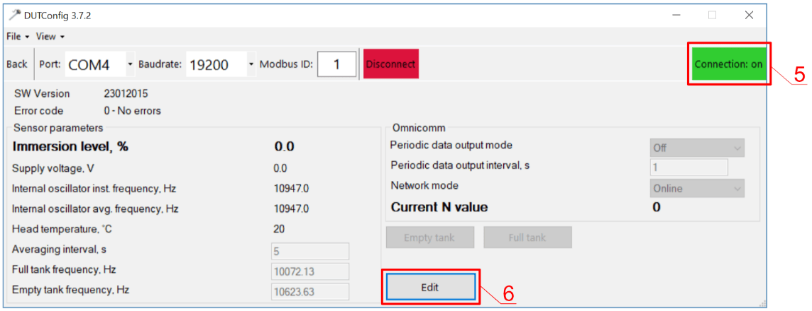

2.  Click the “**Edit**” button and calibrate the sensor in full and empty tank modes.

3.  Calibrating under real conditions: a) Fuel tank is full and the sensor is inside the fuel tank – click the button “**Full tank**”; b)** **Fuel tank is empty, when the sensor is removed from the fuel tank – click the button “**Empty tank**”**.**

4.  Click the “**OK**” button to save the values.

    

5.  Change the “**View**” mode to “**Extended**”.

10. Fill in the table according to the shape of the fuel tank. Simple method: just set 0% immersion as 0 litres and 100% immersion as the capacity of your fuel tank (the fuel tank in the example has a capacity of 200 l).

11. After you are done filling in the table, click “**OK**”.

12. Click the “**Disconnect**” button.

13. Disconnect the fuel level sensor and connect it to the CG17.

### Schematics for connecting a battery

A 12 V battery can be connected to the CG17. If AC power is lost, an event message *“AC fault”* will be sent and the CG17 will automatically switch to the 12 V battery.

- When the battery’s voltage drops to 11,5 V, an event message *“Battery low”* will be sent.

- When the battery’s voltage drops bellow 9,5 V, if there is no AC power, the CG17 will turn off.

- When AC power is restored an event message “**AC restore**” will be sent and the battery charging process will start automatically.

- When the battery’s voltage rises to 12,6 V, an event message “**Battery restore***”* will be sent.

**Connecting the battery:**

- Insert the backup battery into the casing.

- Connect the battery’s wires to the *CG17*’s backup power source contacts BAT+ / BAT–.

- Check to make sure the *CG17*’s charging current is sufficient to charge the battery.

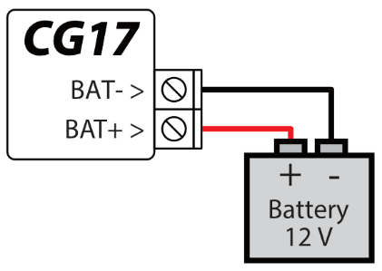

### Schematics for wiring the CG17 to a security control panel

*CG17* works in communicator mode. Inputs type of *CG17* must be set to NO ir NC and definition “24_hours”. / The *CG17* inputs could be described with SMS text messages that the user will receive when the inputs are event/restore. / PGM outputs of security control panel must be assigned to specific events.

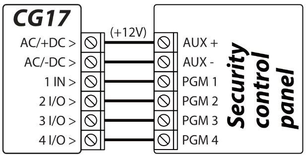

### DC Voltage measurement with CG17

The *CG17* can be used to measure DC voltage. Four *CG17* inputs 1IN, 2IN, 3IN, 4IN can be selected for voltage measurements. Voltage from 0 V to 30 V is measured (exceeding 30 V will cause damage to the control panel *CG17*). The measured voltage must be connected to terminals “1IN” and “COM”. “1IN” - positive terminal. “COM” - negative terminal.

Connect the CG17 to a computer with a USB Mini-B cable. Run TrikdisConfig. The software will automatically recognize the connected CG17 and will open a window for configuration. In the “**Sensor**” window, specify the “**In1 Voltage**” and also specify the amount of voltage above which a message will be generated.

- **Max** – when the voltage is higher than this setting, an event message will be generated. For an event message to be generated, the “**High**” box must be ticked.

- **Min** – when the voltage is lower than this setting, an event message will be generated. For an event message to be generated, the “**Low**” box must be ticked.

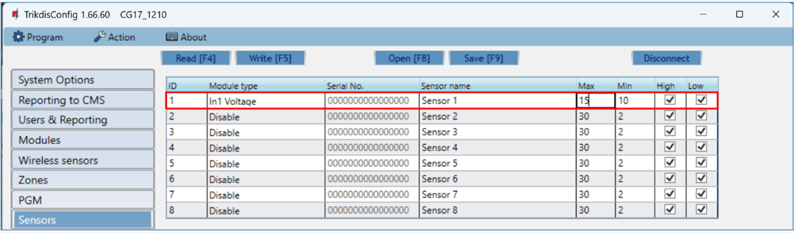

The PGM output can be controlled when measuring a voltage above a set value or below a set value. In TrikdisConfig you need to select the PGM output and set it to “**Remote Control**” operation mode.

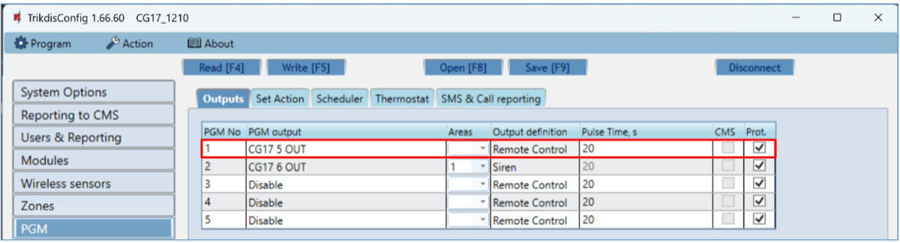

Go to the “**Set Action**” tab.

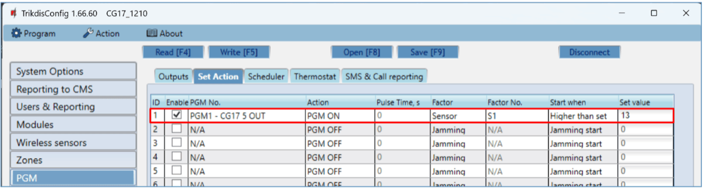

- **Enable** – enables the PGM.

- **PGM No.** – specify the PGM output that the “1IN” input will control.

- **Action** - set the operating mode of the PGM output:
- **PGM OFF** – turn off PGM output.

- **PGM ON** – enable PGM output.

- **Pulse OFF -** turning off the PGM output for the duration of the pulse (after receiving the command, the output turns off for the duration of the pulse and then turns on)**.**

- **Pulse ON** – turn on the PGM output for the duration of the pulse (after receiving the command, the output turns on for the duration of the pulse and then turns off).
- **Pulse time, s** – set the pulse time anywhere from 0 to 9999 seconds.
- **Factor** – set sensor.

- **Factor No.** – assign a voltage measuring input “1IN”.

- **Start when** – set an additional condition for activating the PGM output.
- **Set value** – specify the voltage (V) that the controller will monitor and control the PGM output.

### Schematic for connecting the *W485* WiFi module 

The *W485* module sends messages to the CMS (Central Monitoring Station) and to *Protegus2* using a WiFi internet router. When WiFi connectivity is available, the *CG17* (firmware from Ver.1.13) sends event messages via the *W485* module. When WiFi connectivity is disrupted, the *CG17* sends messages via GPRS. When WiFi connectivity is re-established, the *CG17* returns to sending messages via *W485*. / Configuration of the *W485* WiFi module to work with the *CG17* is described in chapter 4.5. „„Modules” window”. / You do not need a SIM card, when using the *W485* with the *CG17* security panel. / One *W485* module can be connected to the *CG17*.

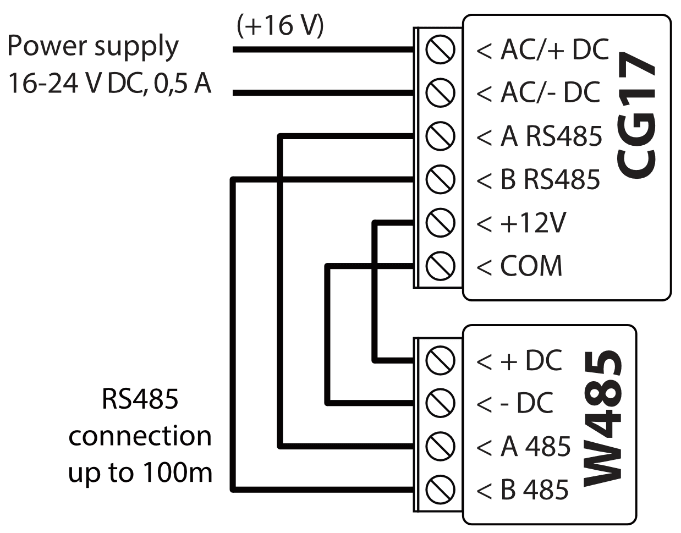

### Schematic for connecting the E485 „Ethernet“ module

The *E485* sends messages to the CMS (Central Monitoring Station) and to *Protegus2* using a wired internet connection. Using the *E485* with *CG17* (firmware from Ver.1.13), CSP and *Protegus* messages are sent over wired Internet and mobile Internet is not used. If a wired internet connectivity is disrupted, the *CG17* sends messages via the mobile Internet. When the wired Internet connectivity is re-established, *CG17* starts sending messages via *E485*. / Configuration of the *E485* WiFi module to work with the *CG17* is described in chapter 4.5. „„Modules” window”. / You do not need a SIM card, when using the *E485* with the *CG17* security panel. / One *E485* module can be connected to the *CG17*.

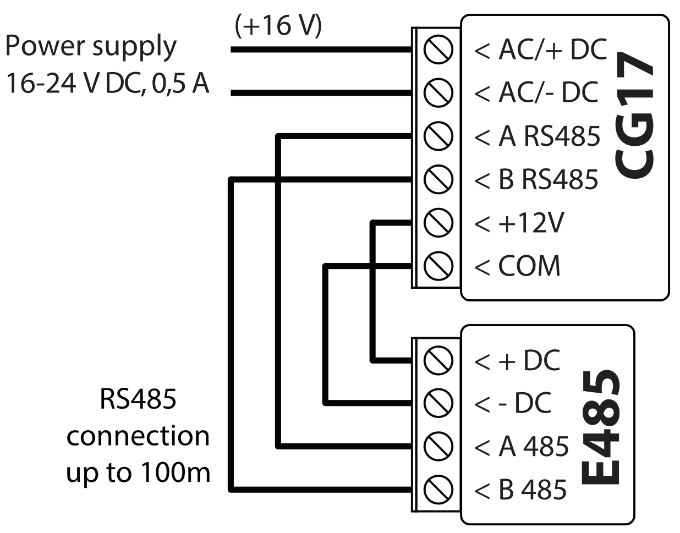

### Schematic for connecting of iO-LORA expansion modules 

CG17 controller firmware version 1.18 and higher.

Connect the RF-LORA transceiver to CG17. After that, you can use the iO-LORA, iO8-LORA, PB-LORA, REL-LORA modules. One RF-LORA transceiver can be connected to CG17.

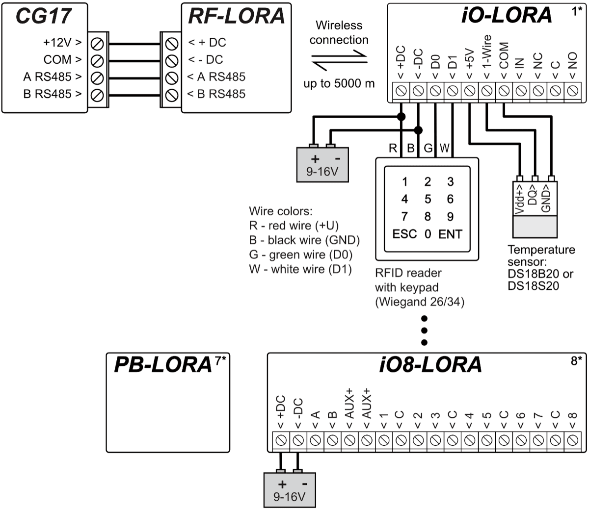

Launch TrikdisConfig. Connect the CG17 via USB Mini-B cable to the computer or remotely. Click the **Read [F4]** button in the TrikdisConfig program to display the current values of the controller's operating parameters. When prompted, enter the administrator or installer code in the pop-up window. In the "**Modules**" list, select the LORA module you are using. In the "**Serial No.**" field, enter the serial number of the module.

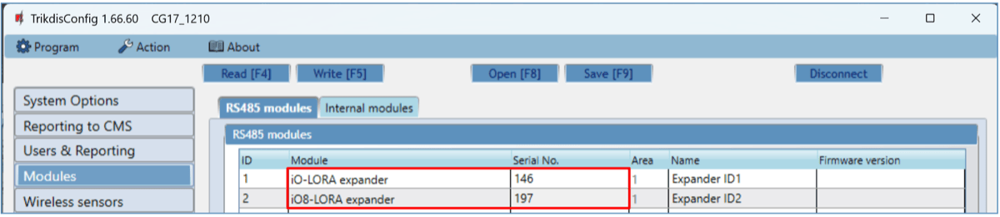

After making the changes click **Write [F5]**. Wait for the update to complete. Click "**Disconnect**" and unplug the USB Mini-B cable.

## Setting parameters using *TrikdisConfig* software 

1.  Download the configuration software TrikdisConfig from [www.trikdis.com/](http://www.trikdis.com/lt) (enter “TrikdisConfig” in the search field) and install it.

2.  Remove the lid of the CG17 using a flat-head screwdriver as shown below:

1.  Connect the CG17 to a computer using a USB Mini-B cable.

2.  Launch the configuration program TrikdisConfig. The program will automatically recognize the connected device and will automatically open the CG17 configuration window.

3.  Click the **Read [F4]** button to see the current parameters of the CG17. If prompted, enter the *administrator* or *installer* code in the pop-up window.

### Description of TrikdisConfig status bar 

Once the CG17 is connected to the TrikdisConfig software, the program will display information about the connected device in the status bar:

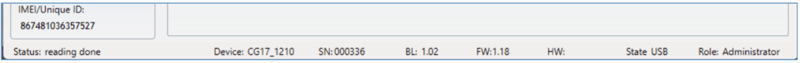

#### Status bar

| Name           | Description                                         |
|----------------|-----------------------------------------------------|
| IMEI/​Unique ID | The device’s IMEI number                            |
| Status         | Operational state                                   |
| Device         | Device type (must show CG17)                  |
| SN             | Device’s serial number                              |
| BL             | Bootloader version                                  |
| FW             | Device’s firmware version                           |
| HW             | Device’s hardware version                           |
| State          | Type of connection with the program (USB or remote) |
| Role           | Access level (shown after access code is approved)  |

!!! note
    Click **Read [F4]** to make the program read and display the settings
    that are currently saved on the device. / Click **Write [F5]** to save
    the settings displayed on the screen to the device. / Click
    **Save [F9]** to save the settings to a configuration file. You can
    upload the saved settings to other devices later. This allows to quickly
    configure multiple devices with the same settings. / Click
    **Open [F8]** and choose a configuration file to view previously saved
    settings. / If you want to revert to the default settings, click the
    "**Restore**" button at the lower left of the screen.
When the **Read [F4]** button is clicked, the program will read and show settings currently saved on the CG17. With TrikdisConfig, set the required parameters using the following program window descriptions.

### “System Options” window

**“System general” tab**

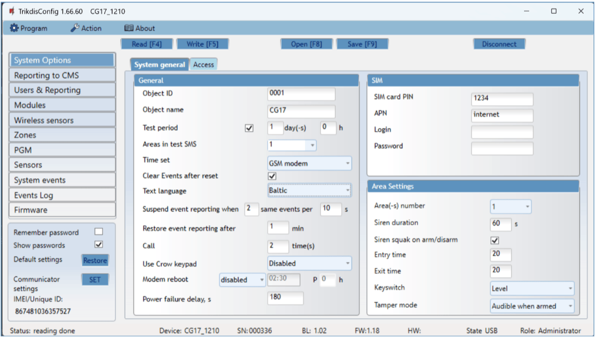

**Settings group “General”**

- If events are going to be sent to the CMS, enter the “**Object ID**” (4-symbol hexadecimal number, 0-9, A-F. **Do not use FFFE, FFFF Object ID.**) given by the CMS.

- **Object name** will be used in SMS messages about events (up to 20 symbols, letters and numbers can be used).

- **Test period** – when the box is ticked, periodic “**Test**” messages will be sent every set period.

- **Areas in test SMS** – the states of chosen areas will be sent in the test message.

- **Time set –** choose a server to synchronize time with. If you choose “**IP server**”, time will be synchronized with the IP receiver’s time, if you choose “**Cellular modem**”, time will be synchronized with the GSM service provider’s server time.

- **Clear Events after reset** – all unsent event messages will be deleted after reset.

- **Text language** – set the preferred language and the specific symbols of that language will be used in SMS messages.

- You can **Suspend event reporting when ...** a number of **same events per ... s** happen.

- **Restore event reporting after** – set the time after which suspending of event reporting will be cancelled. The time can be anywhere from 0 to 999 minutes.

- **Call –** after an event, the CG17 will call user(s) as many times as is specified. If the call is declined or answered, the CG17 will stop calling. Call time is 20 seconds.

- **Use CROW keypad** – specify the keypad type (**Crow CR-16**, **Crow LCD**, **Crow Touch**) connected to the control panel.

- **Modem reboot** - you can set the modem to restart at a specified time.

- **AC failure delay** - in the event of a power failure in the main power supply, a power failure notification will be sent after the specified time delay. When the supply voltage is restored, a notification of the supply voltage recovery will be sent after the specified time delay.

**Settings group “SIM”**

- Enter “**SIM card PIN**” code.

  - **APN** – service provider’s mobile internet access point name. You must enter the APN if event messages will have to be sent to Protegus cloud service or to the CMS via GPRS.
- If the SIM card’s GPRS service provider requires, enter the “**APN**” user name and password in the fieds “**Login**” and “**Password**”**.**

**Settings group “Area Settings”**

- **Area(-s) number** sets the number of independent parts of the alarm system.

If the siren is connected and an output OUT (must be allocated to an area) is set as “*Siren*”:

- **Siren duration** – duration of siren operation when the alarm is triggered. Time is anywhere from 0 to 999 seconds.

- **Siren squak on arm/disarm** – the siren will make a short sound once when the alarm is armed and twice when it is disarmed.

- **Entry time** – time for entering through the “**Delay**” zone. Time is anywhere from 0 to 999 seconds.

- **Exit time** –time for exiting through the “**Delay**” zone. Time is anywhere from 0 to 999 seconds. When the alarm is armed using the Protegus2 app or phone call, the system will not count the “**Exit time**”.

- **Keyswitch** sets the alarm’s arm/disarm mode using the “**Keyswitch**” zone*.* You can choose control using “**Pulse**” or “**Level**”.

- **Tamper mode** – choose the reaction type (“**Silent**”, “**Audible when armed**”, “**Always Audible**”) when the system detects a sensor tamper event. “**Silent**” – recipients will receive event reports, but the siren will not switch on; „**Audible when armed**“ - recipients will receive event reports, but the siren will switch on only if the tamper event happens when the system is armed; „**Always audible**“ - recipients will receive event reports and the siren will will switch on even when the alarm system is disarmed.

**“Access” tab**

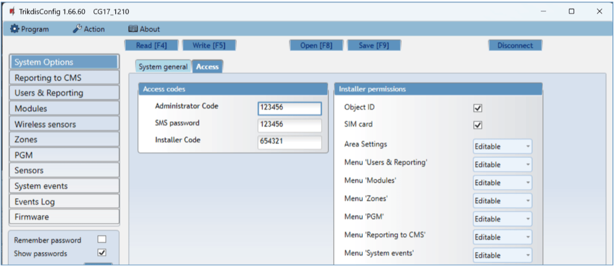

**Settings group “Access codes”**

- **Administrator Code** – *(default code - 123456)* gives full access to configuration (the code must be 6 symbols long; it must consist of latin letters and/or numbers).

- **SMS password –** *(default code - 123456)* is for safety when controlling with SMS messages. To ensure more safety, change it to a 6-symbol code only you know.

- **Installer Code** – (*default code - 654321*) gives the installer access to configuration. To ensure safety, change it to a 6-symbol code only you know.

!!! note
    If the default *administrator code* is set (123456), the software will
    not require it to be entered and clicking **Read [F4]** will
    immediately show the parameters currently saved on the device.
**Settings group “Installer permissions”**

- For setting installer’s rights.

### “Reporting to CMS” window 

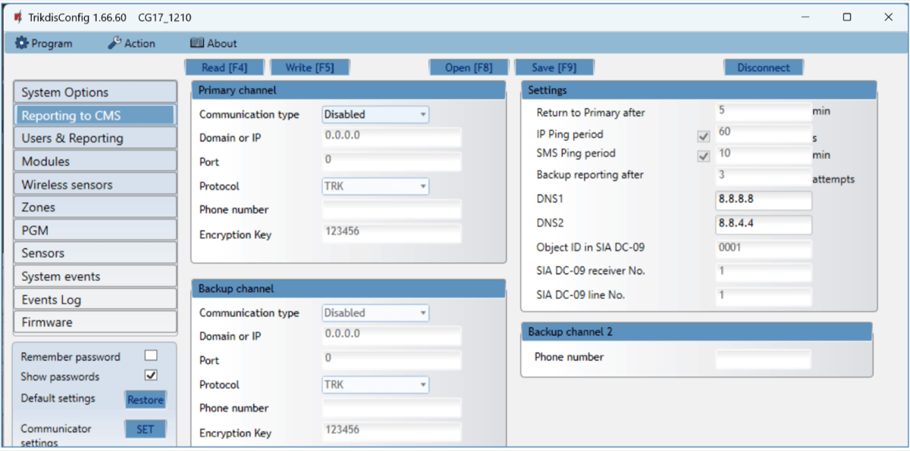

The control panel can send messages to the security company's CMS receiver.

**Settings groups “Primary channel” and “Backup channel”**

- **Communication type** – choose a protocol for communication with the receiver (TCP/IP, UDP/IP, SMS).

- **Domain or IP** – enter the receiver’s domain or IP address.

- **Port** – enter the receiver’s network port number.

- **Protocol – TRK** for event transfer using Trikdis receivers, **SIA DC-09** for event transfer using universal receivers.

- **Phone number** – phone number of CMS receiver capable of receiving SMS messages.

- **Encryption Key** – 6-digit message encryption key that must match the encryption key of the CMS receiver.

**Settings group “Settings”**

- **Return to primary after** – time period after which the CG17 will attempt to regain connection with the “**Primary channel**”, in minutes.

- **IP Ping period** – period for sending PING signals for checking connectivity on the GPRS channel, in seconds. To enable these signals, tick the box.

- **SMS PING period** – period for sending PING signals for checking connectivity on the SMS channel, in minutes. To enable these signals, tick the box.

- **Backup reporting after** – enter how many failed attempts to send messages using the “**Primary channel**” should happen before switching to the “**Backup channel**”.

- **DNS1 – DNS2** – DNS server addresses.

- **Object ID in SIA DC-09** – specify object number.

- **SIA DC-09 receiver No.** – specify receiver number.

- **SIA DC-09 line No.** – specify line number.

**Settings group “Backup channel 2”**

- **Phone number** – phone number of an CMS receiver capable of receiving SMS messages (e.g.: 370xxxxxxxx). The “**Backup SMS**” channel is used when messages fail to send using the “**Primary**” and “**Backup**” channels. This function is extremely useful because it works even when IP connectivity is disrupted in the mobile operator’s network. This channel only works when GPRS mode is set both for the “**Primary**” and “**Backup**” channels. SMS messages will be sent to the receiving center: 1) as soon as the CG17 is turned on for the first time; and 2) after loss of TCP/IP or UDP/IP connectivity on the “**Primary**” and “**Backup**” channels.

### “Users & Reporting“ window 

**“Users” tab**

**Settings group “Users & Reporting to User”**

- **ID** – user’s number on the list.

- **Name** – user’s name or e-mail. These names will be used in SMS messages about events. An administrator can specify a user's email. This will allow the user to log in to Protegus2.

- **Tel number** – user’s phone number. This number can control the alarm remotely and will receive SMS messages. The numbers must be entered with the international code.

- **Code** – the code for arming and disarming the alarm given for each user.

- **Areas** – areas the user can control. “**User ID9**” can control only area 1, parameter is uneditable.

- **A** – tick the box if you want to allow the user to ARM the alarm.

- **D** – tick the box if you want to allow the user to DISARM the alarm.

  - If **PGM** and **REC** boxes are not ticked, but both **A** and **D** are selected, when the user calls the CG17, their call will be declined, and the alarm will change its operational status to the opposite state, i.e., the alarm will be armed or disarmed.

  - If only **PGM** is ticked, the user can call the CG17 and turn on or turn off a desired output using DTMF tone commands.

- **REC** – future use.

  - **ACK** – if the box is ticked, the CG17 will send the user messages with “**SMS answer text**” after every command received in SMS messages.

- **FWD** – tick this box if you want to forward SMS messages received from non-system users (e.g., SIM card account balance, random promotional messages, etc.) to the user.

**Settings group “Cloud application”**

- **Enable cloud service** – enables “**Protegus service**”, so that the CG17 can exchange data with the Protegus2 app. Also allows remote configuration with TrikdisConfig.

- **Parallel reporting** – enable parallel sending of messages using the *main* channel and to Protegus2.

- **Cloud Access Code** – 6-digit code for connecting with Protegus2.

**Settings group “iButtons”**

!!! note
    More than one key can be assigned to a user! All newly registered keys
    will be assigned to the "**User ID9**" (No name). Names can be assigned
    only to eight users. Permissions for "**User ID9**" can be set using the
    settings group "**User ID9 permissions**".
- **ID** – key’s number on the list.

- **User** – the user the key is assigned to. To assign a key to a user, change “**ID9**” to any other user’s *ID* from the table **“Users & Reporting to User”**. (e.g. to assign a key to user No. 3, change “**ID9**” to “**ID3**”)

- **iButton code** –*iButton* key identification number or RFID card ID number.

- **Control** – choose what action the system must take after reading the key (e.g., TM17): None / Arm / Disarm / Arm & Disarm.

#### Registration of contact (iButton) keys

1.  If the “iButtons” list is empty, the first registered key is saved to the first line of the list and becomes the „**Master key**”.

2.  To turn on contact key registration mode, hold the “**Master key**” against the key reader for at least 10 seconds. When registration mode is on, the TM17 key reader’s LED indicator “*State*” will start to blink in green.

3.  To register user keys, hold them against the key reader one by one. 3 sound signals from the reader will indicate that the key has been registered.

4.  When you finish registering the user contact (*iButton*) keys, hold the “**Master key**” against the key reader again to turn off registration mode. When the registration mode is turned off, the “*State*” LED indicator of the **TM17** key reader will stop blinking*.*

5.  To delete all keys (including the master key), hold the “**Master key**” against the reader for at least 20 seconds.

!!! warning "Important"
    The "Master key" should only be used to register other contact
    keys!
#### Registration of RFID cards 

The CG17 control panel with the iO-LORA module is used, to which an RFID reader with a keypad is connected. The ID number of the RFID card is entered in the "**iButton code**" field.

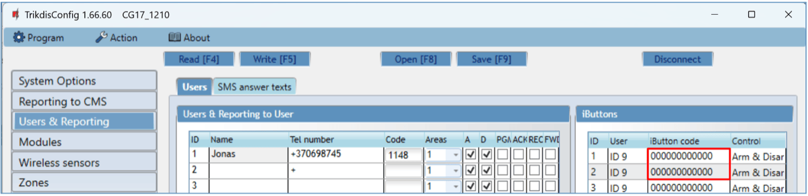

After making the changes click **Write [F5]**. Wait for the update to complete.

**“SMS answer texts” tab**

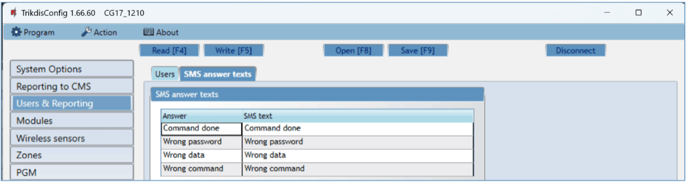

**Settings group “SMS answer texts”**

- Texts of answers to control commands sent using SMS messages can be edited in the field “**SMS text**”.

### “Modules” window

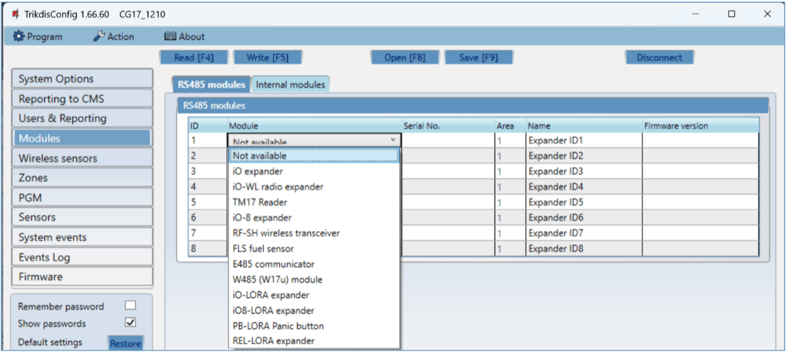

**Settings group “RS485 modules”**

- **ID** – module’s number on the list.

- **Module** – choose the modules being used (modules iO, iO-WL, TM17, iO-8, RF-SH, FLS, E485, W485, iO-LORA, iO8-LORA, PB-LORA, REL-LORA) from a list of modules.

- **Serial No.** – mandatory 6-digit number that can be found on stickers on the casing of the module and on the packaging.

- **Area** – assign the module to an area (the TM17 will show the state of the area it is assigned to and also the state of the zones assigned to the area).

- **Name** – you can give a name to the module.
- **Firmware version** – the firmware version will be shown once the CG17 detects the connected module.

#### WiFi module W485 settings window

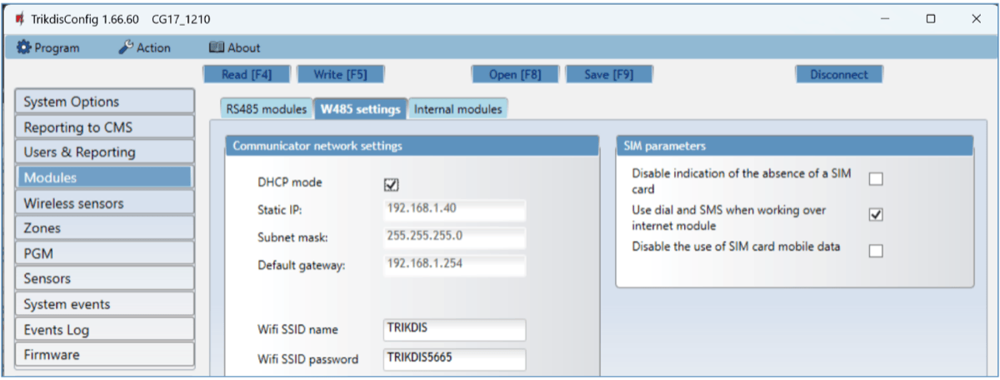

**Settings group “Communicator network settings”**

- **DHCP mode** – WiFi module’s mode for registering to network (manual or automatic).

- **Static IP** – static IP address for when manual registering mode is set.

- **Subnet mask** – subnet mask for when manual registering mode is set.

- **Default gateway** – gateway address for when manual registering mode is set.

- **Wifi SSID name** – name of the WiFi network that the W485 will connect to.

- **Wifi SSID password** - WiFi network password.

**Settings group “SIM parameters”**

- **Disable indication of the absence of a SIM card** – checking this box will disable indication about SIM card absence when the CG17 is working without a SIM.

- **Use dial and SMS when working over internet module** – checking this box will enable sending notifications simultaneously via call, SMS and the connected WiFi module W485. If the field is unchecked and there is a WiFi network, then SMS and calls are not used. If the field is unchecked and there is no WiFi network, then CG17 can manage call and SMS messages. CG17 will send SMS messages to the user.

- **Disable the use of SIM card mobile data** - checking this box will disable mobile data usage on the SIM card. Data will only be sent via module W485. If the WiFi network disappears CG17 will store data in memory. After restoring the WiFi network, the CG17 will send the saved data via the WiFi W485 module***.***

In the table, you can assign Contact ID event and restore codes to the RS485 data bus fault event. When connection between the W485 and CG17 is disrupted or re-established, the CG17 will send a message with the assigned CID code to the CMS and Protegus2 app.

!!! note
    You must configure the CG17 to send messages to CMS and
    Protegus, see chapters 2.2 "Settings for connection with Central
    Monitoring Station" and 2.1 "Settings for connection with Protegus2
    app". / **You do not need a SIM card, when using the *W485* with the
    *CG17* (firmware from Ver.1.13) security panel.**
#### “Ethernet” module E485 settings window

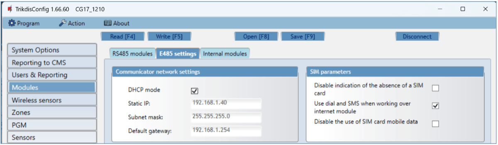

**Settings group “Communicator network settings”**

- **DHCP mode** – ethernet module’s mode for registering to network (manual or automatic).

- **Static IP** – static IP address for when manual registering mode is set.

- **Subnet mask** – subnet mask for when manual registering mode is set.

- **Default gateway** – gateway address for when manual registering mode is set.

**Settings group “SIM parameters”**

- **Disable indication of the absence of a SIM card** – checking this box will disable indication about SIM absence when the CG17 is working without a SIM.

- **Use dial and SMS when working over internet module** – checking this box will enable sending notifications simultaneously via call, SMS and the connected “Ethernet” module E485. If the field is unchecked and there is internet, then SMS and calls are not used. If the field is unchecked and there is no Internet, then CG17 can manage call and SMS messages. CG17 will send SMS messages to the user.

- **Disable the use of SIM card mobile data** - checking this box will disable mobile data usage on the SIM card. Data will only be sent via module E485. If the internet disappears CG17 will store data in memory. When the Internet is restored, the CG17 will send the saved data via the “Ethernet” E485 module***.***

In the table, you can assign Contact ID event and restore codes to the RS485 data bus fault event. When connection between the E485 and CG17 is disrupted or re-established, the CG17 will send a message with the assigned CID code to the CMS and Protegus2 app.

!!! note
    You must configure the CG17 to send messages to CMS and
    Protegus2, see chapters 2.2 "Settings for connection with Central
    Monitoring Station" and 2.1 "Settings for connection with Protegus2
    app". / **You do not need a SIM card, when using the *E485* with the
    *CG17* (firmware from Ver.1.13) security panel.**
**“Internal modules” settings window**

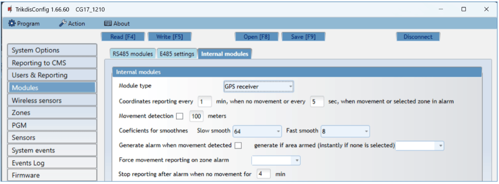

**Settings group “Internal modules”**

- **Module type** – choose the GPS module that is being used.

- **Coordinates reporting every \_\_ min, when no movement or every \_\_ sec, when movement or selected zone in alarm** – specify intervals for sending coordinates when in ordinary mode and when movement is detected or the alarm is triggered in the zone.

- **Movement detection** – if the box is ticked, the alarm will be triggered if the difference between coordinates is larger than specified. Coordinates will be sent more often.

- **Coefficients for smoothness, Slow smooth** – averaged coordinates are sent when there is no movement (the average is taken from the specified number of coordinates – 256 or other specified number).

- **Coefficients for smoothness, Fast smooth** – averaged coordinates are sent when there is movement or the zone is in alarm state (the average is taken from the specified number of coordinates – 8 or other specified number).

- **Generate alarm when movement detected** – if the box is ticked, the CID event code is sent to the CMS and the user to the Protegus2, when movement is detected.

- **Force movement reporting on zone alarm** – specify the security system’s zone to which a sensor is connected. If the sensor is triggered (interpreted as a zone alarm) the CG17 sends coordinates more often.

- **Stop reporting after alarm when no movement for \_\_ min** – specify time interval (in minutes). If the coordinates do not change and there is no zone alarm during this time, coordinate sending returns to ordinary mode.

Messages with the coordinates are sent to the monitoring program Monas MS.

#### Linking a fuel level sensor “STRELA RS485” 

!!! note
    The fuel level sensor "**Strela RS485**" must be calibrated with the
    manufacturer's software **"DUTconfig**" before being used. The fuel
    level sensor is connected to the computer using an adapter and then
    calibrated. Once the fuel level sensor "**Strela RS485**" is connected
    to the CG17, other RS485 modules (iO, iO-WL,
    TM17, iO-8, RH-SH, E485, W485,
    iO-LORA, iO8-LORA, PB-LORA, REL-LORA) will
    become inactive.
**Settings group “RS485 modules”**

- **Module** – select the module **FLS fuel sensor**.

Click **Write [F5]**. Wait until the data is saved. Remove the USB cable from the CG17. Wait for about 1 minute. Connect the USB cable to the CG17. Click **Read [F4]**. The program will read and show the settings currently saved on the CG17. The “**Serial No.**” and “**Firmware version**” of the fuel level sensor “**Strela S485**” will appear in the program window “**Modules**”.

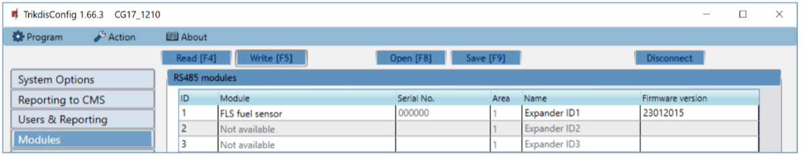

Open the “**Sensors**” window.

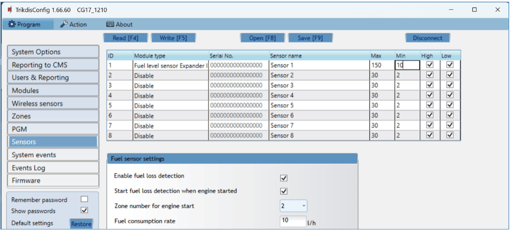

- **Module type** – choose “**Fuel level sensor**”.

- **Sensor name** – name the sensor.

- **Max** – enter the maximum amount of fuel (in liters). When the actual amount is higher than specified in this setting, an event message will be formed. For the message to be sent, the “**High**” box must be ticked.

- **Min** – enter the minimum amount of fuel (in liters). When the actual amount is lower than specified in this setting, an event message will be formed. For the message to be sent, the “**Low**” box must be ticked.

**Settings group “Fuel sensor settings”**

- **Enable fuel loss detection** – ticking the box will enable fuel level monitoring.

- **Start fuel loss detection when engine started** – if the box is ticked, fuel level monitoring will begin when the engine is started. The engine start signal must be sent to the CG17 input (zone) that is chosen in the next setting.

- **Zone number for engine start** – specify the number of the CG17 input (IN) that the engine start will enable.

- **Fuel consumption rate** – enter the fuel consumption rate.

The user will be informed about sudden fuel level changes with an SMS message. The user can edit the text of the SMS message.

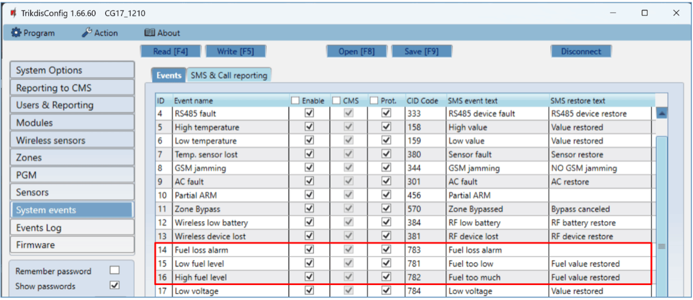

Description of the operation of the fuel level sensor. The fuel level sensor **Strela RS485** is connected to the CG17 (see 3.10 „Schematics for connecting of the fuel level sensor Strela RS485”). The measuring parameters are set for the CG17. The fuel level sensor starts measurements:

1.  When the box "**Enable fuel loss detection**" is ticked. When the power is turned on for the CG17, the fuel level sensor starts to monitor fuel consumption. Measurements stop when the power for the CG17 is turned off.

2.  The boxes “Enable fuel loss detection” and “Start fuel loss detection when engine started” are ticked. Also, the number of the input (IN) that will start fuel level monitoring when it is enabled (engine is started) must be specified. When the input (IN) is restored (engine off) fuel level monitoring will be stopped.

Every time the fuel level sensor is turned on, it measures the current fuel level and compares it to the fuel level that was saved to memory before the sensor was turned off. If the current fuel level is lower, the CG17 sends messages about fuel loss to the security company and/or to users.

During operation, the fuel level sensor measures the fuel level every time interval and compares it to the consumption rate. If the fuel consumption in a time interval is larger than the entered fuel consumption rate, the CG17 sends messages to the security company and/or to users.

### “Wireless sensors” window

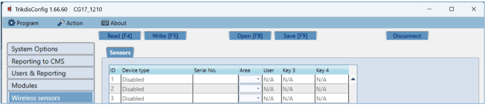

The CG17 can operate with Crow brand wireless Shepherd series sensors, sirens, remote controls using an **RF-SH** module.

#### Pairing a wireless device RF-SH transceiver to the *CG17*

1.  Connect the **RF-SH** transceiver to the CG17 according to the schematic at **3.7 “Schematic for connecting a wireless sensor RF-SH transceiver”**.

2.  Turn on the power.

3.  Connect a USB Mini-B cable to the ***CG17*.**

4.  Launch the TrikdisConfig program, click the button **Read [F4]**.

5.  In the „**Modules”** list, choose “**RF-SH wireless transceiver”**.

6.  Enter the device’s serial number in the field “**Serial No”**.

7.  Click **Write [F5]**.

8.  Unplug the USB Mini-B cable.

9.  Wait 1 minute for the CG17 and **RF-SH** to connect to each other.

10. Connect the USB Mini-B cable to the **CG17**.

11. Click **Read [F4]**.

12. The **RF-SH**’s firmware version will appear in the “**Modules**” window.

13. The **RF-SH** module is now paired to the CG17.

All wireless sensors can be paired at once.

#### Pairing wireless sensors (FW2)

1.  Make sure that the **RF-SH** transceiver is paired to the CG17 (see chapter 4.6.1 above).

2.  Turn on the power.

3.  Remove the lid from the **RF-SH** transceiver.

4.  Press and hold the **RF-SH** module’s “**LEARN”** button until the “**LEARN”** LED indicator starts blinking in green.

5.  Release the button.

6.  The green blinking “**LEARN”** LED indicator shows that the **RF-SH** is in wireless sensor linking mode.

7.  Insert a battery into the wireless sensor and wait until the sensor’s LED indicators stop blinking.

8.  Briefy press the Tamper button on the sensor and release it.

9.  After releasing the Tamper button, the sensor’s LED indication will change:

    1.  Indicator is blinking in green and red – the sensor has been successfully added to the system.

    2.  Indicator is blinking only in green – sensor linking failed. Repeat the registration procedure.

    3.  Indicator blinking in red – battery voltage too low (change the battery).

10. Press and hold the **RF-SH** transceiver’s “**LEARN”** button until the “**LEARN”** LED indicator stops blinking in green. The **RF-SH** transceiver has exited linking mode.

11. Connect a USB Mini-B cable to the CG17.

12. Launch TrikdisConfig, click the **Read [F4]** button.

13. There will be a list of registered wireless sensors in the “**Wireless sensors”** window of the TrikdisConfig program. The 7-symbol codes in the “**Serial No.”** field must match the sensor codes found on the back of the casing or on the board.

14. The sensors must be assigned to the control panel’s zones and areas (“**Zones”** window). After making the changes click **Write [F5]**.

15. The wireless sensor is now paired to the system.

!!! note
    Deleting wireless sensors from the CG17's memory:
    
    1.  Connect a USB Mini-B cable to the CG17.
    
    2.  Launch **TrikdisConfig**, click the **Read [F4]** button.
    
    3.  In the "**Wireless sensors"** window of TrikdisConfig, specify
        "**Disabled"** in the '**Device type"** field on the line of the
        **wireless sensor** that you want to delete and click
        **Write [F5]**. The wireless sensor is now deleted from the
        CG17's memory.
#### Pairing a wireless keyfob (FW2)

1.  Make sure that the wireless RF-SH transceiver is linked to the *CG17* (see chapter 4.6.1 above).

2.  Turn on the power.

3.  Remove the lid from the RF-SH transceiver.

4.  Press and hold the RF-SH module’s “LEARN” button until the “LEARN” LED indicator starts blinking in green.

5.  Release the button.

6.  The green blinking “LEARN” LED indicator shows that the RF-SH is in wireless device linking mode.

7.  Press buttons 3 and 4 on the wireless controller and hold. A LED indicator will start blinking in yellow. After a few seconds it will stop and a green indicator will light up for a short period of time.

8. Release the buttons 3 and 4. The wireless controller is linked.

2.  Press and hold the **RF-SH** transceiver’s ‘**LEARN”** button until the “**LEARN”** LED indicator stops blinking in green. The **RF-SH** transceiver has exited linking mode.

3.  Connect a USB Mini-B cable to the CG17.

4.  Launch TrikdisConfig, click **Read [F4]**.

5.  In the TrikdisConfig software window “**Wireless sensors”**, the text “**Keyfob”** must appear in the “**Device type”** field and the field “**Serial No.”** must have a 7-symbol code matching the code on the back of the remote keyfob.

6.  In the “**Area”** field specify the security system area that the wireless controller will control (arm / disarm).

7.  In the “**User”** field specify the user’s number.

8.  You can assign additional functions to the controller’s buttons 3 and 4 (Arm, Disarm area; Silent alarm; Panic alarm).

9.  After making the changes click **Write [F5]**.

10. The wireless controller is now paired to the system.

!!! note
    Reverting the remote controller to default settings:
    
    1.  Press buttons 2 and 3 at once and hold until the indicator starts
        blinking in green and red.
    
    2.  You can release the buttons when the indicator stops blinking. The
        controller's memory is cleared.
#### Pairing a wireless siren (FW2)

1.  Make sure that the wireless **RF-SH** transceiver is linked to the CG17 (see chapter 4.6.1 above).

2.  Turn on the power.

3.  Remove the lid from the **RF-SH** transciever.

4.  Press and hold the **RF-SH** module’s “**LEARN”** button until the “**LEARN”** LED indicator starts blinking in green.

5.  Release the button.

6.  The green blinking “**LEARN”** LED indicator shows that the **RF-SH** is in wireless device registration mode.

7.  Remove the lid from the siren.

8.  Connect a power supply to the siren.

9.  The flash of the siren will blink rarely for 30 seconds. When the indicator stops blinking, the siren is ready for linking.

10. Press and hold the ‘**LEARN”** button on the siren’s board.

11. The flash will start to blink.

12. Release the button. When the flash stops blinking, the siren will have linked.

13. Press and hold the **RF-SH** transceiver’s “**LEARN”** button until the “**LEARN”** LED indicator stops blinking in green. The **RF-SH** receiver has exited linking mode.

14. Connect a USB Mini-B cable to the CG17.

15. Launch **TrikdisConfig**, click **Read [F4]**.

16. In the TrikdisConfig software window “**Wireless sensors**”, the text “**Siren”** must appear in the “**Device type”** field and the field “**Serial No.”** must have a 7-symbol code matching the code on the board of the siren.

17. Enter an area number in the “**Area”** field and click **Write [F5]**.

18. The wireless siren is now fully paired to the system.

!!! note
    Reverting the wireless siren to default settings:
    
    1.  Remove the lid from the siren.
    
    2.  Disconnect the power from the siren.
    
    3.  Press the "**LEARN"** button on the siren's board and turn on the
        power.
    
    4.  Hold the "**LEARN"** button until the siren's flash blinks 3 times.
    
    5.  Release the "**LEARN'** button. The siren's flash will blink in rare
        intervals for another 30 seconds.
    
    6.  The flash will stop binking. The wireless siren's default settings
        have been restored.
#### Pairing wireless sensors (SH)

1.  Make sure that the **RF-SH** transceiver is paired to the CG17 (see chapter 4.6.1 above).

2.  Turn on the power.

3.  Remove the lid from the **RF-SH** transceiver.

4.  Press and hold the **RF-SH** module’s “**LEARN”** button until the “**LEARN”** LED indicator starts blinking in green.

5.  Release the button.

6.  The green blinking “**LEARN”** LED indicator shows that the **RF-SH** is in wireless sensor linking mode.

7.  Insert a battery into the wireless sensor and wait until the sensor’s LED indicators stop blinking. When the linking process is complete, the green LED indicator will light up on the sensor for 3 seconds and then it will turn off.

8.  If the linking process fails, the LED indicator will stop blinking. Remove the battery, wait for ~10 seconds and repeat the linking process.

9.  Press and hold the **RF-SH** transceiver’s “**LEARN”** button until the “**LEARN”** LED indicator stops blinking in green. The **RF-SH** transceiver has exited linking mode.

10. Connect a USB Mini-B cable to the CG17.

11. Launch TrikdisConfig, click the **Read [F4]** button.

12. There will be a list of registered wireless sensors in the “**Wireless sensors**” window of the TrikdisConfig program. The 7-symbol codes in the “**Serial No.”** field must match the sensor codes found on the back of the casing or on the board.

13. The sensors must be assigned to the control panel’s zones and areas (“**Zones”** window). After making the changes click **Write [F5]**.

14. The wireless sensor is now paired to the system.

!!! note
    Deleting wireless sensors from the CG17's memory:
    
    1.  Connect a USB Mini-B cable to the CG17.
    
    2.  Launch **TrikdisConfig**, click the **Read [F4]** button.
    
    3.  In the "**Wireless sensors**" window of TrikdisConfig, specify
        "**Disabled"** in the "**Device type"** field on the line of the
        **wireless sensor** that you want to delete and click
        **Write [F5]**. The wireless sensor is now deleted from the
        CG17's memory.
#### Pairing a wireless keypad (SH) 

1.  Make sure that the wireless **RF-SH** transceiver is linked to the CG17 (see chapter 4.6.1 above).

2.  Turn on the power.

3.  Remove the lid from the **RF-SH** transceiver.

4.  Press and hold the **RF-SH** module’s “**LEARN”** button until the “**LEARN”** LED indicator starts blinking in green.

5.  Release the button.

6.  The green blinking “**LEARN”** LED indicator shows that the **RF-SH** is in wireless device linking mode.

7.  Insert batteries into the keypad and wait for the  LED indicator to stop blinking in red and green. When the linking process is complete, the LED indicator will light up in green for 3 seconds and then it will turn off.

8.  Press and hold the **RF-SH** transceiver’s “**LEARN”** button until the “**LEARN”** LED indicator stops blinking in green. The **RF-SH** receiver has exited linking mode.

9.  Connect a USB Mini-B cable to the CG17.

10. Launch **TrikdisConfig**, click **Read [F4]**.

11. In the TrikdisConfig software window “**Wireless sensors**”, the text “**Keypad SH”** must appear in the “**Device type”** field and the field “**Serial No.”** must have a 7-symbol code matching the code on the back of the keypad.

12. Specify an area number in the “**Area”** field and enter a user’s number in the “**User”** field.

13. After making the changes click **Write [F5]**.

14. The wireless keypad is now paired to the system.

!!! note
    Removing wireless sensors from the CG17's memory:
    
    1.  Connect a USB Mini-B cable to the CG17.
    
    2.  Launch **TrikdisConfig**, click the **Read [F4]** button.
    
    3.  In the "**Device type"** field of the TrikdisConfig window
        "**Wireless sensors**", instead of "**Keypad SH"**, specify
        "**Disabled"** and click **Write [F5]**. The wireless keypad is
        now removed from the CG17's memory.
### “Zones” window 

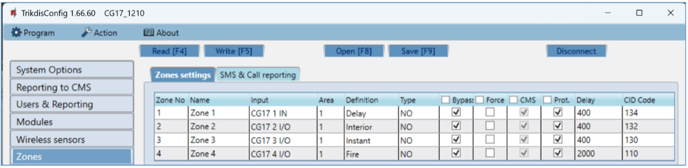

**“Zones settings” tab**

- **Zone No** – the zone’s number on the list.

- **Name** - enter the name of the zone.

- **Input** – choose a CG17 or external module input IN to assign to the zone.

- **Area** – assign a zone to an area.

- **Definition** – you can assign every zone one of these functions:

  - **Delay** – for connecting a magnetic entrance door contact. You can set entry and exit times for this type of zone.

    After the alarm is armed, the violation of the “Delay” zone is allowed within the exit time. If the zone is still violated when the time is up, outputs OUT “Siren” and “Flash” are turned on and alarm reports are sent.

    When the alarm is armed, a violation of the “Delay” zone starts the entry time counter, during which the alarm must be disarmed. If the alarm is still not disarmed when the time is up, outputs OUT “Siren” and “Flash” are turned on and alarm reports are sent.

  - **Interior** – for connecting a movement sensor to the entry door.

    When the alarm is armed, if the “Interior” zone is violated, OUT outputs “Siren” and “Flash” are turned on and alarm reports are sent.

    If the alarm is armed and the first zone to be violated is the “Delay” zone, the “Interior” zone may also be violated during the set entry time. If the alarm is not disarmed when the set entry time is up, outputs OUT “Siren” and “Flash” are turned on and alarm reports are sent.
- **Instant** – for connecting movement sensors. If the “Instant” zone is violated when the alarm is armed, OUT outputs “Siren” and “Flash” are turned on and a message about the alarm being triggered is sent.

- **Fire** – for connecting fire sensors. If this zone is violated, OUT outputs “Siren” and “Flash” are turned on immediately and a message about the event is sent.

  - **Keyswitch** – for connecting a keypad or other switch. If the switch violates this zone the security alarm will be armed or disarmed. The alarm will be armed again after the set “**Exit time**” passes.

  - **24 hours** – for connecting glass break and tamper detectors. If this zone is violated, OUT outputs “Siren” and “Flash” are turned on immediately and a message about the event is sent.

  - **Silent** – if the alarm armed and this zone is violated, an event message will immediately be sent, but “Siren” and “Flash” output signals will not be formed.

  - **SIlent 24h** – for connecting panic buttons. If this zone is violated, an event message will immediately be sent regardless of the state of the security system, but “Siren” and “Flash” output signals will not be formed.
- **Type** – choose the type of circuit connected to the zone input IN from the list: NC – normally closed, NO – normally open, EOL – end of line 10 kΩ resistor, EOL_T – with an end of line resistor and tamper monitoring.

- **Bypass** – tick this box if you want to bypass a zone and ignore when it is triggered.

- **Force** – tick this box if you want to allow arming the security system with an open zone. If the alarm is armed, violating the zone that is in “Force” mode will trigger the alarm.

- **CMS**– if the box is ticked, event messages for this zone will be sent to CMS (Central monitoring station).

- **Prot.** – if the box is ticked, zone event reports will be sent to Protegus cloud.

- **Delay** –input IN zone reaction time, in miliseconds.

- **CID code** – Contact ID codes for events. The code will be set automatically when you choose a zone definition.

**“SMS & Call reporting“ tab**

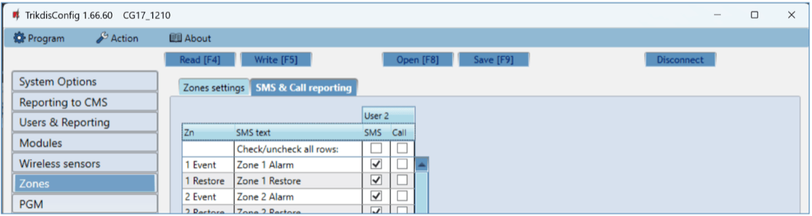

This window will only show if at least one user phone number is added in the “Users & Reporting” window*.*

- **Zn** – zone number with event identification word. Can be *“Event”* or *“Restore”*.

- **SMS text** – description of the zone event that will be used in SMS messages sent to users.

- **SMS/Call** – tick the ways in which users will be informed about events – SMS messages and/or calls.

### “PGM” window 

**“Outputs” tab**

- **PGM No**– the PGM’s number on the list.

- **PGM output** – assign the CG17’s or external device’s outputs OUT to a PGM.

- **Areas** – assign an output OUT to an area.

- **Output definition** – choose operational mode for the output OUT.
- **Siren** – for connecting a siren.

- **Remote Control** – for controlling external devices.

- **Fire sensor reset** – for resetting a fire sensor after triggering.

- **System state** – for connecting a security system state indicator. E.g., a LED can display when the alarm is armed / disarmed.

- **Flash** – if the alarm is armed a line signal is formed, if it is triggered – a pulse type signal. The signal is cut off when the alarm is turned off.

- **Thermostat** - OUT output will be controlled according to the set temperature sensor temperature.
- **Pulse time, s** – you can set the desired OUT turn on duration from 0 to 9999 seconds.

- **CMS** – if this box is ticked, PGM output turn on/off reports will be sent to the central monitoring station (CMS).

- **Prot.** – if the box is ticked, PGM output turn on/off reports will be sent to Protegus cloud.

**“Set Action” tab**

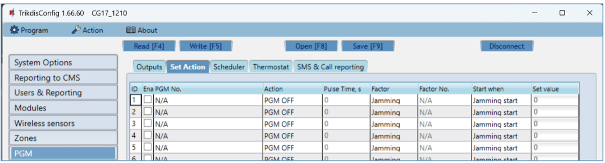

- **ID** – output’s number on the list.
- **Enable** – enables the PGM.

- **PGM No.** – choose the desired PGM output OUT that will be controlled when the event specified in the columns **Factor**, **Factor No.**, **Start when**, **Set value** happens.

- **Action**:
- **PGM OFF** – state of output OUT – “Off”.

- **PGM ON** – state of output OUT – “On”.

- **Pulse OFF** – initial state of output OUT - „On“. After a command the OUT state will become “Off” during the “**Pulse time**”, and later it will automatically return to the initial “On” state**.**

- **Pulse ON** – initial state of output OUT - „Off“. After a command the OUT state will become “On” during the “**Pulse time**”, and later it will automatically return to the initial “Off” state**.**
- **Pulse time, s** – you can set the pulse time anywhere from 0 to 9999 seconds.
- **Factor/Factor No.** – choose which event (*Zone, Sensor, Schedule, Jamming*, *Sensor lost*, *iButton, Arm, Disarm, SMS received*) turns on the output OUT.

  - You can assign a schedule to an output to turn the output on at specified times. In the “**Scheduler**” tab, you can prepare 10 schedules.

- **Start when** – you can set an additional condition when to turn on the output OUT depending on the “**Factor**” event.

- **Set value** – depending on the selected condition in the “**Factor**” column (*SMS received, Sensor*), you can set the value (text of the incoming SMS message or specify the voltage or temperature value) that will be used to control the PGM output.

The text of the SMS message can be distinguished be the % symbols. % symbol separates the PGM control keyword from all SMS text.

**%.....%** - the text portion of an incoming SMS message must match the text entered between % symbols (example: **%sMS%**. In the SMS message text should contain the text „**sMS**“. Example of SMS message: **1155sMS332**).

**.....%** - the start of the text of the incoming SMS message must match the text recorded before the % symbol (example: **sMS%**. The SMS message text must start the text „**sMS**“. Example of SMS message: **sMS332**).

**%.....** - the end of the text of the incoming SMS message must match the text recorded after the % symbol (example: **%sMS**. The SMS message text must end the text „**sMS**“. Example of SMS message: **1155sMS**).

SMS text messages are important uppercase and lowercase letters.

**“Scheduler” tab**

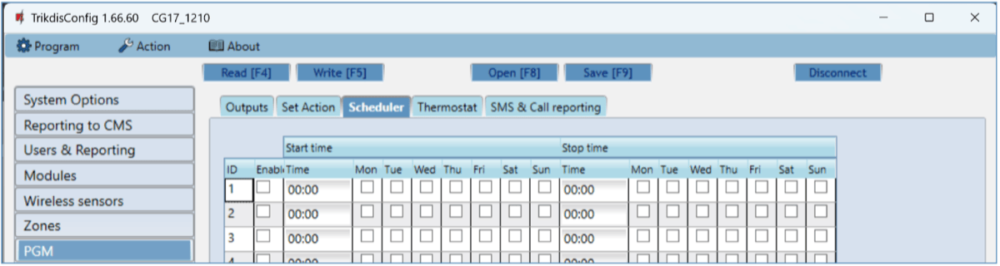

- **ID** – schedule’s number on the list.

- **Enable** – enable the schedule.

- **Start time** – set the time when OUT will be turned on (schedule start time).

- **Stop time** – set the time when OUT will be turned off (schedule end time).
- **Mon – Sun** – you can mark the days of the week when OUT will have to be turned on/off.

**“Thermostat” tab**

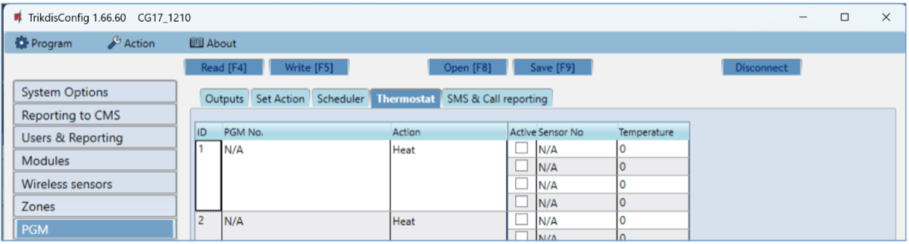

- **ID** – thermostat’s number on the list.

- **PGM No.** – specify the number of the PGM output that the thermostat will control.

- **Action** – specify the thermostat’s operational mode: heat or cool.

- **Active** – if the box is ticked, the thermostat will work with the chosen temperature sensor according to the set temperature.

- **Sensor No –** assign a temperature sensor to a thermostat.

- **Temperature –** set the temperature that the thermostat will maintain.

**“SMS & Call reporting” tab**

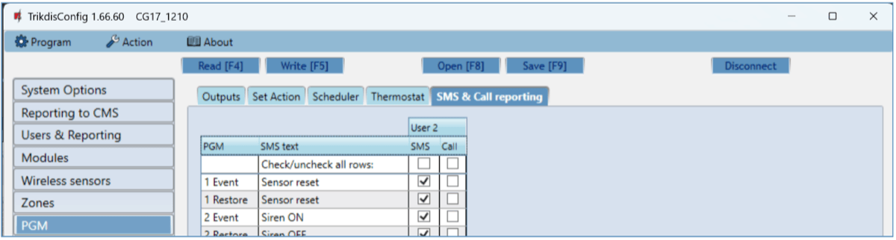

This window will only show if at least one user phone number is added in the “Users & Reporting” window.

- **PGM** – output OUT number and turn on/turn off event type (“Event” – output OUT turn on event and “Restore” – OUT turn off event).

- **SMS text** – output OUT turn on/turn off event name that will be used in event SMS messages.

- **User / SMS and Call** – choose which users to inform via SMS message and/or phone call when the output OUT is turned on/turned off.

### “Sensors” window 

- **ID** – sensor’s number on the list.

- **Module type** – the chosen temperature sensor will be assigned to the ID.

- **Serial No.** - serial number of the temperature sensor read by the control panel.

- **Sensor name** – give the temperature sensor a name.

- **Max** – when the temperature is higher than this setting, an event message will be generated. For an event message to be generated, the “**High**” box must be ticked.

- **Min** – when the temperature is lower than this setting, an event message will be generated. For an event message to be generated, the “**Low**” box must be ticked.

### “System events” window 

**“Events” tab**

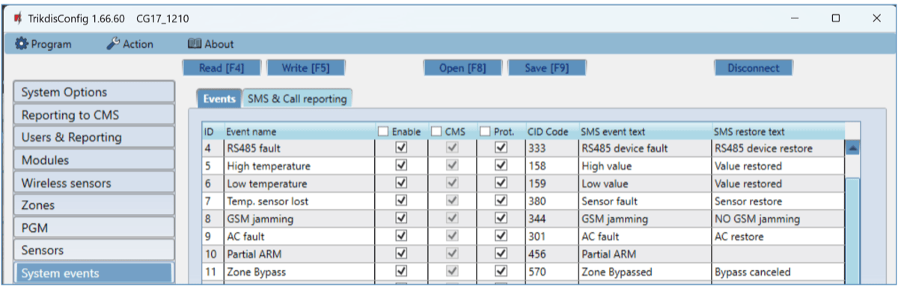

- **ID** – event’s number on the list.

- **Event name** – event name.

- **Enable** – enable event recognition.

- **CMS/Prot.** – messages about chosen event will be sent to the CMS and/or to Protegus cloud.

- **CID code** – event’s Contact ID code.

- **SMS event text** – event SMS message text.

- **SMS restore text** – SMS message text of restore event.

**“SMS & Call reporting” tab**

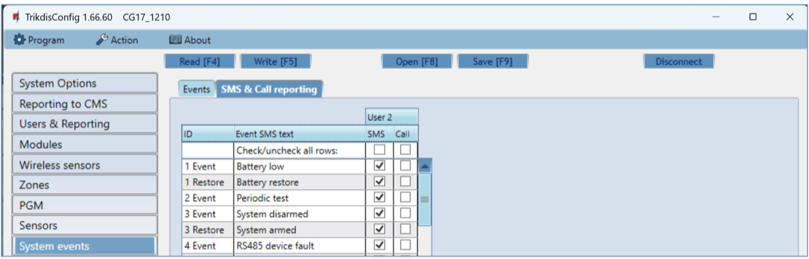

This tab will only show if at least one user phone number is added in the “Users & Reporting” window.

- **ID** – event number and identification word (*Event*, *Restore*).

- **Event SMS text** – text that will be used in event SMS messages.

- **User / SMS and Call** – choose how to inform users about every type of event – via SMS message and/or phone call.

### “Events Log” window 

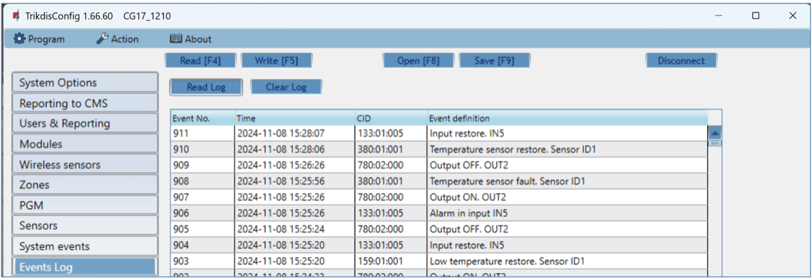

- **Read Log** button – for reading the event journal entries from the device’s memory.

- **Clear Log** button – for clearing the event journal entries from the device’s memory.

- You can find the “**Event No.**”, “**Time**”, “**CID**” code, “**Event definition**” in the table. Up to 1000 events saved in the CG17’s memory can be displayed in the “**Events Log**”.

### Restoring default settings 

To restore the control panel’s default settings, click the “**Restore**” button in the TrikdisConfig program**.**

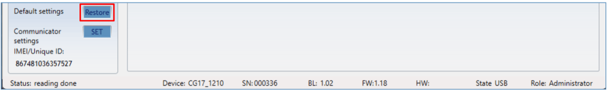

## Remote control 

### Control with *Protegus2* app 

Using Protegus2 users can control their security system remotely. They can also see the system state and receive notifications about system events.

1.  Download and launch the Protegus2 app or use the browser version [www.protegus.app](https://www.protegus.app).

    

      
      
      
    

2. Log in with your user name and password or register and create a new account.

2.  Click “Add new system” and enter the *CG17*’s IMEI code in the “Unique ID” field. You can find this number on the device or packaging sticker.

!!! warning "Important"
    When adding the CG17 to Protegus2:

    1.  The Protegus cloud service must be enabled. Turning on
        the service is described in chapter 4.4 **"Users & Reporting" window
        (settings group "Cloud application"**);

    2.  An activated SIM card must be inserted and the PIN code must be
        entered or disabled;

    3.  The power must be on ("**POWER**" LED must be green solid);

    4.  Must be connected to the network ("**NETWORK**" LED must be green
        solid and blink yellow).

    If "**NETWORK**" or "**DATA**" is yellow solid, the device is unable to
    connect to GSM and/or Protegus2.
#### Arming/disarming the alarm system with Protegus2

1.  Go to *Protegus2* app and in system window press the “ARM” button.

2.  In the menu, select the mode you wish to turn on and enter the user code.

3.  When the system changes the mode, the “ARM” icon will change too.

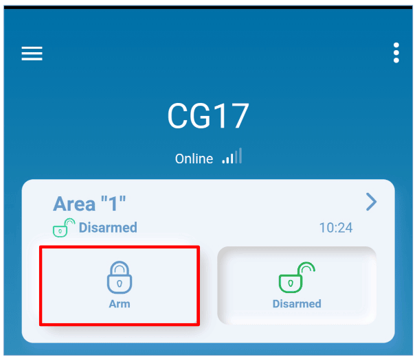

#### Add other users to Protegus2

Launch Protegus2 application on your phone. Log in with your user name and password.

1.  Click „**Settings**“.

1.  Click „**System configuration**“.

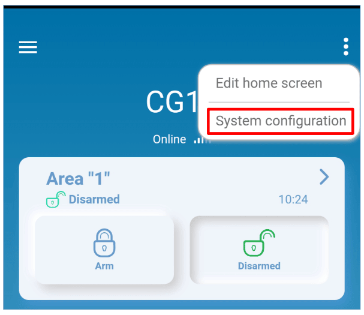

2. Click „**Users**“.

3. Click „**Add new user**“

4. Enter user's email address or username.

2.  Enter the user's phone number.

3.  Enter the code.

4.  Mark the area that the user will control.

5.  Mark the PGM output that the user will control.

6.  Click „**Add user**“.

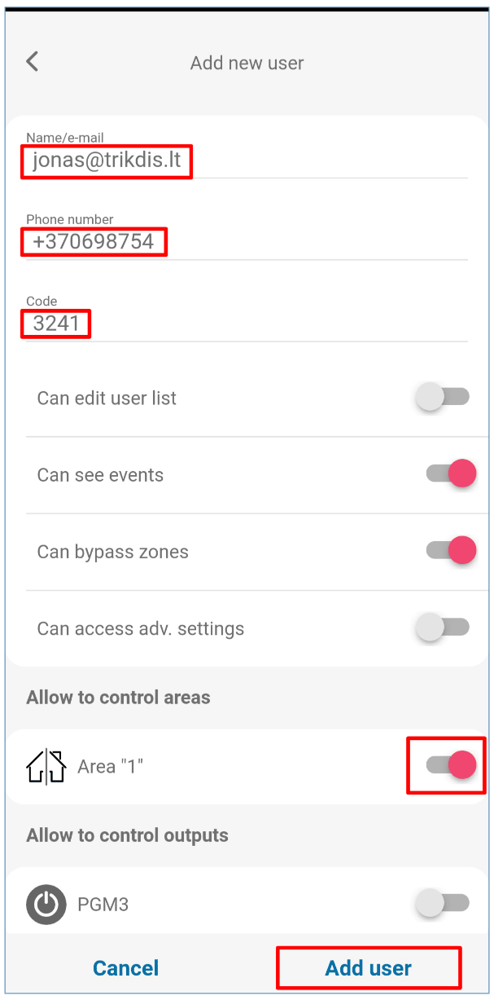

11. A new user appears in the user list.

12. Click „**Back**“ to return to the main window.

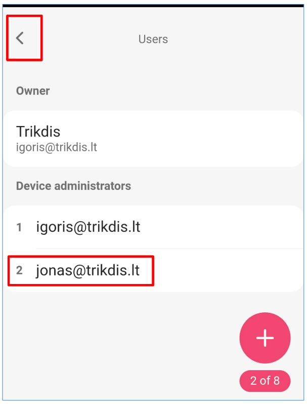

### Control using SMS commands 

1.  **Arm or disarm the security system with SMS commands**

> #### ARM xxxxxx SYS:x
>
> #### DISARM xxxxxx SYS:x

| xxxxxx | 6-symbol administrator password (*default – 123456*) |
|--------------|------------------------------------------------------|
| ***x***      | Area number of the security system (1-8)             |

1.  **Change the administrator password**

To ensure safety, change the default administrator SMS password. Send an SMS message of this format:

#### PSW 123456 xxxxxx

| 123456 | Default administrator password      |
|--------------|-------------------------------------|
| xxxxxx | New 6-symbol administrator password |

1.  **Allow other users to control**

Only phone numbers on the user list can control the system using SMS messages or phone calls. From an administrator phone, send SMS messages with other people’s phone numbers and names to allow them to control the system:

#### SETN xxxxxx PHONEx=+PHONENR#NAME

| xxxxxx | 6-symbol administrator password |
|----|----|
| ***x*** | User’s number on the list. (If you write 1 as the user number, you will transfer your administrator’s rights to another user). |
| PHONENR | User’s phone number |
| NAME | User’s name |

1.  **Reset the smoke detectors**

Reset the smoke detectors remotely using an SMS message:

#### FRS xxxxxx

!!! note
    6-digit administrator password
!!! note
    The output OUT that the fire sensors are connected to must have type
    "**Restore fire sensors**" set. Output "**5 OUT**" has this type set by
    default.
#### SMS commands list

| Command | Data | Description |
|---------|------|-------------|
| INFO |  | Request information about the controller. Controller type, IMEI number, serial number and firmware version will be included in the answer. / E.g.: INFO 123456 |
| RESET |  | Reset the device. E.g.: RESET 123456 |
| OUTPUTx | ON | Turn on an output, “x” is the output number. E.g.: OUTPUT1 123456 ON |
|  | OFF | Turn off an output, “x” is the output number. / E.g.: OUTPUT1 123456 OFF |
| PULSE=ttt | Turn on an output for a specified time - “x” is the OUT output number, and “ttt” is a three-digit number that specifies pulse time in seconds. |
| PULSE=ttt | E.g.: OUTPUT1 123456 PULSE=002 |
| PSW | New password | Change password. E.g.: PSW 123456 654123 |
| TIME | YYYY/MM/DD,12:00:00 | Set date and time. E.g.: TIME 123456 2018/01/03,12:23:00 |
| TXTA | Object name | Save an object name. E.g.: TXTA 123456 House |
| TXTE | Z1= / ........ / Z12= | Customize zone alarm SMS message: Z1...Z12 – input zone number. |
| TXTE | Z1= / ........ / Z12= | E.g.: TXTE 123456 Z1=ALARM in Zone1 |
| TXTR | Z1= / ........ / Z12= | Customize zone restore text: Z1...Z12 – input zone number. / E.g.: TXTR 123456 Z1=Restore Zone1 |
| RDR | PhoneNR#SMStext | Forward SMS messages to the specified number. The phone number must start with a "+" sign and international country code. |
| RDR | PhoneNR#SMStext | E.g.: RDR 123456 +37061234567#forwarded text |
| ASKI |  | Send SMS message about statuses of inputs IN. E.g.: ASKI 123456 |
| ASKO |  | Send SMS message about statuses of outputs OUT. E.g.: ASKO 123456 |
| ASKT |  | Send SMS message with values of all temperature sensors. / E.g.: ASKT 123456 |
| DISARM | SYS:x | Disarm the alarm, “x” is the area number (1-8). / E.g.: DISARM 123456 SYS:1 |
| ARM | SYS:x | Arm the alarm, “x” is the area number (1-8). E.g.: ARM 123456 SYS:1 |
| FRS |  | Resets the fire sensor’s output, if the output OUT is assigned the function “Restore fire sensors”. E.g.: FRS 123456 |
| SETN | PhoneX=PhoneNR#Name | Add a phone number, username and assign it to user “x”. “x” is the phone number’s line on the list. The phone number must start with a “+” symbol and international country code. The phone number and username must be separated by a “#” symbol. / E.g.: SETN 123456 PHONE5=+37061234567#JOHN |
|  | PhoneX=DEL | Delete user’s phone number and name. / E.g.: SETN 123456 PHONE5=DEL |
| UUSD | *Uusd code# | Sends a UUSD code to the operator. E.g.: UUSD 123456 *245# |
| CONNECT | Protegus=ON | Connect to Protegus coud service. / E.g.: CONNECT 123456 PROTEGUS=ON |
| CONNECT | Protegus=OFF | Disconnect from Protegus cloud service. |
| CONNECT | Code=123456 | E.g.: CONNECT 123456 PROTEGUS=OFF |
| CONNECT | IP=0.0.0.0:8000 | Protegus cloud service code. E.g.: CONNECT 123456 CODE=123456 |
| CONNECT | IP=0 | Specify the main server’s connection channel’s TCP IP and Port. |
| CONNECT | ENC=123456 | E.g.: CONNECT 123456 IP=0.0.0.0:8000 |
| CONNECT | APN=Internet | For turning off the main channel. E.g.: CONNECT 123456 IP=0 |
| CONNECT | USER=user | TRK encryption key. E.g.: CONNECT 123456 ENC=123456 |
| CONNECT | PSW=password | APN name. E.g.: CONNECT 123456 APN=INTERNET |
| CONNECT |  | APN user. E.g.: CONNECT 123456 USER=User |
| CONNECT |  | APN password. E.g.: CONNECT 123456 PSW=Password |
| SETHx | Ty=45 | The settings are for thermostat "x". "X" is the thermostat number, which can be 1,2,3,4. |
| SETHx | Sy=2 | Sets the temperature of the „y“ mode (4 modes can be assigned). / E.g. (assign the first thermostat to the second mode at + 45oC): / SETH1 123456 T2=45 |
| SETHx | O=1 | Sets the number of the temperature sensor in „y“ mode (4 modes can be assigned) by which the measurement will be made. / E.g. (assign 2 temperature sensors to the second thermostat for the first mode): SETH2 123456 S1=2 |
| SETHx | A=2 | The thermostat is assigned an OUT output (must be set to an OUT output of "Remote Control" or "Thermostat"). / E.g. (assign first output to first thermostat): SETH1 123456 O=1 |
| SETHx | M=C | Specifies the thermostat operating temperature sensor (select one of the four thermostat operating temperature sensors specified). / E.g. (assign the first thermostat to the third thermostat temperature sensor): SETH1 123456 A=3 |
| SETHx |  | The operating mode of the thermostat is set: C - cooling; H - heating. / E.g. (set cooling mode for the first thermostat): SETH1 123456 M=С |
| SETHx |  | A single SMS message can change one or more settings. Individual settings are separated by commas. / E.g.: SETH2 123465 T2=55,S3=5,A=3,O=1,M=H / For the second thermostat set a second temperature of + 55oC; the third mode will operate according to temperature sensor 5; a mode 3 temperature sensor will be active; assigned to control output 1 OUT; thermostat operation mode heating. |
| ASKH |  | Sends settings of all thermostats via SMS. The basic information is whether the thermostat is on, cooling or heating, the number of the active thermostat mode, and the values for all set temperatures. / E.g.: ASKH 123456 |

### Control using phone call

!!! note
    If no users have been added to the system, the first one to call the
    CG17 will become the system administrator and will be the only one
    who can control the CG17 using phone calls and SMS commands. / If
    you want to allow other users to control the system using phone calls,
    add them with TrikdisConfig or with SMS commands.
**CG17 phone call control commands**

Controlling outputs OUT using phone calls:

1.  If the security system has 1 area or the user is not assigned the right to control outputs: call the CG17 and the controller will decline the call. The security system’s protection mode will change to the opposite state.

2.  If the user is assigned the right to control outputs OUT and the output OUT is assigned the type “Remote control” (using TrikdisConfig), or the security system CG17 has 2 or more areas: call the CG17. The CG17 will answer the call and you can dial commands using the phone keyboard (see table below).

    **Mobile phone keyboard commands list**

| Keyboard buttons | Function | Description |
|------------------|----------|-------------|
| [1] | Change protection mode | Change the protection mode to the opposite of the current one. E.g.: 1 |
| [2][output no][#][state no][*] | Control selected output OUT | Controls a specified output OUT. State: [0] – output turned off; [1] – output turned on; [2] – turned off for pulse time; [3] – turned on for pulse time; (pulse time is specified in the TrikdisConfig software, “PGM” table) [*] – this symbol shows the end of the command. E.g. (turn on the output 5OUT): 21#1* E.g. (turn on the output 6OUT for “Pulse time” specified in the TrikdisConfig “PGM” table): 22#3* |
| [6][area no][#] | Arm specified area of the security system | E.g. (arm alarm area no. 2): 62# |
| [7][area no][#] | Disarm specified area of the security system | E.g. (disarm alarm area no. 1): 71# |

### Setting parameters remotely 

!!! warning "Important"
    Remote configuration will only work when:

    1.  The "Protegus cloud" service is enabled. Turning on the
        service is described in chapter 4.4 **"Users & Reporting"** window
        (settings group **„Cloud application"**);

    2.  An activated SIM card is inserted and the PIN code is entered or
        disabled;

    3.  The power is on ("**POWER**" LED is green solid);

    4.  Is connected to the network ("**NETWORK**" LED is green solid and
        blinks yellow).
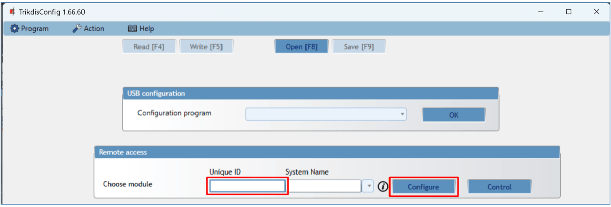

1.  Download the software TrikdisConfig from [www.trikdis.com](http://www.trikdis.com) .

2.  Make sure that the controller is connected to the Internet and that connection with Protegus is enabled.

3.  Launch the configuration software TrikdisConfig and in the “**Unique ID**” field of the “**Remote Access**” group enter the IMEI number of your CG17 (the IMEI number can be found on stickers on the back of the device and on the packaging).

4.  In the field “**System Name**” give a name to the CG17 with this IMEI. Click “**Configure**”.

5.  Click the button **Read [F4]** and the program will read the parameter values currently set on the CG17. If a window for entering the “Administrator code” appears, enter the 6-symbol “administrator” code. If you want the program to remember the code, tick the box next to “**Remember password**” and click the button **Write [F5]**.

6.  Make the desired changes to the settings of the CG17 and click **Write [F5]**. If you want to disconnect from the CG17 click “**Disconnect**” and exit the TrikdisConfig program.

### Remote control with TrikdisConfig

1.  Download the configuration software TrikdisConfig from [www.trikdis.com/](http://www.trikdis.com/lt) (enter “TrikdisConfig” in the search field) and install it.

2.  Make sure the control panel is connected to the internet. The “Protegus cloud” service must be enabled.

3.  Launch the configuration software TrikdisConfig and in the “**Unique ID**” field of the “Remote Access” group enter the IMEI number of your CG17 (the IMEI number can be found on stickers on the back of the device and on the packaging).

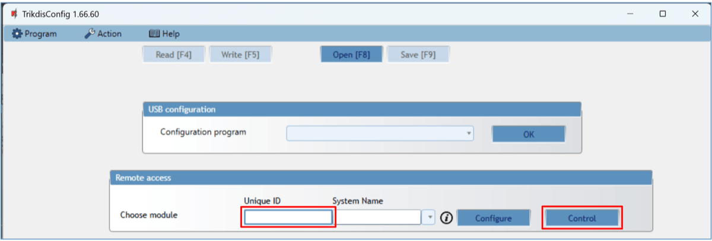

1.  Click “**Control**”**.**

2.  Enter the “**Self-service code**” (default code – 123456) and press the “**OK**” button.

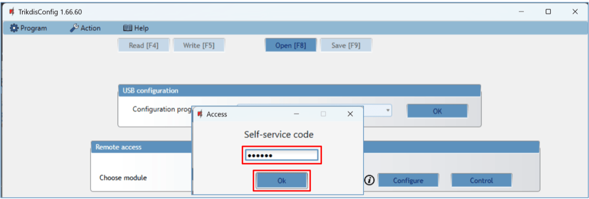

3. The “**Remote control**” window opens,where you can control the control panel “**Area**”, monitor “**Zone**” states, control “**PGM outputs**” and monitor the “**Temperature**”.

2.  “**Partitions**” tab. Press “**Disarm**” (or “**ARM**”) button and enter the user code and the security control panel area will be Disarm (or Arm).

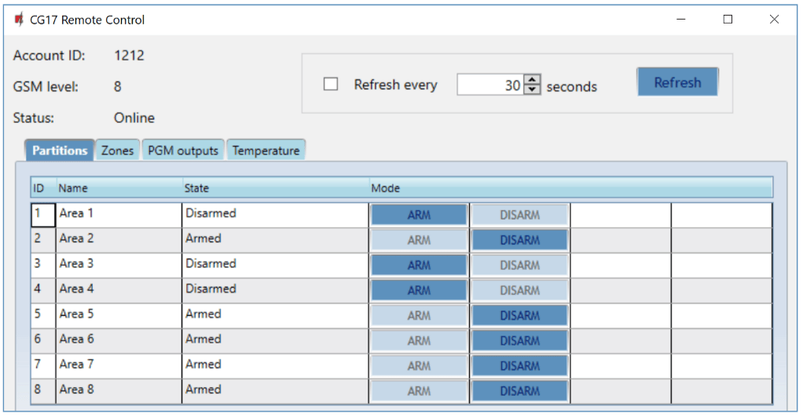

3. “**Zones**” tab. This windows shows the status of the zones. The Bypass of zone can be activated.

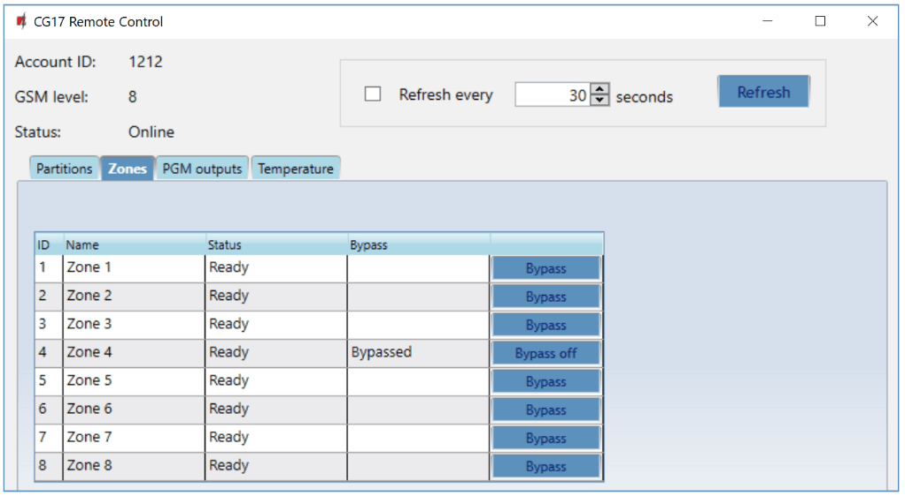

4. “**PGM outputs**” tab. In this windows, you can control “**PGM outputs**” that are set to “**Remote control**”.

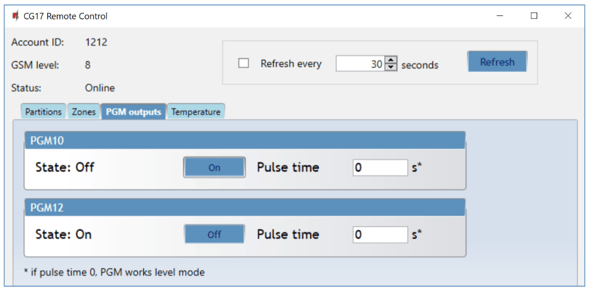

10. “**Temperature**” tab. In this window, you can monitor the readings of temperature sensors.

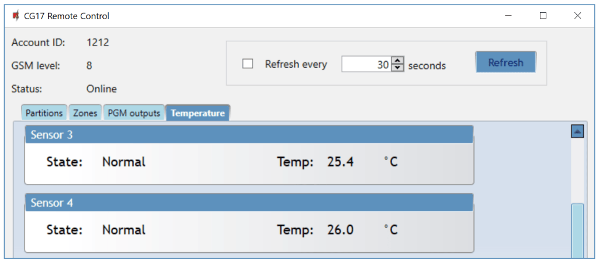

## Testing of the installation 

When configuration and installation are finished, test the system:

1.  Check if the power is on;

2.  Check the network connectivity (“**NETWORK**” indicator): sufficient Cellular signal strength is level 5 (green solid for 4 seconds and five yellow flashes). Sufficient 3G signal strength is level 3 (green solid for 4 seconds ant three yellow flashes). If the red “**TROUBLE**” light blinks 5 times, find another place to mount the CG17;

3.  To test the CG17’s inputs, enable them and check if the correct messages reach the recipients;

4.  To test the CG17’s outputs, activate them remotely and check if the correct messages reach the recipients and the outputs are activated correctly;

5.  Test the alarm to make sure that the central monitoring station accepts the events correctly.

## Updating firmware of the CG17 

!!! note
    When the CG17 is connected to TrikdisConfig, the program
    will automatically offer to update the firmware if updates are
    available. Internet connection is required for this function. / If
    antivirus software is installed on your computer, it may block the
    automatic firmware update function. In this case you will have to
    reconfigure your antivirus software.
The CG17’s firmware can be updated or changed manually. All prior CG17 settings remain after the update. When the firmware is changed manually, it can be upgraded or downgraded.

Complete these steps:

1.  Launch ***TrikdisConfig**.*

2.  Connect the CG17 to a computer using a USB Mini-B cable or connect to the CG17 remotely. If a newer version of firmware is available, the program will offer to install it.

3.  Open the “**Firmware**” window.

    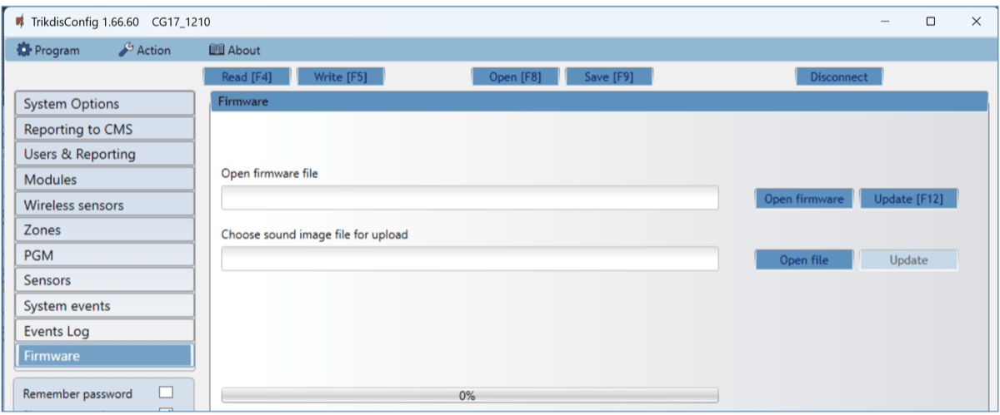

4.  Click the button “**Open firmware**” and choose the required firmware file.

5.  Click the update button **Update [F12]**.

6.  Wait for the update to complete.

## Contents 

## Safety precautions 

The electronic intruder alarm system should only be installed and maintained by qualified personnel.

Please read this manual carefully prior to installation in order to avoid mistakes that can lead to malfunction or even damage to the equipment.

Always disconnect the power supply before making any electrical connections.

 Any changes, modifications or repairs not authorized by the manufacturer shall render the warranty void.

Please adhere to your local waste sorting regulations and do not dispose of this equipment or its components with other household waste.
