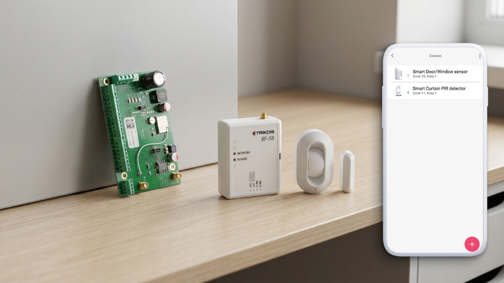
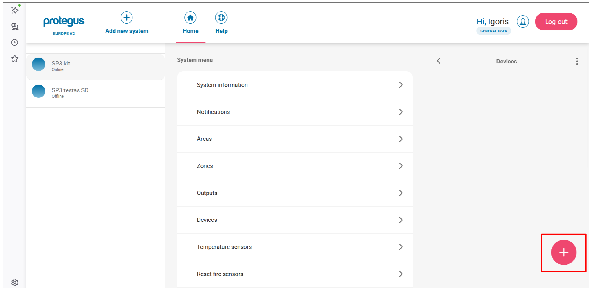
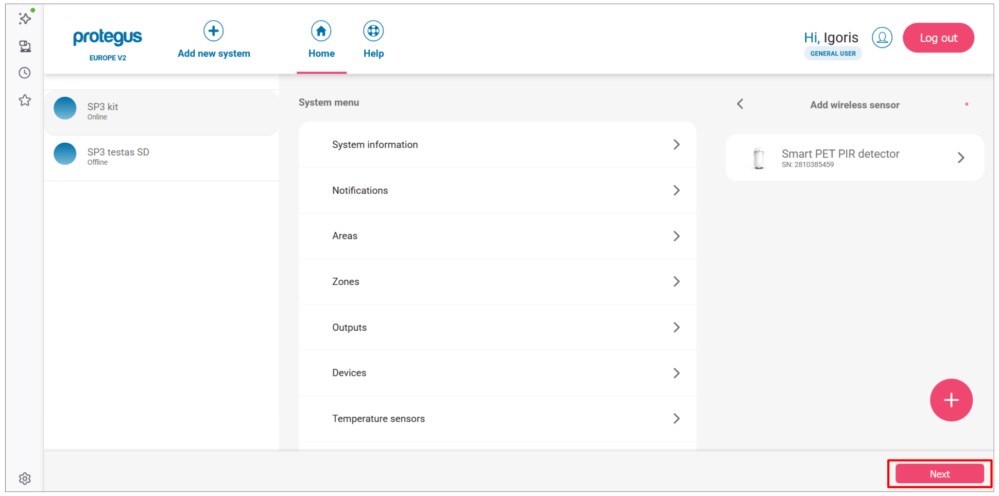
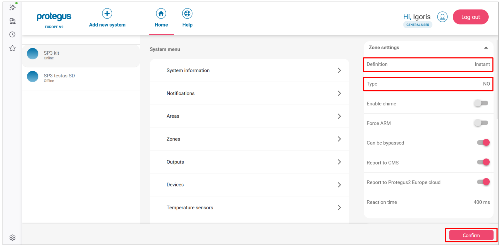
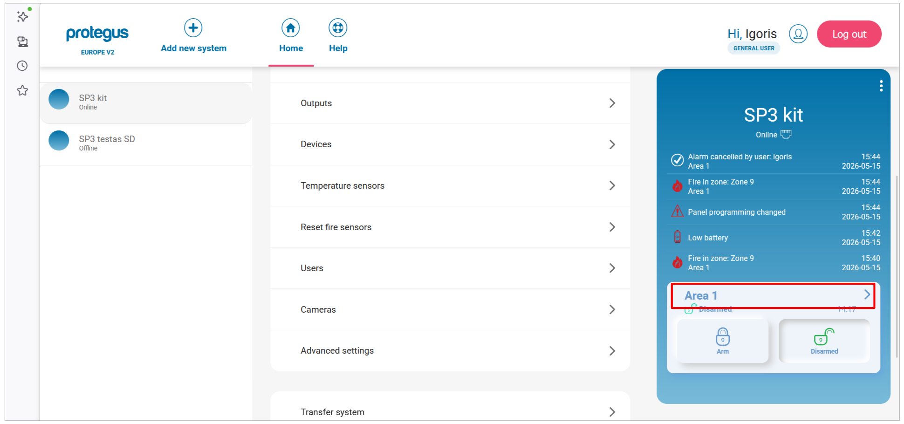
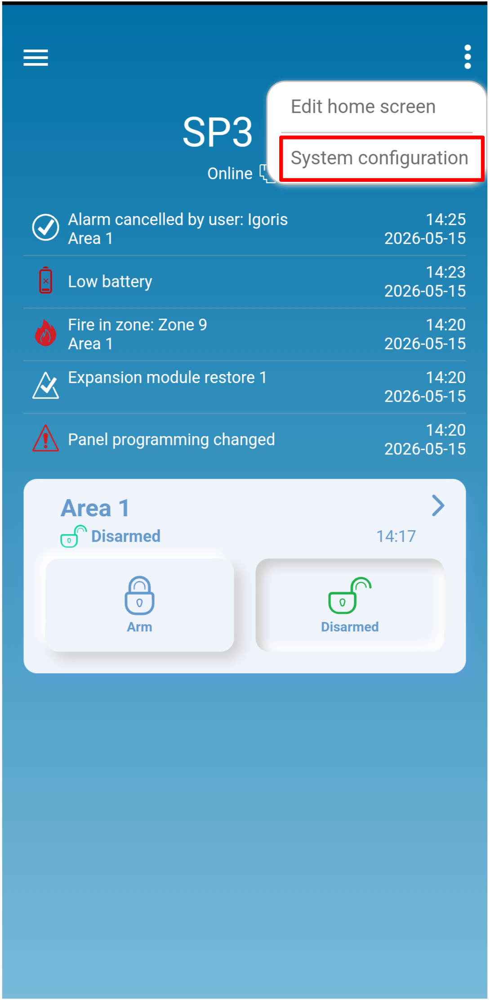
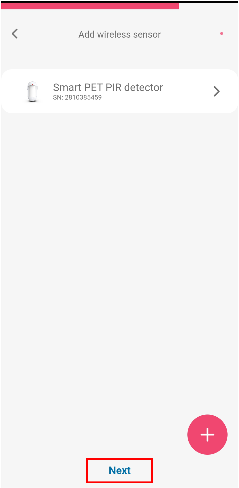
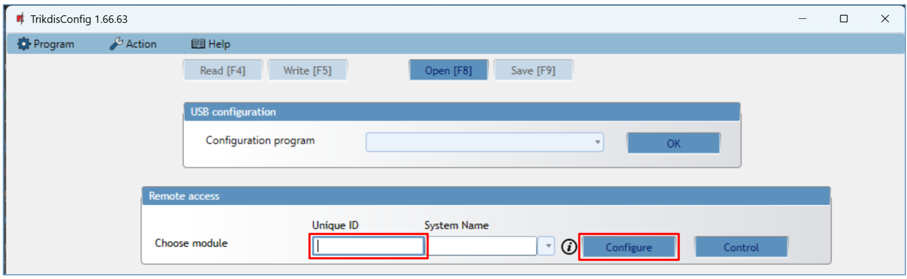
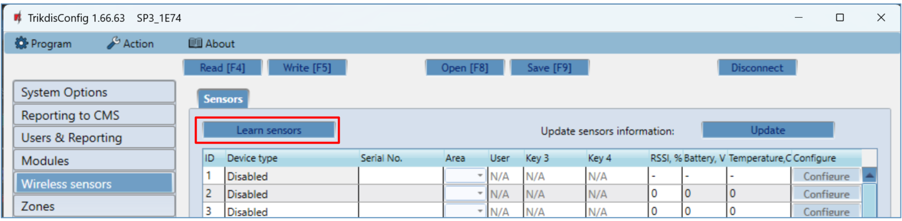
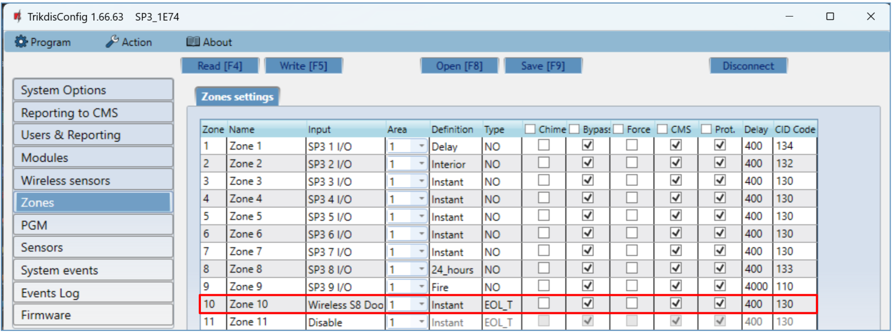

# Adding S8/S9 wireless sensors to FLEXi SP3

{ .trik-hero-img }

Pair S8 wireless sensors (PIR detectors, door/window magnets, smoke detectors, sirens, remote controls) with the FLEXi SP3 control panel. Choose your configuration method.

> [!IMPORTANT]
> **Firmware requirement:** The FLEXi SP3 must run firmware revision 4 (`SP3_xxx4_0122.fw`, version 1.22 or later) to support S8 wireless sensors.

**Before you start — prepare the sensors** (applies to all methods):

- If a sensor was previously paired with any panel, unenroll it first: hold the sensor's **learn button for 5 seconds**, release when the indicator flashes **green three times**.
- Insert batteries into all sensors you intend to pair.
- Keep the RF-S8 transceiver **at least 1 m away** from sensors during pairing.

---

=== "Protegus web"

    Open [web.protegus.app](https://web.protegus.app) in a desktop browser. The SP3 system must already be added to your account.

    1. Select the SP3 system from the left panel, then click **Devices** in the system menu.

        

    2. Click the **+** button to add a new wireless sensor.

        

    3. The **Add wireless sensor** panel opens with all supported sensor types. Click the sensor type you want to pair (e.g. **Smart PET PIR detector**).

        

    4. The app switches to **Learning** mode and shows the sensor with a diagram indicating the learn button location.

        **Press and hold the learn button** until the green indicator stays lit for 2 seconds (approximately 4–5 seconds).

        

    5. When the panel detects the sensor, a confirmation appears with its serial number. Click **OK**.

        

    6. The sensor appears in the list with a **NEW** badge. To add another sensor, click **+** and repeat steps 3–5. When all sensors are paired, click **Next**.

        

    7. A success dialog confirms the pairing. Click **Close**.

        

    **Configure zone settings:**

    8. In the **Devices** list, click a paired sensor to open its settings. Click **Zone settings** to expand the section.

        

    9. Set the **Definition** (e.g. Instant) and **Type** (e.g. NO) for the zone.

        

    **Verify zone status:**

    10. From the home screen, click the **Area 1** tile.

        

    11. Click **Zone statuses**.

        

    12. The **Zone status / bypass** panel lists all zones. A red alert icon on a zone means the sensor is currently open or triggered. Bypass toggles let you temporarily disable individual zones.

        

=== "Protegus mobile"

    The Protegus app must be installed on your phone and the SP3 system already added to your account.

    1. Open the Protegus app and select the **SP3 kit** system. Tap **⋮** in the top-right corner.

        { .trik-mob-img }

    2. Tap **System configuration**.

        { .trik-mob-img }

    3. Tap **Devices**.

        { .trik-mob-img }

    4. Tap the **+** button to add a new sensor.

        { .trik-mob-img }

    5. Select the sensor type you want to pair (e.g. **Smart PET PIR detector**).

        { .trik-mob-img }

    6. The app shows the sensor in **Learning** mode with a diagram of the learn button. **Press and hold the learn button** until the green indicator stays lit for 2 seconds.

        { .trik-mob-img }

    7. When the sensor is detected, a confirmation appears with its serial number. Tap **OK**.

        { .trik-mob-img }

    8. The sensor appears in the list with a **NEW** badge.

        { .trik-mob-img }

    **Configure zone settings:**

    9. Tap the sensor to open its settings. Tap **Zone settings** to expand the section.

        { .trik-mob-img }

    10. Set the **Definition** (e.g. 24 hours) and **Type** (e.g. NO), then tap **Confirm**.

        { .trik-mob-img }

    11. To add another sensor, tap **+** and repeat steps 5–10. When all sensors are paired, tap **Next**.

        { .trik-mob-img }

    12. A success dialog confirms the pairing. Tap **Close**.

        { .trik-mob-img }

    **Verify zone status:**

    13. From the system home screen, tap the **Area 1** tile.

        { .trik-mob-img }

    14. Tap **Zone statuses**.

        { .trik-mob-img }

    15. The **Zone status / bypass** screen lists all zones. A red alert icon means the sensor is currently open or triggered. Bypass toggles let you temporarily disable individual zones.

        { .trik-mob-img }

=== "TrikdisConfig"

    Two sub-methods: **remote** (over network) or **local** (USB, no network needed).

    #### Remote pairing

    Requirements: activated SIM with PIN disabled, mobile internet on SIM, Protegus cloud enabled, SP3 powered on (**PWR** LED green blinking), SP3 online (**NET** LED green solid + yellow blinking).

    > [!WARNING]
    > Never enroll or unenroll sensors while the panel is in learning mode for a different operation. Before pairing, unenroll each sensor first: hold learn button 5 s → three green flashes. **If a sensor is accidentally unpaired it stops working until re-paired.**

    1. Open TrikdisConfig. In the **Remote access** section, enter the panel's **Unique ID** (printed on the device label), then click **Configure**.

        

    2. Click **Read [F4]**. Enter admin or installer code if prompted.

    3. Go to **Wireless sensors** and click **Learn sensors**.

        

    4. The **Learning mode** dialog opens. For each sensor, press and hold the learn button for 5 seconds until it flashes **green four times**.

        

        

    5. When a sensor is detected, the **New device was found** dialog opens. Set the **Zone number** and **Zone definition** (e.g. Instant), then click **Save**.

        

    6. The Learning mode status line confirms the device was registered. Repeat steps 4–5 for each additional sensor.

        

    7. Click **Stop learning**. When prompted to save the new parameters, click **Yes**.

        

    8. Click **Read [F4]**. The **Wireless sensors** tab now lists all registered sensors with their serial numbers.

        

    9. Open the **Zones** tab. Confirm zone and area assignments. Set **Type** to `EOL-T` to enable tamper monitoring. Click **Write [F5]**.

        

    #### Local pairing (no network)

    The RF-S8 transceiver has a **LEARN** button on its circuit board — use it to enter and exit learning mode without a PC connection.

    

    1. Confirm the RF-S8 is registered with the SP3 (visible in Modules list after firmware setup).
    2. Power on the SP3.
    3. Remove the RF-S8 cover.
    4. Hold the RF-S8 **LEARN** button until the NETWORK LED flashes green/red. Release.
    5. Pair each sensor: hold learn button 5 s → four green flashes. NETWORK LED turns solid green briefly after each success.
    6. When done, hold the RF-S8 **LEARN** button until NETWORK LED stops flashing. Release — transceiver exits learning mode.
    7. Connect USB Mini-B to SP3. Open TrikdisConfig → **Read [F4]**.
    8. Confirm serial numbers in **Wireless sensors** tab.
    9. Assign zones and areas in the **Zones** tab → **Write [F5]**.

    #### Remove a wireless sensor

    1. Connect to SP3 (USB or remote) → **Read [F4]**.
    2. In **Wireless sensors**, set the sensor's **Device type** to `Disabled`.
    3. Click **Write [F5]**.

---

## LED reference — RF-S8 transceiver

| LED | State | Meaning |
|-----|-------|---------|
| NETWORK | Flashing green/red | Learning mode active |
| NETWORK | Solid green (5 s) | Sensor successfully enrolled |
| POWER | Off | No supply voltage |
| POWER | Green blinking | Normal operation |
| POWER | Yellow blinking | Supply voltage low (≤ 11.5 V) |
| POWER | Yellow solid | No RS485 communication with SP3 |
