# Adding S8/S9 wireless sensors to FLEXi SP3

{ .trik-hero-img }

Pair S8 wireless sensors (PIR detectors, door/window magnets, smoke detectors, sirens, remote controls) with the FLEXi SP3 control panel. Choose your configuration method.

> [!IMPORTANT]
> **Firmware requirement:** The FLEXi SP3 must run firmware revision 4 (`SP3_xxx4_0122.fw`, version 1.22 or later) to support S8 wireless sensors.

**Before you start — prepare the sensors** (applies to all methods):

- If a sensor was previously paired with any panel, unenroll it first: hold the sensor's **learn button for 5 seconds**, release when the indicator flashes **green three times**.
- Insert batteries into all sensors you intend to pair.
- Keep the RF-S8 transceiver **at least 1 m away** from sensors during pairing.

---

=== "Protegus web"

    Open [web.protegus.app](https://web.protegus.app) in a desktop browser. The SP3 system must already be added to your account.

    1. Select the SP3 system from the left panel, then click **Devices** in the system menu. Click the **+** button in the top-right corner of the Devices panel.

        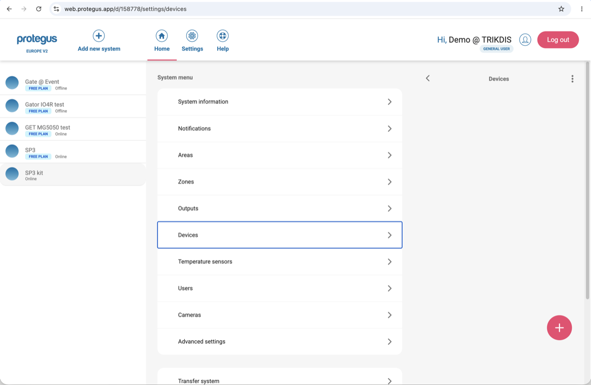

    2. The **Add wireless sensor** panel opens with all supported sensor types.

        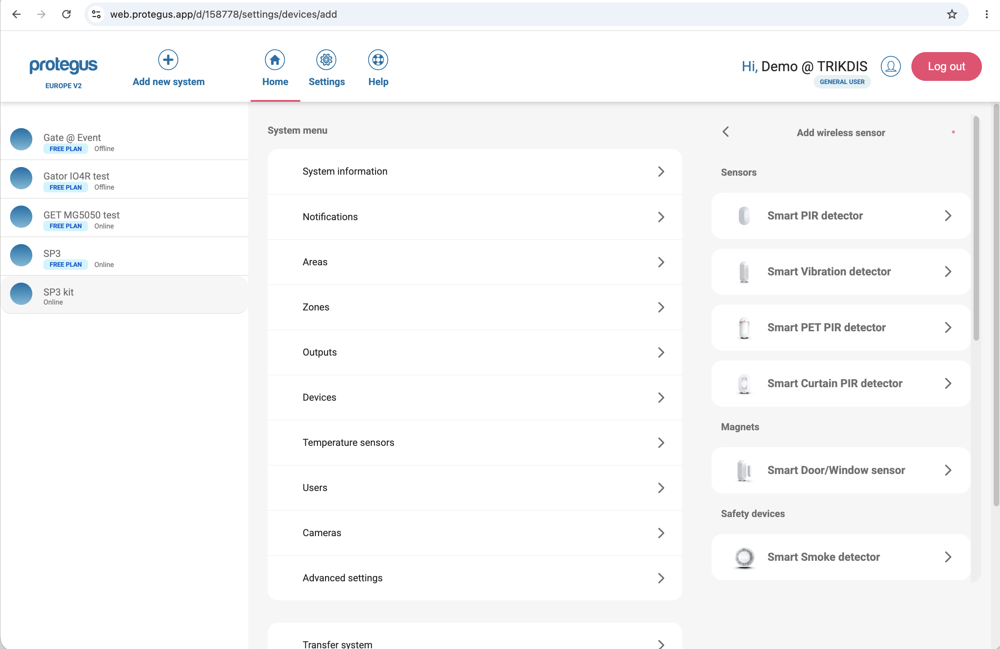

    3. Click the sensor type you want to pair (e.g. **Smart Door/Window sensor**).

        The app switches to **Learning** mode and shows the sensor with a diagram indicating the learn button location.

        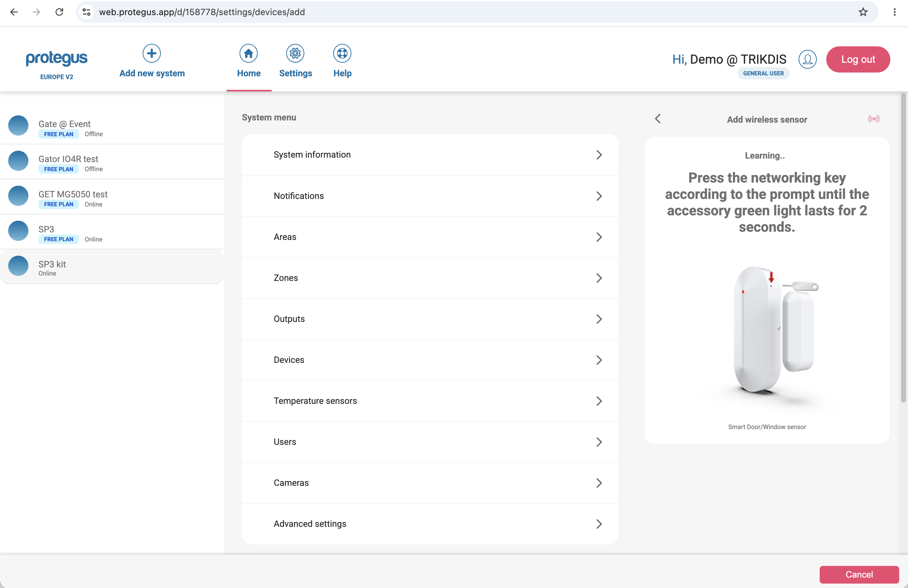

    4. On the physical sensor, **press and hold the learn button** until the green indicator stays lit for 2 seconds (hold for approximately 4–5 seconds).

        When the panel detects the sensor, a confirmation appears:

        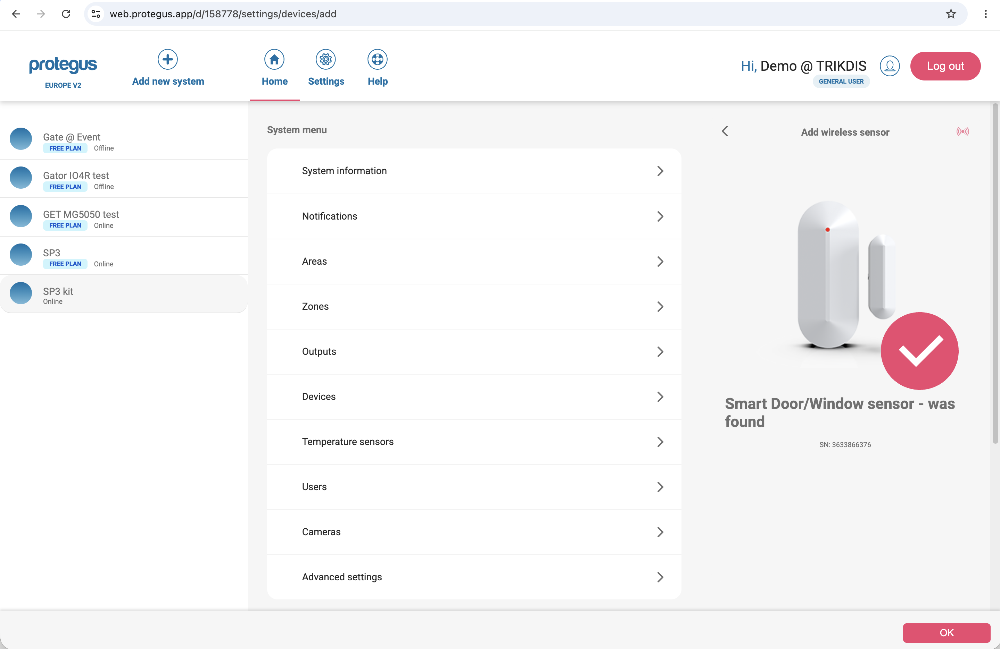

    5. Click **OK**. The sensor appears in the list with a **NEW** badge.

        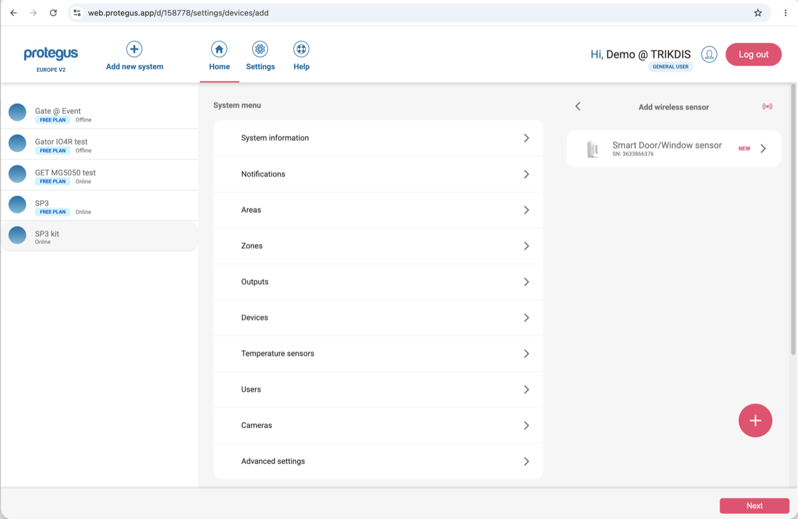

    6. To add another sensor, click **+** and repeat steps 3–5. Each sensor type shows its own diagram — for example, the Smart Curtain PIR detector shows the internal board with an arrow to the learn button:

        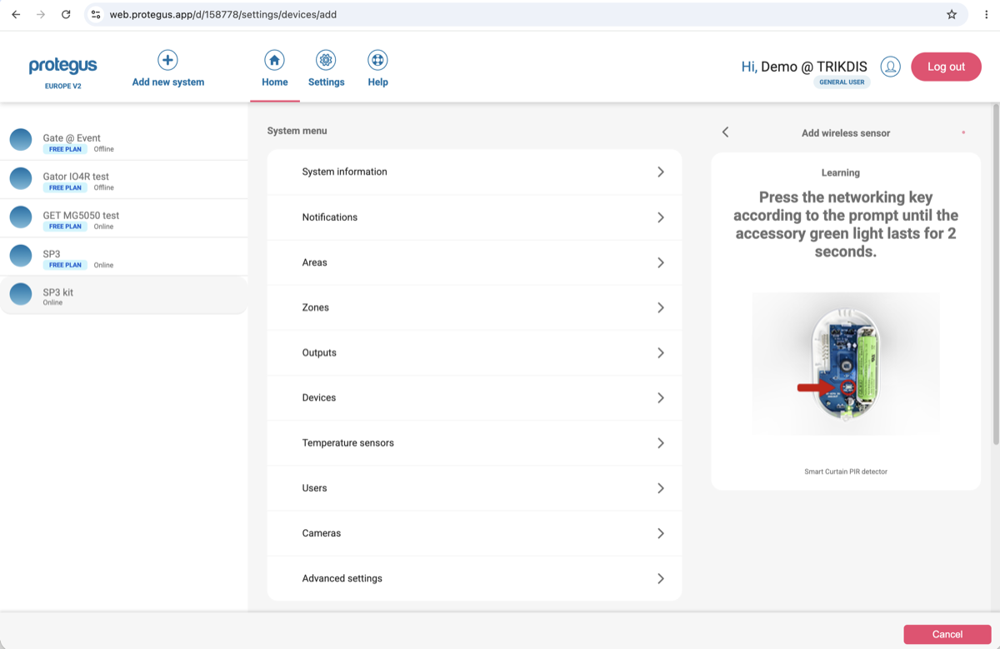

        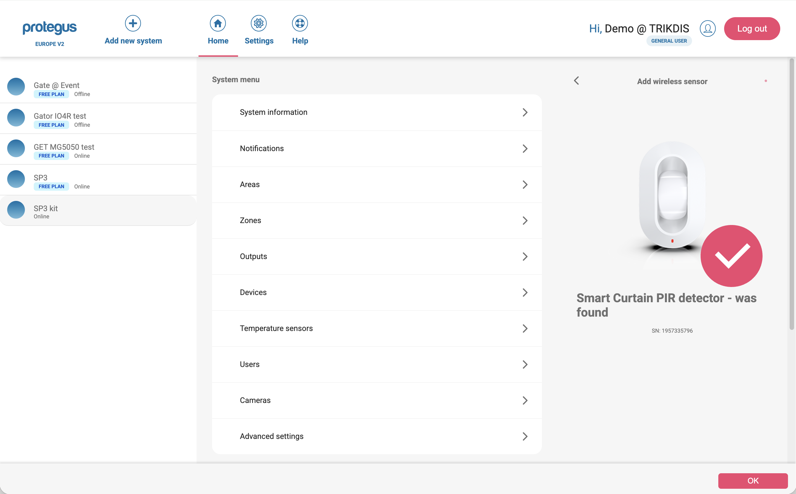

    7. When all sensors are paired, click **Next**. A success dialog confirms the pairing.

        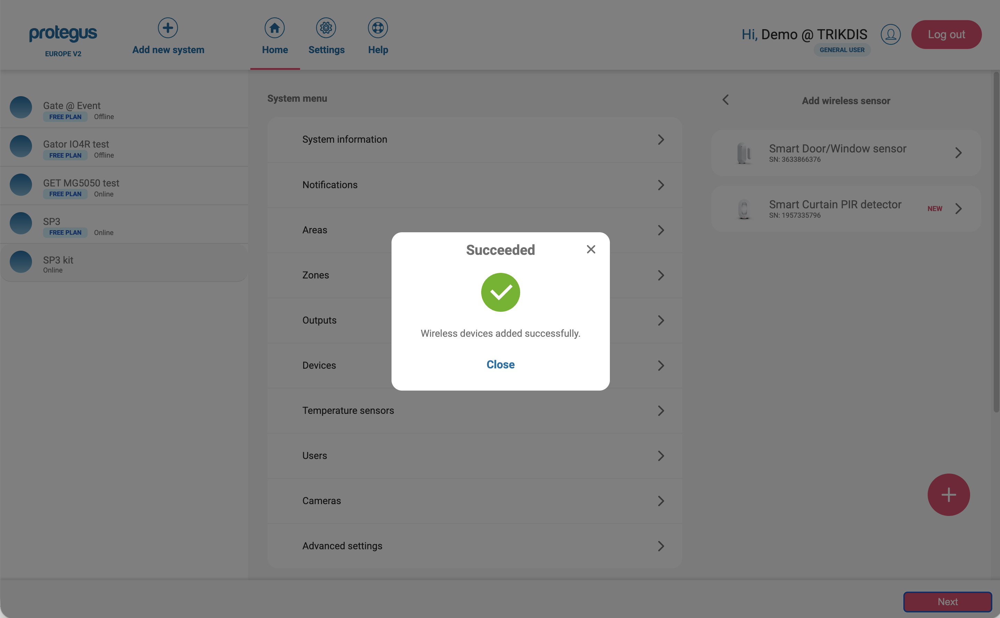

    8. Click **Close**.

    **Next:** Go to **Zones** in the system menu to rename zones and set zone types (Instant, Delay, etc.).

=== "Protegus mobile"

    The Protegus app must be installed on your phone and the SP3 system already added to your account.

    1. Open the Protegus app and select the **SP3 kit** system.

        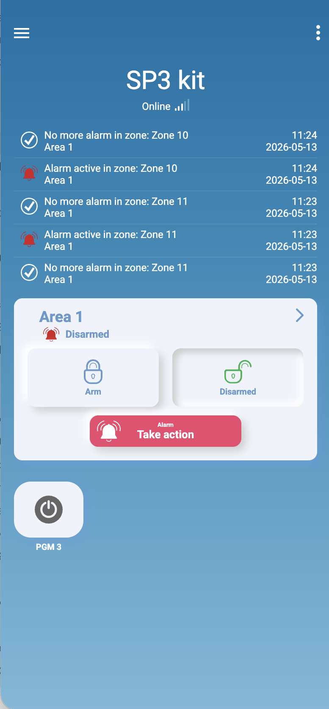{ .trik-mob-img }

    2. Tap **⋮** (top-right) and select **Configure SP3 kit**.

        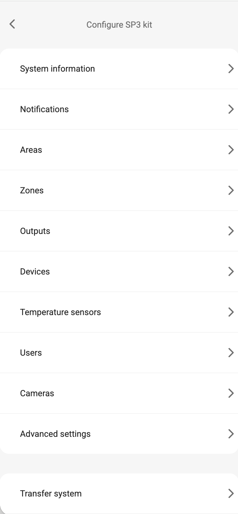{ .trik-mob-img }

    3. Tap **Devices**, then tap **+**.

        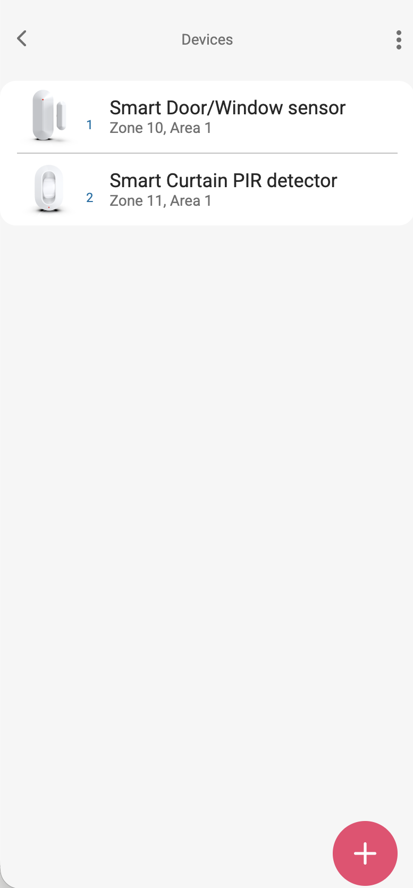{ .trik-mob-img }

    4. Select the sensor type you want to pair. The app shows a diagram of the learn button location. **Press and hold the learn button** until the green indicator stays lit for 2 seconds.

        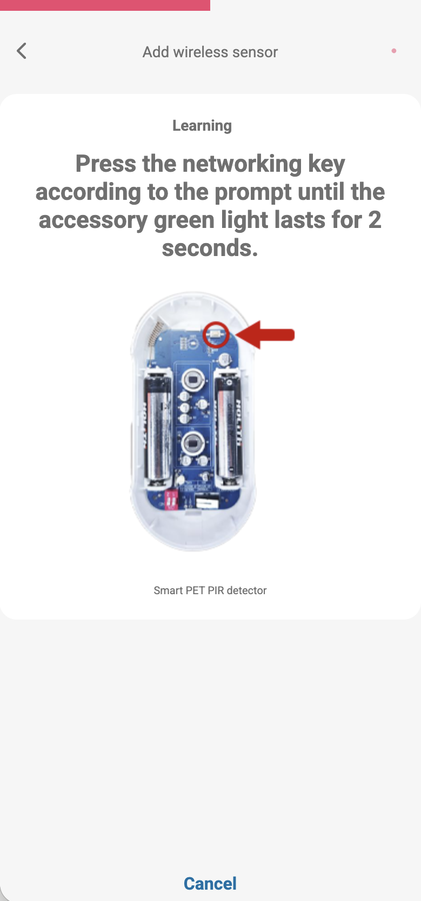{ .trik-mob-img }

    5. When the sensor is detected, a confirmation appears with its serial number. Tap **OK**.

        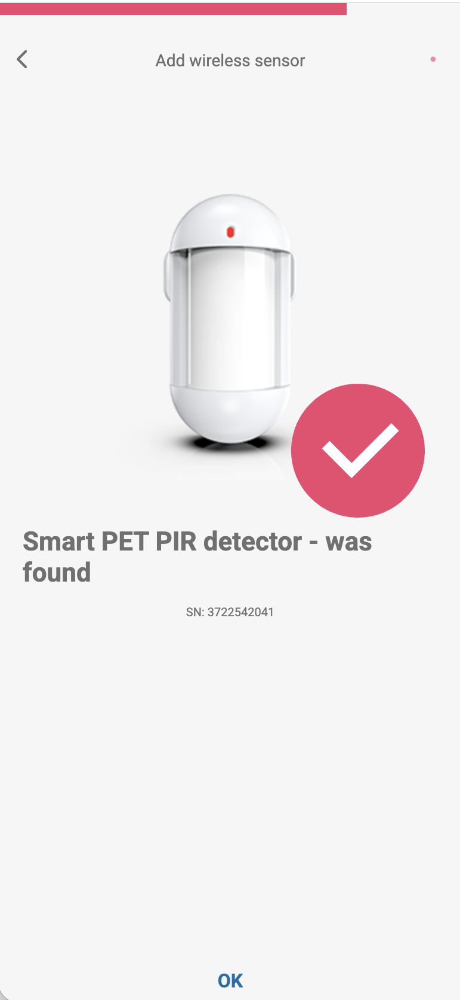{ .trik-mob-img }

    6. Repeat steps 4–5 for each additional sensor.

    **Review sensor details:**

    7. Tap any sensor in the Devices list to view its settings: signal strength (RSSI), battery voltage, zone name, zone type, and area assignment.

        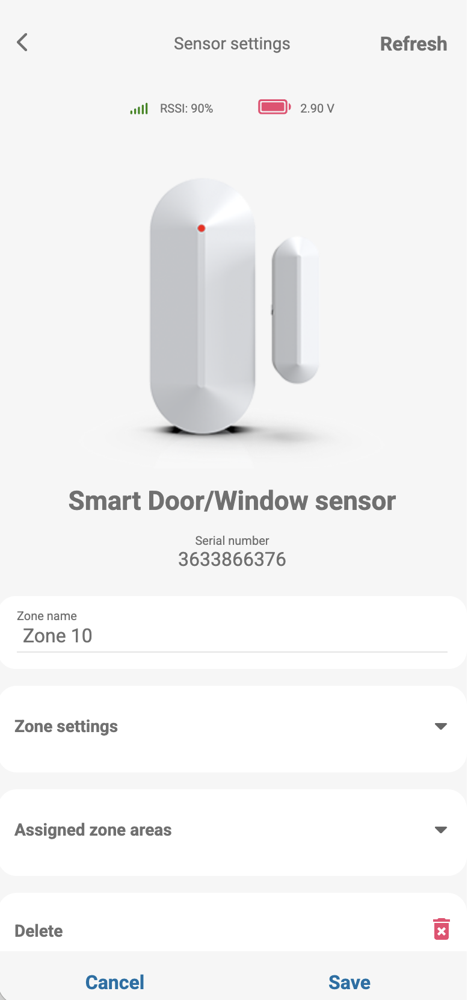{ .trik-mob-img }

        A good RSSI is 60% or above. Below 20% means the sensor is too far from the RF-S8 transceiver or obstructed — reposition and tap **Refresh** to re-check.

    **Verify zone status:**

    8. From the system home screen, tap the area tile → **Zone statuses**. Each paired sensor shows its current open/closed state.

        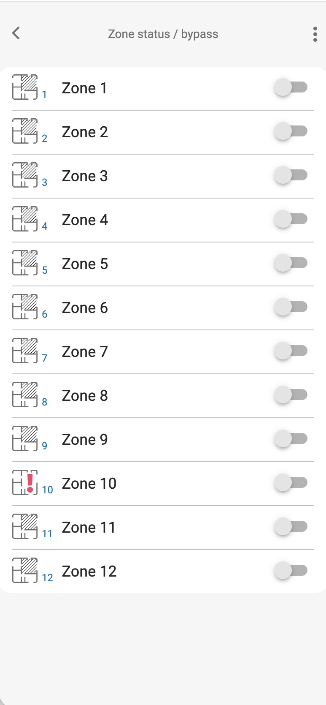{ .trik-mob-img }

        A red alert icon on a zone means the sensor is currently open or in alarm. Bypass toggles let you temporarily disable individual zones.

=== "TrikdisConfig"

    > [!NOTE]
    > TrikdisConfig is the legacy configuration method and will be discontinued in a future release. Use Protegus web or mobile where possible.

    Two sub-methods: **remote** (over network) or **local** (USB, no network needed).

    #### Remote pairing

    Requirements: activated SIM with PIN disabled, mobile internet on SIM, Protegus cloud enabled, SP3 powered on (**PWR** LED green blinking), SP3 online (**NET** LED green solid + yellow blinking).

    > [!WARNING]
    > Never enroll or unenroll sensors while the panel is in learning mode for a different operation. Before pairing, unenroll each sensor first: hold learn button 5 s → three green flashes. **If a sensor is accidentally unpaired it stops working until re-paired.**

    1. Open TrikdisConfig. In **Remote access**, enter the panel's **IMEI/Unique ID** (on the device label).

        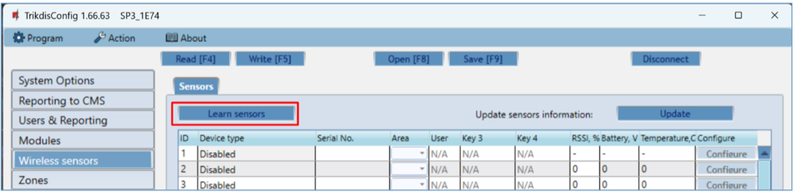

    2. Click **Configure** → **Read [F4]**. Enter admin or installer code if prompted.

    3. Go to **Wireless sensors** → click **Learn sensors**.

        The RF-S8 **NETWORK** LED flashes green/red (learning mode active). The sensor binding window opens.

        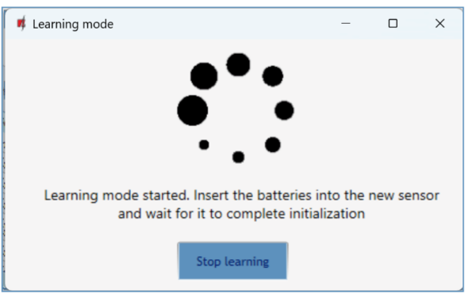

    4. For each sensor:

        a. Hold the sensor's **learn button for 5 seconds** → release when it flashes **green four times**.

        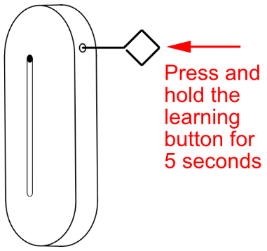

        b. The RF-S8 NETWORK LED briefly turns solid green, then resumes flashing.

        c. Assign a **Zone Number** and **Zone Definition** (Instant / Delay).

        

        d. Click **Save**. Repeat for each additional sensor.

    5. Click **Stop learning**.

        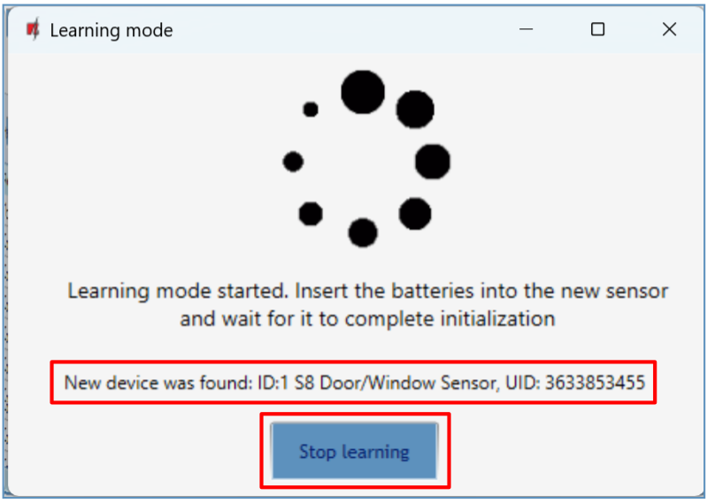

    6. Click **Yes** to write sensors to the SP3.

        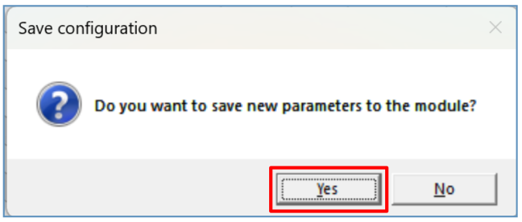

    7. Wait a few minutes → click **Read [F4]**. The Wireless sensors window lists all registered sensors with serial numbers.

        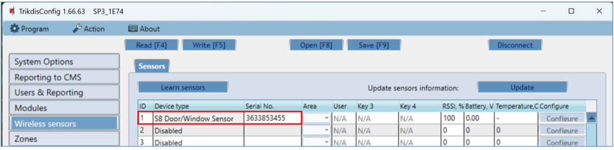

    8. Open the **Zones** window. Confirm zone and area assignments. Set **Type** to `EOL-T` to enable tamper monitoring. Click **Write [F5]**.

        

    #### Local pairing (no network)

    1. Confirm the RF-S8 is registered with the SP3 (visible in Modules list after firmware setup).
    2. Power on the SP3.
    3. Remove the RF-S8 cover.
    4. Hold the RF-S8 **LEARN** button until the NETWORK LED flashes green/red. Release.
    5. Pair each sensor: hold learn button 5 s → four green flashes. NETWORK LED turns solid green briefly after each success.
    6. When done, hold the RF-S8 **LEARN** button until NETWORK LED stops flashing. Release — transceiver exits learning mode.
    7. Connect USB Mini-B to SP3. Open TrikdisConfig → **Read [F4]**.
    8. Confirm serial numbers in **Wireless sensors** window.
    9. Assign zones and areas in the **Zones** window → **Write [F5]**.

    #### Remove a wireless sensor

    1. Connect to SP3 (USB or remote) → **Read [F4]**.
    2. In **Wireless sensors**, set the sensor's **Device type** to `Disabled`.
    3. Click **Write [F5]**.

---

## LED reference — RF-S8 transceiver

| LED | State | Meaning |
|-----|-------|---------|
| NETWORK | Flashing green/red | Learning mode active |
| NETWORK | Solid green (5 s) | Sensor successfully enrolled |
| POWER | Off | No supply voltage |
| POWER | Green blinking | Normal operation |
| POWER | Yellow blinking | Supply voltage low (≤ 11.5 V) |
| POWER | Yellow solid | No RS485 communication with SP3 |
