# Security control panel “FLEXi” SP3

  

**Common questions**

??? question "How do I set up a single Wiegand reader (no keypad) to pulse a door output?"

    --8<-- "en/faq/index.md:sp3-wiegand-reader-door-output-body"

    See the full section: [Linking RFID key fobs (cards)](#linking-rfid-key-fobs-cards).

Don't see your question? Contact [support@trikdis.lt](mailto:support@trikdis.lt).

## Description

**The *„FLEXi“ SP3* control panel** is a processor part of intrusion and fire alarm system. It comes with a built-in WiFi module and 2G/4G cellular modem. The „FLEXi“ SP3 allows grouping of 64 wired and wireless zones into an 8 partition system. Users can switch protection modes of different areas of the premises remotely and with ease (with mobile app Protegus2, SMS or phone call) or with devices that support personal identification (wired and wireless keypads, electronic keys, RFID cards, etc.). Any triggered system event is reported to the central monitoring station (CMS) and to Protegus cloud via WiFi and (or) via cellular network if a SIM card is inserted.

**When it’s recommended to choose the *„FLEXi“ SP3* control panel?**

- For securing small or medium sized premises which will be monitored by a security company. The „FLEXi“ SP3 supports both wired and wireless zones. The panel can provide remote control and system information to both end-users and the security company.

- As a replacement for existing intrusion alarm panel. „FLEXi“ SP3 allows to set a different resistor value to the type used with the old alarm panel. This saves a lot of time during installation, as then there is no need to change resistors in each sensor.

- When the alarm system needs to perform more functions than just protection of the premises. For example: opening the doors and gates, watering the lawn, lighting, heating, ventilation, cooling, controlling as well as many other automatic start and stop functions.

### Features

**Reporting to the security company‘s central monitoring station (CMS):**

- Event reporting either via the built-in WiFi module or cellular 2G/4G modem.

- Additional modules to send reports via Ethernet or VHF/UHF radio waves or Sigfox with chosen priority.

- Any CMS can receive reports, as long as they have TRIKDIS software/IP receiver or any other manufacturer’s IP receiver supporting SIA DC-09 IP protocol.

- Design based on two decades of experience in transmitting reports to main and backup central monitoring station receivers, which allows security companies to provide the highest level of protection to premises

- A setting for necessity to send to CMS, to mandatorily send reports to CMS first, and only then to customers.
- Possibility to send event reports to CMS of two different security companies.

- Multitude number of message transmission channels and multiple transmission priority settings.

**Reporting to user:**

- Via Protegus2 mobile app, which gives warnings about alarm system events using push and special sound notifications.

- Event reporting via SMS messages to 8 cellular numbers.

- Reporting about events using pre-recorded voice notifications (up to 8 cellular numbers. For сontrol panel SP3_12xx with firmware version up to 1.13 inclusive.).

- Remote control of selected premises’ protection mode (Arm/Disarm/Stay/Sleep).

- Remote control of connected devices (lighting system, automatic gates, ventilation, heating, watering systems, etc.).
- Remote temperature measuring.

**Inputs and outputs:**

- 10 I/O terminals, each one can be set as an input (IN) or output (OUT). Input (IN) types: ATZ, EOL, NC, NO. Different parameters of resistors can be used in EOL and ATZ type circuits. The number of inputs IN can be expanded to 64 by using keypads, iO, iO-8, iO8-LORA, iO- LORA and iO-WL expander modules.

- The board has 2 dedicated outputs: the bell and the LED. The bell is to control the siren, and the LED is to control indicator lights. The number of outputs can be expanded to 16 by using iO, iO-8, iO8-LORA, iO- LORA and iO-WL expander modules.

- Seven output operational settings. Each output can be assigned with an operational logic, a preset operation schedule or qualities, for example, thermostat mode.

- One-wire data bus (“1-Wire”) is designated to connect temperature sensors (up to 8), a temperature and humidity sensor (1) or a key fob (“iButton”) reader.

- The GRN-YEL data bus is designated to connect 8 keypads of the same type.

- The RS485 data bus connects iO series expander modules; RF-SH, RF-LORA, RF-S8, RF-HW radio wave wireless sensor transceivers, E485 Ethernet module, T16 VHF or UHF radio wave transmitter, **Sigfox** module.

**Control of alarm system**

- 4-digit or 6-digit long control codes (40 in total), which may be used as a coercion code as well. In such scenario, entering the user code will disarm the alarm, yet a special report will be sent to the CMS indicating that the alarm was disarmed as a result of coercion.

- Control using keypads: SK-LED TouchPad (Protegus SK232LED W), SK-LCD TouchPad (FLEXi SK232LCD), SK LCD Button, SK LED Button; Paradox K636, K10H(V) K32+LED, K32LED, K32LCD+, K35, TM50, TM70; Crow keypad CR16, CR-LCD; CZ-Dallas electronic (“iButton”) key reader; TM17 electronic key reader, RFID reader (Wiegand 26/34).

- Remote control via Protegus2 mobile app, phone call or SMS.

**Simple installation:**

- Multiple sizes of „FLEXi“ SP3 mounting kits that include a decorative white metal housing with a built-in step-down transformer or impulse power supply.

- Default „FLEXi“ SP3 operational settings are based on many years of experience. That allows to install the system in 7 out of 10 small and medium-sized premises without the need to change the default settings.

- The „FLEXi“ SP3 control panel allows to replace the previous panel without changing the resistors in each wired sensor.

- Settings can be saved as a file to be used later.

- Device configuration via USB cable or remotely by using TrikdisConfig software.

- Remote connection via TrikdisConfig software allows not only altering „FLEXi“ SP3 parameters but monitoring the operation of the panel as well.
- Two access levels for parameter settings: installer and administrator.

### Technical specifications 

| Parameter | Description |
|-----------|-------------|
| Power supply voltage [AC /​ DC] | 16 V AC or 16-24 V DC, 2,5 A |
| Current consumption | Up to 50 mA (stand-by), /​ Up to 200 mA (short-term, while sending) |
| Backup power source [BAT] | 12 V lead – acid battery, 4 Ah/​7 Ah |
| Battery charge current | Up to 500 mA |
| Power voltage and current for external devices [AUX] | 12 V DC, up to 1 A |
| Siren output [BELL] | 1 A |
| Output [LED] | 0,1 A |
| PGM output | 0,1 A |
| WiFi module | Yes, built-in |
| WiFi frequency, protocol, encryption type | 2,4 GHz, 802.11 b/​g/​n, WPA, WPA2, WPA mixed |
| WiFi network configuration type | DHCP or manual |
| SIM card | 1, NANO size |
| GSM/​GPRS modem frequencies | 850 /​ 900 /​ 1800 /​ 1900 MHz |
| 4G modem frequencies „FLEXi” SP3_14E /​ „FLEXi” SP3_24E /​ EMEA/​Thailand | B1/​B3/​B7/​B8/​B20/​B28 |
| 4G modem frequencies „FLEXi” SP3_24S /​ Latin America/​Australia/​New Zealand | B1/​B3/​B4/​B5/​B7/​B8/​B28 |
| 4G modem frequencies „FLEXi” SP3_24A /​ North America | B2/​B4/​B12 |
| Report transmission directions | To main and backup receivers of 2 different security companies;​ To Protegus cloud, to iOS/​Android Protegus2 mobile apps;​ To 8 mobile phones via SMS messages. Calls 8 mobile phones. If a user answers the call, announces what happened using voice (For сontrol panel SP3_12xx with firmware version up to 1.13 inclusive). |
| Event reporting transmission channels | GPRS or 4G, WiFi, LAN (with module E485), SMS, Voice call (up to 8 cellular numbers. For сontrol panel SP3_12xx with firmware version up to 1.13 inclusive), VHF/​UHF radio waves (with transmitter T16) |
| Protocols for connection to CMS | TCP /​ IP or UDP /​ IP, or SMS |
| Event encoding | Contact ID codes |
| Report encryption | TRK AES 128, SIA IP AES 128 |
| Internal clock | Yes |
| Buffer memory capacity | 60 events |
| Events log memory | Up to 1000 events. Oldest entries deleted automatically. |
| User codes | 40 (4-digit or 6-digit long codes) |
| Duress code | Two code entry methods can be chosen during programming |
| Dual purpose terminals [I/​O] | 10;​ IN or OUT function selected during programming. When IN is selected, available types: NC, NO, EOL, EOL_T, 3EOL, ATZ, ATZ_T. When OUT is selected, the terminal becomes open collector (OC) type with up to 100 mA current |
| No. of partitions | 8 |
| No. of zones | 10 (20 zones if using ATZ), (can be expanded to 64 zones using expanders) |
| No. of PGM outputs | 2 (can be 12 if IO terminals are set as outputs. Can be expanded to 16 outputs with expanders) |
| Max. number of connected keypads | 8 |
| Supported keypads | SK-LED TouchPad (Protegus SK232 LED W) /​ SK-LCD TouchPad (FLEXi SK232LCD) /​ SK LCD Button /​ SK LED Button /​ Paradox K636 /​ Paradox K10H(V) /​ Paradox K32 LED /​ Paradox K32+ LED /​ Paradox K32LCD+ /​ Paradox K35 /​ Paradox TM50 /​ Paradox TM70 /​ Crow CR16 /​ Crow CR-LCD |
| Max. number of RFID readers (Wiegand 26/​34) | 2 |
| 1-Wire data bus length [1 WIRE] | Up to 30 m |
| Compatible temperature sensors | Maxim®/​Dallas® DS18S20, DS18B20;​ AM2301 series |
| Max. number of temperature sensors connected to 1-Wire data bus | 8 (Dallas) or 1 (if an AM2301 series sensor is used) |
| Compatible electronic (iButton) keys [1 WIRE] | Maxim®/​Dallas® DS1990A |
| Max.number of electronic (iButton) keys | 40 |
| RS485 data bus length | Up to 100 m |
| Max. no. of devices connected to RS485 data bus | 8 |
| Supported modules | iO-8 – expander module;​ /​ iO – expander module;​ /​ iO-MOD – iO-WL radio wave transceiver;​ /​ iO-WL – wireless expander module;​ /​ RF-SH – radio wave receiver for wireless sensors;​ /​ RF-HW - transceiver for wireless sensors;​ /​ RF-S8 - transceiver for wireless sensors;​ /​ RF-LORA - transceiver for LORA wireless sensors;​ /​ E485 – module for connecting to Ethernet network;​ /​ TM17 – iButton key reader;​ /​ CZ-Dallas – iButton key reader;​ /​ T16 – VHF or UHF radio wave transmitter;​ /​ iO-LORA - expander module;​ /​ iO8-LORA - expander module;​ /​ PB-LORA – panic button;​ /​ REL-LORA – relay module;​ /​ RFID reader. |
| Operating environment | Temperature from -10 °C to +50 °C, relative humidity 80% at +20°C, no condensation. |
| Dimensions of the control panel | 117x79x25 mm |
| Weight | 0,1 kg |

### List of compatible modules 

| **Module name** | **Current** |
|----|----|
| Keypad SK-LED TouchPad (Protegus SK232 LED W) | Min 60 mA, max 150 mA |
| Keypad SK-LCD TouchPad (FLEXi SK232LCD) | Min. 25 mA, max. 60 mA |
| Keypad SK LCD Button | Max. 70 mA |
| Keypad SK LED Button | Max. 70 mA |
| Keypad Paradox K636 | Min 40 mA, max 70 mA |
| Keypad Paradox K10H(V) | Min 44 mA, max 72 mA |
| Keypad Paradox K32 LED | Min 49 mA, max 148 mA |
| Keypad Paradox K32+ LED | Min 49 mA, max 148 mA |
| Keypad Paradox K32LCD+ | Min 70 mA, max 150 mA |
| Keypad Paradox K35 | Min 30 mA, max 70 mA |
| Keypad Paradox ТМ50 | Мin 100 mA, max 230 mA |
| Keypad Paradox ТМ70 | Min 200 mA, max 330 mA |
| Keypad Crow CR16 | Min 40 mA, max 75 mA |
| Keypad Crow CR-LCD | Min 40 mA, max 75 mA |
| iO-8 expander module | Max 20 mA |
| iO expander module | Max 50 mA |
| iO-MOD – iO-WL radio wave transceiver | Min 50 mA, max 150 mA |
| iO-WL wireless expander module | Max 200 mA |
| RF-SH transceiver for wireless sensors (Crow) | Max 100 mA |
| E485 Ethernet communicator | Min 50 mA, max 150 mA |
| TM17 iButton key reader | Max 50 mA |
| CZ-Dallas iButton key reader | Max 25 mА |
| T16 (VHF or UHF) radio wave transmitter | Min 100 mA, max 1,2 A |
| RFID reader (Wiegand 26/​34) | Max 100 mA |
| RF-LORA transceiver for LORA wireless sensors and LORA modules | Min. 50 mA, маx. 150 mA |
| iO-LORA expander module | Max 50 mА |
| iO8-LORA expander module | Max 50 mА |
| PB-LORA panic button | Battery 3V, CR123A |
| REL-LORA relay module | Max. 45 mA |
| RF-S8 transceiver for wireless sensors (S8) | Up to 100 mA |
| RF-HW transceiver for wireless sensors (Honeywell)) | Up to 100 mA |

### Purpose of external terminals

1.  Connectivity and operation indicator lights.
2.  Backup power supply terminal block.
3.  Main power supply terminal block.
4.  External terminal block.
5.  1-WIRE data bus terminal block.
6.  SMA screw-on type connector for WiFi antenna.
7.  Nano-SIM card holder.
8.  SMA screw-on type connector for Cellular antenna.
9.  USB Mini-B connector for configuring the control panel’s settings.

| **Terminal** | **Description** |
|----|----|
| Power terminal | Power supply terminal (16 V AC or positive 16-24 V DC) |
| Power terminal | Power supply terminal (16 V AC or negative 16-24 V DC) |
| BAT+ | Backup power supply positive terminal 12 V |
| BAT- | Backup power supply negative terminal 12 V |
| AUX+ | Positive 12 V power terminal for external devices |
| AUX- | Common negative terminal |
| GRN | Keypad data bus |
| YEL | Keypad data bus |
| A 485 | Terminal A of *RS485* data bus |
| B 485 | Terminal B of *RS485* data bus |
| IO1 – IO9 | Input/​output terminals (default setting – input) |
| IO10 | Input/​output terminal (default setting – PGM output, Fire Sensor Reset) |
| C | Common negative terminal |
| LED | PGM output (default setting – System State) |
| +5 V | Positive 5 V power terminal for *1-Wire* devices |
| 1 WIRE | *1-Wire* data bus terminal |
| C | Common negative terminal |

### LED indication of operation 

| LED indicator | Light status | Description |
|---------------|--------------|-------------|
| NET | Green blinking | SIM card is registering on Cellular network. |
| NET | Green solid | SIM card registered on Cellular network. |
| NET | Yellow blinking | Indicates Cellular signal strength from 0 to 5. 3 is sufficient. |
| DAT | Off | No unsent event messages. |
| DAT | Green solid | Message is being sent. |
| DAT | Yellow solid | There are unsent event messages in buffer memory. |
| MOD | Green blinking | Connecting to WiFi network. |
| MOD | Green solid | Connected to WiFi network. |
| PWR | Green blinking | No operational problems. |
| PWR | 1 red flash | No SIM card detected |
| PWR | 2 red flashes | The PIN card of the SIM card is incorrect |
| PWR | 3 red flashes | Unable to connect to Cellular network |
| PWR | 4 red flashes | Unable to connect to CMS receiver using channel 1 |
| PWR | 5 red flashes | Unable to connect to CMS receiver using channel 2 |
| PWR | 6 red flashes | Internal clock not set |
| PWR | 7 red flashes | Insufficient backup power supply voltage |
| PWR | 8 red flashes | No AC power |
| PWR | 9 red flashes | Unable to connect to WiFi network |

### Control panel firmware versions 

| **Firmware revision** | **Wireless receiver** | **Wireless sensor** | **Supported number of zones** | **Supported keypads** | **Supported modules** |
|----|----|----|:--:|----|----|
| SP3_xxx0 | RF-SH, RF- LORA | CROW | 32 | Flexi, Paradox, Crow CR Icon/LCD (ST) | iO, iO-8, iO-WL, iO-MO, TM17, E485, T16, SF485, RF-LORA, iO-LORA, iO8-LORA, PB-LORA, REL-LORA, RF-SH |
| SP3_xxx1 | RTX3, RF-LORA | PARADOX | 32 | Flexi, Paradox, Crow CR Icon/LCD (ST) | iO, iO-8, iO-WL, iO-MO, TM17, E485, T16, SF485, RF-LORA, iO-LORA, iO8-LORA, PB-LORA, REL-LORA |
| SP3_xxx2 | RF-HW, RF- LORA | HONEYWELL | 64 | Flexi, Paradox, Crow CR Icon/LCD (ST) | iO, iO-8, iO-WL, iO-MO, TM17, E485, T16, SF485, RF-LORA, iO-LORA, iO8-LORA, PB-LORA, REL-LORA, RF-HW |
| SP3_xxx4 | RF-LORA, RF-S8 | MAXIMUM, S8 | 64 | Flexi, Paradox | iO, iO-8, iO-WL, iO-MO, E485, T16, SF485, RF-LORA, iO-LORA, iO8-LORA, PB-LORA, REL-LORA, RF-S8 |

## Powering the security control panel

### Main power supply

The control panel and the entire alarm system can be powered either from an alternating or a direct current source. In both cases, a backup power supply – a 12 V battery – must be connected to the system to ensure the supply of power is uninterrupted. To meet the demands of the EN50131 standard, the backup battery must be able to work for 12 hours for security Grade II or 60 hours for security Grade III after losing power from the main power supply. Take into account the total current consumption of the additional connected modules, the current consumption of individual modules is listed in chapter 1.2 “List of compatible modules”.

### Backup power supply

If there are problems with powering the system from the main power supply, an *AC Fault* event report will be generated and the panel will automatically switch to the backup 12 V battery. If the battery’s voltage falls to 11,5 V, a *Low* *Battery* event report will be generated. The battery will be disconnected if the voltage falls bellow 9,5 V. If AC network voltage is restored, an *AC Restore* report will be generated and the battery charging process will begin automatically. When the battery’s voltage rises to 12,6 V, a *Battery Restore* event report will be generated.

### Control panel kits

#### Control panel *„FLEXi“ SP3*  

| Name                                  | Quantity |
|:--------------------------------------|:---------|
| „FLEXi“ SP3 control panel board | 1 pc.    |
| Wire for connecting battery           | 1 pc.    |
| Resistor 2,2 kΩ                       | 20 pcs.  |
| Resistor 4,7 kΩ                       | 10 pcs.  |
| Plastic spacer (mounting parts)       | 4 pcs.   |
| Antenna ME301M with 2,5 m long cable  | 2 pcs.   |

#### Control panel *„FLEXi“ SP3* KIT

| Name                                                            | Quantity |
|:----------------------------------------------------------------|:---------|
| „FLEXi“ SP3 control panel board, built into metal housing | 1 pc.    |
| Metal housing K01 with 40 VA transformer                        | 1 pc.    |
| Resistor 2,2 kΩ                                                 | 20 pcs.  |
| Resistor 4,7 kΩ                                                 | 10 pcs.  |
| Antenna ME301M with 2,5 m long cable                            | 2 pcs.   |
| Wire for connecting battery                                     | 1 pc.    |
| Tamper sensor                                                   | 1 pc.    |
| Terminal block with 0,5 A fuse                                  | 1 pc.    |

#### Control panel *„FLEXi“ SP3* KITi

| Name                                                            | Quantity |
|:----------------------------------------------------------------|:---------|
| „FLEXi“ SP3 control panel board, built into metal housing | 1 pc.    |
| Metal housing K02 with Mean Well impulse power supply           | 1 pc.    |
| Resistor 2,2 kΩ                                                 | 20 pcs.  |
| Resistor 4,7 kΩ                                                 | 10 pcs.  |
| Antenna ME301M with 2,5 m long cable                            | 2 pcs.   |
| Wire for connecting battery                                     | 1 pc.    |
| Tamper sensor                                                   | 1 pc.    |
| Terminal block with 3,15 A fuse                                 | 1 pc.    |

!!! note
    USB wire (Mini-B type) for programming the control panel sold
    separately.
## Installation of the system

### Recommended order of installation

**Planning the system:**

- Sketch a plan of the premises and mark the areas where the metal housing with the control panel, keypad (-s), signallers, equipment automatically or remotely controlled by the control panel will be installed.

- After evaluating the premises, the demands raised for their protection and the characteristics of possible sensors, choose the number of sensors to use, their types, and the locations to install them.

#### Installing the control panel into the mounting housing 

The control panel’s board can be installed into a mounting housing that already has a step-down transformer with a 500 mA fuse installed and also has space intended for a backup battery. / Install the control panel into the chosen plastic or metal housing using plastic spacers. If you chose a metal housing, do not forget to ground it during installation. The chosen housing must meet demands described in the EN 60950 and EN 50131 standards.

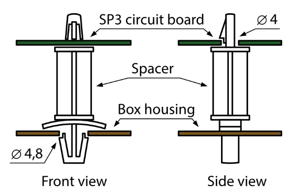

**Dimensions of the „FLEXi“ SP3 board**

The picture below shows the dimensions of the board and its mounting holes (in millimeters), and also the locations of the holes.

#### Order of connecting devices

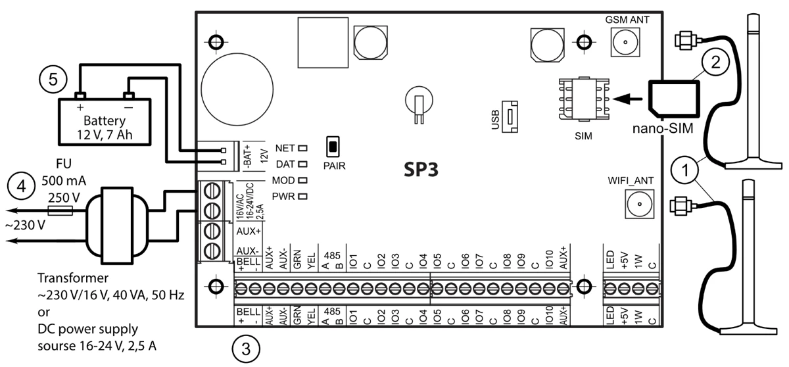

1.  Connect GSM and WiFi antennas to the antenna connectors.

2.  Insert an activated SIM card into the SIM card holder.

3.  Using the given connection schematics and the connection schematics for every device to be connected, connect the door and window magnetic contacts, motion, fire and other sensors, signallers, keypads and controlled devices. Connect the housing door and wall mounting tamper sensors to the panel’s terminals.

4.  Connect the wires of the main power supply to the control panel’s AC/DC terminals. Turn on the main power supply. The „FLEXi“ SP3 will recognize the keypads, expanders and interfaces that are correctly connected using 1-WIRE and YEL/GRN data busses.

5.  Insert a backup battery into the mounting housing. Connect the battery’s terminals to the BAT+ / BAT– terminals on the control panel.

!!! note
    The battery must recharge in less than 72 hours for the alarm system to
    meet security Class II or 24 hours to meet security Class III.
#### Recommendations for setting the control panel’s parameters 

1.  See chapter 5 “Setting parameters using TrikdisConfig” for information on how to connect to the panel to configure it.

2.  System settings:

    1.  **Partitions.** If you would like to turn on protection for specific zone groups separately, the alarm system can be divided into partitions. See chapter 5.2 ““System Options” window” on how to divide the system and set the required partition attributes.

    2.  **Zones.** See chapter 5.7 ““Zones” window” to set every zone according to the sensors’ characteristics and desired operation of the alarm after an event occurs in that zone. If the alarm system is divided into partitions, every zone can be assigned to a desired area.

    3.  **Users.** System *users* must be created to control the alarm system via keypad, iButton key or phone call (SMS message). See chapter 5.4 ““Users & Reporting” window” on how to create *users* and assign them permissions.

3.  Message sending:

    1.  **Time setting.** The control panel’s time must be set in order to receive messages with exact timestamps. See chapter 5.2 ““System Options” window”.

    2.  **Enable report sending.** Default settings enable the event report sending function for all events. If any event occurs, its report will be sent to the set recipients using the set channels. See chapter 5.10 ““System events” window” on how to disable reporting of chosen events.

    3.  **SIM card parameters.** If messages need to be sent using mobile networks, you must set parameters for the SIM card being used (see chapter 5.2 ““System Options” window”).

    4.  **Reports to central monitoring station.** Sending reports to the central monitoring station is disabled by default. See chapter 5.3 ““Reporting to CMS” window” on how to set parameters for sending messages to CMS.

    5.  **Reports to user.** Communication with Protegus cloud is enabled by default, and sending reports using SMS messages and phone calls is disabled. See chapter 5.10 ““System events” window” on how to set parameters for sending reports to the user’s mobile phone.

4.  Remote control of the system:

    1.  **User access.** The alarm system can be controlled remotely (via phone call and (or) SMS messages) by users whose phone numbers are entered into the User list. See chapter 5.4 ““Users & Reporting” window” on how to enter phone numbers.

    2.  **Control via phone call.** Phone calls allow not only to arm or disarm all or part of the security system, but also to control (turn on or off) equipment connected to PGM outputs. See chapter 4.4 “Control via phone call” on what parameters to change to allow phone calls to modify the state of a selected PGM output that has an equipment control circuit connected to it.

    3.  **Control via** **SMS** **messages.** With SMS messages, it is possible to change some of the control panel’s operational parameters, arm or disarm all or part of the premises, control (turn on or off) equipment connected to the PGM outputs. See the list of SMS commands on chapter 4.3 “Configuration and control via SMS messages”.

5.  Additionally:

    1.  **Changing control codes.** We recommend changing the panel’s default alarm control and configuration codes to something only You know.

        - The **Master** user code can be changed in the branch **Users & Reporting** of the program menu.

        - **The remote SMS control** code can be changed in the **System Options** window of the program menu, in the **SMS Password** field of the **Access** section.

        - **Access codes for connecting with TrikdisConfig** can be changed in the **Access** section of the **System Options** branch of the program menu.

### Connecting sensors 

There are 10 terminals IO1–IO10 (inputs) on the control panel board for connecting sensor circuits. The number of inputs can be expanded to 64 using input expanders (***iO, iO8, iO-WL, RF-SH, iO-LORA, iO8-LORA**)*. Any terminal can be set as an input and assigned zone attributes: circuit type (NO, NC, EOL, EOL_T, 3EOL, ATZ, ATZ_T); sensitivity to temporary circuit events; zone function (Delay, Instant, Instant Stay, Interior, Interior Stay, Fire, Keyswitch, 24_hour, Silent, Silent 24h), see chapter 5.7 ““Zones” window”. The iO8 and iO8-LORA expanders support all types of zone resistor (EOL types) of the control panel.

#### Schematics for connecting sensors.

  <figure style="margin: 0;">
    
  </figure>
  <figure style="margin: 0;">
    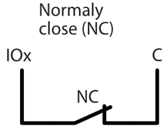
  </figure>
  <figure style="margin: 0;">
    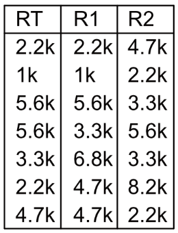
  </figure>

  <figure style="margin: 0;">
    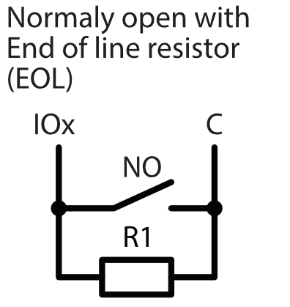
  </figure>
  <figure style="margin: 0;">
    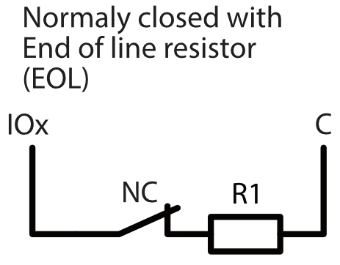
  </figure>
  <figure style="margin: 0;">
    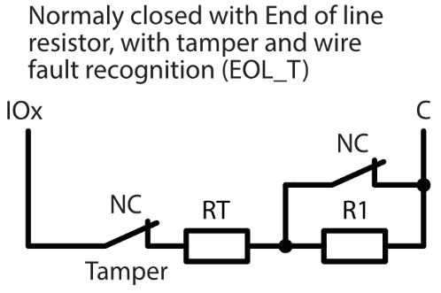
  </figure>

  <figure style="margin: 0;">
    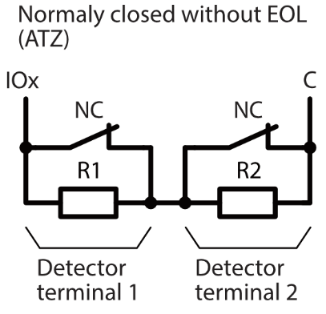
  </figure>
  <figure style="margin: 0;">
    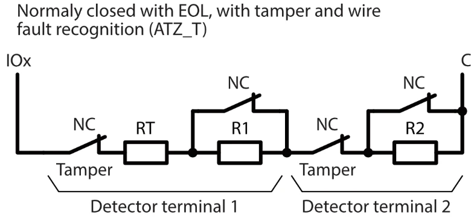
  </figure>

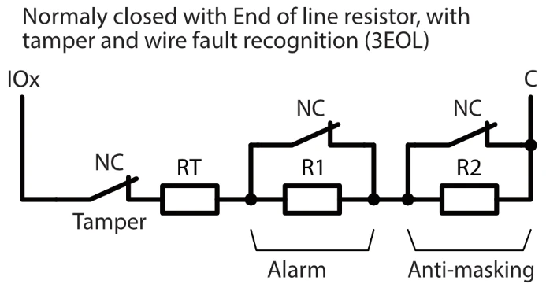

### Connecting smoke detectors 

Schematic for connecting two-wire smoke detectors to PGM (LED) outputs. When using this scheme for connecting fire detectors, it is necessary to mark the "**LED out as 2Wire fire**" field with a tick (see chapter5.2 “Window “System options””).

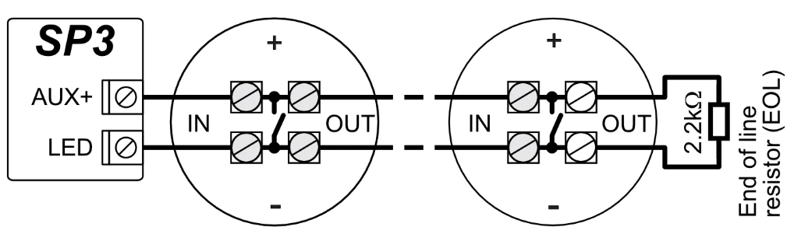

Schematic for connecting four-wire smoke detectors.

To connect a smoke detector circuit to a selected input, the input (IOx) must be assigned the Fire zone function (see chapter 5.7 ““Zones” window”).

To connect a four-wire smoke detector circuit to a selected PGM output (IO10), the Fire Sensor Reset function must be assigned to the output (see chapter 5.8 ““PGM” window””). The relay K1 is used to detect a broken cable and removal of a fire detector.

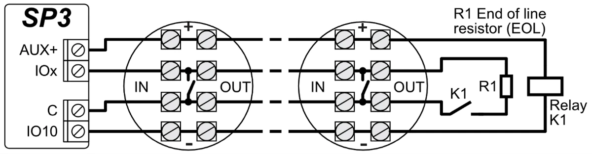

Schematic for connecting two-wire smoke detectors. The relay K1 is used to detect a broken cable and removal of a fire detector.

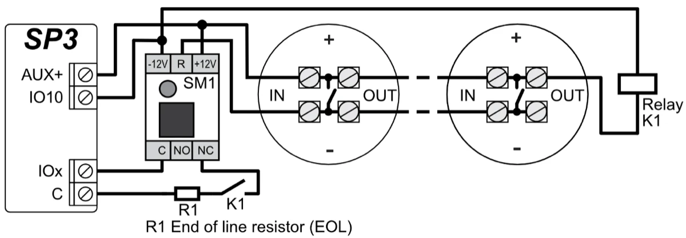

Or

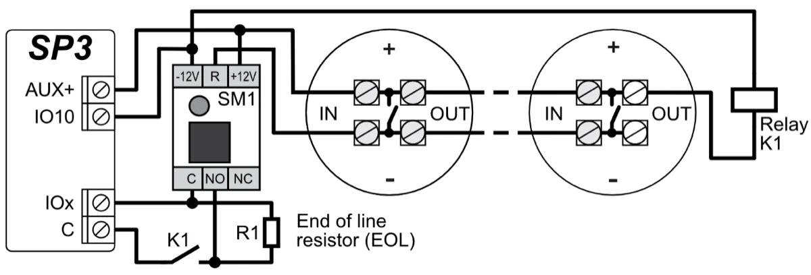

### Schematic for connecting a siren 

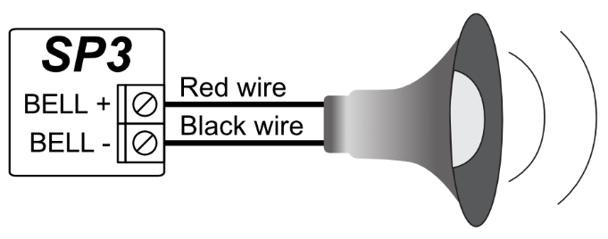

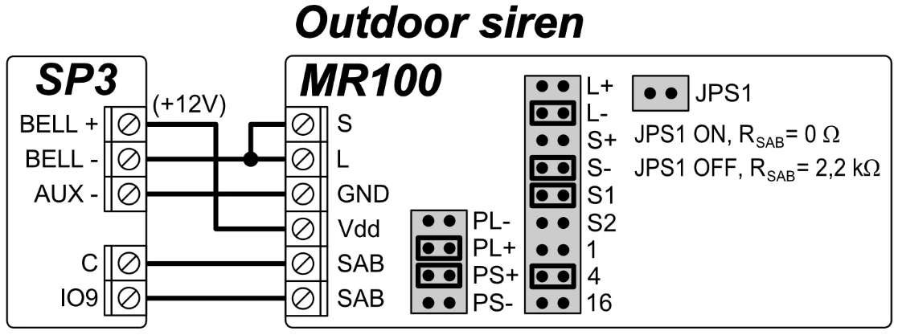

The diagram shows the connection and settings of the **MR100** outdoor siren. If the control panel will use a different method for monitoring the EOL (factory setting is 2.2 kOhm EOL) of the siren tamper (SAB terminals) circuit, it is necessary to close the JPS1 contacts and connect a resistor of the corresponding rating in series to the tamper circuit. The **24_hours** zone type is factory set for IO9 input.

### Schematics for connecting keypads and RFID readers (Wiegand 26/34) 

Up to 8 devices can be connected to the keypad data bus. The type of the connected keypad must be specified using TrikdisConfig software (see chapter 5.5 ““Modules” window”). The control panel will automatically recognize and link the connected devices.

For operating the alarm with Protegus or Paradox keypads, including user codes, bypass, iButton/RFID, calls, SMS and PGM outputs, see the [SP3 user guide for Protegus and Paradox keypads](paradox-user-guide/index.md).

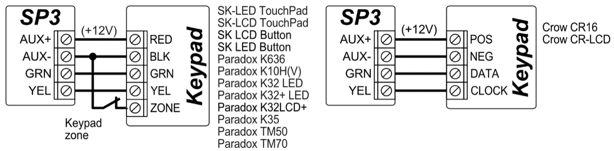

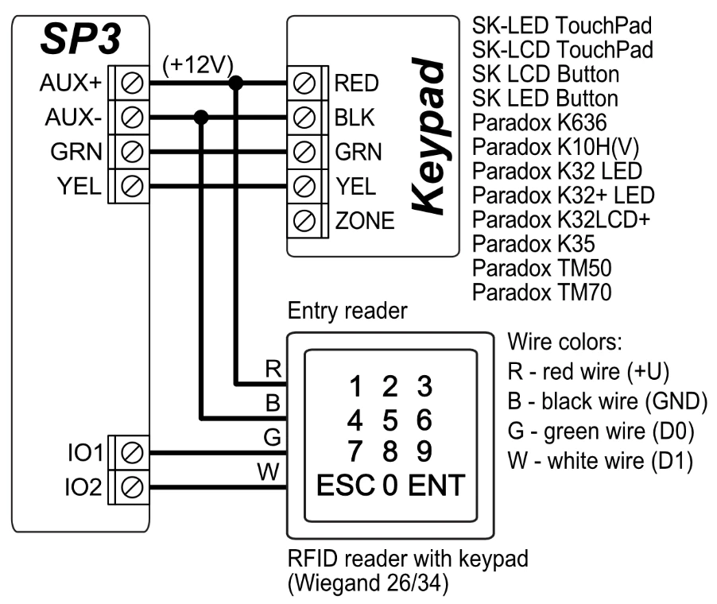

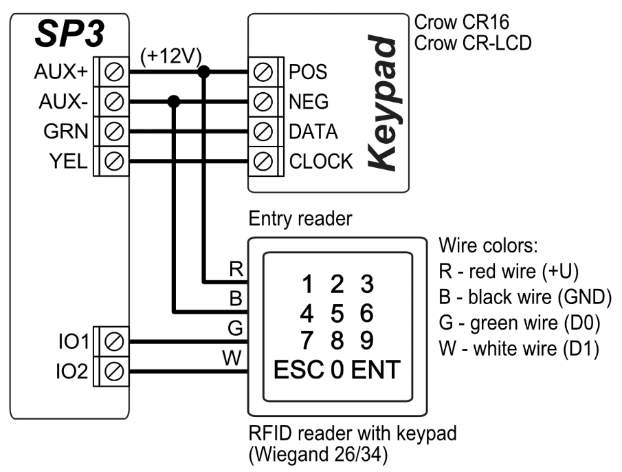

Up to 2 RFID readers can be connected to the control panel. If 2 RFID readers are connected to the control panel, no keypads can be connected.

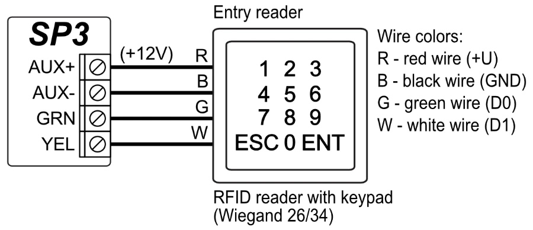

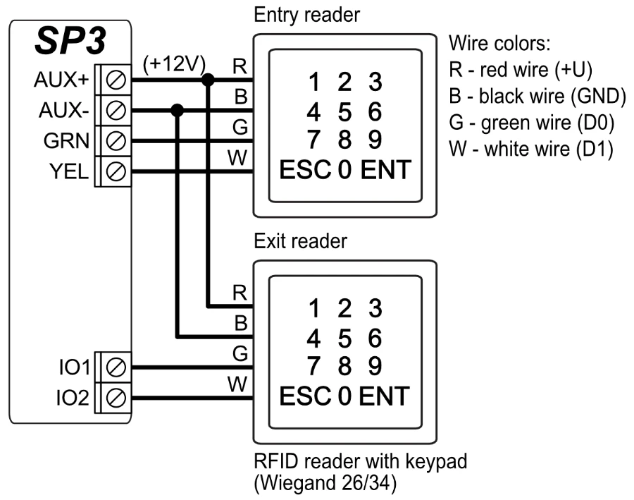

### Schematics for connecting TM17, CZ-Dallas readers 

The **CZ-Dallas** iButton key reader connects to the „FLEXi“ SP3 using the “*1 Wire*” data bus. The length of the wires connecting to the data bus can be up to 30 m:

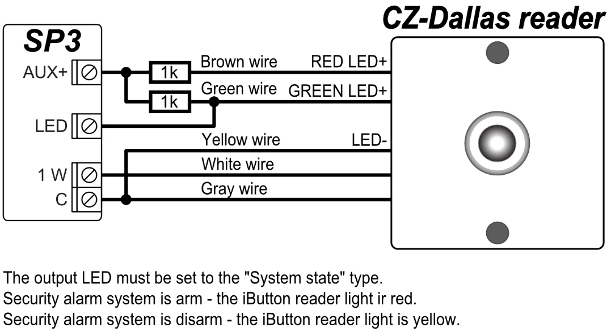

The **TM17** reader connects to the „FLEXi“ SP3 using the *RS485* data bus. The length of the wires connecting to the *RS485* data bus can be up to 100 m.

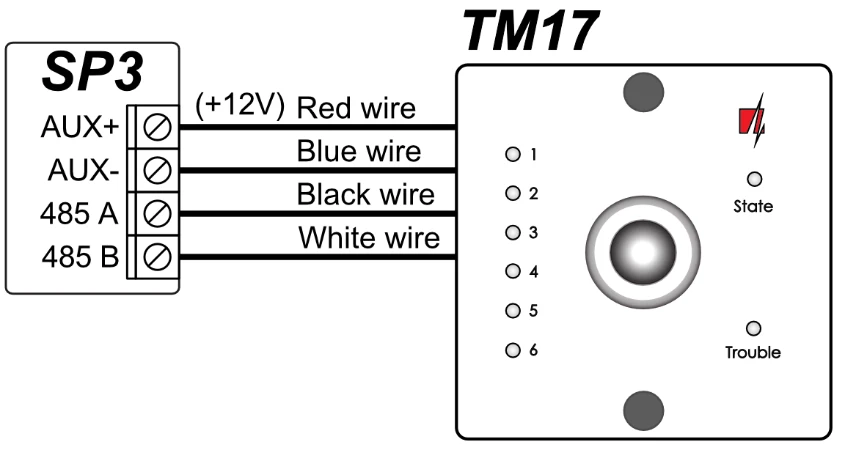

### Schematic for connecting a temperature sensor

**Temperature sensors** should be connected according to the given schematic. Maxim®/Dallas® DS18S20, DS18B20 temperature sensors (up to 8) or AM2301 humidity and temperature sensor (up to 1) can be connected to the „FLEXi" SP3 control panel.

If a wire longer than 0,5 meters is used to connect a temperature sensor, we recommend using **twisted pair cable (UTP4x2x0,5 or STP4x2x0,5)**.

The +5V terminal on the board is for supplying devices connected to the 1-Wire data bus with 5 V DC voltage. The maximum output current is 0,2 A. The output is protected from overload. If the maximum allowed current is exceeded, the power will automatically be switched off. The control panel automatically recognizes and links connected devices.

  <figure style="margin: 0;">
    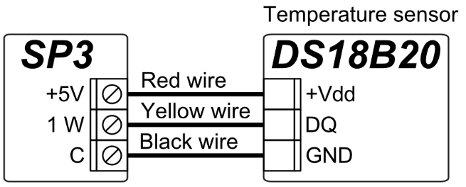
  </figure>
  <figure style="margin: 0;">
    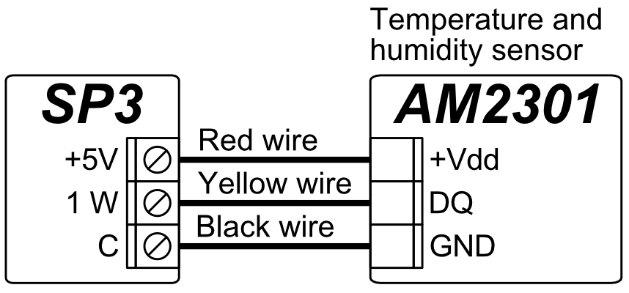
  </figure>

### Schematics for connecting a relay and an LED indicator 

Using the relay terminals, it is possible to remotely control (turn on/off) various electrical devices. The panel’s universal I/O terminal must be configured as an output (OUT) and must have the definition Remote control assigned.

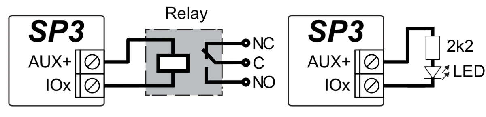

###  Schematic for connecting Ethernet communicator E485 

The *E485* module allows the control panel to send and receive control commands using a wired internet connection. If an *E485* module is connected to the control panel, reports to the CMS and to *Protegus2* will be sent using wired internet and mobile internet will not be used. If wired internet connectivity is lost, mobile internet will be used for sending reports to the CMS. If wired internet connectivity is restored, the control panel will automatically stop using mobile internet and will switch to communicating with CMS and *Protegus2* mobile app using the *E485*, i.e. wired internet.

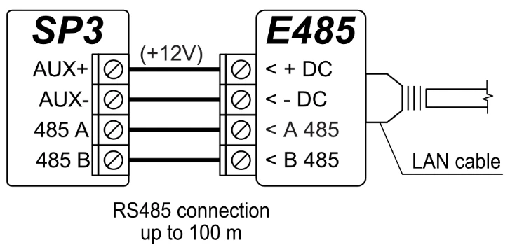

See chapter 5.3 ““Reporting to CMS” window” on how to choose connectivity priority (SIM, WiFi, LAN(E485)). The „FLEXi“ SP3’s configuration for the E485 Ethernet module is described in chapter 5.5. ““Modules” window”.

If the E485 is connected, a SIM card is not necessary for the control panel.

### Schematic for connecting RF-SH 

The firmware version of the *"FLEXi" SP3* control panel must be SP3_xxx0_0101.fw (firmware version 1.01 or higher). When connected to the *RF-SH* wireless sensor receiver, the *"FLEXi" SP3* can work with wireless sensors (up to 32), wireless sirens (up to 16), key fobs (up to 42), and wireless keypads (up to 8) from "Crow".

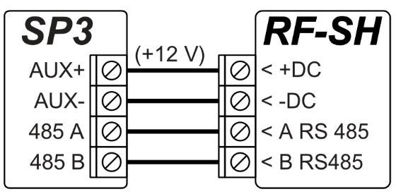

### Schematic for connecting RTX3 

The firmware version of the *"FLEXi" SP3* control panel must be: SP3_xxx1_0112.fw (firmware version 1.12 and higher). When connecting the RTX3 wireless sensor receiver, *"FLEXi" SP3* can work with wireless sensors from "Paradox" (magnetic contacts, PIR sensors, glass break sensors (G550), smoke detectors (SD360), key fobs (REM2, REM25), sirens (SR230, SR250), keypads (K37), PGM and zone expansion module (2WPGM), repeater (RPT1)).

For RTX3 firmware, connection and Paradox wireless-device enrollment or removal, see [Using Paradox wireless devices with FLEXi SP3 (RTX3)](paradox-rtx3/index.md).

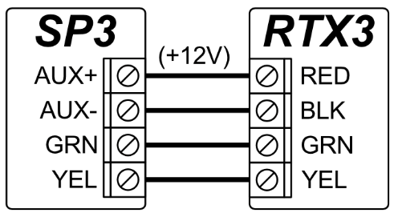

### Schematic for connecting RF-HW 

The *"FLEXi" SP3* control panel firmware version must be SP3_xxx2_0114.fw (firmware version 1.14 or higher). When connected to the *RF-HW* wireless sensor receiver, the *"FLEXi" SP3* will be compatible with "Honeywell" wireless sensors, sirens, keypads and key fobs.

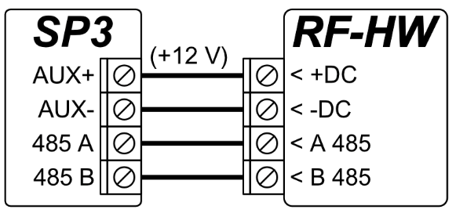

### Schematic for connecting RF-S8 

The *"FLEXi" SP3* control panel firmware version must be SP3_xxx4_0122.fw (firmware version 1.22 or higher). When connected to the *RF-S8* wireless sensor receiver, the *"FLEXi" SP3* will be compatible with "S8" wireless sensors, sirens, and key fobs.

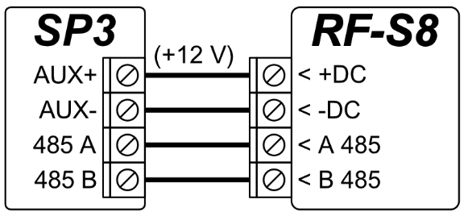

### Schematic for connecting RF-LORA 

The *„FLEXi“ SP3* control panel firmware version must be SP3_xxx4_0122.fw (firmware version 1.22 or higher). When connected to an *RF-LORA* wireless sensor receiver, the *„FLEXi“ SP3* can work with wireless sensors (up to 32), sirens (up to 16), and key fobs (up to 32) from company „Maximum“. / Configuring the *„FLEXi“ SP3* using expansion modules is described in Section 5.5. "The 'Modules' Window."

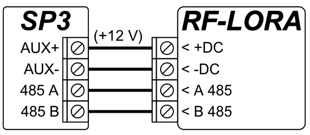

### Schematics for connecting for LORA series expanders 

### Schematics for connecting iO series expander modules 

If the security control panel „FLEXi“ SP3 needs to have more inputs IN or outputs OUT, connect a wired or wireless TRIKDIS iO series input and output expander. The „FLEXi“SP3’s configuration for expander modules is described in chapter 5.5 ““Modules” window”.

  <figure style="margin: 0;">
    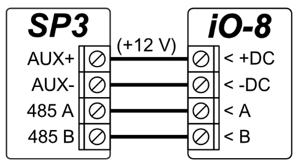
  </figure>
  <figure style="margin: 0;">
    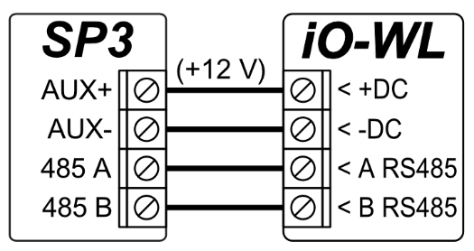
  </figure>

### Schematics for connecting RF transmitter T16 

RF transmitter T16 used for transmitting security control panel event messages via TRIKDIS radio networks. / The transmitter can send its own event messages and event messages received from security control panels to the CMS (central monitoring station) with the possibility to forward to the end user.

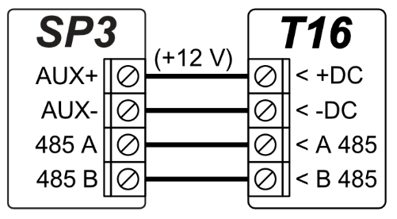

### Schematics for connecting SF485 

*SF485* works as secondary channel for security panel events transmission to CMS (Central Monitoring Station) or *Protegus2* mobile app over the SigFox network, when primary channel fails. Events are transmitted in Contact ID format.

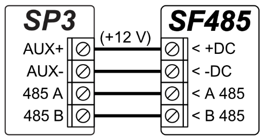

### DC Voltage measurement with „FLEXi“ SP3 

The *„FLEXI“ SP3* can be used to measure DC voltage. Voltage from 0 V to 30 V is measured (exceeding 30 V will cause damage to the control panel *„FLEXI“ SP3*). The measured voltage must be connected to terminals “IN1” and “C”. “IN1” - positive terminal. “C” - negative terminal.

Connect the „FLEXI“ SP3 to a computer with a USB Type-C cable. Run TrikdisConfig. The software will automatically recognize the connected „FLEXI“ SP3 and will open a window for configuration. In the “**Sensor**” window, specify the “**In1 Voltage**” and also specify the amount of voltage above which a message will be generated.

- **Max** – when the voltage is higher than this setting, an event message will be generated. For an event message to be generated, the “**High**” box must be ticked.

- **Min** – when the voltage is lower than this setting, an event message will be generated. For an event message to be generated, the “**Low**” box must be ticked.

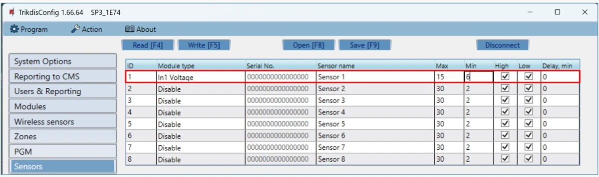

The PGM output can be controlled when measuring a voltage above a set value or below a set value. In TrikdisConfig you need to select the PGM output and set it to “**Remote Control**” operation mode.

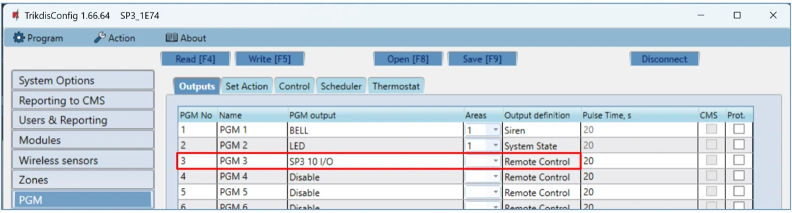

Go to the “**Set Action**” tab.

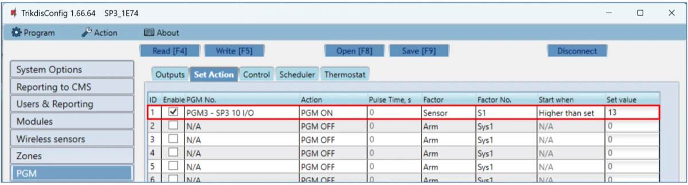

- **Enable** – enables the PGM.

- **PGM No.** – specify the PGM output that the “**IN1**” input will control.

- **Action** - set the operating mode of the PGM output:
- **PGM OFF** – turn off PGM output.

- **PGM ON** – enable PGM output.

- **Pulse OFF -** turning off the PGM output for the duration of the pulse (after receiving the command, the output turns off for the duration of the pulse and then turns on)**.**

- **Pulse ON** – turn on the PGM output for the duration of the pulse (after receiving the command, the output turns on for the duration of the pulse and then turns off).
- **Pulse time, s** – set the pulse time anywhere from 0 to 9999 seconds.
- **Factor** – set sensor.

- **Factor No.** – assign a voltage measuring input “**IN1**”.

- **Start when** – set an additional condition for activating the PGM output.

- **Set value** – specify the voltage (V) that the controller will monitor and control the PGM output.

### Turning on the control panel 

To turn on the control panel, first you need to turn on its power supply. The control panel’s LED indicators must operate in the following way:

- The PWR diode must blink in green – this indicates that the power supply voltage is sufficient;

- The NET diode must be green solid and periodically blink in yellow no less than 3 times – the green color indicates that the SIM card is successfully registered on the mobile network, while the number of green flashes indicate the mobile signal strength.

!!! note
    Sufficient mobile network strength is 3 (three yellow flashes of the NET
    indicator). / If you see fewer yellow flashes of the NET diode, the
    strength of the mobile network is insufficient. We recommend choosing a
    different place for installing the control panel, changing the location
    of the antenna or using a more sensitive mobile antenna. / If the light
    indication is different, see chapter 1.4 "LED indication of operation"
    to find out the reason. / If all of the „FLEXi" SP3 indicator
    lights are off, check the power supply and connections.
## Remote control 

### Linking the *„FLEXi“ SP3* to a user’s *Protegus2* account 

With Protegus2, users can control the alarm system remotely. They can also see the system state and receive system event reports.

1.  If you do not yet have a personal Protegus cloud account, open the page [www.protegus.app](https://www.protegus.app) using a web browser and create an account by clicking the “*Sign up”* link.

    

      
      
      
    

2.  Click on the link you receive in your e-mail to activate your account.

3.  Download and install Protegus2 mobile app into your smartphone.
4. Launch the Protegus2 mobile app on your smartphone and log in using your username and password.

!!! warning "Important"
    When adding the „FLEXi" SP3 to Protegus2:

    1.  An activated SIM card must be inserted and the PIN code must be
        entered or disabled;

    2.  Protegus cloud service must be enabled. See chapter 5.4 "Users
        & Reporting" (**Protegus** tab);

    3.  The power must be switched on ("POWER" LED must be green solid);

    4.  Must be connected to network ("NET" LED must be green solid when
        connected to Cellular network; and/or "MOD" LED must be green solid when
        connected to WiFi network).
5. Click „Add new system” and enter the *„FLEXi“ SP3*’s “*Unique ID/IMEI*” number. You can find it on the packaging sticker. After entering the ID, click “Next”.

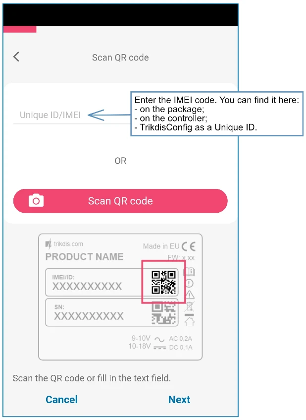

### Arming/disarming the system using *Protegus2* 

1.  To control the system, go to the *Protegus2*.

2.  In *Protegus2*, click on the “Armed” (or “Disarmed”) button. In the window that opens, enter the control panel user code.

3.  If the program does not respond to Your commands or the program window views are entirely different, go to  
    *Settings* -> *System configuration* -> System out of sync? and click the button “Sync”.

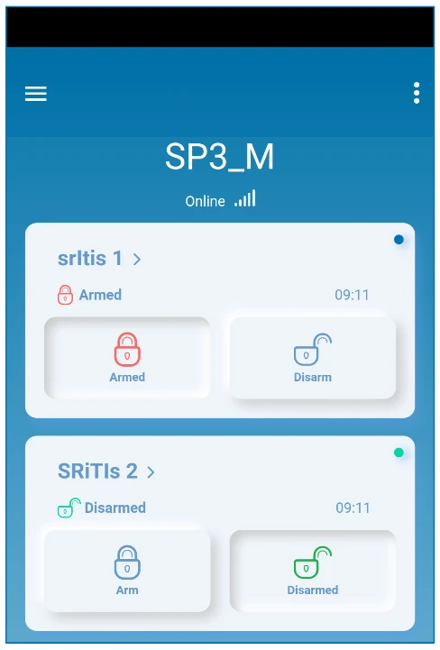

### Configuration and control via SMS messages 

The „FLEXi“ SP3 security control panel can be controlled and configured remotely using SMS messages.

Structue of SMS message: Command `[space]` Password `[space]` Data

The control panel’s default SMS password is **123456**. For safety reasons we recommend changing it to something only You know and not forgetting Your password!

#### SMS command list

| **Command** | **Data** | **Description** |
|----|----|----|
| *INFO* |  | Request information about the control panel. Object name, partition state, IMEI number, Cellular signal strength, firmware version and serial number will be included in the reply. E. g.: INFO 123456 |
| *RESET* |  | Reset the device. E.g.: RESET 123456 |
| *OUTPUTx* | *ON* | Turn on an output, “x” is the output number. E.g.: OUTPUT1 123456 ON |
|  | *OFF* | Turn off an output, “x” is the output number. E.g.: OUTPUT1 123456 OFF |
|  | *PULSE=ttt* | Turn on an output for a specified time - “x” is the output OUT number and “ttt” is a three-digit number that specifies pulse time in seconds. / E.g.: OUTPUT1 123456 PULSE=002 |
| *PSW* | *New password* | Change password. E.g.: PSW 123456 654123 |
| *TIME* | *YYYY/MM/DD,12:00:00* | Set date and time. E.g.: TIME 123456 2025/05/09,10:02:00 |
| *TXTA* | *Object name* | Specify object name. E.g.: TXTA 123456 Namas |
| *RDR* | *PhoneNR#SMStext* | Forwards SMS messages to the specified number. The phone number must start with a "+" symbol and the international country code. / E.g.: RDR 123456 +37061234567#forwarded text |
| *ASKI* |  | Send SMS message with statuses of inputs IN. E.g.: ASKI 123456 |
| *ASKO* |  | Send SMS message with statuses of outputs OUT. E.g.: ASKO 123456 |
| *ASKA* |  | Send SMS message with statuses of areas. E.g.: ASKA 123456 |
| *ASKT* |  | Send SMS message with values of all temperature sensors. / E.g.: ASKT 123456 |
| *DISARM* | *SYS:x* | Disarm the alarm, “x” is the partition number (1-8). E.g.: DISARM 123456 SYS:1 |
| *ARM* | *SYS:x* | Arm the alarm, “x” is the partition number (1-8). E.g.: ARM 123456 SYS:1 |
| *STAY* | *SYS:x* | Arm area “x” in Stay mode, “x” is the partition number (1-8). / E.g.: STAY 123456 SYS:1 |
| *SLEEP* | *SYS:x* | Arm area “x” in Sleep mode, “x” is the partition number (1-8). / E.g.: SLEEP 123456 SYS:1 |
| *FRS* |  | Resets the fire sensor’s output, if the output OUT is assigned the function “Fire sensor reset”. E.g.: FRS 123456 |
| *SETN* | *PhoneX=PhoneNR#Name#email* | Add a phone number, username and assign it to user “x”. “x” is the phone number’s line on the list. The phone number must start with a "+" symbol and international country code. The phone number and username must be separated by a \# symbol. / E.g.: SETN 123456 PHONE5=+37061234567#JOHN#john@peter.com |
|  | *PhoneX=DEL* | Delete phone number and username from the list. / E.g.: SETN 123456 PHONE5=DEL |
| *UUSD* | *\*Uusd code#* | Sends a UUSD code to the operator. E.g.: ***UUSD 123456 \*245#*** |
| *CONNECT* | *Protegus=ON* | Connect to Protegus cloud service. E.g.: CONNECT 123456 PROTEGUS=ON |
|  | *Protegus=OFF* | Disconnect from Protegus cloud service. E.g.: CONNECT 123456 PROTEGUS=OFF |
|  | *Code=123456* | Protegus cloud service code. E.g.: CONNECT 123456 CODE=123456 |
|  | *IP=0.0.0.0:8000* | Specify the main server’s connection channel’s TCP IP and Port. / E.g.: CONNECT 123456 IP=0.0.0.0:8000 |
|  | *IP=0* | For turning off the main channel. E.g.: CONNECT 123456 IP=0 |
|  | *ENC=123456* | TRK encryption key. E.g.: CONNECT 123456 ENC=123456 |
|  | *APN=Internet* | APN name. E.g.: CONNECT 123456 APN=INTERNET |
|  | *USER=user* | APN user. E.g.: CONNECT 123456 USER=User |
|  | *PSW=password* | APN passwod. E.g.: CONNECT 123456 PSW=Password |

### Control via phone call 

!!! note
    The system administrator can control the „FLEXi" SP3 by SMS
    messages and phone calls. / If you want to allow others to control the
    system using phone calls, enter their identification data using
    TrikdisConfig software or SMS commands. / **<u>Control via phone
    call does not work with control panels *SP3_хх7х*. Control panel
    *SP3_12xx* does not have a voice message with firmware 1.14 and
    higher.</u>**
**„FLEXi“ SP3 phone call control commands**

Controlling outputs OUT and alarm system partitions using phone calls:

1.  If the user is assigned the right to control outputs OUT and the output OUT is assigned the type “Remote control” (using TrikdisConfig), or the security system „FLEXi“ SP3 is partitioned into 1 or more areas: call the phone number of the „FLEXi“ SP3’s SIM card***. The „FLEXi“ SP3*** will answer the call and you can dial commands using the phone’s numeric keypad (see table below).

#### Mobile phone keypad command list

| **Keypad buttons** | **Function** | **Description** |
|----|----|----|
| *[1][area no][#]* | Arm selected alarm system area | E.g. (arm area 2): 12# |
| *[2][ area no][#]* | Disarm selected alarm system area | E.g. (disarm area 2): 22# |
| *[3][output no][#][stay no]* | Control selected output OUT | Controls a specified output OUT. / State: / *[0]* – output turned off; / *[1]* – output turned on; / *[2]* – turned off for pulse time; / *[3]* – turned on for pulse time; / (pulse time is specified using TrikdisConfig software, in the “PGM” window) / E.g. (set output 1OUT to “on” state): 31#1 / E.g. (set output 2OUT to “on” state for **Pulse time** specified in the TrikdisConfig “PGM” table): 32#3 |
| *[4][#][recording number][#]* | Start recording of selected sound file | E.g. (start voice recording 1): 4#1# |
| *[5]* | Listen (1-5) to the voice recording just made | E.g.: ***5*** |
| *[6]* | Save the voice recording | E.g.: ***6*** |

An audio signal accompanies the beginning and end of the audio file recording. Audio file recording time 15 sec. An audio signal accompanies the end of audio playback. Recording is complete when you hear a beep. Other actions can only be taken when the beep is heard.

## Setting parameters using TrikdisConfig software 

1.  Download the configuration software TrikdisConfig from [www.trikdis.com/](http://www.trikdis.com/lt) (enter “TrikdisConfig” in the search field) and install it.

2.  Connect the „FLEXi“ SP3 to a computer using a USB Mini-B cable.

    **Note:** If you connect the „FLEXi“ SP3 to a computer using a USB cable while it is powered on and operating, the „FLEXi“ SP3 will stop performing its control panel functions and will switch to programming mode.

3.  Launch the configuration software TrikdisConfig. The program will automatically recognize the connected device and will automatically open the „FLEXi“ SP3 configuration window.

4.  Click **Read [F4]** to see current „FLEXi“ SP3 parameters. If a pop-up window appears, enter the *administrator* or *installer* code.

### Description of TrikdisConfig status bar 

When the „FLEXI“ SP3 is connected, TrikdisConfig will show information about the connected device in the status bar.

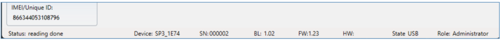

| **Name** | **Description** |
|----|----|
| IMEI/​Unique ID | IMEI number of the device |
| Status | Operational status |
| Device | Device type (must show SP3_xxxx) |
| SN | Device serial number |
| BL | Bootloader version |
| FW | Device firmware version |
| HW | Device hardware version |
| State | Type of connection with the program (USB or remote) |
| Role | Shows the access level (shown after entering an access code) |

When the **Read [F4]** button is clicked, the program will read and display the settings currently stored inside the „FLEXi“ SP3. With TrikdisConfig, alter the desired settings according to the program window descriptions given below.

### “System Options” window 

**“System general” tab**

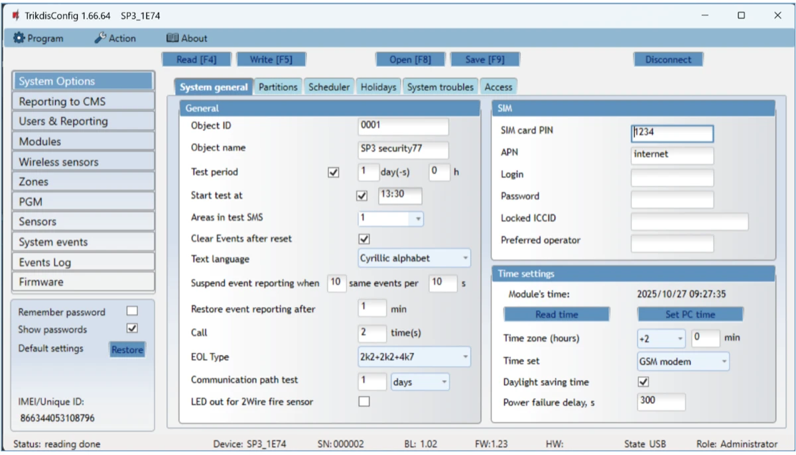

**Settings group “General”**

- If reports will be sent to CMS, enter the **Object ID** (4 symbol hexadecimal number, 0-9, A-F. **Do not use FFFE, FFFF Object ID.**) given by the CMS.

- **Object name** – will be included in reports sent via SMS messages (up to 20 symbols, letters and numbers can be used).

- **Test period** – if the box is ticked, periodic test reports will be sent every set period, unless **Start test at** is ticked and a time is set.

- **Start test at** – tick the box and specify a time when test reports should be sent.

- **Areas in test SMS** – the current protection modes of the specified areas will be included into the periodic test report.

- **Clear Events after reset** – if the box is ticked, all unsent event reports in buffer memory will be deleted if the control panel is reset.

- **Text language** – specific symbols of the selected language will be used in SMS messages.

- It is possible to **Suspend event reporting when ...** a number of **same events per ... s** happen**.**

- **Restore event reporting after** – set the time after which suspending of event reporting will be cancelled. The time can be anywhere from 0 to 999 minutes.

- **Call** – when an event occurs, the „FLEXi“ SP3 will call user(-s) as many times as is set. If the call is declined or answered, the „FLEXi“ SP3 will stop calling. Duration of a call is 20 seconds.

- **EOL Type** – specify the nominals of the resistors connected to the sensors (EOL – End Of Line. RT + R1 + R2. Resistor RT - tamper; resistor R1 - sensor No 1; resistor R2 - sensor No 2).

- **Communication path test** – specify the time interval after which the control panel will check the Backup communication channels by sending messages to the CMS. After sending the messages on the Backup communication channels, the control panel will return to the Primary communication channel.

- **LED out as 2Wire fire** - check the box when you connect the two-wire fire detector to the LED output.

**Settings group “SIM”**

- Enter the **SIM card PIN.** If the PIN code is disabled for the specific SIM card, do not change the the default code.

  - **APN** – network service provider’s mobile internet access point name. You must enter the APN if event messages will have to be sent to Protegus cloud or to the CMS using mobile internet.
- If required by the GPRS network service provider, enter the APN username and password in the fields **Login** and **Password**.

- **Locked ICCID** - enter the ICCID number of the SIM card if you want the control panel to work only with this SIM card.

- **Preferred operator** – after entering the mobile network operator code, the communicator will connect only to the network of the selected operator. The mobile operator code consists of MCC and MNS codes.

**Settings group “Time settings”**

You can set the time by clicking the **Set PC time** button. If **Disabled** is chosen in the **Time synchronization** field, the computer’s time will be set for the control panel. If a modem or a server is chosen in the **Time synchronization** field, the control panel will synchronize its time according to that modem or server.

- **Time zone (Hours)** – specify your country’s time zone. For example, if the control panel will be installed in Lithuania, enter **+3**.

- **Time set** – specify a server to synchronize the ***„FLEXi“ SP3**’s* internal clock with. Synchronization occurs after the control panel is powered on.

- **Daylight saving time** – if you check the box, the control panel's internal clock will be automatically switched to summer or winter time.

- **AC failure delay** - in the event of a power failure in the main power supply, a power failure notification will be sent after the specified time delay. When the supply voltage is restored, a notification of the supply voltage recovery will be sent after the specified time delay.

**“Partitions” tab**

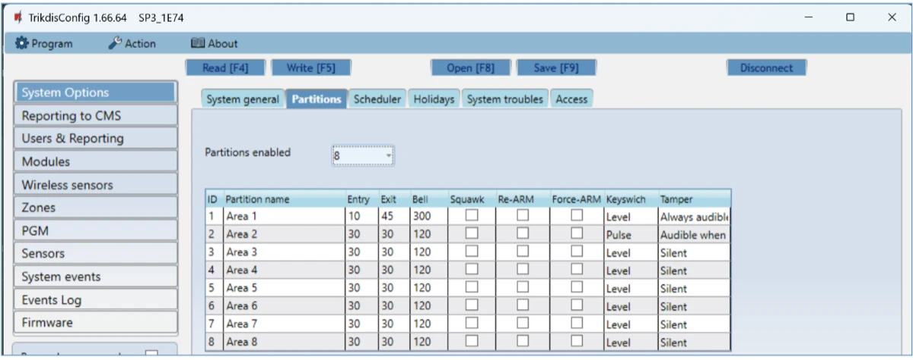

- **Partitions enabled** – enter the number of independent parts that the alarm system will be divided into.

- **Partition name** – enter the partition name.

- **Entry** – time for entering through a *Delay* zone, walking to a keypad and disarming the alarm system. Time can be anywhere between 0 and 999 seconds.

- **Exit** – time for leaving the premises through a *Delay* zone after entering the alarm system arm code using a keypad. Time can be anywhere between 0 and 999 seconds. If the alarm system is armed remotely, e.g. via Protegus2 mobile app, the system will not count **Exit time** and will arm immediately.

- **Bell** – duration of siren operation once the alarm is triggered. Time can be anywhere between 0 and 999 seconds.

- **Squawk** - the siren will make a short sound once when the alarm is armed and twice when it is disarmed.

- **Re-ARM** – tick this box if you want the system to automatically re-arm the alarm system after the system was disarmed remotely, but the *Delay* zone was not violated during the set entry time.

- **Force-ARM** – tick this box to allow to switch the system to protection (ARM) mode even if *Stay* zones are violated, as long as the *Entry* zone is not violated.

- **Keyswitch** – choose in what way – *Pulse* or *Level* – a Keyswitch zone must be triggered for the system to enable or disable premise protection*.*

- **Tamper** – choose the reaction type (Silent, Audible when armed, Always Audible) when the system detects a sensor tamper event. “Silent” – recipients will receive event reports, but the siren will not switch on; „Audible when protected“ - recipients will receive event reports, but the siren will switch on only if the tamper event happens when the system is armed; „Always audible“ - recipients will receive event reports and the siren will will switch on even when the alarm system is disarmed.

**“Scheduler” tab**

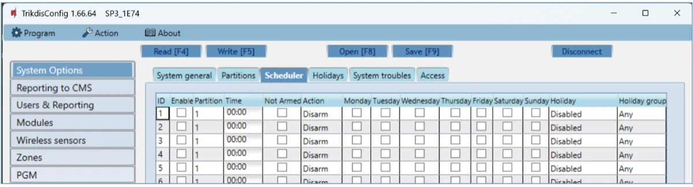

In this table, you can arrange scenarios for automatically arming and disarming the security system by choosing different days of the week and including public holidays.

- **Enable** – enable the schedule for when the system will automatically arm and disarm.

- **Partition** – specify the partition affected by the specific schedule.

- **Time** – set the time when the specific action must be done.

- **Not Armed** - check the box and the schedule action will be performed only if the control panel is not armed in AWAY mode.

- **Action** – set the protection mode (Disarm/Arm/Sleep/Stay) that the system will switch to automatically at the specified time.

- **Monday, ... Sunday** – tick the days of the week that the set protection mode and time will be valid on.

- **Holiday** – set how the schedule behaves during holidays (Disabled/Ignore on holidays/Additional when holidays/Only holidays). Disabled – there are no holidays. Ignore on holidays – do not carry out the schedule during holidays. Additional when holidays – perform an additional action during holidays. Only holidays – carry out the schedule during holidays.

- **Holiday group** – specify a holiday group (Any/1/2/3/4) that the schedule will consider to be holidays. If “Any” is chosen, the schedule will operate in holiday mode during any active holiday.

**“Holidays” tab**

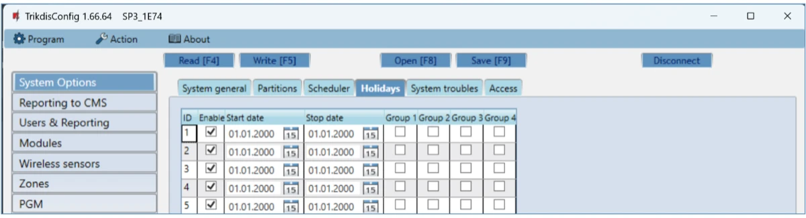

- **Enable** – Tick this box to enable the holiday.

- **Start date** – set the start date of the holiday.

- **Stop date** – set the end date of the holiday. If the holiday is only one day long, this date should match the **Start date**.

- **Group 1, Group 2, Group 3, Group 4** – combine holidays into groups.

**“System troubles” tab**

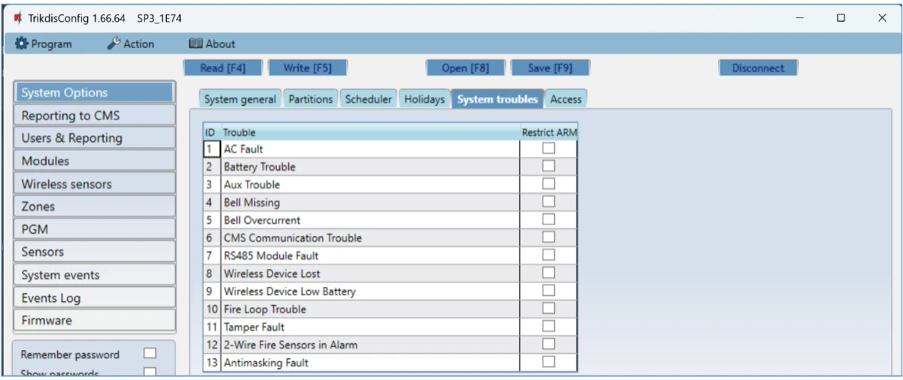

If at least one control panel internal fault field is checked, then the control panel will not be able to be Armed if this fault is present.

**“Access” tab**

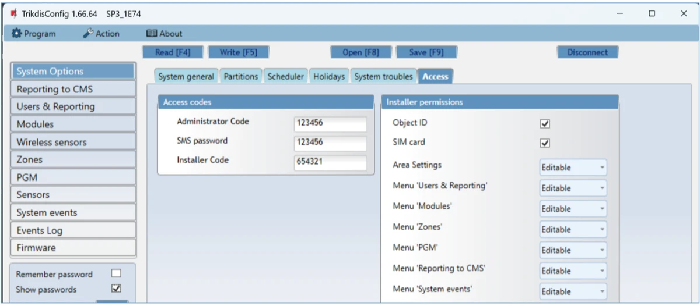

**Settings group “Access codes”**

- **Administrator Code** – *(default code - 123456)* gives full access to configuration (the code must be 6 symbols long; it can consist of latin letters and/or numbers).

- **SMS password** – *(default password - 123456)* is used for controlling the system safely using SMS messages. For safety purposes, change it into a 6-symbol password only You know.

- **Installer Code** – (*default code - 654321*) gives installers access to configuring the system. For safety purposes, change it into a 6-symbol code only You know.

!!! note
    If the default *administrator code* is set (123456), after pressing
    **Read [F4]** the program will immediately show the current
    operational parameters of the device without asking for the code.
**Settings group “Installer permissions”**

- Specifies the installer’s permissions.

### “Reporting to CMS” window 

**“Reporting” tab**

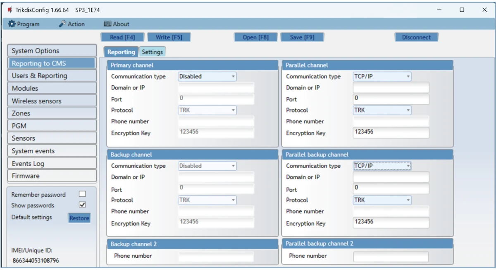

The control panel sends events to the monitoring station via cellular internet (IP) or with SMS messages.

Events can be sent over several channels of communication. The primary and parallel communication channels can operate simultaneously, this way the control panel can send events to two receivers at the same time. Backup channels can be assigned for both primary and parallel channels, which will be used when the connection via the primary or parallel channel is interrupted.

Communication is encoded and password protected. A TRIKDIS receiver is required for receiving and sending event information to the monitoring programs:

• For connection over IP - software receiver IPcom Windows/Linux, hardware IP/SMS receiver RL14 or multichannel receiver RM14.

• To receive SMS messages - hardware IP/SMS receiver RL14, multichannel receiver RM14 or SMS receiver GM14.

SMS communication is particularly useful as a backup channel, because it works even when there is no mobile internet connection. We do not recommend SMS as a primary channel.

**Settings groups “Primary channel” and “Backup channel”**

- **Communication type** – choose a protocol for communicating with the receiver (TCP/IP, UDP/IP, SMS).

- **Domain or IP** - enter the receiver’s domain or IP address.

- **Port** – enter the receiver’s network port number.

- **Protocol** – **TRK** for data transfer using Trikdis receivers, **SIA DC-09** for IP receivers capable of receiving event reports transmitted in SIA DC-09 protocols.

- **Phone number** – (only for SMS messages) enter the phone number of a TRIKDIS SMS receiver. The telephone number must start with the international country code (e.g. 370xxxxxxxx).

- **Encryption key** – 6-digit encryption key that must match the encryption key of the CMS receiver.

If parameters are set for the parallel channel, reports will be sent using both channels simultaneously. Both channels cannot be configured for the same receiver. When the parallel channel is enabled, events can be sent simultaneously to two receivers (e.g., local and centralized monitoring stations).

**“Backup channel 2” and “Parallel backup channel 2” SMS reporting number**

Backup SMS messages are sent when they cannot be transmitted via the primary, parallel and backup channels. It is especially useful because it works even when there is no IP connection in the mobile operator network.

This channel is operational only when IP mode is set for the first channel and its backup channel.

SMS notifications will be sent to the Central Monitoring Station SMS receiver: 1) immediately after the first time when control panel starts operating; and 2) if the TCP / IP or UDP / IP connection is interrupted in the first channel and its backup channel.

- **Phone number** - enter the phone number for TRIKDIS CMS (Central Monitoring Station) SMS receiver. Phone number must begin with the country code (e.g., 370xxxxxxxx).

**“Settings” tab**

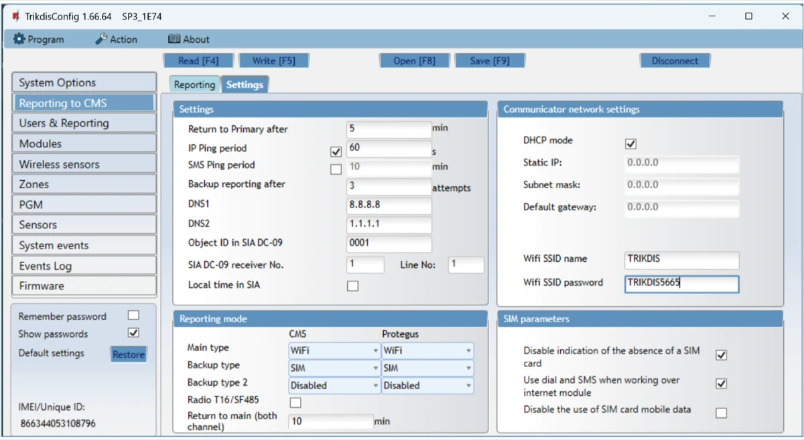

**Settings group “Settings”**

- **Return to primary after** – time period after which the „FLEXi“ SP3 will attempt to regain connection using the *primary* channel, in minutes.

- **IP Ping period** – period for sending PING signals for checking connectivity on the GPRS channel, in seconds. To enable these signals, tick the box.

- **SMS Ping period** – period for sending PING signals for checking connectivity on the SMS channel, in minutes. To enable these signals, tick the box.

- **Backup reporting after** – enter how many failed attempts to send messages using the *primary* channel should take place before switching to the *backup* channel.

- **DNS1, DNS2** – DNS server addresses.

- **Object ID in SIA DC-09** –specify the object number.

- **SIA DC-09 receiver No.** – specify the receiver number.

- **SIA DC-09 line No.** – specify the line number.

- **Local time in SIA** - check the box so that the messages sent to the CMS (central monitoring station) will indicate the time set in the module.

!!! warning "Important"
    Regardless of IP settings, make sure the DNS addresses match those
    supported by your ISP.
**Settings group “Reporting mode”**

For setting parameters on how the control panel will communicate with the CMS channels and with Protegus2. The connection types are specified in order. If the control panel fails to connect using the **Main type** connection , it switches to the **Backup type**, and so on. If the backup connection type was successful in transmitting the message to the CMS, then the **Return to main** connection type will be attempted after the specified time interval.

- **Main type** – select a connection type (SIM, WiFi, LAN(E485)) with the CMS receiver and Protegus2.

- **Backup type** – select a connection type (SIM, WiFi, LAN(E485)) with the CMS receiver and Protegus2.

- **Backup type 2** – select a connection type (SIM, WiFi, LAN(E485)) with the CMS receiver and Protegus2.

- **Radio T16 (SF485)** – tick this box, when the T16 transmitter will be used for transmitting information. The T16 transmitter operates as a backup connectivity channel if at least one of the other connection methods (SIM, WiFi, LAN(E485)) is used. If there are no other connection methods, it is the main one. The T16 can only be used to send reports to the CMS.
- **Return to main (both channel)** – time period after which the „FLEXi“ SP3 will attempt to regain connection using the *primary* channel, if it was running a backup channel, min.

**Settings group “Communicator network settings”**

- **DHCP mode** – mode for registering on the WiFi network (manual or automatic). Tick the box and the „FLEXi“ SP3 control panel will automatically read the network settings (subnet mask, gateway) and will automatically be assigned an IP address (automatic registration mode).

- **Static IP** – static IP address for manual registration mode.

- **Subnet mask** – subnet mask for manual registration mode.

- **Default gateway** – gateway for manual registration mode.

- **WiFi SSID name** – name of the WiFi network (that the „FLEXi“ SP3 control panel will connect to).

- **WiFi SSID password** – WiFi network password.

**Settings group “SIM parameters”**

- **Disable indication of the absence of a SIM card** – when the box is ticked, the „FLEXi“ SP3 control panel will not display an indication that there is no SIM card inserted.

- **Use dial and SMS when the working over internet module** – ticking this box will enable controlling the panel using phone calls and SMS messages. If the box is not ticked and there is a WiFi network available, then SMS and phone calls are not used. If the box is not ticked and there is no WiFi network, the „FLEXi“ SP3 can still be controlled using phone calls and SMS messages. The „FLEXi“ SP3 will send SMS messages to the user.

- **Disable the use of SIM card mobile data** – ticking the box will disable the usage of the SIM card’s mobile data. Data will only be sent using WiFi. If a WiFi network is temporarily unavailable, the „FLEXi“ SP3 will store data in memory. When the WiFi network is restored, the „FLEXi“ SP3 will send data using WiFi.

### “Users & Reporting” window 

**“Users” tab**

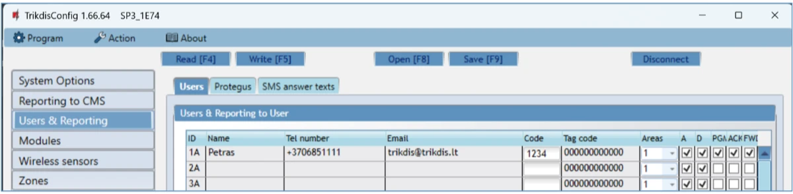

**Settings group “Users & Reporting to User”**

- **Name** – name of the user. These names will be used in event SMS messages.

- **Tel number** – the user’s telephone number that will be used to control the alarm system remotely and will receive SMS messages. The numbers must start with the international country code. The first 8 telephone numbers will receive reports using messages and phone calls.

- **Email** – enter the user’s email, so that the user would be invited to Protegus2 to control the system.

- **Code** – the alarm system arm and disarm code assigned to the user.

- **Tag code** – enter the identification number of an RFID card, RFID key fob, or iButton electronic key.

- **Areas** – the areas that the specific user can control.

- **A** – tick the box if you want to allow the user to ARM the alarm.

- **D** – tick the box if you want to allow the user to DISARM the alarm.

- **PGM** – if the box is ticked, the user can call the „FLEXi“ SP3 and turn on or off desired outputs OUT using DTMF tones.

- **ACK** – if the box Is ticked, the „FLEXi“ SP3 will send the user SMS messages with **SMS answer text** about the completion of received commands.

- **FWD** – if the box is ticked, SMS messages received from non-users of the system (e.g. SIM card account balance, random promotional messages, etc.) will be forwarded to the user.

#### Linking RFID key fobs (cards) 

You can add RFID key fobs (cards) by entering their ID numbers into the Tag code field in *TrikdisConfig*. Click the Write [F5] button to write the RFID key fob (card) list into the control panel.

--8<-- "en/faq/index.md:sp3-wiegand-reader-door-output"

#### Linking electronic (iButton) keys 

Linking electronic keys using the TM17 reader.

1.  If the **Tag code** list is empty, the first added key should be written to the first line of the list and becomes the **Master key.**

2.  To turn on contact key linking mode, hold the **Master key** against the “eye” of the key reader for at least 10 seconds. When linking mode is on, the TM17 key reader’s LED indicator *State* will start to blink in green.

3.  To link user keys, hold them against the “eye” of the key reader one by one. 3 sound signals from the reader will indicate that the key has been linked to the system.

4.  When you finish linking the user electronic (*iButton*) keys, hold the **Master key** against the key reader again to disable linking mode. When the linking mode is turned off, the *State* LED indicator of the TM17 key reader will stop blinking*.*

5.  To delete all keys (including the master key), hold the **Master key** against the reader for at least 20 seconds.

Linking electronic keys using the CZ-Dallas reader.

1.  If the **Tag code** list is empty, the first added key should be written to the first line of the list and becomes the **Master key.**

2.  To turn on contact key linking mode, hold the **Master key** against the “eye” of the key reader for at least 10 seconds.

3.  To link user keys, hold them against the „eye” of the key reader one by one.

4.  When you finish linking the user electronic (*iButton*) keys, hold the **Master key** against the key reader again to disable linking mode.

5.  To delete all keys (including the master key), hold the **Master key** against the reader for at least 20 seconds.

!!! warning "Important"
    The purpose of the Master key is to link other electronic keys. If you
    use the Master key for ARM/DISARM commands, their execution will have a
    delay.
**“Protegus” tab**

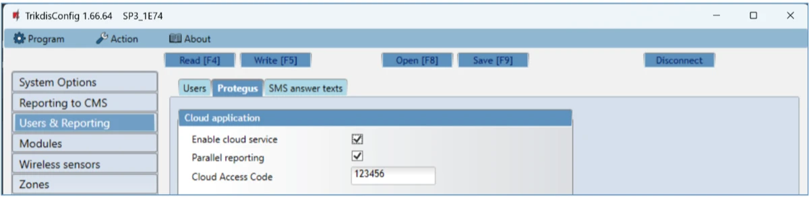

**Settings group “Cloud application”**

- **Enable cloud service** – enable Protegus cloud service, the „FLEXi“ SP3 will be able to exchange data with Protegus2 app and it will be possible to configure the control panel remotely using TrikdisConfig.

- **Parallel reporting** – check the box and messages will be sent simultaneously via the primary channel (to CMS) and to Protegus2.

- **Cloud access code** – 6-digit code for connecting with Protegus2 (default - 123456).

**“SMS answer texts” tab**

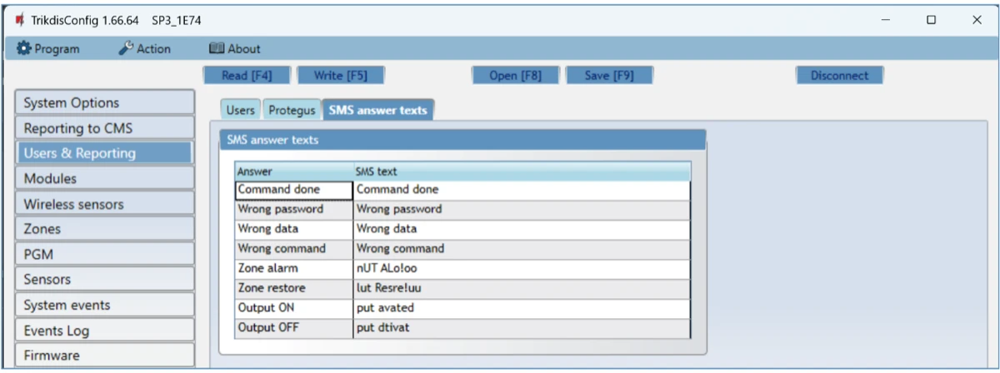

**Settings group “SMS answer texts”**

- The text for answers to commands sent using SMS messages can be customized in the column **SMS text**.

### “Modules” window

**“Keypads” tab**

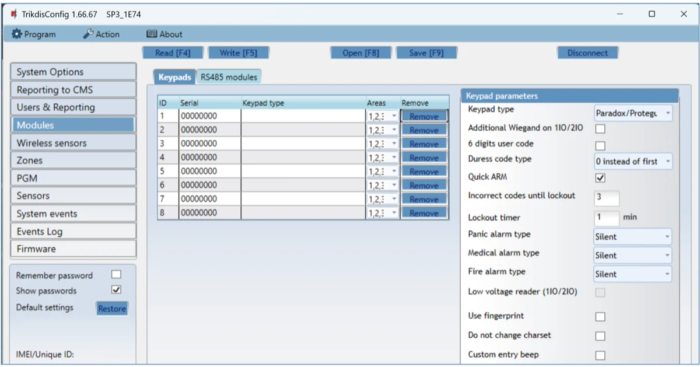

- **Serial** – the keypad’s serial number automatically detected by the control panel. To delete a keypad, enter zeros or click on the **Remove** button.

- **Keypad type** – keypad type, automatically detected by the control panel.

- **Areas** - you can specify which areas the keypad will be able to control (only valid for the following keypads: FLEXi SK LCD, FLEXi SK LED, SK LCD Button, SK LED Button).

- **Remove** – pressing the button will remove the keypad from the list.

**Settings group “Keypad parameters”**

- **Keypad type** – specify the keypad type (Crow CR16, Paradox LED, Wiegand reader) connected to the control panel (GRN, YEL terminals).

- **Additional Wiegand on 1IO/2IO** – tick the box if an additional RFID card reader will be connected. An additional reader can be connected to the terminals IO1 and IO2, which cannot be used as inputs or outputs in this case.

- **6 digits user code** - check this box, and the user code entered from the keypad will be 6 digits long. If the current code was 4 digits long, the first two digits of the current code will be added to the user code (1234 becomes 123412). All 4-digit user codes will be changed according to the described method.

- **Duress code type** – choose a duress code type. If you are forced to arm or disarm the alarm system and enter the duress code, the system will arm or disarm the system and will immediately send a silent warning to the CMS (central monitoring station).

- **Quick ARM** – the buttons ARM, STAY, SLEEP can be used to quickly arm the security system without entering a code.

- **Incorrect codes until lockout** – enter the number of incorrect codes allowed before blocking the keypad.

- **Lockout timer** – enter the time for how long the keypad will be blocked.

- **Panic alarm type** – specify what the alarm will sound (**Audible** / **Silent** / **Disabled**) if the **Panic alarm** function keys on the keypad are pressed. When an **Audible** alarm is set, alarm messages are sent to the Protegus2 and the CMS (central monitoring station) and the control panel will sound an audible alarm on the keypad and turn on the siren. When the **Silent** alarm is set, alarm messages are sent to the Protegus2 and the CMS, and the control panel will turn off the audible alarms. If set to Disabled, no alarm message is sent to Protegus2 and CMS.

- **Medical alarm type** – specify what the alarm will sound (**Audible** / **Silent** / **Disabled**) if the **Medical alarm** function keys on the keypad are pressed. When the **Audible** alarm is set, alarm messages are sent to the Protegus2 and the CMS, and the control panel will sound an audible alarm on the keypad and turn on the siren. When the **Silent** alarm is set, alarm messages are sent to the Protegus2 and the CMS, and the control panel will turn off the audible alarms. If set to **Disabled** alarm messages are not sent to Protegus2 and CMS.

- **Fire alarm type** - specify what the alarm will sound (**Audible** / **Silent** / **Disabled**) if the **Fire alarm** function keys on the keypad are pressed. When the **Audible** alarm is set, alarm messages are sent to the Protegus2 and the CMS, and the control panel will sound an audible alarm on the keypad and turn on the siren. When the **Silent** alarm is set, alarm messages are sent to the Protegu2s and the CMS, and the control panel will turn off the audible alarms. If set to **Disabled** alarm messages are not sent to Protegus2 and CMS.

- **Low voltage reader (1IO/2IO)** – check the box to change the communication protocol between the control panel and the reader if the connected RFID reader is not working.

- **Use fingerprint** – check the box if a fingerprint reader with Wiegand 26/34 protocol will be connected.

- **Do not change charset** - check the box if you do not want to change the text encoding of zone and partition names for the SK-LCD TouchPad keypad.

- **Custom entry beep** - check the box and the entry delay beep on the keypad will be intermittent.

**“RS485 modules” tab**

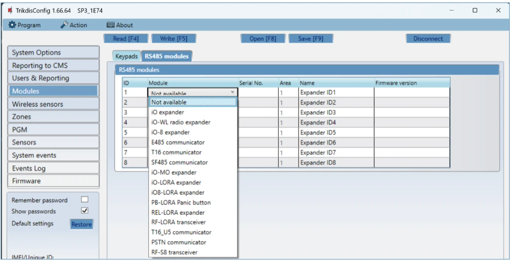

**Settings group “RS485 modules”**

- **ID** – module’s number on the list.

- **Module** – choose the module being used (modules iO, iO-WL, TM17, iO-8, RF-SH, E485 T16, SF485, iO-MO, iO-LORA, iO8-LORA, PB-LORA, REL-LORA, RF-LORA, RF-HW, RF-S8) from the module list.

- **Serial No.** – mandatory 6-digit number that is given on stickers on the module’s casing and packaging.

- **Area** – assign the module to an area (the TM17 will display the status of the area it is assigned to, and also the states of the zones assigned to the same area).

- **Name** – you can give the module a name.

- **Firmware version** – when the „FLEXi“ SP3 finds the connected module, the version of its firmware will be shown.

**“E485 settings” tab**

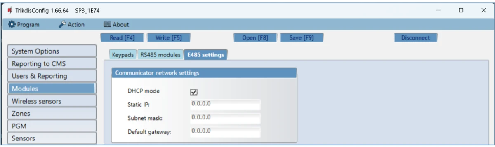

- **DHCP mode** – mode for registering on the LAN network (manual or automatic). Tick the box and the „FLEXi“ SP3_3E control panel will automatically read the network settings (subnet mask, gateway) and will automatically be assigned an IP address (automatic registration mode).

- **Static IP** – static IP address for manual registration mode.

- **Subnet mask** – subnet mask for manual registration mode.

- **Default gateway** – gateway for manual registration mode.

### “Wireless” window 

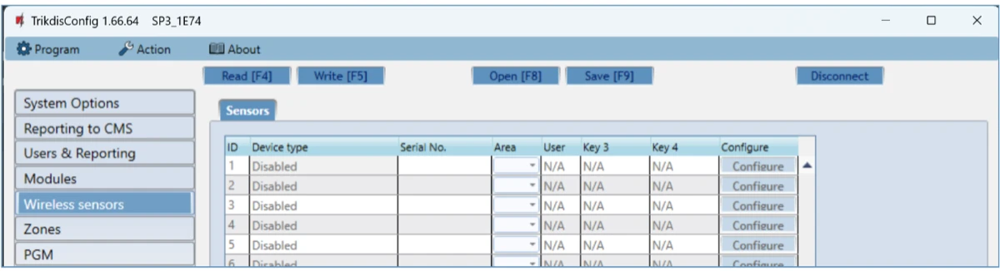

“FLEXI” SP3, with a connected RF-LORA module, can use wireless sensors, sirens, and key fobs from the company “Maximum”.

#### Registration of the RF-LORA receiver of wireless sensors to the FLEXi SP3 control panel 

The „FLEXi“ SP3 control panel is equipped with firmware revision 4 SP3_xxx**4**\_0121.fw (firmware version 1.21 or higher), which will ensure the operation of “Maximum” wireless sensors. The RF-LORA wireless transceiver must be connected to the control panel.

1.  Switch on the power supply to the “FLEXi” SP3 control panel.

2.  Wait 1 minute.

3.  Launch ***TrikdisConfig**.*

4.  Connect the “FLEXi” SP3 to a computer using a USB Mini-B cable.

5.  The list of modules should show "**RF-LORA transceiver**", as well as the serial number and firmware version. If you see the firmware version of the RF-LORA transceiver, you can skip steps 6-13.

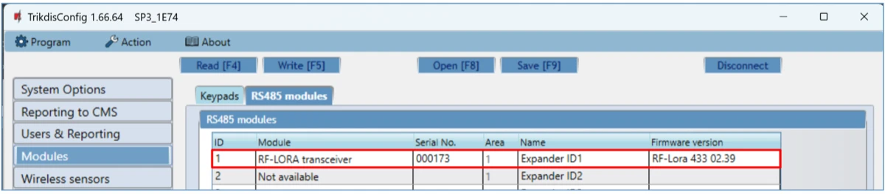

6. If the list does not indicate "**RF-LORA transceiver**", then you must select "**RF-LORA transceiver**" from the list.

2.  In the “**Serial No.**” field, enter the serial number of the RF-LORA module. This serial number can be found on the device and the packaging sticker.

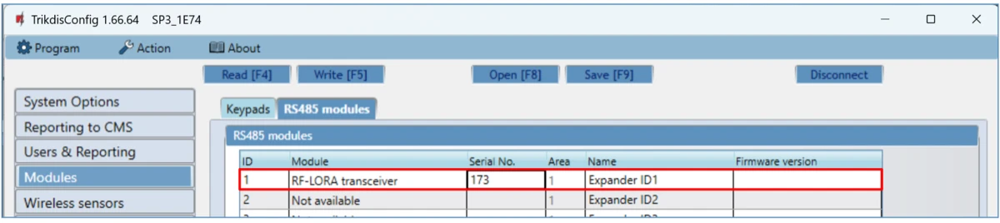

3. Click **Write [F5]**.

2.  Disconnect the USB Mini-B cable.

3.  Wait 1 minute for the “FLEXi” SP3 and RF-LORA to link together.

4.  Connect a USB Mini-B cable to the “FLEXi” SP3.

5.  Click **Read [F4]**.

6.  The firmware version of the RF-LORA will appear in the “**Modules**” window.

14. The RF-LORA module is now linked to the “FLEXi” SP3.

15. Disconnect the USB Mini-B cable.

16. Click “**Disconnect**”.

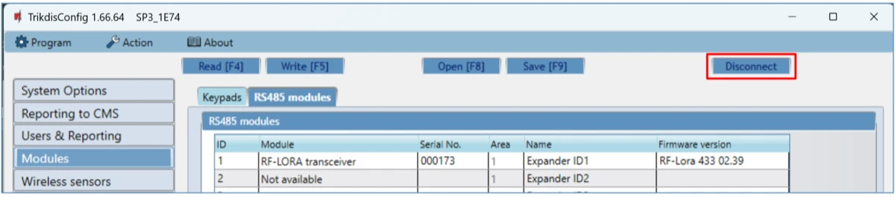

17. Wait 1 minute.

#### Remote linking of wireless sensors 

Using TrikdisConfig, remotely connect to the “FLEXi” SP3 control panel.

!!! warning "Important"
    Remote configuration will only work when "FLEXi" SP3:

    1.  An activated SIM card must be inserted and the PIN code must be
        entered or disabled.

    2.  Mobile internet is activated on the SIM card.

    3.  Protegus cloud service must be enabled.

    4.  The power must be switched on ("**PWR**" LED must be green
        blinking).

    5.  Must be connected to network ("**NET**" LED must be green solid and
        yellow blinking).
In the “**Remote access**” section enter the control panel “**IMEI/Unique ID**” number. This number can be found on the device and the packaging sticker.

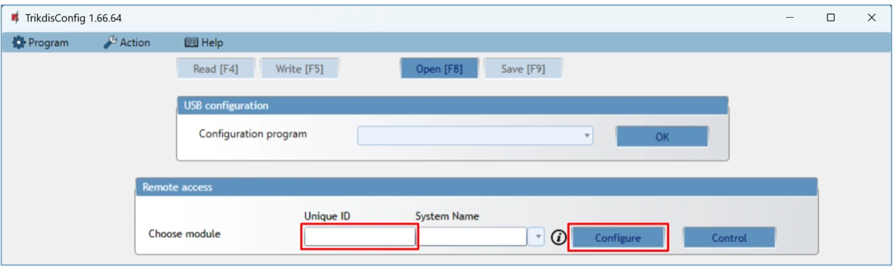

Click “**Configure**”.

In the newly opened window click **Read [F4]**. If required, enter the administrator or installer code.

Go to the “**Wireless sensors**” window.

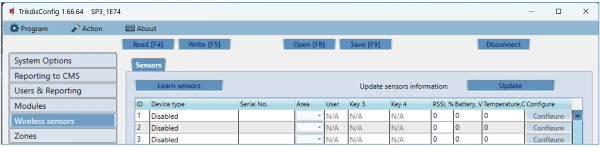

Click the “**Learn sensors**” button.

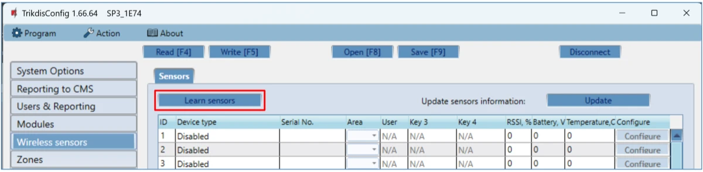

All wireless sensors can be linked simultaneously. Insert batteries into the wireless sensors (PIR, magnetic contact, flood detector, smoke detector, siren).

When enrolling sensors, the *RF-LORA* module must be at least 1 m from the sensors.

1.  The “**DATA/TROUBLE**” LED on the RF-LORA module will flash green/red.

2.  RF-LORA module - switches to learning mode. TrikdisConfig will open the sensor binding window.

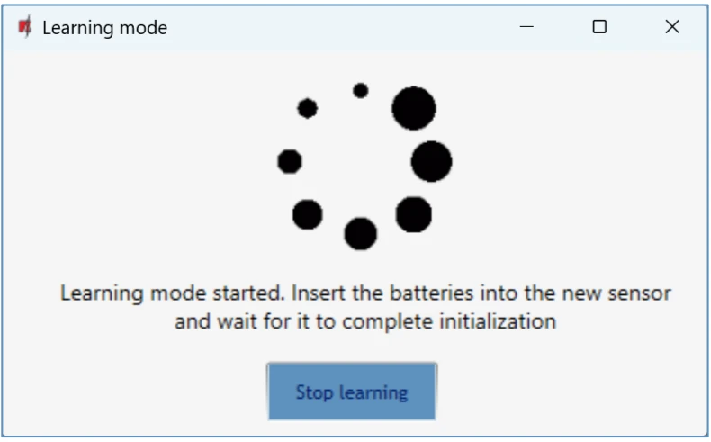

3. Press the "**TAMPER**" button on the sensor.

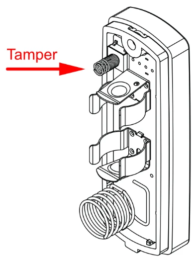

4. On the RF-LORA module, the “**DATA/TROUBLE**” LED will flash green for a short time (this indicates that the sensor is enrolled). After a few seconds, the “**DATA/TROUBLE**” indicator will start flashing green/red again.

2.  TrikdisConfig will open a new window in which you need to assign a “**Zone Number**” and “**Zone Definition**” to the wireless sensor.

3.  Click “**Save**”.

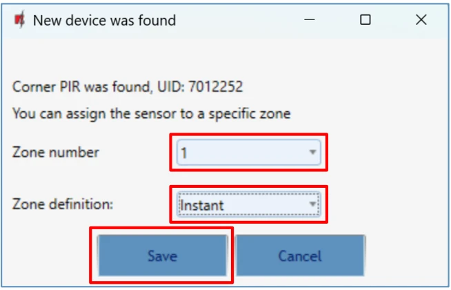

4. Wireless sensor is included in the list of sensors.

2.  If you need to add the next sensor, you need to press the “**TAMPER**” button on the sensor. And make the settings described above.

3.  Click “**Stop learning**” to complete the registration of wireless sensors.

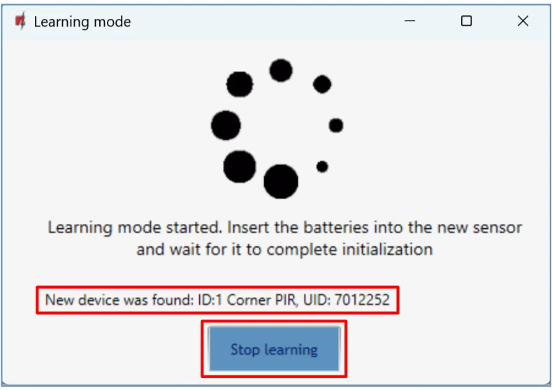

10. Click “**Yes**” for the sensors to be written to the “FLEXi” SP3 control panel or "**No**" if you want to adjust the parameters additionally.

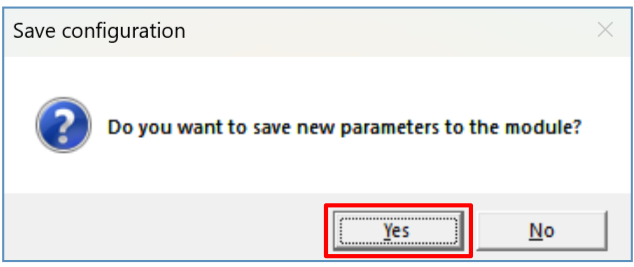

Wait a few minutes. Click **Read [F4].**

TrikdisConfig will display a list of registered wireless sensors in the “**Wireless sensors**” window. The “**Serial No.**” field will list the serial number.

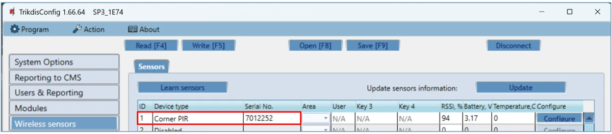

Check that the sensors are correctly assigned to the “**Zones”** and “**Areas**” of the control panel (“**Zones**” window).

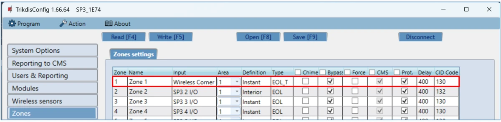

If you set zone **“Type”** EOL-T, then the sensor tamper monitoring mode will be enabled.

After making changes, press **Write [F5]**..

!!! note
    To delete wireless sensors from the "FLEXi" SP3's memory:
    
    1.  Launch ***TrikdisConfig**.*
    
    2.  Connect the „FLEXi" SP3 to a computer using a USB Mini-B cable
        or connect to the „FLEXi" SP3 remotely. Click the
        **Read [F4]** button.
    
    3.  In the TrikdisConfig window "**Wireless sensors**", in the
        column "**Device type**", select "**Disabled**" instead of the
        wireless sensor that you wish to delete and click **Write [F5]**.
        The wireless sensor is now removed from the "FLEXi"
        SP3's memory.
#### Linking wireless sensors without remote access 

All wireless sensors can be linked simultaneously. Insert batteries into the wireless sensors (PIR, magnetic contact, flood detector, smoke detector, siren). **When enrolling sensors, the *RF-LORA* module must be at least 1 m from the sensors.**

1.  Make sure that the RF-LORA transceiver is registered with the „FLEXi“ SP3 security panel.

2.  Switch on the power supply to the “FLEXi” SP3 control panel.

3.  Remove the cover from the RF-LORA transceiver.

4.  Press and hold the "**LEARN**" button on the RF-LORA module until the "**DATA/TROUBLE**" indicator starts flashing green/red.

5.  Release the "**LEARN**" button.

6.  The flashing "**DATA/TROUBLE**" indicator indicates that the RF-LORA is in the wireless device registration mode.
1.  Press the "TAMPER" button on the sensor.

2. On the RF-LORA module, the “**DATA/TROUBLE**” LED will flash green for a short time (this indicates that the sensor is enrolled).

2.  After a few seconds, the “**DATA/TROUBLE**” indicator will start flashing green/red again.

3.  If you need to add the next sensor, you need to press the “**TAMPER**” button on the sensor.

4.  To complete the registration of wireless sensors, press and hold the "**LEARN**" button until the "**DATA/TROUBLE**" indicator stops flashing green/red. Release the "**LEARN**" button. The RF-LORA transceiver has exited the registration mode.

5.  Connect a USB Mini-B cable to the “FLEXi” SP3.

6.  Launch TrikdisConfig. Press the **Read [F4]** button.

7.  TrikdisConfig window "**Wireless sensors**" will contain a list of registered wireless devices. In the field "**Serial No.**" 7- digit serial numbers will be written.

15. Check that the sensors are correctly assigned to the “**Zones”** and “**Areas**” of the control panel (“**Zones**” window).

16. After making changes, press **Write [F5]**.

17. Wireless sensors registered.

### “Zones” window 

**“Zones settings” tab**

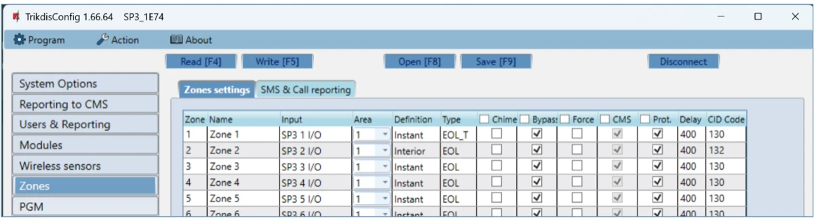

- **Zone No** – the zone’s number on the list.

- **Name** - enter the name of the zone.

- **Input** – you can select which „FLEXi“ SP3 or expander module input IN to assign to the zone.

- **Area** – assign the zone to an area.

- **Definition** – every zone can be assigned one of these zone functions:

  - **Delay** – for connecting a magnetic entrance door contact. You can set entry and exit times for this type of zone.

After the alarm is armed, the violation of the “Delay” zone is allowed within the exit time. If the zone is still violated when the time is up, outputs OUT “Siren” and “Flash” are turned on and alarm reports are sent.

When the alarm is armed, a violation of the “Delay” zone starts the entry time counter, during which the alarm must be disarmed. If the alarm is still not disarmed when the time is up, outputs OUT “Siren” and “Flash” are turned on and alarm reports are sent.

- **Interior** – for connecting a motion sensor to the entry door.

If the alarm system is armed and the “Interior” zone is triggered, output signals for “Siren” and “Flash” are turned on and a report about the triggering of the alarm system is sent.

If the alarm system is armed and the “Delay” zone is triggered first, the “Interior” zone can also be triggered during the set entry time. If the alarm is not disarmed during the set entry time, output signals for “Siren” and “Flash” are turned on and a report about the triggering of the alarm system is sent.

- **Interior Stay** – for connecting a motion sensor to the entry door.

If the alarm system is armed and the “Interior Stay” zone is violated, output signals for “Siren” and “Flash” are turned on and a report about the triggering of the alarm system is sent.

If the alarm system is armed and the “Delay” zone is triggered first, the “Interior Stay” zone can also be triggered during the set entry time. If the alarm is not disarmed during the set entry time, output signals for “Siren” and “Flash” are turned on and a report about the triggering of the alarm system is sent.

When the alarm system is armed in STAY mode, “Interior Stay” zones are not protected.

- **Instant** – for connecting motion sensors. If the “Instant” zone is violated when the alarm is armed, OUT outputs “Siren” and “Flash” are turned on and a message about the alarm being triggered is sent.

- **Instant Stay** – for connecting motion sensors. If an “Instant Stay” zone is violated when the alarm is armed, OUT outputs “Siren” and “Flash” are turned on and a message about the alarm being triggered is sent. When the alarm system is armed in STAY mode, “Instant Stay” zones are not protected.

- **Fire** – for connecting fire sensors. If this zone is violated, OUT outputs “Siren” and “Flash” are turned on immediately and an event report is sent.

  - **Keyswitch** – for connecting a keypad or other switch. If the switch triggers this zone the security alarm will be armed or disarmed. The alarm will be armed after the set **Exit time** passes.

  - **24_hour** – for connecting glass break and tamper detectors. If this zone is violated, OUT outputs “Siren” and “Flash” are turned on immediately and an event report is sent.

  - **Silent** – if the alarm is armed and this zone is violated, an event report will immediately be sent, but “Siren” and “Flash” output signals will not be generated.

  - **Silent 24h** – for connecting panic buttons. If this zone is violated, an event report will immediately be sent regardless of the state of the security system, but “Siren” and “Flash” output signals will not be formed.
- **Type** – choose the type of circuit connected to the zone input IN from a list: NC – normally closed; NO – normally open; EOL – with an end of line resistor; EOL_T – with an end of line resistor and tamper monitoring; ATZ – two zone normally closed circuit with end of line resistors, without tamper monitoring function (to use this type, choose the second ATZ zone in the input list); ATZ_T – two zone normally closed circuit with end of line resistors, with tamper monitoring function (to use this type, choose the second ATZ zone in the input list); 3EOL - with an end of line resistor and tamper monitoring (this setting is for when motion detection with anti masking function is used).

- **Chime** - checking the box will enable the zone chime feature. When the zone is activated, the keypad will beep.

- **Bypass** – tick this box if you want to allow this zone to be bypassed and ignored when it is triggered.

- **Force** – tick this box if you want to allow arming the security system with the zone open. When the alarm is armed, open zones set to “Force” mode will be temporarily disconnected. After zone restore, they will be turned on and monitored again. A violation of this zone will trigger an alarm.

- **CMS** – if the box is ticked, zone event reports will be sent to the central monitoring station (CMS).

- **Prot.** – if the box is ticked, zone event reports will be sent to Protegus cloud.

- **Delay** – input IN zone reaction time, in milliseconds.
- **CID code** – event contact ID codes. This code will be filled in automatically after selecting a definition for the zone.

- **Sound** – specify the number of the voice recording that will be played back to the user when the „FLEXi“ SP3 control panel calls during an alarm (this function is valid for SP3_12xx control panel with firmware version up to 1.13 inclusive).

**“SMS & Call reporting” tab**

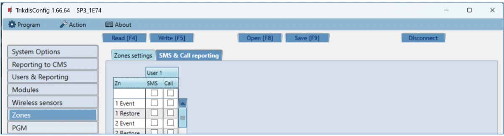

This tab will only be shown if there is at least one user phone number in the *[„Users & Reporting"](#Users_window)* window*.*

- **Zn** – zone number with the event identification word. Can be *“Event”* or “Restore”.

- **User / SMS and Call** – choose how users will be informed about events in every individual zone – using SMS messages or/and phone calls.

### “PGM” window

**“Outputs tab”**

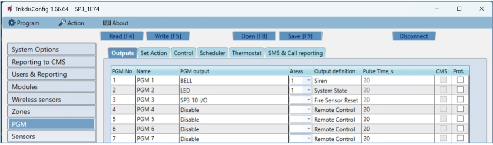

- **PGM No** – specifies the PGM output’s number on the list.

- **Name** - enter PGM output name.

- **PGM output** – assign the outputs OUT of the „FLEXi“ SP3 or an external device to the PGM.

- **Area** – assign the output OUT to an area.

- **Output definition** – choose the operational mode of the output OUT.
- **Siren** – for connecting a siren.

- **Remote control** – for controlling external electric devices.

- **Fire Sensor Reset** – for resetting a fire sensor after triggering.

- **System State** – for connecting a security system state indicator. E.g., an LED can display when the alarm is armed / disarmed.

- **Flash** – if the alarm is armed a line signal is generated, if it is triggered – a pulse type signal. The signal is cut off when the alarm is disarmed.

- **Thermostat** – this setting will make the PGM output operate in thermostat mode. A temperature sensor must be connected to the „FLEXi“ SP3. The PGM output must have thermostat mode set and the temperature that it must maintain has to be specified.

- **Buzzer** – for repeating the sound signals from a keypad.
- **Pulse time, s** – you can set the desired OUT turn on duration from 0 to 9999 seconds.

- **CMS** – if this box is ticked, PGM output turn on/off reports will be sent to the central monitoring station (CMS).

- **Prot.** – if the box is ticked, PGM output turn on/off reports will be sent to Protegus cloud.

**“Set Action” tab**

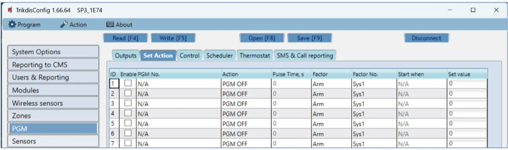

- **ID** – output’s number on the list.
- **Enable** – enables the PGM operation algorithm.

- **PGM No.** – select the desired PGM output OUT that will be controlled after the event described in columns **Factor**, **Factor No.**, **Start when**, **Set value** occurs.

- **Action**:
- **PGM OFF** – state of output OUT – “Off”.

- **PGM ON** – state of output OUT – “On”.

- **Pulse OFF** – initial state of output OUT – “On”. After the command the OUT state will become “Off” for the duration of the **Pulse time**, and later it will automatically return to the initial “On” state**.**

- **Pulse ON** – initial state of output OUT – “Off”. After the command the OUT state will become “On” for the duration of the **Pulse time**, and later it will automatically return to the initial “Off” state**.**
- **Pulse time, s** – you can set the pulse time anywhere from 0 to 9999 seconds.

- **Factor/Factor No.** – choose what event (Zone, Sensor, Jamming, Sensor lost, iButton, Arm, Disarm, SMS received, Zone(follow), Stay, Sleep, AC lost, Low battery, Zone tamper) will turn on the output OUT.

  - Schedules can be assign to an output OUT. The schedule shows when the output should be turned on. Up to 10 different schedules can be prepared in the **Scheduler tab**.

- **Start when** – you can set an additional condition when to turn on the output OUT depending on the **Factor** event.

- **Set value** – depending on the condition chosen in the **Factor** column (SMS received, Temperature) a value (text of received SMS message, voltage or temperature) can be specified. If this value is identified, the action (chosen in the **Action** column) will be performed. The text of the SMS message can be separated by using % symbols. % symbols are used for separating the keyword that will change the state of a PGM output from the entire received SMS message.

**%.....%** - part of the received SMS message text must match with the text entered between % symbols (e.g. **%hoUSe%**. The text in an SMS message must include the text “**hoUSe**”. Example of an SMS message: **VacationhoUSe25864**).

**.....%** - the beginning of the received SMS message must match the text entered until the % symbol (e.g. **hoUSe%**. The SMS message must start with the text **“hoUSe”**. Example of an SMS message: **hoUSeddss**).

**%.....** – the ending of the received SMS message must match with the text entered after the % symbol. (e.g. **%hoUSe**. The SMS message must end with the text **“hoUSe”**. Example of an SMS message: **1144hoUSe**).

The SMS message text is case-sensitive.

**“Control” tab**

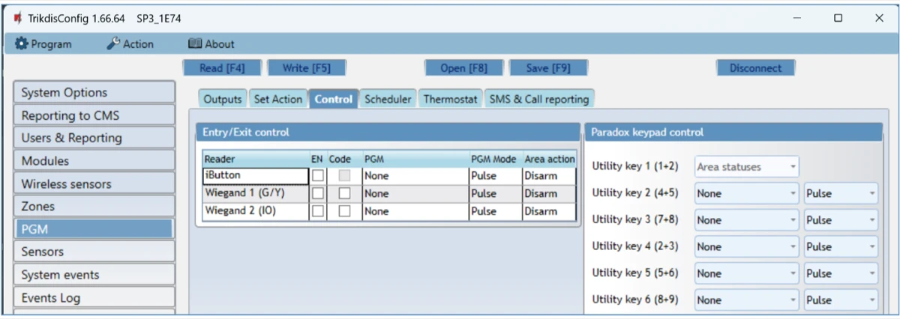

**Settings group “Entry/Exit control”**

- **Reader** – the readers that can be connected to the security panel are indicated.

- **En –** check the box to enable the reader to control the PGM output.

- **Code -** by checking the field, you will be able to perform an action (activate PGM output or control the control panel) with the user code.

- **PGM –** specify the PGM output that the reader will control. PGM output must be set to **Remote control** mode.

- **PGM mode –** set the PGM output triggering mode (**Pulse** or **Level**).

- **Area action -** indicate the change in the security mode of the security panel when an iButton key or RFID card is attached to the reader.

**Settings group “Paradox keypad control”**

- **Utility key** – pressing and holding the utility keys for 3 seconds will trigger the PGM output. The PGM output will activate for the duration of the pulse (if the operating mode is **Pulse**) or the level of the PGM output signal will change (if the operating mode is **Level**).

**“Scheduler” tab**

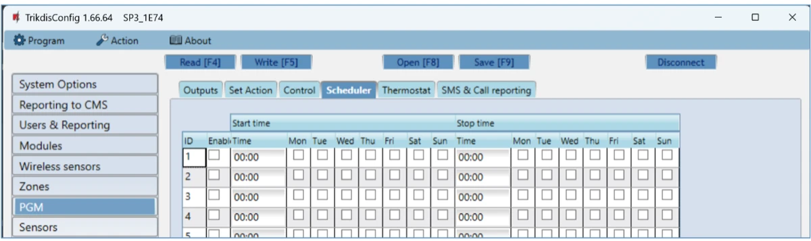

- **ID** – schedule’s number on the list.

- **Enable** – enable the schedule.

- **Start time** – set the time when OUT will be turned on (schedule start time).

- **Stop time** – set the time when OUT will be turned off (schedule end time).
- **Mon – Sun** – you can mark the days of the week when OUT will have to be turned on/off.

**“Thermostat” tab**

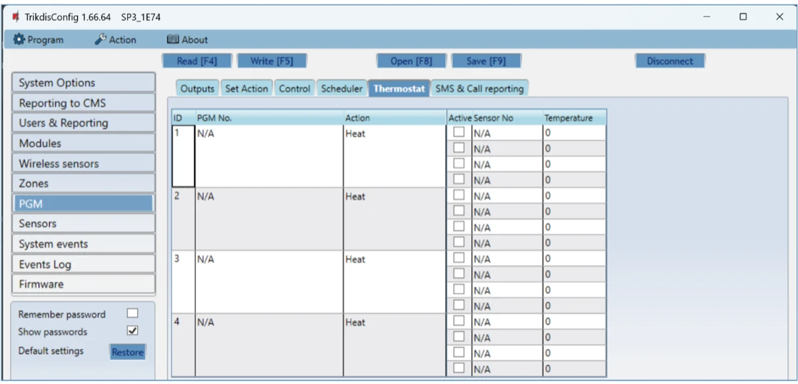

- **ID** – thermostat’s number on the list.

- **PGM No.** – specify the number of the PGM output that the thermostat will control.

- **Action** – set the thermostat’s operation mode: heating or cooling.

- **Active** – if the box is ticked, the thermostat will work with the selected temperature sensor according to the set temperature.

- **Sensor No –** assign a temperature sensor to the thermostat.

- **Temperature –** set the temperature that the thermostat will maintain.

**“SMS & Call reporting” tab**

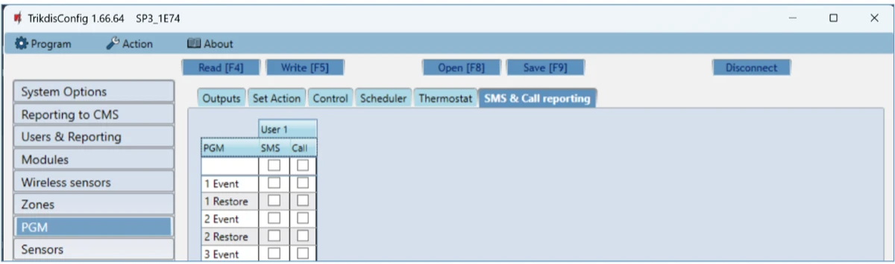

**This tab will only be shown if there is at least one user phone number in the** ***[“Users & Reporting”](#Users_window)* window*.*** These settings can only be made for the first 8 users.

- **PGM** – shows the output OUT number and turn on/off event type (“Event” – output OUT turn on event and “Restore” – output OUT turn off event).

- **User / SMS and Call** – choose which users to inform using SMS messages and/or phone calls when the output OUT is turned on/off.

### “Sensors” window 

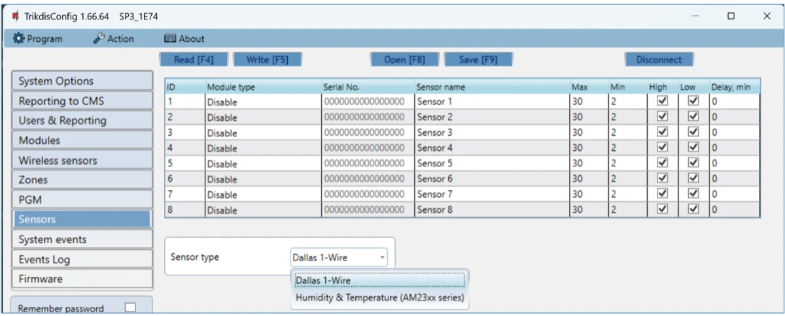

- **ID** – temperature sensor’s number on the list.

- **Module type** – choose a temperature sensor to assign to the ID.

- **Serial No.** - serial number of the temperature sensor that is connected to the сontrol panel.

- **Sensor name** – give the temperature sensor a name.

- **Max** – when the temperature is higher than this setting, an event report will be generated. For an event message to be generated, the **High** box must be ticked.

- **Min** – when the temperature is lower than this setting, an event report will be generated. For an event message to be generated, the **Low** box must be ticked.

- **Delay** - an event will be sent if the measured value (Max or Min) by the sensor is exceeded within the set time. Delay time is entered in minutes.

- **Sensor type** – choose the type of the connected temperature sensor (Dallas 1Wire – up to 8 temperature sensors of this type can be connected. If Dallas sensors are chosen, they will be linked automatically; Humidity & Temperature – one AM2301 temperature and humidity sensor can be connected. If the Humidity & Temperature sensor will be used, it must be manually assigned in the **Module type** column).

### “System events” window 

**“Events” tab**

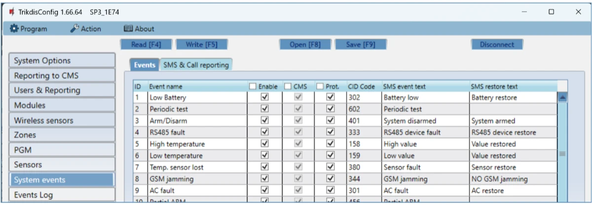

- **ID** – event’s number on the list.

- **Event name** – event name.

- **Enable** – enable event recognition and report generation.

- **CMS / Prot.** – reports on selected events will be sent to CMS and/or to Protegus cloud.

- **CID Code** – Contact ID code of the event.

- **SMS event text** – event SMS message text.

- **SMS restore text** – restore event SMS message text.

**“SMS & Call reporting” tab**

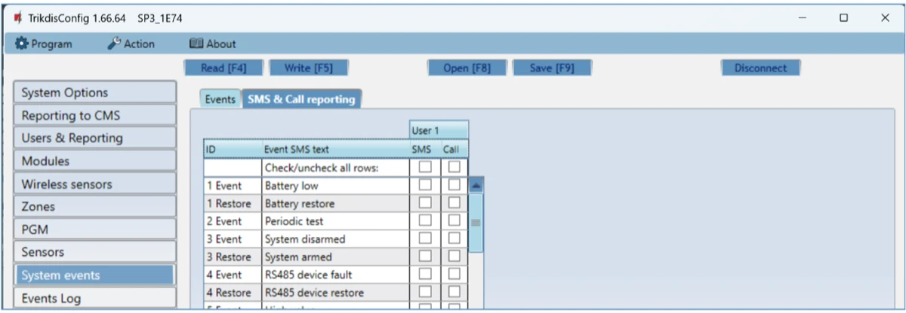

This tab will only be shown if there is at least one user phone number in the “[*Users & Reporting*”](#Users_window) window*.*

- **ID** – number and identification word (*Event*, *Restore*) of the event.

- **Event SMS text** – text that will be used in event SMS messages.

- **User / SMS and Call** – choose the ways users will be informed about each event – SMS message and/or phone call.

### “Events log” window

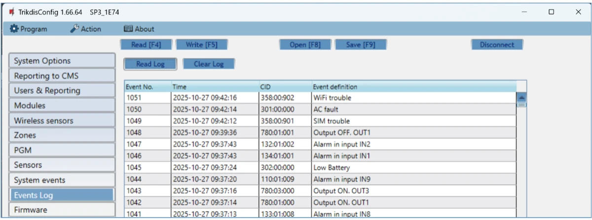

- **Read Log** button – command for reading the events log from the device’s memory.

- **Clear Log** – command for clearing the events log entries from the device’s memory.

- In the table, you can find the **Event No.**, **Time**, **CID** code, **Event definition**. The events log can show up to 1000 events stored in the „FLEXi“ SP3’s memory.

### Restore default settings 

To restore the control panel’s default settings, click the TrikdisConfig button **Restore**.

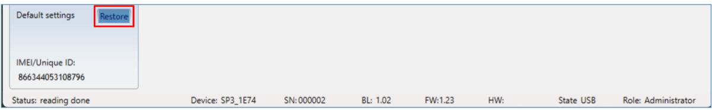

### Remote configuration 

!!! warning "Important"
    Remote configuration will work only if:

    1.  The inserted SIM card is activated and the PIN code is either
        entered or disabled , or the device is connected to a WiFi network;

    2.  "Protegus cloud" is enabled. How to enable cloud is
        described in section 5.4 ""User & Reporting" windows";

    3.  Power supply is connected ("**PWR**" LED blinks green);

    4.  Registered to the network ("**NET**" LED must be green solid when
        connected to mobile network; and/or "**MOD**" LED must be green
        solid when connected to WiFi network).
1.  Start the configuration program TrikdisConfig.

2.  In the “**Remote access**” section enter the “**IMEI/Unique ID**” number of the control panel. This number can be found on the device and the packaging sticker.

3. (Optional) in the “**System name**” field, enter the desired name for the “FLEXi” SP3 with this Unique ID.

2.  Press “**Configure**”.

3.  In the newly opened window click **Read [F4]**. If required, enter the administrator or installer code*.* To save the password, select “**Remember password**”.

4.  Set the necessary settings and when finished, click **Write [F5]**.

### Test control panel performance 

When the configuration and installation is complete, perform a system check:

1\. Generate an event:

\- by arming/disarming the system with the control panel’s keypad;

\- by triggering a zone alarm when the security system is armed.

2\. Make sure that the event arrives to the CMS (Central Monitoring Station) and/or is received in the Protegus2 application.

3\. To test the control panel outputs, activate them remotely and check their operation.

4\. If the security control panel will be controlled remotely, arm/disarm the security system remotely by using the Protegus2 app.

### Updating firmware

!!! note
    After connecting the „FLEXi" SP3 to TrikdisConfig, the
    program will automatically offer to update the firmware if any updates
    are available. An internet connection is needed for this feature. / If
    antivirus software is installed on your computer, it may block the
    automatic firmware update function. In this case, you will have to
    reconfigure your antivirus software.
The „FLEXi“ SP3’s firmware can also be updated or changed manually. All prior settings of the „FLEXi“ SP3 remain unchanged after an update. If the firmware is installed manually, it can be changed to a newer or an older version.

Perform these steps:

1.  Launch ***TrikdisConfig**.*

2.  Connect the „FLEXi“ SP3 to a computer using a USB Mini-B cable or connect to the „FLEXi“ SP3 remotely. If a newer version of firmware is available, the program will automatically offer to install it.

3.  Open the TrikdisConfig window **Firmware**.

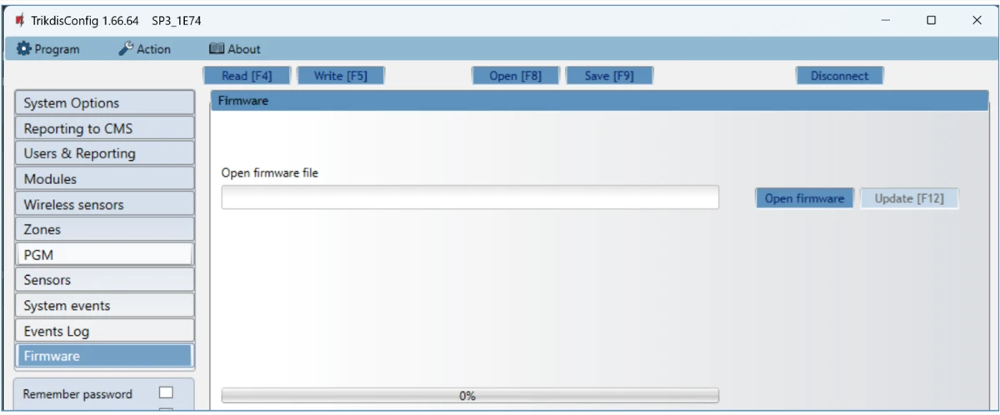

4. Click the **Open firmware** button and choose the required firmware file.

2.  Click the **Update [F12]** button.

3.  Wait for the updates to finish.

Once configuration is complete, click the **Write [F5]** button and disconnect the USB cable.

## Warranty and limitation of liability

The control panel is given a 24-month warranty effective from the date of sale-purchase. For the duration of the warranty period, free repairs are guaranteed for faults caused by the manufacturer.

The warranty is valid if the control panel was installed by qualified personnel following the instructions in this document and the applicable regulations for installing electrical equipment and operated following the instructions in this document and the applicable regulations for safe operation of electrical equipment.

The control panel must be submitted for repairs in the manufacturer‘s packaging along with a defect report stating the nature of the malfunction.

Once the warranty has expired, the control panel‘s technical maintenance and repairs are performed at the buyer‘s expense.

The warranty can be terminated prematurely if:

- Unauthorized personnel repaired or tried to repair the control panel;

- The panel was used for anything other than its intended purpose;

- The panel was stored and (or) installed in unsuitable premises that had incompatible climate conditions or an aggressive chemical environment;

- The panel was mechanically broken and (or) intentionally damaged;

- The panel was damaged by *force majeure* circumstances (lightning discharge etc.).

The manufacturer is not responsible for:

- the control panel‘s malfunctions if the panel is installed or used not according to its manual.

- the control panel‘s malfunctions if the cause is a malfunction or loss of GSM/GPRS/Internet connectivity or malfunctions in the operator‘s network.

- restrictions or termination of GSM/GPRS/Internet connectivity services to the panel‘s buyer or user, and shall not compensate the panel‘s buyer or user for any property or non-property damages suffered from this.

- restrictions or termination of electricity supply service to the panel‘s buyer or user, and shall not compensate the panel‘s buyer or user for any property or non-property damages suffered from this.

- robbery, fire of the premises or any other losses suffered by the panel‘s buyer or user, and shall not compensate the panel‘s buyer or user for any property or non-property damages suffered from these events.

## Safety precautions

Read this manual carefully before using the control panel.

The „FLEXi“ SP3 control panel is an electrical device, which means it must be installed and serviced only by qualified personnel following the instructions in this document and applicable regulations for installing electrical equipment.

Power to the panel must be switched off during installation!

The control panel must be installed in a limited access location inside the premises and maintaining a safe distance from sensitive electronic equipment. The panel is not resistant to vibrations, other mechanical effects, humidity and aggressive chemical environments. The control panel complies with the demands applicable to Class II environmental specification of the EN 50131 standard.

!!! warning

    The casings, transformers, batteries and programming equipment used must
    meet the safety requirements of the EN 60950 standard.
    
    The device is powered from a 230 V voltage 50 Hz frequency power grid
    through a Class II step-down transformer that reduces the voltage to 16
    -- 18 V or from a 16 -- 24 V DC power supply. A 12 V battery with at
    least 7 Ah capacity is used as a backup power supply. The current
    consumption depends on the power of the connected external devices.
    
    A two-pole automatic safety switch must be installed in the power supply
    circuit for protection. The gap between switch off contacts must be at
    least 3mm. The safety switch must be installed in a location known to
    the specialists servicing the control panel.
    
    To disconnect the control panel from the power network:
    
    - from the AC network -- switch off the automatic safety switch;
    
    - from the battery -- disconnect the terminals.
