# Using Paradox wireless devices with FLEXi SP3 (RTX3)

  

## Control panel firmware replacement

The control panel firmware must be changed with firmware, which will ensure the operation of Paradox wireless sensors. The firmware file can be downloaded as a registered user from [www.trikdis.com](http://www.trikdis.com).

#### Compatibility table for control panel modification and firmware version

| Control panel modification | Firmware version compatible with the control panel |
|:--:|:--:|
|  | SP3_1xx1_0112.fw |
|  | SP3_3xx1_0112.fw |
|  | SP3_4xx1_0112.fw |
|  | SP3_5xx1_0112.fw |

Follow the steps below to replace the firmware:

1.  Launch ***TrikdisConfig**.*

2.  Connect the „FLEXi“ SP3 to a computer using a USB Mini-B cable.

3.  Open the TrikdisConfig window **„Firmware”.**

4.  Click the **„Open firmware”** button and choose the required firmware file.

5.  Click the **Update [F12]** button.

6.  Wait for the updates to finish.

7.  Click the **„Disconnect”** button and disconnect the USB cable.

Connect the wires of the main power supply to the control panel’s AC/DC terminals. Connect the *RTX3* module to the control panel.

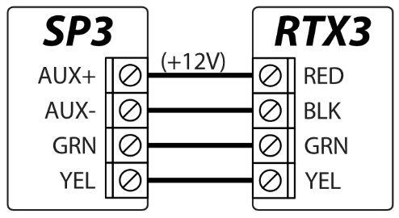

Insert an activated SIM card into the SIM card holder. Turn on the main power supply. Wait a few minutes. Using TrikdisConfig, remotely connect to the **„*FLEXi” SP3 control panel. The TrikdisConfig*** status bar displays information about the version of the installed firmware (1). In the **„Modules” / „Keypads”** window, the table contains the RTX3 module (2) that is connected to the control panel.

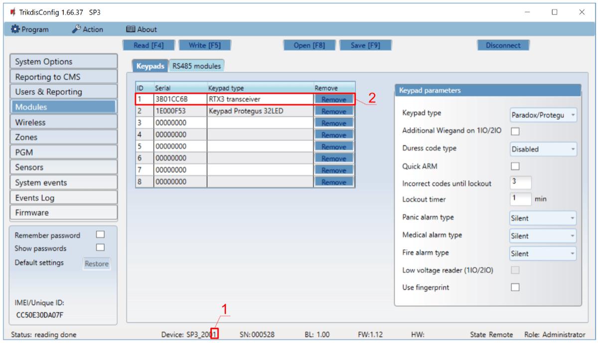

After connecting the RTX3 module, the **„*FLEXi” SP3*** control panel can work in wireless sensors from Paradox (magnetic contacts, motion detectors, glass break detector (G550), smoke detector (SD360), remote control (REM2, REM25), sirens (SR230, SR250), keypads (K37), expansion module (2 WPGM), repeater (RPT1)).

## Linking a wireless sensors

1.  Make sure the **„*FLEXi” SP3 has enrolled the RTX3*** wireless sensor receiver.

2.  Switch on the power supply on the control panel. Insert the batteries into the wireless sensor and wait until the LED indicators stop blinking.

3.  Using TrikdisConfig, remotely connect to the **„*FLEXi” SP3*** control panel.

4.  In TrikdisConfig, in the **„Wireless”** window, click the **„Learn sensors”** button.

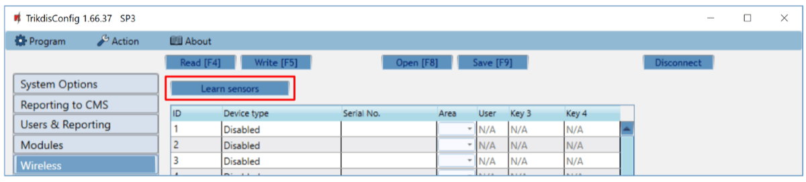

5.  Select the type of device: **„Sensors”**.

6.  Press the **„Start”** button.

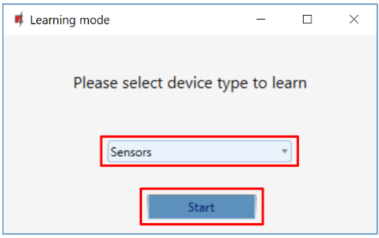

7.  Press the sensor **„Tamper”** button.

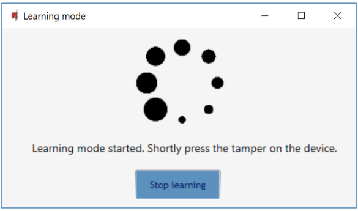

8.  Wait a few seconds. The control panel will detect the sensor.

9.  The **„UID”** number must match the serial number of the sensor shown on the sticker on the sensor board.

10. The sensor must be assigned a **„Zone Number”** and a **„Zone definition”**.

11. Click **„Save”**.

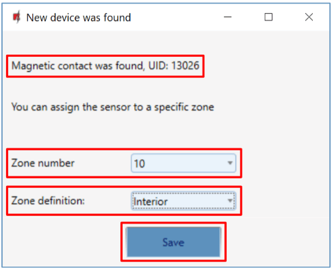

12. Wireless sensor added to the list of wireless devices.

13. The **„UID”** number must match the serial number of the sensor, which can be found on the sticker on the sensor board.

14. Click **„Stop learning”** to complete the registration of wireless sensors.

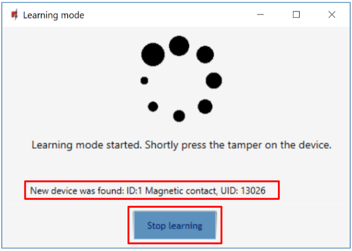

15. Click **„Yes”** for the sensor to be written to the **„*FLEXi” SP3*** control panel.

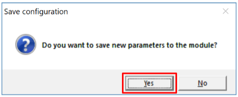

16. A new wireless sensor will be added to the list of **„Wireless”** devices.

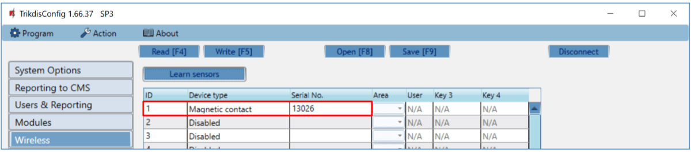

17. You must assign the sensors to **„Zones”** and **„Area”** of the security control panel (**„Zones”** window).

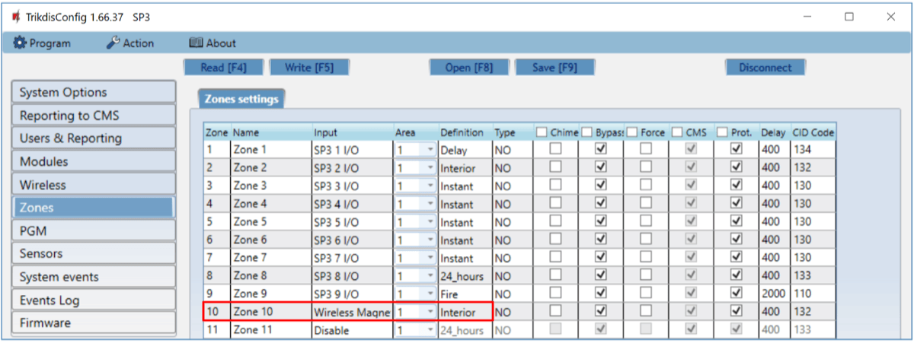

18. Click **Write [F5]** after making the changes.

19. The wireless sensor is now successfully linked to the system.

!!! note
    To delete wireless sensors from the „FLEXi" SP3's memory:

    1.  Connect a USB Mini-B cable to the „FLEXi" SP3.

    2.  Launch TrikdisConfig, click the **Read [F4]** button.

    3.  In the TrikdisConfig window **„Wireless"**, in the column
        **„Device type"**, select **„Disabled"** instead of the **„Wireless
        sensor"** that you wish to delete and click **Write [F5]**. The
        wireless sensor is now removed from the „FLEXi" SP3's memory.
## Linking a wireless remote controller (keyfob)

1.  Make sure the **„*FLEXi” SP3 has enrolled the RTX3*** wireless sensor receiver.

2.  Switch on the power supply on the control panel.

3.  Using TrikdisConfig, remotely connect to the **„*FLEXi” SP3*** control panel.

4.  In TrikdisConfig, in the **„Wireless”** window, click the **„Learn sensors”** button.
5.  Select the type of device: **„Pendants”**.

6.  Press the **„Start”** button.

7.  Press and hold any button on the remote controller to turn on the LED on the remote control. Release the button.

8.  Wait a few seconds. The control panel will detect the keyfob.

9.  The **„UID”** number must match the serial number of the remote control, which is indicated on the sticker on the back of the remote controller.

10. In the **„Partition”** field, specify the partition of the security system that the console will control (Arm / Disarm).

11. In the **„User”** field, enter the user number to which the keyfob will be assigned.

12. Click **„Save”**.

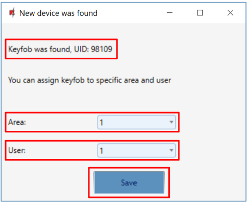

13. Wireless pendant is included in the list of sensors.

14. The **„UID”** number must match the serial number of the keyfob, which can be found on the back of the remote controller.

15. Click **„Stop learning”** to complete the registration of wireless pendant.

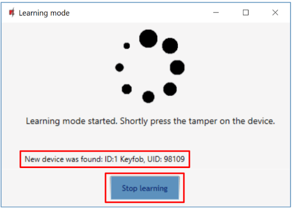

16. Click **„Yes”** for the pendant to be written to the **„*FLEXi” SP3*** control panel.

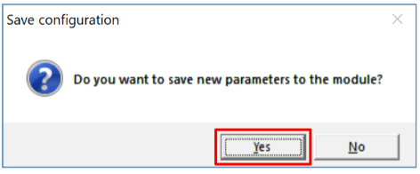

17. The wireless keyfob has been added to the list of **„Wireless”** devices.
18. You can assign additional functions to the controller’s buttons 3 and 4 (Arm, Disarm; Silent alarm; Panic alarm; PGM control).

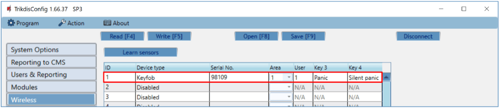

19. Click **Write [F5]** after making the changes.

20. The wireless controller is now successfully linked to the system.

!!! note
    To delete wireless keyfob from the „FLEXi" SP3's memory:

    1.  Connect a USB Mini-B cable to the „FLEXi" SP3.

    2.  Launch TrikdisConfig, click the **Read [F4]** button.

    3.  In the TrikdisConfig window **„Wireless"**, in the column
        **„Device type"**, select **„Disabled"** instead of the **„Keyfob"**
        that you wish to delete and click **Write [F5]**. The keyfob is
        now removed from the „FLEXi" SP3's memory.
## Linking a wireless siren

1.  Make sure the **„*FLEXi” SP3 has enrolled the RTX3*** wireless sensor receiver.

2.  Switch on the power supply on the control panel. Insert the batteries into the wireless siren.

3.  Using TrikdisConfig, remotely connect to the **„*FLEXi” SP3*** control panel.

4.  In TrikdisConfig, in the **„Wireless”** window, click the **„Learn sensors”** button.
5.  Select the type of device: **„Sirens”**.

6.  Press the **„Start”** button.

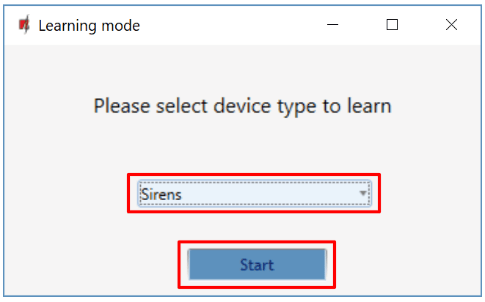

7.  Press and hold the **„LEARN”** button on the siren board for 3 seconds. The LED on the siren will start flashing. Release the button.

8.  Wait a few seconds. The security panel will detect the siren.

9.  The **„UID”** number must match the siren serial number, which is indicated on the sticker on the siren board.

10. In the **„Area”** field, specify the section of the security system, activation of which will trigger the siren.

11. Click **„Save”**.

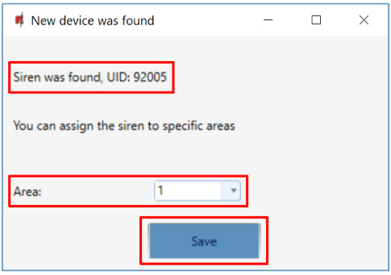

12. Wireless siren is included in the list of wireless devices.

13. The **„UID”** number must match the serial number of the siren, which can be found on the sticker on the siren board.

14. Click **„Stop learning”** to complete the registration of wireless siren.

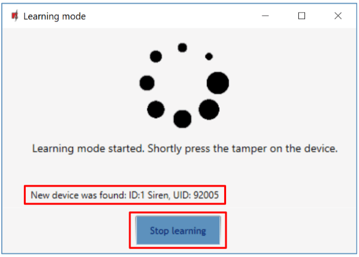

15. Click **Yes** for the siren to be written to the **„*FLEXi” SP3*** control panel.

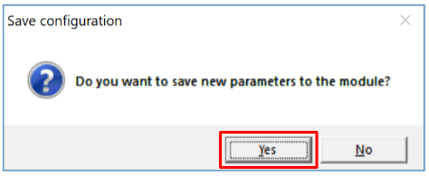

16. The wireless siren added to the list of **„Wireless”** devices.

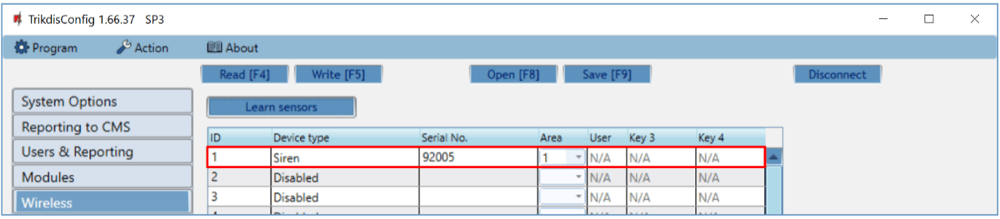

17. Click **Write [F5]** after making the changes.

18. The wireless siren is now successfully linked to the system.

!!! note
    To delete wireless siren from the „FLEXi" SP3's memory:

    1.  Connect a USB Mini-B cable to the „FLEXi" SP3.

    2.  Launch TrikdisConfig, click the **Read [F4]** button.

    3.  In the TrikdisConfig window **„Wireless"**, in the column
        **„Device type"**, select **„Disabled"** instead of the **„Siren"**
        that you wish to delete and click **Write [F5]**. The wireless
        siren is now removed from the „FLEXi" SP3's memory.
## Linking a wireless keypad

1.  Make sure the **„*FLEXi” SP3 has enrolled the RTX3*** wireless sensor receiver.

2.  Switch on the power supply on the control panel. Insert the batteries into the wireless keypad.

3.  Using TrikdisConfig, remotely connect to the **„*FLEXi” SP3*** control panel.

4.  In TrikdisConfig, in the **„Wireless”** window, click the **„Learn sensors”** button.
5.  Select the type of device: **„Keypads”**.

6.  Press the **„Start”** button.

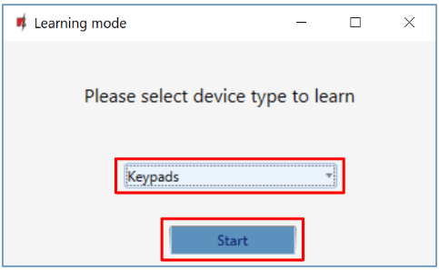

7.  Simultaneously press and hold the **[**  **]** and **[BYP]** buttons on the keypad for 3 seconds. The keypad will beep several times. Release the buttons.

8.  Wait a few seconds. The security panel will detect the keypad.

9.  The UID number must match the serial number of the keypad, which can be found on the sticker on the back of the keypad’s casing.

10. In the field, specify the **Area** of the security system that will control the keypad.

11. Click **Save**.

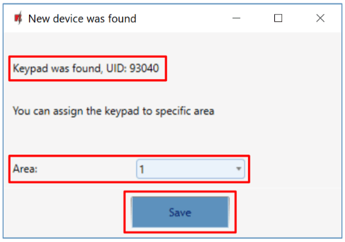

12. Wireless keypad is included in the list of wireless devices.

13. The **„UID”** number must match the serial number of the keypad, which can be found on the back of the keypad’s casing.

14. Click **„Stop learning”** to complete the registration of wireless keypad.

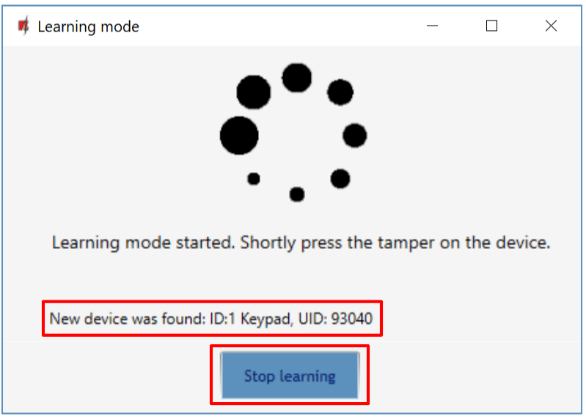

15. Click **„Yes”** for the keypad to be written to the **„*FLEXi” SP3*** control panel.

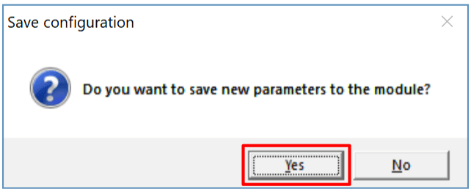

16. The wireless keypad has been added to the list of **„Wireless”** devices.

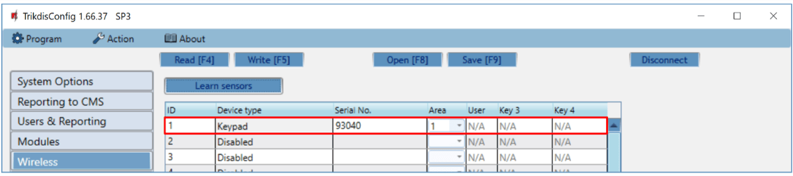

17. Click **Write [F5]** after making the changes.

18. The wireless keypad is now successfully linked to the system.

!!! note
    To delete wireless keypad from the „FLEXi" SP3's memory:

    1.  Connect a USB Mini-B cable to the „FLEXi" SP3.

    2.  Launch TrikdisConfig, click the **Read [F4]** button.

    3.  In the TrikdisConfig window **„Wireless"**, in the column
        **„Device type"**, select **„Disabled"** instead of the **„Keypad"**
        that you wish to delete and click **Write [F5]**. The keypad is
        now removed from the „FLEXi" SP3's memory.
## Linking a 2-way wireless PGM 2WPGM

1.  Make sure the **„*FLEXi” SP3 has enrolled the RTX3*** wireless sensor receiver.

2.  Switch on the power supply on the control panel. Switch on the power on the module 2WPGM.

3.  Using TrikdisConfig, remotely connect to the **„*FLEXi” SP3*** control panel.

4.  In TrikdisConfig, in the **„Wireless”** window, click the **„Learn sensors”** button.
5.  Select the type of device: **„PGM device”**.

6.  Press the **„Start”** button.

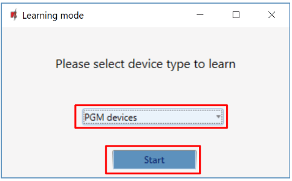

7.  Remove jumper JP2 on the 2WPGM module and put jumper back in it after a few seconds.

8.  Wait a few seconds. The security panel will detect the module.

9.  The **„UID”** number must match the serial number of the module, which is indicated on the sticker on the module board.

10. In the **„Select output”** field, specify the PGM output number that you want to assign to the module.

11. Click **„Save”**.

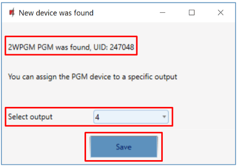

12. Wireless module 2WPGM is included in the list of wireless devices.

13. The **„UID”** number must match the serial number of the 2WPGM, which can be found on the sticker on the module board.

14. Click **„Stop learning”** to complete the registration of wireless module 2WPGM.

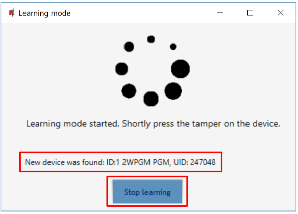

15. Click **„Yes”** for the wireless module 2WPGM to be written to the **„*FLEXi” SP3*** control panel.

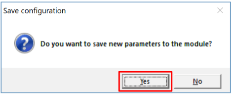

16. The 2WPGM wireless module has been added to the list of **„Wireless”** devices.

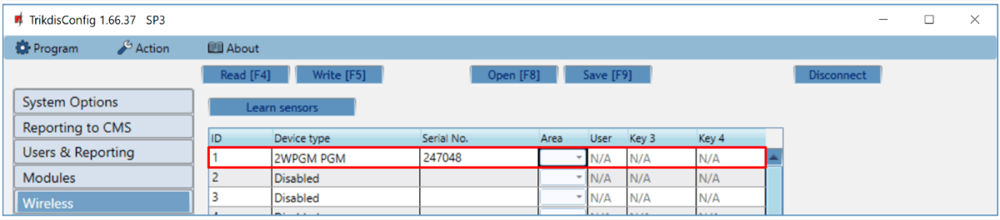

17. PGM output can be renamed.

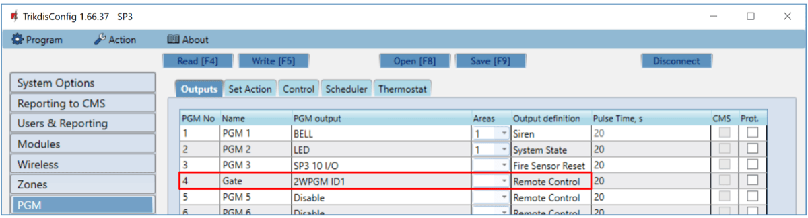

18. Click **Write [F5]** after making the changes.

19. The wireless 2WPGM is now successfully linked to the system.

!!! note
    To delete wireless module 2WPGM from the „FLEXi" SP3's
    memory:

    1.  Connect a USB Mini-B cable to the „FLEXi" SP3.

    2.  Launch TrikdisConfig, click the **Read [F4]** button.

    3.  In the TrikdisConfig window **„Wireless"**, in the column
        **„Device type"**, select **„Disabled"** instead of the 2WPGM
        that you wish to delete and click **Write [F5]**. The 2WPGM
        is now removed from the „FLEXi" SP3's memory.
## Linking a wireless repeater RPT1

1.  Make sure the **„*FLEXi” SP3 has enrolled the RTX3*** wireless sensor receiver.

2.  Switch on the power supply on the control panel. Switch on the power on the module RPT1.

3.  Using TrikdisConfig, remotely connect to the **„*FLEXi” SP3*** control panel.

4.  In TrikdisConfig, in the **„Wireless”** window, click the **„Learn sensors”** button.
5.  Select the type of device: **„Repeater”**.

6.  Press the **„Start”** button.

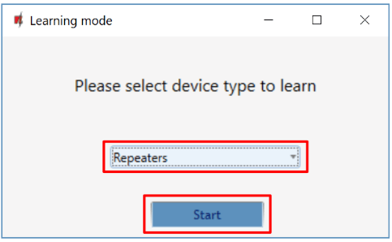

7.  Press the **„LEARN”** button on the RPT1 repeater.

8.  Wait a few seconds. The security panel will detect the RPT1 repeater.

9.  The **„UID”** number must match the serial number of the repeater, which is indicated on the sticker on the repeater board.

10. Click **„Stop learning”** to complete the registration of wireless repeaters.

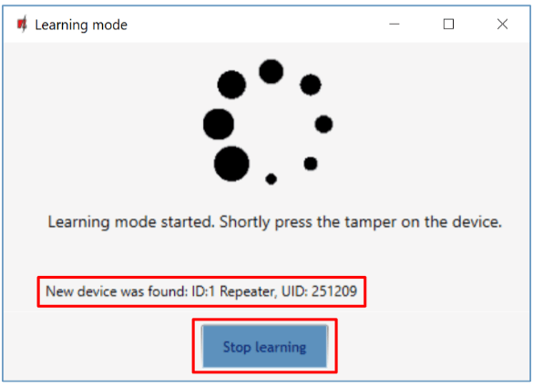

11. Click **„Yes”** for the wireless repeater RPT1 to be written to the **„*FLEXi” SP3*** control panel.

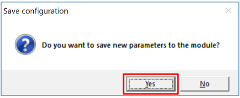

12. The wireless repeater RPT1 has been added to the list of **„Wireless”** devices.

13. Click **Write [F5]** after making the changes.

14. The wireless repeater RPT1 is now successfully linked to the system.

!!! note
    To delete wireless repeater RPT1 from the „FLEXi" SP3's
    memory:

    1.  Connect a USB Mini-B cable to the „FLEXi" SP3.

    2.  Launch TrikdisConfig, click the **Read [F4]** button.

    3.  In the TrikdisConfig window **„Wireless"**, in the column
        **„Device type"**, select **„Disabled"** instead of the
        **„Repeater"** that you wish to delete and click **Write [F5]**.
        The repeater RPT1 is now removed from the ***„FLEXi*"
        *SP3***'s memory.
