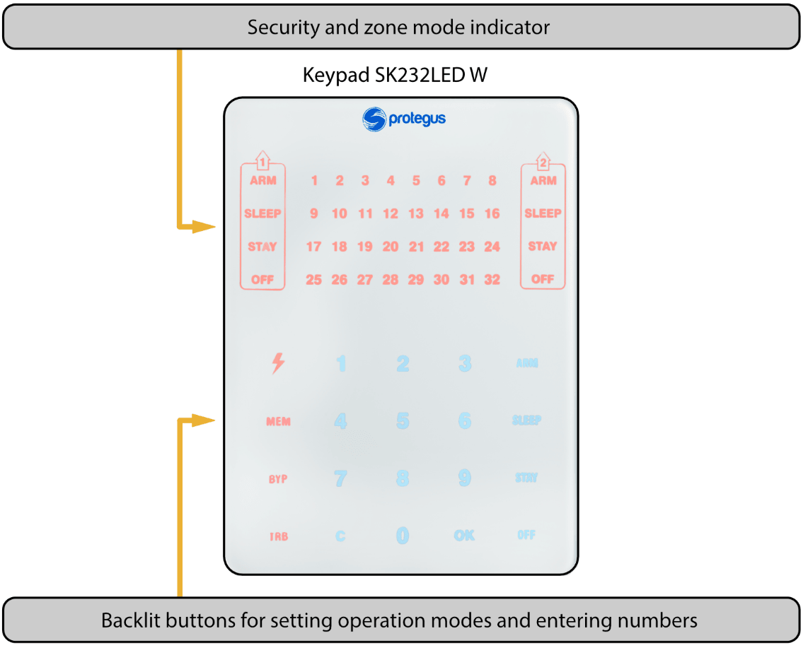
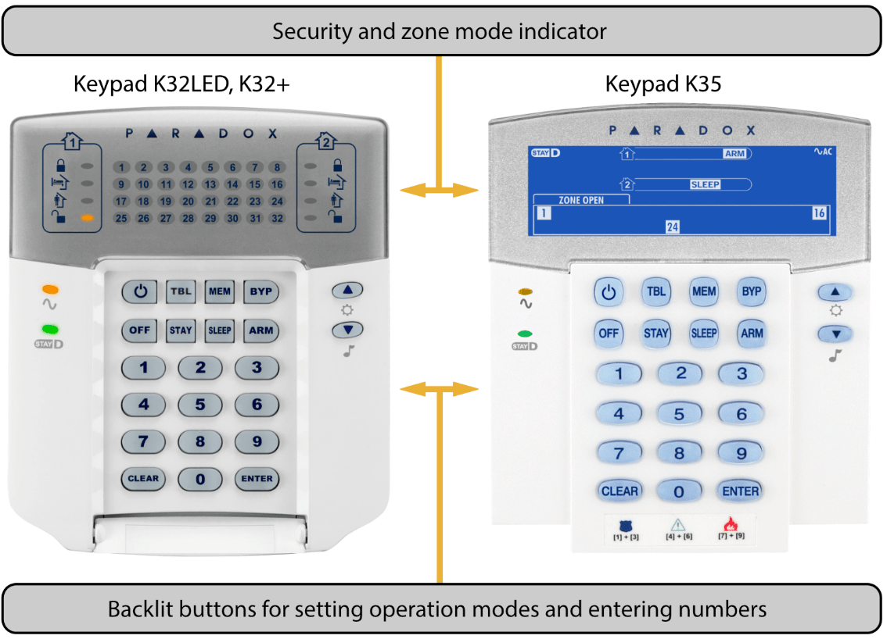

# FLEXi SP3 user guide with Protegus and Paradox keypads

#### **Description**

### OFF (DISARM)

In this mode, only some of the zones are protected. The alarm will only react to events in zones set to **Fire**, **24 hour**, **Silent 24h.**

### ARM

In this mode, all zones are protected. The alarm will react to all possible events.

### STAY

In this mode, a part of the zones is protected, but movement is allowed in zones set to **Interior STAY** and **Instant STAY**. If the alarm system is operating in this mode and a **Delay** zone is violated, the alarm will activate only after the entry time has elapsed.

### SLEEP

In this mode, a part of the zones is protected, but movement is allowed in zones set to **Interior STAY** and **Instant STAY**. If the alarm system is operating in this mode and a **Delay** zone is violated, the alarm will activate immediately.

### Control of the alarm system

The alarm system can be controlled using the following devices:

- *Trikdis* keypad Protegus SK232LED W;

- *Paradox* keypads K32+, K32LED, K636, K10LED V/H, K35, TM50, TM70;

- *Crow* keypads CR-16, CR-LCD;

- *iButton* keys;

- *RFID* cards;

- Electric switch, by changing the state of the zone selected by the keyswitch;

- Telephone (by phone call or by sending an SMS message with specific contents);

- Protegus app;

- Remote command from monitoring station.

### Control access

Control codes are used to give different users different access levels for controlling the alarm system. The user control codes are four digits long. When choosing and entering control codes, only numbers from 0 to 9 are used, other symbols are not available.

Types of alarm system control codes:

- Administrator code – a six-digit combination (default code - 123456). There is only one administrator code. It cannot be deleted, but it can be changed. The Administrator code allows to add or delete other users’ control codes. The Administrator code cannot arm/disarm the alarm system;

- User code – a four-digit combination for arming/disarming the alarm system and for temporarily bypassing security zones. It is recommended to assign every user a personal alarm control code. The memory of the FLEXi SP3 module can store up to 40 user codes;

- SMS password – six-digit combination for controlling the alarm system via SMS messages (default code - 123456).

### Security functions

### **Name**

#### **Description**

### Bypass

Temporarily (for one arming of the alarm system) bypasses a security zone when changing the alarm status. The function is used when the alarm needs to be armed, but a zone is malfunctioning and the fault cannot be easily repaired.

### Bell Squawk

The module can use a short siren signal to warn about the arming and disarming of the premise alarm system.

### Chime

When the alarm is disarmed, the module can warn that a zone is being violated by turning on the keypad buzzer and/or a specially programmed PGM output.

### Re-ARM

Used to protect against accidental disarming of the alarm. If the alarm was disarmed via phone call, but the **Delay** zone was not violated, the alarm will automatically return to its previous security mode after the Entry Delay time passes.

### Additional functions

| **Name** | **Description** |
|:---|----|
| Temperature measurement | Up to 8 temperature sensors DS18B20, DS18S20 or one temperature and humidity sensor AM2301 can be connected to the ***FLEXi* *SP3*** module. Intervals of permitted temperatures can be set for each of them individually. If the temperature changes beyond the set interval, an event message will be formed and sent to users. |
| Remote control of devices | Additional electronic devices can be connected to the ***FLEXi* *SP3*** security module’s programmable open collector outputs and can be controlled remotely. |

## Controlling the alarm

### Controlling the alarm with a SK232LED W keypad

The Trikdis keypad SK232LED W for alarm system control displays the states of 32 zones and 2 partitions.

#### Buttons for setting operation modes and entering numbers

| **Button** | **Description** |
|:---|----|
|  | A constantly glowing button means the alarm system is powered from the AC power network, and a blinking button shows a battery fault. The button is off – the power voltage supply is off or the system is operating using the battery. The button is also used for editing control codes and for resetting fire sensors. |
| MEM | A constantly glowing button shows that in memory there is new information about the alarm being triggered, and a blinking button shows that the keypad is operating in MEM mode. The button is also used for choosing the memory viewing mode. |
| BYP | A constantly glowing button means that there are temporarily bypassed zones, and a blinking button shows the keypad is operating in BYP mode. The button is also used for selecting temporary bypass mode. |
| TRB | A constantly glowing button means that operational trouble has been recorded, and a blinking button shows that the keypad is operating in TBL mode. The button is also used for selecting trouble viewing mode. |
| 1, 2 ...9, 0 | Buttons for entering numbers. |
| C | Button for exiting modes and clearing values. |
| OK | Button for confirming the specified choice. |
| ARM | Button for turning on full security mode **ARM**. |
| SLEEP | Button for turning on **SLEEP** mode. |
| STAY | Button for turning on **STAY** mode. |
| OFF | Button for turning on **OFF** (DISARM) mode. |

> [!NOTE]
>     1. To turn off programming mode or delete an incorrectly entered value,
press the **C** button.

2. If at least one zone is violated, it will not be possible to arm the
alarm system (if the **FORCE** property is not assigned to the
violated zones).
### Controlling the alarm with a Paradox keypad

The Paradox K10LED V/H keypad for alarm system control displays the states of 10 zones and 2 partitions.

The Paradox K636 keypad for alarm system control displays the states of 10 zones and 1 partition.

Paradox keypads K32LED, K32+, K35 for alarm system control display the states of 32 zones and 2 partitions.

#### Buttons for setting operation modes and entering numbers

| **Button** | **Description** |
|----|----|
|  | Button for resetting fire sensors. |
| MEM | A constantly glowing button shows that in memory there is new information about the alarm being triggered, and a blinking button shows that the keypad is operating in MEM mode. The button is also used for choosing the memory viewing mode. |
| BYP | A constantly glowing button means that there are temporarily bypassed zones, and a blinking button shows the keypad is operating in BYP mode. The button is also used for selecting temporary bypass mode. |
| TBL | A constantly glowing button means that operational trouble has been recorded, and a blinking button shows that the keypad is operating in TBL mode. The button is also used for selecting trouble viewing mode. |
| 1, 2 ...9, 0 | Buttons for entering numbers. |
| CLEAR | Button for exiting modes and clearing values. |
| ENTER | Button for confirming the specified choice. |
| ARM | Button for turning on full security mode **ARM**. |
| SLEEP | Button for turning on **SLEEP** mode. |
| STAY | Button for turning on **STAY** mode. |
| OFF | Button for turning on **OFF** (DISARM) mode. |
|  | Power voltage indicator. Constantly glowing – power voltage is turned on. Blinking – battery fault. Off – the power voltage source is off or the system is operating from the battery. |

> [!NOTE]
>     1. To turn off programming mode or delete an incorrectly entered value,
press the **CLEAR** button.

2. If at least one zone is violated, it will not be possible to arm the
alarm system (if the **FORCE** property is not assigned to the
violated zones).
## Quick arming/disarming of the alarm system

Arming/disarming the alarm system using a code when the security system has **STAY** zones.

Security modes **ARM**, **STAY** and **SLEEP** are switched to **OFF**/**DISARM**, and **OFF**/**DISARM** is switched to **ARM** or **STAY** mode.

Changing the security mode:

1. Enter **User code**.

1. If the system only has one partition, skip step 2. If the system has more than one partition, the numbers of the partitions that the user is allowed to change the modes of will light up on the keypad.

2. Press the numbers of the chosen partitions.

3. Partitions that were in **ARM**, **STAY** and **SLEEP** modes will switch to **OFF**/**DISARM** mode.

1. When the alarm is off, the **OFF** indicator is glowing.

2. If the **Bell Squawk** function is enabled, the siren will activate twice for short periods of time as the alarm switches off.

4. **Exit delay** time will be counted down for partitions that were in **OFF**/**DISARM** mode. If a **Delay** zone is violated during the countdown, **ARM** mode will switch on, and if a **Delay** zone is not violated, **STAY** mode will switch on.

1. The respective keypad indicator (**ARM** or **STAY**) will light up.

2. If the **Bell Squawk** function is enabled, the siren will activate once for a short period of time as the alarm switches on.

### Arming the alarm in ARM mode

To turn on **ARM** security mode for an alarm system that is divided into multiple partitions:

1. Press the keypad button **ARM**.

2. Enter the **User code** using the keypad.

3. Press the buttons with the numbers of the partitions you want to control.

4. Confirm your selection by pressing the **OK** (or **ENTER**) button.

5. Before the **Exit Delay** time runs out, leave the premises and close the door.

1. During the **Exit Delay** time countdown, the keyboard indicator **ARM** will blink, and when the alarm is armed, it will glow constantly.

2. If the **Bell Squawk** function is enabled, the siren will activate once for a short period of time as the alarm switches on.

### Arming the alarm in STAY mode

To turn on **STAY** security mode for an alarm system that is divided into multiple partitions:

1. Press the keypad button **STAY**.

2. Enter the **User code** using the keypad.

3. Press the buttons with the numbers of the partitions you want to control.

4. Confirm your selection by pressing the **OK** (or **ENTER**) button.

5. The keypad indicator **STAY** will light up.

1. If the **Bell Squawk** function is enabled, the siren will activate once for a short period of time as the alarm switches on.

> [!NOTE]
>     **STAY** mode is unavailable unless at least one zone is set to
**Interior STAY** or **Instant STAY**.
### Arming the alarm in SLEEP mode

To turn on **SLEEP** security mode for an alarm system that is divided into multiple partitions:

1. Press the keypad button **SLEEP**.

2. Enter the **User code** using the keypad.

3. Press the buttons with the numbers of the partitions you want to control.

4. Confirm your selection by pressing the **OK** (or **ENTER**) button.

5. The keypad indicator **SLEEP** will begin to glow.

1. If the **Bell Squawk** function is enabled, the siren will activate once for a short period of time as the alarm switches on.

## Disarming the alarm (OFF mode)

When the premises are secured in **ARM** or **STAY** mode, the countdown of the **Entry Delay** time will begin if anyone enters the premises. You must disarm the alarm before the time runs out.

To switch off protection mode (switch on **OFF** / **DISARM** mode):

1. Press the keypad button **OFF**.

2. Enter the **User code** using the keypad.

1. If the system has only one partition, skip steps 3 and 4.

3. Press the buttons with the numbers of the partitions you want to control.

4. Confirm your selection by pressing the **OK** (or **ENTER**) button.

1. When the alarm is off, the indicator **OFF** lights up.

2. If the **Bell Squawk** function is enabled, the siren will activate twice for a short period of time as the alarm switches off.

#### Switching off the alarm after it has been activated

To switch off the alarm:

1. Enter the **User code**.

1. If the system has only one partition, skip steps 2 and 3.

2. Press the buttons with the numbers of the partitions you want to control.

3. Confirm your selection by pressing the **OK** (or **ENTER**) button.

1. When the alarm is off, the indicator **OFF** lights up.

2. If the **Bell Squawk** function is enabled, the siren will activate twice for a short period of time as the alarm switches off.

3. The [**MEM]** indicator will light up and violated zones will start blinking. Press **MEM** and then **C** (or **CLEAR**) to stop the blinking of the violated zones.

## Temporary zone bypass (Bypass function)

To switch on the **Bypass** function:

1. Press the **BYPASS** button on the keypad.

2. Enter the **User code**.

1. The **BYP** indicator will start blinking.

3. Enter the two-digit numbers of the zones that you want to bypass.

4. Confirm your selection by pressing the **OK** (or **ENTER**) button.

5. The **BYP** indicator will start glowing.

To switch off the **Bypass** function, repeat the same steps as above.

### Viewing and clearing alarm activation memory

When the alarm is activated, the indicator **MEM** starts glowing. To find out the reason of the alarm activation:

1. Press the **MEM** button on the keypad.

2. The glowing numbers indicate which zones caused the alarm to activate.

3. To exit this mode, press the **C** (or **CLEAR**) button.

1. If no actions are performed with the keypad, the memory viewing mode will switch off automatically after one minute, but the memory will not be cleared and the **MEM** indicator will continue to glow.

4. The memory will be cleared after the alarm is switched on and the **MEM** indicator stops glowing.

### Resetting fire (smoke) sensors

After the triggering of fire (smoke) sensors, to reset the sensors you must:

1. Press and hold the keypad button  (or ) for 3 seconds.

1. The PGM output that the fire sensors are connected to and that is set to operate in **Fire sensor reset** mode will activate.

2. The fire (smoke) sensors connected to the control panel’s zone will be reset.

### Emergency call buttons

The keypad can be used to send messages to the security company about required help or imminent danger. This feature is only available if you are using the services of a security company and the security system is connected to the central monitoring station.

Hold down the following buttons together for 3 seconds:

- **1** **3** to send a message **Panic** about imminent danger.

- **4** **6** to send a message **Medical** about the need for medical assistance.

- **7** **9** to send a message **Fire**.

### Troubleshooting the alarm system

If there is any operational trouble, the **TRB** indicator on the keypad lights up. To view operational trouble of the alarm system:

1. Press the **TRB** button.

2. Trouble groups will light up on the keypad.

3. If you want to view a trouble group, press the corresponding button.

4. To leave troubleshooting mode, press the **C** (or **CLEAR**) button.

#### Trouble descriptions

| Trouble group | Description of selected group |
|---------------|-------------------------------|
| 1: System | 1 No AC power. |
| 1: System | 2 Battery malfunction. |
| 1: System | 3 Clock not set. |
| 1: System | 4 Maximum allowed current for output AUX is exceeded. |
| 1: System | 5 Maximum allowed current for siren output is exceeded. |
| 1: System | 6 No siren. |
| 1: System | 7 Fire detector loop trouble. |
| 2: Communications | 1 Faulty main connectivity channel (all connection types). |
| 2: Communications | 2 Faulty second connectivity channel (all connection types). |
| 2: Communications | 3 Faulty Protegus connectivity channel (all connection types). |
| 2: Communications | 4 No SIM card. |
| 2: Communications | 5 Incorrect SIM PIN code. |
| 2: Communications | 6 Unable to connect to Cellular network. |
| 2: Communications | 7 Unable to connect to WiFi network. |
| 2: Communications | 8 E485 module connectivity trouble (see LED indication of the module). |
| 3: Zone tamper | Numbers of zones with violated tampers. |
| 4: 485 bus | Numbers of 485 bus expanders with malfunctions. |
| 5: Missing RF sensor | A wireless sensor is no longer operational (periodic check time has passed). The zone number shows the order from a separate RF table. |
| 6: RF battery low | A wireless sensor has indicated that its battery is about to run out. The sensor number can be found from a separate RF table. |
| 7: Anti-masking | Numbers of zones with violated anti-masking. |

### Programming user control codes

#### Changing the administrator code

**The administrator code** can be changed in TrikdisConfig software’s menu branch **System Options / Access / Access codes**.

#### Entering new User codes

1. Press the  (or ) button on the keypad.

2. Enter the 6-digit **Administrator code**.

1. The  (or ) button will begin to blink.

3. Enter a free two-digit user serial number.

4. Enter a 4-digit **User code**.

5. Repeatedly enter the 4-digit **User code**.

6. Enter the partitions that the user will be able to control.

7. Confirm your selection by pressing the **OK** (or **ENTER**) button.

8. To leave programming mode, press the **C** (or **CLEAR**) button.

#### Editing User codes

1. Press the  (or ) button on the keypad.

2. Enter the 6-digit **Administrator code**.

1. The  (or ) button will begin to blink.

3. Enter the desired two-digit user serial number.

4. Enter the 4-digit **User code**.

5. Repeatedly enter the 4-digit **User code**.

6. Enter the partitions that the user will be able to control.

7. Confirm your selection by pressing the **OK** (or **ENTER**) button.

8. To leave programming mode, press the **C** (or **CLEAR**) button.

#### Viewing partition statuses

Viewing states of the current partitions.

## Paradox keypad user code operations

### Press buttons 1 and 2 simultaneously for 3 seconds, the keypad must beep

### Press button 2 and hold down for 3 seconds, the keypad must beep
LED indicators numbered from 1 to 8 will show the states of the partitions: On –**Arm** mode is on; Blinking – **Stay** mode is on; Off – **Disarm** or off.

#### Deleting User codes

To delete existing User codes:

1. Press the (or ) button on the keypad.

2. Enter the 6-digit **Administrator code**.

1. The  (or ) button will begin to blink.

3. Enter the desired two-digit user serial number.

4. Press the **SLEEP** button.

5. To leave programming mode, press the **C** (or **CLEAR**) button.

#### Duress code

If you are forced to switch the alarm system on or off, if you enter your user code with the duress option enabled, the system will switch the alarm system on / off and immediately transmit a silent alarm (Duress code) to the monitoring station. The duress code must me enabled by the installer. There are two types of duress codes: **Higher last digit** or **“0” instead of the first digit**.

## Control using iButton keys

> [!NOTE]
>     If at least one zone is violated, it will not be possible to arm the
alarm system.
iButton keys can be used to set the alarm system security modes **ARM** / **STAY** / **OFF**. Security mode **SLEEP** is unavailable.

Place the iButton key against the key reader. The mode of the alarm system will change to the opposite mode. If the system was armed, it will disarm. If the system was disarmed, it will arm and the countdown of **Exit Delay** time will start. If the zone set to **Delay** is not violated during the time for exiting and there are zones set to **Interior STAY** and **Instant STAY**, the security mode **STAY** will switch on.

Existing keys can be deleted and new keys added to an installed and functioning alarm system by using the configuration software TrikdisConfig or a contact key reader**.**

Linking keys using the CZ-Dallas reader.

1. If the **Tag code** list is empty, place the contact key against the “eye” of the reader and hold for 3 seconds. The key will be linked, added to the first line of the list and become the **Master key**.

2. To turn on contact key linking mode, hold the **Master key** against the “eye” of the key reader for at least 10 seconds.

3. To link user keys, hold them against the “eye” of the key reader one by one.

4. When you are finished linking the user electronic (*iButton*) keys, hold the **Master key** against the key reader again to disable linking mode.

5. To delete all keys (including the master key), hold the **Master key** against the reader for at least 20 seconds.

## Control using RFID cards (tags)

> [!NOTE]
>     If at least one zone is violated, it will not be possible to arm the
alarm system.
RFID cards can be used to set the alarm system security modes **ARM** / **STAY** / **OFF**.

A Wiegand (26/34) RFID reader with keypad must be connected to the security control panel. RFID tags (cards) can be added by entering their ID numbers in the TrikdisConfig software field **Tag code**.

Hold the RFID card against the Wiegand reader or enter the **User code** on the Wiegand reader keypad and press **\#**. The mode of the alarm system will change to the opposite mode. If the system was armed, it will disarm. If the system was disarmed, it will arm and the countdown of **Exit Delay** time will start. If the zone set to **Delay** is not violated during the time for exiting and there are zones set to **Interior STAY** and **Instant STAY**, the security mode **STAY** will switch on.

## Control using phone calls

> [!NOTE]
>     If at least one zone is violated, it will not be possible to arm the
alarm system (if the **FORCE** property is not assigned to the violated
zones). / When controlling the alarm using phone calls, only **ARM** and
**STAY** security modes are available. / Before calling, it is
recommended to check the current security mode by sending a partition
state request via SMS message (command: **ASKA 123456**), and also check
the current zone states by sending a zone state request via SMS message
(command: **ASKI 123456**).
Programming the control panel allows to enter user phone numbers and specify what these users can control using phone calls: arm/disarm the alarm or control electronic equipment connected to the module’s **PGMx** output.

Call the number of the SIM card inserted into the FLEXi SP3 security control module. If the phone number you are calling from is specified in the module‘s memory, the control panel will answer the call and you will have to enter the control command (see control command table).

### List of commands that can be entered via phone keypad

### 1[partition no][#]

### 2[ partition no][#]

### 3[output no][#][stay no]

### E.g. (arm partition 2): 12#

### E.g. (disarm partition 2): 22#

> [!NOTE]
> Controls a specified output OUT. State: 0 – output turned off; 1 – output turned on; 2 – turned off for pulse time; 3 – turned on for pulse time; (pulse time is specified using TrikdisConfig software, in the PGM table) E.g. (set output 1OUT to “on” state): 31#1 E.g. (set output 2OUT to “on” state for Pulse time specified in the specified in the TrikdisConfig “PGM” table): “PGM” table): 32#3
If the **Re-ARM** function is activated, if the **Delay** zone is not violated after the set entry time passes from the moment of the alarm disarm command, the alarm system will automatically return to the previous security mode.

## Control using SMS messages

Using SMS messages, you can control the FLEXI SP3 security control panel and change some of the panel‘s parameters. Only TrikdisConfig software can change all parameters of the module.

Structure of an SMS message: Command `[space]` Password `[space]` Data

For a control panel with default settings, the SMS password is **123456**. For safety reasons, we recommend changing it to a combination only you know and not forgetting it!

### SMS command list

| Command | Data | Description |
|---------|------|-------------|
| INFO |  | Request information about the control panel. Object name, partition state, IMEI number, Cellular signal strength, firmware version and serial number will be included in the reply. E. g.: INFO 123456 |
| RESET |  | Reset the device. E.g.: RESET 123456 |
| OUTPUTx | ON | Turn on an output, “x” is the output number. E.g.: OUTPUT1 123456 ON |
|  | OFF | Turn off an output, “x” is the output number. E.g.: OUTPUT1 123456 OFF |
|  | PULSE=ttt | Turn on an output for a specified time - “x” is the output OUT number and “ttt” is a three-digit number that speficies pulse time in seconds. / E.g.: OUTPUT1 123456 PULSE=002 |
| PSW | New SMS password | Change SMS password. E.g.: PSW 123456 654123 |
| TIME | YYYY/MM/DD,12:00:00 | Set date and time. E.g.: TIME 123456 2020/01/02,12:23:00 |
| TXTA | Object name | Specify object name. E.g.: TXTA 123456 House |
| RDR | PhoneNR#SMStext | Forwards SMS messages to the specified number. The phone number must start with a "+" symbol and the international country code. / E.g.: RDR 123456 +37061234567#forwarded text |
| ASKI |  | Send SMS message with statuses of inputs IN. E.g.: ASKI 123456 |
| ASKO |  | Send SMS message with statuses of outputs OUT. E.g.: ASKO 123456 |
| ASKA |  | Send SMS message with statuses of partitions. E.g.: ASKA 123456 |
| ASKT |  | Send SMS message with values of all temperature sensors. / E.g.: ASKT 123456 |
| DISARM | SYS:x | Disarm the alarm, “x” is the partition number (1-8). E.g.: DISARM 123456 SYS:1 |
| ARM | SYS:x | Arm the alarm, “x” is the partition number (1-8). E.g.: ARM 123456 SYS:1 |
| STAY | SYS:x | Arm partition “x” in Stay mode, “x” is the partition number (1-8). / E.g.: STAY 123456 SYS:1 |
| SLEEP | SYS:x | Arm partition “x” in Sleep mode, “x” is the partition number (1-8). / E.g.: SLEEP 123456 SYS:1 |
| FRS |  | Resets the fire sensor’s output, if the output OUT is assigned the function “Fire sensor reset”. E.g.: FRS 123456 |
| SETN | PhoneX=PhoneNR#Name#email | Add a phone number, username and assign it to user “x”. “x” is the phone number’s line on the list. The phone number must start with a "+" symbol |
| SETN | PhoneX=PhoneNR#Name#email | and international country code. The phone number and username must be separated by a # symbol. / E.g.: SETN 123456 PHONE5=+37061234567#JOHN#john@trikdis.com |
|  | PhoneX=DEL | Delete phone number and username from the list. / E.g.: SETN 123456 PHONE5=DEL |
| UUSD | *Uusd code# | Sends a UUSD code to the operator. E.g.: UUSD 123456 *245# |
| CONNECT | Protegus=ON | Connect to Protegus cloud service. E.g.: CONNECT 123456 PROTEGUS=ON |
|  | Protegus=OFF | Disconnect from Protegus cloud service. E.g.: CONNECT 123456 PROTEGUS=OFF |
|  | Code=123456 | Protegus cloud service code. E.g.: CONNECT 123456 CODE=123456 |
|  | IP=0.0.0.0:8000 | Specify the main server’s connection channel’s TCP IP and Port. / E.g.: CONNECT 123456 IP=0.0.0.0:8000 |
|  | IP=0 | For turning off the main channel. E.g.: CONNECT 123456 IP=0 |
|  | ENC=123456 | TRK encryption key. E.g.: CONNECT 123456 ENC=123456 |
|  | APN=Internet | APN name. E.g.: CONNECT 123456 APN=INTERNET |
|  | USER=user | APN user. E.g.: CONNECT 123456 USER=User |
|  | PSW=password | APN password. E.g.: CONNECT 123456 PSW=Password |

## Control of PGM outputs

With the keypad you can control the PGM outputs. In the TrikdisConfig program (**PGM / Control**), it is necessary to assign the PGM outputs and the type of operation (Level or Pulse) to the utility keys. Pressing (or pressing and holding) the appropriate keys on the keypad will activate the assigned PGM output.

| Utility key | Keypad utility key TM50, TM70 / (press) | Note Paradox / (press and hold 3 sec.) |
|-------------|--------------------------------------------|-------------------------------------------|
| Utility key 1 | Utility key 1 | 1+2 |
| Utility key 2 | Utility key 2 | 4+5 |
| Utility key 3 | Utility key 3 | 7+8 |
| Utility key 4 | Utility key 4 | 2+3 |
| Utility key 5 | Utility key 5 | 5+6 |
| Utility key 6 | Utility key 6 | 8+9 |
