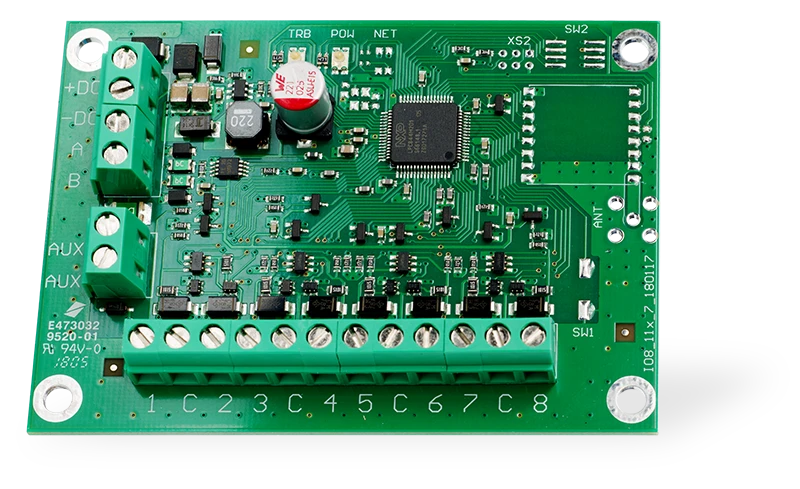
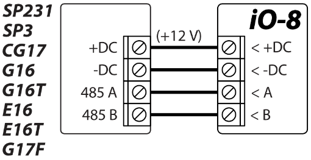
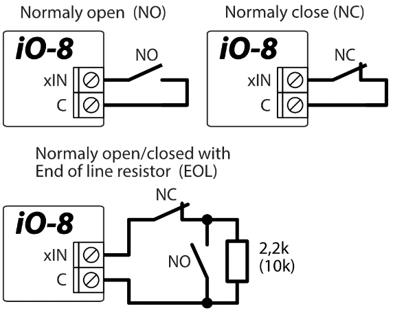
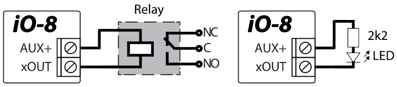
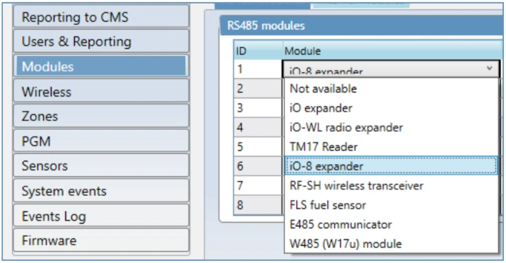
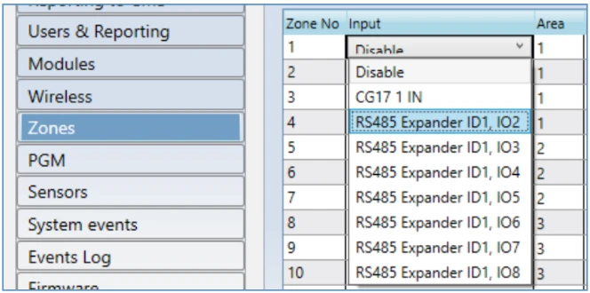

# iO-8 Input/Output Expander

  

With expander iO-8 you can increase the number of inputs and outputs in a compatible TRIKDIS device.

iO-8 has 8 contacts, which can be set to either input or output mode.

Visit [iO-8 page on *trikdis.com*](http://www.trikdis.com/) for device specifications and an up-to-date list of compatible TRIKDIS devices.

Compatible with [SP3](../../control-panels/sp3/index.md), [CG17](../../control-panels/cg17/index.md), [GT+](../../alarm-communicators/cellular/gt-plus/index.md), [GT](../../alarm-communicators/cellular/gt/index.md), [G16](../../alarm-communicators/cellular/g16/index.md), [G16T](../../alarm-communicators/cellular/g16t/index.md), [G17F](../../alarm-communicators/fire-panels/g17f/index.md), [E16](../../alarm-communicators/e16/index.md), [E16T](../../alarm-communicators/e16t/index.md), [GATOR Cellular](../../gate-controllers/gator/index.md) and [GATOR WiFi](../../gate-controllers/gator-wifi/index.md).

**Follow these steps to set up iO-8:**

1.  Wire iO-8 to a compatible TRIKDIS device as shown:

2.  Wire inputs as shown:

The input wiring diagrams and resistor values are determined by the main unit to which the iO-8 module is connected.

3.  Wire outputs as shown:

4.  Connect a USB cable to the main TRIKDIS device and open TrikdisConfig software. Press **Read [F4]**.

5.  Go to Modules window, and click on a free row in the "RS485 modules" pane. Select "iO-8 expander" in the drop-down list as shown:

6.  Enter iO-8 Serial No. (numbers only) in the cell to the right. You will find this number on the sticker on iO-8.

7.  In the **Input** and **PGM Output** drop-down menu selection (Zones and PGM window), you will now see the iO-8 inputs and outputs, which you can enable:

    

The setup may differ depending on the main TRIKDIS device. Configure settings for zones and PGM outputs according to the manual of the main device.

8.  Once finished, press **Write [F5**] and disconnect USB cable.

9.  Trigger the inputs and switch outputs to test the installation.
