## Description 

iO-LORA wireless expanders with RF-LORA transceiver increase the number of inputs and outputs of the "FLEXi" SP3 control panel using two-way RF communication.

Temperature sensor (1 pcs.) and readers of contact ("iButton") keys can be connected to the iO-LORA expander. The PGM output (relay) of the expander can be remotely controlled (on/off) by various electrical devices. iO-LORA has one digital input.

### Features

**Communication:**

- Line-of-sight wireless range up to 5000 m.

- Up to 8 *iO-LORA* wireless expanders can be connected to the *"FLEXi" SP3* control panel.

- Products from HW iO-LO_x30x_7_230418 version come with a standard antenna suitable for most applications. <u>In cases where it is necessary to provide high-quality communication at the maximum possible distance, an antenna (AX-ANT-KIT – 433 MHz, AX-ANT01S SF – 868 MHz) with a higher radio signal gain should be used</u>.

**Inputs and outputs:**

- Bus "1-Wire" is intended for connection of temperature sensor (1 pcs.) and readers of contact ("iButton") keys.
- 1 input, of selectable type: NC, NO.

- 1 output (relay).

Connection:

- The iO-LORA wireless expander is connected to the "FLEXi" SP3 control panel via the RF-LORA transceiver.

### Specifications 

| Parameter | Description |
|----|----|
| Transmission frequency | 4F modification: 433,3 - 434,7 MHz /​ 8F modification: 867 - 869 MHz |
| Modulation type | LORA |
| Power supply voltage | 9-26 V DC |
| Current consumption | Up to 50 mA (stand-by) /​ Up to 100 mA (short-term, while sending) |
| Report encryption | Yes |
| Range in open space | Up to 5000 m |
| Input | 1, selectable type: NC, NO |
| Output | 1, relay, 250 V AC, 4 A |
| Temperature sensor | 1, Maxim®/​Dallas® DS18S20, DS18B20 |
| Operating environment | Temperature from –20 °C to +50 °C, relative humidity – up to 80% at +20 °C |
| Dimensions | 62 x 77 x 25 mm |
| Weight | 80 g |

### Expander elements 

### Purpose of terminals 

| Terminal        | Description                                               |
|-----------------|-----------------------------------------------------------|
| +DC             | Power terminal (9-26 V DC positive)                       |
| -DC             | Power terminal (9-26 V DC negative)                       |
| D0              | Not used                                                  |
| D1              | Not used                                                  |
| +5V             | Positive 5 V power terminal for "**1-Wire**" devices      |
| 1Wire /​ OUT wgd | "**1-Wire**" data bus terminal („**OUT wgd**“ – not used) |
| COM             | Common negative terminal                                  |
| IN1             | 1 input, of selectable type NO, NC (factory setting: NO)  |
| NC              | Relay terminal NC                                         |
| C               | Relay terminal C                                          |
| NO              | Relay terminal NO                                         |

### LED indication of operation 

| Indicator | Light status | Description |
|-----------|--------------|-------------|
| NETWORK | Off | No RF signal |
| NETWORK | Green blinking | RF signal level from 0 to 10. Sufficient strength is 4. |
| OUTPUT/KEY | Green solid | Relay output activated |
| OUTPUT/KEY | Yellow solid | Dallas contact key activated |
| POWER | Off | No supply voltage |
| POWER | Green blinking | Normal supply voltage level |
| POWER | Yellow blinking | Low supply voltage level (≤11.5 V) |

## Wiring schematics 

### Fastening 

1.  Remove the top lid.

2.  Remove the PCB board.

3.  Fasten the base of the case in the desired place using screws.

4.  Reinsert the board.

5.  Close the top lid.

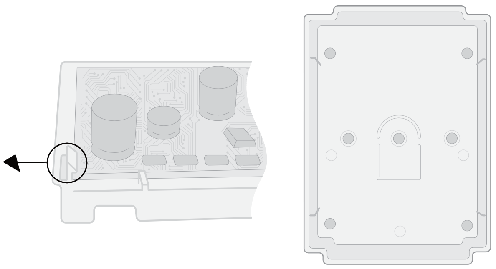

### Schematic for connecting the power supply 

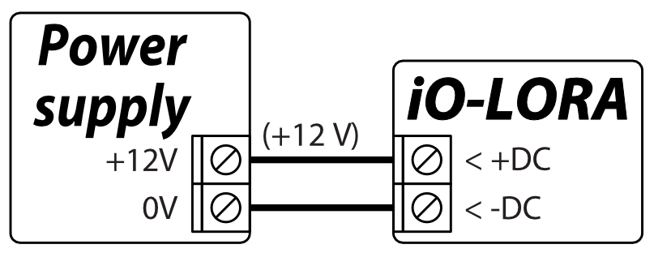

### Schematic for connecting input 

iO-LORA has one input. Input type can be set: NC, NO.

  <figure style="margin: 0;">
    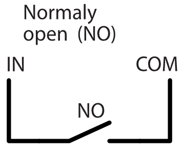
  </figure>
  <figure style="margin: 0;">
    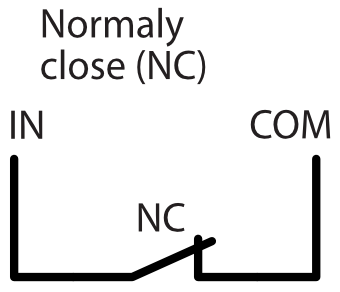
  </figure>

### Schematic for connecting a temperature sensor 

Temperature sensors should be connected according to the given schematic. Maxim®/Dallas® DS18S20, DS18B20 temperature sensor (1 pcs.) can be connected to the *iO-LORA* wireless expander. / If a wire longer than 0,5 meters is used to connect a temperature sensor, we recommend using twisted pair cable (UTP4x2x0,5 or STP4x2x0,5). / The „+5V” terminal on the board is for supplying devices connected to the "1-Wire" data bus with 5 V DC voltage.

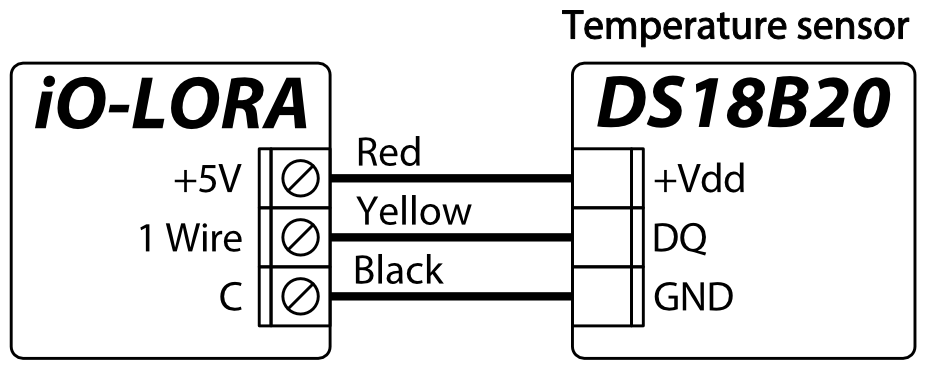

The maximum output current is 0,2 A. The output is protected from overload. If the maximum allowed current is exceeded, the power will automatically be switched off. The "FLEXi" SP3 control panel automatically recognizes and links connected temperature sensor.

### Schematics for connecting CZ-Dallas reader 

The **CZ-Dallas** iButton key reader connects to the iO-LORA using the "**1 Wire**" data bus. The length of the wires connecting to the data bus can be up to 30 m.

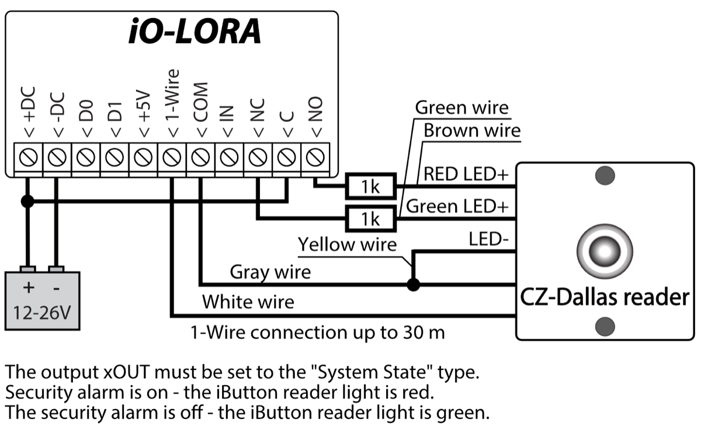

### Schematics for connecting iO-LORA modules 

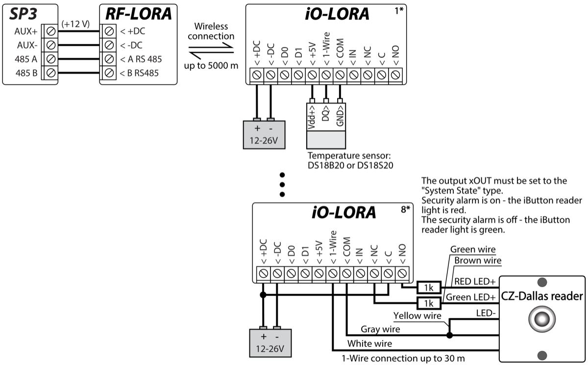

!!! note
    An RF-LORA transceiver must be connected to the "FLEXi"
    SP3 control panel and then up to 8 pcs. can be connected
    iO-LORA wireless expanders. / It is recommended to use a twisted
    pair cable (UTP4x2x0.5 or STP4x2x0.5) to connect the temperature
    sensor. / **CZ-Dallas** iButton key readers and temperature sensor must
    be connected to "**1-Wire**" bus**.**
# Security control panel “FLEXi” SP3

  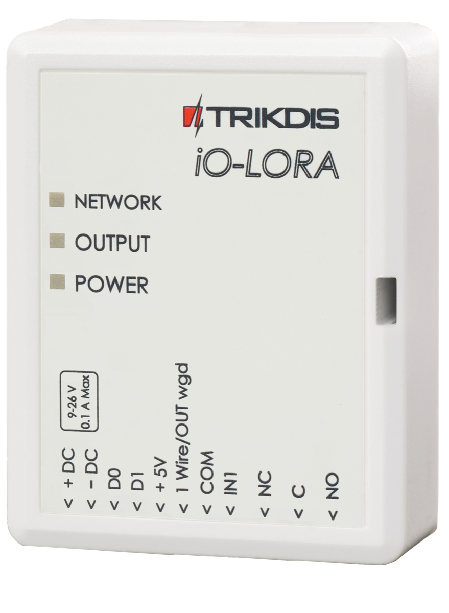

1.  An RF-LORA transceiver must be connected to the "FLEXi" SP3 control panel.

2.  Turn on the power supply of the "FLEXi" SP3 control panel.

3.  Turn on the power supply to the iO-LORA wireless expander.

4.  Launch ***TrikdisConfig**.*

5.  Connect the "FLEXi" SP3 to a computer using a USB Mini-B cable or connect to the "FLEXi" SP3 remotely.

6.  Click the button **Read [F4]** for the program to read the parameters currently set for the "FLEXi" SP3 control panel. If a window for entering the Administrator code opens, enter the six-symbol administrator code.

7.  In the "**Modules**" list, select "**iO-LORA expander**".

8.  In the "**Serial No.**" field, enter the serial number of the module iO-LORA.

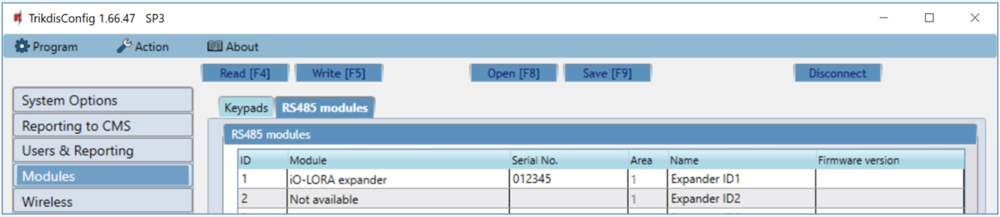

9.  In the "**Zones**" tab, make settings for the expander's input.

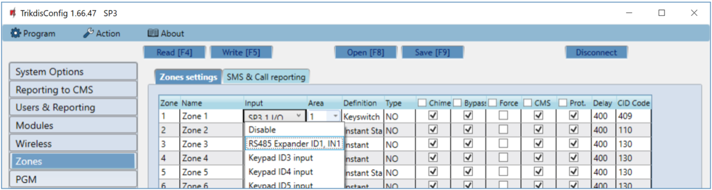

10. In the "**PGM**" tab, configure the expander's PGM output.

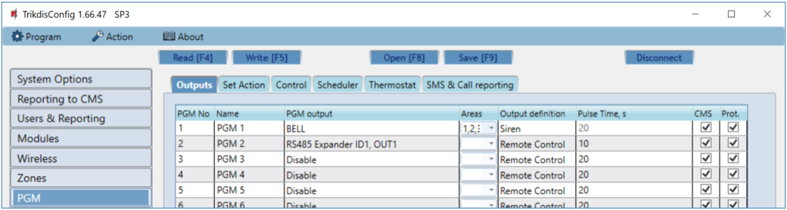

11. Temperature sensors will be included in the "**Sensors**" list if a temperature sensor is connected to the iO-LORA expander.

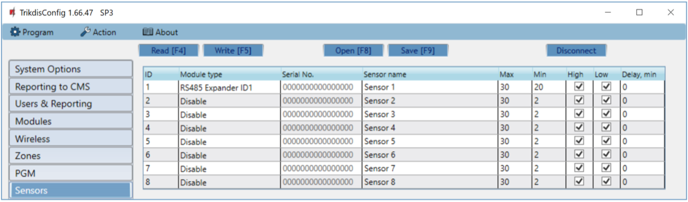

12. Once configuration is complete, click the **Write [F5]** button.

13. Wait for the updates to finish.

14. Click the "**Disconnect**" button and disconnect the USB cable.

## Safety precautions 

The iO-LORA wireless expander should only be installed and maintained by qualified personnel.

Please read this manual carefully prior to installation in order to avoid mistakes that can lead to malfunction or even damage to the equipment.

Always disconnect the power supply before making any electrical connections.

Any changes, modifications or repairs not authorized by the manufacturer shall render the warranty void.

Please adhere to your local waste sorting regulations and do not dispose of this equipment or its components with other household waste.
