# iO8-LoRa Wireless Expander

  

## Description 

iO-8-LORA wireless expanders with RF-LORA transceiver increase the number of inputs and outputs of the "FLEXi" SP3 security panel using two-way RF communication.

Compatible with the [SP3](../../control-panels/sp3/index.md) security control panel and [GATOR Cellular](../../gate-controllers/gator/index.md) gate & door access controller.
The iO-8-LORA wireless expander has 8 I/O terminals, each of which can be set as an input (IN) or as an output (OUT).

### Features

**Communication:**

- Line-of-sight wireless range up to 5000 m.

- Up to 8 *iO-8-LORA* wireless expanders can be connected to the *"FLEXi" SP3* control panel.

- Products from HW iO8_x5xx_7_230419 version come with a standard antenna suitable for most applications. <u>In cases where it is necessary to provide high-quality communication at the maximum possible distance, an antenna (AX-ANT-KIT – 433 MHz, AX-ANT01S SF – 868 MHz) with a higher radio signal gain should be used</u>.

Inputs and outputs:
- 8 I/O terminals, each one can be set as an input (IN) or output (OUT). Input (IN) types: ATZ, EOL, NC, NO. Different value of resistors can be used in EOL and ATZ type circuits.

**Connection:**

- The iO-8-LORA wireless expander is connected to the "FLEXi" SP3 control panel via the RF-LORA transceiver***.***

### Specifications 

| Parameter | Description |
|----|----|
| Transmission frequency | 4F modification: 433,3 - 434,7 MHz /​ 8F modification: 867 - 869 MHz |
| Modulation type | LORA |
| Power supply voltage | 10-26 V DC |
| Current consumption | Up to 50 mA (stand-by) /​ Up to 120 mA (short-term, while sending) |
| Report encryption | Yes |
| Range in open space | Up to 5000 m |
| Dual purpose terminals [I/​O] | 8, IN or OUT function selected during programming. When IN is selected, available types: NC, NO, EOL, EOL_T, 3EOL, ATZ, ATZ_T. When OUT is selected, the terminal becomes open collector (OC) type with up to 100 mA current |
| Operating environment | Temperature from –20 °C to +50 °C, relative humidity – up to 80% at +20 °C |
| Dimensions | 65 x 90 x 12 mm |
| Weight | 80 g |

### Expander elements 

|  |
|--|
| Note: |

### Purpose of terminals 

| Terminal | Description                           |
|----------|---------------------------------------|
| +DC      | Power terminal (10-26 V DC positive)  |
| -DC      | Power terminal (109-26 V DC negative) |
| A        | Terminal A of *RS485* data bus        |
| B        | Terminal B of *RS485* data bus        |
| 1- 8     | Input/​output terminals                |
| C        | Common negative terminal              |

### LED indication of operation 

| Indicator | Light status | Description |
|-----------|--------------|-------------|
| NETWORK | Off | No RF signal |
| NETWORK | Green blinking | RF signal level from 0 to 10. Sufficient strength is 3 |
| POWER | Off | No supply voltage |
| POWER | Green blinking | Normal supply voltage level |
| POWER | Yellow blinking | Low supply voltage level (≤11.5 V) |

## Wiring schematics 

### Schematic for connecting the power supply 

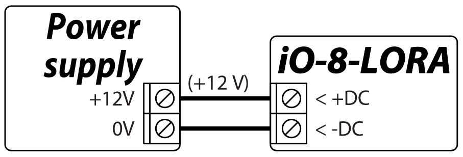

### Schematics for connecting inputs 

There are 8 terminals IO1–IO8 (inputs) on the iO-8-LORA expander board for connecting sensor circuits. Any terminal can be set as an input and assigned zone attributes: circuit type (NO, NC, EOL, EOL_T, 3EOL, ATZ, ATZ_T); sensitivity to temporary circuit events; zone function (Delay, Instant, Instant Stay, Interior, Interior Stay, Fire, Keyswitch, 24_hour, Silent, Silent 24h).

  <figure style="margin: 0;">
    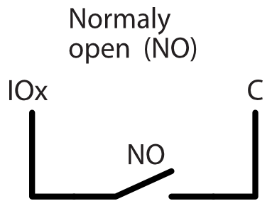
  </figure>
  <figure style="margin: 0;">
    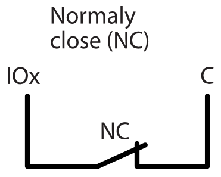
  </figure>
  <figure style="margin: 0;">
    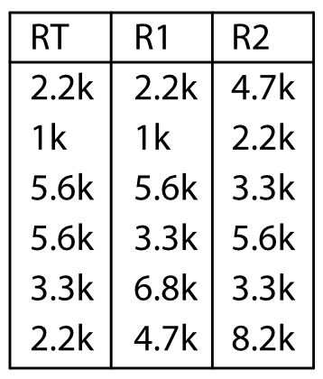
  </figure>

  <figure style="margin: 0;">
    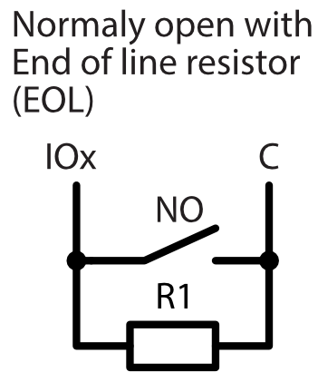
  </figure>
  <figure style="margin: 0;">
    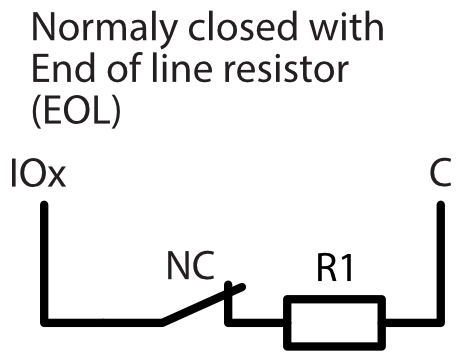
  </figure>
  <figure style="margin: 0;">
    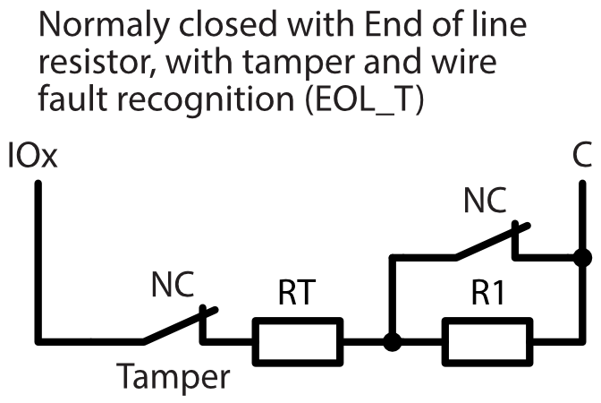
  </figure>

  <figure style="margin: 0;">
    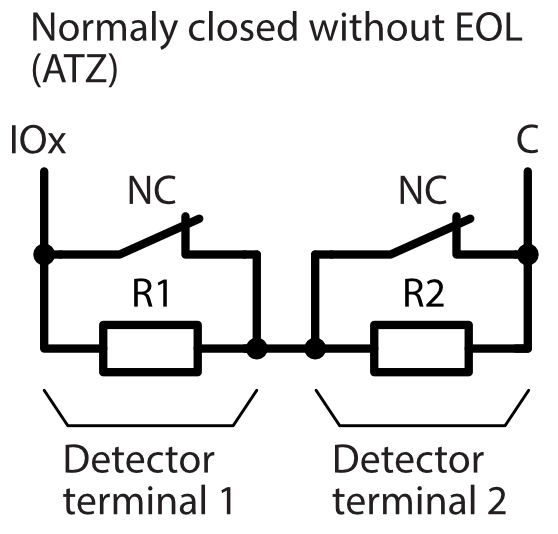
  </figure>
  <figure style="margin: 0;">
    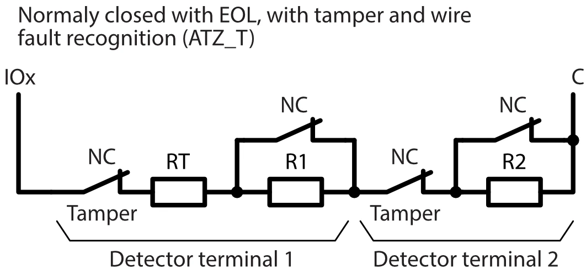
  </figure>

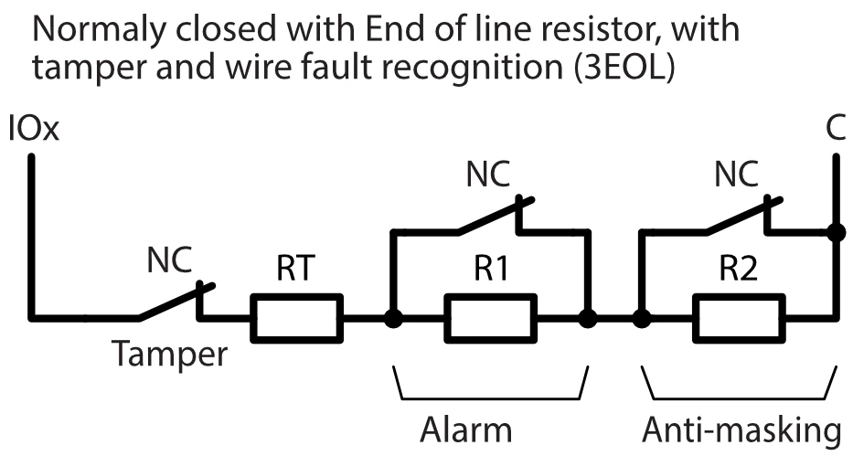

### Schematic for connecting a relay 

Using the relay terminals, it is possible to remotely control (turn on/off) various electrical devices. The *iO-8-LORA* wireless expander universal I/O terminal must be configured as an output (OUT) and must have the definition "Remote control" assigned.

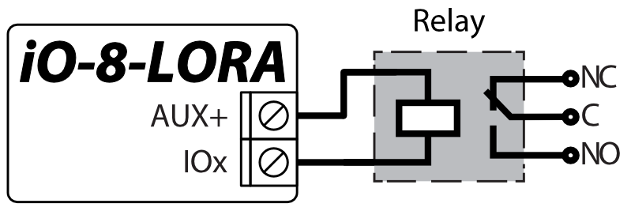

### Schematic for connecting iO-8-LORA expanders to the control panel "FLEXi" SP3 

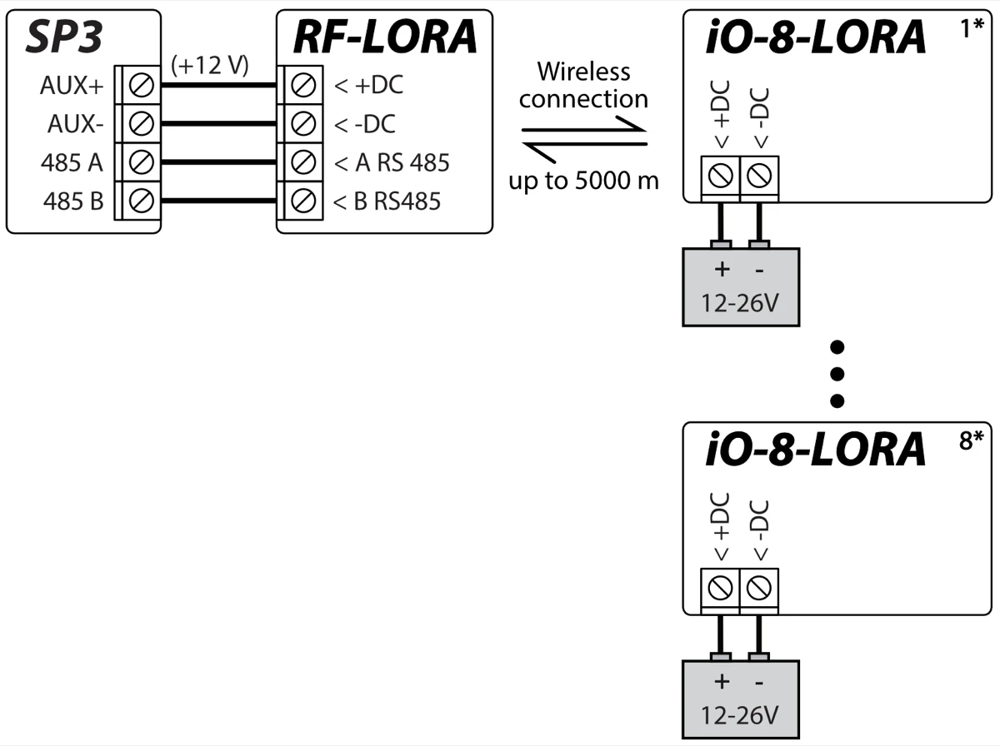

!!! note
    An RF-LORA transceiver must be connected to the "FLEXi"
    SP3 security panel and then up to 8 pcs. can be connected
    iO-8-LORA wireless expanders**.**
## Security control panel “FLEXi” SP3

1.  An RF-LORA transceiver must be connected to the "FLEXi" SP3 control panel.

2.  Turn on the power supply of the "FLEXi" SP3 control panel.

3.  Turn on the power supply to the iO-8-LORA wireless expander.

4.  Launch ***TrikdisConfig**.*

5.  Connect the "FLEXi" SP3 to a computer using a USB Mini-B cable or connect to the "FLEXi" SP3 remotely.

6.  Click the button **Read [F4]** for the program to read the parameters currently set for the "FLEXi" SP3 control panel. If a window for entering the Administrator code opens, enter the six-symbol administrator code.

7.  In the "**Modules**" list, select "**iO-8-LORA expander**".

8.  In the "**Serial No.**" field, enter the serial number of the module iO-8-LORA.

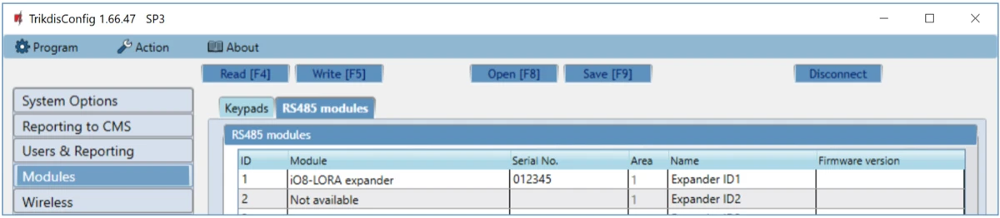

9.  In the "**Zones**" tab, make settings for the expander's inputs**.**

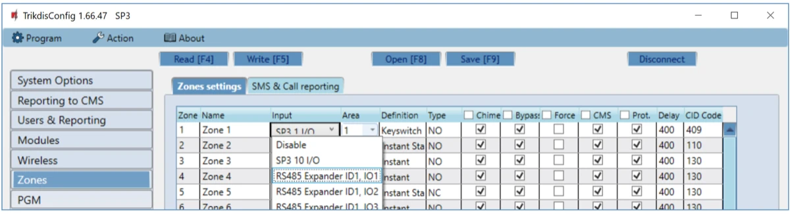

10. In the "**PGM**" tab, configure the expander's PGM outputs**.**

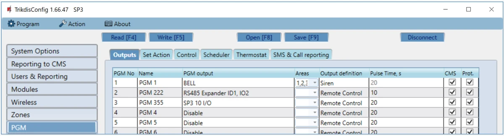

11. Once configuration is complete, click the **Write [F5]** button.

12. Wait for the updates to finish.

13. Click the "**Disconnect**" button and disconnect the USB cable.

## Safety precautions 

The iO-8-LORA wireless expander should only be installed and maintained by qualified personnel.

Please read this manual carefully prior to installation in order to avoid mistakes that can lead to malfunction or even damage to the equipment.

Always disconnect the power supply before making any electrical connections.

Any changes, modifications or repairs not authorized by the manufacturer shall render the warranty void.

Please adhere to your local waste sorting regulations and do not dispose of this equipment or its components with other household waste.
