# PB-LoRa Wireless Panic Button

  

## Description 

The product PB-LORA is designed to transmit the emergency call message wirelessly. The call for help is initiated by pressing the button. The RF-LORA module is used as a message receiving device, which is connected to the control panel "FLEXi" SP3.

Compatible with the [SP3](../../control-panels/sp3/index.md) security control panel.

8 PB-LORA panic buttons can be assigned to the control panel if the firmware version 1.17 or higher is used (eg: SP3_xxxx_0117.fw). When the control panel is loaded release 2 firmware with version 1.16 or higher (eg: SP3_xxx2_0116.fw), 250 PB-LORA panic buttons can be assigned to the control panel.

### Features

**Communication:**

- Line-of-sight wireless range up to 5000 m.

**Connection:**

- The *PB-LORA* wireless panic button is connected to the *"FLEXi" SP3* control panel via the *RF-LORA* transceiver.
### Specifications 

| Parameter | Description |
|----|----|
| Transmission frequency | 433,3-434,7 MHz |
| Modulation type | LORA |
| Power supply voltage | 3 V, battery CR123A |
| Battery life | At least 3 years |
| Current consumption | Up to 0,008 mA (stand-by) /​ Up to 50 mA (short-term, while sending) |
| Report encryption | Yes |
| Operating distance in open space | Up to 5000 m |
| Operating environment | Temperature from –10 °C to +50 °C, relative humidity – up to 80% at +20 °C |
| Dimensions | 62 x 77 x 25 mm |
| Weight | 80 g |

### Wireless Panic button elements 

1. Light indicator.
2. Frontal case opening slot.
3. Battery 3 V (CR123A).
4. "TAMP" button for linking the device and checking the connection.
5. DIP switch "SW".

!!! note "DIP switch 'SW' settings"
    1. Radio frequency ("OFF" - RF1; "ON" - RF2). Intended for changing the radio channel if the current channel is heavily loaded.
    2. Modulation type ("OFF" - fast; "ON" - slow). The "ON" position allows you to increase the communication distance by about 2 times (depending on the environmental conditions). But if a quality connection is ensured using the "Off" position, it is recommended to use it. In the "On" position, battery consumption increases and system performance decreases.

    **NOTE:** In PB-LORA and RF-LORA devices, the positions of the "SW" switch must match! Otherwise, the radio communication will not work!

### LED indication of operation 

| Indicator | Action | Description |
|-----------|--------|-------------|
| NETWORK | After pressing the "Alarm" button | First blink green - message sent, battery voltage is good. |
| NETWORK | First blink red - sending message, battery voltage is low. | First blink green - message sent, battery voltage is good. |
| NETWORK | The second red blink - confirmation of message reception from the RF-LORA module has been received. |  |
| NETWORK | After pressing the "TAMP" button |  |
| NETWORK | First blink red - sending message, battery voltage is low. |  |
| NETWORK | The second red blink - confirmation of message reception from the RF-LORA module has been received. |  |
| NETWORK | Third to twelfth blinks - radio signal level. * |  |

\* recommended to use when there are at least four flashes.

NOTE: after installing the battery, it is recommended to wait at least 10 seconds before using the device.  

## Wiring schematics 

### Fastening 

1.  Remove the top lid.

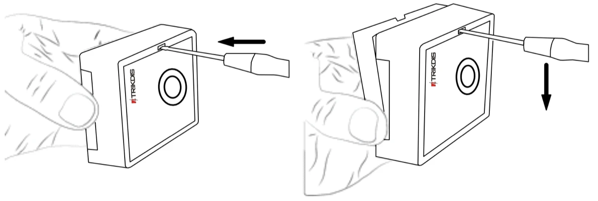

2.  Remove the PCB board.

3.  Fasten the base of the case in the desired place using screws.

4.  Reinsert the PCB board.

5.  Insert the battery into the module.

6.  Close the top lid.

### Schematic for connecting of the wireless PB-LORA panic button 

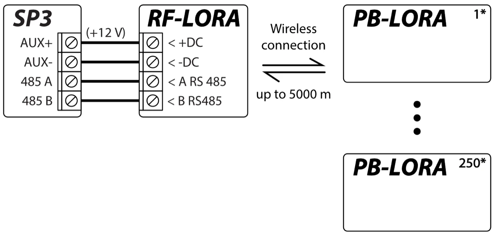

!!! note
    The RF-LORA transceiver must be connected to the "FLEXi"
    SP3 control panel, and up to 8 PB-LORA wireless panic
    buttons (control panel firmware version 1.17 or higher. Example:
    SP3_xxxx_0117.fw) or up to 250 pcs. PB-LORA wireless panic buttons
    (control panel release 2 firmware with version 1.16 or higher. Example:
    SP3_xxx2_0116.fw).
## Security control panel “FLEXi” SP3

"*FLEXi*" *SP3* control panel must have firmware with version 1.17 or higher (for example, SP3_xxxx_0117.fw).

1.  An RF-LORA transceiver must be connected to the "FLEXi" SP3 control panel.

2.  Turn on the power supply of the "FLEXi" SP3 control panel***.***

3.  The PB-LORA wireless panic button must have a battery installed.

4.  Launch ***TrikdisConfig**.*

5.  Connect the "FLEXi" SP3 to a computer using a USB Mini-B cable or connect to the "FLEXi" SP3 remotely.

6.  Click the button **Read [F4]** for the program to read the parameters currently set for the "FLEXi" SP3 control panel. If a window for entering the Administrator code opens, enter the six-symbol administrator code.

7.  In the "**Modules**" list, select "**PB-LORA Panic button**"**.**

8.  In the "**Serial No.**" field, enter the serial number of the PB-LORA.

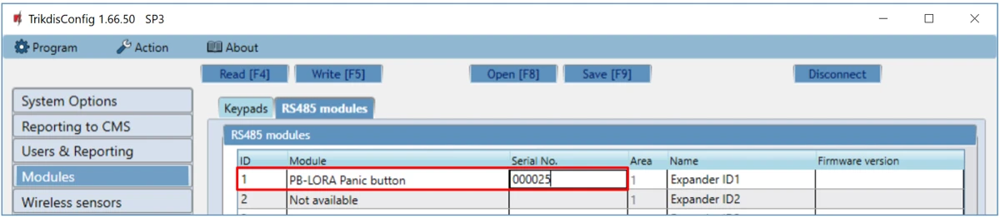

9.  In the "**Zones**" tab, make settings for the panic button.

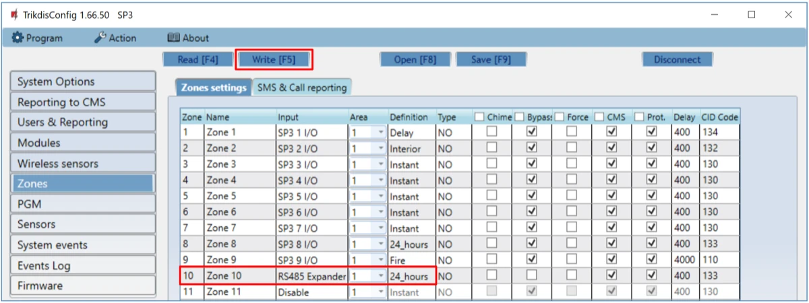

10. Once configuration is complete, click the **Write [F5]** button.

11. Wait for the updates to finish.

12. Click the "**Disconnect**" button and disconnect the USB cable.

13. Wait 1 minute. Press the "Alarm" button on the PB-LORA module.

14. Connect the USB Mini-B cable to “FLEXi” SP3.

15. Click the button **Read [F4].**

16. The firmware version of the PB-LORA will appear in the “**Modules**” window.

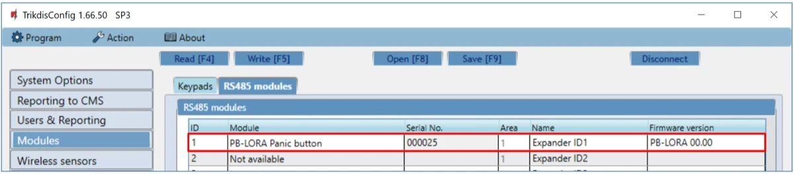

17. Click the "**Disconnect**" button and disconnect the USB cable.

!!! note
    Deleting PB-LORA wireless panic buttons from "FLEXi"
    SP3's memory:
    
    1.  Launch ***TrikdisConfig**.*
    
    2.  Connect the „FLEXi" SP3 to a computer using a USB Mini-B cable
        or connect to the „FLEXi" SP3 remotely. Click the
        **Read [F4]** button.
    
    3.  In the TrikdisConfig window "**Modules**", in the column
        "**Module**", select "**Not available**" instead of the "**PB-LORA
        Panic button**" that you wish to delete and click **Write [F5]**.
        The wireless panic button is now removed from the "FLEXi"
        SP3's memory.
## Registration of 250 wireless PB-LORA panic buttons to the control panel "FLEXi" SP3 

"*FLEXi*" *SP3* control panel must have release 2 firmware with version 1.16 or higher (for example, SP3_xxx2_0116.fw).

1.  An RF-LORA transceiver must be connected to the "FLEXi" SP3 control panel.

2.  Turn on the power supply of the "FLEXi" SP3 control panel***.***

3.  The PB-LORA wireless panic button must have a battery installed.

4.  Launch ***TrikdisConfig**.*

5.  Remotely connect to "FLEXi" SP3.

!!! warning "Important"
    Remote configuration will only work when "FLEXi" SP3:

    1.  The WiFi/LAN communication channel is configured or an activated SIM
        card is inserted and the PIN code is entered or disabled.

    2.  Mobile internet is activated on the SIM card.

    3.  Protegus cloud service must be enabled.

    4.  The power must be switched on ("**PWR**" LED must be green
        blinking).

    5.  Must be connected to network ("**NET**" LED must be green solid and
        yellow blinking).
6.  Launch the configuration program TrikdisConfig and in the field “**Unique ID”** of the “**Remote access**” section enter the IMEI number of „FLEXi“ SP3. The IMEI number is given on the stickers that can be found on the control panel and on the packaging.

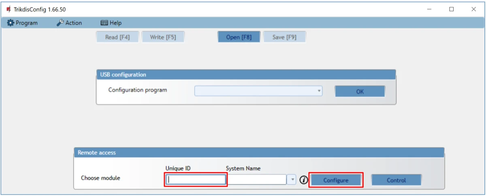

7.  Click „**Configure”**.

8.  Click the button **Read [F4]** for the program to read the parameters currently set for the "FLEXi" SP3. If a window for entering the Administrator code opens, enter the six-symbol administrator code.

9.  In the "**Modules**" list, select "**RF-LORA transceiver**"**.**

10. In the "**Serial No.**" field, enter the serial number of the RF-LORA.

11. Click the **Write [F5]** button.

12. Wait for the updates to finish.

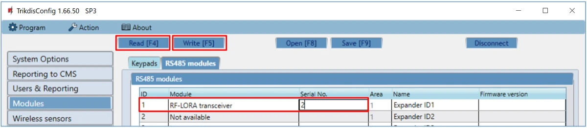

13. Wait 1 minute.

14. Click **Read [F4]**.

15. The firmware version of the “**RF-LORA transceiver**” will appear in the “**Modules**” window**.**

16. Go to the “**Wireless sensor**” window.

17. Click the “**Learn sensors**” button.

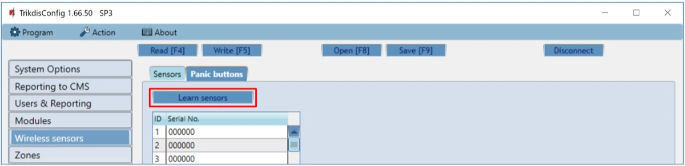

All wireless panic buttons can be linked simultaneously.

When enrolling PB-LORA panic buttons, the *RF-LORA* module must be at least 1 m from the buttons.

18. The "**DATA/TROUBLE**" LED indicator will start flashing red/green in the RF-LORA module.

19. RF-LORA module switches to learning mode. TrikdisConfig will open the panic button binding window.

20. Briefly press the "**TAMP**" button on the PB-LORA board.

21. The “**DATA/TROUBLE**” LED on the RF-LORA module will turn green for a few seconds. After that, the “**DATA/TROUBLE**” LED on the RF-LORA module will continue flashing red/green.

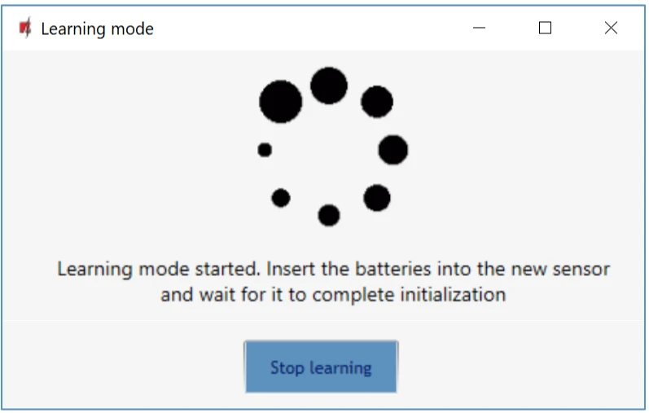

22. After a few seconds, the PB-LORA panic button will be added to the list of sensors.

23. The “**UID**” number must match the serial number of the PB-LORA shown on the sticker on the button.

24. If you need to add the next panic button, you need to press the "**TAMP**" button on the board for a short time.

25. Click “**Stop learning**” to complete the registration of wireless panic buttons.

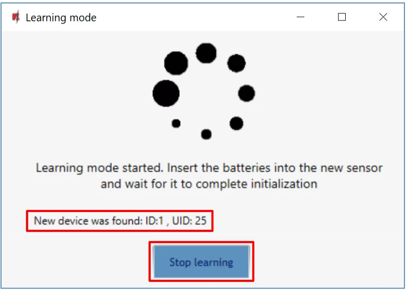

26. Click “**Yes**” for the sensors to be written to the “FLEXi” SP3 control panel.

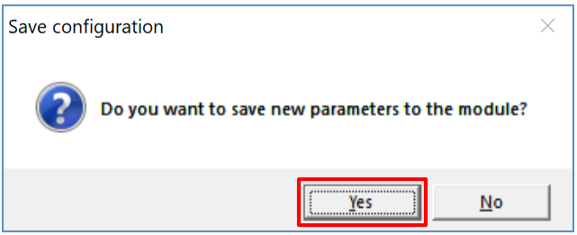

Wait a few minutes. Click **Read [F4].**

TrikdisConfig will display a list of registered wireless panic buttons in the “**Wireless**” window. The “**Serial No.**” field will list the serial number that must match the PB-LORA panic button serial number written on the back of the case.

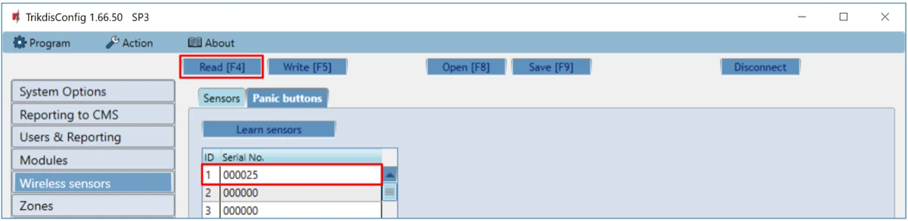

!!! note
    To delete wireless PB-LORA panic buttons from the ***"FLEXi"
    SP3's*** memory:
    
    1.  Launch ***TrikdisConfig**.*
    
    2.  Connect the „FLEXi" SP3 to a computer using a USB Mini-B cable
        or connect to the „FLEXi" SP3 remotely. Click the
        **Read [F4]** button.
    
    3.  In TrikdisConfig, in the "**Wireless sensors**" window,
        enter "**0**" in the "**Serial No.**" field and press **Write
        [F5]**. PB-LORA wireless panic button is deleted from
        "FLEXi" SP3 memory.
## Safety precautions 

The PB-LORA wireless panic button should only be installed and maintained by qualified personnel.

Please read this manual carefully prior to installation in order to avoid mistakes that can lead to malfunction or even damage to the equipment.

Always disconnect the power supply before making any electrical connections.

Any changes, modifications or repairs not authorized by the manufacturer shall render the warranty void.

Please adhere to your local waste sorting regulations and do not dispose of this equipment or its components with other household waste.
