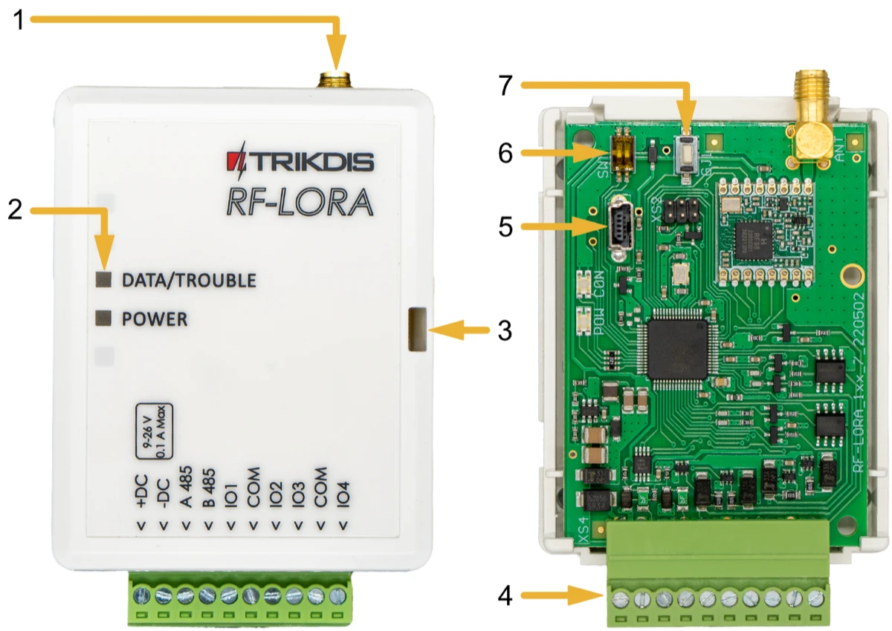
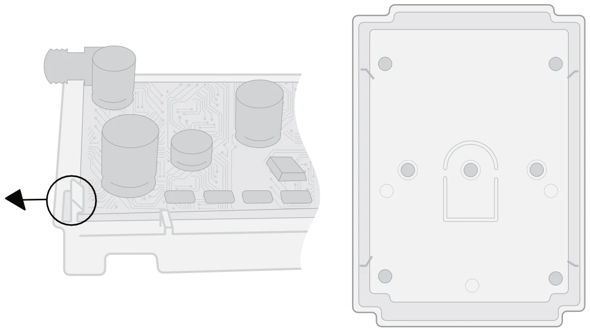
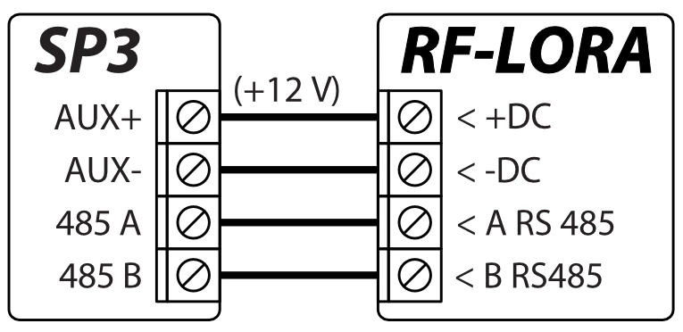
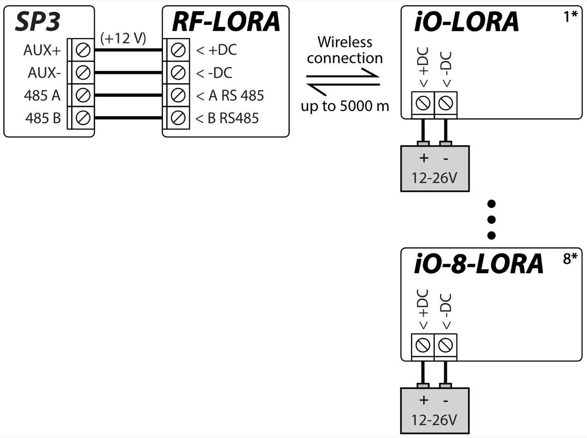
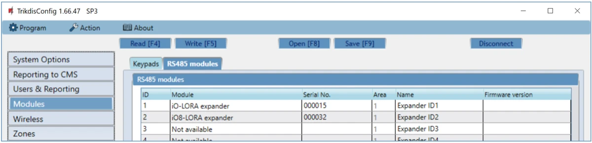
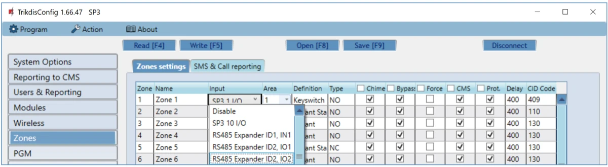
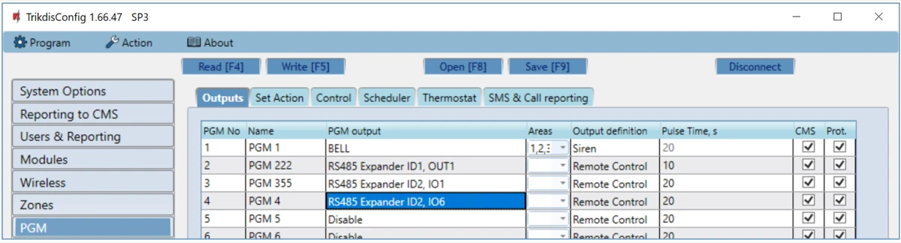

# RF-LoRa Wireless Expander

  

## Description

The **RF-LORA** transceiver with iO-LORA and iO-8-LORA wireless expanders increases the number of inputs and outputs of the "FLEXi" SP3 control panel using two-way RF communication.

Compatible with the [SP3](../../control-panels/sp3/index.md) security control panel, [GATOR Cellular](../../gate-controllers/gator/index.md) and [GATOR WiFi](../../gate-controllers/gator-wifi/index.md) gate & door access controllers.
Up to 8 LORA modules (iO-LORA, iO-8-LORA, PB-LORA) can be connected to the "FLEXi" SP3 control panel using the RF-LORA transceiver.

### Features

**Communication:**

- Line-of-sight wireless range up to 5000 m.

- One *RF-LORA* transceiver can be connected to the *"FLEXi" SP3* control panel.

- The product comes with a standard antenna suitable for most applications. <u>In cases where it is necessary to provide high-quality communication at the maximum possible distance, an antenna (AX-ANT-KIT – 433 MHz, AX-ANT01S_SF – 868 MHz) with a higher radio signal gain should be used</u>.

**Connection:**

- The *RF-LORA* transceiver is connected to the *"FLEXi" SP3* control panel via the RS485 bus.
### Specifications 

| Parameter | Description |
|----|----|
| Transmission frequency | 8F modification: 867-869 MHz /​ 4F modification: 433,3-434,7 MHz |
| Modulation type | LORA |
| Power supply voltage | 9-26 V DC |
| Current consumption | Up to 50 mA (stand-by) /​ Up to 150 mA (short-term, while sending) |
| Report encryption | Yes |
| Range in open space | Up to 5000 m |
| Operating environment | Temperature from –20 °C to +50 °C, relative humidity – up to 80% at +20 °C |
| Dimensions | 62 x 82 x 25 mm |
| Weight | 80 g |

### Expander elements

1. SMA connector for RF antenna.
2. Light indicators.
3. Frontal case opening slot.
4. Terminal for external connections.
5. USB Mini-B connector is for firmware update.
6. DIP switch "SW".
7. "DJ1" button to enable/disable LORA module learning mode.

!!! note "DIP switch 'SW' settings"
    1. Radio frequency ("OFF" - RF1; "ON" - RF2). Intended for changing the radio channel if the current channel is heavily loaded.
    2. Modulation type ("OFF" - fast; "ON" - slow). The "ON" position allows you to increase the communication distance by about 2 times (depending on the environmental conditions). But if a quality connection is ensured using the "Off" position, it is recommended to use it.

    **NOTE:** In RF-LORA and other LORA modules, switch positions "SW" must match! Otherwise, the radio communication will not work!

### Purpose of terminals 

| Terminal | Description                         |
|----------|-------------------------------------|
| +DC      | Power terminal (9-26 V DC positive) |
| -DC      | Power terminal (9-26 V DC negative) |
| A 485    | *RS485* bus A contact               |
| B 485    | *RS485* bus B contact               |
| IO1-IO4  | Not used                            |
| COM      | Not used                            |

### LED indication of operation 

| Indicator | Light status | Description |
|-----------|--------------|-------------|
| DATA/TROUBLE | Blinking/Lighting red | Communication with the module is broken |
| DATA/TROUBLE | Blinking green/red | LORA modules linking mode |
| DATA/TROUBLE | Green lights up for 3 seconds | Pre-bound LORA module (in learning mode) |
| POWER | Off | No supply voltage |
| POWER | Green blinking | Normal supply voltage level |
| POWER | Yellow blinking | Low supply voltage level (≤11.5 V) |
| POWER | Yellow | No communication with "FLEXi" SP3 control panel via RS485 |

## Wiring schematics 

### Fastening 

1.  Remove the top lid.

2.  Remove the PCB board.

3.  Fasten the base of the case in the desired place using screws.

4.  Reinsert the PCB board.

5.  Close the top lid.

### Schematic of RF-LORA transceiver connection to "FLEXi" SP3 control panel 

### Schematics for connecting LORA modules 

## Configuration with TrikdisConfig

1.  An RF-LORA transceiver must be connected to the "FLEXi" SP3 control panel.

2.  Turn on the power supply of the "FLEXi" SP3 control panel.

3.  Turn on the power supply to the iO-LORA and/or iO-8-LORA wireless expanders.

4.  Launch ***TrikdisConfig**.*

5.  Connect the "FLEXi" SP3 to a computer using a USB Mini-B cable or connect to the "FLEXi" SP3 remotely.

6.  Click the button **Read [F4]** for the program to read the parameters currently set for the "FLEXi" SP3 control panel. If a window for entering the Administrator code opens, enter the six-symbol administrator code.

7.  In the "**Modules**" list, select "**iO-LORA expander**" ("**iO-8-LORA expander**").

8.  In the "**Serial No.**" field, enter the serial number of the module iO-LORA (iO-8-LORA).

9.  In the "**Zones**" tab, make settings for the expander's input.

10. In the "**PGM**" tab, configure the expander's PGM output.

11. Once configuration is complete, click the **Write [F5]** button.

12. Wait for the updates to finish.

13. Click the "**Disconnect**" button and disconnect the USB cable.

14. Trigger the inputs and switch outputs to test the device.

## Safety precautions 

Only qualified personnel may install and maintained the intrusion alarm module.

Please read this manual carefully prior to installation in order to avoid mistakes that can lead to malfunction or even damage to the equipment.

Always disconnect the power supply before making any electrical connections.

Any changes, modifications or repairs not authorized by the manufacturer shall render the warranty void.

Please adhere to your local waste sorting regulations and do not dispose of this equipment or its components with other household waste.
