# RF-S8 Wireless Transceiver

  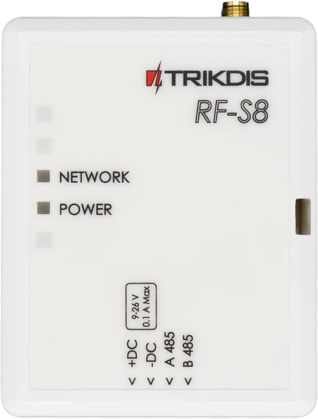

## Description 

By connecting the RF-S8 transceiver, the *„**FLEXi“ SP3 can work with “S8***” wireless sensors, sirens, and remote controls.

Compatible with the [SP3](../../control-panels/sp3/index.md) security control panel.

### Features

**Communication:**

- Line-of-sight wireless range up to 500 m.

- One *RF-S8* transceiver can be connected to the *"FLEXi" SP3* control panel.

- The product comes with a standard antenna suitable for most applications.

**Connection:**

- The *RF-S8* transceiver is connected to the *"FLEXi" SP3* control panel via the RS485 bus.
### Technical specifications 

| **Parameter** | **Description** |
|----|----|
| Power supply voltage [DC] | 9-26 V DC |
| Current consumption | Up to 50 mA (stand by), /​ Up to 100 mA (short-term, while sending) |
| Radio frequency | 868 MHz |
| Radio signal strength | 25 mW |
| Communication distance | Up to 500 m |
| Operating environment | Temperature from -10 °C to +50 °C, relative humidity 80% at +20°C, no condensation. |
| Dimensions | 92x62x25 mm |
| Weight | 0,08 kg |

### Transceiver elements 

1.  SMA connector for RF antenna.

2.  Light indicators.

3.  Frontal case opening slot.

4.  Terminal for external connections.

5.  USB Mini-B connector is for firmware update.

6.  Learning mode on/off button.

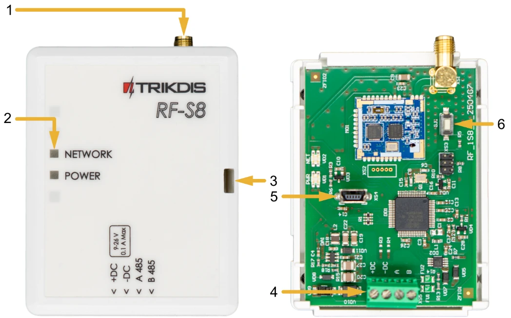

### Purpose of terminals 

| **Terminal** | **Description**                     |
|--------------|-------------------------------------|
| +DC          | Power terminal (9-26 V DC positive) |
| -DC          | Power terminal (9-26 V DC negative) |
| A 485        | *RS485* bus A contact               |
| B 485        | *RS485* bus B contact               |

### LED indication of operation 

| LED indicator | Light status | Description |
|---------------|--------------|-------------|
| NETWORK | Blinking green/red | Sensor learning mode |
| NETWORK | It lit up green for 5 sec. | Sensor learned (in learning mode) |
| POWER | Off | No supply voltage |
| POWER | Green blinking | Power supply voltage is normal |
| POWER | Yellow blinking | Power supply voltage is low (≤11.5 V). |
| POWER | Yellow solid | No communication with the control panel via RS485 |

## Control panel firmware replacement 

The “FLEXi” SP3 control panel firmware must be changed to revision 4 **SP3_xxx4\_0122.fw** (firmware version 1.22 or higher), which will ensure the operation of “**S8**” wireless sensors. The RF-S8 wireless transceiver must be connected to the control panel.

Follow the steps below to replace the firmware:

1.  Connect the RF-S8 transceiver and the “FLEXi” SP3 according to the diagram.

2.  Switch on the power supply to the “FLEXi” SP3 control panel.

3.  Launch ***TrikdisConfig**.*

4.  Connect the “FLEXi” SP3 to a computer using a USB Mini-B cable.

5.  Open the TrikdisConfig window “**Firmware**”.

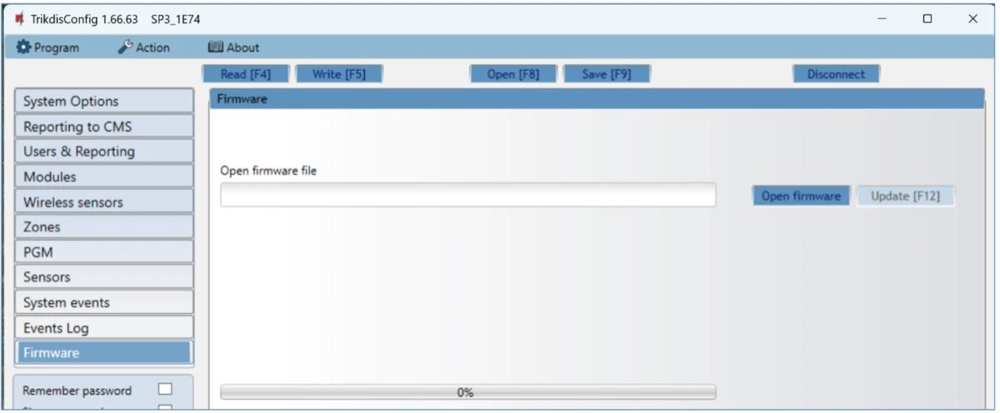

6.  Click the “**Open Firmware**” button and select the **SP3_xxx4\_0122.fw** firmware file.

7.  Click the **Update [F12]** button.

8.  Wait for the updates to finish.

9.  Disconnect the USB Mini-B cable.

10. Wait 1 minute.

11. Connect a USB Mini-B cable to the “FLEXi” SP3.

12. The TrikdisConfig status bar must contain the number 4 in the control panel name.

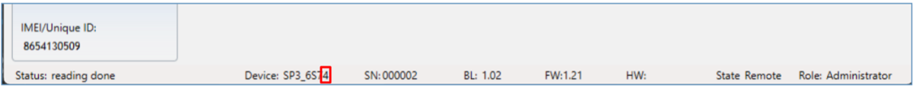

13. The list of modules should show "**RF-S8 transceiver**", as well as the serial number and firmware version. If you see the firmware version of the RF-S8 transceiver, you can skip steps 14-22.

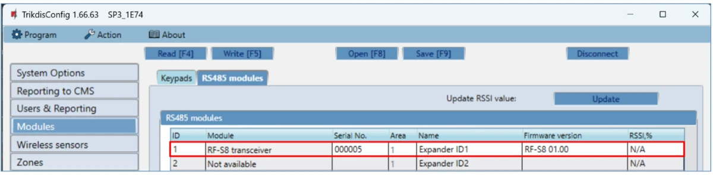

14. If the list does not indicate "**RF-S8 transceiver**", then you must select "**RF-S8 transceiver**" from the list.

15. In the “**Serial No.**” field, enter the serial number of the RF-S8 module. This serial number can be found on the device and the packaging sticker.

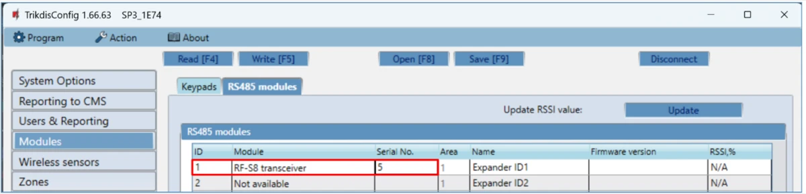

16. Click **Write [F5]**.

17. Disconnect the USB Mini-B cable.

18. Wait 1 minute for the “FLEXi” SP3 and RF-S8 to link together.

19. Connect a USB Mini-B cable to the “FLEXi” SP3.

20. Click **Read [F4]**.

21. The firmware version of the RF-S8 will appear in the “**Modules**” window.

22. The RF-S8 module is now linked to the “FLEXi” SP3.

23. Disconnect the USB Mini-B cable.

24. Click “**Disconnect**”.

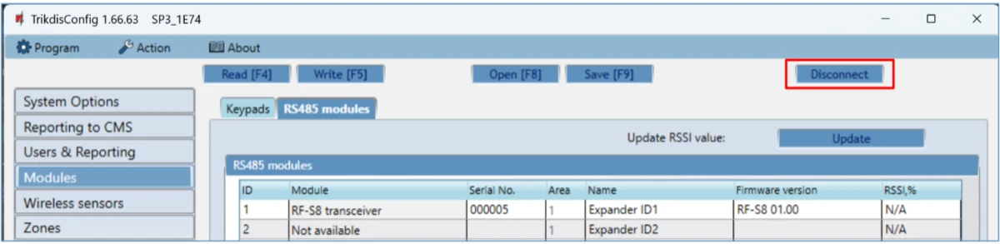

25. Wait 1 minute.

## Linking a wireless sensors 

### Remote linking of wireless sensors 

Using TrikdisConfig, remotely connect to the “FLEXi” SP3 control panel.

!!! warning "Important"
    Remote configuration will only work when "FLEXi" SP3:

    1.  An activated SIM card must be inserted and the PIN code must be
        entered or disabled.

    2.  Mobile internet is activated on the SIM card.

    3.  Protegus cloud service must be enabled.

    4.  The power must be switched on ("**PWR**" LED must be green
        blinking).

    5.  Must be connected to network ("**NET**" LED must be green solid and
        yellow blinking).

!!! warning "Important"
    **Wireless sensors can be enrolled to the control panel and can also
    be unenrolled from the control panel. <u>When unlinking wireless sensors
    from the security control panel, the security control panel must not
    be in the wireless sensor learning mode.</u> Before enrolling
    wireless sensors, they must be unenrolled from the control panel.
    Press and hold the learning button for 5 seconds. Release the button
    when the indicator flashes green three times. The wireless sensor will
    be unenrolled from the control panel** **It is recommended to perform
    this procedure for all wireless sensors before registering them.
    IMPORTANT: IF THE WIRELESS SENSOR IS ACCIDENTALLY UNPAIRED, IT WILL
    NOT WORK WITH THE SECURITY CONTROL PANEL.**

In the “**Remote access**” section enter the control panel “**IMEI/Unique ID**” number. This number can be found on the device and the packaging sticker.

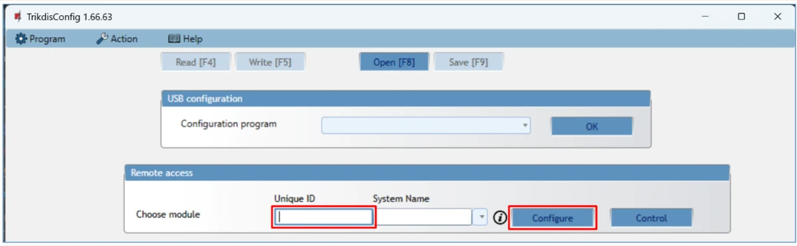

Click “**Configure**”.

In the newly opened window click **Read [F4]**. If required, enter the administrator or installer code.

Go to the “**Wireless sensors**” window.

Click the “**Learn sensors**” button.

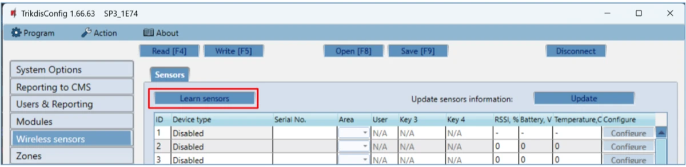

All wireless sensors can be linked simultaneously. Insert batteries into the wireless sensors (PIR, magnetic contact, flood detector, smoke detector, siren).

**When enrolling sensors, the *RF-S8* module must be at least 1 m from the sensors.**

1.  The “**NETWORK**” LED on the RF-S8 module will flash green/red.

2.  RF-S8 module - switches to learning mode. TrikdisConfig will open the sensor binding window.

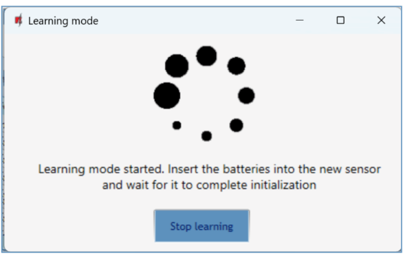

3.  Press and hold the learning button for 5 seconds. Release the button when the indicator flashes green four times.

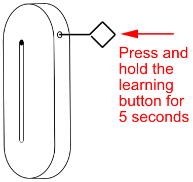

4.  On the RF-S8 module, the “**NETWORK**” LED will briefly turn green (this indicates that the sensor is enrolled). After a few seconds, the “**NETWORK**” indicator will start flashing green/red again.

5.  TrikdisConfig will open a new window in which you need to assign a “**Zone Number**” and “**Zone Definition**” to the wireless sensor.

6.  Click “**Save**”.

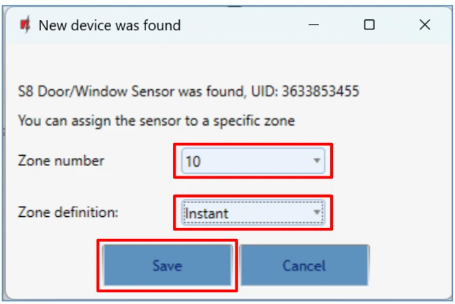

7.  Wireless sensor is included in the list of sensors.

8.  If you need to add the next sensor, you need to press the learning button on the sensor. And make the settings described above.

9.  Click “**Stop learning**” to complete the registration of wireless sensors.

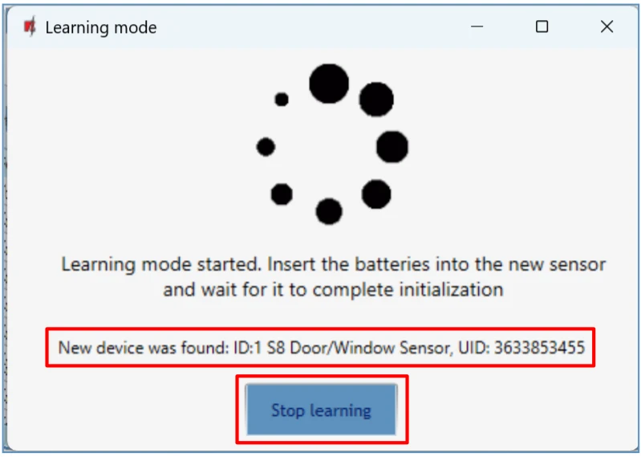

10. Click “**Yes**” for the sensors to be written to the “FLEXi” SP3 control panel or "**No**" if you want to adjust the parameters additionally.

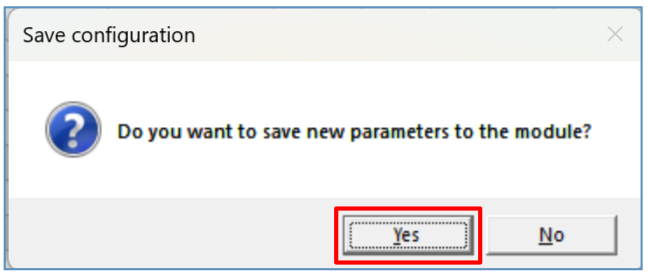

Wait a few minutes. Click **Read [F4].**

TrikdisConfig will display a list of registered wireless sensors in the “**Wireless sensors**” window. The “**Serial No.**” field will list the serial number.

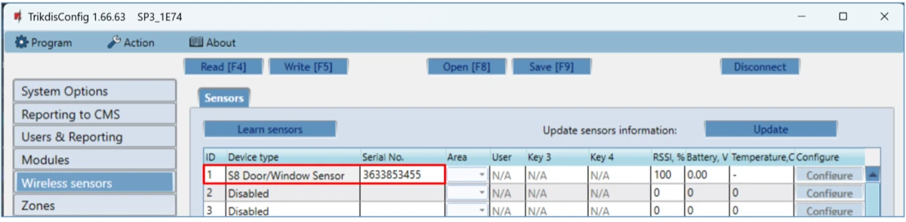

Check that the sensors are correctly assigned to the “**Zones”** and “**Areas**” of the control panel (“**Zones**” window).

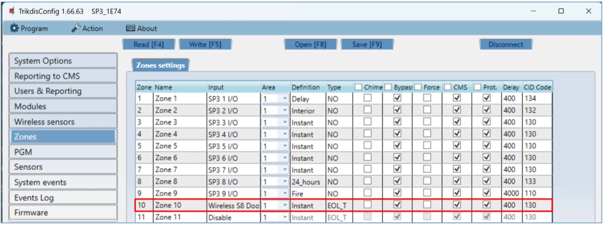

If you set zone **“Type”** EOL-T, then the sensor tamper monitoring mode will be enabled.

After making changes, press **Write [F5]**.

!!! note
    To delete wireless sensors from the "FLEXi" SP3's memory:
    
    1.  Launch ***TrikdisConfig**.*
    
    2.  Connect the „FLEXi" SP3 to a computer using a USB Mini-B cable
        or connect to the „FLEXi" SP3 remotely. Click the
        **Read [F4]** button.
    
    3.  In the TrikdisConfig window "**Wireless sensors**", in the
        column "**Device type**", select "**Disabled**" instead of the
        wireless sensor that you wish to delete and click **Write [F5]**.
        The wireless sensor is now removed from the "FLEXi"
        SP3's memory.
### Linking wireless sensors without remote access 

All wireless sensors can be linked simultaneously. Insert batteries into the wireless sensors (PIR, magnetic contact, flood detector, smoke detector, siren). **When enrolling sensors, the *RF-S8* module must be at least 1 m from the sensors.**

1.  Make sure that the RF-S8 transceiver is registered with the „FLEXi“ SP3 control panel.

2.  Switch on the power supply to the “FLEXi” SP3 control panel.

3.  Remove the cover from the RF-S8 transceiver.

4.  Press and hold the "**LEARN**" button on the RF-S8 module until the "**NETWORK**" indicator starts flashing green/red.

5.  Release the "**LEARN**" button.

6.  The flashing "**NETWORK**" indicator indicates that the RF-S8 is in the wireless device registration mode.
7.  Press and hold the learning button for 5 seconds. Release the button when the indicator flashes green four times.

8.  On the RF-S8 module, the “**NETWORK**” LED will briefly turn green (this indicates that the sensor is enrolled).

9.  After a few seconds, the “**NETWORK**” indicator will start flashing green/red again.

10. If you need to add the next sensor, you need to press the learning button on the sensor.

11. To complete the registration of wireless sensors, press and hold the "**LEARN**" button until the "**NETWORK**" indicator stops flashing green/red. Release the "**LEARN**" button. The RF-S8 transceiver has exited the registration mode.

12. Connect a USB Mini-B cable to the “FLEXi” SP3.

13. Launch TrikdisConfig. Press the **Read [F4]** button.

14. TrikdisConfig window "**Wireless sensors**" will contain a list of registered wireless devices. In the field "**Serial No.**" will contain the serial numbers of the sensors.

15. Check that the sensors are correctly assigned to the “**Zones”** and “**Areas**” of the control panel (“**Zones**” window).

16. After making changes, press **Write [F5]**.

17. Wireless sensors registered.
