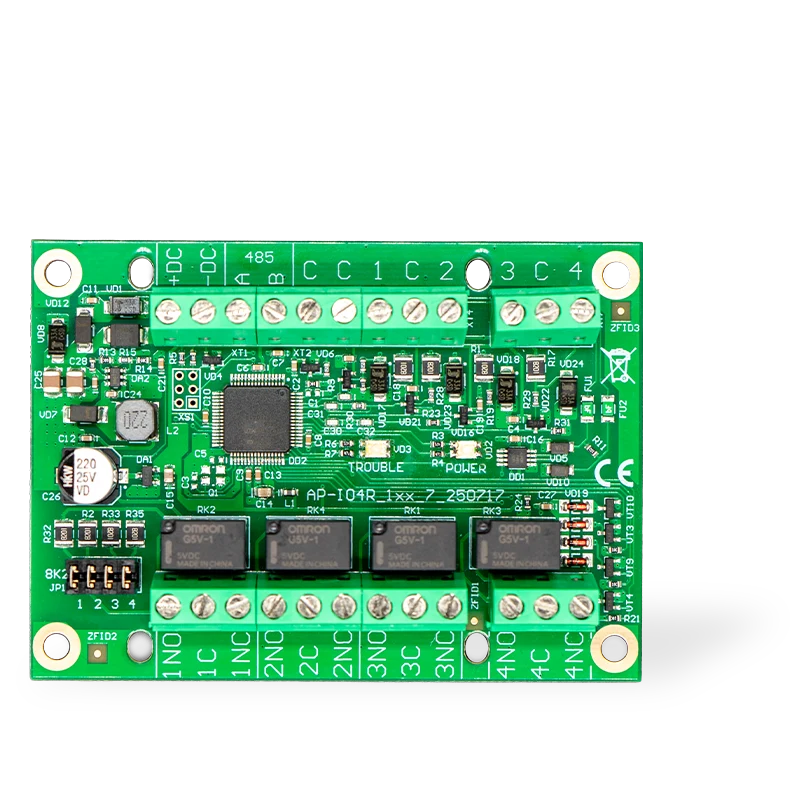
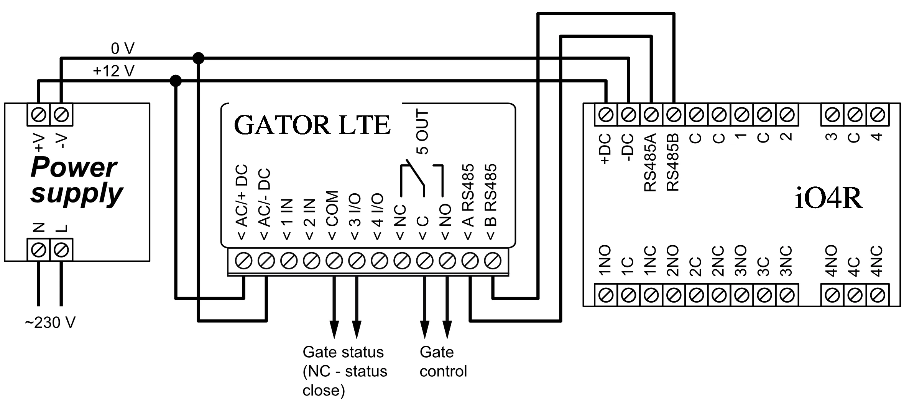
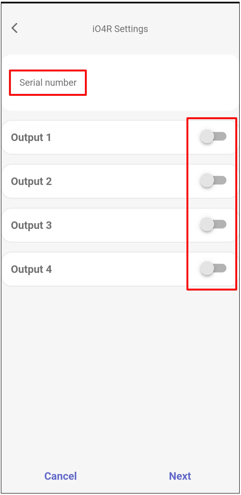
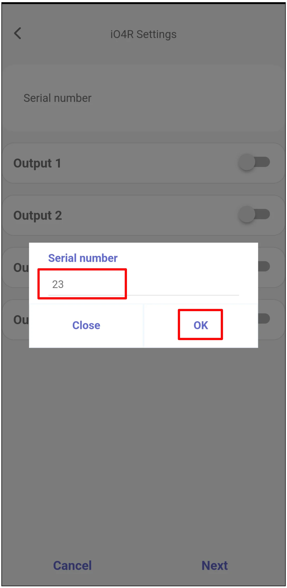
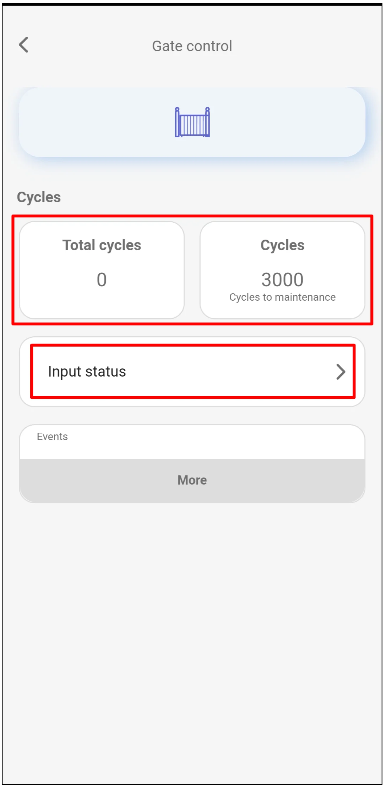

# GATOR LTE and GATOR WiFi with iO4R quick setup

  

Short wiring and Protegus2 programming steps to connect an iO4R expander to a GATOR LTE or GATOR WiFi gate controller. Use this alongside the full [GATOR](../gator/index.md) and [GATOR WiFi](../gator-wifi/index.md) manuals for all other installation and configuration settings.

The iO4R is used for advanced gate monitoring. It adds monitored guard inputs for gate safety sensors and allows an authorized temporary bypass when a sensor fault must be isolated until service can be performed. Protegus2 also counts full gate open/close cycles and alerts when maintenance is due, helping installers replace unplanned call-outs with scheduled service visits and recurring maintenance contracts.

!!! caution
    Install and service only by qualified personnel. Disconnect mains and low-voltage power before wiring. Follow the gate operator manufacturer's safety instructions and local electrical regulations.

## Prerequisites

- GATOR LTE or GATOR WiFi gate controller available for setup. Keep power disconnected while wiring.
- iO4R expander serial number.
- Protegus2 company or installer account and the controller IMEI / Unique ID.
- Gate status sensor connected to the controller gate position input.
- Gate safety sensors connected through the iO4R expander, if they will be monitored or bypassed in Protegus2.

## Wiring

Connect the iO4R expander to the controller RS485 bus and power terminals as shown below.

!!! note
    The schematic shows GATOR LTE terminal labels. For GATOR WiFi, use the matching `+DC`, `-DC`, `A RS485`, and `B RS485` terminals from the GATOR WiFi manual.

Use `3 I/O` as the gate position input for cycle counting. A cycle is counted only after the gate fully opens and fully closes.

!!! important
    In the Protegus2 monitoring setup, `I/O 3` is reserved for gate position and cycle counting. Do not reassign it. Inputs `IN1` and `IN2` are reserved for Wiegand.

## Add the controller and iO4R in Protegus2

Log in to Protegus2 with the company or installer account, then add the controller.

  

    <strong>Step 1.</strong> Tap <strong>Add new system</strong>.
    
  

  

    <strong>Step 2.</strong> Enter the controller <strong>IMEI</strong>, then tap <strong>Next</strong>.
    
  

  

    <strong>Step 3.</strong> Select <strong>Advanced Gator Monitoring</strong>, then tap <strong>Next</strong>.
    
  

  

    <strong>Step 4.</strong> Set the number of <strong>Cycles</strong> after which maintenance is required, then tap <strong>Next</strong>.
    
  

  

    <strong>Step 5.</strong> Enable each iO4R output that is connected to a monitored safety sensor or status circuit.
    
  

  

    <strong>Step 6.</strong> Enter the iO4R <strong>Serial number</strong>, then tap <strong>OK</strong>.
    
  

  

    <strong>Step 7.</strong> For each enabled output, set the name and icon, leave the output <strong>Type</strong> as <strong>Guard</strong>, assign the matching iO4R input, and set the input <strong>Type</strong> to match the wiring. In the shown example, the input type is <strong>NO</strong>. Tap <strong>Next</strong>.
    
  

  

    <strong>Step 8.</strong> Wait while Protegus2 writes the data.
    
  

  

    <strong>Step 9.</strong> Tap <strong>Next</strong>.
    
  

  

    <strong>Step 10.</strong> Enter the system <strong>Name</strong>, then tap <strong>Next</strong>.
    
  

  

    <strong>Step 11.</strong> Tap <strong>Skip</strong> unless you want to add users now.
    
  

  

    <strong>Step 12.</strong> Wait about 1 minute for completion.
    
  

## Transfer the system to the user

After setup is complete, transfer the system to the user's Protegus2 account.

  

    <strong>Step 13.</strong> Tap <strong>Menu</strong>.
    
  

  

    <strong>Step 14.</strong> Tap <strong>Settings</strong>.
    
  

  

    <strong>Step 15.</strong> Tap <strong>Transfer system</strong>.
    
  

  

    <strong>Step 16.</strong> Enter the user's email address, then tap <strong>Transfer</strong>.
    
  

## Check gate monitoring and control

The user must log in to Protegus2 with their account after the transfer.

!!! warning
    Bypassing a gate safety sensor can disable safety protection. Use bypass only as a temporary, authorized service action, and restore normal sensor operation before leaving the installation in service.

  

    <strong>Step 17.</strong> Tap <strong>Gate control</strong> to view the gate cycle counter.
    
  

  

    <strong>Step 18.</strong> Review <strong>Total cycles</strong> and <strong>Cycles to maintenance</strong>. If an authorized installer needs to inspect safety sensor status, tap <strong>Input status</strong>.
    
  

  

    <strong>Step 19.</strong> Use <strong>Input status / bypass</strong> only when a safety sensor has been checked and bypass is required temporarily.
    
  

  

    <strong>Step 20.</strong> Tap the gate control icon to open the gate.
    
  

## System check

1. Open and close the gate fully, then confirm that the cycle counter changes as expected.
2. Trigger each monitored iO4R input and confirm that the input status changes in Protegus2.
3. Test the gate control icon and confirm that the gate operator responds correctly.
