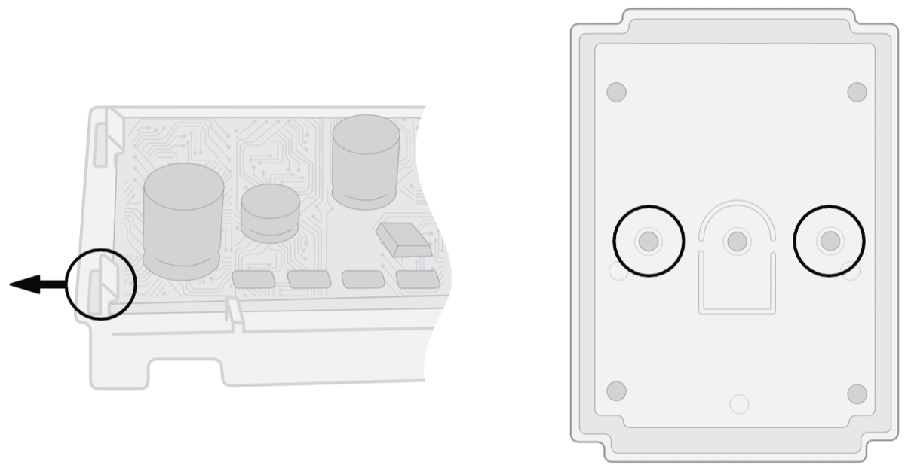
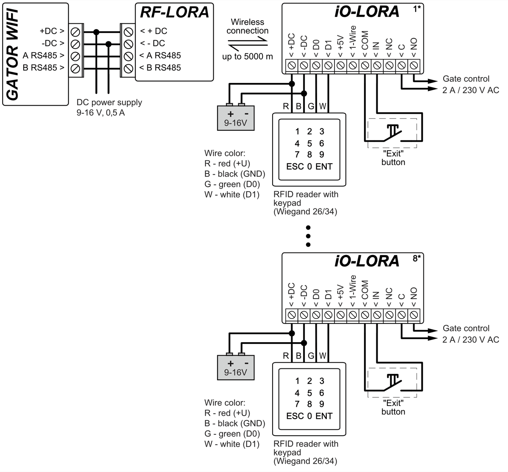
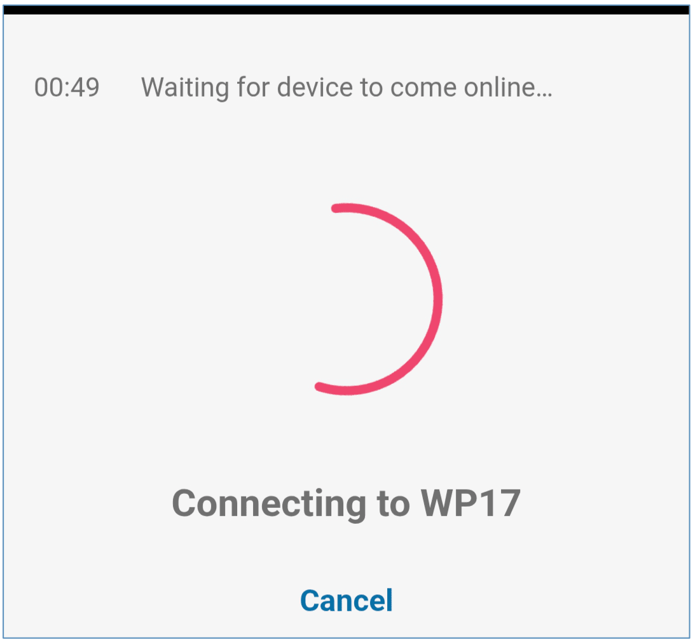
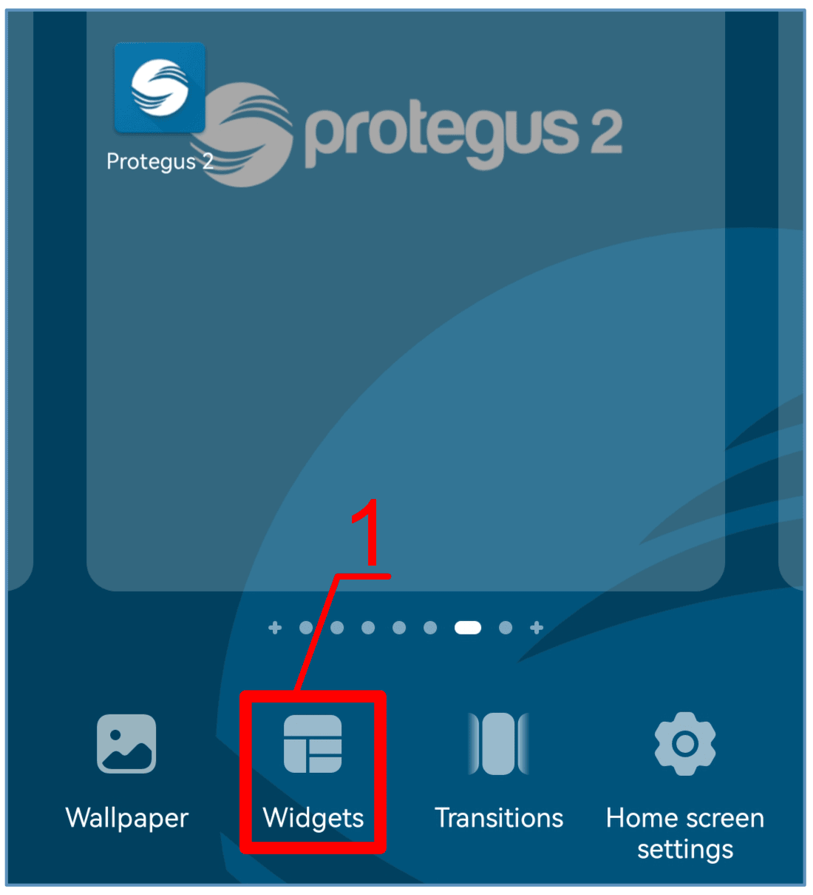
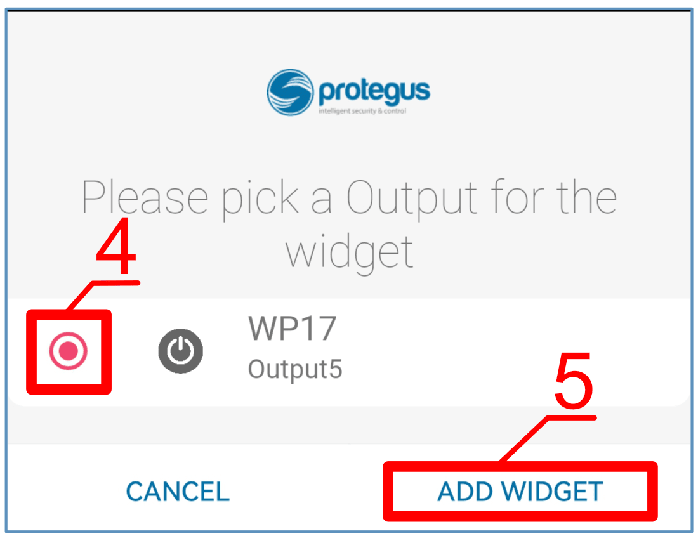
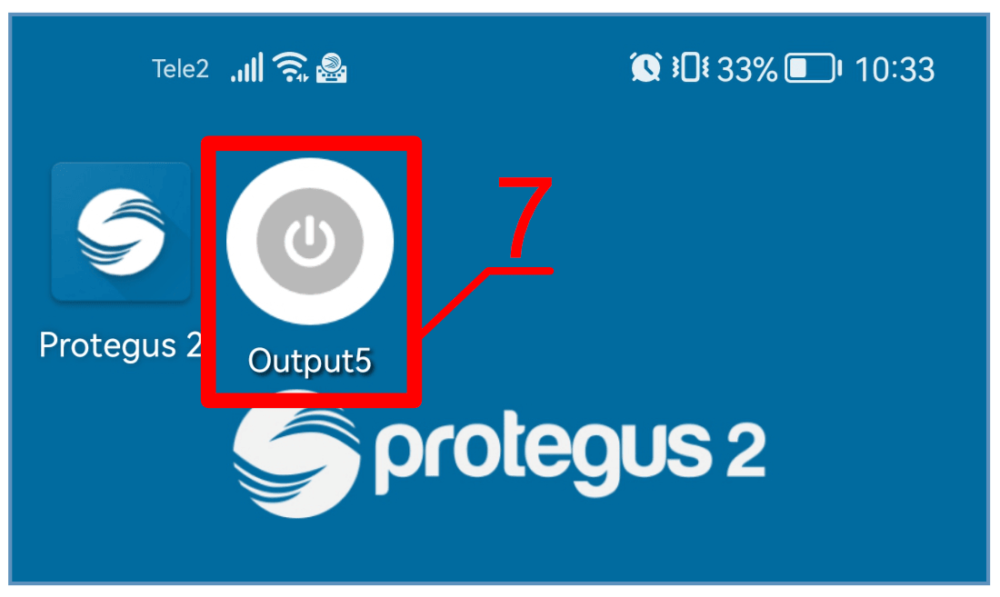
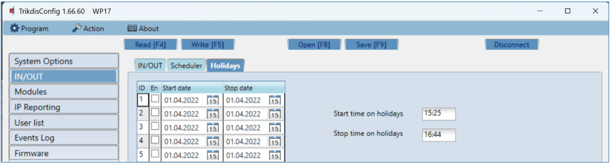
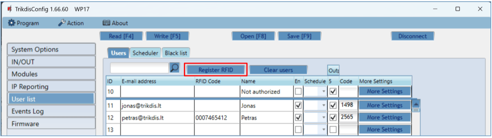
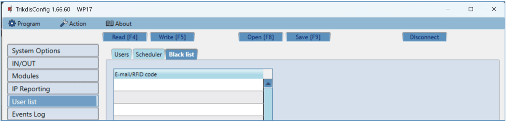

# GATOR WiFi Gate Controller

  

##  Description

The Wi-Fi controller GATOR WiFi is designed for remote control of an automatic door (or other electrical equipment).

GATOR WiFi can be controlled with Protegus2 app. The controller can enter 1000 users (you need to specify the user's e-mail). The GATOR WiFi controller can be used to set the user control schedule, set the counter, how many times the user can control the system. The controller can send messages about input and output activation and restores to the CMS (Central Monitoring Station) receiver and the Protegus2 app.

### Features

**Remote control**

- With Mobile application *Protegus2*.

**Messages for users**

- Sends messages about events to the *Protegus2* application.

**Messages for security company**

- Sends event information in Contact ID codes to TRIKDIS software and hardware receivers, which work with any monitoring software.

- Can simultaneously send event messages to the receiver of the safety company and work with the *Protegus2* app.

- If connection with the main receiver is lost, the messages are automatically sent to a backup receiver.

**Inputs and outputs**

- 4 universal inputs/outputs. Mode of operation is set as either input (NO; NC; EOL) or output.

- 1 output (OUT) - relay.

- With the iO-LORA expander, one additional input and one output (relay contact) can be added. A total of 8 iO-LORA expanders can be added (adding up to 8 additional inputs and 8 additional outputs).

**Settings and installation**

- Quick and easy installation.

- Addition of new users and deletion of existing users can be done with the Protegus2 app (when logged in with administrator rights), TrikdisConfig software.

- Device can be configured either by connecting a USB Mini-B cable or remotely with the TrikdisConfig software.

- Remote updating of firmware.

### Specifications 

| Parameter | Description |
|-----------|-------------|
| Power supply voltage | 9-32 V DC |
| Current consumption | 150 mA |
| Universal inputs/​outputs | 4, can be set either as input IN with type: NC, NO, EOL=10 kΩ, or output OUT (open collector (OC) 50 mA) |
| Output | 1 vnt., relay, 1 A 30 V DC, 0,5 A 125 V AC |
| Connection to CMS | TCP/​IP or UDP/​IP via Wi-Fi |
| Event transmission protocol | TRK_TCP or TRK_UDP |
| Encryption key | 6 symbol encryption key |
| Wi-Fi frequency | 2,4 GHz |
| Wi-Fi protocol | 802.11 b/​g/​n |
| Security mode | WPA, WPA2, WPA mixed |
| Network configuration type | DHCP or manual network configuration (using phone or laptop) |
| Unsent events memory | Up to 60 events |
| Event log memory | Up to 5000 events |
| Users who have permission to control | 1000 |
| Supported modules | iO-LORA – expander module (when using iO-LORA, an RF-LORA transceiver must be connected to GATOR WiFi) |
| Operating environment | Temperature from –10 °C to +50 °C, relative air humidity – up to 80 % at +20 °C |
| Dimensions | 88 x 62 x 26 mm |
| Weight | 80 g |

### Controller elements 

1.  Light indicators.

2.  Frontal case opening slot.

3.  USB Mini-B port for controller programming.

4.  Terminal for external connections.

5.  Button for activating the module's Wi-Fi configuration mode.

### Purpose of terminals 

| Terminal | Description |
|----------|-------------|
| +DC | Power terminal (9-32 V DC positive) |
| -DC | Power terminal (9-32 V DC negative) |
| 1 I/​O | Input/​output (factory setting: input, NO) |
| 2 I/​O | Input/​output (factory setting: input. NO) |
| 3 I/​O | Input/​output (factory setting: type OC output) |
| 4 I/​O | Input/​output (factory setting: type OC output) |
| +AUX | Positive power terminal for external devices |
| NC | Relay terminal NC |
| C | Relay terminal C |
| NO | Relay terminal NO |
| A RS485 | RS485 bus A terminal |
| B RS485 | RS485 bus B terminal |

### LED indication of operation 

| Indicator | Light status | Description |
|-----------|--------------|-------------|
| NETWORK | Green solid | Connected to Wi-Fi network |
| NETWORK | Green blinking | Trying to connect to Wi-Fi network |
| NETWORK | Yellow blinking | Indication of signal strength from 0 to 5. |
| NETWORK | Flashing green yellow quickly | Wi-Fi configuration mode |
| DATA | Green solid | Message is being sent |
| DATA | Yellow solid | There are unsent event messages in the data buffer |
| STATUS | Green blinking | No operation problems |
| STATUS | 1 red blink | Unable to connect to Wi-Fi network |
| STATUS | 2 red blinks | Poor Wi-Fi signal strength |
| STATUS | 3 red blinks | Unable to connect to the IP receiver using the primary channel |
| STATUS | 4 red blinks | Unable to connect to Protegus2 server |
| STATUS | 5 red blinks | Unable to connect to both receiver channels |
| STATUS | 6 red blinks | Internal clock of the GATOR WiFi is not set |
| STATUS | 7 red blinks | Low power supply voltage |

If the LED indication is not working, check the power supply and connections.

!!! note
    Before beginning installation, make sure that you have the necessary
    components:
    
    1.  USB Mini-B type cable for configuration.
    
    2.  Cable consisting of at least 4 wires for connecting the controller.
    
    3.  Flat-head 2,5 mm screwdriver.
    
    Order the necessary components separately from your local retailer.
### Controller *GATOR WiFi* standard packing list

| - | Controller GATOR WiFi | 1 pc. |
|---|-----------------------|-------|
| - | Resistor 10 kΩ | 3 pcs. |
| - | Double-sided adhesive tape (5 cm) | 1 pc. |
| - | Screw | 2 pcs. |

## Wiring schematics for the controller *GATOR WiFi* 

### Fastening 

1.  Remove the top lid. Pull out the plug part of the terminal block.

2.  Remove the PCB board.

3.  Fasten the base of the case in the desired place using screws.

4.  Reinsert the board and the terminal block.

5.  Close the top lid.

### Schematic for connecting the power supply 

Using wires, connect the GATOR WiFi controller according to the schematic shown below.

### Schematic for connecting the RFID reader (Wiegand 26/34)

Configuring controller with an RFID reader is described in chapter  5.3. „„IN/OUT” window”. Only output 5 OUT can be controlled with an RFID reader.

Schematic for connecting of RFID reader to GATOR WiFi controller.

In the TrikdisConfig program, the “**Wiegand reader mode”** field must be selected. When by pressing the “**Exit**” button, the “**5OUT**” output of the controller will be activated for the set pulse duration.

### Schematic for connecting of the iO-LORA expander with RFID reader 

Firmware version of the GATOR WiFi controller from 1.21.

Connect the RF-LORA transceiver to the GATOR WiFi controller. After that, you can use the iO-LORA expander, to which the RFID reader (Wiegand 26/34) is connected. The RFID reader controls the PGM output of the iO-LORA expander, to which it is connected. GATOR WiFi and eight iO-LORA modules connected to it can control nine different doors.

Launch TrikdisConfig. Connect GATOR WiFi via USB Mini-B cable to the computer or remotely. Press the **Read [F4]** button and the TrikdisConfig program will display the current controller settings. If requested, enter the Administrator or Installer 6-digit code in the pop-up window. Select "**iO-LORA controller**" from the "**Modules**" list. In the "**Serial No.**" field, enter the serial number of the device.

In the "**IN/OUT**" list, the "**EXIT button**" must be specified for the "**6 IN**" input. When the "**Exit**" button is pressed, the iO-LORA "**7 OUT**" output is activated for the set pulse duration.

In the "**Users**" list, specify the number of the RFID card, the user's name, enable the permission to control the PGM output, specify the PGM output (which will be controlled by the user), the code. After completing the settings, click **Write [F5]**. Wait until the process of updating the controller settings is finished. Click "**Disconnect**" and disconnect the USB cable.

Activate PGM output with RFID card/code. Press the "**Exit**" button (the PGM output must activate for the set pulse duration).

### Schematics for connecting inputs 

The GATOR WiFi has four universal **I/O** (Inputs/Outputs) terminal, which can operate either as inputs or outputs. These inputs can operate in NC, NO, EOL modes. Connect the inputs according to the set input type (NC, NO, EOL) as is shown in the schematics bellow:

### Schematic for connecting the relay 

Using the contact of the relay, it is possible to remotely control (turn on/off) various electric devices. The “Output” mode must be set to the xI/O terminal.

### Schematic for connecting the LED 

The “Output” mode must be set to the xI/O terminal.

## Control with the *Protegus2* app 

With Protegus2 app users will be able to control controller remotely. They will also be able to see the system state and receive all system event messages.

1.  Download and launch the Protegus2 app or use the browser version of Protegus2 at [www.protegus.app](http://www.protegus.app).

  
  
  

2.  Log in with your user name and password or register and create a new account.

!!! warning
    "Important"
    > When adding the controller to Protegus2 app:
    
    1.  The power supply must be turned on („**STATUS**" LED must blink
        green);
    
    2.  Must be registered in to network („**NETWORK**" LED must be green
        solid and blink yellow).
Choose “**Add new system”**.

Enter the controller “Unique ID (IMEI)” number found on the product or on the packaging sticker. Press “**Next**”.

Press "**Start WiFi configuration WP17**".

Use a flathead screwdriver to remove the cover of the GATOR WiFi. Press and hold the “**PAIR**” button for 3 seconds. The “**NETWORK**” indicator will start to flash green and yellow rapidly. Release the button. The GATOR WiFi controller has entered registration mode with the Wi-Fi network.

Wait until the GATOR WiFi (WP17) controller is found. Click "**OK**".

Select the WiFi network to which the GATOR WiFi controller will be connected.

Enter the WiFi network password. Click "**OK**".

Click "**Connect**".

Wait until the controller connects.

Enter the system name. Press "**Next**".

Press „**Skip**“.

Wait 1 minute. The GATOR WiFi controller will exit the pairing mode on its own after a few minutes (or press and hold the “**PAIR**” button for 3 seconds until the “**NETWORK**” indicator stops flashing green and yellow rapidly).

Activate the PGM output by clicking on the "**Output5**" icon.

## Adding a Widget on your phone 

The gate control Widget can be placed on your phone‘s home screen. The controller must be registered to Protegus2 cloud. Log in to Protegus2 app on your phone. Close the Protegus2 window.

Touch the screen with your finger and hold. A settings bar will appear.

1.  Press “**Widgets**”**.**

Find Protegus2 in the settings bar.

2. Select „Protegus2“.

3. Click on „**Switch** **Protegus2**“.

4. Select “**WP17 Output5**” controller output.

2.  Click on “**ADD WIDGET**”.

3. An icon will appear on the phone‘s screen.

4. Return to the home screen. Press the icon.

> A circle that shows when the PGM is turned on will appear on the screen.

5. When the controller is connected to the automatic gate with gate state indication, the icon will show the state of the open/closed gates.

## Setting parameters using *TrikdisConfig* software 

With TrikdisConfig you can change the GATOR WiFi controller’s settings according to the program window descriptions below.

1.  Download the configuration software TrikdisConfig from [www.trikdis.com/lt](http://www.trikdis.com/lt)/ (enter “TrikdisConfig” in the search field) and install it.

2.  Using a flat-head screwdriver, remove the GATOR WiFi’s lid as shown below:

1.  Connect the GATOR WiFi to a computer using a USB Mini-B cable.

2.  Launch the configuration software TrikdisConfig. The program will automatically recognize the connected device and will automatically open the GATOR WiFi configuration window.

3.  Click **Read [F4]** to see current GATOR WiFi parameters. If prompted, enter administrator’s code in the pop-up window.

!!! note
    The button **Read [F4]** will make the program read and show the
    settings currently saved on the device.
    
    The button **Write [F5]** will save the settings made in the program
    to the device.
    
    The button **Save [F9]** will save the settings into a configuration
    file. You can upload the saved settings to other devices later. This
    allows to quickly configure multiple devices with the same settings.
    
    The button **Open [F8]** will allow to choose a configuration file and
    open saved settings.
    
    If you want to revert to default settings, click on the "**Restore"**
    button at the bottom left of the window.
### TrikdisConfig status bar 

After connecting the GATOR WiFi to the TrikdisConfig software, the software will show information about the connected device in the status bar.

| Name | Description |
|------|-------------|
| IMEI/​Unique ID | The device’s MAC number |
| State | Operational state |
| Device | Device type (must show WP17_xxxx) |
| SN | Device’s serial number |
| BL | Launcher version |
| FW | Device’s firmware version |
| HW | Device’s hardware version |
| State | Type of connection with the software (with USB or remote) |

When the button **Read [F4]** is clicked, the program will read and show the settings currently saved on the GATOR WiFi. With TrikdisConfig, adjust the required settings according to the program window descriptions below.

### „System options“ windows 

**Settings group „General“**

- **Object ID** – enter account number (4 symbol hexadecimal number, 0-9, A-F. **Do not use FFFE, FFFF Object ID**).

- **Time set** – choose a source for setting the time.

- **Time zone** – indicated, when the time synchronization NTP server is specified.

- **Daylight saving time** – checking the box will enable automatic time change in the spring/autumn months..

- **DST region** – select the region to which your country belongs.

- **Administrator Code** – with this code it is possible to change all of the parameters of the controller.

- **User list language** – select a language (The user list can be entered in the characters of the selected language).

**Settings group „Periodic test”**

- **Test Enable** – if the box is ticked, periodic test messages are enabled.

- **Test period** – setting of test sending time period.

- **Start test at** – setting of test start time.

- **To mobile application** – if the box is ticked, the test message will be sent to Protegus2.

**Settings group „Communicator network settings“**

- **DHCP mode** – WiFi controller’s mode for registering to network (manual or automatic).

- **Static IP** – static IP address for when manual registering mode is set.

- **Subnet mask** – subnet mask for when manual registering mode is set.

- **Default gateway** – gateway address for when manual registering mode is set.

- **Wifi SSID name** – enter the Wi-Fi network name, to which the controller GATOR WiFi will connect.
- **Wifi SSID password** - enter the Wi-Fi network password.

### „IN/OUT“ windows 

**„IN/OUT“ tab**

Input / Output settings window.

**Settings group „Input/Output settings“**

- **Terminal** – controller’s input and output terminal numbers.

- **Function** – terminal type (input, output, disabled).

- **Name** - enter the name of the IN input or OUT output.

- **Type** – specify input type (NC, NO, EOL=10kΩ).

- **Inactive** –input will be inactive for specified time after first activation. Enter 0 if you want to turn this function off.

- **Delay** - input (zone) reaction time, ms.

- **CMS** – if box is ticked, the message will be sent to CMS (Central Monitoring Station) and to Protegus2.

- **No rest**. – do not send restore event.
- **Pulse** – time for which the output is turned on, when output is set as “**Pulse”** type.

- **Sched** – assign a schedule number for controlling the output.

- **Assign IN** – assign input (IN) to output to see the actual state of the device depending on the input’s state.

- **Confirm** - specify the number of the input, when the input is triggered, control of the output (OUT) will be enabled.

- **CTRL by IN** - the selected input activates the output.

  **Settings group „Tag reader settings“**
- **Wiegand reader mode** – tick the box if an RFID reader (Wiegand 26/34) will be connected to the GATOR WiFi controller.

- **Entry/Exit event with output** - tick the box and input / output events will be sent when controlling the output through Protegus.

- **Disable reader filter** - tick the box if want disable internal device filter for reader that send short pulses.

- **Low voltage reader** - tick the box if you are using low voltage readers.

**„Scheduler“ tab**

Outputs can be controlled automatically according to a set schedule.

The OUT output can be activated according to a set schedule. It is necessary to specify the time and days of the week, enable the schedule, and assign the schedule to the Output.

- **Name** - enter the name of the schedule.

- **Enable** – enable the time schedule for when the controller will control the output.

- **Lock** - check the box to prevent the output from being controlled by other means when it is triggered according to the specified schedule.

- **MANUAL** - check the box to prevent the scheduler from enabling the output at startup. The schedule will only start running when the output is activated by the user.

- **Output mode** – specify the mode of operation of the PGM output: “**Level**” - the output will be activated for the specified time period; “**Pulse**” **-** the output will be activated at the start and end of the schedule for the set pulse duration.

- **Holiday mode** - specify the mode of how the time schedule should work when the holidays begin.

- **Hol** - tick the box to use holiday time when the schedule triggers on holidays.

- **Start time** – specify the time and days of the week from when the output will be turned on.

- **End time** – specify the time and days of the week until when the output will be turned on.

- If the PGM output mode is set to “**Level**” and only “**End time**” is specified in the “**Scheduler**” table, then the PGM output will be disabled at the specified time, if it was enabled. An output control schedule must be assigned to an PGM output.

  **“Holidays”** **tab**

Enter the calendar holidays during which it will be possible to set the additional activation of the PGM output provided in the Scheduler table.

- **En.** – check the box to specify a specific holiday interval.

- **Start date –** specify the start date of the holidays.

- **Stop date** – specify the end date of the holidays.

- **Start time on holidays** – specify the start time of the holidays.

- **Stop time on holidays** - specify the end time of the holidays.

### “Modules” window

**„Modules“ tab**

iO-LORA modules can be connected to the GATOR WiFi controller.

By connecting the RF-LORA transceiver, up to 8 iO-LORA wireless expansion modules can be connected to the GATOR WiFi controller. RFID readers connected to the iO-LORA wireless expansion modules can control up to 8 additional doors (GATOR WiFi gate controller operating program version 1.21 or later). One iO-LORA expansion module with one RFID reader controls only one door.

- **Modules** – select from the list the module connected to the gate controller.

- **Serial No.** – enter the module serial number (6 digits), which is indicated on stickers on the module’s case and packaging.

### „IP reporting“ windows

**Settings group „Primary channel“**

Messages from the GATOR WiFi controller can be sent to the CMS. This requires setting up communication channels with the CMS receiver.

- **Communication type** – choose the type of communication (TCP/IP, UDP/IP) with the CMS (Central Monitoring Station) receiver.

- **Domain or IP** – enter the receiver’s domain or IP address.

- **Port** – enter the receiver’s network port number.

- **Encryption Key** – 6-digit message encryption key that must match the encryption key of the CMS receiver.

**Settings group „Backup channel“**

The settings are identical to those of the main communication channel.

**Settings group „Settings“**

- **Return to primary after** – time period after which the controller will attempt to regain connection with the primary channel.

- **IP Ping period** – enable sending of PING signal and set the length of its period.

- **Backup reporting after** – specify amount of attempts to connect with the main channel, after which the controller will automatically connect to the backup connection channel.

**Settings group „Cloud application“**

- **Enable cloud service** – enable Protegus2service, the GATOR WiFi will be able to exchange data with the Protegus2app and also remote configuration with TrikdisConfig will be possible.

- **Parallel reporting** – the messages are sent simultaneously to the CMS, Protegus. When not enabled, messages to Protegus2will be sent only after being sent to CMS.

- **Cloud Access Code** – 6-digit code for connecting with Protegus2(default code - 123456).

### „User list“ window 

**„User list“ tab**

- **E-mail address –** specify user’s e-mail address.

- **RFID code** - enter the user's RFID card (pendant) ID number if an RFID reader is connected to the controller and the user has an RFID card (pendant).

- **Name** - specify user’s name.

- **En** – if boxed is ticked, user is allowed to control outputs OUT.

- **Sched**. – assign a schedule (specify a schedule number) for when the user can control outputs OUT.

- **Outputs** – mark the number of the output that will be controlled by the user.

- **Code** – enter user code of RFID reader with keypad. When an RFID reader with a keypad (Wiegand 26/34) is connected to the gate controller, the user can be given a four-digit control code.

- **More settings** - by clicking on the “**More settings”** button, an additional user settings window will open.

  **User settings (numbers from 11 to 1010)**
- Enabled – boxed is ticked, user is allowed to control outputs OUT.

- Name – specify user’s name.

- E-mail address – specify user’s e-mail address.

- RFID code – when an RFID reader with keypad (Wiegand 26/34) is connected to the controller, the ID number of the RFID card (pendant) can be assigned to the user.

- Keypad code – when RFID reader with keypad (Wiegand 26/34) is connected to the controller, the user can be assigned a user code.

- Assign scheduler – assign a schedule (specify a schedule number) for when the user can control outputs OUT.

- Valid from – specify date and time from when the user can control the controller.

- **Valid until** – specify date and time until when the user can control the controller.

- **Enable counter** – check the box to enable the counter.

- **Set counter** – specify number of times that user can control the controller during the chosen time.

- **Current counter** – current number of control times.

- **Can control outputs** - mark the number of the output that will be controlled by the user.

- **Can control iO-LORA outputs** - mark the number of the output that will be controlled by the user.

#### RFID pendant (card) registration 

Connect the RFID reader to the controller (see p.2.3 " Schematic for connecting for RFID reader (Wiegand 26/34)"). Turn on the power to the controller. Connect the USB Mini-B cable to the controller. In the „IN / OUT” window of the TrikdisConfig program, select the “**Wiegand reader mode”** field.

Click “**Register RFID”** in the “**User list**” window.

The RFID pendants (cards) registration window will open.

Attach the RFID pendant (card) to the RFID reader. A new window will open when the reader scans the pendant (card). In it, “**Enter user name”** and select the “**User can control PGM Output 5”**. Press the “**ADD”** button. / Repeat the steps above to add more RFID pendant (cards).

When the registration of all RFID pendant (cards) is completed, press the “**STOP registration”** button. / Press the button **Write [F5]** to save the RFID pendant list to the controller.

RFID pendants (cards) can be registered in TrikdisConfig by entering their ID numbers in the “**RFID code”** field. Give the user a “**Name”**, check field the “**En.”** and a managed “**Outputs”** field. Press the **Write [F5]** button to save the list of RFID pendants (cards) to the controller.

**„Scheduler“ tab**

A schedule can be created for the user, specifying the time and days of the week when he will be able to control the output.

- **Name** - enter a name for the schedule.

- **Enable** – enable time schedule when the user will be able to control the controller’s outputs.

- **Start time** – specify time and days of the week from when the user can control controller’s outputs.

- **Stop time** – specify time and days of the week until when the user can control controller’s outputs.

**„Black list“ tab**

The “**Black list”** contains e-mail addresses of users, ID numbers of RFID cards who are banned from controlling the GATOR WiFi.

It is convenient to add users to the „**Black List“** directly from the „**Events Log“**. In the „**Events Log“**, right-click on the „**Name“** or ID number of the RFID card and choose „**Add to Black List“**.

### „Event Log“ window 

Click the button “**Read Log”**. The “**Events Log”** will be read from the controller’s memory. The “**Events log”** provides information about the controller’s actions and its internal events.

### Restore default settings 

Connect GATOR WiFi to your computer using a USB Mini-B cable. To restore the default settings of the GATOR WiFi controller you need to click the “**Restore”** button in the TrikdisConfig program window.

## Setting parameters remotely 

!!! warning
    "Important"
    Remote configuration will only work when:
    
    1.  Protegus2 service is enabed. Enabling the service is described
        in chapter 5.5 ""IP reporting" window";
    
    2.  Connected to network („**NETWORK**" LED is green solid and yellow
        blinking).
1.  Download the program TrikdisConfig from [www.trikdis.com](http://www.trikdis.com).

2.  Make sure that the controller is connected to the internet and connection to Protegus2 is enabled***.***

3.  Launch the configuration program TrikdisConfig and in the field “**Unique ID”** of the “**Remote access”** section enter the “**MAC”** number of your controller (the MAC number is given on the stickers that can be found on the lower part of the device’s case and on the packaging).

4. In the field “**System Name”** you can give any name to this controller. Click “**Configure”**.

2.  The controller configuration window will open. Click the button **Read [F4]** for the program to read the parameters currently set for the controller. If a window for entering the *Administrator code* opens, enter the six-symbol *administrator code*. To make the program remember the code, tick the box next to “**Remember password”** and click the button **Write [F5]**.

3.  Set the desired settings for the controller and afterwards click **Write [F5]**. To disconnect from the controller click “**Disconnect”** and exit the TrikdisConfig program.

## Testing of controller GATOR WiFi 

When configuration and installation are finished, test the system:

1.  Check if the power is on;

2.  Check network connectivity („**NETWORK**” indicator must be green solid and blink yellow);

3.  To test the GATOR WiFi’s inputs, trigger them and make sure that the recipients get correct messages;

4.  To test the GATOR WiFi’s outputs, turn them on remotely and make sure that the recipients get correct messages and the outputs are activated correctly.

## Updating firmware manually 

!!! note
    When the GATOR WiFi is connected to TrikdisConfig, the
    program will offer to update the device's firmware if updates are
    available. Updates require an internet connection.
    
    If antivirus software is installed in your computer, it might block the
    automatic firmware update function. In this case you will have to
    reconfigure your antivirus software.
The GATOR WiFi’s firmware can also be updated and changed manually. All prior GATOR WiFi parameters remain after update. When writing manually, the firmware can be changed to an older or a newer version. Follow these steps:

1.  Launch ***TrikdisConfig**.*

2.  Connect the GATOR WiFi to a computer using a USB Mini-B cable or connect to the GATOR WiFi remotely. If a newer version of firmware is available, the program will offer to install it.

3.  Choose the menu branch “**Firmware”**.

4.  Click the “**Open firmware”** button and choose the required firmware file.

    

5.  Click the button “**Start update [F12]”.**

6.  Wait for the update to finish.

## Safety precautions

The controller should only be installed and maintained by qualified personnel.

Please read this manual carefully prior to installation in order to avoid mistakes that can lead to malfunction or even damage to the equipment.

Always disconnect the power supply before making any electrical connections.

Any changes, modifications or repairs not authorized by the manufacturer shall render the warranty void.

> Please adhere to your local waste sorting regulations and do not dispose of this equipment or its components with other household waste.
