# GSM gate controller GATOR

  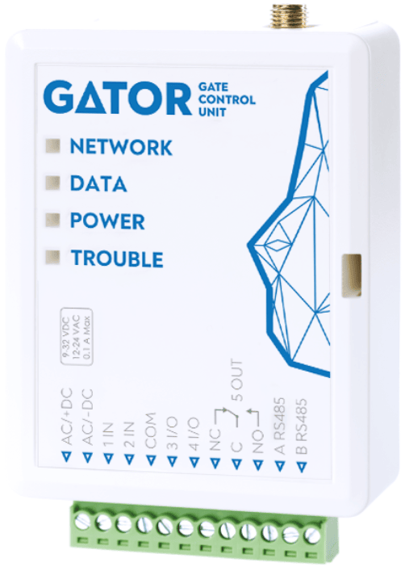

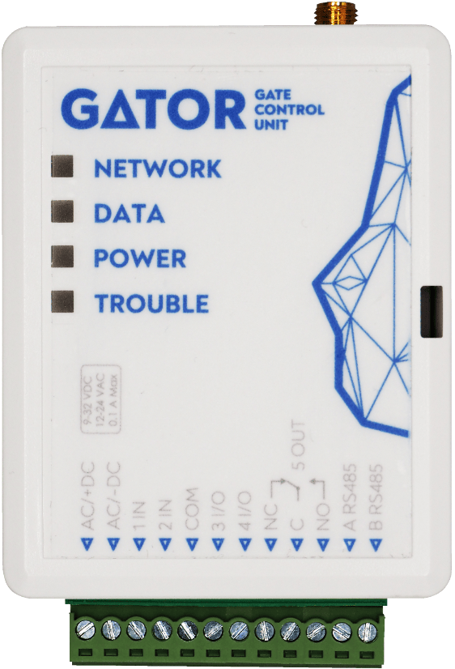

## Description

GSM gate controller can remotely control automatic gates and other equipment.

Users can control controller with Protegus2 application, telephone calls and SMS messages. The controller can recognize up to 7 administrator and 1000 user telephone numbers. A user control schedule and counter for how many times a specific user can control the system can be set for the controller. The GSM controller can send SMS messages informing when inputs and outputs are activated and restored (the text of the SMS messages is customizable). The controller is capable of sending event messages to the receiver of a security company. Connecting a WiFi (W485) or Ethernet (E485) module to the controller can send event messages and control the controller over a wireless or wired internet without using SIM card mobile data. By connecting the RF- LORA transceiver, up to 8 iO-LORA wireless expanders can be connected to the GATOR controller. RFID readers connected to the iO-LORA wireless expansion modules can control up to 8 PGM outputs (GATOR controller program version from 2.13). One iO-LORA expander with an RFID reader controls only one PGM output.

### Features

+——————–+—+ \| **Remote control** \| \| \| \| \| \| - With \| \| \| Mobile/​Internet \| \| \| application \| \| \| ***Protegus2*.** \| \| \| \| \| \| - With SMS \| \| \| messages. \| \| \| \| \| \| - With phone call. \| \| \| \| \| \| **Messages for \| \| \| users** \| \| \| \| \| \| - Sends messages \| \| \| about events to \| \| \| the \| \| \| Protegus2 \| \| \| application or \| \| \| with text SMS \| \| \| messages. \| \| \| \| \| \| **Messages for the \| \| \| safety company** \| \| \| \| \| \| - Sends event \| \| \| information in \| \| \| Contact ID codes \| \| \| to TRIKDIS \| \| \| software and \| \| \| hardware \| \| \| receivers, which \| \| \| work with any \| \| \| monitoring \| \| \| software. \| \| \| \| \| \| - Can \| \| \| simultaneously \| \| \| send event \| \| \| messages to the \| \| \| receiver of the \| \| \| safety company \| \| \| and work with \| \| \| the \| \| \| Protegus2 \| \| \| app. \| \| \| \| \| \| - If connection \| \| \| with the main \| \| \| receiver is \| \| \| lost, the \| \| \| messages are \| \| \| automatically \| \| \| sent to a backup \| \| \| receiver. \| \| \| \| \| \| **Inputs and \| \| \| outputs** \| \| \| \| \| \| - 2 inputs (IN), \| \| \| of selectable \| \| \| type: NO;​ NC;​ \| \| \| EOL. \| \| +====================+===+

- 2 universal inputs/outputs. Mode of operation is set as either input or output.

- 1 output (OUT) - relay.

- With the iO-LORA expander you can additionally add one input and one PGM output (relay). In total, you can add 8 iO- LORA expanders (add up to 8 additional inputs and 8 PGM outputs).

**Settings and installation**

- Quick and easy installation.

- Addition of new users and deletion of existing users can be done with the Protegus2 app (when logged in with administrator rights), SMS message, TrikdisConfig software.

- Device can be configured either by connecting a USB Mini-B cable or remotely with the TrikdisConfig software.

- Remote updating of firmware.

- Two access levels for configuring the device, for the installer and for the administrator.

### Specifications {#specifications .2-Po-Pag}

<table style="width:61%;">
<colgroup>
<col style="width: 23%" />
<col style="width: 37%" />
</colgroup>
<tbody>
<tr>
<td rowspan="2">

Parameter2G GSM modem frequencies

</td>
<td rowspan="2"><strong> Description</strong>

850 /​ 900 /​ 1800 /​ 1900 MHz

</td>
</tr>

<tr>
<td>

LTE modem frequencies:

EU (Europe)

LA (Latin America)

</td>
<td>

LTE-FDD: B1/​B3/​B5/​B7/​B8/​B20/​B28

LTE-FDD: B2/​B3/​B4/​B5/​B7/​B8/​B28/​B66

</td>
</tr>
<tr>
<td>

Power supply voltage

</td>
<td>

9-32 V DC

12-24 V AC

</td>
</tr>
<tr>
<td>

Current consumption

</td>
<td>

100 mA

</td>
</tr>
<tr>
<td>

Inputs

</td>
<td>

2, selectable type: NC, NO, EOL=10 kΩ

</td>
</tr>
<tr>
<td>

Universal inputs/​outputs

</td>
<td>

2, can be set either as input IN with type: NC, NO, EOL=10 kΩ, or
output OUT (open collector (OC) 50 mA)

</td>
</tr>
<tr>
<td>

Output

</td>
<td>

1, relay, 1 A 30 V DC, 0,5 A 125 V AC

</td>
</tr>
<tr>
<td>

Unsent events memory

</td>
<td>

Up to 60 events

</td>
</tr>
<tr>
<td>

Event log memory

</td>
<td>

Up to 5000 events

</td>
</tr>
<tr>
<td>

Users who receive messages and have permission to control

</td>
<td>

7

</td>
</tr>
<tr>
<td>

Users who have permission to control

</td>
<td>

1000

</td>
</tr>
<tr>
<td>

Operating environment

</td>
<td>

Temperature from –20 °C to +50 °C, relative humidity – up to 80% at
+20 °C

</td>
</tr>
<tr>
<td>

Dimensions

</td>
<td>

92 x 62 x 26 mm

</td>
</tr>
<tr>
<td>

Weight

</td>
<td>

80 g

</td>
</tr>
</tbody>
</table>

### Controller elements {#controller-elements .2-Po-Pag}

|  | Light indicators.
Frontal case opening slot.
USB Mini-B port for controller programming.
Terminal for external connections.
Nano-SIM card slot.
GSM antenna SMA connector. |
|--|----------------------------------------------------------------------------------------------------------------------------------------------------------------------------|

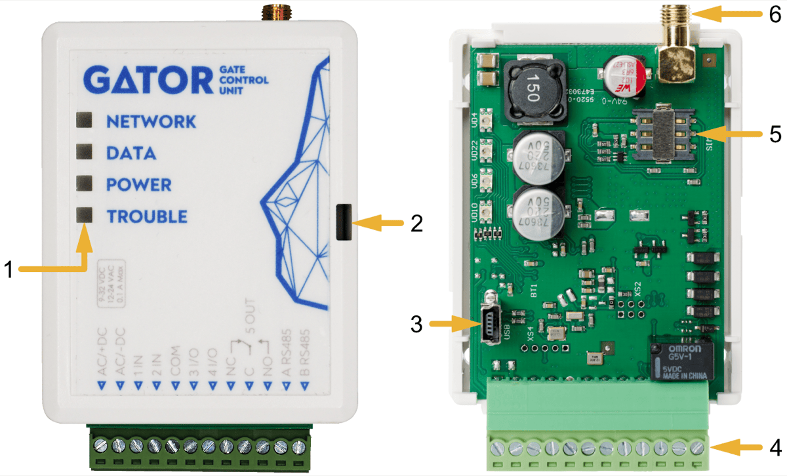

### Purpose of terminals {#purpose-of-terminals .2-Po-Pag}

<table>
<colgroup>
<col style="width: 13%" />
<col style="width: 21%" />
</colgroup>
<tbody>
<tr>
<td rowspan="2"><strong>Terminal</strong>

AC/​+DC

</td>
<td rowspan="2">DescriptionPower terminal
 (9-32 V DC positive;​ 12-24 V AC)</td>
</tr>

<tr>
<td>

AC/​-DC

</td>
<td>

Power terminal (9-32 V DC negative;​ 12-24 V AC)

</td>
</tr>
<tr>
<td>

1 IN

</td>
<td>

1st input, of selectable type NO, NC, EOL (factory
setting: NO)

</td>
</tr>
<tr>
<td>

2 IN

</td>
<td>

2nd input, of selectable type NO, NC, EOL (factory
setting: Disabled)

</td>
</tr>
<tr>
<td>

COM

</td>
<td>

Common terminal

</td>
</tr>
<tr>
<td>

3 I/​O

</td>
<td>

Input/​output (factory setting: Disabled)

</td>
</tr>
<tr>
<td>

4 I/​O

</td>
<td>

Input/​output (factory setting: Disabled)

</td>
</tr>
<tr>
<td>

NC

</td>
<td>

Relay terminal NC

</td>
</tr>
<tr>
<td>

C

</td>
<td>

Relay terminal C

</td>
</tr>
<tr>
<td>

NO

</td>
<td>

Relay terminal NO

</td>
</tr>
<tr>
<td>

A RS485

</td>
<td>

Contact A of <em>RS485</em> bus

</td>
</tr>
<tr>
<td>

B RS485

</td>
<td>

Contact B of <em>RS485</em> bus

</td>
</tr>
</tbody>
</table>

### LED indication of operation {#led-indication-of-operation .2-Po-Pag}

| Indicator | Light status | Description |
|-----------|--------------|-------------|
| NETWORK | Green solid | Connected to GSM network |
| NETWORK | Yellow blinking |  |
| DATA | Green solid | Message is being sent |
| DATA | Yellow solid |  |
| POWER | Green blinking | The power supply voltage is
sufficient |
| POWER | Yellow blinking | The power supply voltage is
insufficient |
| POWER | Red and yellow blinking |  |
| TROUBLE | Off | No operation problems |
| TROUBLE | 1 blink | No SIM card inserted |
| TROUBLE | 2 blinks | The PIN code of the SIM card is
incorrect |
| TROUBLE | 3 blinks | Unable to connect to GSM network |
| TROUBLE | 4 blinks | Unable to connect to
GATOR or to the primary IP receiver |
| TROUBLE | 5 blinks | Unable to connect to the backup IP
receiver |
| TROUBLE | 6 blinks | Internal clock is not set |
| TROUBLE | 7 blinks |  |

If the LED indication is not working, check the power supply and connections.

!!! note
    Before beginning installation, make sure that you have the necessary components:
    
    1.  USB Mini-B type cable for configuration.
    
    2.  Cable consisting of at least 4 wires for connecting the controller.
    
    3.  Flat-head 2,5 mm screwdriver.
    
    4.  External GSM antenna if reception is weak in the area.
    
    5.  Activated nano-SIM card (can have turn off PIN code requests).
    
    6.  Instruction manual for the automatic gate to which the cellular gate controller is about to be connected.
    
    Order the necessary components separately from your local retailer.
### GSM gate controller *GATOR* standard packing list {#gsm-gate-controller-gator-standard-packing-list .2-Po-Pag}

| - | GSM gate controller GATOR | 1 pc. |
|---|---------------------------|-------|
| - | GSM antenna | 1 pc. |
| - | Resistor 10 kΩ | 3 pcs. |
| - | Double-sided adhesive tape (5 cm) | 1 pc. |
| - | Screw | 2 pcs. |

# Wiring schematics for the cellular gate controller

  

### Fastening {#fastening .2-Po-Pag}

| Remove the top lid. Pull out the plug part of the terminal
block.
Remove the PCB board.
Fasten the base of the case in the desired place using
screws.
Reinsert the board and the terminal block.
Screw the cellular antenna in.
Insert the nano-SIM card.
Close the top lid. |  |
|-------------------------------------------------------------------------------------------------------------------------------------------------------------------------------------------------------------------------------------------------------------------------------|--| 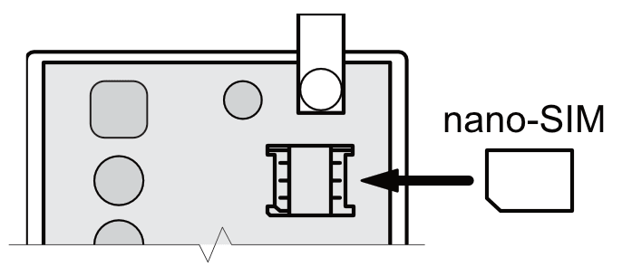984251968503937in" />

### Schematic for connecting the power supply {#schematic-for-connecting-the-power-supply .2-Po-Pag}

Using wires, connect the controller according to the schematic shown below.

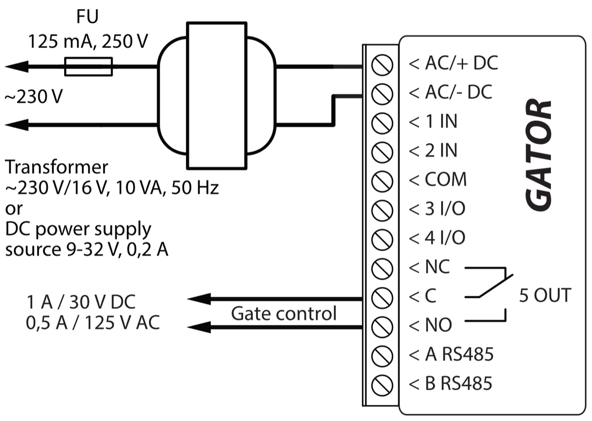

### Schematics for connecting inputs {#schematics-for-connecting-inputs .2-Po-Pag}

The controller has four inputs IN (two of which are universal and can operate either as inputs or outputs) for the connection of various alarm sensors. These inputs can operate in NC, NO, EOL modes. Connect the inputs according to the set input type (NC, NO, EOL) as is shown in the schematics bellow:

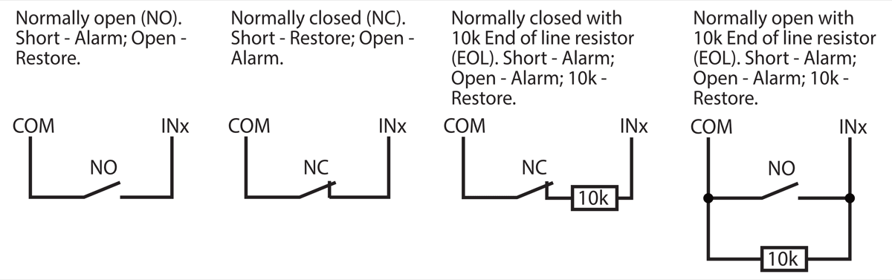

### Schematic for connecting the relay {#schematic-for-connecting-the-relay .2-Po-Pag}

Above is the schematic for connecting the relay when the controller is connected to a DC power source. Using the terminals of the relay, it is possible to remotely control (turn on/​off) various electric devices. The I/​O terminal of the controller must be set to an output (OUT) mode.  
——————————————————————————————————————————————————————————————————————————————————————————————— –

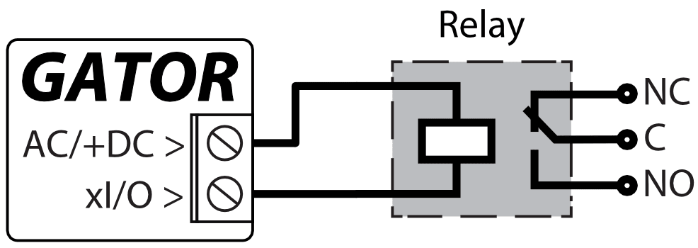

### Schematic for connecting an automatic gate opener to the controller {#schematic-for-connecting-an-automatic-gate-opener-to-the-controller .1.1-Po-pag-(nerodyti-turiny)}

**All wiring should be done with the power supply disconnected.** /​ The purposes and voltages of the automatic gate opener’s terminals are described in detail in the automatic gate’s manual. /​ The automatic gate’s IN, COM terminals are used for controlling the gates. /​ The automatic gate has a gate state output (OUT) that shows when the gates are closed and when they are open. The gate’s state output can be a voltage output or a relay output. In the schematic, relay K1 is connected to a voltage automated gate output. There is voltage (~230V) between the voltage outputs OUT and N of the automated gates when the gates are open. The intermediate relay K1 is turned on when the gates are open and it activates  
——————————————————————————————————————————————————————————————————————————————————————————————————————————————————————————————————————————————————————————————————————————————————————————————————————————————————————————————————————————————– – the controller’s 1IN input. The state of the controller’s 1IN input gives precise information about the state of the gates (when the gates are closed and when they are open).

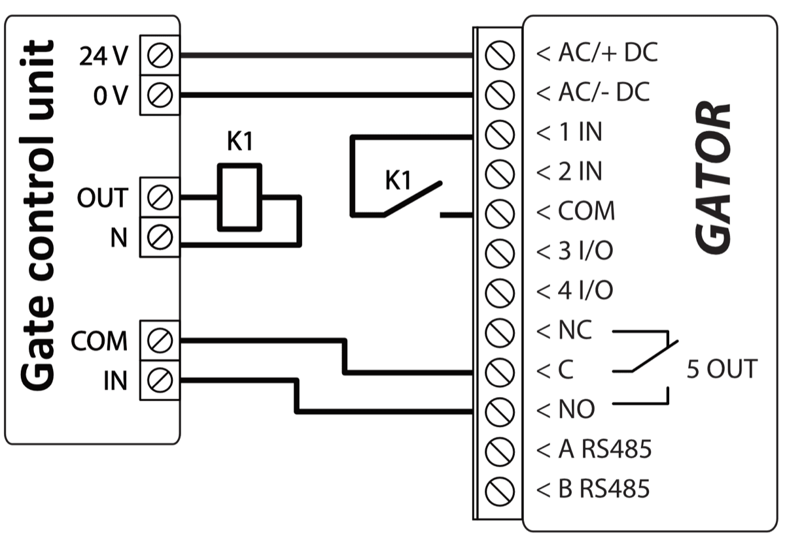

Configuring the controller with the gate state indication is described in chapter 5.9 “Settings for gate state indication”.
### Schematic for connecting for RFID reader (Wiegand 26/34) {#schematic-for-connecting-for-rfid-reader-wiegand-2634 .2-Po-Pag}

Configuring controller with an RFID Reader is described in chapter 5.3. „„IN/OUT” window”.

Schematic for connecting of single RFID reader to GATOR controller.

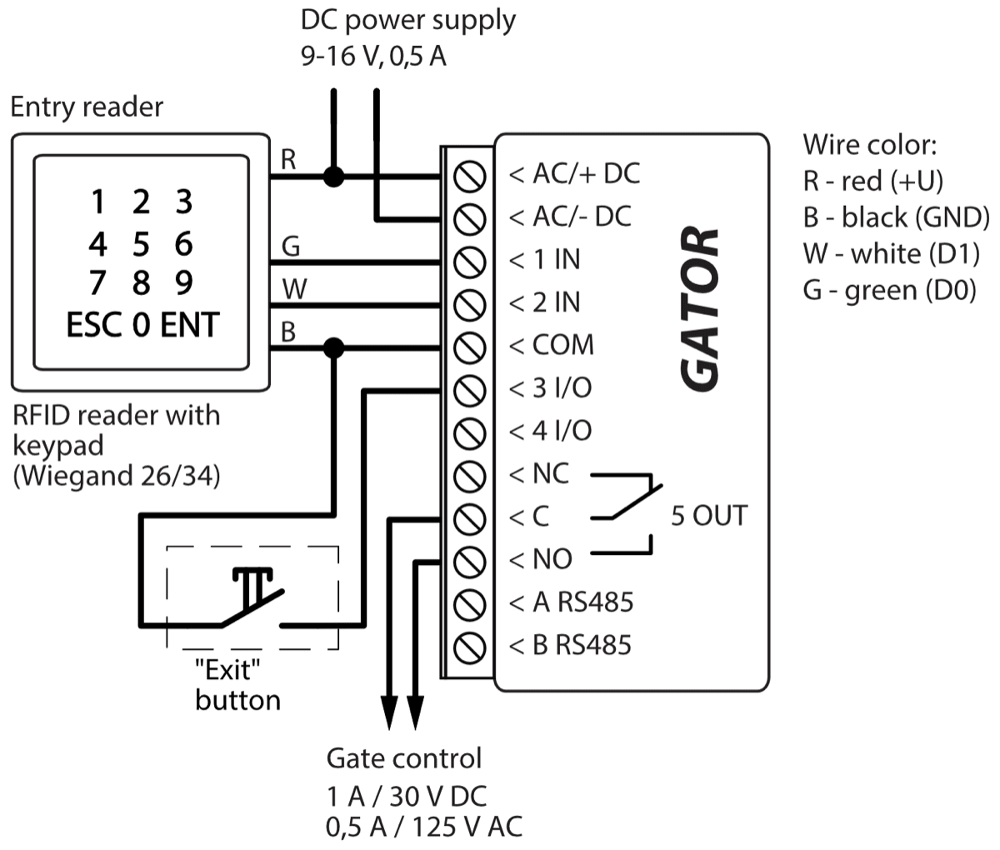

In the TrikdisConfig program, it should be noted that one RFID reader and the "**Exit**" button will be used. When by pressing the “**Exit**” button, the 5OUT output of the controller will be activated for the set pulse duration. When the “**Exit**” button is not connected to the controller, then it is not necessary to mark the field “**IO3** **as exit button**”.

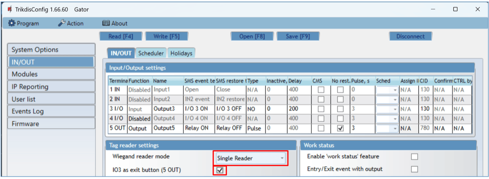

Schematic for connecting of two RFID readers to GATOR controller.

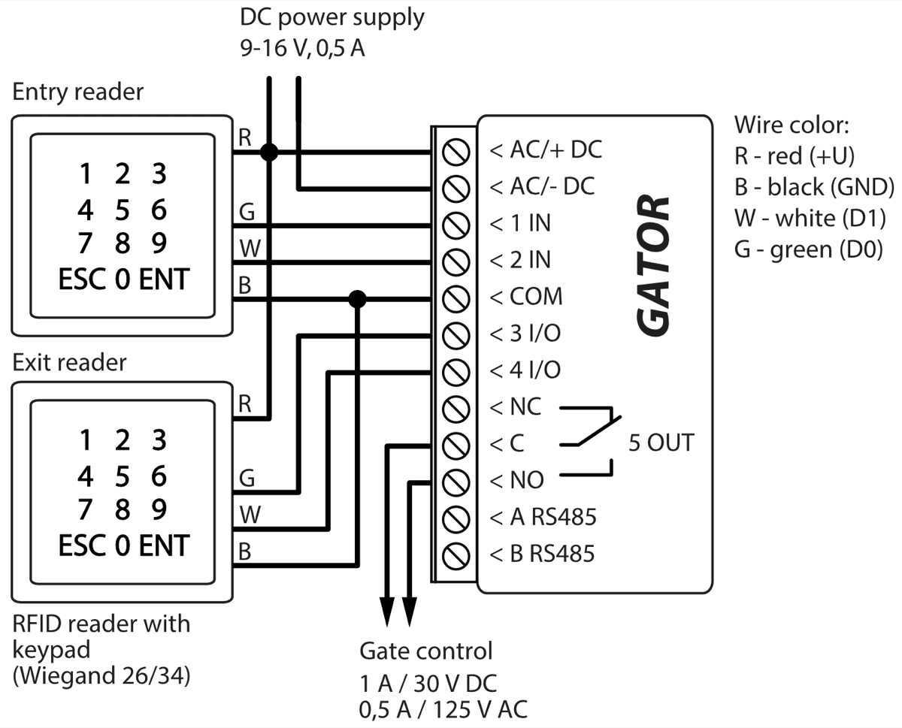

When connecting two RFID readers to the controller, it should be noted in the TrikdisConfig program that two RFID readers will be used.

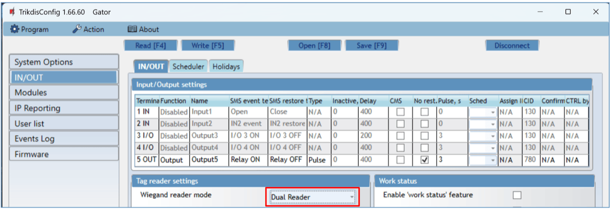

### Schematic for connecting the W485 WiFi module {#schematic-for-connecting-the-w485-wifi-module .1.1-Po-pag-(nerodyti-turiny)}

Controller firmware version from 1.06. /​ The W485 module sends messages to the CMS (Central Monitoring Station) and to Protegus2 apps using a WiFi internet router. When WiFi connectivity is available, the controller sends event messages via the W485 module. When WiFi connectivity is disrupted, the controller sends messages via GPRS. When WiFi connectivity is re-established, the controller returns to sending messages via W485. /​ Configuration of the W485 WiFi module to work with the controller is described in chapter 5.4. „„Modules” window”. /​ **You do not need a SIM card, when using the *W485* with the controller*.***  
———————————————————————————————————————————————————————————————————————————————————————————————————————————————————————————————————————————————————————————————————————————————————————————————————————————————————————————- –

### Schematic for connecting the E485 “Ethernet” module {#schematic-for-connecting-the-e485-ethernet-module .2-Po-Pag}

Controller firmware version from 1.06. /​ The E485 sends messages to the CMS (Central Monitoring Station) and to Protegus2 apps using a wired internet connection. Using the E485 with controller, CMS and GATOR messages are sent over wired Internet and mobile Internet is not used. If a wired internet connectivity is disrupted, the controller sends messages via the mobile Internet. When the wired Internet connectivity is re-established, controller starts sending messages via E485. /​ Configuration of the E485 module to work with the controller is described in chapter 5.4. „„Modules” window”. /​ **You do not need a SIM card, when using the *E485* with the controller*.***  
————————————————————————————————————————————————————————————————————————————————————————————————————————————————————————————————————————————————————————————————————————————————————————————————————————————————————————————————————————————— –

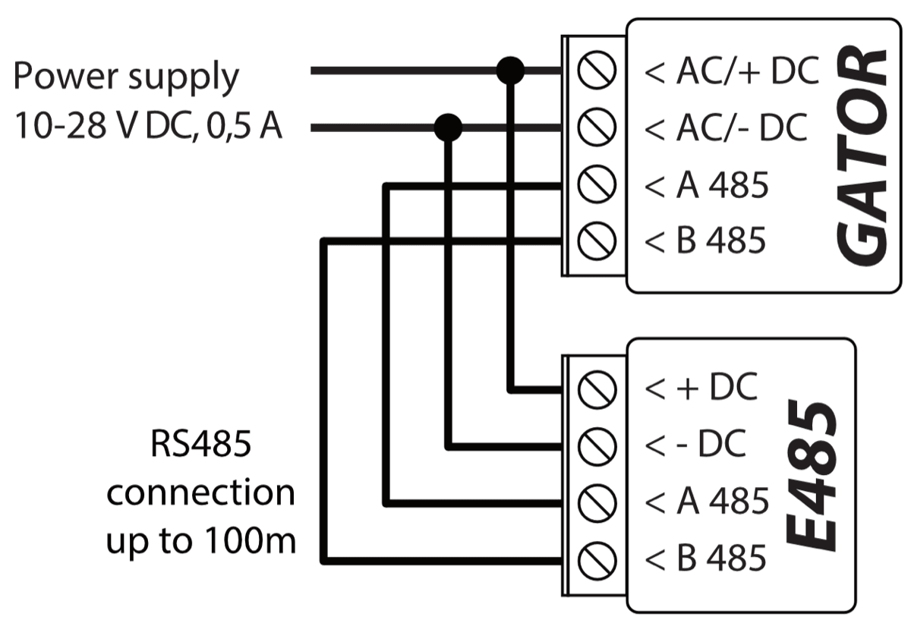

### Schematic for connecting of the iO-LORA expander with RFID reader {#schematic-for-connecting-of-the-io-lora-expander-with-rfid-reader .2-Po-Pag}

Firmware version of the GATOR controller from 2.13.

Connect the RF-LORA transceiver to the GATOR controller. After that, you can use the iO-LORA expander, to which the RFID reader (Wiegand 26/34) is connected. The RFID reader controls the PGM output of the iO-LORA expander, to which it is connected.

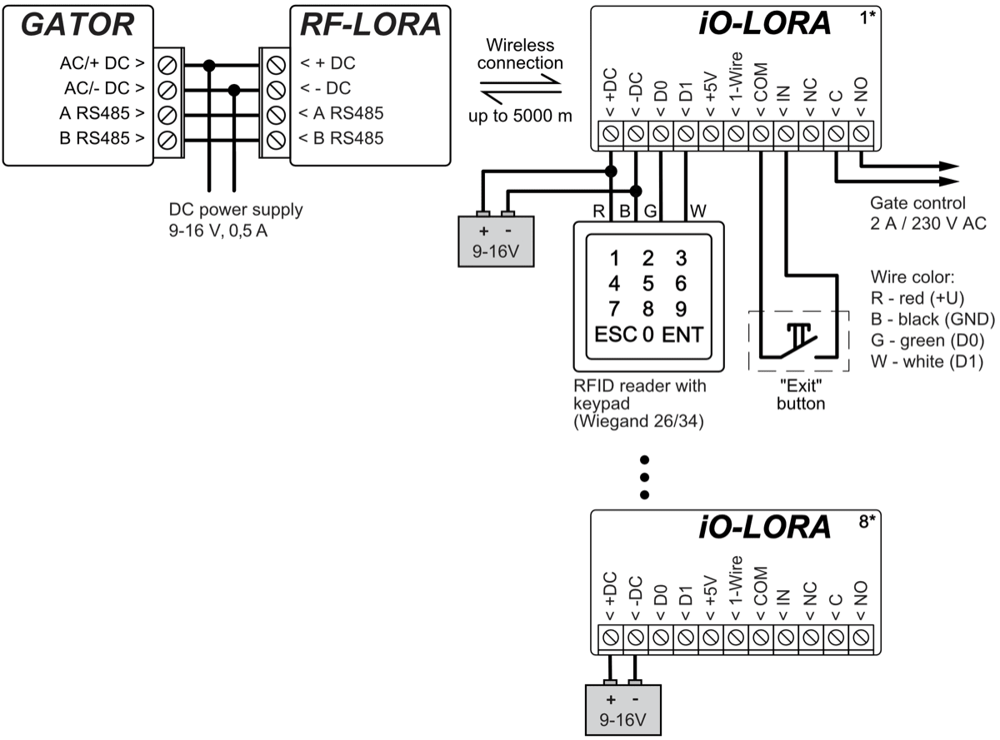

Launch TrikdisConfig. Connect GATOR via USB Mini-B cable to the computer or remotely. Press the **Read [F4]** button and the TrikdisConfig program will display the current controller settings. If requested, enter the Administrator or Installer 6-digit code in the pop-up window. Select "**iO-LORA controller**" from the "**Modules**" list. In the "**Serial No.**" field, enter the serial number of the device.

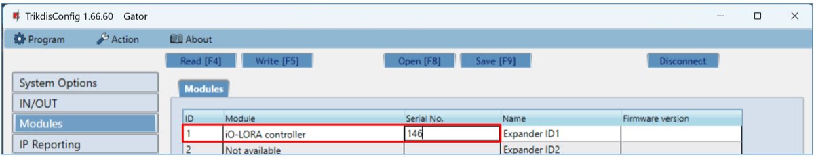

In the "**IN/OUT**" list, the "**EXIT button**" must be specified for the "**6 IN**" input. When the "**Exit**" button is pressed, the iO-LORA "**7 OUT**" output is activated for the set pulse duration.

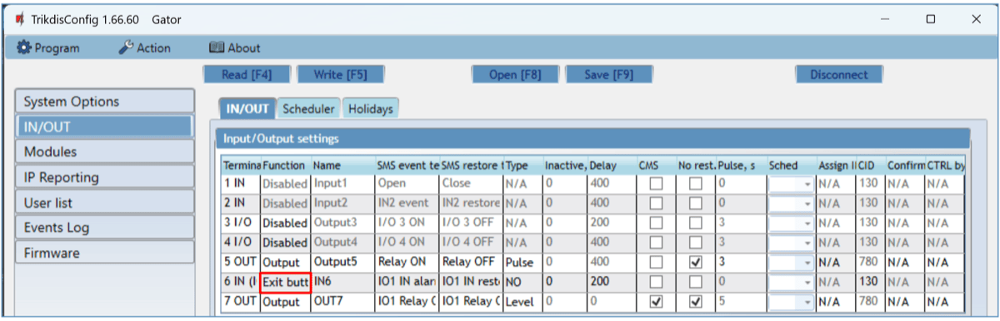

In the "**Users**" list, specify the number of the RFID card, the user's name, enable the permission to control the PGM output, specify the PGM output (which will be controlled by the user), the code. After completing the settings, click **Write [F5]**. Wait until the process of updating the controller settings is finished. Click "**Disconnect**" and disconnect the USB cable.

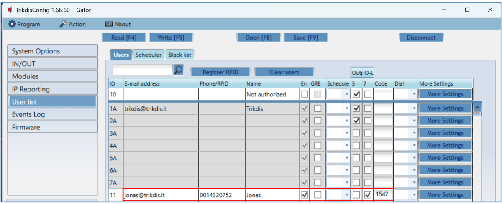

Activate PGM output with RFID card/code. Press the "**Exit**" button (the PGM output must activate for the set pulse duration).

## Quick set up of the controller

!!! note
    The controller comes factory pre-configured to work. A call from any phone to controller’s SIM card number will turn on the 5 OUT relay output for 3 (three) seconds. The controller can be installed without any additional configuration if such operation mode is acceptable.

1.  A nano-SIM card must be inserted into the controller. Turn off PIN code requests for the card before inserting it into the controller.

2.  Connect a power source to the controller (see 2 “Wiring schematics for the cellular gate controller”).

3.  Turn on the power for the controller. This should trigger the following controller LED indications:

- The “POWER” indicator should blink green;

- The “NETWORK” indicator should be green solid and blink yellow.

The default settings allow control by anyone who calls the phone number of the SIM card inserted into the controller.

If you want to allow only particular people to control the controller, send an SMS command with user phone numbers, who are authorized (example SMS command: ***SETU 123456 +370xxxxxxxx#Peter#peter@trikdis.com**).* After receiving such command, controller will react only to the phone numbers on the list. The controller will ignore incoming phone calls from other numbers.

!!! note
    If you wish to alter the default settings or turn on other functions of the controller, refer to chapter 5 „Setting of parameters using TrikdisConfig software”.

## Remote control

### Control with phone call {#control-with-phone-call .2-Po-Pag}

!!! note
    The first one to call (or send an SMS to) the controller will become the system administrator and will be the only one who can administer and control the controller with SMS commands.
Call the number of the SIM card inserted into the controller. The controller automatically rejects the call and turns on the *5 OUT relay output* for *3 (three)* seconds. Default settings allow anyone who calls the number of the SIM card inserted into the controller to control.

### Control with phone keyboard {#control-with-phone-keyboard .2-Po-Pag}

Controller answers and allows to control the outputs with a phone call the user is allowed to control several outputs OUT:

1.  Call the controller’s SIM card number. The controller will accept the call.

2.  Using the phone keyboard, dial the control command (command examples can be found in the table **DTMF control commands**).

> **DTMF control commands (does not work with GV17_2E70, GV17_2S70 modules)**

| DTMF code | Function | Description |
|-----------|----------|-------------|
| OUTPUT*STATE# | Output control | Output control command (turn on/turn off; turn on/turn off for
pulse time).
OUTPUT – number of the controlled output.
STATE – control command:

0 – turn off output;
1 – turn on output;
2 – turn off output for pulse time;
3 – turn on output for pulse time;
(output pulse time can be set using the
TrikdisConfig program, in the Input/Output
settings table)
# - control command end symbol.

E.g. (turn on output 5): 5*1#
E.g. (turn on input 4 for pulse time):
4*3# |
| # | Command end symbol | If you made a mistake writing a command, dial # and
enter the control command again. |

### Control using *Protegus2* Cloud {#control-using-protegus2-cloud .2-Po-Pag}

With Protegus2 cloud users will be able to control controller remotely. They will also be able to see the system state and receive all system event messages.

1.  Download and launch the Protegus2 app or use the browser version of Protegus2 at [www.protegus.app](http://www.protegus.app).

2.  Log in with your user name and password or register and create a new account.

!!! warning "Important"
    > When adding the controller to Protegus2 app:
    
    1.  The Protegus service must be turned on. Turning on the service is described in chapter 5.5 ““IP reporting” window”;
    
    2.  The power supply must be turned on („POWER” LED must blink green);
    
    3.  Must be registered in to network („NETWORK” LED must be green solid and blink yellow).
3.  Choose “**Add new system”**.
4.  Enter the controller “Unique ID (IMEI)” number found on the product or on the packaging sticker. Press “**Next**”.
5.  Enter the system name. Press "**Next**".
6.  Press „**Skip**”.
7.  Wait 1 minute.
8.  Activate the PGM output by clicking on the "**Output5**" icon.

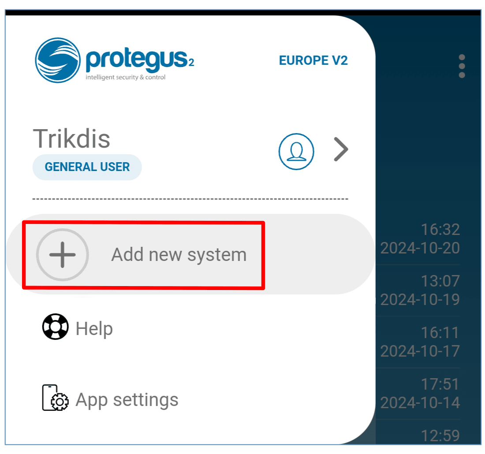 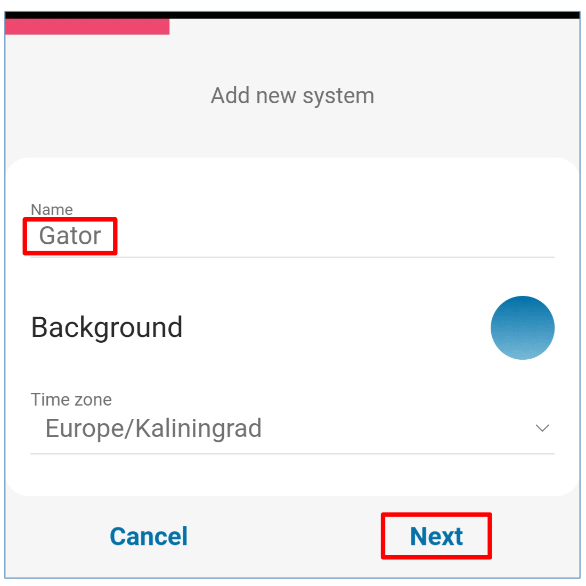7598425196850394in" />

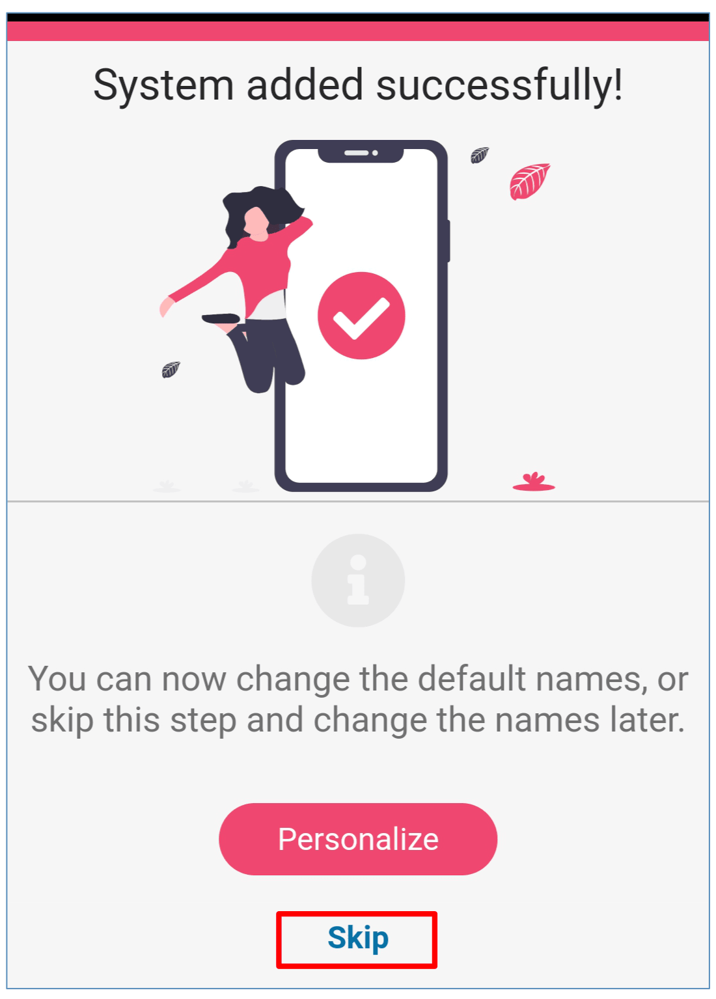

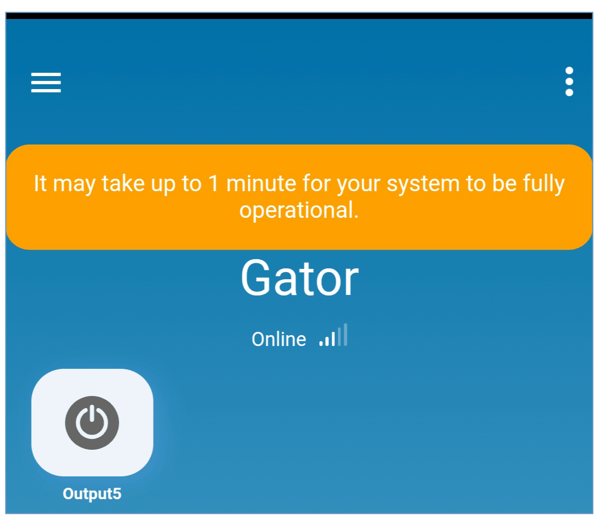

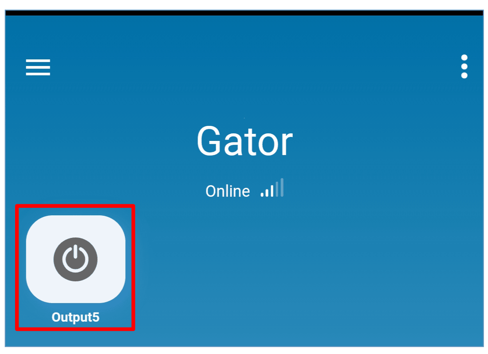

### Adding a Widget on your phone {#adding-a-widget-on-your-phone .1.1-Po-pag-(nerodyti-turiny)}

The gate control Widget can be placed on your phone’s home screen. The controller must be registered to Protegus2 cloud. Log in to Protegus2 app on your phone. Close the Protegus2 window.

Touch the screen with your finger and hold. A settings bar will appear.

1.  Press “**Widgets**”**.**

Find Protegus2 in the settings bar.

2.  Select „Protegus2”.
3.  Click on „**Switch** **Protegus2**”.
4.  Select “**Gator Output5**” controller output.

5.  Click on “**ADD WIDGET**”.
6.  An icon will appear on the phone’s screen.
7.  Return to the home screen. Press the icon.

> A circle that shows when the PGM is turned on will appear on the screen.

8.  When the controller is connected to the automatic gate with gate state indication, the icon will show the state of the open/closed gates.

 0708661417322833in" />

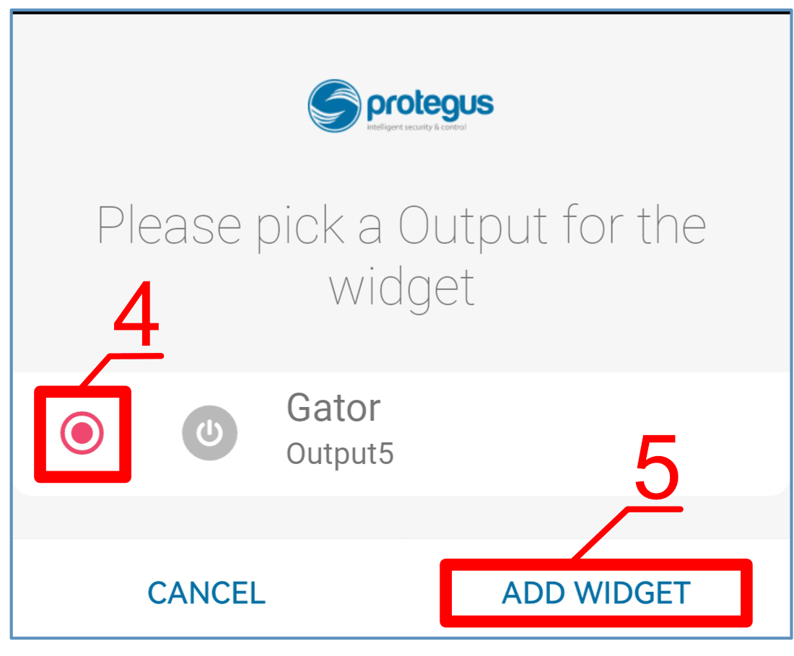

### Adding users on your phone {#adding-users-on-your-phone .2-Po-Pag}

| Launch Protegus2 application on your
phone. Log in with your user name and password.

1. Press „Settings”. |  |
|------------------------------------------------------------------------------------------------------------|--|
| Press „System configuration”. |  |
| Press „Users”. |  |
| Press „Add new user”. |  |
| Enter the user's e-mail address.
Enter the user's name.
Enter the user's phone number.
Select the PGM output that will be controlled by the
user.
Press „Add user”. |  |
| A new user appears in the user list.
Click „Back” to return to the main
window. |  |

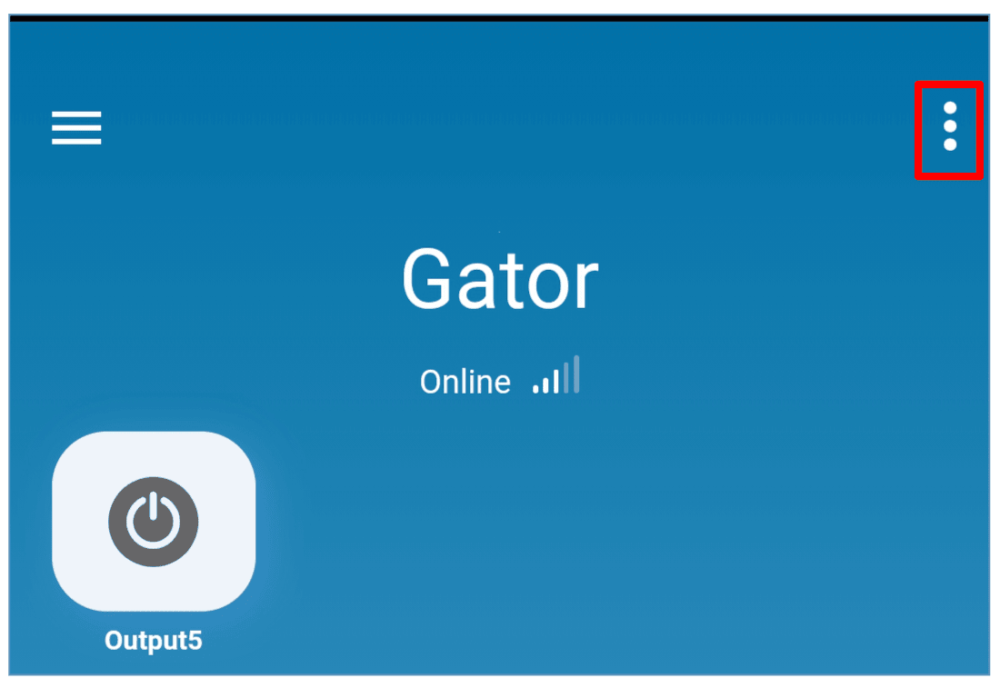

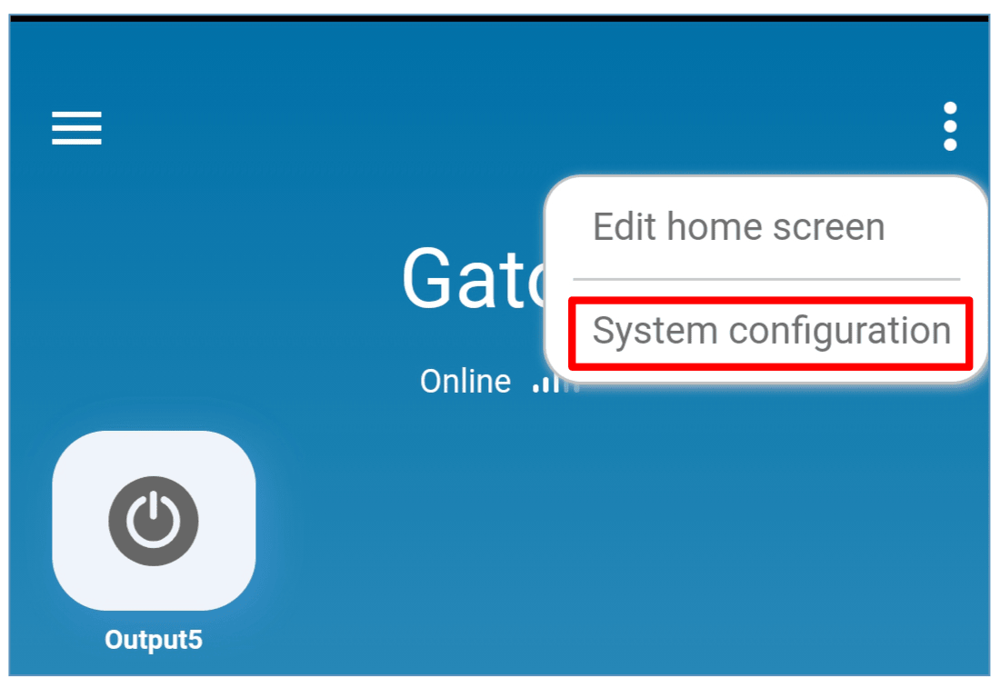

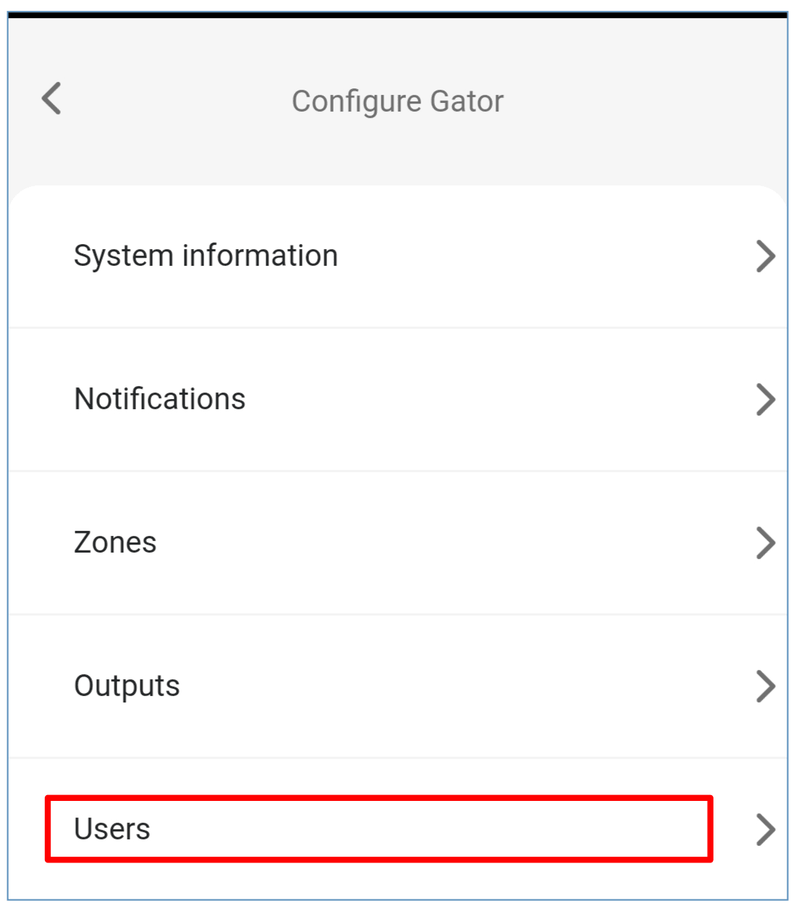

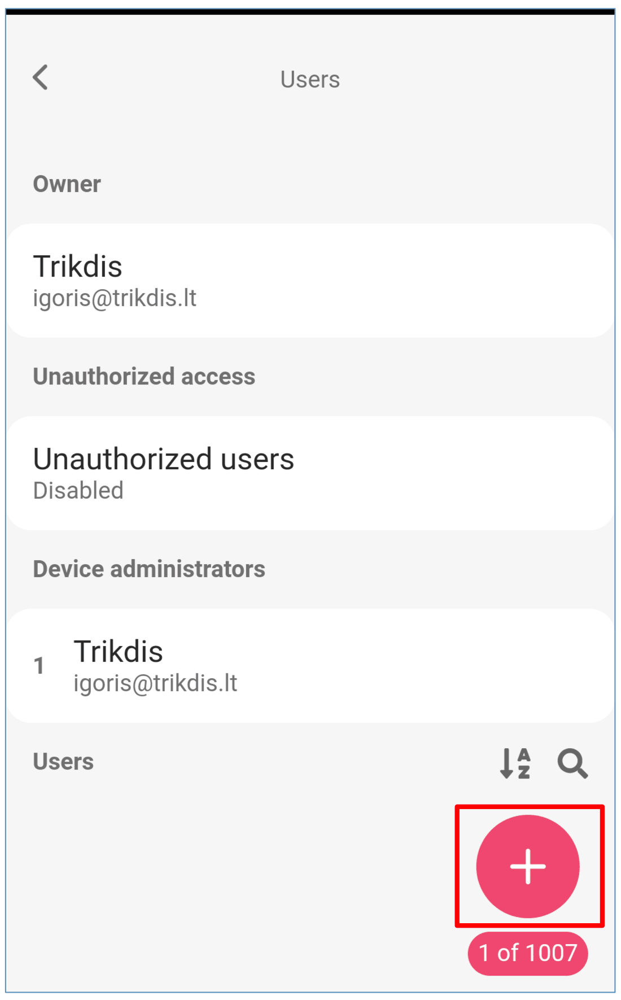

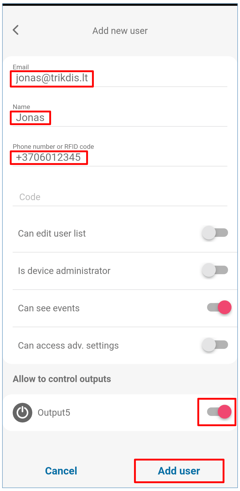

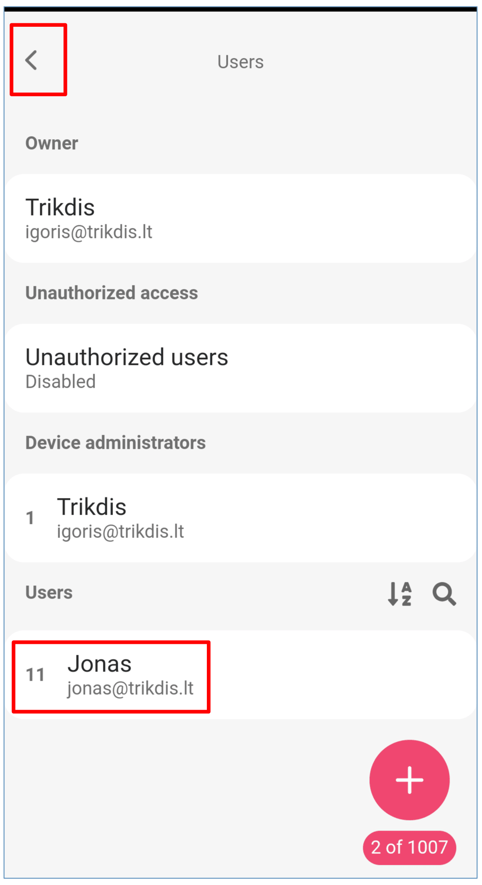

### Control with SMS messages {#control-with-sms-messages .2-Po-Pag}

Control the relay output OUT5 with these SMS commands:

> OUTPUT5 xxxxxx ON
>
> OUTPUT5 xxxxxx OFF
>
> OUTPUT5 xxxxxx PULSE=002

| xxxxxx | 6-symbol administrator password. (default
code – 123456). |
|--------|-----------------------------------------------------------|
| ON | Turn on output. |
| OFF | Turn off output. |
| PULSE=ttt | Turn on output for a specified time. “ttt”
is pulse time in seconds. |

You can control other outputs with SMS, but first they need to be turned on in TrikdisConfig.

SMS control command list

| Command | Data | Description |
|---------|------|-------------|
| OUTPUTx | ON | Turn on output. “x” – output number. E.g.: OUTPUT5 123456
ON |
| OUTPUTx | OFF | Turn off output. “x” – output number. E.g.: OUTPUT5
123456 OFF |
| OUTPUTx | PULSE=ttt |  |

### Configuration with SMS messages {#configuration-with-sms-messages .2-Po-Pag}

1.  **Changing the administrator’s password**

For safety reasons, change the default administrator password. Send an SMS message of this format:

> PSW 123456 xxxxxx

| 123456 | Default administrator password. |
|--------|---------------------------------|
| xxxxxx | New 6-symbol administrator password. |

2.  **Allow only authorized users to control the system**

You can allow only specific people to control the system. From an administrator’s phone, send SMS messages with the users’ phone numbers and names:

> SETU xxxxxx +PHONENO#NAME#EMAIL

| xxxxxx | 6-symbol administrator password. |
|--------|----------------------------------|
| PHONENO | User’s phone number. |
| NAME | User’s name. |
| EMAIL | User’s e-mail. |

Once the first number is added to the controller’s user phone list, the controller will react only to phone calls from the numbers on the list. The controller will ignore calls from other numbers.

3.  **Give administrator rights to another user**

You can give administrator rights to other people. They will receive system information messages and will be able to add users. Send an SMS message of this format:

> SETA xxxxxx Nox=+PHONENO#NAME#EMAIL

| xxxxxx | 6-symbol administrator password. |
|--------|----------------------------------|
| Nox | x – administrator’s number in the list.
(If you write 1, you will transfer your administrator
rights to another user.) |
| PHONENO | administrator’s phone number. |
| NAME | administrator’s name or e-mail. |
| EMAIL | administrator’s e-mail. |

SMS configuration command list

| Command | Data | Description |
|---------|------|-------------|
| INFO |  | Request information about the controller. The response will include:
controller type, IMEI number, GSM signal strength, power voltage
magnitude, software version, serial number, date and time. E.g.:
INFO 123456 |
| ASKI |  | Input status inquiry. E.g.: ASKI
123456 |
| ASKO |  | Output status inquiry. E.g.: ASKO
123456 |
| SETA | NoX=phoneno#name#email | Add administrator to list (administrator number from 1A to 7A). Adds
the phone number, name and e-mail to the specified line. The number must
be separated from the name with a hash (#). The number must start with
“+” and the international code.

E.g.: SETA 123456
No3=+37061234567#John#john_M@trikdis.com |
| SETA | NoX=DEL |  |
| SETU | phoneno#name#email | Add new user (user number from 11 to 1010). Adds the phone number,
name and e-mail to the list. The number must be separated from the name
with a hash (#). The number must start with „+” and the international
code.

E.g.: SETU 123456
+37061234567#Peter#peter@trikdis.com |
| DELU | phoneno | Delete user with specified phone number. E.g.: DELU
123456 +37061234567 |
| DELU | name |  |
| SETB | Email/phoneNo | Add entry into black-list (e-mail; phone No.). / E.g.:
SETB 123456 john_S@trikdis.com / E.g.:
SETB 123456 +37060123456 |
| DELB | ALL | Delete all black-list. E.g.: DELB 123456
ALL |
| DELB | Email/phoneNo |  |
| RESET |  | Restart the controller. E.g.: RESET
123456 |
| PSW | New password | Change password. E.g.: PSW 123456
654123 |
| TXTA | Object name | Set object name. E.g.: TXTA 123456
House |
| TXTE | N1=<TEXT> / …… /
N5=<TEXT> | Set SMS text about input or output activation. N1…N5 is the
number of the contact on the terminal block.

E.g.: TXTE
123456 N1=Alarm in the living room |
| TXTR | N1=<TEXT> / …… /
N5=<TEXT> | Set SMS text about input or output recovery. N1…N5 is the
number of the contact on the terminal block.

E.g.: TXTR
123456 N5=Relay turn off |
| SETD | IDx=yy | Set inactivity time for input “x”. “yy” is inactivity time in
minutes, from 0 to 2880. When the input is activated, the controller
will send a notification and will not react to any further circuit
disruptions during the set inactivity time. If 0 is entered, inactivity
will be turn off. E.g.: SETD 123456
ID1=30 |
| RESD | IDx | Resets inactivity time for input “x”, if the countdown has started.
/ E.g.: RESD 123456 ID1 |
| TIME | YYYY/MM/DD, /
HH:mm:ss | Set date and time. / E.g.: TIME 123456
2018/01/03,12:23:00 |
| RDR | PhoneNO#SMStext | Forwards the SMS text to the specified number. / E.g.:
RDR 123456 +37061234567#Refill account by
10EUR |
| HELLO | ON | Enable the function of informing a new user by SMS message about his
addition to the GATOR controller via the
Protegus2 app or SMS message.

E.g.:
HELLO 123456 ON |
| HELLO | OFF |  |
| UUSD | *UUSD code# | Sends UUSD code to mobile operator. Operator specified UUSD codes
are for checking or refilling the SIM card’s balance and for similar
operations.

E.g.: UUSD 123456 *245# |
| CONNECT | Protegus=ON | Connect to Protegus cloud. E.g.: CONNECT 123456
PROTEGUS=ON |
| CONNECT | Protegus=OFF | Disconnect from Protegus cloud. E.g.: CONNECT
123456 PROTEGUS=OFF |
| CONNECT | APN=Internet | APN name. E.g.: CONNECT 123456
APN=INTERNET |
| CONNECT | USER=user | APN user. E.g.: CONNECT 123456
USER=User |
| CONNECT | PSW=password | APN password. E.g.: CONNECT 123456
PSW=password |
| CONNECT | Code=password |  |

## Setting parameters using *TrikdisConfig* software

With TrikdisConfig you can change the controller’s settings (if default settings are not enough) according to the program window descriptions below.

1.  Download the configuration software TrikdisConfig from [www.trikdis.com/lt](http://www.trikdis.com/lt)/ (enter “TrikdisConfig” in the search field) and install it.

2.  Using a flat-head screwdriver, remove the controller’s lid as shown below: 3.  Connect the controller to a computer using a USB Mini-B cable.

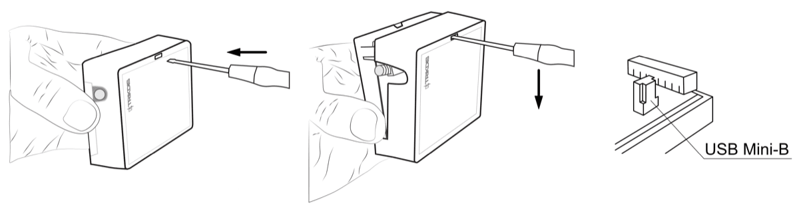

4.  Launch the configuration software TrikdisConfig. The program will automatically recognize the connected device and will automatically open the controller configuration window.

5.  Click **Read [F4]** to see current controller parameters. If prompted, enter administrator’s or installer’s code in the pop-up window.

!!! note
    The button **Read [F4]** will make the program read and show the settings currently saved on the device.

The button **Write [F5]** will save the settings made in the program to the device.

The button **Save [F9]** will save the settings into a configuration file. You can upload the saved settings to other devices later. This allows to quickly configure multiple devices with the same settings.

The button **Open [F8]** will allow to choose a configuration file and open saved settings.

If you want to revert to default settings, click on the “**Restore**” button at the bottom left of the window.

### TrikdisConfig status bar {#trikdisconfig-status-bar .2-Po-Pag}

After connecting the controller to the TrikdisConfig software, the software will show information about the connected device in the status bar:

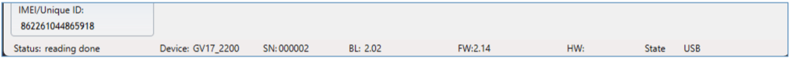

| Name | Description |
|------|-------------|
| IMEI/​Unique ID | The device’s IMEI number |
| State | Operational state |
| Device | Device type (must show GV17_xxxx) |
| SN | Device’s serial number |
| BL | Launcher version |
| FW | Device’s firmware version |
| HW | Device’s hardware version |
| State | Type of connection with the software (with USB or remote) |
| Role | Access level (shown after access code is approved) |

When the button **Read [F4]** is clicked, the program will read and show the settings currently saved on the controller. With TrikdisConfig, adjust the required settings according to the program window descriptions below.

### “System Options” window {#system-options-window .2-Po-Pag}

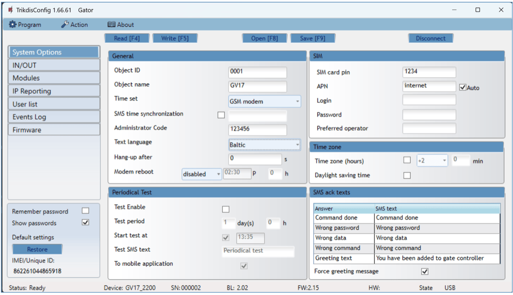

**Settings group “General”**

- **Object ID** – enter account number (4 symbol hexadecimal number, 0-9, A-F), provided by the central monitoring station (**Do not use FFFE, FFFF Object ID**).

- **Object name** – every event will be sent with the object name.

- **Time set** – choose a source for setting the time.

- **SMS time synchronization** - check the box and enter the SIM card phone number of the controller. The phone number must be with an international code.

- **Administrator Code** – with this code it is possible to change all of the parameters of the controller.

- **Text language** – SMS messages are sent with the symbols of the chosen language.

- **Hang-up after** – the controller declines the call after the specified time.

- **Modem reboot** - you can set the modem to restart at a specified time.

**Settings group “Periodical test”**

- **Test Enable** – if the box is ticked, periodic test messages are enabled.

- **Test period** – setting of test sending time period.

- **Start test at** – setting of test start time.

- **Test SMS text** – enter the test SMS message text.

- **To mobile application** – if the box is ticked, the test message will be sent to Protegus2 apps.

**Settings group “SIM”**

- **SIM card PIN** – enter the PIN code of the SIM card.

- **APN** – enter APN name. **Auto** - if the box is checked, the SIM card will automatically search for an APN based on the internal list. The internal list contains APNs of several global mobile operators and APNs of several countries for domestic mobile operators. If the mobile network operator is not found, the APN value entered in the box will be used.

- **Login** – if required, enter user name.

- **Password** – if required, enter password.

- **Preferred operator** - if a code is entered in the field, the controller will connect only to the selected mobile network operator. The mobile network operator code consists of MCC + MNC codes. This setting is relevant for global SIM cards.

**Settings group „Time zone”**

In the GATOR, you can set the current time of your country. To do this, you must specify the “**Time zone**” of your country and indicate if your country has a “**Daylight saving time**” conversion.

- **Time zone (hours)** – check the box and enter the time zone of your country.

- **Daylighting saving time** - check the box if your country is going to daylight saving time.

**Settings group „SMS ack texts”**

The text of SMS messages that the user will receive after sending SMS commands.

- **Force greeting message** - check the box to send an SMS message to the new user, who was added by SMS or Protegus2 app, to the gate controller. (By SMS (HELLO 123456 OFF) this function can be turned off).

### “IN/OUT” window {#inout-window .2-Po-Pag}

**“IN/OUT” tab**

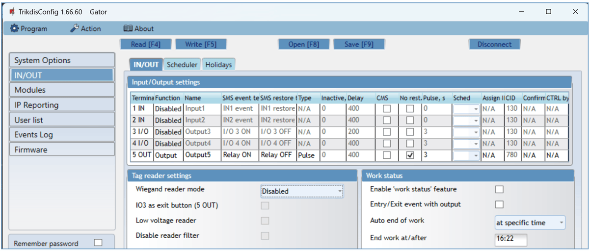

**Settings group „Input/Output settings”**

- **Terminal** – controller’s input and output terminal numbers.

- **Function** – terminal type (input, output, turned off).

- **Name** - enter the name of the IN input or OUT output.

- **SMS event text** – enter SMS message event text.

- **SMS restore text** – enter SMS message text for when terminal is restored.

- **Type** – specify input type (NC, NO, EOL=10kΩ).

- **Inactive** –input will be inactive for specified time after first activation. Enter 0 if you want to turn this function off.

- **Delay** – input (zone) reaction time, ms.

- **CMS** – if box is ticked, the message will be sent to CMS (Central Monitoring Station) and to Protegus2 app.

- **No rest**. – do not send restore event.
- **Pulse time** – time for which the output is turned on, when output is set as “**Pulse**” type.

- **Sched** – assign a schedule number for controlling the output.

- **Assign IN** – assign input (IN) to output to see the actual state of the device depending on the input’s state.

- **CID** – Сontact ID code.

- **Confirm** - specify the number of the input, when the input is triggered, control of the output (OUT) will be enabled.

- **CTRL by IN** - the selected input activates the output.

  **Settings group „Tag reader settings”**

- **Wiegand reader mode** - specify the number of “Wiegand” RFID readers connected to the controller.

- **IO3 as exit button (5 OUT)** – mark the box if the "Exit" button is connected to the IO3 input of the controller, and activation of the IO3 input will trigger the output (5OUT) for the duration of the set pulse.

- **Low voltage reader** – check the box and the low voltage reader mode will be enabled.

- **Disable reader filter** - check the box and the internal device filter for the reader that sends short pulses will be disabled.

  **Settings group „Work status”**

- **Enable “work status” feature** - by checking the box, enable the indication of the “**Work status**” in the Protegus2 app.

- **Entry/Exit event with output** - ticking the field will send Entry/Exit event messages, when output is controlled remotely.

- **Auto end of work** - you can specify when the time tracking will be completed.

- **End work at/after** – specify the end of the working time tracking. Depending on the previous setting, either a specific time of day or a time interval is entered.

  **“Scheduler”** **tab**

  Outputs can be controlled automatically according to a set schedule.

  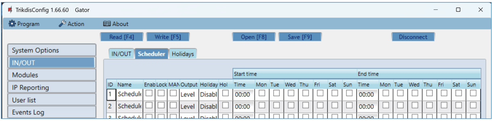

- **Name** - enter the name of the schedule.

- **Enable** – enable the time schedule for when the controller will control the output.

- **Lock** - check the box to prevent the output from being controlled by other means when it is triggered according to the specified schedule.

- **MANUAL** - check the box to prevent the scheduler from enabling the output at startup. The schedule will only start running when the output is activated by the user.

- **Output mode** – specify the mode of operation of the PGM output: “**Level**” - the output will be activated for the specified time period; “**Pulse**” **-** the output will be activated at the start and end of the schedule for the set pulse duration.

- **Holiday mode** - specify the mode of how the time schedule should work when the holidays begin.

- **Start time** – specify the time and days of the week from when the output will be turned on.

- **End time** – specify the time and days of the week until when the output will be turned on.

  If the PGM output mode is set to “**Level**” and only “**End time**” is specified in the “**Scheduler**” table, then the PGM output will be disabled at the specified time, if it was enabled. An output control schedule must be assigned to an PGM output.

  **“Holidays”** **tab**

Enter the calendar holidays during which it will be possible to set the additional activation of the PGM output provided in the Scheduler table.

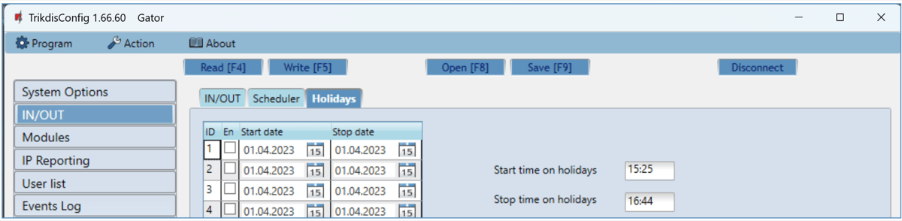

- **En.** – check the box to specify a specific holiday interval.

- **Start date –** specify the start date of the holidays.

- **Stop date** – specify the end date of the holidays.

- **Start time on holidays** – specify the start time of the holidays.

- **Stop time on holidays** - specify the end time of the holidays.

### “Modules” window {#modules-window .2-Po-Pag}

**„Modules” tab**

The following modules can be connected to the GATOR controller: iO-LORA, W485, E485.

By connecting the RF-LORA transceiver, up to 8 iO-LORA wireless expanders can be connected to the GATOR controller. RFID readers connected to the iO-LORA wireless expansion modules can control up to 8 more PGM outputs (GATOR controller firmware version from 2.13). One iO-LORA expander with an RFID reader controls only one PGM output.

If there is wireless internet (WiFi) or wired internet at the controller installation site, the W485 WiFi module or the E485 „Ethernet” module can be connected to the controller. The module will be able to transfer data to Protegus2 cloud and CMS (central monitoring station) via the Internet. Using a module (W485 or E485) with controller: 1) does not use mobile internet, it is also possible to disable controller GPRS data transmission; 2) You can use the controller without a SIM card (controlled by the Protegus2 apps).

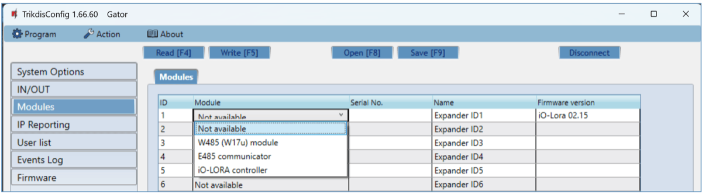

- **Modules** – select the module that is connected to the gate controller via RS485 from the list.

- **Serial No.** – enter the module serial number (6 digits), which is indicated on stickers on the module’s case and packaging.

After selecting the connected module and entering its serial number, go to **Modules** → **Parameters.**

**„Parameters” tab**

**WiFi module W485 settings window**

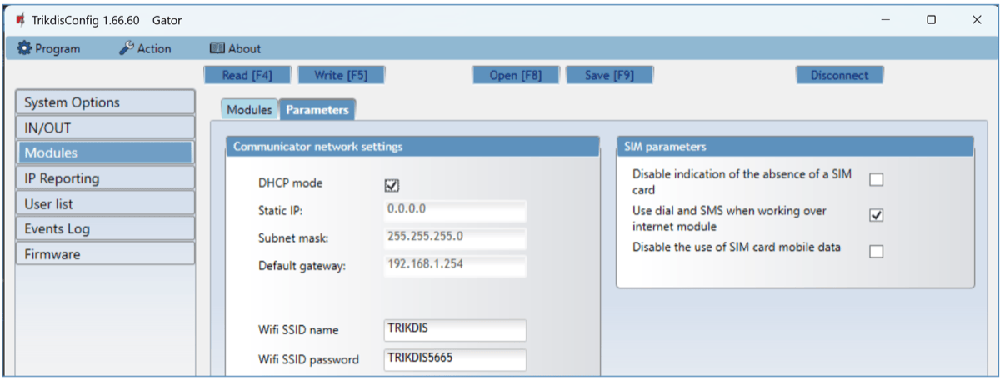

**Settings group „Communicator network settings”**

- **DHCP mode** – WiFi module’s mode for registering to network (manual or automatic). Check the box (automatic registration mode) and the WiFi module will automatically scan the network settings (subnet mask, gateway) and will be assigned an IP address.

  - **Static IP** – static IP address for when manual registering mode is set.

  - **Subnet mask** – subnet mask for when manual registering mode is set.

  - **Default gateway** – gateway address for when manual registering mode is set.

  - **Wifi SSID name** – name of the WiFi network that the W485 will connect to.

- **Wifi SSID password** - WiFi network password.

**Settings group „SIM parameters”**

- **Disable indication of the absence of a SIM card** – checking the box will disable the indication of the absence of the SIM card in the controller.

- **Use dial and SMS when working over internet module** – checking the box will enable control of the gate controller via call and SMS. If the field is not checked and there is a WiFi network, then the call and SMS messages are not used. If the field is unchecked and there is no WiFi network, then controller can manage call and SMS messages. Controller will send SMS messages to the user.

- **Disable the use of SIM card mobile data** – checking the box will disable the use of mobile data from the SIM card. Data will only be sent via module W485. If the WiFi network is disconnected, controller will store data in memory. After restoring the WiFi network, the controller will send the saved data via the WiFi W485 module.

**„Ethernet” module E485 settings windows**

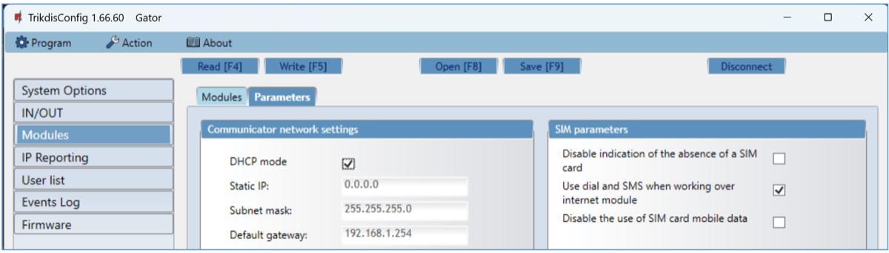

**Settings group „ Communicator network settings”**

- **DHCP mode** – „Ethernet” module’s mode for registering to network (manual or automatic).

- **Static IP** – static IP address for when manual registering mode is set.

- **Subnet mask** – subnet mask for when manual registering mode is set.

- **Default gateway** – gateway address for when manual registering mode is set.

**Settings group „ SIM parameters”**

- **Disable indication of the absence of a SIM card** – checking the box will disable the indication of the absence of the SIM card in the controller.

- **Use dial and SMS when working over internet module** – checking the box will enable control of the gate controller via call and SMS. If the field is unchecked and there is internet, then SMS and calls are not used. If the field is unchecked and there is no Internet, then controller can manage call and SMS messages. Controller will send SMS messages to the user.

- **Disable the use of SIM card mobile data** – checking the box will disable the use of mobile data from the SIM card. Data will only be sent via module E485. If the internet disappears, controller will store data in memory. When the Internet is restored, the controller will send the saved data via the “Ethernet” E485 module.

### “IP Reporting” window {#ip-reporting-window .2-Po-Pag} The controller can send messages to the security company's CMS receiver.

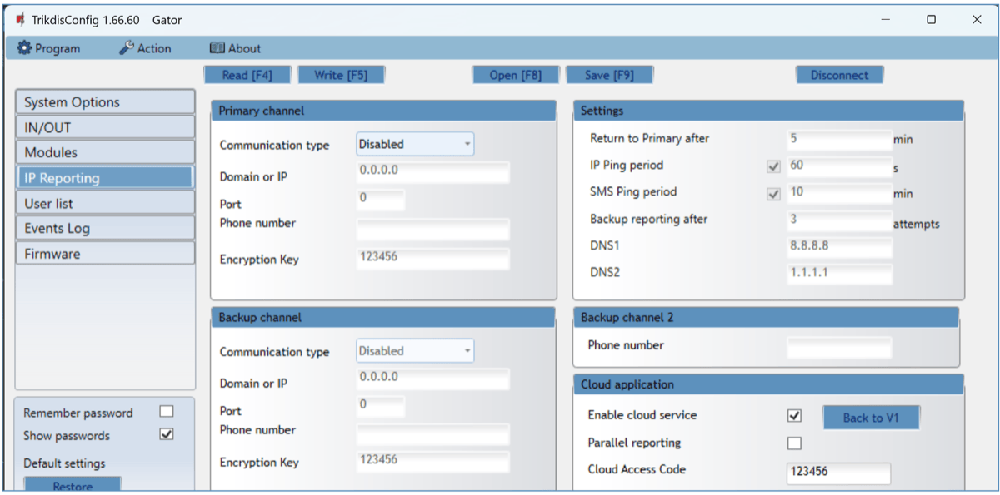

**Settings group “Primary channel”**

- **Communication type** – choose the type of communication (IP, SMS) with the CMS (Central Monitoring Station) receiver.

- **Domain or IP** – enter the receiver’s domain or IP address.

- **Port** – enter the receiver’s network port number.

- **Phone number** – phone number of CMS receiver capable of receiving SMS messages (e.g.: 370xxxxxxxx), when selected **Communication type** is SMS.

- **Encryption Key** – 6-digit message encryption key that must match the encryption key of the CMS receiver.

**Settings group “Backup channel”**

The settings are identical to those of the main communication channel.

**Settings group “Settings”**

- **Return to primary after** – time period after which the controller will attempt to regain connection with the primary channel.

- **IP Ping period** – enable sending of PING signal and set the length of its period.

- **SMS Ping period** – enable sending of PING signal and set the length of its period.

- **Backup reporting after** – specify amount of attempts to connect with the main channel, after which the controller will automatically connect to the backup connection channel.

- **DNS1 and DNS2** – IP addresses of DNS servers.

**Settings group “Backup channel 2”**

- **Phone number** - phone number of CMS receiver capable of receiving SMS messages (e.g.: 370xxxxxxxx). The backup SMS channel is used when messages fail to send with both primary and backup channels. It is extremely useful because it functions even when IP connectivity is disrupted in the mobile operator’s network. This channel works only when GPRS mode is set both for the main channel and backup channel. SMS messages will be sent to the response center’s SMS receiver: 1) as soon as the controller is enabled for the first time; 2) after loss of TCP/IP or UDP/IP connection in the main and backup channels.

**Settings group “Cloud application”**

- **Enable cloud service** –by ticking the box, enable the cloud service. The controller will be able to communicate with the Protegus2 app and it will be possible to remotely configure the controller with the TrikdisConfig program.

- **Parallel reporting** – the messages are sent simultaneously to the CMS, Protegus2 app and to users. When not enabled, messages to Protegus2 app and users will be sent only after being sent to CMS.

- **Cloud Access Code** – 6-digit code for connecting with Protegus2 (default code - 123456).

### “User list” window {#user-list-window .2-Po-Pag}

**“Users” tab** - **ID** - user serial number. Numbers with the letter "A" (1A to 7A) are administrator numbers that can make settings on the controller, control outputs, and receive messages from the gate controller. Other user numbers (11 to 1010) can control outputs.

- **E-mail address –** specify user’s e-mail address.

- **Phone/RFID** – specify administrator’s phone number (e.g.: +370xxxxxxxx).

- **Name –** specify user’s name.

- **En** - check the box for the user to be activated.

- **GRE -** check the box to send an SMS message to the GATOR user.

- **Scheduler** – select the schedule number by which the user will be allowed to control the controller.

- **Output** - mark the number of the output that will be controlled by the user.

- **Code -** if an RFID reader with keypad (Wiegand 26/34) is connected to the controller, then the user can enter the control code.

- **Dial** - mark the outputs that will be automatically activated when making a call (if the user has several OUT outputs assigned), after which the call will be rejected.

- **More settings** - by clicking on the “**More settings**” button, an additional user settings window will open.

!!! note
    If box “**En.**” is unticked for user “**No.10**” with the name “**Not authorized**”**,** users not on the users list will be banned from controlling the controller with phone call.

**Administrator settings (numbers from 1A to 7A)**

| ID – administrator number.
Enabled – boxed is ticked, user is allowed to
control outputs OUT.
Name – specify administrator’s name.
E-mail address – specify administrator’s e-mail
address.
Phone or RFID code – enter the administrator
phone number or the ID number of the RFID pendant (card).
Keypad code – if an RFID reader with keypad
(Wiegand 26/​34) is connected to the controller, then the user can enter
the control code.
ACK for SMS message – administrator will get
answer SMS messages when they control and configure the controller with
SMS messages.
Receive test SMS – check the box and
administrator will receive test messages. |  |
|-------------------------------------------------------------------------------------------------------------------------------------------------------------------------------------------------------------------------------------------------------------------------------------------------------------------------------------------------------------------------------------------------------------------------------------------------------------------------------------------------------------------------------------------------------------------------------------------------------------------------------------------------------------|--| - **Forward unknown SMS** – SMS message forwarding from unknown numbers.

- **SMS notification for** – specify events (IN1, IN2, OUT3, OUT4, OUT5) that the administrator will receive SMS notifications about.

- **Can control output** - mark the output number that will be controlled by the administrator.

- **Greetings** – check the box to send a welcome SMS message to the user by the GATOR controller**.**

- **Automatic call control** - check the outputs that will be automatically activated on a call (if the user has multiple OUT outputs assigned), after which the call will be rejected.

  **User settings (numbers from 11 to 1010)**

| ID – user number.
Enabled – boxed is ticked, user is allowed to
control outputs OUT.
Name – specify user’s name.
E-mail address – specify user’s e-mail
address.
Phone or RFID code – enter the user phone number
or the ID number of the RFID pendant (card).
Keypad code – enter user code of RFID reader
with keypad.
Assign schedule – assign a schedule (specify the
required schedules numbers) for when the user can control outputs
OUT.
Valid from – specify date and time from when the
user can control the controller.
Valid until – specify date and time until when
the user can control the controller. |  |
|------------------------------------------------------------------------------------------------------------------------------------------------------------------------------------------------------------------------------------------------------------------------------------------------------------------------------------------------------------------------------------------------------------------------------------------------------------------------------------------------------------------------------------------------------------------------------------------------------------------------|--| - **Enable counter** – check the box to enable the counter.

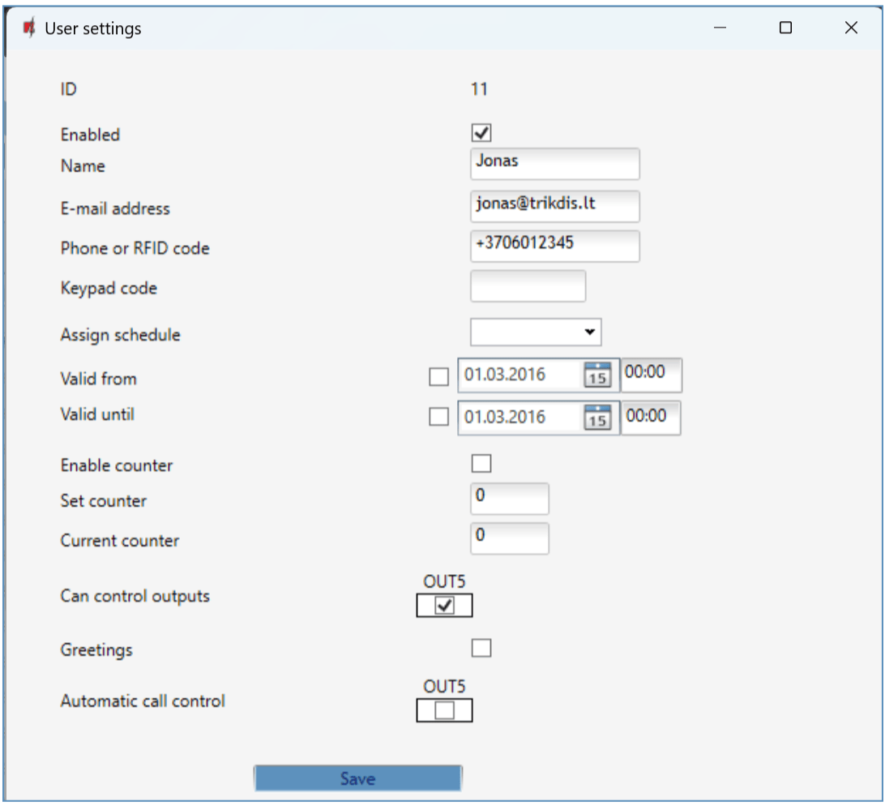

- **Set counter** – specify number of times that user can control the controller during the chosen time.

- **Current counter** - current number of control times.

- **Can control outputs** - mark the number of the output that will be controlled by the user.

- **Greetings** – check the box to send a welcome SMS message to the user by the GATOR controller**.**

- **Automatic call control** - check the outputs that will be automatically activated on a call (if the user has multiple OUT outputs assigned), after which the call will be rejected.

#### RFID pendant (card) registration {#rfid-pendant-card-registration .3-po-Pag}

1.  Connect the RFID reader to the controller (see p.2.6 " Schematic for connecting for RFID reader (Wiegand 26/34)"). Turn on the power to the controller. Connect the USB Mini-B cable to the controller. Specify how many RFID readers are connected in the TrikdisConfig window "IN / OUT".

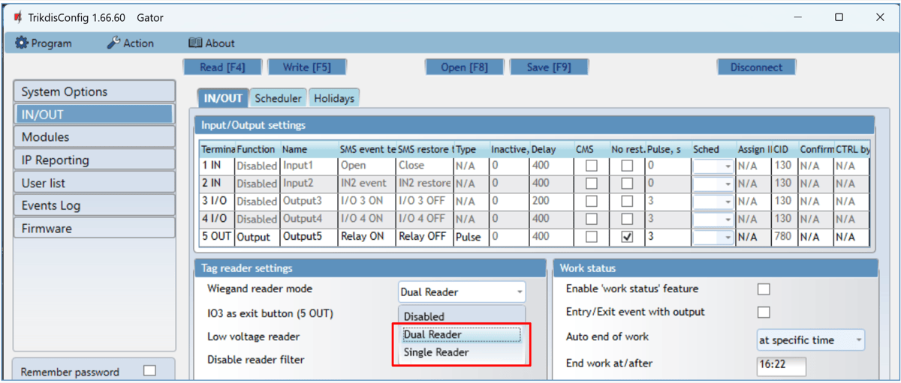

Click “**Register RFID**” in the “User list” window.

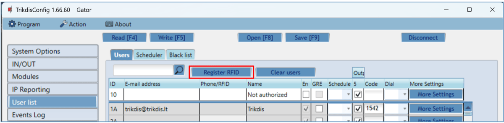

The RFID pendants (cards) registration window will open.

Attach the RFID pendant (card) to the RFID reader. A new window will open when the reader scans the pendant (card). In it, “**Enter user name**” and select the “**User can control PGM Output 5**”. Press the “**ADD**” button.

Repeat the steps above to add more RFID pendant (cards). When the registration of all RFID pendant (cards) is completed, press the “**STOP registration**” button.

Press the button **Write [F5]** to save the RFID pendant list to the controller.

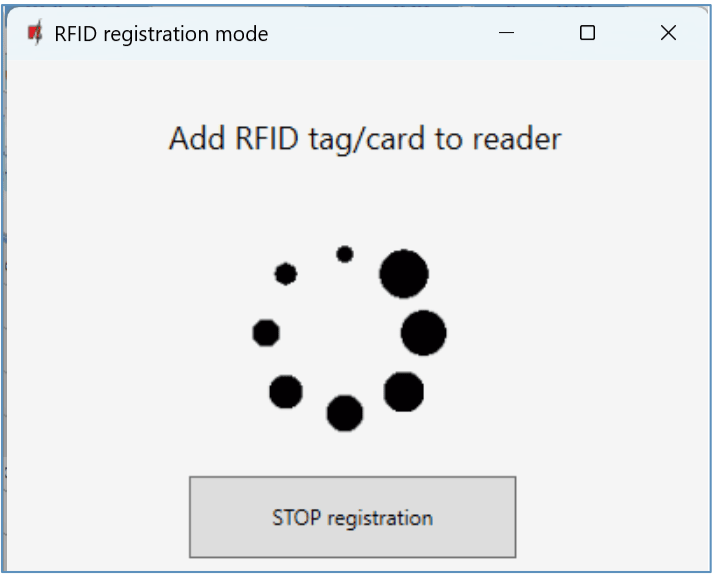

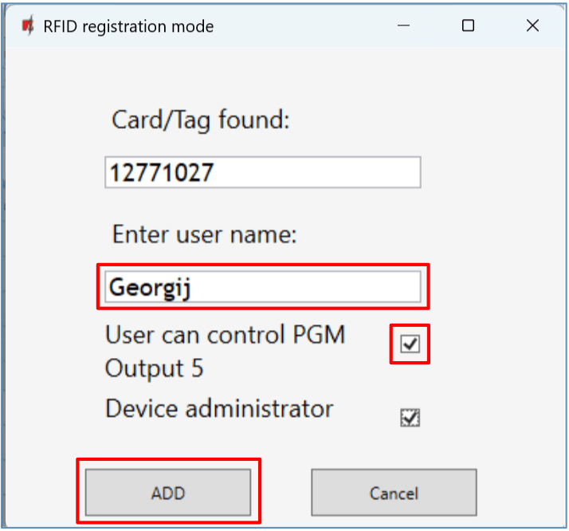

!!! note
    entering their ID numbers in the "**Phone/RFID**" field. Give the user a Name, check field the "**En.**" and a managed "**Outputs**" field. Press the **Write [F5]** button to save the list of RFID pendants (cards) to the controller.

/ The ID number on the RFID card.
 2.  RFID pendant (card) registration with Protegus2 application.

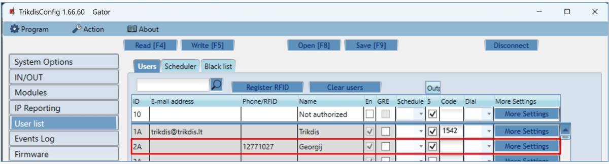

In the Protegus2 application, select “**Add New User**”. Enter e-mail address, user name, RFID pendant (card) ID number, user 4-character code (when using an RFID keypad reader). Mark the controlled “**Output**”. Press “**NEXT**”. New user with RFID pendant (card) added to user list.  
—————————————————————————————————————————————————————————————————————————————————————————————————- –

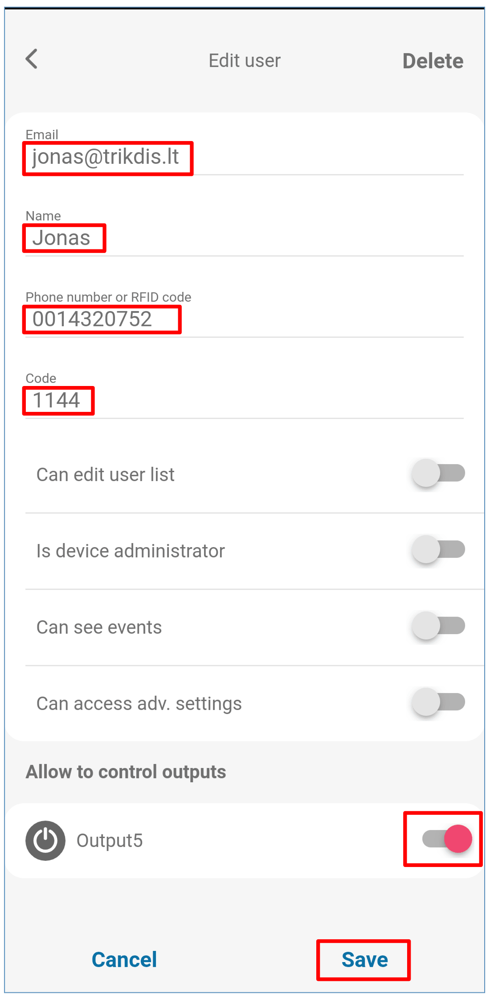

**“Scheduler” tab**

The user can control the Outputs according to the set schedule. Schedule must be assigned to user.

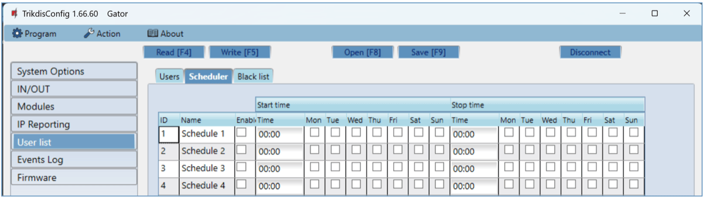

- **Name** - enter a name for the schedule.

- **Enable** – enable time schedule when the user will be able to control the controller’s outputs.

- **Start time** – specify time and days of the week from when the user can control controller’s outputs.

- **Stop time** – specify time and days of the week until when the user can control controller’s outputs.

**“Black list” tab** The “**Black list**” contains e-mail addresses, phone numbers, RFID pendant (card) ID numbers of users who are banned from controlling the controller.

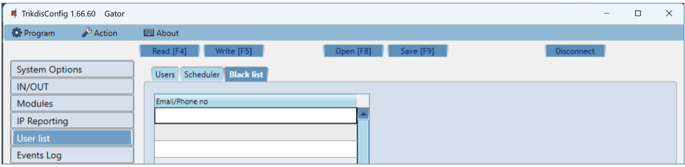

There is an easy way to add new items to the black list straight from the events log. Right-click on a telephone number, e-mail address, RFID pendant (card) ID number and choose “**Add to black list**”.

### “Events Log” window {#events-log-window .2-Po-Pag} Click the button “**Read Log**”. The events log will be read from the controller’s memory. The “**Events log**” provides information about the controller’s actions and its internal events.

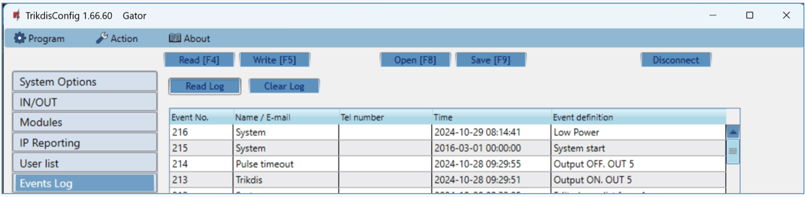

### Restore default settings {#restore-default-settings .2-Po-Pag}

To restore the default settings of the controller you need to click the “**Restore**” button in the TrikdisConfig program window.

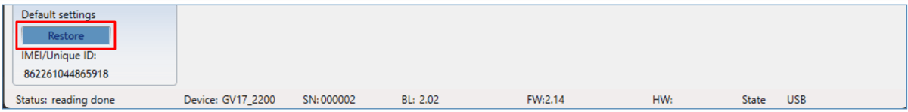

### Settings for gate state indication {#settings-for-gate-state-indication .2-Po-Pag}

Protegus2 app and Widget can show the current state of the gates (closed or open). For this to work, the controller’s input IN1 must be connected to the automatic gate’s state output as shown in chapter 2.5 “Schematic for connecting an automatic gate opener to the controller”.

In the TrikdisConfig window “**IN/OUT**”, assign the connected input to the controller output that will control the gates: If you want to receive SMS messages about the gates opening/closing, enter SMS texts for input 1IN event/restore.

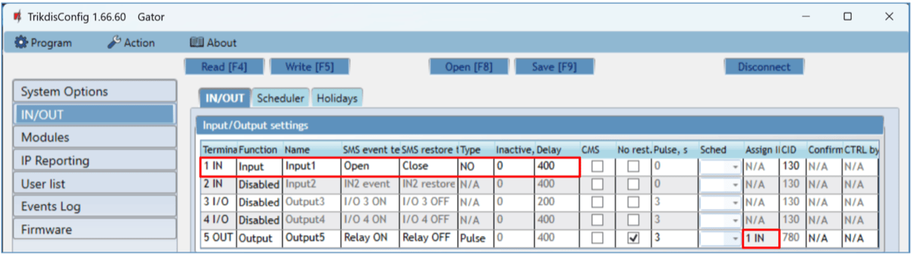

In the "**Users**" window, click on the “**More settings**” button.

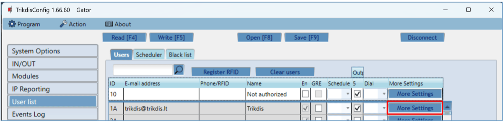

In the “**User settings**” window, tick the IN1 box if you want the user to receive SMS messages about the state of the gate. Click “**Save**”.  
————————————————————————————————————————————————- –

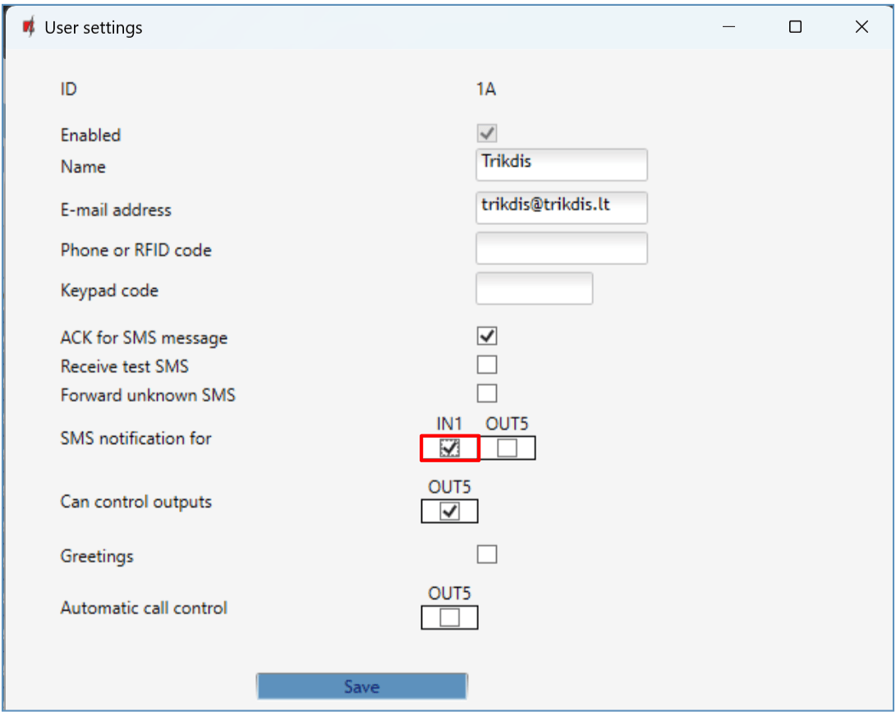

## Setting parameters remotely

!!! important
    Remote configuration will only work when:

1.  Protegus service is enabed. Enabling the service is described in chapter 5.5 ““IP reporting” window”;
>
2.  Power is on („POWER” LED is blinking green);
>
3.  Connected to network („NETWORK” LED is green solid and yellow blinking).

1.  Download the program TrikdisConfig from [www.trikdis.com](http://www.trikdis.com).

2.  Make sure that the controller is connected to the internet and connection to Protegus is enabled***.***

3.  Launch the configuration program TrikdisConfig and in the field “**Unique ID**” of the “**Remote access**” section enter the “**IMEI/Unique ID**” number of your controller (the IMEI number is given on the stickers that can be found on the lower part of the device’s case and on the packaging).

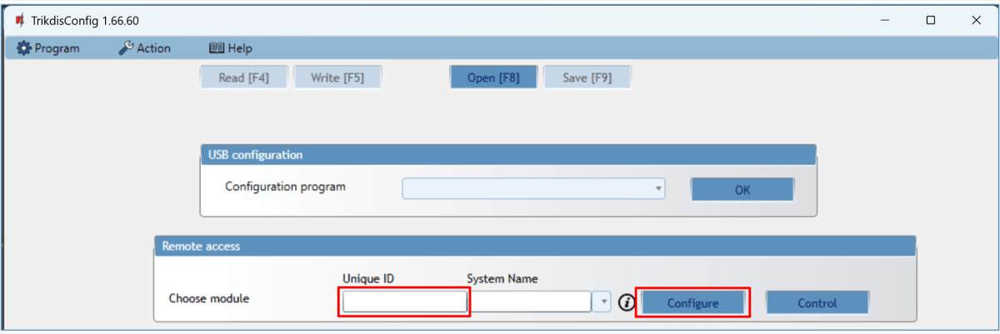

4.  In the field “**System Name**” you can give any name to this controller. Click “**Configure**”.

5.  The controller configuration window will open. Click the button **Read [F4]** for the program to read the parameters currently set for the controller. If a window for entering the *Administrator code* opens, enter the six-symbol *administrator code*. To make the program remember the code, tick the box next to “**Remember password**” and click the button **Write [F5]**.

6.  Set the desired settings for the controller and afterwards click **Write [F5]**. To disconnect from the controller click “**Disconnect**” and exit the TrikdisConfig program.

# Testing of GSM gate controller

  

When configuration and installation are finished, test the system:

1.  Check if the power is on;

2.  Check network connectivity (“**NETWORK**” indicator must be green solid and blink yellow);

3.  To test the controller’s inputs, trigger them and make sure that the recipients get correct messages;

4.  To test the controller’s outputs, turn them on remotely and make sure that the recipients get correct messages and the outputs are activated correctly.

## Updating firmware manually

!!! note
    When the controller is connected to TrikdisConfig, the program will offer to update the device’s firmware if updates are available. Updates require an internet connection.

If antivirus software is installed in your computer, it might block the automatic firmware update function. In this case you will have to reconfigure your antivirus software.

The controller’s firmware can also be updated and changed manually. All prior controller parameters remain after update. When writing manually, the firmware can be changed to an older or a newer version. Follow these steps:

1.  Launch ***TrikdisConfig**.*

2.  Connect the controller to a computer using a USB Mini-B cable or connect to the controller remotely. If a newer version of firmware is available, the program will offer to install it.

3.  Choose the menu branch “**Firmware**”.

4.  Click the “**Open firmware**” button and choose the required firmware file.

    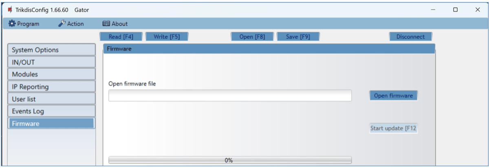

5.  Click the button **Start update [F12]**.

6.  Wait for the update to finish.

## Safety precautions

The GSM gate controller should only be installed and maintained by qualified personnel.

Please read this manual carefully prior to installation in order to avoid mistakes that can lead to malfunction or even damage to the equipment.

Always disconnect the power supply before making any electrical connections.

Any changes, modifications or repairs not authorized by the manufacturer shall render the warranty void.

Please adhere to your local waste sorting regulations and do not dispose of this equipment or its components with other household waste.
