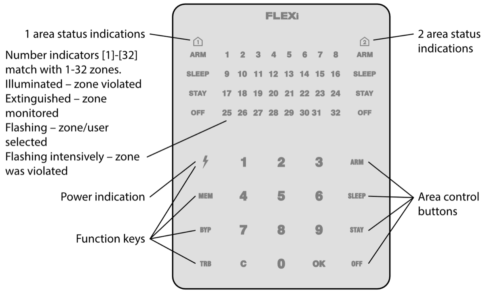

# **FLEXi** / **Keypad SK-LED TouchPad – Brief User Guide**

## Keypad overview

  

> [!NOTE]
> The keypad SK-LED TouchPad for alarm system control displays the states of 32 zones and 2 partitions. Also, the SK-LED TouchPad keypad can be assigned to control one or two desired areas (keypad firmware version from FW:3.0, control panel firmware version from FW:SP3_xxx4_0119). The keypad will display the statuses of the assigned area and area zones.

## Alarm system arming / disarming

## <u>Alarm system ARM:</u>

1.  Make sure all zones are not violated (none of zone indicators are illuminated).

2.  Enter User code.

3.  Select the button of area to be activated.

4.  Press [**OK**] button.

5.  Exit the premises within time delayed.

Once the code is entered the ARM indicator will flash for duration of exit time delay.

## <u>SLEEP mode activation:</u>

(Premises perimeter is secured. Movement inside is allowed. If you open the entrance door, the alarm will actuate immediately):

1.  Press [**SLEEP**] button.

2.  Enter User code.

3.  Press the button of area to be activated.

4.  Press [**OK**] button.

5.  SLEEP mode will turn on immediately, without exit delay.

The SLEEP indicator will illuminate when SLEEP mode is on.

## <u>Alarm system DISARM</u>:

1.  Press [**OFF**] button.

2.  Enter User code.

3.  Press the button of particular area you wish to disarm.

4.  Press [**OK**] button.

When the alarm is disarmed the OFF indicator must be illuminated, however the arming mode indicators should be extinguished.

## <u>STAY mode activation</u>:

(Premises perimeter is secured. Movement inside is allowed. Any opening of entrance door enables time delay during which you have to disarm the alarm):

1.  Press [**STAY**] button.

2.  Enter User code.

3.  Press the button of area to be activated.

4.  Press [**OK**] button.

5.  STAY mode will turn on immediately, without exit delay.

The STAY indicator will illuminate when STAY mode is on.

For area status changing into the opposite one it is sufficient to enter User code and select the preferred area. To delete symbols or command entered, press button [].

## Emergency buttons

#### Two-wire fire (smoke) detector reset

**<u>To send emergency message to your security service:</u>**

- **Police** – hold [**1**] button pressed for 3 sec.

- **Medical Aid** – hold [**4**] button pressed for 3 sec.

- **Fire Service** – hold [**7**] button pressed for 3 sec.

**<u>To reset two-wire fire (smoke) detectors:</u>**

- Hold button [] pressed for 3 seconds.

**<u>Note.</u>** Two-wire fire detectors do not reset automatically after fire emergency detection. They can be reset only manually.

## Illumination brightness and indication sound adjustment

#### Temporary zone monitoring deactivation (BYPASS function)

**<u>To adjust keypad illumination brightness and indication sound:</u>**

**<u>BYPASS function activation:</u>**

1.  Enter the alarm control code. The [**BYP**] indicator starts flashing.

**<u>BYPASS function deactivation:</u>**

Repeat the same actions as in deactivation of particular zone monitoring.

1.  Select the preferred illumination brightness of zone indication using [**1**] and [**4**] buttons.

## Entering or changing / User or Master codes

#### Deleting User codes

**<u>To enter a new or change the existing User code:</u>**

1.  Enter *Master* code, default code – 1234. Zone indicators, showing the sequence numbers of those Users, whose codes have been already entered, will illuminate.

**<u>Note.</u>** Sequence number of *Master* code - [**01**].

**<u>To delete User code:</u>**

1.  Press the sequence numbers of areas which should be controlled by User.
1.  Enter *Master* code. Zone indicators, showing the sequence numbers of those Users, whose codes have been already entered, will illuminate.

