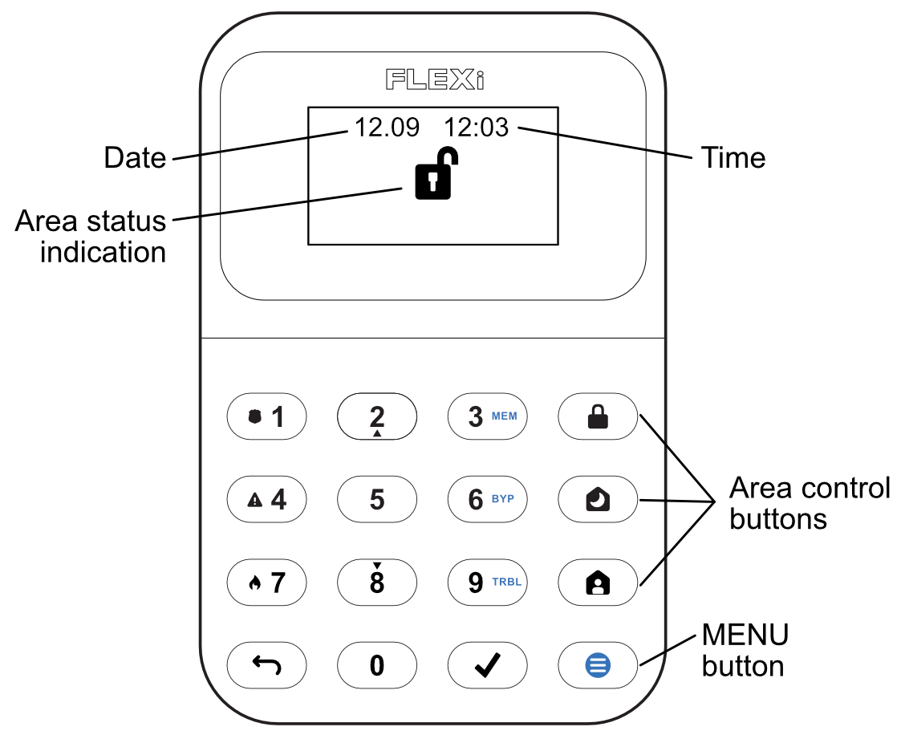
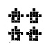

# FLEXi / Keypad SK-LCD button – Brief User Guide

  

## Keypad overview

## Alarm system arming / disarming

### Alarm system ARM

1.  Make sure all zones are not violated.

2.  Press the \[\] button.

3.  Enter User code.

4.  Select the button of area to be activated.

5.  Press \[\] button.

6.  Exit the premises within time delayed.

When the system is armed, the  icon will light up.

### Alarm system DISARM

1.  Enter User code.

2.  Press the button of particular area you wish to disarm.

3.  Press \[\] button.

When the alarm is disarmed the  icon must be illuminated.

### SLEEP mode activation

(Premises perimeter is secured. Movement inside is allowed. If you open the entrance door, the alarm will actuate immediately):

1.  Press \[\] button.

2.  Enter User code.

3.  Press the button of area to be activated.

4.  Press \[\] button.

5.  SLEEP mode will turn on immediately, without exit delay.

The  icon will illuminate when SLEEP mode is on.

### STAY mode activation

(Premises perimeter is secured. Movement inside is allowed. Any opening of entrance door enables time delay during which you have to disarm the alarm):

1.  Press \[\] button.

2.  Enter User code.

3.  Press the button of area to be activated.

4.  Press \[\] button.

5.  STAY mode will turn on immediately, without exit delay.

The  icon will illuminate when STAY mode is on.

## For area status changing into the opposite one it is sufficient to enter User code and select the preferred area. To delete symbols or command entered, press button [].].

## Emergency buttons

### To send emergency message to your security service

- **Police** – hold \[**1**\] button pressed for 3 sec.

- **Medical Aid** – hold \[**4**\] button pressed for 3 sec.

- **Fire Service** – hold \[**7**\] button pressed for 3 sec.

## Illumination brightness and indication
sound adjustment

### Brightness of the keypad buttons

1.  Press \[\] button, then \[**5**\] \[**3**\].

2.  Select the preferred brightness of the keypad button backlight using the \[**2**\] and \[**8**\] buttons.

3.  Press \[\] to save the new value.

**<u>The brightness of the LCD display</u>**

4.  Press \[\] button, then \[**5**\] \[**2**\].

5.  Select the preferred illumination brightness of zone indication using \[**2**\] and \[**8**\] buttons.

6.  Press \[\] to save the new value.

**<u>Keypad keystroke volume</u>**

7.  Press \[\] button, then \[**5**\] \[**1**\].

8.  Select the preferred sound indication level using \[**2**\] and \[**8**\] buttons.

9.  Press \[\] to save the new value.

**<u>Note:</u>** Turn off keypad lighting in standby mode. Pressing \[\] and then press \[**5**\] \[**4**\]. Switch the keypad indicator backlight status in standby mode by pressing \[**1**\] (backlight on) or \[**2**\] (backlight off). Press \[\] to save the new value.

## Entering or changing User or Master codes

### To enter a new or change the existing User code

1.  Press \[\] button, then \[**0**\].

2.  Enter **Master** code, default code – 1234.

3.  Enter User's double-digit sequence number, e.g., \[**02**\].

> **<u>Note.</u>** Sequence number of **Master** code - \[**01**\].

4.  Enter a new User code twice.

5.  Press the sequence numbers of areas which should be controlled by User.

6.  Press \[\] button. Press the \[\] button to exit.

## Fire (smoke) detector reset

### To reset fire (smoke) detectors

- Hold button \[\] pressed for 3 seconds.

**<u>Note.</u>** Fire (smoke) detectors do not reset automatically after fire emergency detection. They can be reset only manually.

## Temporary zone monitoring deactivation
(BYPASS function)

### BYPASS function activation

1.  Press \[\] button, then \[**6**\].

2.  Enter the alarm control code.

3.  Enter a double-digit sequence number of a particular zone to disable its monitoring. To disable the monitoring of several zones, enter double-digit numbers of such several zones.

4.  Press \[\] button. The icon \[\] will appear on the LCD screen.

**<u>BYPASS function deactivation:</u>**

Repeat the same actions as in deactivation of particular zone monitoring.

## Deleting User codes

### To delete User code

1.  Press \[\] button, then \[**0**\].

2.  Enter **Master** code.

3.  Enter User's double-digit sequence number, e.g., \[**02**\].

4.  Press \[\] keypad button. A sound signal will be heard.

5.  Press \[\] button to exit.

The keypad “SK-LCD button” for alarm system control displays the states of **64 zones and 8 partitions**. Also, the “SK-LCD button” keypad can be assigned to control one or more desired areas (control panel firmware version from FW: SP3_xxx4_0121). The keypad will display the statuses of the assigned area and area zones.

## Graphic symbols

| Symbol | Description | Symbol | Description |
|----|----|----|----|
|  | Control panel not connected |  | Fire loop trouble |
|  | Partition 1 Armed |  | Network trouble list |
|  | Partition 4 Disarmed |  | CMS 1 (2) trouble |
|  | Partition 2 Stay |  | Cloud trouble |
|  | Partition 3 Sleep |  | SIM card trouble |
|  | MENU button |  | SIM card password trouble |
|  | ENTER function button |  | SIM card network trouble |
|  | Partition |  | WiFi trouble |
|  | Alarm |  | RS485 interface trouble |
|  | Fire |  | SIM card 2 trouble |
|  | User code |  | LAN trouble |
|  | User |  | Wireless low battery |
|  | Entry/Exit |  | Power trouble |
|  | Zone open |  | Bell trouble |
|  | Bypass |  | Tamper trouble |
|  | Memory |  | Antimasking trouble |
|  | Trouble |  | Wireless trouble |
|  | System trouble list |  | Expander module trouble |
|  | AC power trouble |  | Settings |
|  | Battery trouble |  | Volume |
|  | AUX overcurrent |  | LCD brightness |
|  | Time not set |  | Keypad brightness |
|  | Bell overcurrent |  | Standby light O-On / I-Off |
|  | Bell missing |  | Info |
