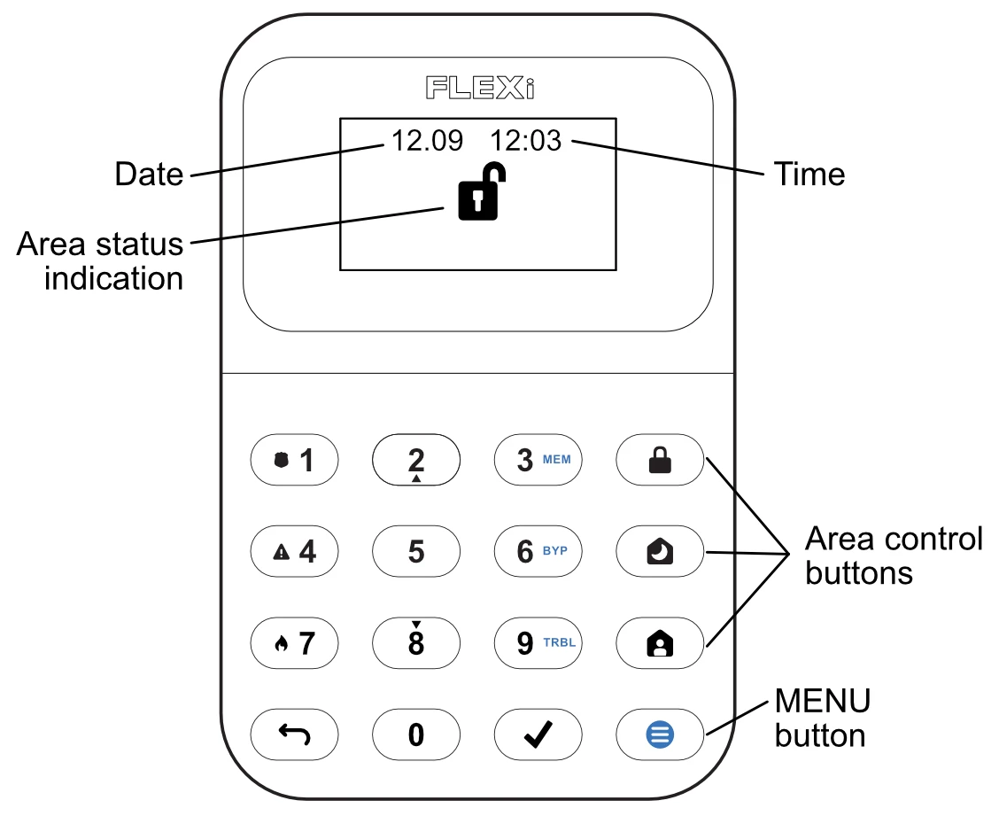
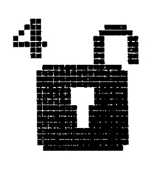
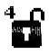
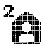

# FLEXi / Keypad SK-LCD button – Brief User Guide

## Keypad overview

> [!NOTE]
> The keypad “SK-LCD button” for alarm system control displays the states of **64 zones and 8 partitions**. Also, the “SK-LCD button” keypad can be assigned to control one or more desired areas (control panel firmware version from FW: SP3_xxx4_0121). The keypad will display the statuses of the assigned area and area zones.

## Alarm system arming / disarming

### Alarm system ARM

1. Make sure all zones are not violated.

2. Press the  button.

3. Enter User code.

4. Select the button of area to be activated.

5. Press  button.

6. Exit the premises within time delayed.

When the system is armed, the  icon will light up.

### Alarm system DISARM

1. Enter User code.

2. Press the button of particular area you wish to disarm.

3. Press  button.

When the alarm is disarmed the  icon must be illuminated.

### SLEEP mode activation

(Premises perimeter is secured. Movement inside is allowed. If you open the entrance door, the alarm will actuate immediately):

1. Press  button.

2. Enter User code.

3. Press the button of area to be activated.

4. Press  button.

5. SLEEP mode will turn on immediately, without exit delay.

The  icon will illuminate when SLEEP mode is on.

### STAY mode activation

(Premises perimeter is secured. Movement inside is allowed. Any opening of entrance door enables time delay during which you have to disarm the alarm):

1. Press  button.

2. Enter User code.

3. Press the button of area to be activated.

4. Press  button.

5. STAY mode will turn on immediately, without exit delay.

The  icon will illuminate when STAY mode is on.

> [!NOTE]
> For area status changing into the opposite one it is sufficient to enter User code and select the preferred area. To delete symbols or command entered, press button .

## Emergency buttons

### To send emergency message to your security service

- **Police** – hold **1** button pressed for 3 sec.

- **Medical Aid** – hold **4** button pressed for 3 sec.

- **Fire Service** – hold **7** button pressed for 3 sec.

## Illumination brightness and indication sound adjustment

### Brightness of the keypad buttons

1. Press  button, then **5** **3**.

2. Select the preferred brightness of the keypad button backlight using the **2** and **8** buttons.

3. Press  to save the new value.

### The brightness of the LCD display

4. Press  button, then **5** **2**.

5. Select the preferred illumination brightness of zone indication using **2** and **8** buttons.

6. Press  to save the new value.

### Keypad keystroke volume

7. Press  button, then **5** **1**.

8. Select the preferred sound indication level using **2** and **8** buttons.

9. Press  to save the new value.
> [!NOTE]
> Turn off keypad lighting in standby mode. Pressing  and then press **5** **4**. Switch the keypad indicator backlight status in standby mode by pressing **1** (backlight on) or **2** (backlight off). Press  to save the new value.

## Entering or changing / User or Master codes

### To enter a new or change the existing User code

1. Press  button, then **0**.

2. Enter **Master** code, default code – 1234.

3. Enter User's double-digit sequence number, e.g., **02**.
> [!NOTE]
> Sequence number of **Master** code - **01**.

4. Enter a new User code twice.

5. Press the sequence numbers of areas which should be controlled by User.

6. Press  button. Press the  button to exit.

## Fire (smoke) detector reset

### To reset fire (smoke) detectors

- Hold button  pressed for 3 seconds.
> [!NOTE]
> Fire (smoke) detectors do not reset automatically after fire emergency detection. They can be reset only manually.

## Temporary zone monitoring deactivation (BYPASS function)

### BYPASS function activation

1. Press  button, then **6**.

2. Enter the alarm control code.

3. Enter a double-digit sequence number of a particular zone to disable its monitoring. To disable the monitoring of several zones, enter double-digit numbers of such several zones.

4. Press  button. The icon  will appear on the LCD screen.

### BYPASS function deactivation

Repeat the same actions as in deactivation of particular zone monitoring.

## Deleting User codes

### To delete User code

1. Press  button, then **0**.

2. Enter **Master** code.

3. Enter User's double-digit sequence number, e.g., **02**.

4. Press  keypad button. A sound signal will be heard.

5. Press  button to exit.

## Graphic symbols

| Symbol | Description | Symbol | Description |
|---|---|---|---|
|  | Control panel not connected |  | Fire loop trouble |
|  | Partition 1 Armed |  | Network trouble list |
|  | Partition 4 Disarmed |  | CMS 1 (2) trouble |
|  | Partition 2 Stay |  | Cloud trouble |
|  | Partition 3 Sleep |  | SIM card trouble |
|  | MENU button |  | SIM card password trouble |
|  | ENTER function button |  | SIM card network trouble |
|  | Partition |  | WiFi trouble |
|  | Alarm |  | RS485 interface trouble |
|  | Fire |  | SIM card 2 trouble |
|  | User code |  | LAN trouble |
|  | User |  | Wireless low battery |
|  | Entry/Exit |  | Power trouble |
|  | Zone open |  | Bell trouble |
|  | Bypass |  | Tamper trouble |
|  | Memory |  | Antimasking trouble |
|  | Trouble |  | Wireless trouble |
|  | System trouble list |  | Expander module trouble |
|  | AC power trouble |  | Settings |
|  | Battery trouble |  | Volume |
|  | AUX overcurrent |  | LCD brightness |
|  | Time not set |  | Keypad brightness |
|  | Bell overcurrent |  | Standby light O-On / I-Off |
|  | Bell missing |  | Info |
