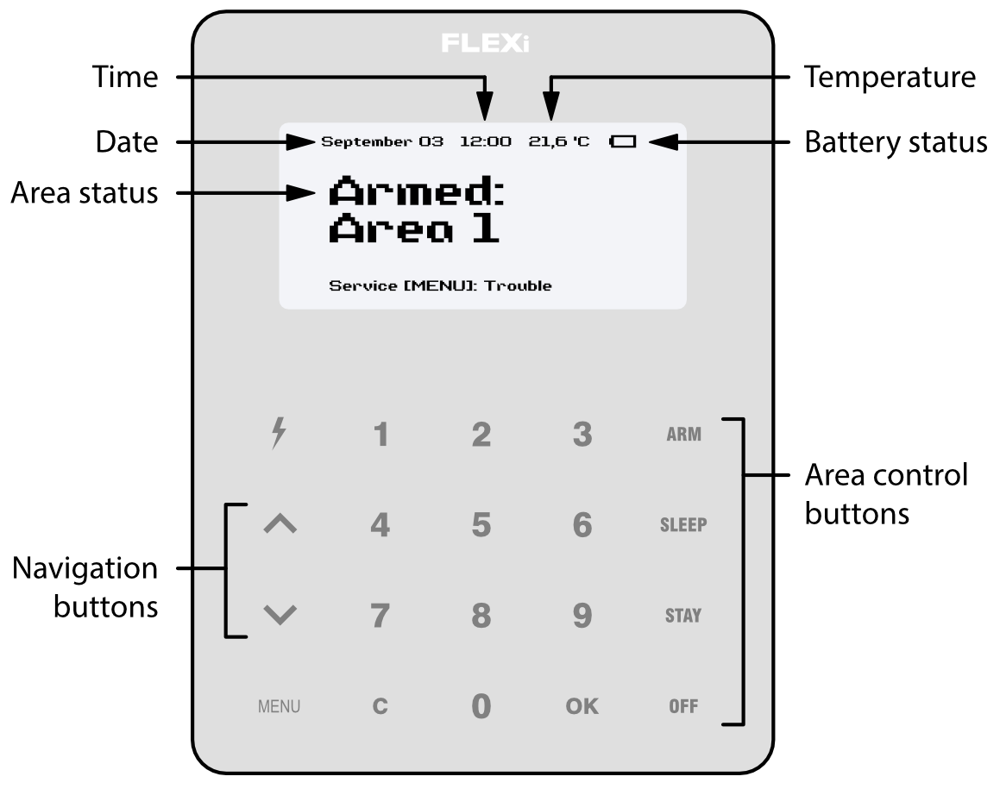

# FLEXi / Keypad SK-LCD TouchPad – Brief User Guide

## Keypad overview

> [!NOTE]
> The keypad SK-LCD TouchPad for alarm system control displays the states of 64 zones and 8 partitions. Also, the SK-LCD TouchPad keypad can be assigned to control one or more desired areas (keypad firmware version from FW:1.41, control panel firmware version from FW:SP3_xxx4_0119. The keypad firmware version can be seen by pressing **MENU** **5** **0**). The keypad will display the statuses of the assigned area and area zones.

## Alarm system arming / disarming

### Alarm system ARM

Make sure all areas are not damaged.

1. Press **ARM** button.

2. Enter **[User Code]**.

3. If the system has only one partition, skip steps 4 and 5.

4. Press the buttons for the areas you want to control.

5. Confirm your selection by pressing the **OK** button.

6. Exit the premises within the **Exit Delay** time.

During the **Exit Delay** countdown, the time for the exit will be displayed on the keypad, and the text will appear on the keypad when the arming mode is activated: **Armed: Area**.

### Alarm system DISARM

1. Press **OFF** button.

2. Enter **[User Code]**.

3. If the system has only one partition, skip steps 4 and 5.

4. Press the buttons for the areas you want to control.

5. Confirm your selection by pressing the **OK** button.

When the alarm is disarmed, the text **Disarmed: Area** will appear on the keypad display.

> [!NOTE]
> For area status changing into the opposite one it is sufficient to enter User code and select the preferred area. To delete symbols or command entered, press button **C**.

### SLEEP mode activation

(Premises perimeter is secured. Movement inside is allowed. If you open the entrance door, the alarm will actuate immediately):

1. Enter **[User Code]**.

2. Confirm your selection by pressing the **OK** button.

### STAY mode activation

(Premises perimeter is secured. Movement inside is allowed. Any opening of entrance door enables time delay during which you have to disarm the alarm):

1. Enter **[User Code]**.

2. Confirm your selection by pressing the **OK** button.

## Emergency buttons

**<u>To send emergency message to your security service:</u>**

- **Panic** – hold **1** button pressed for 3 sec.

- **Medical Aid** – hold **4** button pressed for 3 sec.

- **Fire Service** – hold **7** button pressed for 3 sec.

## Illumination brightness and indication sound adjustment

**<u>To adjust keypad illumination brightness and indication sound:</u>**

1. Press **5** button.

## Entering or changing User or Master codes

**<u>To enter a new or change the existing User code:</u>**

1. Enter **[Administrator Code]** (default code: 123456).

## Two-wire fire (smoke) detector reset

**<u>To reset two-wire fire (smoke) detectors:</u>**

- Hold button  pressed for 3 seconds.

> [!NOTE]
> Two-wire fire detectors do not reset automatically after fire emergency detection. They can be reset only manually.

## Temporary zone monitoring deactivation (BYPASS function)

**<u>BYPASS function activation:</u>**

1. Press **3** button.

**<u>BYPASS function deactivation:</u>**

Repeat the same actions as in deactivation of particular zone monitoring.

## Deleting User codes

**<u>To delete User code:</u>**

1. Enter **[Administrator Code]** (default code: 123456).
