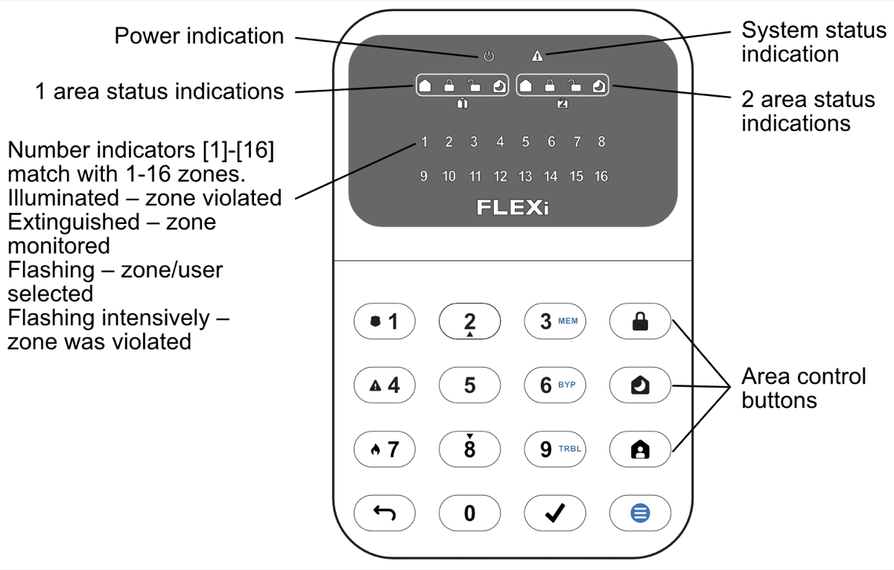

# FLEXi / Keypad SK-LED button – Brief User Guide

## Keypad overview

> [!NOTE]
> The keypad “SK-LED button” for alarm system control displays the states of 16 zones and 2 partitions. Also, the “SK-LED button” keypad can be assigned to control one or two desired areas (keypad firmware version from FW:1.0, control panel firmware version from FW:SP3_xxx4_0120). The keypad will display the statuses of the assigned area and area zones.

## Alarm system arming / disarming

### Alarm system ARM

1. Make sure all zones are not violated (none of zone indicators are illuminated).

2. Press the  button.

3. Enter User code.

4. Select the button of area to be activated.

5. Press  button.

6. Exit the premises within time delayed.

Once the code is entered the  indicator will flash for duration of exit time delay. When the system is armed, the  indicator will light up.

### Alarm system DISARM

1. Enter User code.

2. Press the button of particular area you wish to disarm.

3. Press  button.

When the alarm is disarmed the  indicator must be illuminated.

### SLEEP mode activation

(Premises perimeter is secured. Movement inside is allowed. If you open the entrance door, the alarm will actuate immediately):

1. Press  button.

2. Enter User code.

3. Press the button of area to be activated.

4. Press  button.

5. SLEEP mode will turn on immediately, without exit delay.

The  indicator will illuminate when SLEEP mode is on.

### STAY mode activation

(Premises perimeter is secured. Movement inside is allowed. Any opening of entrance door enables time delay during which you have to disarm the alarm):

1. Press  button.

2. Enter User code.

3. Press the button of area to be activated.

4. Press  button.

5. STAY mode will turn on immediately, without exit delay.

The  indicator will illuminate when STAY mode is on.

> [!NOTE]
> For area status changing into the opposite one it is sufficient to enter User code and select the preferred area. To delete symbols or command entered, press button .

## Emergency buttons

**<u>To send emergency message to your security service</u>**

- **Police** – hold **1** button pressed for 3 sec.

- **Medical Aid** – hold **4** button pressed for 3 sec.

- **Fire Service** – hold **7** button pressed for 3 sec.

## Illumination brightness and indication sound adjustment

### Brightness of the keypad buttons

1. Press  button, then **1**.

2. Select the preferred brightness of the keypad button backlight using the **2** and **8** buttons.

3. Press  to save the new value. Press the  button to exit.

**<u>The brightness of the zone LED indication</u>**

4. Press  button, then **4**.

5. Select the preferred illumination brightness of zone indication using **2** and **8** buttons.

6. Press  to save the new value. Press the  button to exit.

**<u>Keypad keystroke volume</u>**

7. Press  button, then **7**.

8. Select the preferred sound indication level using **2** and **8** buttons.

9. Press  to save the new value. Press the  button to exit.
> [!NOTE]
> Turn off keypad lighting in standby mode. Pressing  followed by **5** toggles the backlight states of the keypad indicators in standby mode. Press  to save the new value. Press the  button to exit.

## Entering or changing / User or Master codes

### To enter a new or change the existing User code

1. Press  button, then **0**.

2. Enter *Master* code, default code – 1234.

3. Enter User's double-digit sequence number, e.g., **02**.
> [!NOTE]
> Sequence number of *Master* code - **01**.

4. Enter a new User code twice.

5. Press the sequence numbers of areas which should be controlled by User.

6. Press  button. Press the  button to exit.

## Fire (smoke) detector reset

### To reset fire (smoke) detectors

- Hold button  pressed for 3 seconds.
> [!NOTE]
> Fire (smoke) detectors do not reset automatically after fire emergency detection. They can be reset only manually.

## Temporary zone monitoring deactivation (BYPASS function)

### BYPASS function activation

1. Press  button, then **6**.

2. Enter the alarm control code. The  indicator starts flashing green.

3. Enter a double-digit sequence number of a particular zone to disable its monitoring. To disable the monitoring of several zones, enter double-digit numbers of such several zones.

4. Press  button. The  indicator starts illuminating green.

**<u>BYPASS function deactivation:</u>**

Repeat the same actions as in deactivation of particular zone monitoring.

## Deleting User codes

### To delete User code

1. Press  button, then **0**.

2. Enter *Master* code.

3. Enter User's double-digit sequence number, e.g., **02**.

4. Press  keypad button. A sound signal will be heard and the button, indicating the sequence number of User, whose code was deleted from memory, will extinguish.

5. Press  button. Press the  button to exit.
