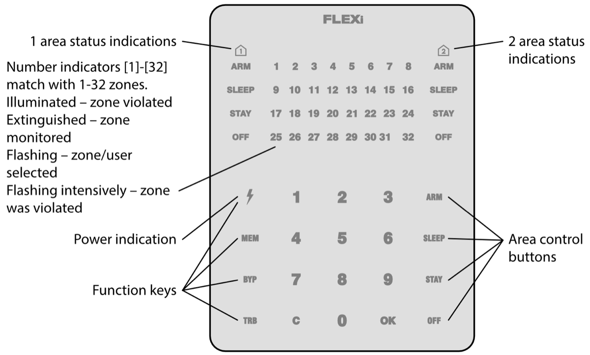

# FLEXi / Keypad SK-LED TouchPad – Brief User Guide

## Keypad overview

> [!NOTE]
> The keypad SK-LED TouchPad for alarm system control displays the states of 32 zones and 2 partitions. Also, the SK-LED TouchPad keypad can be assigned to control one or two desired areas (keypad firmware version from FW:3.0, control panel firmware version from FW:SP3_xxx4_0119). The keypad will display the statuses of the assigned area and area zones.

## Alarm system arming / disarming

### Alarm system ARM

1. Make sure all zones are not violated (none of zone indicators are illuminated).

2. Enter User code.

3. Select the button of area to be activated.

4. Press **OK** button.

5. Exit the premises within time delayed.

Once the code is entered the ARM indicator will flash for duration of exit time delay.

### Alarm system DISARM

1. Press **OFF** button.

2. Enter User code.

3. Press the button of particular area you wish to disarm.

4. Press **OK** button.

When the alarm is disarmed the OFF indicator must be illuminated, however the arming mode indicators should be extinguished.

### SLEEP mode activation

(Premises perimeter is secured. Movement inside is allowed. If you open the entrance door, the alarm will actuate immediately):

1. Press **SLEEP** button.

2. Enter User code.

3. Press the button of area to be activated.

4. Press **OK** button.

5. SLEEP mode will turn on immediately, without exit delay.

The SLEEP indicator will illuminate when SLEEP mode is on.

### STAY mode activation

(Premises perimeter is secured. Movement inside is allowed. Any opening of entrance door enables time delay during which you have to disarm the alarm):

1. Press **STAY** button.

2. Enter User code.

3. Press the button of area to be activated.

4. Press **OK** button.

5. STAY mode will turn on immediately, without exit delay.

The STAY indicator will illuminate when STAY mode is on.

> [!NOTE]
> For area status changing into the opposite one it is sufficient to enter User code and select the preferred area. To delete symbols or command entered, press button .

## Emergency buttons

**<u>To send emergency message to your security service</u>**

- **Police** – hold **1** button pressed for 3 sec.

- **Medical Aid** – hold **4** button pressed for 3 sec.

- **Fire Service** – hold **7** button pressed for 3 sec.

## Illumination brightness and indication sound adjustment

### To adjust keypad illumination brightness and indication sound

1. Hold **C** button pressed for 3 sec.

2. Select the preferred illumination brightness of zone indication using **1** and **4** buttons.

3. Select the preferred illumination brightness of bottom row keys using **2** and **5** buttons.

4. Select the preferred sound indication level using **3** and **6** buttons.

5. Select to enable/disable the keypad LED indication illumination in standby mode with the **0** key. Press **0** if every other LED indicator of the zones is on - the keypad lighting is off in standby mode, if all LED indicators of the zones are on - the keypad lighting is on in standby mode.

6. Press the **C** button again to save the settings.

## Entering or changing / User or Master codes

### To enter a new or change the existing User code

1. Press  button.

2. Enter *Master* code, default code – 1234. Zone indicators, showing the sequence numbers of those Users, whose codes have been already entered, will illuminate.

3. Enter User's double-digit sequence number, e.g., **02**.
> [!NOTE]
> Sequence number of *Master* code - **01**.

4. Enter a new User code twice.

5. Press the sequence numbers of areas which should be controlled by User.

6. Press **OK** button. To exit, press **C** button twice.

## Two-wire fire (smoke) detector reset

### To reset two-wire fire (smoke) detectors

- Hold button  pressed for 3 seconds.
> [!NOTE]
> Two-wire fire detectors do not reset automatically after fire emergency detection. They can be reset only manually.

## Temporary zone monitoring deactivation (BYPASS function)

### BYPASS function activation

1. Press **BYP** button.

2. Enter the alarm control code. The **BYP** indicator starts flashing.

3. Enter a double-digit sequence number of a particular zone to disable its monitoring. To disable the monitoring of several zones, enter double-digit numbers of such several zones.

4. Press **OK** button. The **BYP** indicator starts illuminating.

**<u>BYPASS function deactivation:</u>**

Repeat the same actions as in deactivation of particular zone monitoring.

## Deleting User codes

### To delete User code

1. Press  button.

2. Enter *Master* code. Zone indicators, showing the sequence numbers of those Users, whose codes have been already entered, will illuminate.

3. Enter User's double-digit sequence number, e.g., **02**.

4. Press **SLEEP** keypad button. A sound signal will be heard and the button, indicating the sequence number of User, whose code was deleted from memory, will extinguish.

5. Press **OK** button twice.
