# RL14 IP/SMS Receiver

  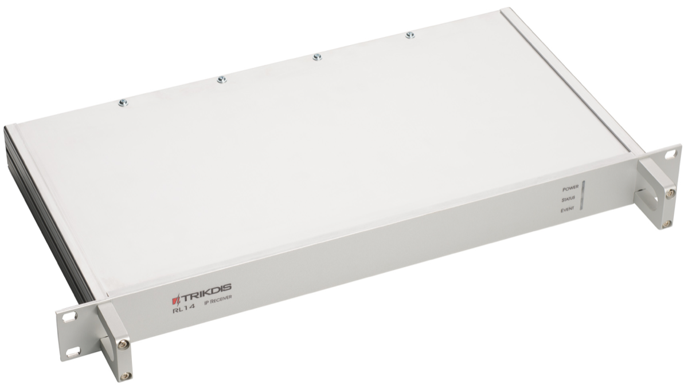

## Safety requirements

IP/SMS receiver RL14 is an electrical device, therefore it may only be installed by qualified specialists following this manual.

IP/SMS receiver RL14 must be operated following this manual.

## Warranty

According to the user manual of the receiver and general regulations for installing electrical equipment, the manufacturer provides a 24-month warranty to the installed and operated product. Warranty coverage starts at the moment of the product sale and purchase agreement, i.e. date of issue of invoice or fiscal receipt.

## About receiver

IP/SMS receiver RL14 is purposed for Central Monitoring Stations (CMS). It is designed to receive messages transmitted through Trikdis transmission modules, which are sent in TCP/UDP protocols or SMS messages. After processing received messages, it sends the data to the monitoring software through LAN or RS232 port.

## Receiver functionality

Receiver has an integrated industrial computer with software IPcom v4 operating in OS Linux environment. Software Ipcom v4 is designed to process message traffic received via 1) receiver network adapter card, 2) integrated SMS receiver, 3) receiver lead-in RS232.

Network card receives messages sent in TCP/UDP protocols. SMS receiver receives messages sent in Contact ID codes. RS232 port receives Contact ID codes in Sugard MRL-DG protocol.

Receiver's functionality is set in the license, which affect the parameters of IPcomControl v4 software. Receiver's parameters are set while configuring IPcomControl v4, which must be installed in MS Windows OS computer, located in the same network as the receiver.

There are multiple channels set for receiving messages and multiple ports for transferring messages to the monitoring software. The functionality and physical parameters of these channels and ports are configured while setting up the receiver.

**Receiving messages:**

| Receives messages using TCP/IP or UDP/IP protocols sent by TRIKDIS GPRS communicators G10, G10C, G10T, G10D via GPRS and/or SMS channels. / **Note:** A regular size SIM card from chosen Cellular network provider must be inserted into integrated SMS receiver SIM card slot in order to receive messages via SMS channel. |
|----|
| Receives messages using TCP/IP or UDP/IP protocols sent by TRIKDIS Ethernet communicators E10, E10C, E10T via wired internet networks. |
| Receives messages using TCP/IP or UDP/IP protocols sent by TRIKDIS GPRS communicators G10F, FireCom via GPRS and/or SMS channels. / **Note:** A regular size SIM card from chosen Cellular network provider must be inserted into integrated SMS receiver SIM card slot in order to receive messages via SMS channel. |
| Receives messages using TCP/IP or UDP/IP protocols sent by TRIKDIS control panels CG3 and SP131 via GPRS and/or SMS channels. / **Note:** A regular size SIM card from chosen Cellular network provider must be inserted into integrated SMS receiver SIM card slot in order to receive messages via SMS channel. |
| Receives messages using UDP/IP protocols sent by TRIKDIS repeaters RR-GSM and R-IP12. |
| Receives messages sent by receivers from other manufacturers that are connected to lead-in RS232. |

## Technical parameters

| Parameter | Description |
|-----------|-------------|
| Number of IP communicators | Unlimited |
| Number of reception channels | Initial license allows two channels |
| Communication protocols | TCP/​UPD TRK-3, TRK-6, TRK-7 |
| Physical port of network adapter card | RJ-45 (FastEthernet 10/​100) |
| Modem of integrated SMS receiver | GSM 850/​ 900/​ 1800/​ 1900 MHz |
| Integrated SMS receiver SIM card type | Standard, not supplied with the receiver |
| Purpose of RS232 ports | It can configured to work as INPUT or OUTPUT for data transferring |
| Number of RS232 ports | 3 |
| Data output protocols | Surgard MLR2-DG, Monas3 |
| Physical type of RS232 ports | Male connector DB9 |
| Setting parameters and monitoring the operation | Computer operating in the same network with MS Windows 32/​64 bit Win7, Win8, Win8.1, Win10 and software IPcomControl v4 |
| Number of workplaces | Initial license allows adding 2 workplaces |
| Primary power supply | 100 – 240 V (50 /​ 60 Hz) AC network. /​ AC current (Max.): 0.75A/​115VAC, 0.5A/​230VAC |
| Power | Up to 60W |
| Backup power supply | 12 V, capacity of 18Ah or more. Charging current up to 900 mA. |
| Operating temperature | From 0 °C to +55 °C |
| Dimensions | 19" 1U (450 x 50 x 320 mm) |
| Weight | 2.1 kg |

## Equipment

|                                                  |       |
|--------------------------------------------------|-------|
| IP/​SMS receiver RL14                             | 1 pc. |
| 2.5 m length Cellular antenna with a magnetic pad     | 1 pc. |
| 1.5 m length power supply cable                  | 1 pc. |
| 1.8 m length Null Modem-type COM cable (f/​f)     | 1 pc. |
| 5 m LAN cable                                    | 1 pc. |
| CD with software IPcomControl v4 and user manual | 1 pc. |

## Receiver elements

### Front view and light indication

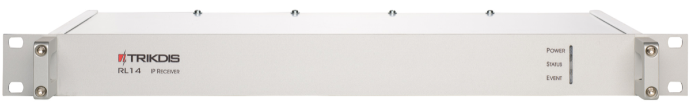

**Light indication**

| Indicator | Description |
|-----------|-------------|
| Power | Green light when power supply is on. |
| Status | Green light when physical and protocol connection between the receiver and message monitoring software is online. /​ Red light when physical and protocol connection between the receiver and message monitoring software is lost. /​ Yellow light when physical and protocol connection between the receiver and message monitoring software is online via some described and active ports but has been lost via the rest. /​ No light when receiver port is not active or not described. |
| Event | Blue light when a message is being transmitted to the message monitoring software. |

### Rear view and rear panel elements

| Element | Description |
|---------|-------------|
| LAN | Connector RJ45 for network adapter card. |
| COM1 | 1st serial port RS232 that is set as data lead-in or output (male connector DB9). |
| COM2 | 2nd serial port RS232 that is set as data lead-in or output (male connector DB9). |
| COM3 | 3rd serial port RS232 that is set as data lead-in or output (male connector DB9). |
| Reset | Microswitch that resets default internet addresses of receiver network adapter card when pressed and held for more than 5 seconds. |
| Antenna | SMA-type female connector for Cellular antenna of integrated SMS receiver. |
| HDMI | HDMI connector for monitor. |
| USB | USB connection. |
|  | Connector for receiver grounding circuit. |
| \- BAT + | Dismountable connector for backup power supply battery (at least 18 Ah 12 V). Battery status may be controlled if there are no power supply problems. Battery charging current - 900 mA. |
| 100-240VAC | Power supply cable connector and switch O/​I. |

## Preparing the receiver for operation

> [!WARNING]
> Receiver will fully shut down only 2 minutes after turning off the power supply!

1. Power supply must be turned off when receiver is being prepared for operation, i.e. 1) receiver power supply cable must be disconnected from the network and 2) receiver connector BAT to which backup power supply circuit is connected must be unplugged.

2. Insert an already registered regular size SMS card of the chosen network provider into receiver's SMS card slot in order to receive SMS messages from Trikdis message transmission modules.

3. Position the receiver on a solid clean horizontal surface, unscrew fixing screws and remove the top cover. Insert the SIM card into a SMS receiver's SIM card slot. Put side and top covers back on (see picture below). Screw the top cover.

    *[SIM card slot diagram — image not available in digital version; refer to the printed manual]*

4. Mount the receiver in a 19" server rack.

5. Screw the Cellular antenna.

6. Prepare a LAN according to a principal scheme below:

    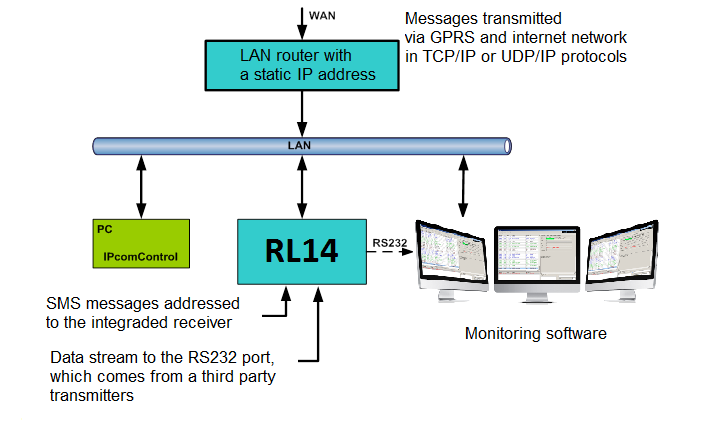

7. Install software *IPcomControl v4* (see *Configuring the receiver*) on the computer that will be used to configure receiver RL14.

8. Change the IP address of the computer that will be used to configure receiver RL14 to that required by the receiver manufacturer (see item A under section *Configuring the receiver*).

9. Connect receiver RL14 and the computer that will be used to configure the parameters of the receiver using LAN cable.

10. Insert the power supply cable connector into the 110-220 V power socket of the receiver and plug the cable into the mains socket.

11. Turn on the power supply of the receiver, i.e. toggle the power supply switch O/I to I. Power supply is indicated by the blue light diode Power. A sound signal will indicate that receiver is prepared for configuration.

12. Configure parameters of receiver RL14 **in the following order**:

    1. Set the parameters of the receiver network adapter card so that receiver may operate in a designated LAN (see section *Connecting to a new receiver*);
    2. Add and describe ports through which message traffic is directed to the message monitoring software (see tab *Outputs* under section *Configuring the receiver*);
    3. Add and describe ports through which message traffic will be received (see tabs *COM settings* and *Receivers* under section *Configuring the receiver*);
    4. Add and describe programmable receivers which will direct processed message traffic through ports to message monitoring software (see tab *Receiver* under section *Configuring the receiver*);
    5. Add and describe users who will be permitted to log in and perform assigned tasks during operation of the receiver (see tab *Users* under section *Configuring the receiver*).

13. Disconnect the LAN cable from the receiver and the computer (if it does not belong to LAN) once desired receiver parameters are set.

14. Connect receiver RL14 and the computer with message monitoring software.

    Use RS232 cable supplied with the equipment to connect the chosen receiver output COM and computer with message monitoring software if messages will be transmitted to the message monitoring software using port RS232.

    Connect the receiver and the local area network with operating server-computer with message monitoring software via receiver network adapter card connector LAN if messages will be transmitted to the message monitoring software via LAN.

## Configuring the receiver

Operation parameters of receiver RL14 are set and edited using software *IPcomControl v4* on a computer with OS MS Windows operating in the same LAN. Software may be found in the supplied CD or on [www.trikdis.lt](http://www.trikdis.lt). Install software *IPcomControl v4* on the computer.

### Connecting to a new receiver and setting LAN addresses

Default addresses of network adapter card:

| IP address  | 192.168.100.3   |
|-------------|-----------------|
| Port        | 55000           |
| Subnet mask | 255.255.255.0   |
| Gateway     | 192.168.100.254 |

In order to restore default settings refer to chapter *Resetting default parameters*.

1. Computer and receiver must operate in the same network in order to configure the receiver. Change the network adapter card addresses of the computer that will be used to configure the receiver to match those indicated in the tab.

    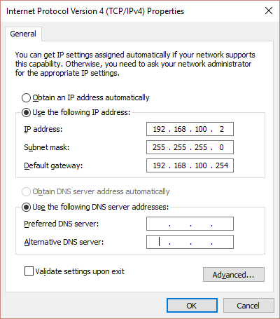

2. Use LAN cable to connect the receiver and the computer that will be used to configure the receiver.

3. Turn on the main power supply and wait a few seconds until a sound signal will indicate that receiver is on.

4. Run IPcomControl v4. Enter the default IP address of the receiver network adapter card and click OK.

    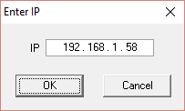

5. Enter the User name (*administrator*) and password (*admin*) when prompted. Click Login.

    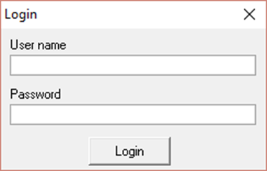

6. Select IPcomControl v4 tab **Configure**. Click **Get**. Enter LAN values into boxes *Primary* IP, Subnet and Gateway in order to connect the receiver to the network. Click **Set**.

    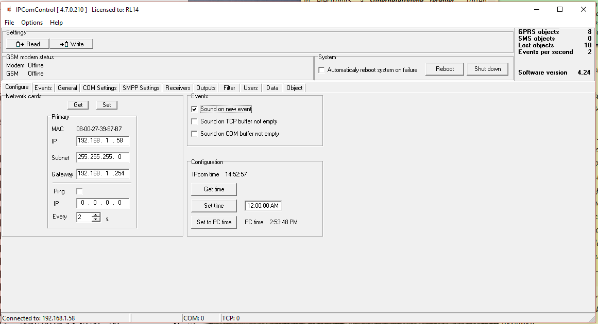

7. Receiver should automatically reboot and restart. Software IPcomControl v4 will close automatically. Receiver is prepared for operation in LAN.

8. Disconnect the LAN configuration cable from the receiver and plug in the cable of local area network whose addresses were just set in its place.

9. Restore network adapter card addresses of the computer that was used to configure the receiver. Computer may now operate in previously used networks.

### Connecting to a receiver operating in LAN

Receiver operating in LAN is configured using software IPcomControl v4 on a 32/64 bit computer with OS MS Windows Win7/8/8.1/10. Several computers with software IPcomControl v4 may be connected to the receiver at once. Number of connections is limited by license that may be viewed by clicking **Help** in software IPcomControl v4.

1. Run software IPcomControl v4. Enter the IP address of the LAN receiver network adapter card, e.g., 195.15.184.138, when prompted and click OK.

    

2. Enter the User name (*administrator*) and password (*admin*) when prompted. Click Login.

    

3. Click Read  in an open window of software IPcomControl v4.

    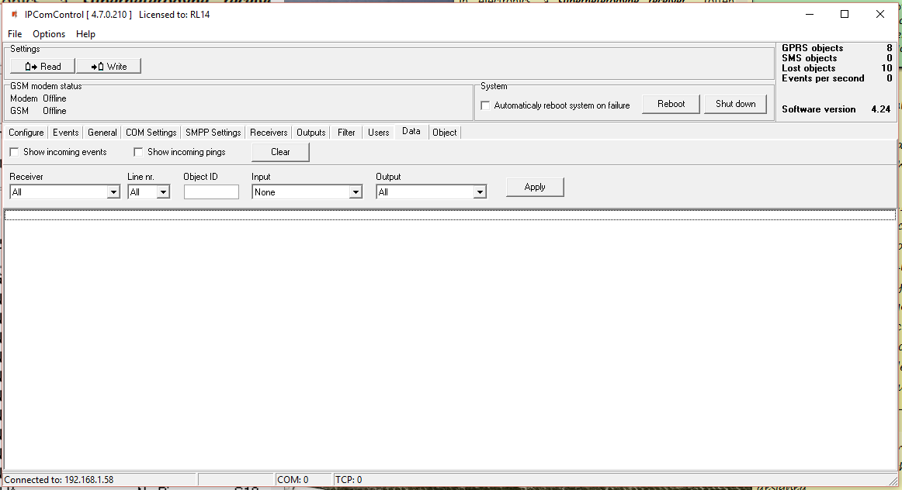

    | UI element | Description |
    |------------|-------------|
    | Modem / GSM modem status | Status (offline/online) of the receiver physical and programmable connection SMS modem GM15 Offline (receiver event **E/R 753**). GSM – status of the SMS modem GM15 connection to GSM network (receiver event **E/R 751**). |
    | Number of software tabs | May differ depending on user permissions granted by the receiver admin. |
    | Automatic and manual reboot | Automatic and manual reboot (event **R 313**). |
    | Software version | Version of receiver's software. |

## Tab descriptions

### Configure tab — Remote server, sound signals and clock

Configures remote server IP address for communication channel testing, receiver sound signals and clock.

### Events tab — Receiver event list

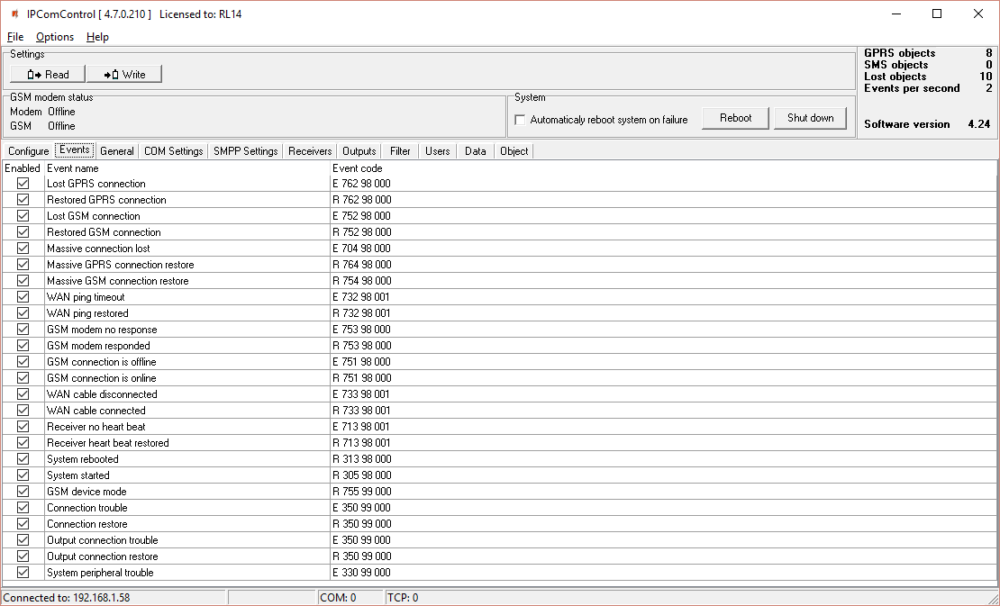

Upon occurrence of an event listed in the window, a message will be formed and sent to the monitoring software. Reporting of unwanted events can be turned off by ticking off the check box.

Configuration of a receiver allows to change: Event code, Partition's number and zone. For some of the messages the output channel identification is set automatically. For detailed list and conditions for generating event messages refer to section *Receiver event messages*.

### General tab — GPRS and GSM communication control

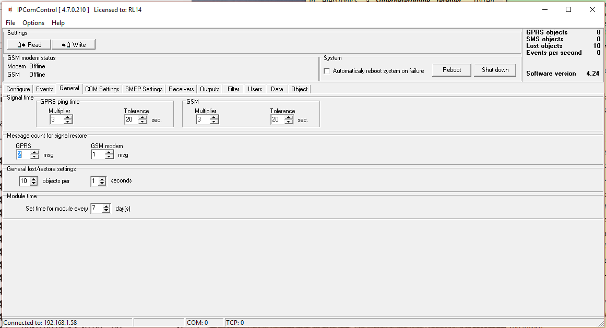

### COM settings tab — COM port operation mode

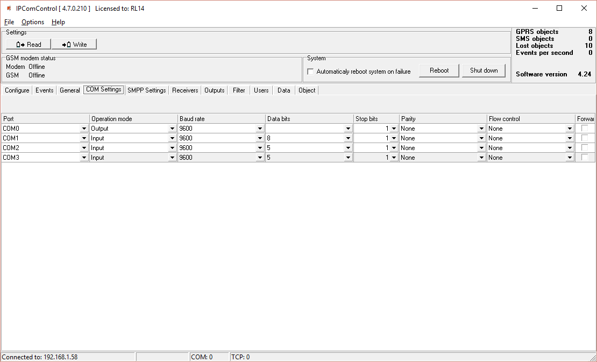

Port name:

- **COM0** – Integrated SMS receiver data port. Operation mode must be set to "Trikdis".
- **COM1…COM3** – Receiver RS232 ports.
- **Card_1…Card_4** – Receiver card sockets.

### SMPP settings tab — SMS via TCP/IP

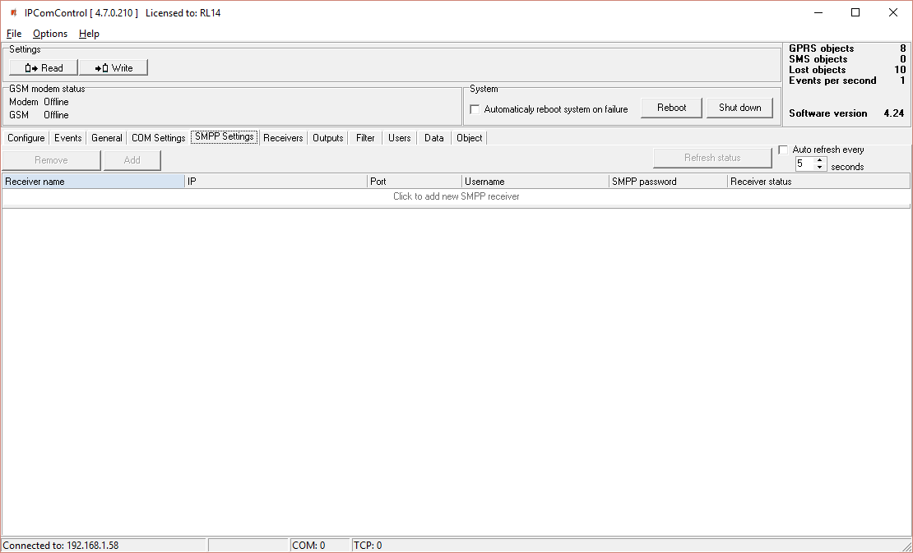

SMPP – protocol for SMS message transmission using TCP/IP communication, i.e. it allows receiving SMS messages sent by Trikdis message transmission modules via LAN instead of integrated SMS modem.

### Receivers tab — Adding and configuring receivers

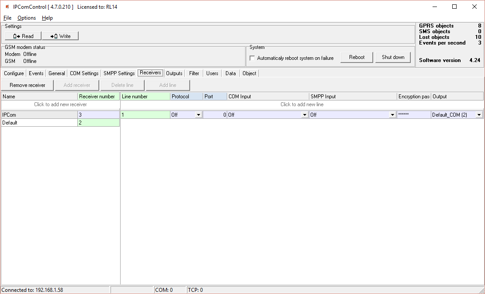

All the events listed in the "Events" tab are received from chosen IPcom channel and redirected to chosen output port. In order to receive messages sent from secured object via TCP/UDP protocols a separate receiving channel must be created. Data stream received from this channel are redirected to the chosen output port.

Data stream redirection parameters:

- **Line number** – specify line number
- **Protocol** – specify data stream transfer protocol
- **Port** – specify input port
- **COM input** – specify physical input port
- **SMPP input** – specify SMPP server parameters
- **Encryption password** – specify a six digit encryption key for incoming data stream
- **Output** – specify output port for data stream, which parameters are set in "Output" tab

### Outputs tab — Directing messages to monitoring software

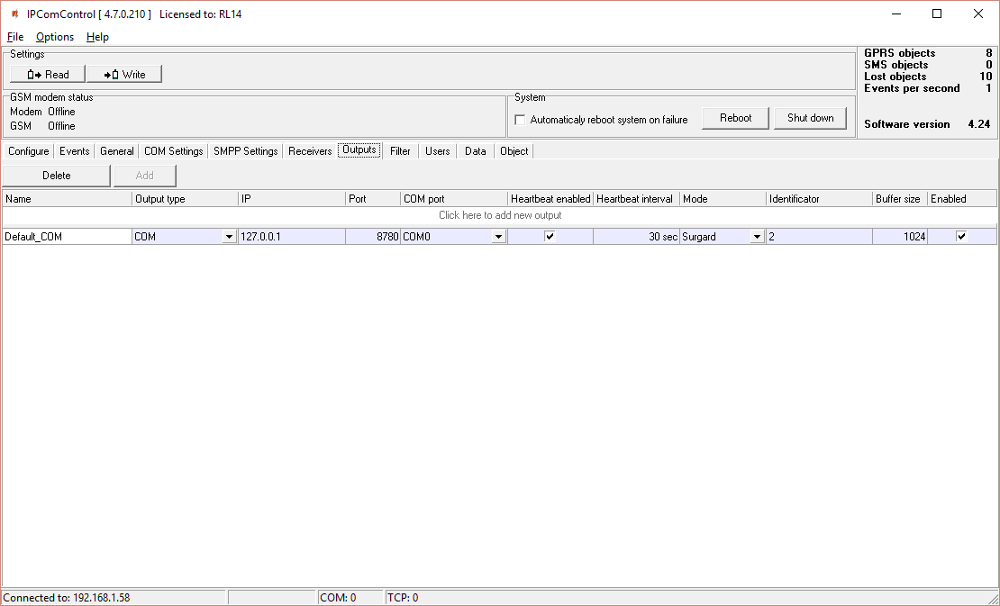

Output parameters for sending messages to the monitoring software:

- **Name** – specify port name
- **Output type** – specify connection type with the monitoring software: TCP or COM
- **IP** – specify monitoring stations IP address
- **Port / COM port** – specify output port number
- **Heartbeat enabled** – enable polling with the monitoring software
- **Heartbeat interval** – specify the period for polling
- **Mode** – specify the protocol of messages
- **Identificator** – specify the identification number for the channel. It will allow to identify the channel upon losing the connection with it.
- **Buffer size** – specify the message buffer size
- **Enable** – enables the created channel to function.

### Filter tab — Message filtering

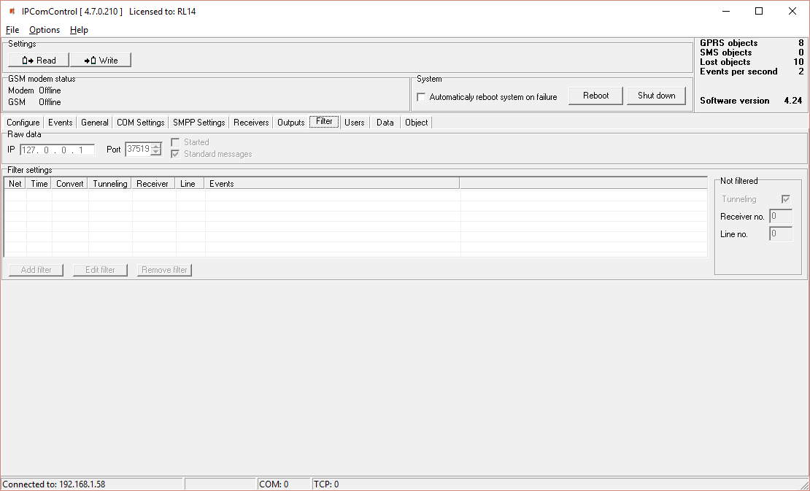

IP address to which all received messages are additionally directed may be set in tab *Filter*.

IP address and port number to which all received messages will be sent are entered in field *Raw data*. Messages will be sent to the specified IP address without processing when box [Started] is ticked. Messages will be changed according to protocol Contact ID if box [Standard messages] is ticked.

Message filtering parameters are set in field *Filter settings*. Click *Add filter* to open tab *Filter settings*. Specify the rules for message transmission to the message monitoring software:

- Enter the network number in box *Network*. Only those messages with matching receiver number and network number will be filtered;
- Enter tolerance time for the same signal (or repeated tolerance signals) in box *Time*;
- Enter the receiver number displayed in the processed message in box *Receiver no*;
- Enter the receiver line number displayed in the processed message in box *Line no*;
- Check box *Convert* in order to change the structure of filtered messages;
- Check box *Tunneling* to keep the structure of filtered messages;
- Enter special event codes used to ignore messages re-transmitted in RAS-2M system in box *Events one per line*;
- Click OK to confirm entered values;
- Several different filters may be set up and used.

Messages are transmitted to message monitoring software using receiver and line numbers indicated in tab *General* if box *Tunneling* is checked in field *Not filtered*. Messages are transmitted with indicated receiver and line number if box *Tunneling* is not checked.

### Users tab — User permissions

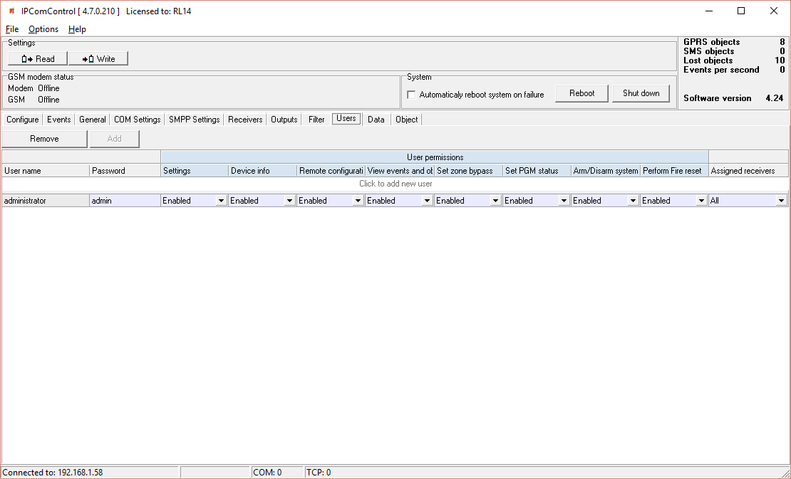

User permissions parameters:

- **User name** – specify the user name
- **Password** – specify the user password
- **Settings** – specify permission to configure receiver software IPcom.
- **Device info** – specify permission to view receiver information about objects.
- **Remote configuration** – specify permission to remotely configure message transmission module and update its firmware.
- **View events and objects** – specify permission to open software IPcomControl v4 tabs Data and Objects.
- **Set zone bypass** – specify permission to send control commands to Trikdis control panel installed in a secured object in order to activate or deactivate Zone bypass mode in a specific zone.
- **Set PGM status** – specify permission to switch message transmission module PGM output status remotely.
- **Arm/Disarm system** – specify permission to send control commands to Trikdis control panel installed in a secured object in order to arm or disarm the alarm system.
- **Perform Fire reset** – specify permission to send control commands to Trikdis control panel installed in a secured object in order to automatically reset the operation of connected smoke sensor.
- **Assigned receivers** – specify the receivers for which the user permissions apply

User permission options: **Enable** / **Disable** / **Read only**.

### Data tab — Received messages

Received messages can be seen in the tab Data. Click **Clear** to delete all entries.

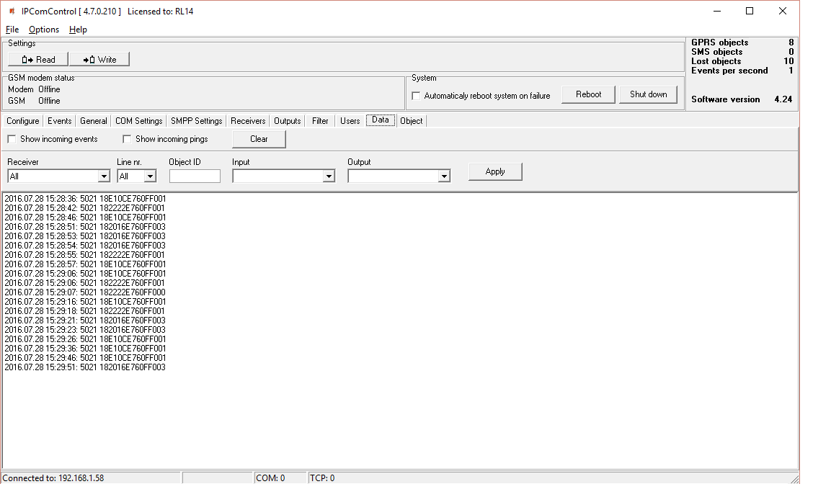

### Object tab — Registered object list

Registered object list is displayed in tab Object. It contains:

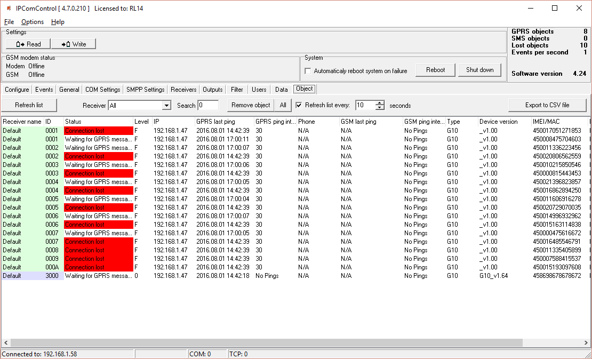

- **ID** – object's number;
- **Status** – connection status;
- **Level** – GSM connection strength;
- **IP** – transmission module address;
- **GPRS last ping** – date and time of the last IP message;
- **GPRS ping interval** – connection control period of IP channel messages;
- **Phone** – subscription number of transmission module (communicator) SIM card;
- **GSM last ping** – date and time of the last message received via GSM;
- **GSM ping interval** – connection control period of GSM connection messages;
- **Type** – transmission module type;
- **Device version** – transmission module program version;
- **IMEI/MAC** – transmission module IMEI or MAC number.

Use function **Search** to find the data row for required object. Function **Remove object** – to delete a selected line from the list. **Refresh list every: …… seconds** – to set list update period. Click **Export to CSV file** – to create a list of registered objects (communicators) in a CSV file.

## Resetting default parameters

In order to reset default receiver network adapter card IP addresses, press and hold RESET switch until a sound signal is heard.

## Receiver event messages

Receiver generates and sends a message to the monitoring software in case of any of the receiver events. Messages are sent with set receiver, line numbers and object identification numbers:

1. Received from the device from object, if event is connected with the object.
2. 0000, if event is connected with general function events.

| Event CID code | Event name / Object ID number | Zone number | Conditions for event message generation |
|----------------|-------------------------------|-------------|------------------------------------------|
| E301 | AC Power loss / 0000 Receiver ID | 000 | AC power lost |
| R301 | AC Power restore / 0000 Receiver ID | 000 | AC power restored |
| R305 | System started / 0000 Receiver ID | 000 | System started |
| E308 | System shutdown / 0000 Receiver ID | 000 | System shutdown |
| E311 | Battery missing / 0000 Receiver ID | 000 | Battery missing |
| R311 | Battery connected / 0000 Receiver ID | 000 | Battery connected |
| R313 | System rebooted / 0000 Receiver ID | ☑ | RESET pressed or software reboot |
| E330 | System peripheral trouble / Transmission module ID | Number of repeating modules | Peripheral trouble |
| E350 | Connection trouble / Transmission module ID | 000 | Connection trouble |
| R350 | Connection restore / Transmission module ID | 000 | Connection restored |
| E350 | Output connection trouble / 0000 Receiver ID | ☑ | Output connection trouble |
| R350 | Output connection restore / 0000 Receiver ID | ☑ | Output connection restored |
| E704 | Massive connection lost / 0000 Receiver ID | ☑ | Massive connection lost |
| E712 | Receiver i/o error / 0000 Receiver ID | ☑ | I/O error |
| R712 | Receiver i/o restored / 0000 Receiver ID | ☑ | I/O restored |
| E713 | Receiver no heart beat / 0000 Receiver ID | ☑ | No heartbeat |
| R713 | Receiver heart beat restored / 0000 Receiver ID | ☑ | Heartbeat restored |
| E714 | Receiver card unplugged / 0000 Receiver ID | ☑ | Card unplugged |
| R714 | Receiver card plugged in / 0000 Receiver ID | ☑ | Card plugged in |
| E732 | WAN ping timeout / 0000 Receiver ID | ☒ | WAN ping timeout |
| R732 | WAN ping restored / 0000 Receiver ID | ☒ | WAN ping restored |
| E733 | WAN cable disconnected / 0000 Receiver ID | 000 | WAN cable disconnected |
| R733 | WAN cable connected / 0000 Receiver ID | 000 | WAN cable connected |
| E751 | GSM connection is offline / 0000 Receiver ID | 000 | GSM offline |
| R751 | GSM connection is online / 0000 Receiver ID | 000 | GSM online |
| E752 | Lost GSM connection | | |
| R752 | Restored GSM connection | | |
| E753 | Cellular modem no response / 0000 Receiver ID | 000 | Modem no response |
| R753 | Cellular modem responded / 0000 Receiver ID | 000 | Modem responded |
| R754 | Massive GSM connection restore / 0000 Receiver ID | 000 | Massive GSM restore |
| R755 | GSM receiver mode / Transmission module ID | ☑ | GSM receiver mode |
| E762 | Lost GPRS connection / Transmission module ID | ☑ | GPRS connection lost |
| R762 | Restored GPRS connection / Transmission module ID | ☑ | GPRS connection restored |
| R764 | Massive GPRS connection restore / 0000 Receiver ID | 000 | Massive GPRS restore |

## License activation

Parameters of the initial license can be changed (upgraded) by installing a new license. Go to *Options → Activate product*, browse and select license file in `.lic` format.

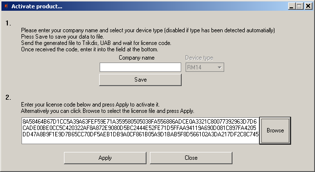

To install new license press the **Apply** button.
