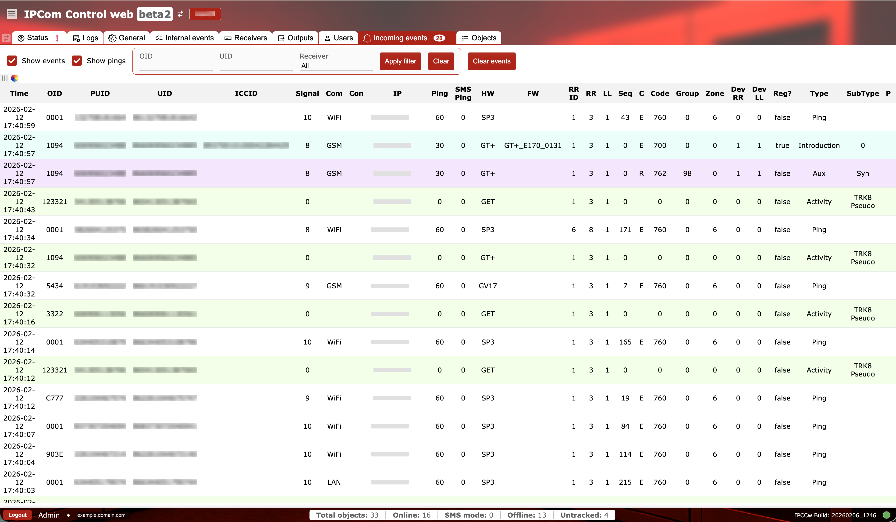

# Incoming events

**Purpose:** Monitor live incoming device events and pings, and filter them by device or receiver.

## When to use

- When validating that devices are sending events.
- When troubleshooting routing, connectivity, or event decoding.

## Sections and why they matter

### Filters and actions {#incoming-events-filters}

- `Show events` and `Show pings` toggle which message types appear.
- Filters for `OID`, `UID`, and `Receiver` narrow the stream to a specific device or instance.
- `Apply filter` updates the view, `Clear` resets filter fields, and `Clear events` clears the current list.

Filters are essential for high-volume receivers where scrolling the raw stream is impractical.

### Incoming event table {#incoming-events-table}

The table is wide and grouped by purpose:

- Identification: `Time`, `OID`, `PUID`, `UID`, `ICCID` identify the device.
- Connectivity: `Signal`, `Com` (communication type), `Con` (protocol), `IP`, `Ping`, `SMS Ping` show transport health.
- Device version: `HW` and `FW` help correlate behavior with hardware or firmware revisions.
- Routing: `RR ID` (route identifier), `RR` (receiver route value), and `LL` (line value) show routing context; `Dev RR` and `Dev LL` are device-reported routing values. `Reg?` indicates registration status.
- Event details: `Seq`, `C`, `Code`, `Group`, `Zone`, `Type`, `SubType`, `P` define the event payload.

Use these columns to confirm that events are correctly decoded and routed to the intended output.
For full field definitions, see `Glossary` in the IPcom navigation.

### Operational checks and actions {#incoming-events-operational-checks}

Use two quick passes during incident triage: first make sure the stream view is trustworthy, then validate routing and payload fields.

**Monitor these in runtime:**

- Filter state left active unintentionally. Alert cue: operators miss events because the view is narrowed.
- `Time` drift and delayed rows. Alert cue: latency spike from device to receiver.
- Routing mismatch between `RR/LL` and expected receiver path. Alert cue: events appear under wrong route context.
- Repeated bad combinations in `Code/Group/Zone`. Alert cue: decode/parsing mismatch after config changes.

**Confirm before production use:**

- `Clear` returns the table to the expected full stream before broad incident triage.
- Identification fields (`OID`, `UID`, `PUID`) map to known objects.
- Transport fields (`Con`, `IP`, `Ping`, `SMS Ping`) are consistent with the device communication mode.
