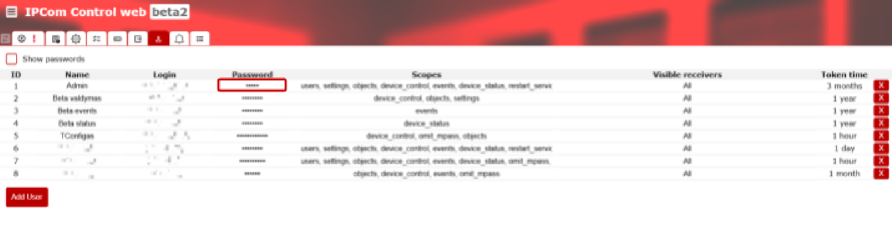
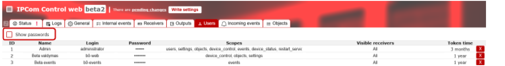
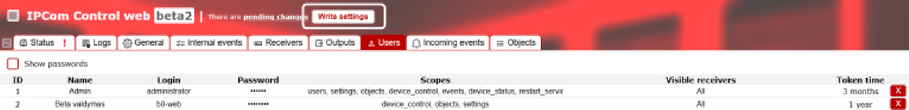
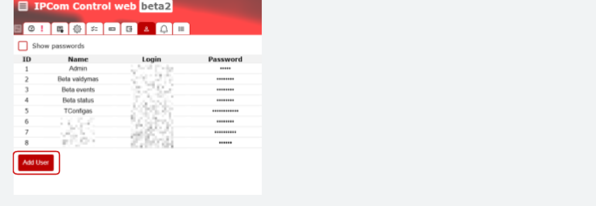
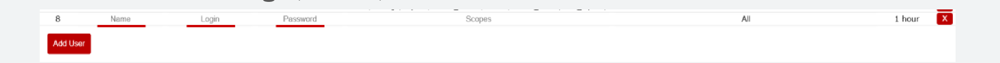
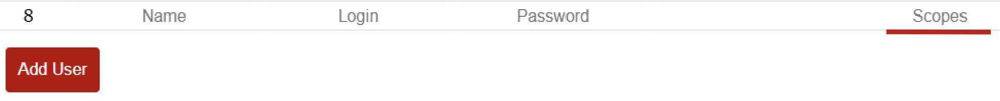
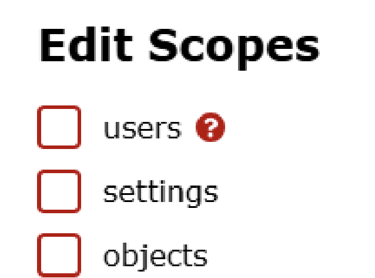
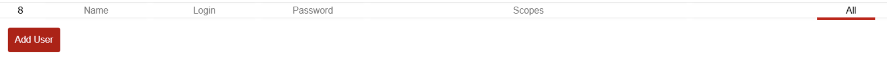
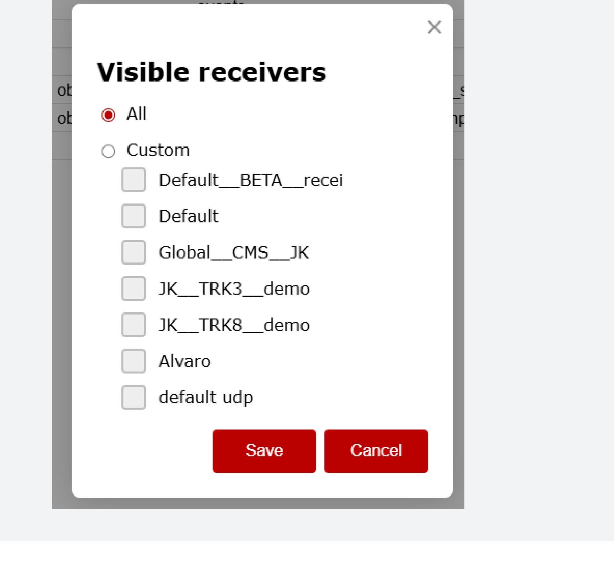
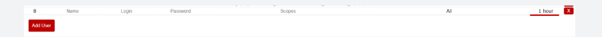

# IPCom (v.5) Control web

IPCom (v.5) Control web is the management interface for the IPCom receiver, used to control operator access and user administration. It can be accessed either via a web browser or through the IPCOM Windows .exe utility.

## Access and User Management

### Access

#### Login via web browser

1. In the address bar of the browser, enter the receiver IP address or domain and TCP port.
2. Enter your username and password in the login window.
3. Press the Login button.

!!! note
    This method does not save login history. It is recommended to use the bookmarks function of the browser for quick access.

#### Login via .exe program

1. Run the IPCOM .exe application.
2. Create and save connections to different receivers.

!!! note
    This method is convenient when working with many different receivers because it saves their address list.

### User management

Administration of user accounts and their rights.

!!! warning
    Changing the administrator password (Action required!).

#### Changing your password

1. Select a tab from the top menu bar **Users**.

    

2. Click on a user in the list **Password**.

    

    !!! note
        Check the box to see passwords, **Show passwords**.

    

3. Enter a new password in the field.
4. Press to save **Write Settings**.

    

#### Creating a new user

1. Click in the list of users **Add User**.

    

2. Fill in the fields: **Login**, **Name**, **Password**.

    

3. **Scopes (Rights)** section, check the required authorizations.

    

    Detailed explanations are provided by hovering over the authority and clicking on the question mark (?) symbol.

    

4. Choose which receivers the user will have access to.

    

    The default option for the user is **All (Visi)**.

    

5. In the box **Token time** set the session lifetime.

    

    The default option for the user is **An hour**.

    

!!! note
    Create individual user accounts with limited rights to ensure system management and traceability of actions.

!!! warning "Safety note"
    Consider restricting logins by IP address for added security.
