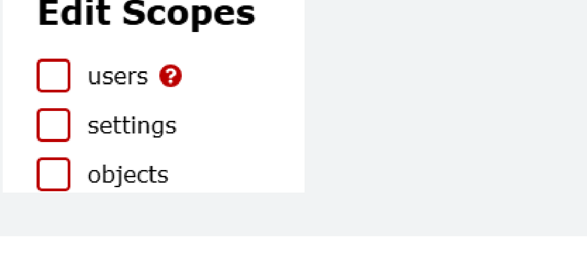
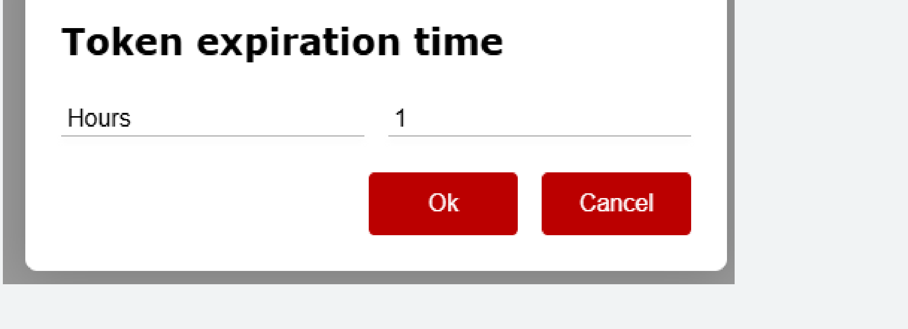

# IPCom (v.5) Control web

IPCom (v.5) Control web is the management interface for the IPCom receiver, used to control operator access and user administration. It can be accessed either via a web browser or through the IPCOM Windows .exe utility.

## Access and User Management

### Access

#### Login via web browser

<ol class="ipcom-steps">
  <li>In the address bar of the browser, enter the receiver IP address or domain and TCP port.</li>
  <li>Enter your username and password in the login window.</li>
  <li>Press the Login button.</li>
</ol>

!!! note
    This method does not save login history. It is recommended to use the bookmarks function of the browser for quick access.

#### Login via .exe program

<ol class="ipcom-steps">
  <li>Run the IPCOM .exe application.</li>
  <li>Create and save connections to different receivers.</li>
</ol>

!!! note
    This method is convenient when working with many different receivers because it saves their address list.

### User management

Administration of user accounts and their rights.

!!! warning
    Changing the administrator password (Action required!).

#### Changing your password

<ol class="ipcom-steps">
  <li>
    
Select a tab from the top menu bar <strong>Users</strong>.

    

      
    

  </li>
  <li>
    
Click on a user in the list <strong>Password</strong>.

    

      
    

    
Note: Check the box to see passwords, <strong>Show passwords</strong>.

    

      
    

  </li>
  <li>Enter a new password in the field.</li>
  <li>
    
Press to save <strong>Write Settings</strong>.

    

      
    

  </li>
</ol>

#### Creating a new user

<ol class="ipcom-steps">
  <li>
    
Click in the list of users <strong>Add User</strong>.

    

      
    

  </li>
  <li>
    
Fill in the fields: <strong>Login</strong>, <strong>Name</strong>, <strong>Password</strong>.

    

      
    

  </li>
  <li>
    
<strong>Scopes (Rights)</strong> section, check the required authorizations.

    

      
    

    
Detailed explanations are provided by hovering over the authority and clicking on the question mark (?) symbol.

    

      
    

  </li>
  <li>
    
Choose which receivers the user will have access to.

    

      
    

    
The default option for the user is <strong>All (Visi)</strong>.

    

      
    

  </li>
  <li>
    
In the box <strong>Token time</strong> set the session lifetime.

    

      
    

    
The default option for the user is <strong>An hour</strong>.

    

      
    

  </li>
</ol>

!!! note
    Create individual user accounts with limited rights to ensure system management and traceability of actions.

!!! warning "Safety note"
    Consider restricting logins by IP address for added security.
