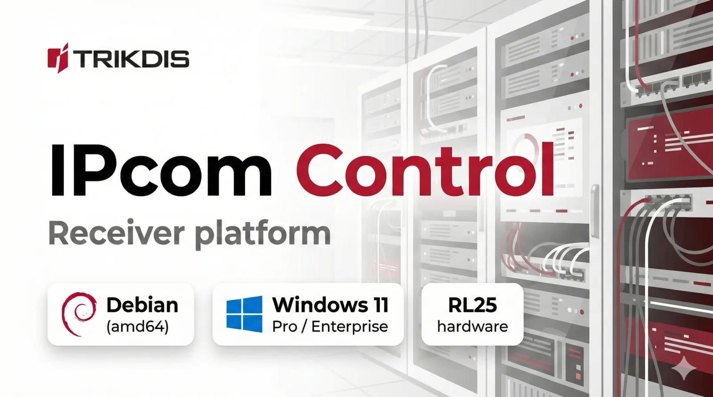
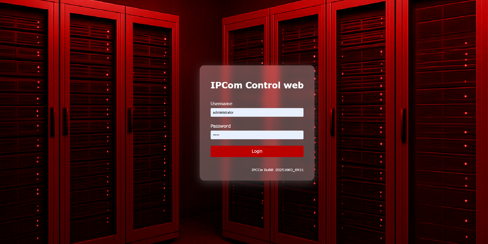

# IPCom v5 Receiver Overview

IPCom v5 is a receiver platform for collecting, processing, routing, and monitoring security system events. It provides a web interface for operations and administration.

The editions below are the same IPCom v5 product with different deployment models:

- Windows install
- Linux install (hardware or VM)
- Linux install in RL25 hardware receiver

## Deployment variants

| Variant | What it means | Typical use |
| --- | --- | --- |
| Windows install | IPCom v5 installed on Windows | Smaller or Windows-centric environments |
| Linux install (hardware or VM) | IPCom v5 installed on Linux server or virtual machine | Scalable deployments and server infrastructure |
| Linux install in RL25 hardware receiver | IPCom v5 on dedicated RL25 hardware | Appliance-style deployment with Linux preconfigured |

## Capability comparison by deployment

Functional differences between editions:

| Feature | Windows install | Linux install (hardware or VM) | Linux install in RL25 |
| --- | --- | --- | --- |
| Number of supervised devices | Up to 500 objects (can be increased) | Up to 50,000 per 1 GB RAM | Up to 50,000 per 1 GB RAM |
| Protegus 2 application (relay via receiver) | No | Yes | Yes |

`Relay via receiver` means device events and statuses are forwarded to Protegus 2 through IPCom, and supported actions can be sent back through IPCom to devices.

## Hardware requirements

Use these sizing baselines when planning new installations.

### Linux install (hardware or VM)

Linux platform requirements:

- IPCom v5 Linux edition is supported on `amd64` (`x86_64`) only.
- Recommended base OS is Debian Stable (`amd64`).
- Debian `netinst` links point to the current Stable release and can change over time.
- For controlled deployments, pin the exact Debian ISO filename/version in your rollout documentation.
- Non-`amd64` platforms (for example `arm64`/`aarch64`) are not supported for IPCom v5 Linux deployment.
- If hardware is non-`amd64`, use a supported alternative such as Windows installation or RL25 hardware.

| Deployment size | RAM | Storage |
| --- | --- | --- |
| Baseline deployment | 4 GB | 128 GB SSD |
| Large object load (around 100,000 objects) | 8 GB | 128 GB SSD |
| Large object load with database enabled | 8 GB | 256 GB enterprise SSD |

Notes:

- For database-heavy deployments, the 256 GB enterprise SSD recommendation is mainly for endurance (higher DWPD), not only raw capacity.
- Plan additional free disk space for logs, backups, and update rollback files.

### Windows install

Minimum recommended specification:

- Windows 11 Pro or Windows 11 Enterprise
- 2-core CPU
- 8 GB RAM
- 128 GB HDD/SSD (SSD preferred)

### RL25 hardware receiver

- RL25 ships with SSD and RAM preinstalled.
- Use RL25 when appliance-style deployment and prevalidated hardware are preferred.

## Shared capabilities (all variants)

### Core receiving and control

- IP receiver, SMS receiver (optional / GM14 / SMPP), and reception via RS232.
- Remote TRIKDIS configuration and remote TRIKDIS control.
- Supervision, message routing, and radio message filtering.
- Receiver management through Webpage (HTTP/HTTPS).

### Protocols and integrations

- Supported protocols: Trikdis (TCP/UDP/COM/SMS).
- CMS/Automation protocols: Split / Multi-Port Reporting.
- CMS formats: Ademco 685, Monas3, Surgard MLR2, MLR2000, SIA DC-09.
- CMS/Automation transport types: TCP Client/Server, RS232, JSON, Webhook.
- SQL DB interface and object information export.

### UI and operational features

- Editable user interface.
- Account override at receiver level and related account (panel) display.
- Ability to ignore primary messages.
- Device blocking by ID (planned).
- Settings change log.
- Receiver system overview dashboard.
- Remote update.
- Multi-level user list.

## Operational scope (from presentation summary)

### Access and security

- Browser login by IP address or domain with port selection.
- HTTP/HTTPS management interface, with SSL usage discussed for secure access.
- User list, administrator account, role assignment, and session/token controls.

For step-by-step access methods (Web and Windows `.exe`), see [Access and login](./ui/access-and-login.md).
For user creation, password, scopes, and token procedures, see [Users tab](./ui/screens/users.md).

Operational security baseline:

- Restrict management UI access by network allowlist or VPN.
- Use HTTPS with valid certificates for all admin sessions.
- Keep `administrator` reserved for break-glass use; use named least-privilege accounts for daily work.
- Rotate credentials and integration secrets on a regular schedule.

### Monitoring and operations

- Dashboard view of system and object state.
- Online/offline/untracked tracking and event statistics.
- System logs and session logs for operational visibility.

### Events, routing, and protocol handling

- Event list handling with filtering/search capabilities.
- Ping/heartbeat handling for connectivity supervision.
- Routing and output handling for CMS/automation flows.

### Integration and data

- SQL-backed operational data and object export.
- API/integration support through JSON and webhook transport.

### Deployment and lifecycle

- Deployment on Windows and Linux platforms.
- Configuration import/export and remote update workflows.
- Licensing and server-side operational considerations.

## Quick access

Use these pages as primary entry points:

- Access methods and troubleshooting: [Access and login](./ui/access-and-login.md)
- Screen-by-screen operational behavior: [Status tab](./ui/screens/status.md) (and the rest of `Tabs`)
- User and permission procedures: [Users tab](./ui/screens/users.md)
