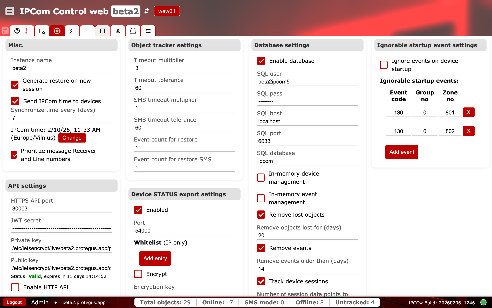
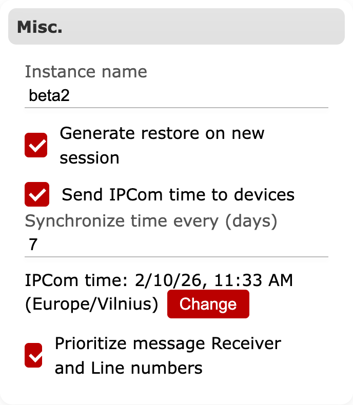
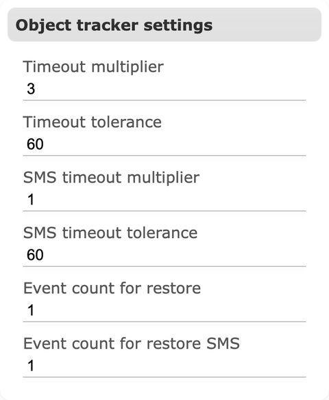
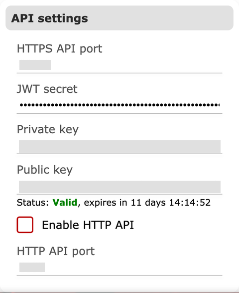
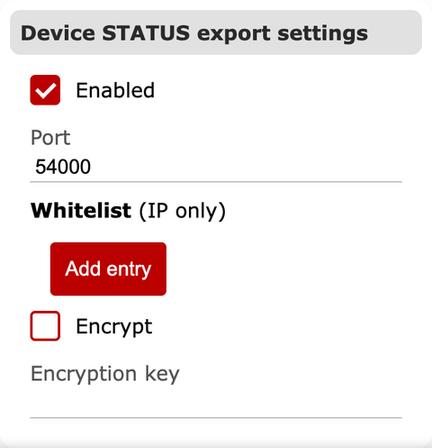
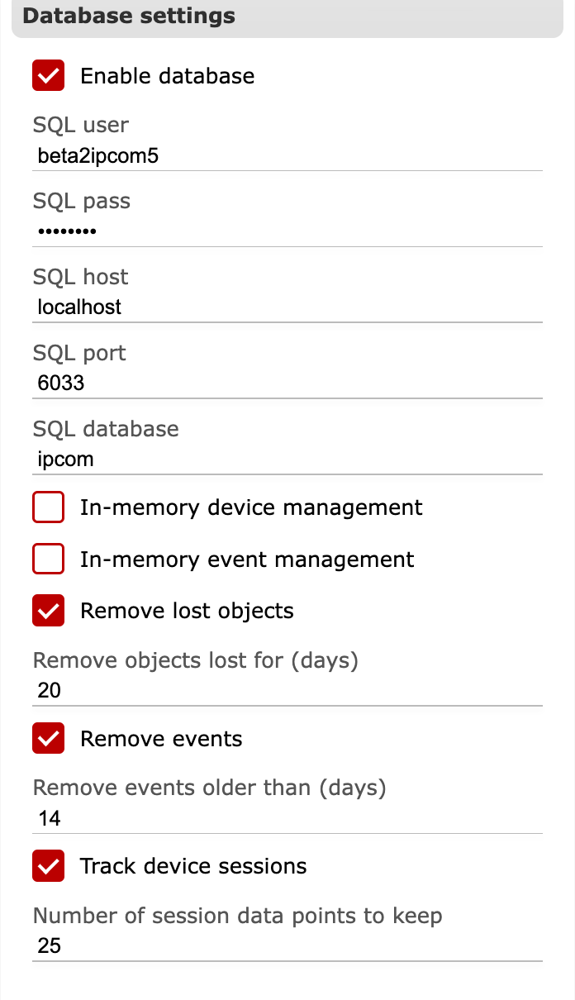

# General

**Purpose:** Configure instance-wide settings that affect timekeeping, supervision, database behavior, API access, and startup event handling.

## When to use

- During initial deployment to set identity, time sync, API, and database connectivity.
- When tuning supervision, retention, or export behavior for operations.

## Sections and why they matter {#general-sections}

### Misc.

Defines the instance name and session behaviors. The instance name appears in the UI and helps operators confirm they are working on the correct receiver. Options like `Generate restore on new session` influence how restore events are emitted after reconnects, which affects downstream monitoring. Time synchronization settings control whether IPCom pushes its clock to devices and how frequently it does so, which directly impacts event timestamps.

**Operational checks and validation:**

- Watch: `Send IPCom time to devices` and sync interval. Alert cue: timestamp drift between receiver and CMS.
- Watch: instance name changes. Alert cue: operators selecting the wrong receiver.
- Validate: `instance_name` must be non-empty.
- Validate: `synchronize_device_time_interval` must be greater than `0`.

### Object tracker settings

Controls supervision timing for tracked devices. Timeout multipliers and tolerances determine when a device is considered offline. Separate SMS values apply when devices report over SMS. Restore event counts tune when the system emits recovery messages after a device returns.

**Operational checks and validation:**

- Watch: timeout multipliers and tolerances. Alert cue: false offline alarms or restore storms.
- Validate: `timeout_multiplier` and `sms_timeout_multiplier` must be `1..100`.
- Validate: `timeout_tolerance` and `sms_timeout_tolerance` must be `0..3600`.
- Validate: `event_count_for_restore` and `event_count_for_restore_sms` must be `1..10`.

### API settings

Defines HTTPS API access, port, and secrets. These settings control how external systems integrate with IPCom and must be kept consistent with firewalls and reverse proxies. TLS certificate status in this section helps validate secure access.

API exposure should be restricted to trusted admin/integration networks.
Open SME questions about API exposure policy are tracked in `../team-input-questions.md`.

**Operational checks and validation:**

- Watch: `Enable HTTP API`, API ports, and TLS status. Alert cue: unexpected open management path or certificate issues.
- Watch: `Enable cluster`. Alert cue: node state drift or failover anomalies.
- Validate: `api_port` and `api_http_port` must be between `1` and `65535`.
- Validate: `api_jwt_secret` must be exactly 64 characters.
- Validate: `private_key` and `public_key` must be non-empty and point to valid PEM files.

### Device STATUS export settings

Enables a status export listener and configures its port and IP whitelist. Use this for downstream systems that consume device status updates. Encryption can be enabled when the export is sent over untrusted networks.

**Operational checks and validation:**

- Watch: `Enabled`, `Port`, `Whitelist`, and `Encrypt` values. Alert cue: missing status export or traffic from unexpected sources.
- Validate: Device STATUS export `port` must be `1..65535`.
- Validate: if STATUS export encryption is enabled, key length must be exactly 16 characters.

### Database settings

Enables the SQL database and configures connection details (user, password, host, port, database). In-memory device and event management options control what is cached and how cleanup works. The `Remove lost objects` and `Remove events` retention values determine how long data is kept before cleanup, which affects storage and audit depth.

**Operational checks and validation:**

- Watch: `Enable database` and SQL connection fields. Alert cue: missing logs/history after restart.
- Watch: `Remove lost objects` and `Remove events` retention values. Alert cue: data disappearing earlier than policy.
- Validate: if database is enabled, `sqluser`, `sqlpass`, `sqlhost`, and `sqldatabase` must be non-empty.
- Validate: `sqlport` must be `1..65535` (backend default is `3306` when set to `0`).
- Validate: `remove_lost_objects_age` and `remove_events_age` must be `1..365` days.
- Validate: `device_session_log_count` must be `1..25`.

### Ignorable startup event settings

Lets you suppress specific event codes on device startup. This is useful to reduce noise during mass reconnects or scheduled maintenance. Use the event list to add or remove codes that should be ignored.

**Operational checks and validation:**

- Watch: `Ignore events on device startup` and exception list. Alert cue: critical startup alarms not reaching CMS.
- Validate: `event_code <= 0xFFF`, `group_no <= 0xFF`, `zone_no <= 0xFFF`, and each triplet must be unique.

### Show passwords

Toggles masked secrets (database password, API secrets) for verification. Enable only in controlled maintenance and disable immediately after verification.

**Operational checks and validation:**

- Watch: keep `Show passwords` disabled by default. Alert cue: secrets visible during normal operation.
- Validate: use only for controlled maintenance and disable immediately after verification.

## Change management

- Schedule changes to API, database, and retention settings during maintenance windows.
- Record before-and-after values and expected impact for audit and rollback.
- After each change, verify `Status`, `Logs`, and destination delivery paths.
- Keep a rollback path ready for database, API, and cluster-related updates.

