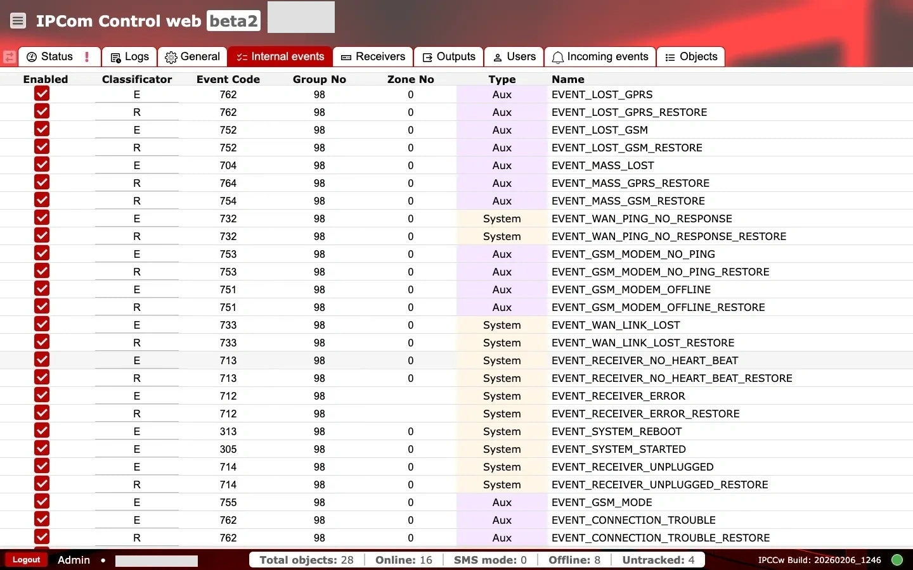

# Internal events

**Purpose:** Review and control system-generated events and the codes that are sent to downstream destinations.

## When to use

- When you need to map internal events to CMS or automation codes.
- When you need to enable or suppress specific internal events.

## Sections and why they matter

### Internal event list {#internal-events-list}

Each row defines how an internal system condition is represented in outgoing messages. This is where you align internal event names with the numeric codes expected by your monitoring platform.

### Columns explained {#internal-events-columns}

- `Enabled`: whether the event is active (checked) or suppressed.
- `Classificator`: event classifier (for example, `E` for event, `R` for restore).
- `Event code`: numeric code sent in event output.
- `Group no` and `Zone no`: numeric routing fields used by receiver integrations.
- `Type`: category such as `System` or `Aux`.
- `Name`: internal event identifier (for example, `EVENT_SYSTEM_STARTED`).

Disabling events or changing codes affects downstream routing and alarm interpretation, so changes should be coordinated with the monitoring platform.

### Operational checks and actions {#internal-events-operational-checks}

Use two quick passes after any change: first watch event behavior in downstream systems, then confirm rule integrity in the table.

**Monitor these in runtime:**

- Enabled/disabled toggles changing unexpectedly. Alert cue: internal alarms stop appearing downstream.
- Event codes changing unexpectedly after updates. Alert cue: CMS starts decoding internal events incorrectly.
- `Type` switching between `System` and `Aux` without change request. Alert cue: wrong downstream classification.
- Paired `E` (event) and `R` (restore) rules drifting out of sync. Alert cue: restore events are missing.

**Confirm before production use:**

- `classificator` is `E` (event) or `R` (restore).
- `event_code`, `group_no`, and `zone_no` are within allowed numeric ranges.
- `name` is non-empty.
- `type` is one of the supported values.
- Coding is deployment-aligned with CMS parsing rules before enabling.
