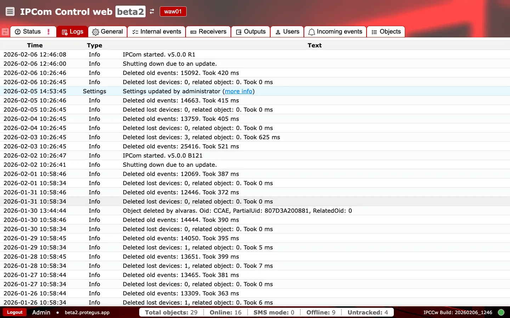

# Logs

**Purpose:** Provide an audit trail of system activity and administrative actions for troubleshooting and compliance.

## When to use

- After configuration changes to confirm they were applied.
- When investigating restarts, cleanup tasks, or unexpected behavior.

## Sections and why they matter

### Log table {#logs-table}

Each row records a system or administrative event with a timestamp, type, and message. This is the first place to confirm scheduled cleanup, upgrades, or configuration changes. Some entries include a `more info` link with extended details that helps identify what changed and who initiated it.

### Operational checks and actions {#logs-operational-checks}

Use two quick passes: first monitor patterns in recent entries, then confirm event metadata before escalating.

**Monitor these in runtime:**

- Repeated `error` entries in short time windows. Alert cue: recurrent transport or service instability.
- Frequent `Settings`-type entries outside maintenance windows. Alert cue: unauthorized or accidental changes.
- `more info` actor/source does not match expected operator or automation account. Alert cue: unplanned administrative changes.

**Confirm before production use:**

- `Type` labels remain consistent (`info`, `warning`, `error`, `settings`).
- Timestamps follow expected chronological order for the same incident timeline.

## Incident checklist {#logs-incident-checklist}

- `Destination delivery failures`: look for repeated output connection errors and timeout patterns.
- `Receiver ingest failures`: look for listener bind/start errors after port or network changes.
- `Auth and permission issues`: look for failed login/auth events after account or token changes.
- `Backlog symptoms`: correlate cleanup or warning entries with buffer growth in `Status`.
