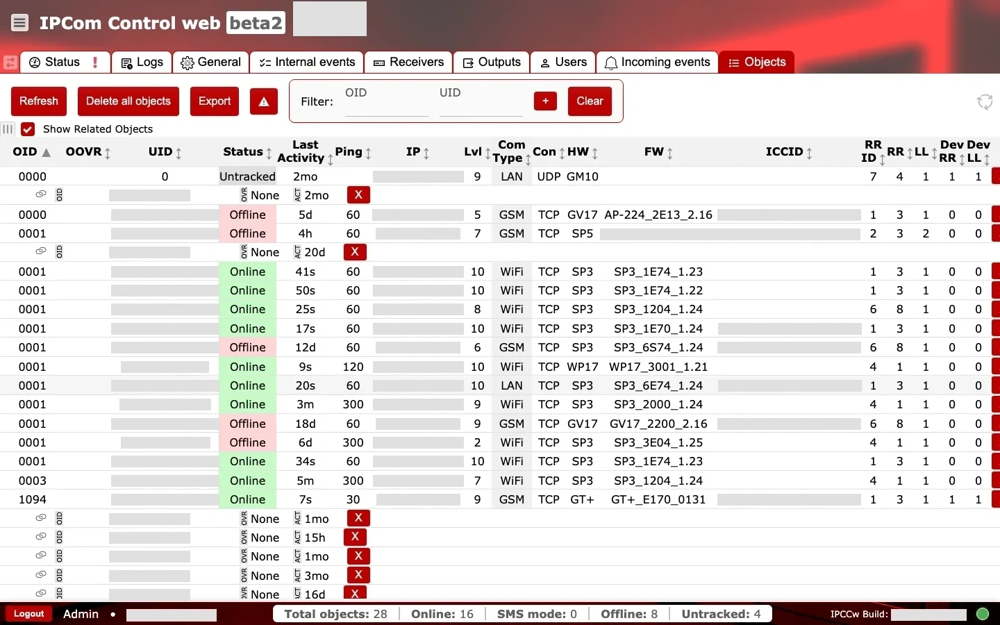
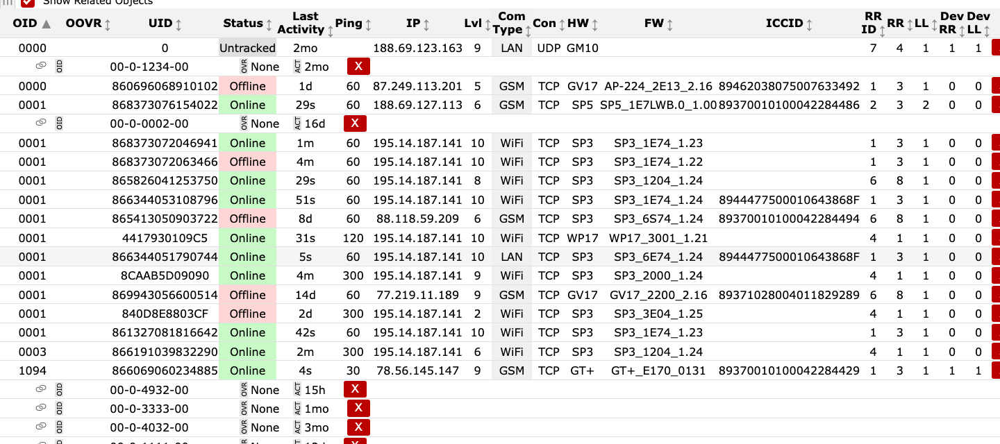

# Objects

**Purpose:** Review and manage the list of tracked objects (devices), their status, and connection details.

## When to use

- When searching for a specific device or verifying its online status.
- When exporting device lists or auditing connectivity issues.

## Sections and why they matter

### Actions and filters {#objects-actions-filters}

- `Refresh` reloads the list to show the latest device states.
- `Delete all objects` removes all objects from the list and should be used only with explicit approval.
- `Export` downloads the list for reporting or analysis. [REVIEW]
- Filter fields for `OID` and `UID` help narrow large lists, with `+` to apply and `Clear` to reset.
- `Show Related Objects` expands the list with related entries.

### Object list table {#objects-object-list}

Key columns include:

- Identification: `OID`, `UID`, and `ICCID` identify the device and SIM.
- Status: `Status` and `Last Activity` show availability and the last reported time.
- Connectivity: `Ping`, `IP`, `Lvl` (signal level), `Com Type` (GSM/WiFi/LAN), and `Con` (TCP/UDP) reveal transport health.
- Device version: `HW` and `FW` help relate behavior to firmware levels.
- Routing: `RR ID` (route identifier), `RR` (receiver route value), and `LL` (line value) show routing context; `Dev RR` and `Dev LL` are device-reported routing values.
- `OOVR` is an object supervision field. Exact semantics are still [REVIEW].

Red `X` indicators in the `Ping` column typically mean no recent ping was recorded.
For full field definitions, see `Glossary` in the IPcom navigation.

### Operational checks and actions {#objects-operational-checks}

Use two quick passes: first monitor object health signals over time, then confirm table values against expected routing and inventory.

**Monitor these in runtime:**

- Accidental destructive actions (`Delete all objects`) during operations. Alert cue: sudden empty inventory.
- Stale filter state. Alert cue: expected devices missing from current view.
- `Status` and `Last Activity` divergence. Alert cue: object reported online but stale activity timestamp.
- Repeated `Ping` red `X` across the same transport group. Alert cue: channel or path degradation.
- Unresolved `OOVR` values changing around incident windows. Alert cue: possible hidden supervision state transition. [REVIEW]

**Confirm before production use:**

- `Refresh` is used before incident triage snapshots.
- Routing fields (`RR ID`, `RR`, `LL`, `Dev RR`, `Dev LL`) align with receiver/output mapping.
- Hardware and firmware fields (`HW`, `FW`) are present for expected managed device types.
