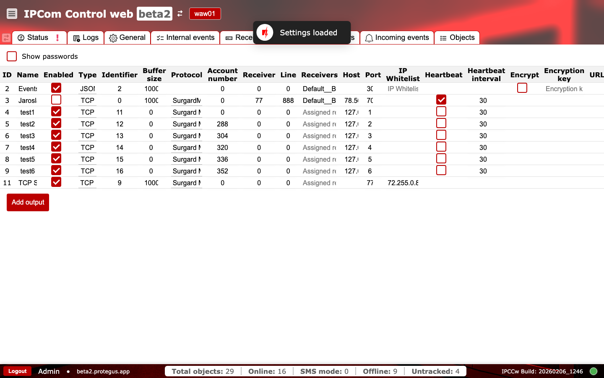

# Outputs

**Purpose:** Configure output destinations for event delivery and automation integrations.

## When to use

- When creating or updating CMS or automation routes.
- When troubleshooting delivery to a specific destination.

## Sections and why they matter

### Outputs table {#outputs-table}

Each row represents a destination and its routing configuration. Key fields:

- `ID` and `Name`: identify the output.
- `Enabled`: controls whether events are sent to this destination.
- `Type` and `Protocol`: describe the output transport.
- `Identifier` and `Account number`: routing identifiers expected by the destination system.
- `Receiver` and `Line`: receiver-side routing identifiers.
- `Receivers`: assigned receiver group for this output.
- `Host` and `Port`: remote destination address.
- `Buffer size`: queue limit per output used to detect delivery bottlenecks.
- `Heartbeat` and `Heartbeat interval`: connection health checks.
- `Encrypt` and `Encryption key`: secure the transport when required (API-backed integrations use a fixed-length key).
- `IP Whitelist`: restricts allowed destination IPs.
- `Filters`: event routing filters that control which events are sent.

Available `Type` options:

- `TCP`
- `COM Port`
- `JSON Server`
- `TCP Server`
- `Webhook`

Available `Protocol` options:

- `Surgard MLR2`
- `Monas 3`
- `Surgard MLR2 8`
- `Surgard MLR2 No End`
- `Ademco 685`
- `Ademco 685 CID`
- `SurgardMRL2000 CID`
- `SIA DC-09`
- `Surgard MLR2 Line with Account`

Misconfigured fields here are a common cause of undelivered events, so validate changes against the destination system requirements.

`Buffer size` is a queue limit per output. High or growing queue usage indicates destination-side delays or protocol mismatch and can lead to delayed alarm delivery.

Protocol-specific field usage varies by integration and must match the CMS parser profile used in your deployment.

FYI: if `buffer_size` is set to `0`, IPCom uses the default queue size of `1000` events.

### Add output {#outputs-add-output}

Use `Add output` to create a new destination and populate routing identifiers and network values.

### Operational checks and actions {#outputs-operational-checks}

Use two quick passes after any change: first monitor runtime behavior, then confirm configuration details before enabling production delivery.

**Monitor these in runtime:**

- `Buffer size` growth on active outputs. Alert cue: queue does not drain while devices continue generating events.
- Endpoint/protocol edits without coordinated CMS changes. Alert cue: delivery failures or decode errors.
- Newly enabled output before destination readiness. Alert cue: immediate buffer growth and failed connection attempts.

**Confirm before production use:**

- Output `id` is unique and greater than `0`; `name` is not empty.
- `Type`, `Protocol`, and `Identifier` match the CMS integration profile.
- `OID`, `Receiver number`, and `Line` match expected routing in CMS.
- If encryption is enabled, `encryption_key` length is exactly `16` characters.
- Output `IP Whitelist` and `Host` policy align with `Networking and firewall` guidance.
- Encryption key character set/encoding is agreed with your integration team.
- Retry/backoff and queue persistence behavior is documented for your deployment.
- Run controlled test events per protocol before production enablement.

## Operations runbook {#outputs-operations-runbook}

- `Events not arriving at destination`: verify `Enabled`, destination `Host`/`Port`, protocol choice, and receiver/line mapping.
- `Frequent reconnects`: tune `Heartbeat interval`, verify network stability, and confirm destination accepts the configured protocol.
- `Queue growth on one output`: temporarily disable the problematic output, fix endpoint settings, then re-enable and watch buffer recovery.
- `Changes break delivery`: compare with a known working output and roll back to the last stable values before retrying.
