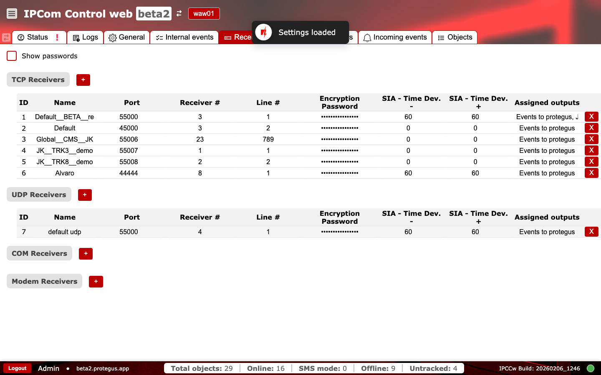
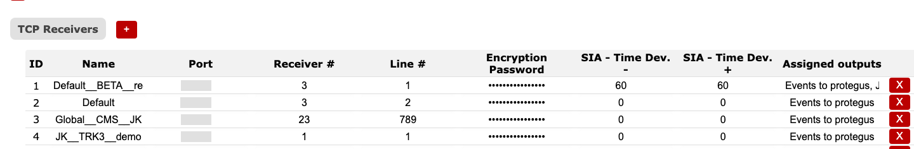
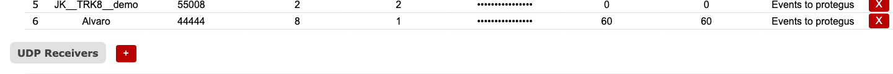

# Receivers

**Purpose:** Configure receiver endpoints (TCP, UDP, COM, and Modem) that accept incoming device traffic and define routing parameters.

## When to use

- When onboarding a new receiver endpoint or changing listening ports.
- When routing identifiers or encryption settings change.

## Sections and why they matter

### TCP Receivers {#receivers-tcp}

Defines TCP listening endpoints. `Port` controls where devices connect. `Receiver #` and `Line #` are routing identifiers used by downstream systems. `Encryption Password` protects encrypted traffic. `SIA - Time Dev.` fields define allowed time deviation thresholds for the SIA protocol (negative and positive).

Use consistent receiver/line mapping with outputs and CMS expectations.

**Operational checks and actions:**

- Monitor: active ingest drops after port change. Alert cue: sessions fall to zero in `Status`.
- Monitor: line/receiver remaps without CMS change control. Alert cue: events routed to wrong tenant/partition.
- Confirm: TCP ports must be `1..65535`.
- Confirm: TCP ports must be unique in TCP receiver set.
- Confirm: receiver `id` is unique and greater than `0`; receiver `name` is not empty.
- Confirm: encryption password length is exactly `6` or `16` characters.

### UDP Receivers {#receivers-udp}

Defines UDP listening endpoints. Use this when devices report over UDP. Field meanings mirror TCP receivers, with the same routing identifiers.

**Operational checks and actions:**

- Monitor: UDP packet ingest mismatch with expected fleet protocol. Alert cue: active devices show no events.
- Confirm: UDP ports must be `1..65535`.
- Confirm: UDP ports must be unique in UDP receiver set.

### COM Receivers {#receivers-com}

Defines serial (RS232/COM) receivers for local integrations. These are typically used when hardware or legacy panels report over serial links.

**Operational checks and actions:**

- Monitor: COM receiver enabled with missing physical serial connectivity. Alert cue: no incoming events from serial panels.
- Confirm: COM receiver `port_id` references an existing COM terminal.

### Modem Receivers {#receivers-modem}

Defines modem-based receivers for SMS or dial-up style traffic. Use this when SMS or modem channels are part of the deployment.

**Operational checks and actions:**

- Monitor: modem receiver route churn during outage windows. Alert cue: SMS events missing or delayed.
- Confirm: modem receiver `port_id` references an existing COM terminal.
- Confirm: modem encryption password length is `6` or `16` characters.

### Assigned outputs and removal {#receivers-assigned-outputs}

The `Assigned outputs` column shows which outputs are linked to each receiver. The red `X` action removes a receiver entry, so use it only with explicit approval.

**Operational checks and actions:**

- Monitor: receivers have no assigned outputs. Alert cue: ingest works but no downstream delivery.
- Monitor: accidental delete action (`X`) during active operations. Alert cue: sudden receiver disappearance.
- Confirm: every active receiver has at least one intended output mapping.

## Networking notes

- Receiver tabs define inbound endpoints (device -> IPCom).
- Output tabs define outbound destinations (IPCom -> CMS/automation).
- When changing receiver ports, update firewall and NAT rules before switching production traffic.
