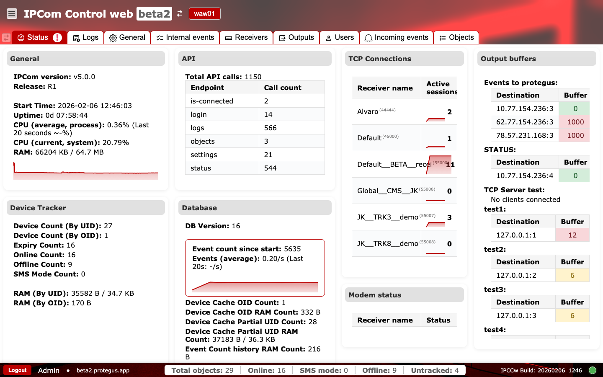
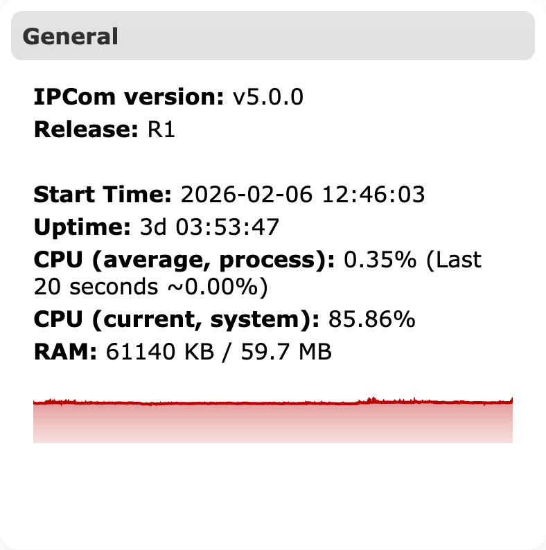
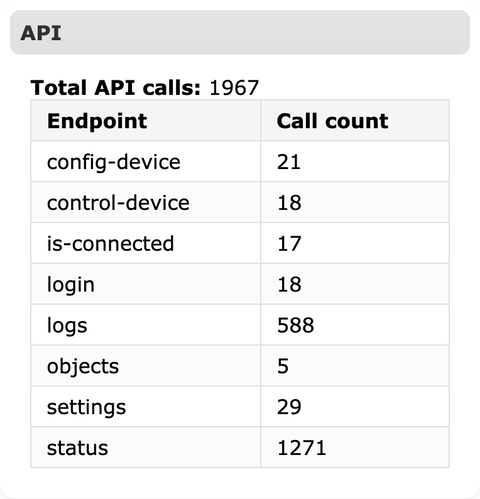
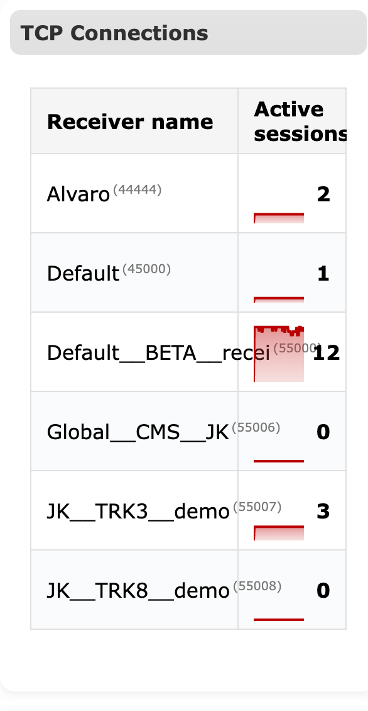
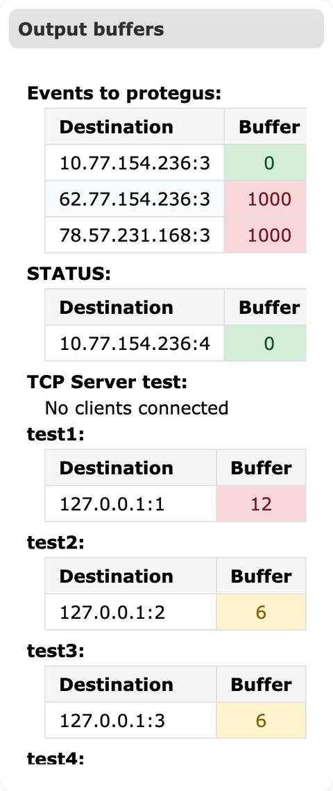

# Status

**Purpose:** Provide a live operational overview of the selected IPCom instance so operators can confirm health, throughput, and connectivity at a glance.

## When to use

- After login to confirm the instance version, uptime, and overall health.
- When investigating delivery issues, buffer backlogs, or connection drops.

## Sections and why they matter

### Footer

- `Left block` shows the logout control, current user identity, and connected host, used to confirm you are operating in the intended environment and account.  
  
- `Center block` shows supervision counters (`Total objects`, `Online`, `SMS mode`, `Offline`, `Untracked`) for fast before/after change validation.  
  
- `Right block` shows `IPCCw Build` and the live connection indicator to validate running build and UI transport state.  
  

### General

Shows the IPCom version and release, start time, uptime, CPU usage, and RAM usage. These metrics help confirm that the receiver is running the expected build and has enough resources for current load. The CPU trend line helps spot spikes that can affect event processing latency.

### API

Lists total API calls by endpoint. This is a quick indicator of how heavily external integrations or UI actions are using the API. Sudden increases in `login` or `settings` calls can indicate automation activity or misconfigured polling.

### TCP Connections

Shows active sessions per receiver. Each receiver entry represents a listening endpoint with active device connections. A sudden drop to zero typically points to network, firewall, or receiver-side issues.

### Output buffers

Displays queue sizes per destination for events and status updates. Buffers grow when IPCom cannot deliver messages fast enough. Persistent growth indicates connectivity problems to the destination or oversized bursts that need rate control.

### Device Tracker

Summarizes device counts by UID/OID, online or offline state, SMS mode usage, and memory usage for tracking. This section helps assess fleet health and confirms that device supervision is functioning.

### Database

Shows database version and event statistics, including the event count since start and average event rate. The trend line helps you detect drops or surges in activity. Cache counts and RAM usage hint at data retention or scaling constraints.

### Modem status

Lists receiver status for modem-based traffic. Use this when SMS or modem channels are part of the deployment, to verify the modem receiver is active.

### Connected users

Shows currently authenticated UI sessions and source IP/port. This is useful for identifying concurrent admin sessions and spotting unexpected access during incident response.

## Trends and charts

The small red trend graphs under CPU and event statistics show recent activity changes. Use them to identify spikes or drops that may warrant deeper investigation in logs or incoming events.

## Operations runbook {#status-operations-runbook}

- `Output buffer keeps increasing`: check destination reachability, protocol compatibility, and output credentials in `Outputs`.
- `Active sessions drop to 0`: verify listener ports and firewall rules in `Receivers`, then inspect network paths from devices.
- `Average events suddenly drops`: confirm device connectivity in `Objects` and check recent errors in `Logs`.
- `CPU or RAM spikes`: review recent config changes, reduce noisy traffic, and validate retention settings in `General`.

### Operational checks and actions {#status-operational-checks}

Use two quick passes for routine supervision: first watch live health signals, then confirm session and UI state before escalation.

**Monitor these in runtime:**

- `CPU (current/system)` and `RAM`. Alert cue: sustained high usage with slower UI/API response.
- `Active sessions` per receiver. Alert cue: abrupt drop to zero on active receivers.
- `Output buffer` trends. Alert cue: continuous growth instead of draining.
- `Online` / `Offline` / `Untracked` counters. Alert cue: sudden offline growth after network/config changes.
- `Events (average)` trend. Alert cue: unexpected drop/spike not explained by schedule.
- Repeated error toasts during routine actions. Alert cue: processing or state synchronization issues.

**Confirm before production use:**

- Toast message text matches the action just performed.
- Footer environment identity (`user`, `host`, `build`) matches the intended instance.
