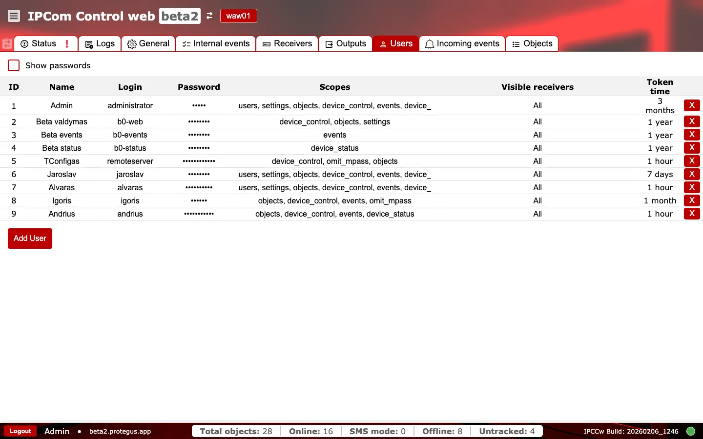
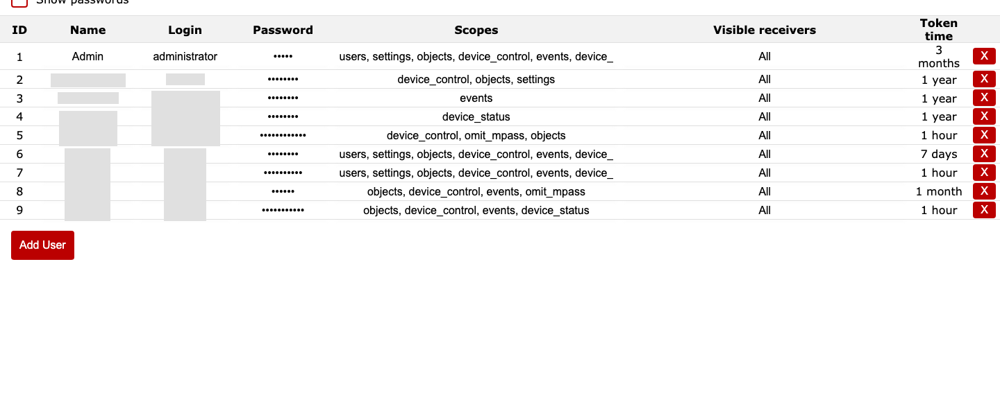
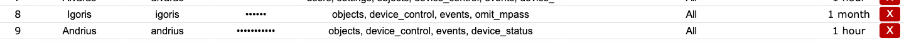

# Users

**Purpose:** Manage user accounts, permissions, and receiver visibility.

## When to use

- When adding or removing operators.
- When updating access scopes or receiver visibility for security.

## Sections and why they matter

### Users table {#users-table}

Each row represents a user account.

- `ID`, `Name`, `Login`: identity fields used in audits and login.
- `Password`: masked by default.
- `Scopes`: permissions granted to the user (for example, settings, events, objects). Limit scopes to reduce risk.
- `Visible receivers`: which receiver instances the user can access.
- `Token time`: token validity period, which affects session lifetimes and security posture.

### Add User and removal {#users-add-remove}

Use `Add User` to create a new account. The red `X` action removes a user and should be used with explicit approval.

### Operational checks and actions {#users-operational-checks}

Use two quick passes when changing accounts: first monitor active risk signals, then confirm policy alignment before handover.

**Monitor these in runtime:**

- Scope expansion for existing accounts. Alert cue: users gain settings/control privileges outside role.
- `Token time` too long on privileged accounts. Alert cue: persistent elevated sessions.
- User removals during active response windows. Alert cue: sudden access loss for on-duty operators.

**Confirm before production use:**

- Allowed scopes are only `users`, `settings`, `objects`, `device_control`, `events`, `omit_mpass`, `restart_services`, `turnoff_receiver`, `license`.
- `token_time` is in range `1..5,256,000` minutes.
- `id` is unique and greater than `0`; `login` and `password` are not empty.
- If `visible_receivers.all = false`, the custom receiver list is not empty.
- New account login and expected scope behavior are verified before handing over credentials.
- User count remains within license allowance.

## Common procedures

### Create a new user

1. Open `Users` tab and select `Add User`.
   
2. Fill in account identity fields (`Name`, `Login`, password).
   
3. Assign minimum required `Scopes` for the role.
   
   
4. Set `Visible receivers` to only required instances.
   
   
5. Set `Token time` according to security policy.
   
   
6. Save settings and validate login with the new account.
   

### Change a user password

1. Locate the target account in `Users` table.
2. Enable password visibility only if required for controlled verification.
   
3. Update password for the account and save.
   
4. Confirm the user can authenticate with the new password.
5. Disable password visibility after verification.

## Hardening checklist

- Keep `administrator` for emergency use only; use named accounts for daily operations.
- Assign least-privilege `Scopes` per role (monitoring, operations, integration admin).
- Restrict `Visible receivers` so users only see required instances.
- Set shorter `Token time` for high-privilege users and rotate credentials regularly.
- Remove stale accounts and verify owner/role at scheduled intervals.
