# R11 / R11U Radio Receivers

<div style="text-align: center;">
  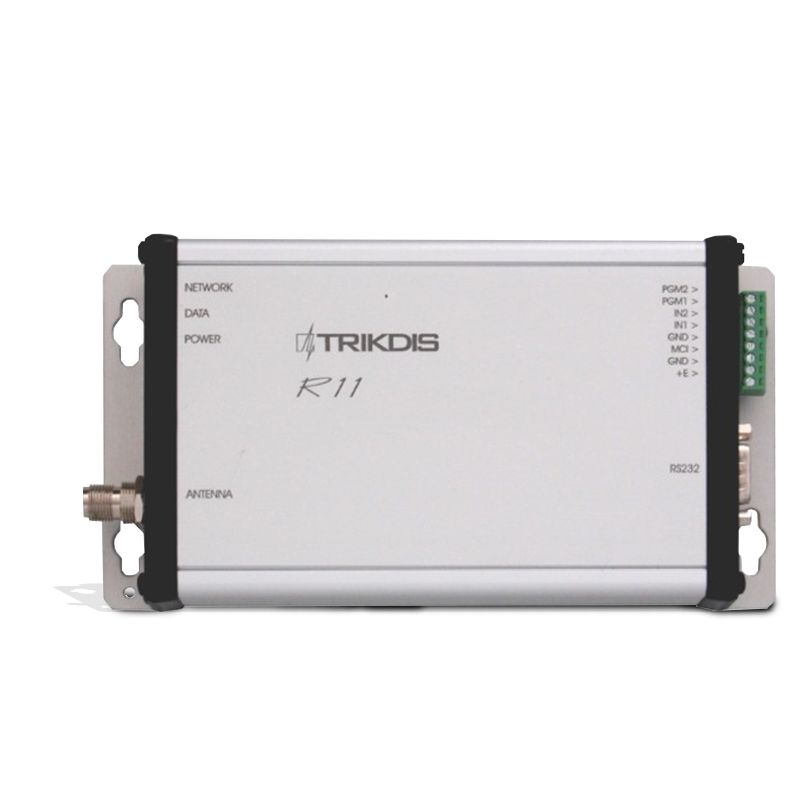
</div>

Radio receivers R11, R11U are applied as a component part of the radio protection system RAS-3 and are designed for reception and decoding of encoded messages sent via radio communication channel at VHF (R11) or UHF (R11U) frequency band. Signals sent via the encoding system RAS-3 are received and decoded by the receivers.

## Operation and key features

Receiver R11 (R11U) is a double-conversion superheterodyne with digital identification of signal received. Received and identified signal is processed and transmitted to the output.

Processing of received signals is performed by a microcontroller. It identifies a signal sent and thereby generates a message of set form and structure. The message is filtered and transmitted by set attributes via serial port to monitoring software or to other compatible transmission modules. Receiver contains filters allowing message filtering based on:

- subsystems of encoding system;
- communication route;
- sequence of subscription numbers;
- recurrence time of the same messages.

The receiver measures the level of receiving signal, records the communication route and shows all the above at the output signal.

The receiver generates and transmits service messages to the outputs. The service messages may be displayed in the monitoring software or transmitted via communication channel.

The receiver includes the serial port RS232 through which the information received via port can be transmitted by radio channel.

## Specifications

1. The radio receiver R11 operates at VHF range from 146 to 174 MHz.
2. The radio receiver R11U operates at UHF range from 430 to 470 MHz.
3. Radio-technical parameters of the receiver conform to the requirements provided in the Standard EN 300 113.
4. Sensitivity of the receivers R11, R11U is not less than 1 μV, at adequately received message number 80%. Other radio-technical parameters are specified in Table 1.
5. The receiver measures the strength of signal received and attributes it to a certain level. Level and signal conformity is specified in Table 2.
6. Received messages are transmitted via the serial port RS232 to the monitoring software or via MCI bus to the compatible transmission devices. Output messages indicated in Attachment A are sent to the monitoring software. Unsent message buffer capacity up to 300 last messages. Data exchange parameters are specified during setting of operation parameters of the receiver.
7. Receiver has two inputs designated for independent message sending. Type of inputs NC/NO/EOL=2,2 kΩ.
8. The receivers R11, R11U are powered with 12,6 V DC. Allowable voltage variation limits are from 11 to 15 V. Applied current shall not exceed 150 mA.
9. Receivers operate at ambient air temperature from -10°C to +55°C, and relative air humidity up to 90% at +20°C.
10. Overall dimensions of the receiving module do not exceed 200 x 110 x 38 mm.
11. Receiver weight up to 0,2 kg.

**Table 1.**

| Parameter | Value |
|-----------|-------|
| Modulation | narrow-band frequency |
| Deviation not more than | ±3 kHz |
| Receiver input resistance | 50 Ω |
| Communication channel separation | 12,5 kHz |
| Operation frequency setting error not more than | ±200 Hz |
| Adjacent channel selectivity not less than | 60 dB |
| Image channel selectivity not less than | 70 dB |
| Data transmission rate at radio channel | 2,4 kb/s |

**Table 2.**

| Level | Input voltage μV | Signal strength, dBm | Level | Input voltage μV | Signal strength, dBm |
|-------|------------------|----------------------|-------|------------------|----------------------|
| 0 | 1 | -107 | 8 | 40 | -75 |
| 1 | 1,585 | -103 | 9 | 63 | -71 |
| 2 | 2,5 | -99 | A | 100 | -67 |
| 3 | 4 | -95 | B | 158 | -63 |
| 4 | 6,3 | -91 | C | 250 | -59 |
| 5 | 10 | -87 | D | 400 | -55 |
| 6 | 16,85 | -83 | E | 630 | -51 |
| 7 | 25 | -79 | F | 1000 | -47 |

> [!NOTE]
> These levels differ from the table of levels in RAS-2M system!

## General view and connection layout

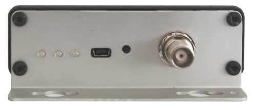

| Element | Description |
|---------|-------------|
| Operation light indicators | Status LEDs on the front panel |
| Antenna port | RF antenna connector |
| Output port RS232 | Serial data output |
| MCI Bus | MCI bus connector |

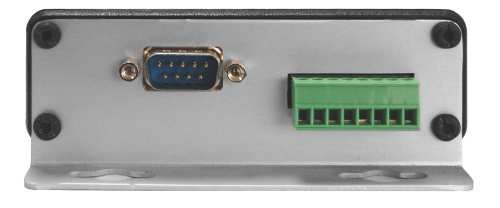

The USB port and RESET button are located on the rear panel. \* Designation of MCI bus contact terminals is indicated in Table 3.

**Table 3.**

| Terminal | Purpose |
|----------|---------|
| PGM2 | Predefined for further use |
| PGM1 | Predefined for further use |
| IN2 | 2nd input (AC fail) |
| IN1 | 1st input (tamper) |
| GND | General conductor |
| MCI | MCI bus |
| GND | General conductor for power supply connection |
| +E | For supply voltage +12,6 V connection |

## Light indication

Receiver operation is shown by light indication. Operation of light indicators is specified in Table 4.

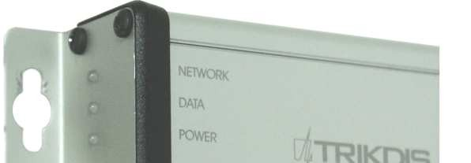

**Table 4.**

| Indicator | Operation | Description |
|-----------|-----------|-------------|
| „Network" | Blinking green | Message receiving via radio channel |
| „Network" | Lighting yellow | Background level of communication channel is exceeded |
| "Data" | Lighting green | Unsent messages are still present |
| "Data" | Lighting green and red simultaneously | Output buffer is overfilled |
| „Power" | Blinking green | Supply voltage is sufficient |
| „Power" | Blinking yellow | Supply voltage is low (below 11,5 V) |
| „Power" | Blinking green and red successively | The only USB port is connected for programming |

## Preparing receiver for operation

Sequence of preparation:

1. Set the required device operating parameters. Radio receivers with settings adjusted under the requirements agreed in a procurement order are provided to the users;
2. Install the receiver in the designated location;
3. Connect the antenna;
4. Connect power supply and peripherals (monitoring software or transmission modules);
5. Check the receiver for operation.

## Setting of operating parameters

Setting of operating parameters is executed by the parameter setting software R11config v130226, having connected the computer and receiver by USB cable. Usage of software and change of settings is available both at external power supply activated and at powering via USB port.

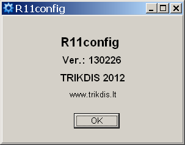

Run the software R11config and the window will open where:

1. Enter Admin password 1234 using the computer keyboard and click [Enter]

    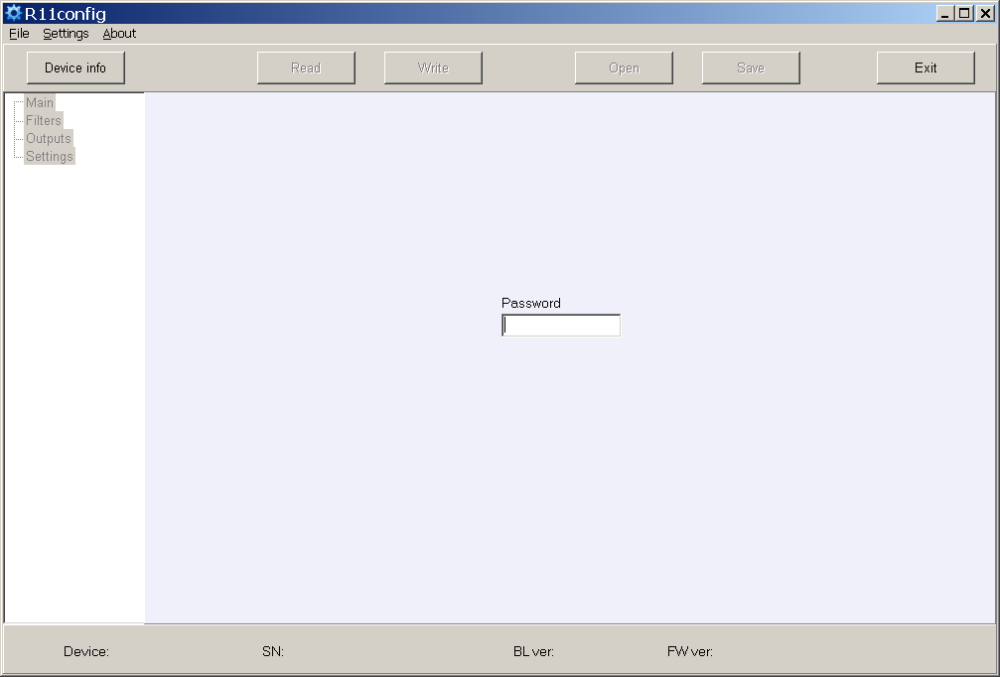

    At the bottom of the window are displayed: equipment type **Device**, serial number **SN**, boot loader version **BL ver.**, firmware version **FW ver.**

    If password is unknown, information about receiver's type and software / firmware versions will be displayed after clicking [Device info].

    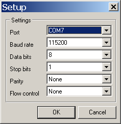 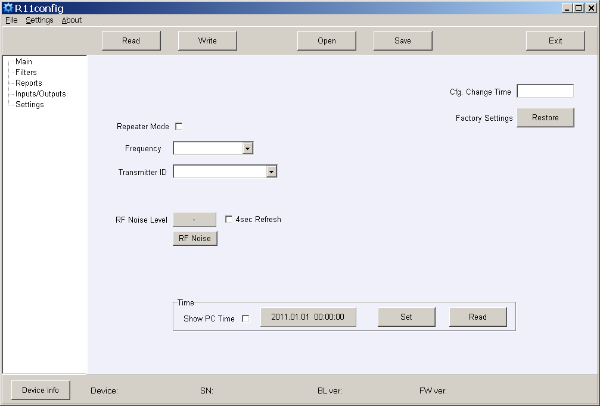

    USB port settings in the column **Settings**.

2. Scan the receiver parameters by clicking [Read].

3. Set (Repeater mode), (Frequency) and (Transmitter ID) in the program branch **Main**. Having selected Account ID, messages will be allocated by transmitter object number, having selected Transmitter SN – transmitter serial number, having selected Transmitter SN+ Account ID – by both numbers.

    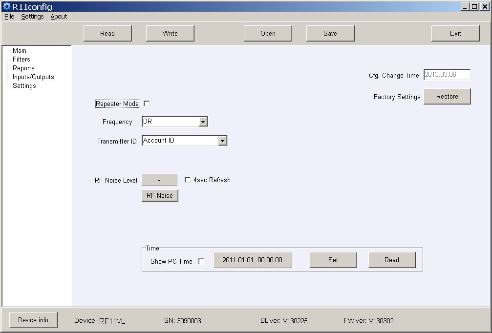

4. Set the required filter parameters in the program branch **Filters**.

    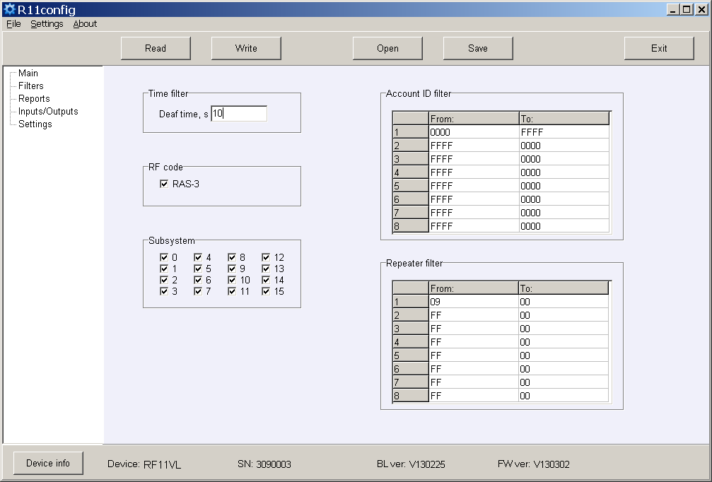

    - **Time filter** – tolerance time for the same message;
    - **RF code** – tick the checkbox of message reception of the coding system RAS-3;
    - **Subsystem** – tick the checkbox of required subsystem reception;
    - **Account ID filter** – sequences of receiving object numbers;
    - **Repeater filter** – sequences of required repeater numbers.

5. Set the parameters of output to the monitoring software or transmission modules in the program branch **Reports**.

    a) When messages transmitted to the monitoring software Monas MS:

    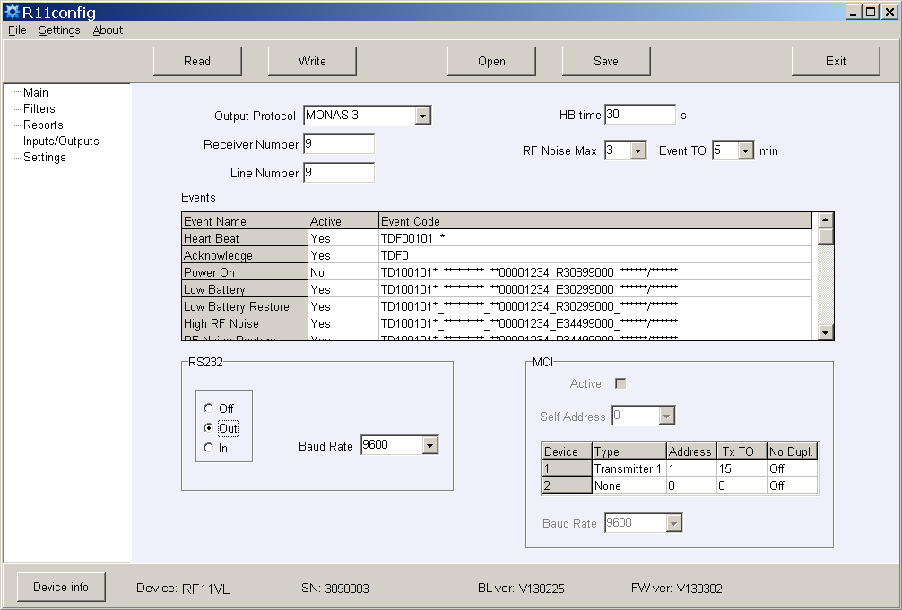

    Set the Out Protocol, Receiver Number and Line number, HB time and Baud Rate for RS232.

    b) Set those service messages which will be sent. Tick them in the checkbox **Active**. Enter the required subscription number of the receiver number and event codes. The recommended event codes are specified in Attachment B.

    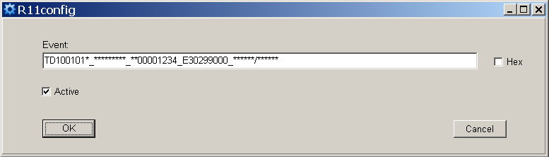

    c) When messages transmitted to the transmission modules (Repeater Mode):

    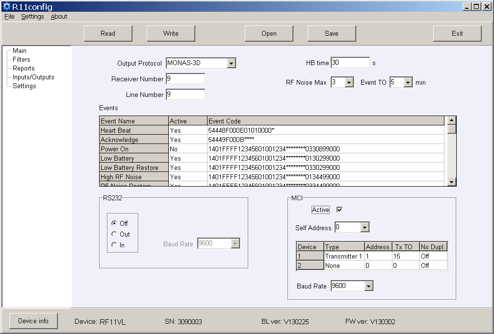

    Set the Out Protocol, Receiver Number and Line Number, tick the checkbox **Active** for MCI bus enabling, and set Baud Rate. Specify the Self Address the numerical value of which should be lower than the value of connecting transmission modules.

    d) Specify the sequence of transmission modules, addresses, answer waiting time **Ack TO**, sending delay (if any) **Tx TO** and ignoring of re-transmitted messages **No Dupl**.

    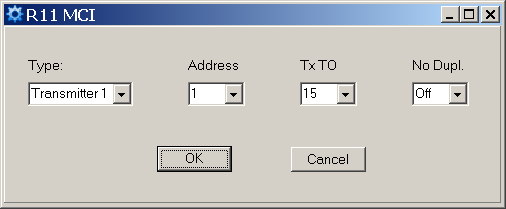

    Sending delay Tx TO is applied for sent signal delaying in the radio system. Numerical value repeatable 250 ms.

    Ignoring of re-transmitted messages No Dupl. is to be turned on when several radio repeaters are operating in the system and it is necessary to reduce the number of messages sent via channel (solution of radio channel occupancy problem).

6. Set the input operating parameters and event codes in the program branch **Inputs/Outputs**.

    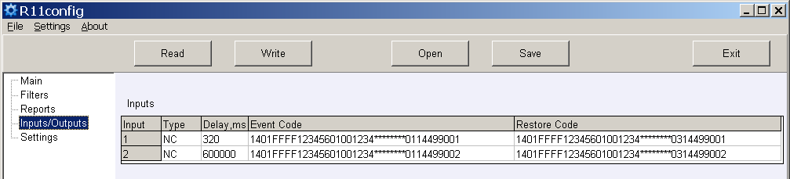

    - **Input Type** – specify the input type;
    - **Delay** – specify the input response time;
    - **Event Code** – event code and sending object number after input actuation;
    - **Restore Code** – event code and sending object number after input restoration.

    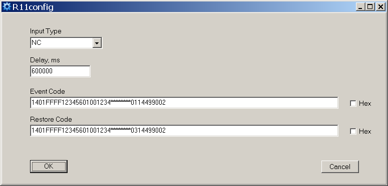

7. New frequencies may be entered or the existing ones deleted in the program branch **Settings**.

    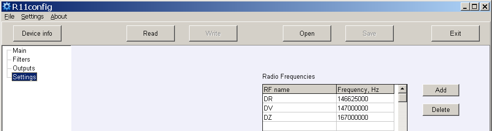

    Receiver settings, having their storage location indicated in the computer memory, may be stored by clicking the button [Save], and later on they can be used for parameter setup of other receivers. Stored settings may be prompted by clicking [Open] and indicating data storage location.

    Click [Exit] to exit from the parameter setting software.

## Attachment A — Receiver output signal in the serial port RS232

**a) When the following Monas3 output protocol is set:**

```
TD1001017_***010532_3D025218_E13002027_120514/153241
```

where:

- `TD` – symbol of start
- `10` – message type/subtype (Contact ID)
- `01` – receiver number 01
- `01` – line number 01
- `7` – signal level 7
- `**` – repeater number (direct reception)
- `*` – level in repeater (none)
- `010532` – transmitter No. 010532
- `3D` – message No. (from object No. 010532) 61 (3D hex)
- `025218` – subsystem 02 / Account ID 5218
- `E13002027` – Contact ID data
- `12` – year 12, `05` – month 05, `14` – day 14
- `15` – hour 15, `32` – minute 32, `41` – second 41

**b) When the following Surgard MLR2-DG output protocol is set:**

```
5011 181234E14401002
```

where:

- `5` – message type
- `01` – receiver number
- `1` – line number
- `18` – protocol type
- `1234` – object number
- `E` – CID classifier
- `144` – CID event code
- `01` – CID subgroup number
- `002` – CID event location

## Attachment B — Recommended event codes of service messages

**R11 event code format:**

```
1401FFFF12345601001234********0330199000
```

where `1234` = object number (8191), `03` = event/restore, `301` = event code, `99` = subgroup, `000` = location.

| Event | RAS-3D code | ECID | Note |
|-------|-------------|------|------|
| Power ON | 0330199000 | R301 99 000 | do not send |
| Low Battery | 0130299000 | E302 99 000 | send |
| Low Battery Restore | 0330299000 | R302 99 000 | send |
| High RF Noise | 0135599000 | E355 99 000 | send |
| RF Noise Restore | 0335599000 | R355 99 000 | send |
| Cfg. Change | 0362899000 | R628 99 000 | send |
| Time fault | 0170099000 | E700 99 000 | do not send |
| Time Set | 0370099000 | R700 99 000 | do not send |
| MCI Error | 0171299000 | E712 99 000 | do not send |
| MCI Restore | 0371299000 | R712 99 000 | do not send |
| RS232 Error | 0171399000 | E713 99 000 | do not send |
| RS232 Restore | 0371399000 | R713 99 000 | do not send |
| CRC Error | 0130799000 | E307 99 000 | do not send |
| Transmitter PING | — | E770 99 00X (x = next PING period) | do not send |
