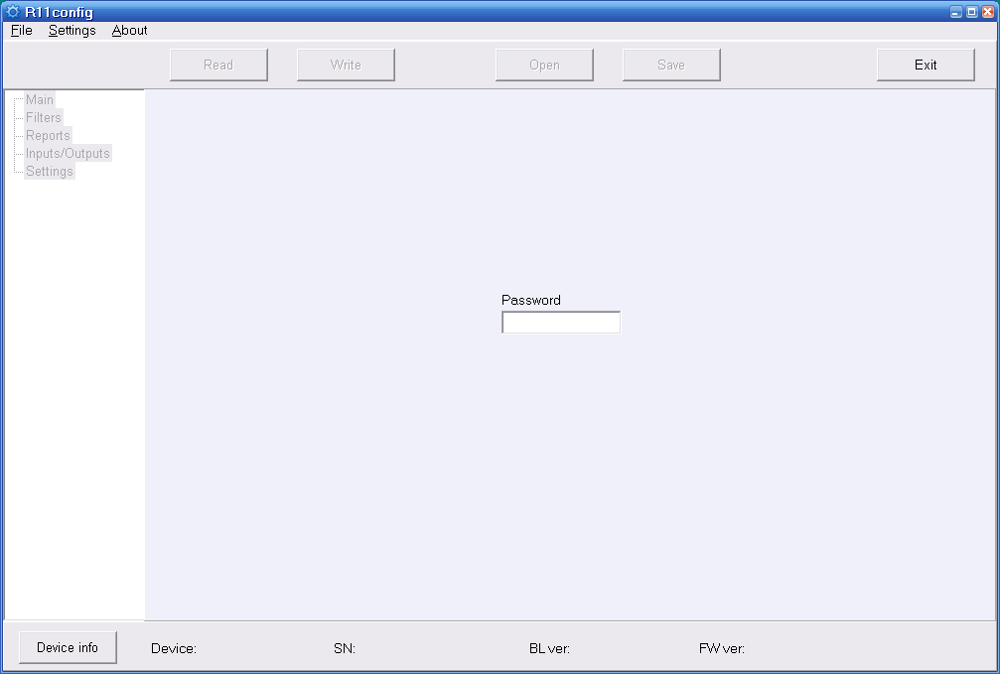
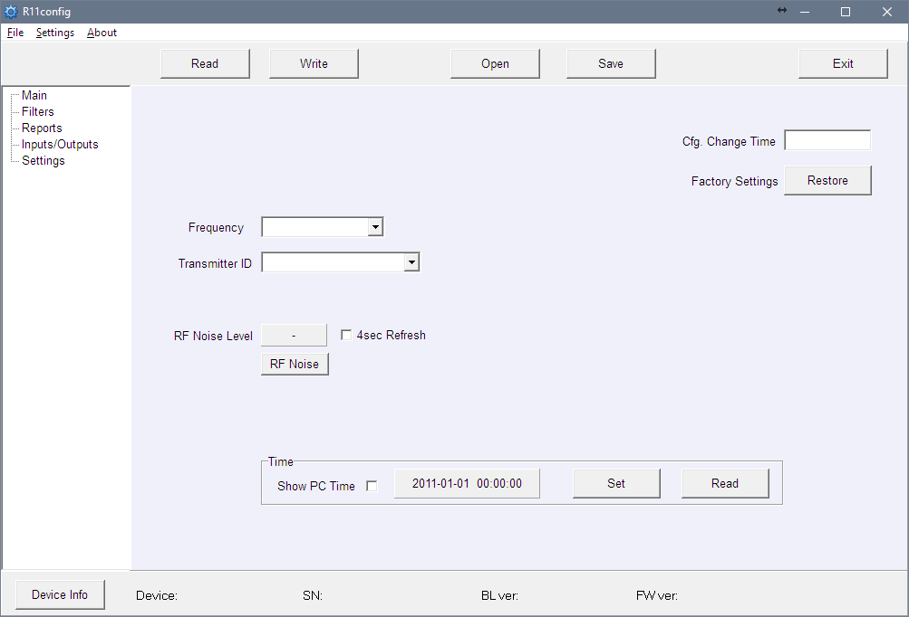
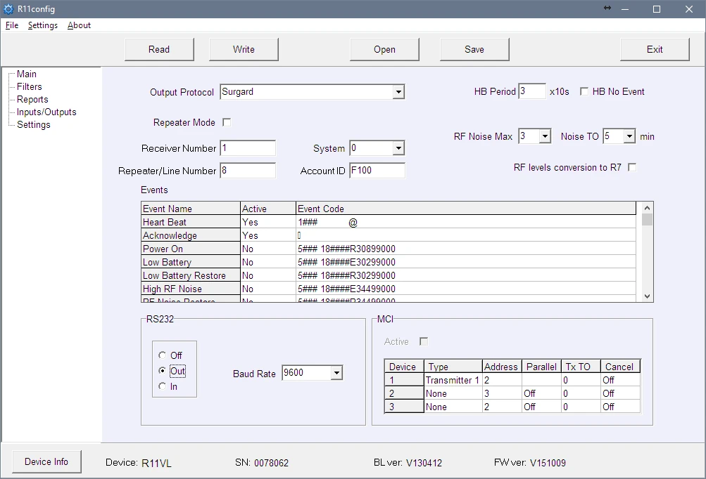
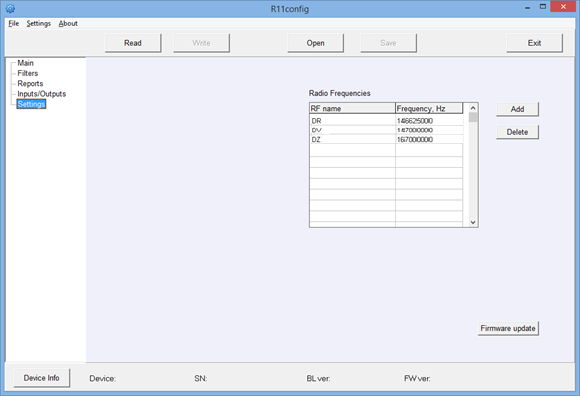

# RFH11 Radio Receiver

  

## About Radio Receiver

**Radio receiver RFH11** is a receiver designed to receive encoded radio messages at the frequency range VHF or UHF. The integrated module works with RAS3, RAS2M, LARS, LARS1, Milcol-D encoding systems.

The receiver has programmable filters, enabling filtering of the messages according to:

- Message repetition interval
- Subsystems of encoding system
- Communication route
- Sequence of account numbers

> **Note:** We configure the receiver with preset settings on client's request.

## Main Technical Parameters

| Name | Description |
|------|-------------|
| Operating frequency range | 146 – 174 MHz (VHF) or 430 – 470 MHz (UHF) |
| Separation of channels | 12.5 kHz |
| Frequency setting error | not more than ± 200 Hz |
| Sensitivity | Not lower than 0.5 μV |
| Modulation | FFSK/FSK |
| Decoded formats | RAS-3, RAS-2M, LARS, LARS-1, Milcold-D |
| Output formats | Monas3 and Surgard |
| Storage of message | 300 last received messages |
| Primary power supply | 100 – 240 V (50 / 60 Hz) AC network |
| RS232 data output ports | 1 x DB9 |
| Operating temperature | From 0°C to +55°C |
| Dimensions | 225 x 235 x 115 mm |
| Weight | 1.21 kg, with cables |

## Receiver Assemblies

| Item | Quantity |
|------|----------|
| Receiver | 1 pc. |
| 1.5 m AC power supply cable | 1 pc. |
| 1.8 m R232 Null Modem cable | 1 pc. |

> **Note:** *USB* cable for receiver programming is not included.

## Power Supply

The receiver is powered with the alternating current (AC) source. To ensure an uninterrupted operation the receiver should be connected to a 12 V, 7Ah battery, providing backup power supply for 12 hours.

## Receiver Structure

| No. | Element | No. | Element |
|-----|---------|-----|---------|
| 1 | Light indication | 5 | RS232 data output port |
| 2 | USB connection port | 6 | Backup battery connection |
| 3 | RESET button | 7 | Power supply connector and power on/off button |
| 4 | Antenna connector | | |

### Light Indication

| LED Indicator | Operation | Value |
|---------------|-----------|-------|
| "Power" | Flashing green LED | Supply voltage is sufficient |
| "Power" | Flashing yellow LED | Supply voltage is low (below 11.5 V) |
| "Power" | Flashes green and red one after another | Power is supplied only through USB (while configuration is in process) |
| "Netw." | Flashing green LED | Receiving message |
| "Netw." | Lighting yellow LED | Exceeded RF noise level |
| "Data" | Green LED | There are unsent messages |
| "Data" | Lighting green and red simultaneously | Output buffer is overfilled |

## System Installation

### Equipment Installation Steps

> **Note:** To set the parameters you will need R11config software. Ask your distributor to get this software.

1. If received device does not have preset exploitation parameters, please set them as described in **Setting of operating parameters with R11config** below.
2. Connect RFH11 with computer using RS232 cable to forward events to the monitoring software.
3. Set up your monitoring software to display receiver messages. Please follow instructions in your monitoring software documentation.
4. Connect radio antenna to the antenna port.
5. Connect the receiver to power supply with the power supply cable.
6. Turn on the receiver. Flashing green LED indicates that the receiver is connected to power.
7. Check if your monitoring software is displaying messages from the RFH11 receiver.

**If nothing was received:** check the color of LED *"POWER"* and make sure that all power supply connections are properly connected. If problem persists, please make sure that exploitation parameters are set correctly or contact technical support.

### Setting of Operating Parameters with R11config

1. Connect the receiver to computer with USB cable and run the program R11config (You should get this program from your distributor).

   1.1. In opened window enter Admin password **1234** and click [Enter].

> **Note:** If password is unknown, you can find receiver's type and software/firmware version by clicking [Device info].

> **Note:** **USB drivers must be installed in the computer.** If the receiver is connected to a computer for the first time, MS Windows OS should open the window *Found New Hardware Wizard* for installing USB drivers. Download the USB driver file *\*.inf* for your MS Windows OS from the website [http://www.trikdis.com/en/](http://www.trikdis.com/en/). In the wizard window select the function *Yes, this time only* and press the button *Next*. When the window *Please choose your search and installation options* opens, press the button *Browse* and select the place where the file *\*.inf* was saved. Follow the remaining wizard instructions to finish the USB driver installation.

2. Select the program directory [Settings], then [COM port] in the drop-down list [COM Port], and then select the port to which the module is connected.

> **Note:** Specific port to which the device is connected will appear only after the device is properly connected.

**Settings in branch Main:**

3. Read the receiver parameters by clicking [Read].
4. Set [Frequency] and [Transmitter ID] in the program branch Main.
5. In the [Transmitter ID] drop-down list you can choose according to what transmitter will be identified by receiver:

   - **Account ID** – programmed Account ID number will identify transmitter.
   - **Transmitter SN** – unique serial number will identify transmitter.
   - **Transmitter SN + Account ID** – transmitter will be identified by both (Transmitter SN and Account ID) numbers.

> **Note:** [Transmitter ID] parameter should be set identically in all radio transmitters.

**Settings in branch Filters:**

- [Time filter] – time period in which the same message will be rejected (recommended time is 90 seconds).
- [RF Coding/Subsystem Filter] – double click on the table, select the required radio coding systems (RAS3, RAS2M, LARS, LARS1, Milcol-D) and mark subsystems allowed for receiving.
- [Account ID filter] – enter ranges (From which – To which) of transmitter Account ID numbers, allowed for receiving.
- [Repeater filter] – enter ranges (From which – To which) of repeater numbers allowed for receiving.

**Settings in branch Reports:**

Setting output parameters for the monitoring software or transmission modules:

6. Set output protocol:

   6.1. When using MonasMS monitoring software set the [Output protocol] to *Monas3*. Otherwise, select Surgard or Ademco protocol.

   6.2. Uncheck [Repeater Mode].

   6.3. Set following required parameters: [Receiver Number], [Line number], [System], [Account ID], [HB Period] and [Baud Rate] for RS232.

7. Select which service messages will be sent:

   7.1. Double click on the recording row in the table [Events]. Tick the checkbox [Active] if event code should be sent. The recommended event codes are specified in Attachment A.

**Settings in branch Settings:**

8. New frequencies may be entered or the existing ones deleted. Later these frequencies will be available in branch Main.

9. All settings can be saved by clicking [Save] button. It can be used later as a template to configure other modules. To open them click [Open] and indicate location. To exit program press [Exit].

## Attachment A — Recommended Event Codes of Service Messages

Event code format example:
`1401FFFF 12345601001234********03 301 99 000`

Where:

| Field | Meaning |
|-------|---------|
| 1234 | object number |
| 03 | event/restore |
| 301 | event code |
| 99 | subgroup |
| 000 | location |

| Event | RAS-3D code | ECID code | Recommendation |
|-------|-------------|-----------|----------------|
| Power ON | 0330199000 | R301 99 000 | do not send |
| Low Battery | 0130299000 | E302 99 000 | send |
| Low Battery Restore | 0330299000 | R302 99 000 | send |
| High RF Noise | 0135599000 | E355 99 000 | send |
| RF Noise Restore | 0335599000 | R355 99 000 | send |
| Cfg. Change | 0362899000 | R628 99 000 | send |
| Time fault | 0170099000 | E700 99 000 | do not send |
| Time Set | 0370099000 | R700 99 000 | do not send |
| MCI Error | 0171299000 | E712 99 000 | do not send |
| MCI Restore | 0371299000 | R712 99 000 | do not send |
| RS232 Error | 0171399000 | E713 99 000 | do not send |
| RS232 Restore | 0371399000 | R713 99 000 | do not send |
| CRC Error | 0130799000 | E307 99 000 | do not send |
| Transmitter PING | — | E770 99 00X (X = next PING period) | do not send |
