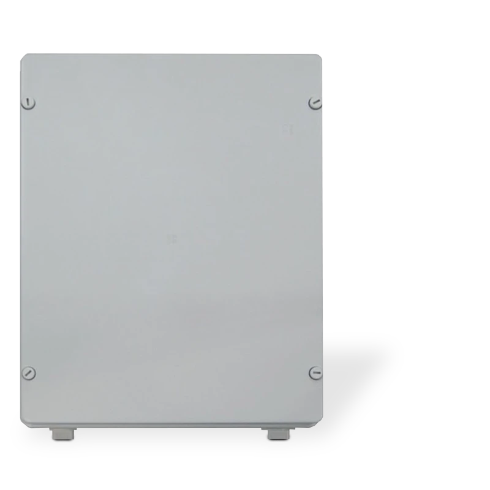
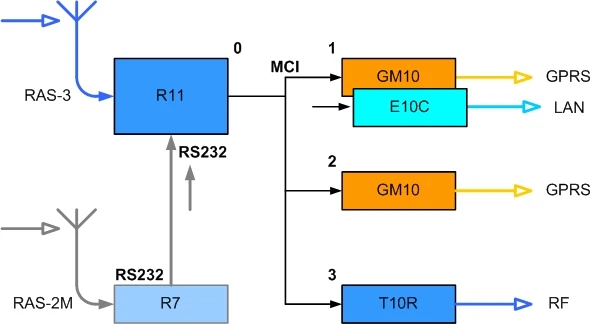

# Repeater R-IP12

  

## Purpose of the Product

The repeater R-IP12 is a multifunctional device of message transmission system designed for repeating of received messages to a centralized monitoring station.

## Key Features

- Repeater configuration is selected considering the task being solved.
- Selection of channels for communication with monitoring station: GPRS / Ethernet / Radio — as needed.
- Messages to monitoring station are sent via main or backup communication channels.

## Scope of Application

The repeater R-IP12 can be applied for:

- Repeating of radio transmitter messages via radio channel.
- Repeating of radio transmitter messages via IP communication channels.
- Repeating of messages of other distant receiving devices via IP channels.

## Principle of Operation

Messages sent from the object equipment are received by a radio receiver or get into a repeater via the serial port RS232. The received messages are filtered and routed to the transmission modules under the parameters set up during configuration.

Transmission to the monitoring station is performed by single or several transmission modules operated via different communication channels. After message reception the transmission module via its own communication channel transmits such message to the monitoring station equipment. Messages are sent in a specified sequence or concurrently if two (or more) transmission modules are used.

Repeater R-IP12 structural diagram is provided in Figure 1.

*Fig. 1. Repeater R-IP12 structural diagram*

Potential options of receiver use and kitting, prepared taking into account the task requirements:

| Option | R11 | GM10 | E10C | T10R | R7 | Rx / Tx |
|--------|:---:|:----:|:----:|:----:|:--:|---------|
| Base_1 | + | + x2 | — | — | — | RAS-3 → GPRS |
| Base_2 | + | + | + | — | — | RAS-3 → GPRS + Ethernet |
| Radio_1 | + | — | — | + | — | RAS-3 → Radio |
| Double radio_1 | + | + x2 | — | — | + | RAS-2M + RAS-3 → GPRS |
| Double radio_2 | + | + | + | — | + | RAS-2M + RAS-3 → GPRS + Ethernet |

!!! note
    The required transmission modules are installed in the repeater during fabrication.

The base options provide sending of radio messages of monitored objects by system RAS-3 encoding, and receiving by the radio receiver R11. The repeater AC voltage control, casing protection and antenna switch control circuits are also connected to its inputs.

The radio option provides sending of radio messages of monitored objects by system RAS-3 encoding, and receiving by the radio receiver R11. Messages are repeated by a single radio transmitter connected. Antenna is connected to the transmitter in the course of sending.

The expanded radio options provide sending of radio messages of monitored objects by system RAS-2M, LARS, LARS1 encodings, and receiving by the radio receiver R11. Information from the receiver R7 is routed to the receiver R11 via the serial port RS232. Any other message receiving unit can be connected to the serial port RS232 instead of the receiver R7, as needed.

Information from the receiver R11 via MCI interface is routed to the transmission modules. Transmission module GM10 operates via GPRS channel, module E10C — Ethernet channel, transmitter T10R — radio channel. Communication with transmission modules is constantly under control. If communication with transmission module is lost, messages are transmitted by the successive module.

Transmission order is set during the repeater configuration. Transmission device indicated as the first one is to be operated first and data are to be transmitted by it. If data sending via the first device fails or if interruption of communication via the first one has been previously detected by the receiver R11, data shall be sent via the second one, or if the latter fails — via the third communication module. Setting of simultaneous (concurrent) sending is available for the selected devices.

Communication with the station equipment is constantly under control when two-way communication modules (GPRS and Ethernet) are applied. For this purpose the transmission modules send special communication test messages PING that are controlled by the monitoring station IP receiver RL14, RM14 (or other similar equipment) which delivers a reception confirmation message. Having communication lost, the module notifies the receiver R11 thereof, which routes messages to the other operating module, and messages are transmitted via other communication channel.

## Specifications

1. The repeater R-IP12 receives radio messages sent by RAS-3, RAS-2M, LARS and LARS1 encoding systems (on the basis of repeater configuration and receiver settings).

2. The receiver R11 of the repeater R-IP12 is equipped with the serial port RS232 for reception of messages transmitted by Surgard MLR2-DG protocol.

3. The receiver R11 of the repeater R-IP12 includes four terminals that can be set as input or output: input type NO/NC, output type — open collector OC, commutating direct voltage up to 30 V and current up to 0.1 A.

4. The repeater is equipped with transmission modules operating via different communication channels:

   - **T10R** is designed for radio message repeating via radio channel. The device operates by RAS-3 encoding, and Monas-3D protocol. Messages can be received by the receivers R11 and RF11.
   - **GM10** is designed for message repeating via GPRS channel. Operates by UDP/IP protocol and TRK_UDP encoding. Messages can be received by the receiver RL10 (or other similar equipment).
   - **E10C** is designed for message repeating via Ethernet channel. Operates by UDP/IP protocol and TRK_UDP encoding. Messages can be received by the receiver RL10 (or other similar equipment).

   Three different transmission modules can be installed with the view of different task solution and kitting options.

5. The repeater is powered by AC mains voltage 230 V with frequency of 50±1 Hz. Power capacity within 60 W. Allowable voltage variation limits from 120 to 250 V.

6. The repeater is powered by back-up 12V battery with at least 7Ah capacitance. Applied currency does not exceed 1.8 A (at maximal kitting option with three transmission modules and two receiving modules). Allowable voltage variation limits from 10.5 to 13.8 V. A battery is charged automatically at AC mains voltage.

7. The repeater operates and maintains indicated parameters at ambient air temperature from -10°C to +55°C, and relative air humidity up to 90% at +20°C.

8. Overall dimensions of the repeater do not exceed 310 x 390 x 130 mm. Weight up to 4 kg.

## Repeater R-IP12 General View and Design

All nodes of the repeater R-IP12 are installed on metal base placed in a plastic casing. General view of the repeater R-IP12 is provided in Figure 2.

The following components are visible with the front cover removed:

- Receiving modules R11 and R7 (at the bottom)
- Back-up battery 12V / 7Ah
- Transmission modules GM10, E10C and T10R
- Casing opening sensor
- Switched mode power supply
- Input of AC mains
- Antenna switch

*Fig. 2. General view of the repeater R-IP12 (front cover removed)*

!!! note
    The quantity of inserted transmission and receiving modules may vary depending on the selected kitting option subject to the provided repeater configuration.

The front cover of casing has hinges and may be completely removed. At operating position the front cover shall be closed and additionally fixed with four screws.

All connecting, antenna and power cables are entered into the repeater through the holes located at the bottom part of the casing.

## Preparation of Repeater

Preparation of the repeater for trading and provision to customer is arranged as follows:

1. Selection of kitting option considering the relevant task.
2. Assembling of the repeater.
3. Configuration of receiving modules and transmission modules in accordance with the requirements.
4. Repeater performance testing and preparation of deliverables.

!!! note
    Deliverables must specify customer's data, repeater kitting option and set parameters of receiving modules and transmission modules.

## Configuration of Repeater

Operating parameters of the repeater are set by parameter setting software for separate nodes. Detailed setting procedure is described in the installation manuals. Parameter setting required for retransmission mode assurance is provided below.

### 1. Setting of the Receiver R11 Parameters

Parameters of the radio receiver R11 are set using parameter setting software R11config. The following must be indicated:

- Repeater mode, operating frequency, identification type
- Message filtering parameters:
  - by ID sequence
  - by encoding systems and subsystems
  - by repeaters' internal numbers
  - Deaf time to the same signal
- Output protocol and exchange parameters, sequence of transmission to sending modules and/or activated receiving via the serial port:
  - List of messages being generated
  - Receiver and line, subsystem and ID numbers displayed in message
  - Output protocol
  - Activated input, exchange protocol and rate
  - Operating sequence of transmission modules connected

### 2. Setting of the Transmission Module GM10 Parameters

The parameters of the transmission module GM10 are set using parameter setting software G10config. The following must be indicated:

- Transmission module identification parameters:
  - Transmission module sequence number
  - Transmission module ID

!!! note
    There cannot be two modules with identical sequence numbers.

- Address of receiving device to which messages are sent:
  - Encryption key
  - Network parameters
  - Reception address

### 3. Setting of the Transmission Module E10C Parameters

The parameters of the transmission module E10C are set using parameter setting software Econfig. The following must be indicated:

- Transmission module identification parameters:
  - Transmission module ID
- Address of receiving device to which messages are sent:
  - Transmission module communication protocol
  - Parameters of network and receiver (inbound sending)
  - Parameters of network (outbound sending)
  - Password
  - Transmission module sequence number
  - Transmission module PING time

### 4. Setting of the Radio Transmitter T10R Parameters

Parameters of the radio transmitter T10R are set using parameter setting software T10config. The following must be indicated:

- Transmission module identification parameters, operating frequency and encoding, message recurrence number:
  - Encoding protocol, module ID, subsystem, operating frequency and output power
  - Message recurrence number in the repeater = 1
- MCI interface parameters and module sequence number:
  - Activate MCI, sequence number and repeater internal number

### 5. Setting of the Receiver R7 Parameters

Parameters of the radio receiver R7 are set using parameter setting software Hyper Terminal. The following must be indicated:

- Specified operating frequency, encoding and message filtering parameters
- Set output protocol Surgard MLR2-DG
- Specified receiver and line numbers

!!! note
    Parameters of other receiving devices are set using the equipment indicated in the installation manuals of such devices.

## Installation of Repeater

Site for the receiver installation shall be selected considering receiver's purpose, regional terrain features and size, and assessing protection against potential illegal intrusion. The repeater shall be installed in nonresidential premises, in places of limited and sophisticated access. The repeater shall be mounted on a vertical wall in a room (which may be without heating).

To avoid injuries (caused by heat or power voltage impact) and ensure reliable long-lasting performance of the repeater it is necessary to observe safety regulations.

The recommended installation sequence is as follows:

1. Radio antennas shall be installed at the height of 20–30 m above ground surface, and cable shall be laid towards the repeater. It is reasonable to use separate antennas for receiving and transmission. Coaxial cable with low attenuation should be used for coupling the repeater and antenna. RG213 cable or better one is recommended. Erect the mast, mount the antenna, connect coaxial cable and check for antenna compatibility to operating frequency. Standing wave ratio should be not higher than 1.5.

2. Fix the repeater to the vertical wall. Location of repeater case mounting hole and dimensions are indicated on the device package. The repeater is fixed with four screws. AC mains cables and antenna cables shall be connected after the repeater is fixed.

3. Take out the input fuse of receiver's AC mains and connect wires of AC mains as well as earthing to the contacts of alternating voltage. Description of contacts of terminal block is provided in Attachment A. Phase cable shall be connected to the terminal protected by fuse. Carefully fix the power cable from AC mains.

4. For application of GPRS transmission modules GM10, insert SIM cards into them. SIM card and payment plan must allow data sending via GPRS channel by UDP protocol. SIM card PIN code prompt should be disabled.

5. For application of Ethernet transmission modules E10C, connect Ethernet network cable. Applied network settings should be already known and entered in the modules.

6. For application of radio transmitter T10R, connect antenna cable to the central antenna switch port (or transmitter antenna port in case of separate antennas for receiving and transmission).

7. Insert the charged battery and connect red wire to battery terminal "+", and black wire to battery terminal "−".

!!! note
    Light indicators of power supply / functioning of R-IP12 devices are blinking when power supply is on.

8. Insert AC mains fuse for the repeater and switch power supply from AC mains on.

During power supply activation (or after clicking RESET button of the receiver R11) the status of inputs of the receiver R11 are checked and initial messages are sent. Within 1–2 min. all messages are sent and the repeater is ready to repeat messages.

The recommendation is to set current time of the receiver R11.

## Communication Testing

Communication with centralized monitoring station shall be tested after complete installation of the repeater. For the above purpose:

1. Check if the monitoring station receives PING messages of GPRS and Ethernet transmission modules.
2. Check if the monitoring station receives messages sent by radio transmitter.
3. Check if the monitoring station receives messages by pressing and releasing the repeater casing protection sensor.
4. Generate signals of a separate object-related transmitter and check for their reception at the monitoring station. Check for all combinations available in case the repeater receives signals of several encodings or frequencies.

!!! note
    The same messages transmitted by different channels differ among themselves and must be properly described in the monitoring software.

Repeater is deemed adequately installed if all messages sent are properly received at the monitoring station.

## Attachment A — Purpose of Main Supply Block Terminals

AC network connecting cable must be double insulated, thickness of wires at least 0.75 mm² of cross-section area. Cable must include green-yellow protective earth lead.

| Wiring color | Description |
|--------------|-------------|
| Yellow / green | Earth terminal |
| Brown | Phase AC network terminal |
| Blue | Neutral AC network terminal |
