# Comunicador celular G16

  

## Descripción

La función del Comunicador G16 es de mejorar los paneles de control compatibles contra intrusos para la señalización de eventos y control va través de un celular con red 2G/3G.

El comunicador transmite información de eventos completos al Central de Monitoreo.

El comunicador también funciona con la aplicación Protegus. Con Protegus, los usuarios pueden controlar el sistema de alarma de forma remota y obtener notificaciones de cualquier evento de seguridad. La app de Protegus es compatible con todos los paneles de control de varios fabricantes que son soportados por el comunicador G16. El comunicador puede transmitir notificaciones de eventos al Central de Monitoreo y trabajar de forma simultanea con Protegus.

El Comunicador G16 se puede conectar directamente con los paneles de control DSC®, Paradox®, UTC Interlogix® (CADDX), Innerrange®, Texecom®, Honeywell®, Crow® and Pyronix®. Para paneles de otros fabricantes utilice el comunicador G16T.

**Características**

Envía eventos al receptor en una CRA:

- Envía eventos a los receptores de hardware o software TRIKDIS que funcionan con cualquier software de monitoreo.

- Puede enviar información de eventos a SIA DC-09 receptores.

- Puede enviar información de eventos a SUR-GARD receptores. El anexo contiene tabla de conversión de los códigos (Contacto ID a SIA).

- Supervisión de la conexión mediante sondeo al receptor de IP cada 30 segundos (o por período definido por el usuario).

- Canal de respaldo, que se utilizará si se pierde la conexión con el canal primario.

- El informe de eventos a través de mensajes SMS. Los mensajes se entregan incluso si la conexión de datos deja de funcionar en la red del operador móvil.

- Con canales de comunicación paralelos se pueden enviar eventos a dos receptores al mismo tiempo.

- Cuando el servicio Protegus está habilitado, los eventos se envían primero a CRA, y solo luego se envían a los usuarios de la aplicación.

Funciona con la aplicación Protegus:

- Notificaciones de sonidos especiales y "Push" que informan sobre eventos.

- Armado/Desarmado de forma remota.

- Control remoto de dispositivos conectados (luces, portones/barreras, sistemas de ventilación, calefacción, aspersores, etc.).

- Monitorización remota de la temperatura (con los expansores iO y iO-WL).

- Diferentes derechos de usuario para administrador, instalador y usuario.

**Informes a los usuarios finales:**

- Los usuarios pueden ser informados sobre eventos no solo con aplicación Protegus, sino también con mensajes SMS y una llamada.

**Salidas y entradas controlables:**

- 2 salida, controlado a través de:

  - Protegus para móviles / web.

  - Mensaje SMS.

- 1 entradas, tipo seleccionable: NC; NO; NC / EOL; NO / EOL; NC / DEOL; NO / DEOL.

- Añada controlable entradas y salidas adicionales con expansores iO cableados e inalámbricos.

**Configuración rápida:**

- Las configuraciones pueden guardarse en un archivo y escribirse rápidamente en otros comunicadores.

- Dos niveles de acceso para configurar el dispositivo para el administrador de CRA y para el instalador

### Lista de paneles de Control compatibles

| Fabricante | Modelo |
|------------|--------|
| DSC® | <u>PC585</u>, PC1404, <u>PC1565</u>, <u>PC1616</u>, <u>PC1832</u>, <u>PC1864</u>, PC5015, PC5020 |
| PARADOX® | <u>SPECTRA SP4000</u>, <u>SP5500</u>, <u>SP6000</u>, <u>SP7000</u>, <u>SP65</u> |
| PARADOX® | <u>MAGELLAN MG5000</u>, <u>MG5050</u>, <u>MG5050E</u> |
| PARADOX® | <u>DIGIPLEX EVO48</u>, <u>EVO192</u>, <u>EVOHD</u>, NE96, EVO96 |
| PARADOX® | SPECTRA 1727, 1728, 1738 |
| PARADOX® | ESPRIT E55, 728ULT, 738ULT |
| UTC Interlogix® | <u>NetworX (Caddx) NX-4v2</u>, <u>NX-6v2</u>, <u>NX-8v2</u>, <u>NX-8e</u> |
| Texecom® | Premier 412, 816, 832, 832+ /​ <u>Premier 24</u>, <u>48</u>, <u>88</u>, <u>168</u> /​ <u>Premier Elite 12</u>, <u>24</u>, <u>48</u>, <u>64</u>, <u>88</u>, <u>168</u> |
| Pyronix® | MATRIX 424, MATRIX 832, MATRIX 832+, MATRIX 6, MATRIX 816 |
| Innerrange® | Inception, Integriti |
| Honeywell® | <u>Ademco Vista-15</u>, <u>Ademco Vista-20</u>, <u>Ademco Vista-48</u> |
| Crow® | Runner 4/​8, Runner 8/​16 |

\* **<u>Subrayado</u>** - paneles de control controlados directamente por G16. Paneles de control Paradox, que se controlan directamente, debe contener la versión de firmware V.4 o superior.

\* conéctese con paneles de control de otros fabricantes con el comunicador G16T.

### Tipos de Comunicador

Este manual aplica para estos modelos G16:

- G16_321x, communicador G16, 2G módem, 1 SIM.

- G16_331x, communicador G16, 3G módem, 1 SIM.

- G16_341x, communicador G16, 4G módem, 1 SIM.

- G16_3M10, communicador G16, LTE CatM1 & EGPRS módem, 1 SIM.

### Especificaciones

| Parámetro | Descripción |
|----|----|
| Entradas | Un tipo de entrada seleccionable: NC, NO, NC con EOL, NO con EOL, NC con DEOL, NO con DEOL. Expandible con expansores de la serie iO. |
| Salidas | 2, OC tipo, comunicando con 0,15 A, 30 VDC max. Expandible con expansores de la serie iO. |
| Frecuencias del modem GSM | 850 /​ 900 /​ 1800 /​ 1900 MHz |
| Frecuencias del modem 3G | 800 /​ 850 /​ 900 /​ 1900 /​ 2100 MHz |
| Voltaje de la fuente de alimentación | 10-18 V DC |
| Consumo de Energía | 60-100 mA (en modo de espera) /​ Up to 250 mA (mientras envía datos) |
| Protocolos de Transmisión | TRK, DC-09_2007, DC-09_2012, TL150 |
| Encriptación del mensaje | AES 128 |
| Modificación de los ajustes | Con el software de configuración TrikdisConfig de forma remota o local a través del puerto USB Mini-B /​ Remotamente con mensajes SMS |
| Entorno de Operación | Temperatura de -10 °C a 50 °C, humedad relativa - desde 80% a +20 °C |
| Dimensiones del Comunicador | 92 x 65 x 25 mm |
| Peso | 80 g |

### Tablero del Comunicador

1.  Antena GSM conector SMA.

2.  Luces Indicadoras.

3.  Ranura Frontal de Apertura de la Cubierta.

4.  Terminal para conexiones externas.

5.  Puerto USB Mini-B para la programación del comunicador.

6.  Ranura Tarjeta SIM.

### Propósito de las terminales

| Terminal | Descripción |
|----------|-------------|
| +DC | +10 V/​+18 V fuente de alimentación |
| -DC | +10 V/​+18 V fuente de alimentación |
| CLK | Terminal de bus serial para conexión directa al panel de control |
| A 485 | Contacto RS485 para conectar la entrada iO o expansor de salida u otros aditamentos |
| COM | Común (negativo) |
| IN | Entrada |
| OUT1 | 1era salida de recolector abierto |
| OUT2 | 2da salida del recolector abierto |

### LED indicador de operación

| Indicador | Estado de la luz | Descripción |
|-----------|------------------|-------------|
| NETWORK | Off | Sin conexión a la red celular |
| NETWORK | Amarillo parpadeando | Conectándose a la red celular |
| NETWORK | Verde sólido con parpadeo amarillo | El comunicador está conectado a la red celular. / La potencia de la señal celular suficiente para 2G es el nivel 5 (cinco parpadeos amarillos) y para el nivel 3 de 3G (tres parpadeos amarillos) |
| DATA | Off | No hay eventos no enviados |
| DATA | Verde sólido | Los eventos no enviados se almacenan en el búfer |
| DATA | Verde parpadeando | (Modo de configuración) Los datos se transfieren a/desde el comunicador |
| POWER | Off | La fuente de alimentación está apagada o desconectada |
| POWER | Verde sólido | La fuente de alimentación está encendida con suficiente voltaje |
| POWER | Amarillo sólido | La tensión de alimentación es insuficiente (≤11.5V) |
| POWER | Verde sólido y parpadeo amarillo | (Modo de configuración) Comunicador está listo para la configuración |
| POWER | Amarillo sólido | (Modo de configuración) No hay conexión con la computadora |
| TROUBLE | Off | No hay problemas de operación |
| TROUBLE | 1 parpadeo rojo | Tarjeta SIM no encontrada |
| TROUBLE | 2 parpadeos rojos | Problema con el código PIN de la tarjeta SIM (código PIN incorrecto) |
| TROUBLE | 3 parpadeos rojos | Problema de programación (No APN) |
| TROUBLE | 4 parpadeos rojos | Problema con el registro a la red GSM |
| TROUBLE | 5 parpadeos rojos | Problemas con el registro a la red GPRS/UMTS |
| TROUBLE | 6 parpadeos rojos | No hay conexión con el receptor |
| TROUBLE | 7 parpadeos rojos | Conexión perdida con el panel de control |
| TROUBLE | Parpadeo rojo | (Modo de configuración) Fallo de memoria |
| TROUBLE | Rojo sólido | (Modo de configuración) El firmware está dañado |

### Esquema estructural del uso del dispositivo G16

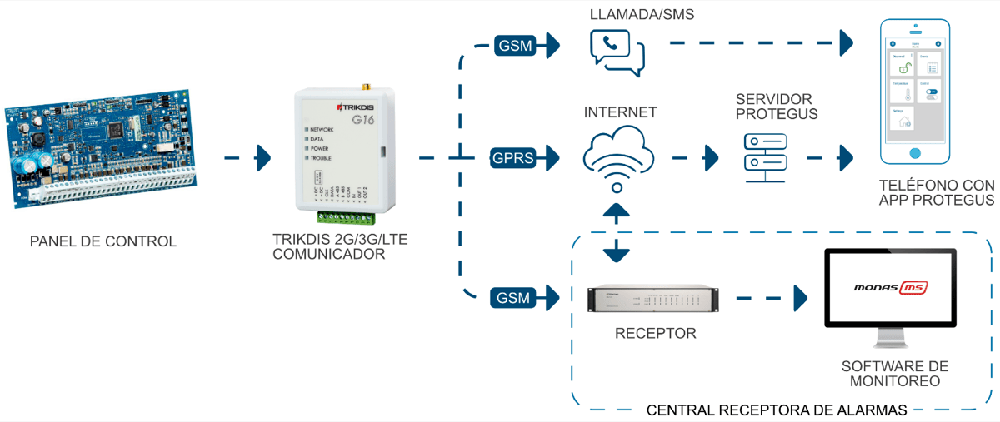

!!! note
    Antes de empezar, asegúrese de tener todo lo necesario:
    
    1.  Cable USB (tipo Mini-B) para la configuración
    
    2.  Por lo menos 4 alambres para conectar el comunicador con el panel de
        control.
    
    3.  Un cable CRP2 para conectarse con el puerto serial del panel de
        Paradox.
    
    4.  Desatornillador de cabeza plana.
    
    5.  Suficiente señal de antena GSM.
    
    6.  Tarjeta SIM activada (la petición por el código PIN puede ser
        desactivada).
    
    7.  Manual de instalación del panel de control de seguridad.
    
    Ordene los componentes necesarios de forma separada de su distribuidor
    local.
## ¿Cómo configurar el comunicador con el software de TrikdisConfig?

1.  Descargue el software de TrikdisConfig de [www.trikdis.com](http://www.trikdis.com) (en la barra de búsqueda ponga TrikdisConfig) e instálelo.

2.  Abra la cubierta del G16 con el desatornillador de cabeza plana como se muestra a continuación:

    

3.  Usando el cable USB mini-B conecte el G16 a la computadora.

4.  Abra el programa de configuración de TrikdisConfig. El software reconocerá de forma automática el comunicador conectado y abrirá una ventana para su configuración.

5.  De clic en Read (F4) para leer la información sobre los parámetros del comunicador e ingrese el código del Administrador o del Instalador en la ventana saliente.

A continuación, habrá una descripción de las opciones que necesitan ser configurados para el comunicador, para que este empiece a enviar notificaciones al CRA y para permitir que el control de seguridad sea controlado por la app de Protegus.

### Opciones de conexión para la app de Protegus

**“En la ventana de “Ajustes del sistema”:**

1\. Seleccione el tipo de panel de control que será conectado al comunicador.

2\. Active Armado/Desarmado Remoto si usted desea que los usuarios puedan tener control del panel en la app de Protegus con su código. Esta opción sólo es mostrada en paneles controlados de forma directa.

3\. Para el control directo de los paneles de Paradox, Texecom, DSC, Caddx ingrese la contraseña de la descarga del panel de su Computadora. Debe ser idéntica a la contraseña que fue ingresada en el panel de control.

!!! note
    Para que funcione el control directo del panel, usted necesitará cambiar
    las opciones del panel. El cómo hacer esto está descrito en el capitulo
    4 "PROGRAMANDO EL PANEL DE ALARMA PARA LEER EVENTOS Y TENER CONTROL
    DIRECTO". En esta sección usted encontrará información de como cambiar
    la contraseña de la descarga de la computadora/UDL.
**Ventana de “Informes para usuario”, pestaña de “Servicio Protegus”:**

1.  Habilitar la conexión a la Servicio Protegus.

2.  Cambie el Código de acceso de la nube para iniciar sesión con Protegus si usted desea que los usuarios requieran ingresarlo cuando se agrega el sistema a la app de Protegus (contraseña por defecto – 123456).

**En la ventana de la “Tarjeta SIM”**

3. Ingrese el número de ID del Objeto

2.  Seleccione tipo de Panel que será conectado al comunicador

Cuando termine con la configuración, de clic en **Escribir [F5]** y desconecte el cable USB.

!!! note
    Para más información sobre otras opciones de G16 en TrikdisConfig
    vea el capitulo 7 de "Descripción de la ventana de TrikdisConfig".
### Configuración para conectarse con el CRA

**En la ventana de “Ajustes del sistema:**

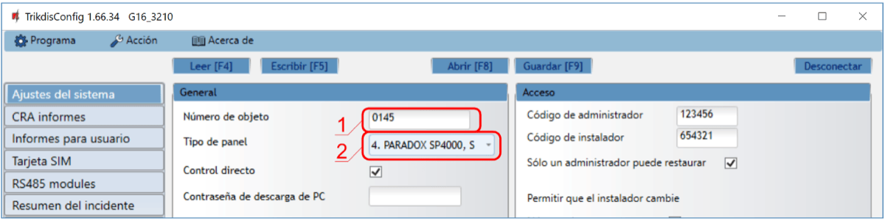

1.  Ingrese el número de ID del objeto (**No utilice números de objeto FFFE, FFFF**.).

2.  Seleccione el tipo de panel que será conectado al comunicador.

En la ventana de opciones de “Ajustes CRA” para el “Canal de cimunicacion principal”:

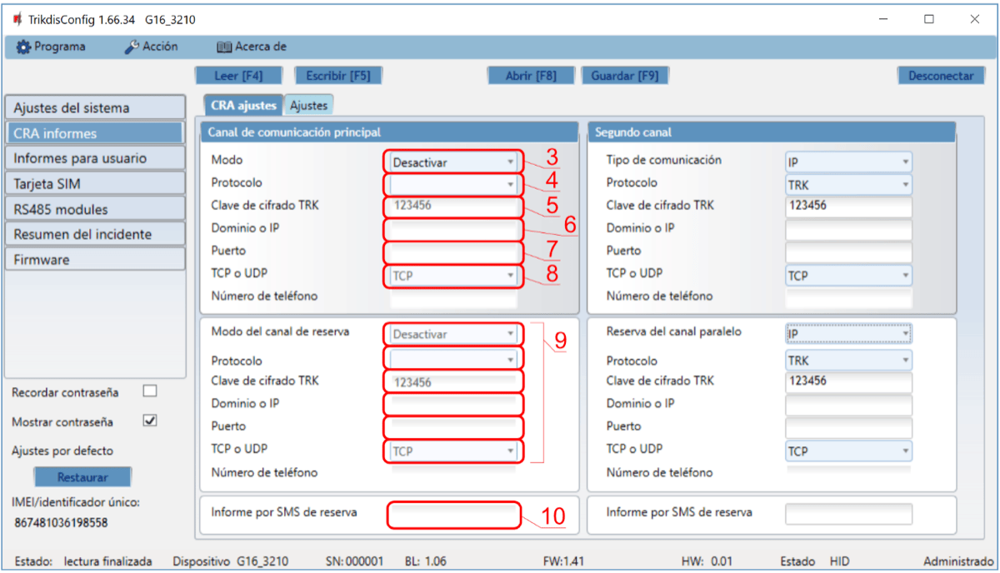

3. **Modo** – seleccione el método de conexión IP (No recomendamos SMS como el canal primario).

2.  **Protocolo** – seleccione el tipo de protocolo para mensajes de evento: **TRK** (para los receptores de TRIKDIS), **DC-09_2007** o **DC-09_2012** (a receptores universales), **TL150** (para los receptores de SUR-GARD).

3.  **Clave de cifrado TRK** – Ingrese la llave de encriptación que está establecida en el receptor.

4.  **Dominio o IP** – ingrese la dirección del dominio o IP del receptor.

5.  **Puerto** – ingrese el número de puerto de la red del receptor.

6.  **TCP o UDP** – elija un protocolo de transmisión de evento (TCP o UDP, en donde se transmitirán los eventos.

!!! note
    Si quiere que la comunicación con CRA sea establecida a través de
    mensajes SMS, sólo necesita establecer la llave de Encriptación y el
    Número de Teléfono. Los mensajes SMS pueden ser recibidos por los
    receptores TRIKDIS, receptor IP/SMS RL14, receptor multicanal RM14 y
    recibidor SMS GM14. / SI usted seleccione el protocolo DC-09,
    adicionalmente en la pestaña de Opciones ingrese los números del objeto,
    línea y receptor.
1.  (Recomendado) Configure las opciones de respaldo del canal primario.

2.  (Recomendado) Ingrese el número de reporte de respaldo del SMS.

**En la ventana de “Tarjeta SIM”:**

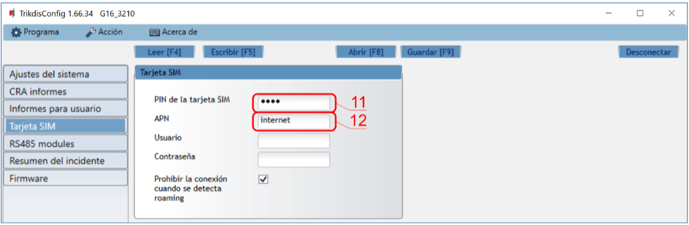

11. Ingrese el código PIN para la tarjeta SIM.

12. Cambie el nombre APN, el APN puede ser encontrado en el sitio del operador de la tarjeta SIM (el “Internet” es universal y funciona en muchas redes de los operadores).

Cuando la configuración esté lista, de clic en **Escribir [F5]** y desconecte el cable USB.

!!! note
    Para más información sobre otras opciones de G16 en TrikdisConfig
    vea el capitulo 7 de "Descripción de la ventana de TrikdisConfig".
## Proceso de Instalación 

1.  Inserte la tarjeta SIM en la ranura:

2.  Remueva el tablero PCB de la parte inferior de la caja. Ajuste la parte inferior en una ubicación aceptable para poder ser atornillada:

3.  Coloque el tablero PCB de vuelta a la caja, inserte la terminal de contacto.

4.  Atornille la antena GSM.

!!! note
    Cheque si la tarjeta SIM ha sido activada. / Asegúrese que el servicio
    de internet móvil se encuentra habilitado (datos móviles) si se conecta
    a través del canal de IP. / Para evitar ingresar el código PIN en
    TrikdisConfig, inserte la tarjeta SIM en su celular y apague la función
    de petición de PIN.
### Diagramas para conectar los paneles de control

Siguiendo uno de estos diagramas provistos a continuación, conecte el comunicador con el panel de control.

1.  Diagrama para conectarse a los paneles de control

2. Diagramas de conexión para control el panel de control a través de la zona de keyswitch:

Siga este esquema si el panel de seguridad será controlado, pero no de forma directa, pero con una salida PGM G16 para prender/apagar la zona de keyswitch del sistema.

El comunicador G16 tiene dos salidas OUT (PGM) programables que pueden controlar dos áreas del sistema de seguridad. Si usted quiere controlar el sistema de esta forma, no seleccione la casilla de Armado/Desarmado remoto en la ventana de “configuración del sistema” de TrikdisConfig.

### Diagramas para la conexión de entrada

El comunicador tiene una terminal de entrada (IN1) para conectar sensores, los cuales pueden operar en modo (NC, NO, EOL, DEOL). Opciones de entrada de la fábrica – NO. Otro tipo de entrada puede ser seleccionada a través de la ventana de configuración de sistema de **TrikdisConfig -> Entrada tipo IN1**.

Conecte la entrada de acuerdo al tipo de entrada seleccionada (NO, NC, EOL o DEOL), como se muestra en los esquemas de abajo:

!!! note
    Si más entradas o salidas necesitan ser conectadas al comunicador,
    conecte el expansor alámbrico o inalámbrico serie iO de TRIKDIS. El
    método de conexión está descrito en el manual de iO.
### Esquemas de cableado de un relé

Con los contactos de relé se puede controlar (encender/ apagar) diversos aparatos electrónicos.

### Esquemas para la conexión de módulos de expansión de la serie de iO

Si es necesario conectar más entradas o salidas al comunicador, o si desea conectar un sensor de temperatura, conecte el expansor de salida inalámbrico o por cable de la serie TRIKDIS iO. Configuración de los módulos expansores conectados al G16 se describe en el capítulo 7.5. “Ventana “RS485 modules”.

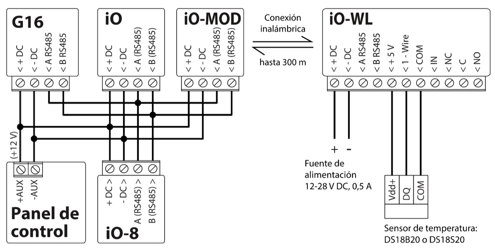

### Esquema para conectar el módulo WiFi W485

El módulo *W485* envía mensajes al CRA (Centro de Recepción de Alarmas) y a Protegus utilizando un enrutador de Internet WiFi. Cuando la conectividad WiFi está disponible, el *G16* envía mensajes de evento a través del módulo *W485*. Cuando se interrumpe la conectividad WiFi, el *G16* envía mensajes a través de GPRS. Cuando se restablece la conectividad WiFi, el *G16* vuelve a enviar mensajes a través de *W485*. / La configuración *W485* (credenciales de red Wi-Fi) se establece en la configuración *G16* en la ventana TrikdisConfig ”RS485 modules” del capítulo 7.5. / Inserte la tarjeta SIM en el comunicador G16 para que funcione el *W485*.

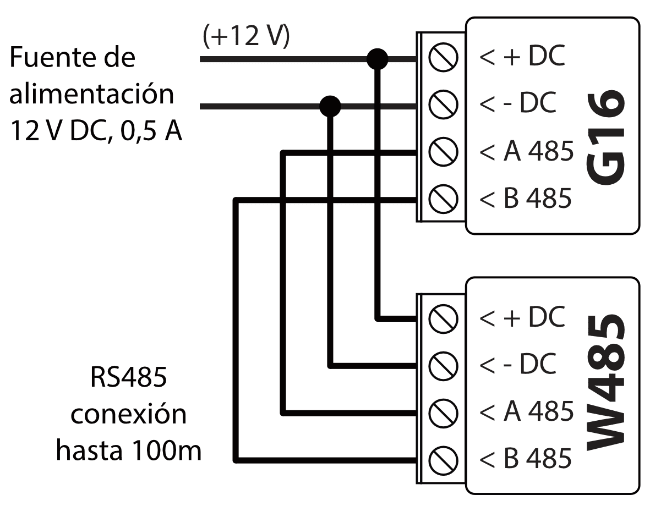

### Esquema para conectar el módulo E485 “Ethernet”

El módulo *E485* envía mensajes al CRA y a *Protegus* por medio de una conexión a internet por cable. Usando el *E485* con *G16*, los mensajes de CRA y *Protegus* se envían a través de internet por cable y no se usa internet móvil. Si se interrumpe una conectividad a internet por cable, el *G16* envía mensajes a través de Internet móvil. Cuando se restablece la conectividad a Internet por cable, el *G16* comienza a enviar mensajes a través de *E485*. / La configuración del módulo *E485* para funcionar con el G16 se describe en la Ventana del capítulo 7.5. „RS485 modules”. / Inserte la tarjeta SIM en el comunicador *G16* para que funcione el *E485*.

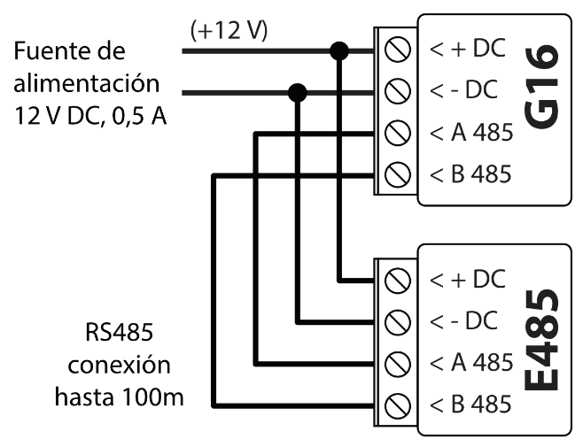

### Cambiando en la fuente de alimentación para el panel de control

Prenda la fuente de alimentación del panel de control. El indicador de luz LED en el comunicador G16 debe mostrar:

- El LED de “POWER” se iluminará de color verde cuando se encuentre prendido;

- El LED de “NETWORK” se iluminará de color verde y parpadeará de color amarilla cuando se registre a una red.

!!! note
    La fuerza necesaria de la señal GSM debe ser de cinco (cinco luces
    indicadoras de color amarillo en donde dice "NETWORK") La fuerza
    suficiente de señal 3G debe ser de tres (la luz indicadora de "NETWORK"
    deberá parpadear de color amarillo tres veces). Si usted ve una
    indicación LED distinta, esto quiere decir que hay algún error.
    Diagnostique y remuévalo siguiendo la información de la sección 1.6
    "Indicación LED de Operación". / Si el G16 no se ilumina por
    ninguna circunstancia, revise la fuente de alimentación y las
    conexiones.
## Programando el panel de alarma para leer eventos y tener control directo

A continuación, se describirá cómo programar los paneles de control para que el comunicador G16 puede leer eventos del panel y pueda controlarlo de forma remota.

Para habilitar el control remoto del panel de control, asegúrese que la casilla de Armado/Desarmado Remoto se encuentre seleccionada en la ventana de “configuración del sistema” de TrikdisConfig.

### DSC

Los paneles DSC no necesitan ser programados.

### PARADOX

Los paneles de control de Paradox necesitan ser programados sólo para control directo con Protegus. No necesita programar los paneles de Paradox para que puedan leer eventos.

Para el control remoto de los paneles de Paradox, usted necesita establecer la contraseña de descarga de la computadora. Esta contraseña debe ser igual a la contraseña que fue establecida en la ventana de “configuración del sistema” de TrikdisConfig, cuando la casilla a un lado de Armado/Desarmado Remoto fue seleccionada.

Para establecer esta contraseña, con el teclado conectado al panel de control:

- Para las series MAGELLAN, SPECTRA: vaya a la celda 911 e ingrese la contraseña de cuatro dígitos de la descarga de computadora.

- Para las series DIGIPLEX EVO: vaya a la celda 3012 e ingrese la contraseña de cuatro dígitos de la descarga de computadora.

### TEXECOM

Los paneles de control de Texecom necesitan ser programados para leer eventos y tener control remoto.

Usted necesita establecer el código UDL del panel de Texecom. Esta contraseña debe ser igual a ala contraseña que fue establecida en la ventana de “Ajustes del sistema”, cuando la casilla a un lado de Armado/Desarmado remoto fue seleccionada.

El panel de control puede ser programado con el software de Texecom – Wintex. Ingrese el código UDL (4-digitos) en la ventana de Opción de Comunicación, en la pestaña de Opciones.

También, puede programar con el teclado conectado al panel de control:

1.  Ingrese el código de 4-digitos del instalador y presione el botón de [Menu} para entrar al menú de programación.

2.  Presione el [9] inmediatamente después de esto.

3.  Presione [7][6], y luego [2]. Ingrese el código UDL de 4-digitos (el código UDL debe ser igual a la contraseña de inicio de sesión de la computadora para el comunicador G16).

4.  Presione [Yes] y salgase del modo de programación presionando [Menu].

### UTC INTERLOGIX (CADDX)

Con el teclado conectado al panel de control:

1)  Presione [\*][8] e ingrese el código del instalador (por defecto es – 9713).

2)  Ingrese el número del dispositivo asignado al comunicador conectado (por defecto – 0)

3)  Establezca la configuración de abajo para cada fila. En secuencia, presione la posición, número del segmento e ingrese la configuración requerida. Si da clic [\*][asterisco] usted regresará al campo de entrada local.

| Posición | Segmento | Configuración |
|----------|----------|---------------|
| 23 | 3 | 12345678 |
| 37 (no es necesario) | 3 | 12345678 |
| 37 (no es necesario) | 4 | 1234567* |
| 90 | 3 | 12345678 |
| 93 | 3 | 12345678 |
| 96 | 3 | 12345678 |
| 99 | 3 | 12345678 |
| 102 | 3 | 12345678 |
| 105 | 3 | 12345678 |
| 108 | 3 | 12345678 |

Después de haber programado todos los campos enlistados, presione [Exit] dos veces para salir del modo de programación.

### INNERRANGE

La versión del panel de control de **Innerrange Inception** debe ser el **2.3.0.3507-r0** o mayor.

El panel de control debe estar conectado al internet. Conéctese con Innerrange Inception al ingresar en: <https://skytunnel.com.au/inception/SERIALNUMBER>, donde el NÚMERO SERIAL es el número del controlador que podrá encontrar en la cubierta del panel.

Abra la ventana de Configuración > General > Reporte de Alarmas. En la configuración de Reporte de Dispositivos de Terceras partes usted necesita ingresar:

1.  Habilitar Reporte de Dispositivos de Terceras partes – seleccione esta casilla.

2.  Tipo de Dispositivo de Terceras partes – establezca “Trikdis”.

3.  Puerto serial – establezca “Puerto Serial 1 (conectado, en uso por un dispositivo de una Tercera parte)”.

4.  Guarde la configuración y salgase de la aplicación.

El panel de alarma **Innerrange Integriti** debe tener firmware **19.1.0.36608** o mayor, firmware profesional **19.1.0.15396** o mayor.

Especifique el protocolo de comunicación Trikdis en el programa de configuración del panel de alarma. Formato de datos - Contact ID. El puerto (TTL Port-0) del panel de alarma, al que está conectado el comunicador G16, tiene la configuración 19200, 8, N, 1. Guarde la configuración y salga del programa.

### Honeywell Ademco Vista

Siga estos pasos para los paneles **Honeywell Ademco Vista-20 y Honeywell Ademco Vista-48**. La versión del firmware del panel debe ser V5.3 o superior.  Con un teclado que está conectado al panel:

1.  Entrar en el modo de programación. Ingrese el código del instalador [4] [1] [1] [2] y luego [8] [0] [0]. Alternativamente, encienda la fuente de alimentación del panel. En 50 segundos después de encender la fuente de alimentación, presione los botones [\*] y [#] al mismo tiempo (este método puede usarse cuando se salió del modo de programación presionando el teclado [\*] [9] [8]).

2.  Active el envío de información de Contacto ID del evento a través de LRR. Presione [\*] [2] [9] [1] [#] en el teclado.

3.  Cuando use la función „Armar/Desarmar Remoto“, permita usar la segunda dirección AUI. En el teclado, presione [\*] [1] [8] [9] [1] [1] [#].

4.  Salga del modo de programación. En el teclado presione [\*] [9] [9].  

### Crow

No es necesario programar los paneles Crow Runner 4/8 y Runner 8/16.

##  Conectado el comunicador a la app Protegus

Con Protegus, los usuarios podrán controlar su sistema de alamas de forma remota. Podrán ver el estado del sistema y recibir notificaciones sobre eventos del sistema. Protegus funciona con sistemas de seguridad de otras marcas, que soportan el comunicador G16.

1.  Descargue y abra la aplicación Protegus o utilice la versión de navegador de internet: [www.protegus.app](https://www.protegus.app):

    

      
      
      
    

2.  Inicie sesión con su nombre de usuario y contraseña o regístrese para crear una nueva cuenta.

3.  De clic en agregar un nuevo sistema e ingrese el número de G16 “IMEI/Unique ID”. Este número puede ser encontrado en el dispositivo y en la etiqueta del empaque.

    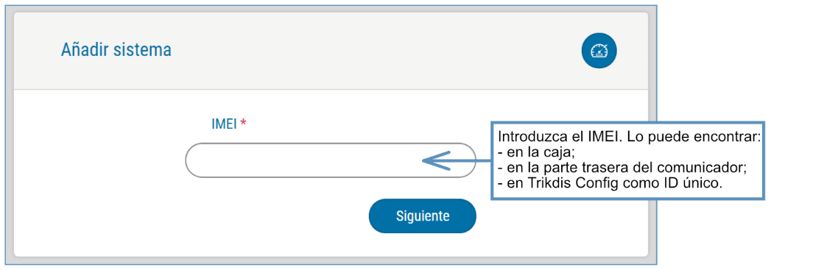

!!! note
    Al agregar G16 a Protegus, revise si:
    
    1.  La tarjeta SIM insertada ha sido activada y el código PIN ha sido
        ingresado o deshabilitado;
    
    2.  La fuente de alimentación está conectada (el LED de "PODER" debe
        iluminarse de color verde);
    
    3.  Estar registrado en la red (el LED de "NETWORK de iluminarse de
        color verde y parpadear de color amarillo);
    
    4.  La servicio Protegus está activada. Podrá encontrar información
        sobre como activar la nube en la sección 7.3 Ventana de "Informes
        para Usuario". O un mensaje SMS enviado a G16:
        **123456  CONNECT  PROTEGUS=ON,  APN=INTERNET**.
    
    Si el LED de "NETWORK" o "DATA" se ilumina de color amarillo, el
    producto a fallado en su intento de conexión con la red celular y/o
    Protegus.
### Configuraciones adicionales para armar/desarmar el sistema con la zona keyswitch

!!! note
    La zona de panel de control, donde la salida del G16 se encuentra
    conectada, tiene que ser establecida a modo de keyswitch.
Siga las instrucciones de abajo si el panel de control no será controlado de forma directa, pero con la salida del G16 PGM, prendiendo/apagando el panel de control de la zona de keyswitch.

1.  De clic en “Next” después de ingresar el número “IMEI/Unique ID”. En la nueva ventana de clic en “Areas”. En la siguiente ventana especifique cuantas áreas de sistema de alarma (1 o 2) están en el sistema y presione “Siguente”.

    

2.  En la nueva ventana, identifique cuál es el número para cada una de las áreas especificadas en el sistema y presione “Guardar”.

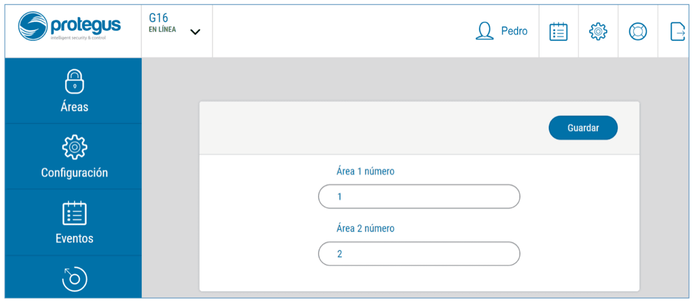

3. En el menú lateral, presione “Configuración” y en la nueva ventana presione “Configuración”. Seleccione la casilla de “Armado/Desarmado con PGM” y especifique que área de salir será controlada. Una salida PGM puede controlar sólo un área (PGM 1 – Área 1, PGM 2 – Área 2).

2.  Seleccione el Nivel o Pulso, dependiendo del tipo de la zona keyswitch del panel de control. También puede cambiar la duración o intervalo de pulso si es requerido para el panel de control conectado.

    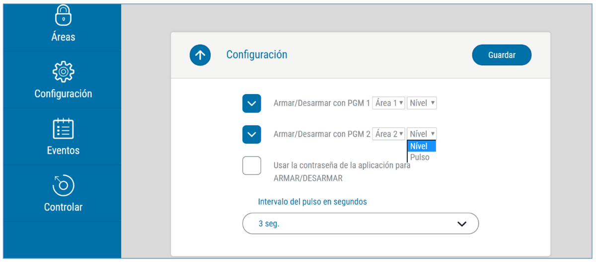

### Control del sistema con Protegus

1.  Para controlar el sistema, vaya a la ventana de “Area”.

2.  En la ventana de “Area” de clic en el botón de área. En la nueva ventana seleccione la acción (Armar o Apagar el área de sistema de seguridad).

3.  Si es solicitado, ingrese el código de usuario o la contraseña de Protegus.

    

## Configuración Remota

!!! note
    La configuración remota sólo funcionará sí:
    
    1.  La tarjeta SIM insertada ha sido activada y el código PIN ha sido
        ingresado o deshabilitado;
    
    2.  La fuente de alimentación está conectada (el LED de "PODER" debe
        iluminarse de color verde);
    
    3.  Estar registrado en la red (el LED de "NETWORK de iluminarse de
        color verde y parpadear de color amarillo);
    
    4.  La servicio Protegus está activada. Podrá encontrar información
        sobre como activar la nube en la sección 7.3 Ventana de "Informes
        para Usuario". O un mensaje SMS enviado a G16:
        **123456  CONNECT  PROTEGUS=ON,  APN=INTERNET**.
1.  En su PC abra el software de configuración de TrikdisConfig.

2.  En la sección de acceso remoto ingrese el IMEI/número único de ID. Este número puede ser encontrado en el dispositivo y en la etiqueta del empaque.
1.  (Opcional) en el espacio del nombre de Sistema ingrese el nombre deseado para el comunicador.

2.  Presione **Configuracion**.

3.  En la nueva ventana de clic en **Leer [F4].**

4.  A petición, ingrese el código del administrador o instalador. Para guardar la contraseña, seleccione “Recordar contraseña” en la ventana principal.

5.  Establezca las opciones deseadas y presione **Escribir [F5].**

## Descripción de la ventana de TrikdisConfig 

### Descripción de la barra de estado de TrikdisConfig 

Cuando el G16 está conectado, TrikdisConfig mostrará información en la barra de estado sobre el dispositivo conectado.

| Nombre | Descripción |
|----|----|
| IMEI/​ID único | Número IMEI del dispositivo |
| Estado | Estado operativo |
| Dispositivo | Tipo de dispositivo (debe mostrar G16_xxxx) |
| SN | Número de serie del dispositivo |
| BL | Versión del Bootloader |
| FW | Versión de firmware del dispositivo |
| HW | Versión de hardware del dispositivo |
| Estado | Tipo de conexión con el programa (USB o remoto) |
| Propósito | Muestra el nivel de acceso (se muestra después de ingresar un código de acceso) |

Cuando se hace clic en el botón **Leer [F4]**, el programa leerá y mostrará la configuración almacenada en el G16. Con TrikdisConfig, puedes modificar la configuración deseada de acuerdo con las descripciones de las ventanas del programa que se muestran a continuación.

### Ventana de “Ajustes del sistema”

**Grupo de opciones “General”**

- Ingrese el ID del objeto (número de 4 caracteres hexadecimales, provistos por el CRA. **No utilice números de objeto FFFE, FFFF.**).

- Seleccione el **Tipo de panel** con el que se conectará al comunicador.

- **Control directo** – cuando la casilla haya sido seleccionada, el G16 controlará de forma remota y directa el panel de control. Esta opción será visible sólo para los paneles controlados de forma directa. Para un control directo de los paneles de control, usted necesita cambiar la configuración del panel, como se describe en la sección 4, “Programando el panel de control para leer eventos y control directo”.

- **Contraseña de descarga de PC/Panel UDL passcode** – para tener un control directo de los paneles de control de Paradox y Texecom usted deberá ingresar la contraseña PC/UDL. Debe ser igual a la contraseña que fue ingresada en el panel de control. El cómo cambiar la contraseña está descrito en la sección 4 “Programando el panel de control para leer notificaciones y tener control directo”.

- **Tipo de entrada IN** – seleccione el tipo de entrada de la lista (NO, NC, NO/EOL, NO/DEOL, NC/DEOL).

- **Funcionamento de las salidas OUT1 y OUT2** – seleccione la función de salida de la lista.

- **Tiempo** **de sincronización** – establezca el tiempo de sincronización (el comunicador usará el tiempo del servidor seleccionado).

**Grupo de opciones de “Acceso”**

Al configurar el comunicador G16 hay dos niveles de acceso para el administrador e instalador:

- **Código de administrador** – permite el acceso a los campos de configuración.

- **Código de instalador** – acceso limitado para configurar el comunicador.

- **Sólo un administrador puede restaurar -** si esta casilla ha sido seleccionada, las configuraciones de fábrica pueden ser restauradas con tan sólo ingresar el código del administrador.

- **Permitir que el instalador cambie** – puede especificar que opciones pueden ser cambiadas por el instalador.

!!! note
    Los códigos de Administrador y de Instalador deben consistir de 6
    dígitos o caracteres en latín.
### Ventana de “Informes CRA”

**Pestaña de parámetros “CRA”**

Los eventos pueden ser enviados a través de varios canales de comunicación. Los primeros y segundos canales de comunicación pueden ser operados de forma simultánea y el comunicador puede enviar eventos a dos receptores al mismo tiempo. El canal de respaldo puede ser asignado para los primeros y segundos canales, los cuales serán usados cuando la conexión al canal primario es interrumpida.

La comunicación está codificada y está protegida por una contraseña. El receptor TRIKDIS es requerido para recibir y enviar información de evento a los software de monitoreo.

- **Para conectarse a través de IP** – software receptor IPcom Windows/Linux, hardware IP/SMS receptor RL14 o receptor multicanal RM14.

- **Para recibir mensajes SMS** – hardware IP/SMS receptor RL14, receptor multicanal RM14 o receptor SMS GM14.

- Lac comunicación SMS es particularmente útil como canal de respaldo, porque funciona aún cuando no hay conexión de internet móvil. No recomendamos el SMS como canal primario.

**Grupo de opciones del “Canal de comunicación principal”**

- **Modo** – seleccione que método de conexión será usado: IP o SMS.

- **Protocolo** – seleccione en que tipo de código serán enviados los eventos: **TRK** (a receptor TRIKDIS), **DC-09_2007** o **DC-09_2012** (a receptores universales), **TL150** (a receptor SUR-GARD).

- **Clave de cifrado TRK** – Ingrese la llave de encriptación que está establecida en el receptor.

- **Dominio o IP** – ingrese la dirección del dominio o IP del receptor.

- **Puerto** – ingrese el número del puerto de la red.

- **TCP o UDP** – seleccione en que protocolo (TCP o UDP) deberían ser enviados los eventos.

- **Número de teléfono (sólo mensajes SMS)** – ingrese el número de teléfono para enviar los mensajes SMS codificados al receptor GM14 SMS de TRIKDIS. El número de teléfono debe empezar con el código de su país (por ejemplo. 370xxxxxxxx).

**Grupo de opciones de “Segundo canal”**

Los eventos de este canal son transmitidos en paralelo con el primer canal. Cuando el segundo canal es habilitado, los eventos pueden ser enviados de forma simultanea por dos receptores (por ejemplo., estaciones de monitoreo local y centralizado) Las opciones del canal paralelo son las mismas que las descritas anteriormente.

Grupo de opciones de “Modo del canal de reserva”

Habilite el modo de respaldo de canal para enviar eventos a través de canales de respaldo si la conexión se ha perdido. Las opciones de los canales de respaldo son las mismas que las descritas arriba.

Número SMS de respaldo de reporte

Los mensajes SMS de respaldo son enviados cuando no pueden ser transmitidos a través del primer y el segundo canal, y también a través del canal de respaldo. Es especialmente útil porque funciona aún cuando no hay conexión IP en la red móvil del operador.

Este canal es operacional cuando el modo de IP es establecido en el primero canal y en su canal de respaldo.

Las notificaciones SMS serán enviadas al CRA del receptor SMS: 1) Inmediatamente después de la primera vez que empieza a funcionar; y 2) si la conexión TCP/IP o UDP/IP es interrumpida en el primer canal y en el canal de respaldo.

- **Número SMS de respaldo de reporte** – ingrese el número de teléfono para el CRA del receptor GM14 de TRIKDIS. El número de teléfono debe empezar con el código de su país (por ejemplo., 370xxxxxxxx).

**Pestaña de “Ajustes”**

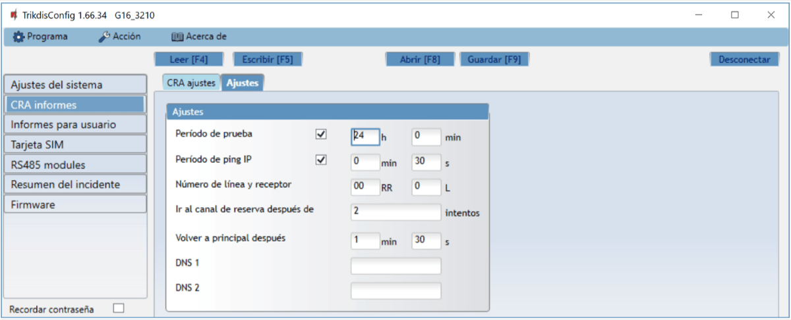

**Grupo “Ajustes”**

- **Periodo de prueba** – el periodo de evento de PRUEBA para la prueba de la conexión. Los eventos de prueba son enviados como mensajes de Contacto ID y son reenviados al software de monitoreo.

- **Periodo de ping IP** – periodo para enviar corazonadas PING internas. Estos mensajes sólo son enviados a través del canal GPRS. El receptor no reenviara los mensajes PING al software de monitoreo para evitar sobre cargarlo. Las notificaciones sólo serán enviadas al software de monitoreo si el receptor falla en recibir los mensajes PING del dispositivo dentro de un lapso de tiempo establecido.

Por defecto, la notificación de “Conexión perdida” será transmitida al software de monitoreo si el mensaje PING no es recibido en el receptor en tiempos mayores al establecido en el dispositivo. Por ejemplo, si el PING es establecido para 3 minutos, el receptor transferirá la notificación de “Conexión perdida” si no recibe un PING en los próximos 9 minutos.

Las corazonadas de PING mantienen la sesión activa de comunicación entre el dispositivo y el receptor. Una sesión activa es requerida para conexiones remotas, control y configuración del dispositivo. Recomendamos establecer un periodo de PING no mayor a 5 minutos.

- **Ir al canal de reserva después de .... intentos** – indica el número de intentos fallidos al tratar de enviar el mensaje a través del canal primario. Si es dispositivo falla en la transmisión un número especifico de veces, el dispositivo se conectará para transmitir el mensaje a través del canal de Respaldo.

- **Volver a principal después** – tiempo en el que después el G16 intentará reconectarse y transmitir mensajes a través de un canal Primario.

- **DNS1, DNS2** – (Sistema de Nombre de Dominio) identifica el servidor que especifica la dirección IP del dominio. Usada cuando el dominio está establecido en el campo de canal de comunicación de Dominio o IP (no dirección IP). Las opciones por defecto son direcciones de servidores DNS establecidas por Google.

**Grupo de opciones de “Configuración DC-09”**

Las opciones son mostradas cuando el protocolo DC-09_2007 o DC-09_2012 es establecido en el campo de Protocolo del canal de comunicación para enviar eventos a los receptores universales.

- **ID de objeto en DC-09** – ingrese el número del objeto. Si la codificación DC-09 es seleccionada, el número del objeto ingresado en el campo será usado. Se puede ingresar un número hexadecimal de 3 a 16 caracteres. El número es provisto por el centro de recibimiento de alarmas.

- **Núm. de línea DC-09** – ingrese el número de línea en el receptor.

- **Núm. de receptor DC-09** - ingrese el número del receptor

### Ventana de “Informes para usuario” 

**“Pestaña de la “Servicio Protegus”**

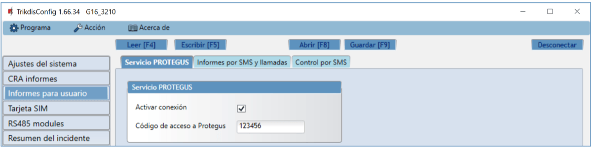

- **Activar conexión** – permita que el comunicador se conecte a la nube de Protegus.

- **Código de acceso a Protegus** – aquí puede cambiar la contraseña para conectarse al servidor de Protegus (por defecto esta es – 123456). Si la contraseña ha sido cambiada usted tendrá que reingresarla cuando agregue el sistema en la app de Protegus. Esta es una medida de seguridad adicional.

**Grupo de “Informes por SMS y llamadas”**

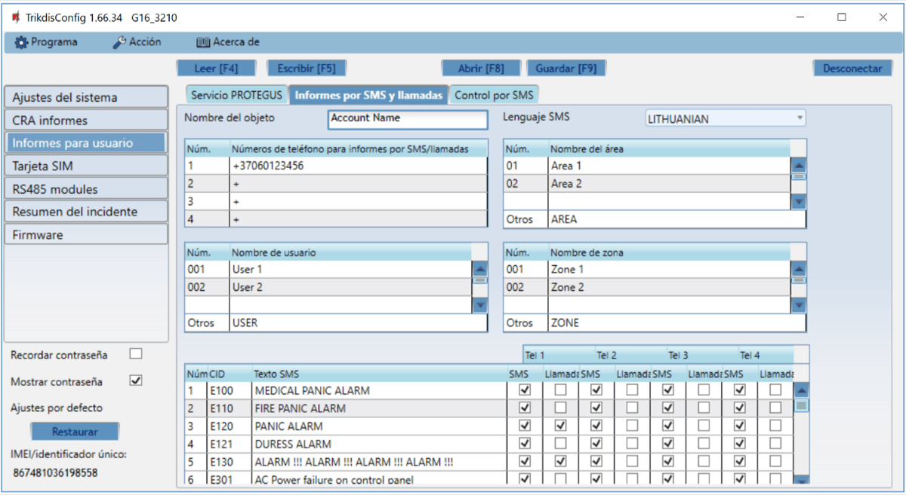

Las notificaciones sobre los eventos del sistema pueden ser transmitidas a los celulares de los usuarios a través de mensajes SMS o llamadas telefónicas.

- **Nombre del objeto** – de el nombre para el sistema en el cual se encuentra conectado el comunicador. Cada notificación SMS será transmitida con el nombre del objeto.

- **Lenguaje SMS** – seleccione el idioma requerido para las notificaciones SMS (los mensajes SMS pueden ser enviados en diferentes caracteres).

- **Números telefónicos para informes SMS/Llamadas** – ingrese hasta 4 números de teléfono de usuarios para enviar mensajes de eventos o hacer llamadas. Los números de teléfono deben empezar con el código del país, por ejemplo +370xxxxxxxx, 00370xxxxxxxx o 370xxxxxxxx.

- **Tablas “Nombre de área”, “nombre de usuario”, Nombre de zona”** – cada usuario, zona o área podrían tener un nombre mque serán usados en mensajes SMS de evento. Ingrese el número del usuario, zona o área en la tabla apropiada e ingrese el nombre a un lado del número.

- Tabla de Evento **CID** – usted puede cambiar los números de teléfono para enviar notificaciones de evento o hacer llamadas sobre cada evento registrado.

Puede cambiar los textos por mensajes SMS de eventos base, cambiar el código del ID de contacto (CID) e ingresar nuevos eventos con descripciones.

**Pestaña de “Control por SMS”**

Puede enviar comando SMS al comunicador que controlará las funciones básicas del dispositivo.

- **Texto de respuesta SMS** – usted puede cambiar el texto del SMS que el dispositivo enviará cuando recibe un comando.

- **Números de teléfono para el control remoto** – usted puede ingresar los números de teléfono para enviar comandos al dispositivo. El dispositivo recibirá y ejecutará estos comandos.

!!! note
    Si no se ingresó ni un número telefónico, el dispositivo aceptará
    comandos de cualquier número. En cualquier caso, la seguridad es
    garantizada por el requerimiento de ingresar la contraseña del
    administrador o instalador en el comando SMS.
**Lista de comando SMS**

Asegúrese de que la tarjeta SIM ha sido activada y funciona, antes de usarla.

Si se usará internet móvil para enviar notificaciones a través del canal IP o a Protegus, asegúrese de que el servicio de datos móviles esté habilitado.

| Comndo | Dato | Descripción |
|--------|------|-------------|
| INFO |  | Petición para obtener información sobre el dispositivo. La respuesta será: tipo de comunicador, número IMEI, número serial y versión. Por ejemplo: versión del firmware. / Por ejemplo: 123456 INFO |
| RESET |  | Reinicie el dispositivo. Por ejemplo: 123456 RESET |
| OUTPUTx | ON | Prendiendo la salida, donde “x” identifica el número de salida (1 o 2). / Por ejemplo: 123456 OUTPUT1 ON |
| OUTPUTx | OFF | Apagando la salida, donde “x” identifica el número de salida (1 o 2). / Por ejemplo: 123456 OUTPUT1 OFF |
| OUTPUTx | PULSE tttt | Prendiendo la salida en modo de impulso, por el intervalo de tiempo especificado (seg). / “x” es el número de la salida, “tttt” es la duración del impulso en segundos, descrita en 4 dígitos. Por ejemplo: 123456 OUTPUT2 PULSE=0005 / (prenda salida OUT2 en modo impulso por 5 segundos.) |
| CONNECT | Protegus=ON | Conéctese a la nube de Protegus. Por ejemplo: 123456 CONNECT PROTEGUS=ON |
| CONNECT | Protegus=OFF | Desconéctese de la nube de Protegus Por ejemplo: 123456 CONNECT PROTEGUS=OFF |
| CONNECT | IP=0.0.0.0:8000 | Establecer el canal TCP IP de conexión IP primaria y Puerto. / Por ejemplo: 123456 CONNECT IP=192.120.120.255:8000 |
| CONNECT | ENC=123456 | Llave de encriptación TRK. Por ejemplo: 123456 CONNECT ENC=123456 |
| CONNECT | APN=Internet | Nombre APN. Por ejemplo: 123456 CONNECT APN=INTERNET |
| CONNECT | USER=user | Usuario APN. Por ejemplo: 123456 CONNECT USER=User |
| CONNECT | PASS=password | Contraseña APN. Por ejemplo:.: 123456 CONNECT PASS=Password |
| CONNECT | CP= | Número del panel de control de la lista de paneles de control. Por ejemplo: (para G16 asigne panel de control Paradox SP6000, siendo este el cuarto en la lista): / 123456 CONNECT CP=4 |
| CONNECT | DIR= | Contraseña de 4 dígitos para el control directo o OFF para apagarlo. / Por ejemplo: (la contraseña de 4 dígitos 1122 está establecida para el control directo): 123456 CONNECT DIR=1122 |

### Ventana de “Tarjeta SIM”

!!! note
    1.  Asegúrese de que la tarjeta SIM ha sido activada y funciona, antes
        de usarla.
    
    2.  Si se usará internet móvil para enviar notificaciones a través del
        canal IP o a Protegus, asegúrese de que el servicio de datos móviles
        esté habilitado.
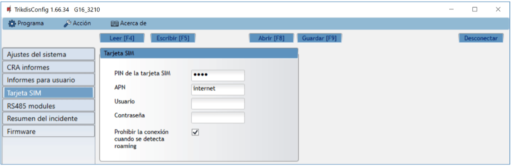

**Grupo de opciones de la “tarjeta SIM”**

- **Pin de la tarjeta SIM** – Ingrese el código PIN de la tarjeta SIM. Este código puede ser deshabilitado al insertar la tarjeta SIM en el celular.

- **APN** – ingrese el APN (Nombre de Punto de Acceso). Es requerido para conectar el comunicador al internet. El APN puede ser encontrado en el sitio web del operador de la tarjeta SIM (el “Internet” es universal y funciona en muchas redes de los operadores.

- **Usuario** - contraseña: ingrese el nombre de usuario y la contraseña para APN si es necesario.

- **Contraseña** – si se requiere, ingrese el nombre de usuario (inicio de sesión) y contraseña para conectarse a internet.

- **Prohibir la conexión cuando se detecta roaming** – usted puede usar esta función cuando el sistema de seguridad está instalado cerca de la frontera de un país. Esta función previene que el comunicador opere en la red GSM de otro país.

### Ventana de “RS485 modules”

Grupo de opciones de “Modules list”

- **ID** – número del módulo en la lista.

- **Tipo de módulo** – seleccione el módulo que usted utiliza de la lista de módulos.

- **Serial Núm.** – número compulsorio de 6 dígitos, el cual está indicado en la etiqueta en la cuja del módulo y en el paquete.

Después de seleccionar el expansor conectado e introducir su número de serie, pulse el botón **Escribir[F5].** Cuando se escriba el cambio, desconecte el cable USB Mini-B del comunicador. Espere un minuto (el comunicador debe registrar el expansor conectado). Conecte el cable USB Mini-B al comunicador. Haga clic en el botón **Leer[F4]**. Vaya a los **RS485 modules** → **Module 1**.

**Pestañas “Module 1”**

Después de añadir el expansor al comunicador como se ha descrito en el párrafo anterior, en la ventana de los **RS485 modules** aparecerá una nueva pestaña con los ajustes de este módulo. A la pestaña se le asignará un número. A continuación se describen los ajustes para los expansores de las series iO-8 e iO, para el módulo WiFi W485, para el módulo ethernet E485.

#### Ventana de ajustes del expansor iO-8

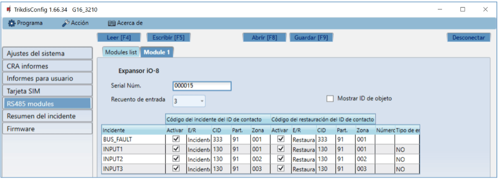

El expansor iO-8 tiene 8 contactos de terminal universales (entrada/salida). Se pueden conectar hasta cuatro expansores iO-8.

- **Recuento de entrada -** seleccione el número de contactos de la terminal que deben configurarse en modo de entrada (IN). El resto de los contactos de la terminal se convertirán en salidas (OUT).

Los ajustes para las salidas controlables se establecen directamente en la aplicación Protegus. Allí se puede asignar una salida para armar/desarmar el sistema de alarma o para el control remoto de los dispositivos.

En la tabla se pueden asignar entradas de eventos de Contacto ID y códigos de restauración. Después de que se activa la entrada, el comunicador enviará un evento con el código de evento establecido al receptor en el CRA, a la aplicación Protegus y vía SMS (al número de teléfono del usuario).

**Código del incidente del ID de contacto:**

- **Activar -** permite la transmisión de mensajes cuando se activa la entrada.

- **E/R -** elija qué tipo de evento se enviará cuando se active la entrada, **Evento** o **Restaurar**.

- **CID -** asigne un código de evento de ID de contacto a la entrada.

- **Part. -** asigne la partición (área) a la entrada. Esta se ajusta automáticamente: si el número de módulo es 1, la superficie es 91; si el número de módulo es 4, la superficie es 94.

- **Zona -** establezca el número de zona para la entrada.

**Código del restauración del ID de contacto:**

- **Activar -** permite la transmisión de mensajes cuando se restaura la entrada.

- **E/R -** elija qué tipo de evento se enviará cuando se restaure la entrada, **Restaurar** o **Evento**.

- **CID -** asigne un código de restauración del ID de contacto a la entrada.

- **Part. -** asigne la partición (área) a la entrada. Esta se ajusta automáticamente: si el número de módulo es 1, la superficie es 91; si el número de módulo es 4, la superficie es 94.

- **Zona -** establezca el número de zona para la entrada.

- **Número de objeto** - al IN se le puede asignar un número de objeto, que será diferente del número de objeto del comunicador G16.

- **Tipo de entrada -** seleccione el tipo de entrada (NO o NC).

Para que los clientes reciban mensajes SMS o llamadas anunciando los activadores de la entrada, introduzca el código de evento de Contacto ID que se asigna a la entrada de la tabla en la pestaña **“SMS & Call Reporting”** (“Informes vía SMS y llamada”).

#### Ventana de ajustes del expansor iO

El expansor iO dispone de: terminales para 1 entrada, 1 salida (contactos de relé) y bus serie 1-Wire para la conexión de sensores de temperatura.

- **Tipo de entrada IN1 -** ajuste el tipo de entrada (NO o NC).

- **Max ºC (T1) -** cuando la temperatura es superior a esta configuración, se genera un mensaje de evento. Para que se genere un mensaje de evento, éste debe estar habilitado en la tabla.

- **Min ºC (T2**) - cuando la temperatura es inferior a esta configuración, se genera un mensaje de evento. Para que se genere un mensaje de evento, éste debe estar habilitado en la tabla.

En la tabla se pueden asignar entradas de eventos de Contacto ID y códigos de restauración. Después de que se activa una entrada, el comunicador enviará un evento con el código de evento establecido al receptor en el CRA y a la aplicación Protegus. Ajuste la configuración como se describe en la página anterior acerca de la **Ventana de ajustes del expansor iO-8**.

**Ventana de configuración del módulo WiFi *W485***

- **DHCP Modo** - modo del módulo WiFi para registrarse en la red (manual (Estática) o automático (DHCP)).

- **IP estática** - dirección IP estática para cuando se establece el modo de registro manual.

- **Subnet mask** - máscara de subred para cuando se establece el modo de registro manual.

- **Predeterminado gateway** - dirección de Puerto de enlace para cuando se establece el modo de registro manual.

- **WiFi SSID nombre** - nombre de la red WiFi a la que se conectará el W485.

- **WiFi SSID contraseña** - contraseña de red WiFi.

En la tabla, puede asignar el evento de Contacto ID y códigos de restauración al evento de error del bus de datos RS485. Cuando se interrumpe o restablezca la conexión entre el W485 y el G16, el G16 enviará un mensaje con el código CID asignado al CRA y a la aplicación Protegus.

!!! note
    Debe configurar el G16 para enviar mensajes a CRA y Protegus,
    consulte los capítulos 2.2 "Configuración para conectarse con el CRA" y.
    2.1 "Opciones de conexión para la app Protegus". / **Inserte la tarjeta
    SIM en el comunicador *G16* para que funcione el *W485*.**
#### Ventana de configuración del módulo ethernet *E485*

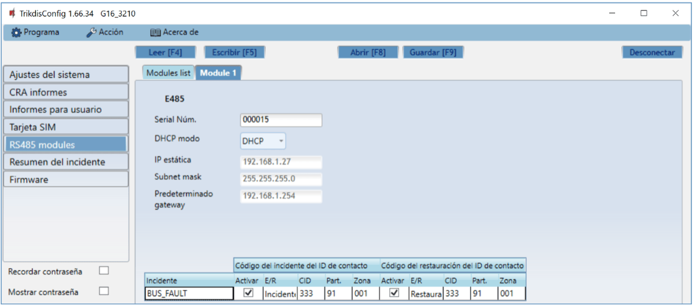

- **DHCP Modo** - modo del módulo ethernet para registrarse en la red (manual (Estática) o automático (DHCP)).

- **IP estática** - dirección IP estática para cuando se establece el modo de registro manual.

- **Subnet mask** - máscara de subred para cuando se establece el modo de registro manual.

- **Predeterminado gateway** - dirección de Puerto de enlace para cuando se establece el modo de registro manual.

En la tabla, puede asignar el evento de Contacto ID y códigos de restauración al evento de error del bus de datos RS485. Cuando se interrumpe o restablezca la conexión entre el E485 y el G16, el G16 enviará un mensaje con el código CID asignado al CRA y a la aplicación Protegus.

!!! note
    Debe configurar el G16 para enviar mensajes a CRA y Protegus,
    consulte los capítulos 2.2 "Configuración para conectarse con el CRA" y.
    2.1 "Opciones de conexión para la app Protegus". / **Inserte la tarjeta
    SIM en el comunicador *G16* para que funcione el *E485*.**
### Ventana de “Resumen del incidente” 

Esta ventana le permitirá prender, apagar y modificar los mensajes internos enviados por su dispositivo. Deshabilitar el mensaje interno en esta ventana prevendrá que sea enviado a pesar de otras opciones.

### Restablecer la configuración predeterminada 

Para restablecer la configuración predeterminada del G16, haz clic en el botón **Restaurar** en TrikdisConfig.

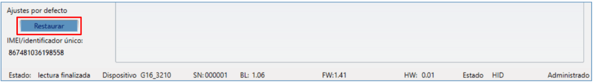

### Desempeño de la Prueba del Comunicador 

Después de que la configuración y la instalación hayan sido completadas, lleve a cabo una prueba de sistema:

Genere un evento:

1.  Generar un evento:

- Armando y desarmando sistemas de seguridad;

- Activando una alarma de zona cuando el sistema de seguridad esté armado.

1.  Asegúrese de que el evento llegue al CRA y/o sea recibido en la aplicación de Protegus.

2.  Para probar una entrada del comunicador, actívelos de forma remota y asegúrese de que los mensajes correctos lleguen a los recipientes, y que la salida se active como debe.

3.  Si el panel de control será controlado de forma remota, arme/desarme el sistema de seguridad de forma remota al usar la app Protegus.

### Actualización del firmware 

!!! note
    Cuando el comunicador esté conectado a TrikdisConfig, el programa
    ofrecerá actualizar el firmware del dispositivo si es que hay alguna
    actualización disponible. Las actualizaciones requieren una conexión al
    internet.
El firmware del comunicador puede ser actualizado o cambiado de forma manual. Después de una actualización, el comunicador mantendrá cualquier opción establecida. Cuando escriba el firmware de forma manual, este puede ser cambiado a una versión más reciente o antigua. Para actualizar:

1.  Abra ***TrikdisConfig**.*

2.  Conecte el comunicador a través de cable USB a la computadora o conéctese al comunicador de forma remota.

    - Si existe una versión más nueva del firmware, el software ofrecerá descargar el archivo de la versión más nueva del firmware.

3.  Seleccione la parte de Firmware del menú.

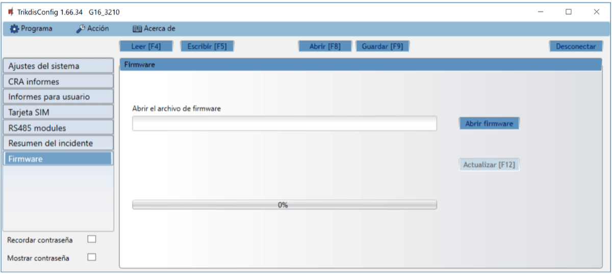

4. Presione Abrir firmware y seleccione el archivo de firmware requerido.

    - Si no tiene el archivo, el archivo de la versión más nueva del firmware puede ser descargado por usuario registrado desde [www.trikdis.com](http://www.trikdis.com), bajo la sección de descargar del comunicador G16.

2.  Presione **Actualizar [F12]**.

3.  Espere a que se complete la actualización.

!!! note
    Si hay un antivirus instalado en su computadora, puede que este bloquee
    la opción de actualización de firmware. En este caso usted debe
    reconfigurar su software de antivirus.
## Requerimientos de Seguridad 

El sistema de alarma de seguridad deberá ser instalado y mantenido por personal calificado.

Antes de la instalación, por favor lea con cuidado este manual, para poder evitar cualquier error que lleve al mal funcionamiento o incluso daño del equipo.

Desconecte la fuente de alimentación antes de hacer cualquier conexión eléctrica.

Los cambios, modificaciones o reparaciones no están autorizadas por el fabricante, y esto eliminará sus derechos a una garantía.

Por favor actúe de acuerdo a sus reglas locales y no se deshaga de su sistema de alarma sin uso o sus componentes con otro desecho normal de su casa.

## Anexo

El comunicador puede funcionar con un receptor SUR-GARD. El comunicador recibidos desde panel de alarma los códigos de Contacto ID convierte a códigos SIA.

**Tabla de conversión de los códigos Contacto ID a código SIA**

| **Evento del sistema** | **Código de informe CID** | **Código de informe de SIA** |
|----|:--:|:--:|
| Alarma médica | E100 | "MA" |
| Emergencia personal | E101 | "QA" |
| Incendio en la zona: <z> | E110 | "FA" |
| Flujo de aguas detectado en la zona: <z> | E113 | "SA" |
| Alarma de la estación manual en la zona: <z> | E115 | "FA" |
| Pánico en la zona: <z> | E120 | "PA" |
| Alarma de pánico por el usuario: <v> | E121 | "HA" |
| Alarma de pánico en la zona: <z> | E122 | "HA" |
| Alarma de pánico en la zona: <z> | E123 | "PA" |
| Alarma de pánico en la zona: <z> | E124 | "HA" |
| Alarma de pánico en la zona: <z> | E125 | "HA" |
| Alarma activa en la zona: <z> | E130 | "BA" |
| Alarma activa en la zona: <z> | E131 | "BA" |
| Alarma activa en la zona: <z> | E132 | "BA" |
| Alarma activa en la zona: <z> | E133 | "BA" |
| Alarma activa en la zona: <z> | E134 | "BA" |
| Alarma activa en la zona: <z> | E135 | "BA" |
| Tamper activo en la zona: <z> | E137 | "TA" |
| Intrusión verificada en la zona: <z> | E139 | "BV" |
| Alarma activa en la zona: <z> | E140 | "UA" |
| Fallo del sistema (143) | E143 | "UA" |
| Tamper activo en la zona: <z> | E144 | "TA" |
| Tamper activo en la zona: <z> | E145 | "TA" |
| Alarma activa en la zona: <z> | E146 | "BA" |
| Alarma activa en la zona: <z> | E150 | "UA" |
| Gas detectado en la zona: <z> | E151 | "GA" |
| Pérdida de agua detectada en la zona: <z> | E154 | "WA" |
| Foil Rotura detectado en la zona: <z> | E155 | "BA" |
| Alta temperatura en el sensor: <n> | E158 | "KA" |
| Baja temperatura en el sensor: <n> | E159 | "ZA" |
| CO detectado en la zona: <z> | E162 | "GA" |
| Falla en zona de fuego: <z> | E200 | "FS" |
| Monitoreo de alarma | E220 | "BA" |
| Fallo del sistema (300) | E300 | "YP" |
| Pérdida de fuente de alimentación AC | E301 | "AT" |
| Batería baja | E302 | "YT" |
| Fallo del sistema (304) | E304 | "YF" |
| Reiniciar sistema en zona: <z> | E305 | "RR" |
| Programación del panel modificada | E306 | "YG" |
| Apagado del sistema | E308 | "RR" |
| Fallo en la batería (309) | E309 | "YT" |
| Fallo de toma a tierra | E310 | "US" |
| Fallo en batería (311) | E311 | "YM" |
| Sobrecarga en fuente de alimentación (312) | E312 | "YP" |
| Restablecimiento del ingeniero por usuario: <v> (313) | E313 | "RR" |
| Fallo en Sirena/Relé | E320 | "RC" |
| Fallo del sistema (321) | E321 | "YA" |
| Fallo del sistema (330) | E330 | "ET" |
| Fallo del sistema (332) | E332 | "ET" |
| Fallo del sistema (333) | E333 | "ET" |
| Fallo del sistema (336) | E336 | "VT" |
| Fallo del sistema (338) | E338 | "ET" |
| Fallo del sistema (341) | E341 | "ET" |
| Fallo del sistema (342) | E342 | "ET" |
| Fallo del sistema (343) | E343 | "ET" |
| Fallo del sistema (344) | E344 | "XQ" |
| Fallo de comunicación del sistema (350) | E350 | "YC" |
| Fallo de comunicación del sistema (351) | E351 | "LT" |
| Fallo de comunicación del sistema (352) | E352 | "LT" |
| Fallo del sistema (353) | E353 | "YC" |
| Fallo de comunicación del sistema (354) | E354 | "YC" |
| Fallo del sistema (355) | E355 | "UT" |
| Problema de fuego en zona: <z> | E373 | "FT" |
| Problema en la zona: <z> | E374 | "EE" |
| Problema en la zona: <z> | E378 | "BG" |
| Problema en la zona: <z> | E380 | "UT" |
| Avería en zona inalámbrica: <z> | E381 | "US" |
| Fallo del módulo inalámbrico (382) | E382 | "UY" |
| Tamper activo en la zona: <z> | E383 | "TA" |
| Batería baja en zona inalámbrica: <z> | E384 | "XT" |
| Problema en la zona: <z> (389) | E389 | "ET" |
| Problema en la zona: <z> (391) | E391 | "NA" |
| Problema en la zona: <z> (393) | E393 | "NC" |
| Usuario <v> desarmó el sistema | E400 | "OP" |
| Usuario <v> desarmó el sistema | E401 | "OP" |
| Desarme automático | E403 | "OA" |
| Desarmado diferido <v> usuario | E405 | "OR" |
| Alarma cancelada por el usuario: <v> | E406 | "BC" |
| Usuario <v> desarmó de forma remota | E407 | "OP" |
| Usuario <v> armó rápido | E408 | "OP" |
| Desarmado remoto | E409 | "OS" |
| Solicitud de devolución de llamada realizada por CRA | E411 | "RB" |
| Descarga de datos realizada con éxito | E412 | "RS" |
| Acceso denegado para el usuario: <v> | E421 | "JA" |
| Entrada por usuario <v> | E422 | "DG" |
| Acceso Forzado <z> zona | E423 | "DF" |
| Acceso de salida denegado para el usuario <v> | E424 | "DD" |
| Salida usuario <v> | E425 | "DR" |
| Usuario <v> desarmó demasiado pronto | E451 | "OK" |
| Usuario <v> armó el sistema demasiado tarde | E452 | "OJ" |
| Usuario <v> Falló al abrir | E453 | "CT" |
| Usuario <v> Falló al cerrar | E454 | "CI" |
| Auto armado fallido | E455 | "CI" |
| Armado parcial por el usuario: <v> | E456 | "CG" |
| Violación de salida por usuario: <v> | E457 | "EE" |
| Armado parcial por el usuario: <v> | E458 | "OR" |
| Recent arm <v> user | E459 | "CR" |
| Introducido código incorrecto | E461 | "JA" |
| Tiempo de auto-armado ampliado por usuario: <v> | E464 | "CE" |
| Dispositivo deshabilitado (501) | E501 | "RL" |
| Dispositivo deshabilitado (520) | E520 | "RO" |
| Sensor inalámbrico deshabilitado en la zona: <z> (552) | E552 | "YS" |
| Zona <z> anulada | E570 | "UB" |
| Zona <z> anulada | E571 | "FB" |
| Zona <z> anulada | E572 | "MB" |
| Zona <z> anulada | E573 | "BB" |
| Anulación de grupo por usuario: <v> | E574 | "CG" |
| Zona <z> anulada | E576 | "UB" |
| Bypass en zona <z> cancelado | E577 | "UB" |
| Ventilación de zona anulada | E579 | "UB" |
| Prueba de recorrido activada por usuario <v> | E607 | "TS" |
| Informe de prueba manual | E601 | "RX" |
| Informe de test periódico | E602 | "RP" |
| Evento del sistema (605) | E605 | "JL" |
| Evento del sistema (606) | E606 | "LF" |
| Problema en el informe de test periódico | E608 | "RY" |
| Evento del sistema (622) | E622 | "JL" |
| Evento del sistema (623) | E623 | "JL" |
| Hora y fecha restablecida por usuario <v> | E625 | "JT" |
| Fecha/hora inexacta | E626 | "JT" |
| Programación de sistema iniciada | E627 | "LB" |
| Programación del sistema terminada | E628 | "LS" |
| Evento del sistema (631) | E631 | "JS" |
| Evento del sistema (632) | E632 | "JS" |
| Sistema no activo (654) | E654 | "CD" |
| Alarma médica restaurada | R100 | "MH" |
| Emergencia personal restaurada | R101 | "QH" |
| No más alarma de incendio en la zona: <z> | R110 | "FH" |
| No más alarma de flujo de aguas en la zona: <z> | R113 | "SH" |
| Alarma de pánico restablecida en la zona: <z> | R120 | "PH" |
| Alarma de pánico cancelada por el usuario: <v> | R121 | "HH" |
| Alarma de pánico restablecida en la zona: <z> | R122 | "PH" |
| Alarma de pánico restablecida en la zona: <z> | R123 | "PH" |
| Alarma de pánico restablecida en la zona: <z> | R124 | "HH" |
| Alarma de pánico restablecida en la zona: <z> | R125 | "HH" |
| No más alarma en la zona: <z> | R130 | "BH" |
| No más alarma activa en la zona: <z> | R131 | "BH" |
| No más alarma activa en la zona: <z> | R132 | "BH" |
| No más alarma en la zona: <z> | R133 | "BH" |
| No más alarma en la zona: <z> | R134 | "BH" |
| No más alarma en la zona: <z> | R135 | "BH" |
| No más tamper en la zona: <z> | R137 | "TA" |
| No más alarma en la zona: <z> | R140 | "UH" |
| No más fallo del sistema (143) | R143 | "ER" |
| No más tamper en la zona: <z> | R144 | "TR" |
| No más tamper en la zona: <z> | R145 | "TR" |
| No más alarma en la zona: <z> | R146 | "BH" |
| No más alarma en la zona: <z> | R150 | "UH" |
| No más alarma de gas en la zona: <z> | R151 | "GH" |
| No más alarma de pérdida de agua en la zona: <z> | R154 | "WH" |
| Foil Rotura restaurado en la zona: <z> | R155 | "BH" |
| La temperatura se ha normalizado en el sensor: <n> | R158 | "KH" |
| La temperatura se ha normalizado en el sensor: <n> | R159 | "ZH" |
| No más alarma de CO en la zona: <z> | R162 | "GH" |
| No más falla en la zona de fuego: <z> | R200 | "FV" |
| Monitoreo de restauración de alarma | R220 | "BH" |
| No más fallo del sistema (300) | R300 | "YA" |
| Fuente de alimentación AC OK | R301 | "AR" |
| Batería OK | R302 | "YR" |
| No más fallo del sistema (304) | R304 | "YG" |
| Restablecimiento del sistema restaurado en la zona: <z> | R305 | "RR" |
| No más fallo en batería (309) | R309 | "YR" |
| Falla de tierra restablecido | R310 | "UR" |
| No más fallo en batería (311) | R311 | "YR" |
| Restaurar la sobrecarga de corriente de la fuente de alimentación (312) | R312 | "YQ" |
| No más fallo en Sirena/Relé | R320 | "RO" |
| No más fallo del sistema (321) | R321 | "YH" |
| No más fallo del sistema (330) | R330 | "ER" |
| No más fallo del sistema (332) | R332 | "ER" |
| No más fallo del sistema (333) | R333 | "ER" |
| No más fallo del sistema (336) | R336 | "VR" |
| No más fallo del sistema (338) | R338 | "ER" |
| No más fallo del sistema (341) | R341 | "ER" |
| No más fallo del sistema (342) | R342 | "ER" |
| No más fallo del sistema (344) | R344 | "XH" |
| No más fallo de comunicación del sistema (350) | R350 | "YK" |
| No más fallo de comunicación del sistema (351) | R351 | "LR" |
| No más fallo de comunicación del sistema (352) | R352 | "LR" |
| No más fallo del sistema (353) | R353 | "YK" |
| No más fallo de comunicación del sistema (354) | R354 | "YK" |
| No más fallo del sistema (355) | R355 | "UJ" |
| Restablecido problema de fuego en zona: <z> | R373 | "FJ" |
| No más problema en la zona: <z> | R374 | "EA" |
| No más problema en la zona: <z> | R380 | "UJ" |
| No más avería en zona inalámbrica: <z> | R381 | "UR" |
| No más fallo del módulo inalámbrico (382) | R382 | "BR" |
| No más tamper en la zona: <z> | R383 | "TR" |
| Batería OK en zona inalámbrica: <z> | R384 | "XR" |
| No más problema en la zona: <z> (391) | R391 | "NS" |
| No más problema en la zona: <z> (393) | R393 | "NS" |
| Usuario <v> armó el sistema | R400 | "CL" |
| Usuario <v> armó el sistema | R401 | "CL" |
| Armado automático | R403 | "CA" |
| Usuario <v> armó de forma remota | R407 | "CL" |
| Desarmado rápido | R408 | "CL" |
| Armado remoto | R409 | “CS” |
| Usuario <v> armó el modo Stay | R441 | "CG" |
| Usuario <v> armó demasiado pronto | R451 | “CK” |
| Usuario <v> desarmó el sistema demasiado tarde | R452 | “CJ” |
| Usuario <v> Falló al cerrar | R454 | “CI” |
| Armado parcial por el usuario: <v> | R456 | "CG" |
| Recent disarm <v> user | R459 | “CR” |
| Dispositivo habilitado (501) | R501 | "RG" |
| Dispositivo habilitado (520) | R520 | "RC" |
| Sensor inalámbrico habilitado en la zona: <z> (552) | R552 | "YK" |
| Bypass en zona <z> cancelado | R570 | "UU" |
| Bypass en zona <z> cancelado | R571 | "FU" |
| Bypass en zona <z> cancelado | R572 | "MU" |
| Bypass en zona <z> cancelado | R573 | "BU" |
| Anulación de grupo por usuario: <v> cancelada | R574 | "CF" |
| Bypass en zona <z> cancelado | R576 | "UU" |
| Bypass en zona <z> cancelado | R577 | "UU" |
| Bypass de la zona de ventilación cancelada | R579 | "UU" |
| Prueba de recorrido desactivada por usuario <v> | R607 | "TE" |
| Hora y fecha restablecida por usuario <v> | R625 | "JT" |
| Sistema activo (654) | R654 | "CD" |
